# GRACE アプリ（`./run_dev.sh`）- 画面・操作・プログラム対応 ドキュメント

**Version 2.0** | 最終更新: 2026-08-01

`./run_dev.sh` で起動するローカル開発アプリの README。**画面で何ができるか**、
**操作がどのプログラム（コンポーネント・API・関数）に対応するか**、
**押してから結果が出るまで何が起きるか**を、実装と 1:1 で対応づけて記述する。

---

## 目次

1. [概要](#概要)
2. [アーキテクチャ構成図](#1-アーキテクチャ構成図)
3. [モジュール構成図（画面構成）](#2-モジュール構成図画面構成)
4. [画面・操作とプログラムの対応表](#3-画面操作とプログラムの対応表)
5. [画面別 IPO詳細](#4-画面別-ipo詳細)
   - [4.1 共通ヘッダ（タブ切替）](#41-共通ヘッダタブ切替)
   - [4.2 GRACE-Support 画面](#42-grace-support-画面)
   - [4.3 GRACE-Review 画面](#43-grace-review-画面)
   - [4.4 HITL CONFIRM モーダル（共通）](#44-hitl-confirm-モーダル共通)
6. [設定・定数](#5-設定定数)
7. [使用例（操作シナリオ）](#6-使用例操作シナリオ)
8. [エクスポート](#7-エクスポート)
9. [変更履歴](#8-変更履歴)
10. [付録: 依存関係図](#付録-依存関係図)

---

## 画面ショット挿入位置について

本ドキュメントには**画面ショットの挿入位置**を先に確保してある。以下の記法で
埋め込み位置と撮影内容を明示しているので、撮影後に**コメントを外して**差し替える。

```markdown
> 📷 **[X-00] スロット名** — 撮影内容の説明
> <!--  -->
```

差し替え後（コメントを外した状態）:

```markdown
> 📷 **[X-00] スロット名** — 撮影内容の説明
> 
```

- 画像の置き場所: **`docs/images/`**（ディレクトリごと新規作成してよい）
- ファイル名: **スロット ID を先頭に付ける**（例 `s-01-support-initial.png`）
- 一覧は §6.4「画面ショット一覧」を参照（全 13 枚）

---

## 概要

`./run_dev.sh` は、**FastAPI（:8000）＋ Vite + React（:5173）** の 2 プロセスを同時起動する
ローカル開発用スクリプト。ブラウザで開くのは **http://localhost:5173** の 1 画面だけで、
そこから**タブ切替**で 2 つのエージェントを使い分ける。

| エージェント | コア | ルータ |
|---|---|---|
| GRACE-Support（問い合わせ → 回答） | `core/support_agent.py` | `/api/support/*` |
| GRACE-Review（文書 → 指摘） | `core/review_agent.py` | `/api/review/*` |

どちらのタブも**操作の型は同じ**である。

```
入力フォームに書く → 実行ボタン → ステップトレースが逐次流れる
  → （必要なら）承認モーダルが出る → 承認/拒否 → 結果が表示される
```

違うのは「入力が短文か長文か」「結果が回答カードか指摘リストか」だけで、
進捗表示（SSE）・承認（HITL）・エラー表示の仕組みは共通コンポーネントである。

### 主な責務

- 2 エージェントをタブで切り替え、それぞれ独立した状態・SSE 購読を持たせる
- 入力フォームから実行パラメータを組み立て、ジョブを起動する
- SSE で届くステップ進捗を、タイムライン UI へリアルタイムに畳み込む
- 副作用のあるアクションを、承認モーダル経由でユーザに確認させる
- 結果を読める形で提示する（Support = 回答カード、Review = 原文ハイライト＋指摘カード）

### 各責務対応のモジュール

| # | 責務 | 対応モジュール | 説明 |
|---|------|--------------|------|
| 1 | タブ切替 | `frontend/src/App.tsx` | `useState<Tab>`。**アンマウントで切替**（SSE を確実に閉じる） |
| 2 | Support タブ本体 | `components/SupportPanel.tsx` | 起動・購読・承認の配線 |
| 3 | Review タブ本体 | `components/ReviewPanel.tsx` | 同上＋指摘の選択状態 |
| 4 | 入力フォーム | `components/QueryForm.tsx` / `ReviewForm.tsx` | パラメータ組み立て・例文チップ |
| 5 | 進捗表示 | `components/Timeline.tsx` ＋ `StepTimeline` / `ReviewTimeline` | 表示は共通、ステップ ID とバッジはエージェント別 |
| 6 | 結果表示 | `components/AnswerCard.tsx` / `DocumentView.tsx` / `FindingList.tsx` | 回答カード／原文ハイライト／指摘カード |
| 7 | 承認 | `components/ConfirmModal.tsx` | **両エージェント共用** |
| 8 | 状態管理 | `state/jobReducer.ts` / `state/reviewReducer.ts` | SSE イベント列 → UI 状態（純 reducer・副作用ゼロ） |
| 9 | ハイライト計算 | `state/highlight.ts` | 原文の分割・重なり解消（純関数） |
| 10 | 通信 | `api/client.ts` | POST（起動・承認）＋ EventSource（進捗） |
| 11 | Web API | `backend/app/api/` | `/api/support/*` `/api/review/*` `/api/*`（meta） |
| 12 | パイプライン | `backend/app/core/` | `run_support_agent_core` / `run_review_agent_core` |

### 主要機能一覧

| 機能 | 説明 |
|------|------|
| タブ切替 | `GRACE-Support` / `GRACE-Review` を上部タブで切り替え |
| 例文チップ | ワンクリックで入力欄に例を流し込む（Support 4 種・Review 2 種） |
| 業界プロファイル選択 | Support: `gov` / `saas` / `ec`（`/api/verticals` から取得） |
| ルールセット選択 | Review: `ec_ad`（`/api/rulesets` から取得） |
| dry-run トグル | 既定 ON。アクションを実行せずログのみ |
| ステップトレース | SSE で逐次更新。ステップごとにログを折りたたみ表示 |
| HITL CONFIRM | 承認するまでアクションは実行されない |
| 原文ハイライト連動 | Review: 原文の色付き箇所 ⇄ 指摘カードを相互ジャンプ |

---

## 1. アーキテクチャ構成図

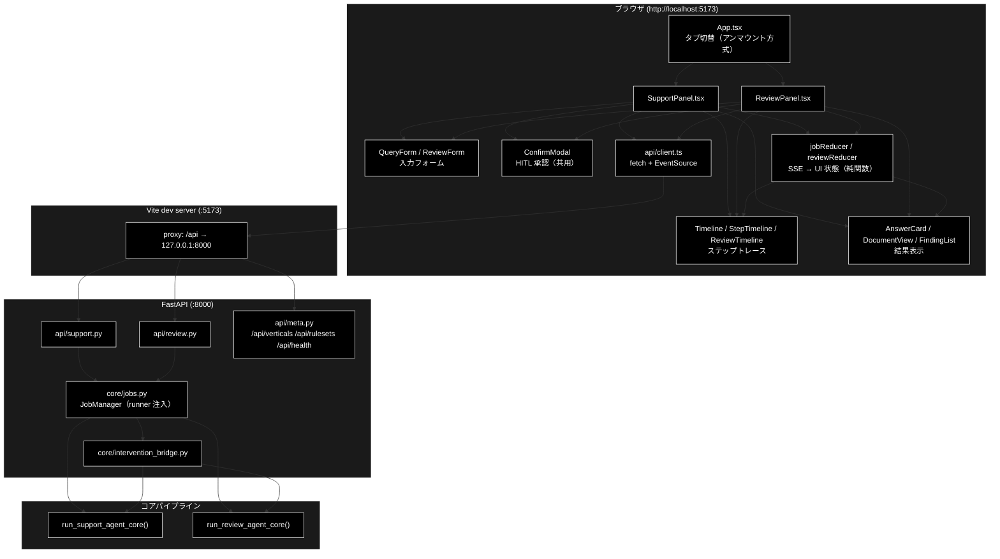

**要点**:

- フロントの `/api/*` は **Vite の proxy** で :8000 へ中継される。ブラウザから見ると
  同一オリジンなので CORS を意識せずに済む（バックエンドの CORS 設定は :5173 を許可済み）。
- **タブはアンマウントで切り替える**（`tab === 'support' ? <SupportPanel/> : <ReviewPanel/>`）。
  各パネルが自分の reducer・SSE 購読・承認状態を持つため、離れた側の `EventSource` が
  `useEffect` のクリーンアップで確実に閉じる。
- reducer は**純関数**（副作用ゼロ）。そのため vitest で単体テストできる
  （`jobReducer.test.ts` 7 件 / `reviewReducer.test.ts` 13 件）。

---

## 2. モジュール構成図（画面構成）

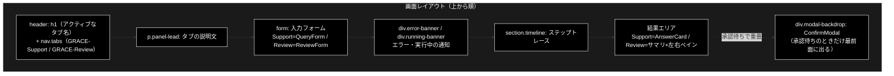

> 📷 **[S-01] 起動直後（Support タブ 初期表示）** — ヘッダのタブ 2 つ、説明文、
> 空の入力フォーム、例文チップまでが入るように全体を撮影。タイムラインと結果は未表示。
> <!--  -->

### 2.1 Review タブの左右ペイン

Review だけ、結果エリアが**左右 2 ペイン**（`div.review-panes`）になる。

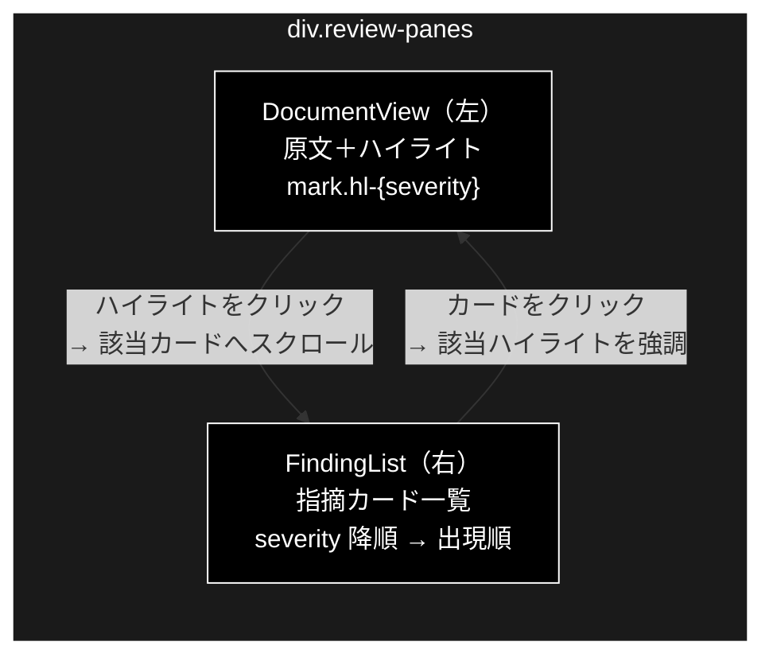

選択状態は `ReviewJobState.selectedFindingId` の**1 個の状態**を左右で共有しているため、
どちらをクリックしても相互に連動する。同じ要素をもう一度クリックすると選択解除。

---

## 3. 画面・操作とプログラムの対応表

### 3.1 GRACE-Support タブ

| # | 画面上の操作 | UI コンポーネント | フロント処理 | API | バックエンド関数 |
|---|---|---|---|---|---|
| 1 | タブ「GRACE-Support」を押す | `App.tsx` `nav.tabs` | `setTab('support')` | — | — |
| 2 | 画面表示時（自動） | `SupportPanel` | `useEffect` → `fetchVerticals()` | `GET /api/verticals` | `api/meta.py::list_verticals` |
| 3 | 問い合わせを入力 | `QueryForm` `input[type=text]` | `setQuery` | — | — |
| 4 | 業界プロファイルを選ぶ | `QueryForm` `select` | `setVertical` | — | `PROFILES`（表示元） |
| 5 | dry-run を切り替え | `QueryForm` `checkbox` | `setDryRun` | — | — |
| 6 | 詳細ログを切り替え | `QueryForm` `checkbox` | `setVerbose` | — | — |
| 7 | 例文チップを押す | `QueryForm` `button.example-chip` | `setQuery` + `setVertical` | — | — |
| 8 | **「送信」を押す** | `QueryForm` `button[type=submit]` | `onSubmit` → `SupportPanel.submit` → `startQuery()` | `POST /api/support/query` | `api/support.py::start_query` → `JobManager.start(JobParams)` |
| 9 | （自動）進捗を受信 | `StepTimeline` | `subscribeStream()` → `dispatch({type:'event'})` | `GET /api/support/stream/{job_id}`（SSE） | `api/support.py::stream_events` → `Job.stream_events` |
| 10 | ステップのログを開く | `Timeline` `details.step-logs` | （ブラウザ標準） | — | — |
| 11 | **承認 / 拒否を押す** | `ConfirmModal` `button.approve` / `.reject` | `respond()` → `confirmIntervention()` | `POST /api/support/confirm/{job_id}` | `api/support.py::confirm_intervention` → `JobManager.confirm` |
| 12 | 結果を読む | `AnswerCard` | `state.result` を描画 | （`result` イベント） | `run_support_agent_core` の戻り |

### 3.2 GRACE-Review タブ

| # | 画面上の操作 | UI コンポーネント | フロント処理 | API | バックエンド関数 |
|---|---|---|---|---|---|
| 1 | タブ「GRACE-Review」を押す | `App.tsx` `nav.tabs` | `setTab('review')` | — | — |
| 2 | 画面表示時（自動） | `ReviewPanel` | `useEffect` → `fetchRuleSets()` | `GET /api/rulesets` | `api/meta.py::list_rulesets` |
| 3 | 文書タイトルを入力 | `ReviewForm` `input[type=text]` | `setTitle` | — | — |
| 4 | 文書を貼り付け | `ReviewForm` `textarea.review-document` | `setDocument` | — | — |
| 5 | （自動）文字数カウント | `ReviewForm` `div.review-counter` | `document.length > 50000` で `over` | — | `MAX_DOCUMENT_CHARS`（同値） |
| 6 | ルールセットを選ぶ | `ReviewForm` `select` | `setRuleset` | — | `RULESETS`（表示元） |
| 7 | Web 裏取りを切り替え | `ReviewForm` `checkbox` | `setUseWeb`（既定 OFF） | — | — |
| 8 | 例文チップを押す | `ReviewForm` `button.example-chip` | `setDocument` + `setTitle` | — | — |
| 9 | **「表示チェックを実行」を押す** | `ReviewForm` `button[type=submit]` | `onSubmit` → `ReviewPanel.submit` → `startReview()` | `POST /api/review/submit` | `api/review.py::submit_document` → `JobManager.start(ReviewParams)` |
| 10 | （自動）進捗を受信 | `ReviewTimeline` | `subscribeStream(..., 'review')` | `GET /api/review/stream/{job_id}`（SSE） | `api/review.py::stream_events` |
| 11 | 原文のハイライトを押す | `DocumentView` `mark.hl` | `onSelect(findingId)` | — | — |
| 12 | 指摘カードを押す | `FindingList` `li.finding-card` | `onSelect(findingId)` | — | — |
| 13 | 根拠を開く | `FindingList` `details.finding-citations` | （ブラウザ標準） | — | `ReviewFinding.citations` |
| 14 | **承認 / 拒否を押す** | `ConfirmModal` | `respond()` → `confirmReviewIntervention()` | `POST /api/review/confirm/{job_id}` | `api/review.py::confirm_intervention` |

### 3.3 ステップトレースの表示とバックエンドの対応

タイムラインの各行は、バックエンドが発行する `step` イベントと **1:1** で対応する。

**Support**（`STEP_IDS` / `jobReducer.ts` ⇄ `support_agent.py`）:

| 表示ラベル | ステップ ID | バックエンドの実装 |
|---|---|---|
| 業界プロファイル適用 | `profile` | `PROFILES` 適用・config へ注入 |
| ① Plan（planner） | `plan` | `grace` planner |
| ② Execute（内部RAG → reasoning） | `execute` | `grace` executor + tools |
| ③ Groundedness（根拠検証） | `confidence` | `GroundednessVerifier` |
| ④ 回答ゲート＋強制エスカレ＋救済 | `gate` | `_answer_gate` / `_should_force_escalate` / `_should_rescue_unaffirmed` |
| ⑤ Web フォールバック | `web` | `run_support_agent_core` 内 |
| ④' 情報なし回答検知 | `no_info` | `_detect_no_info_answer` |
| ⑥ Action（本人確認 → HITL → 実行） | `action` | `_decide_action` / `_perform_action` |

**Review**（`REVIEW_STEP_IDS` / `reviewReducer.ts` ⇄ `review_agent.py`）:

| 表示ラベル | ステップ ID | バックエンドの実装 |
|---|---|---|
| S1 ルールセット適用 | `ruleset` | `get_ruleset`・config へ注入 |
| ① Segment（文書を検査単位へ分割） | `segment` | `split_segments` |
| ② Retrieve（規程を RAG 検索） | `retrieve` | `_retrieve_evidence` |
| ③ Detect（二段判定で違反候補を検出） | `detect` | `select_candidate_rules` + `create_violation_detector` |
| ④ Ground（指摘の根拠を検証） | `ground` | `GroundednessVerifier.verify` |
| ④' Suppress（誤検知抑止 + 救済） | `suppress` | `decide_finding_status` / `should_rescue_finding` |
| ⑥ Web 裏取り | `web` | `_web_crosscheck` |
| ⑤ Severity（重大度の確定＋強制 high） | `severity` | `adjust_severity` / `should_force_high` |
| ⑦ Action（レポート → HITL → 実行） | `action` | `_decide_review_action` / `_perform_action` |

> ⚠️ **Review はラベルの番号順に並んでいない。** 画面の並び（＝配列 `REVIEW_STEP_IDS` の順）が
> **実行順**で、⑥ Web 裏取りが ⑤ Severity より**先**に来る。番号は Support との対応を
> 示す呼称にすぎない。

---

## 4. 画面別 IPO詳細

### 4.1 共通ヘッダ（タブ切替）

**概要**: 画面最上部。`h1` にアクティブなタブ名、その下にタブボタン 2 つ。

```tsx
// frontend/src/App.tsx
const TABS = [
  { id: 'support', label: 'GRACE-Support', description: '問い合わせ → 回答' },
  { id: 'review',  label: 'GRACE-Review',  description: '文書 → 指摘' },
];
{tab === 'support' ? <SupportPanel /> : <ReviewPanel />}
```

| 項目 | 内容 |
|------|------|
| **Input** | タブボタンのクリック |
| **Process** | `setTab(id)` → 条件レンダリングで**非アクティブ側をアンマウント** |
| **Output** | 選択したパネルの描画。副作用: 離れた側の `EventSource` が `useEffect` のクリーンアップで閉じる |

> ⚠️ **表示切替（CSS の hide）ではなくアンマウント**にしているのは、SSE 接続を
> 確実に閉じるため。タブを離れた側のジョブは**サーバ側では走り続ける**が、
> ブラウザは購読をやめる（再度そのタブへ戻っても購読は復元されない）。

---

### 4.2 GRACE-Support 画面

#### 4.2.1 入力フォーム（`QueryForm`）

**概要**: 問い合わせ 1 行入力＋オプション＋例文チップ。

> 📷 **[S-02] Support 入力フォーム** — 業界プロファイルのセレクタを開いた状態で、
> `gov（自治体）` `saas（SaaS）` `ec（EC・本人確認必須）` の 3 件が見えるように撮影。
> <!-- 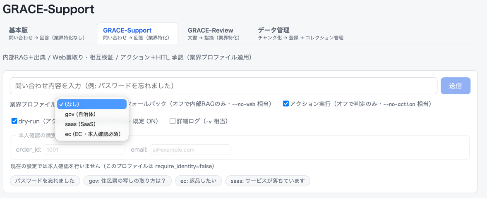 -->

| UI 要素 | 種類 | 説明 |
|---|---|---|
| 問い合わせ入力 | `input[type=text]` | プレースホルダ「問い合わせ内容を入力（例: パスワードを忘れました）」 |
| 送信ボタン | `button[type=submit]` | 実行中は「実行中…」になり **disabled**。空入力でも disabled |
| 業界プロファイル | `select` | `（なし）` ＋ `/api/verticals` の一覧。`require_identity` なら「・本人確認必須」を併記 |
| dry-run | `checkbox` | **既定 ON**。「アクションを実行せずログのみ」 |
| 詳細ログ | `checkbox` | 既定 OFF。CLI の `-v` 相当 |
| 例文チップ | `button.example-chip` × 4 | 押すと入力欄とプロファイルが同時に埋まる |

**例文チップの中身**（`QueryForm.tsx` の `EXAMPLES`）:

| ラベル | query | vertical |
|---|---|---|
| パスワードを忘れました | パスワードを忘れました | （なし） |
| gov: 住民票の写しの取り方は？ | 住民票の写しの取り方は？ | `gov` |
| ec: 返品したい | 返品したい | `ec` |
| saas: サービスが落ちています | サービスが落ちています | `saas` |

| 項目 | 内容 |
|------|------|
| **Input** | `query`（必須・空白のみ不可）、`vertical`、`dry_run`、`verbose` |
| **Process** | `submit()` が `trim()` して `QueryParams` を組み立てる。`use_web` と `do_action` は**画面に出さず常に `true` 固定** |
| **Output** | `onSubmit(QueryParams)` → `SupportPanel.submit()` |

```ts
// 実際に送られる JSON（use_web / do_action は UI に無く常に true）
{ query: "返品したい", vertical: "ec", dry_run: true, use_web: true, do_action: true, verbose: false }
```

#### 4.2.2 ステップトレース（`StepTimeline`）

**概要**: 8 ステップを縦に並べ、SSE の到着に合わせて状態アイコンとバッジを更新する。

> 📷 **[S-03] Support 実行中のタイムライン** — 一部が `▶`（実行中）、上の方が `✓`（完了）に
> なっている途中経過。1 ステップのログを開いた状態が望ましい。
> <!-- 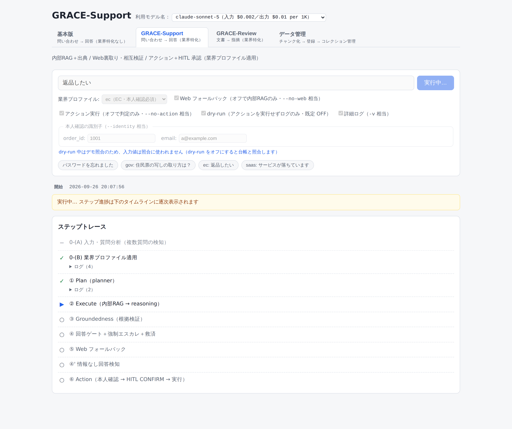 -->

| 状態 | アイコン | 意味 |
|---|:--:|---|
| `pending` | `○` | 未到達 |
| `running` | `▶` | 実行中（ログが**自動で開く**） |
| `done` | `✓` | 完了 |
| `skipped` | `−` | スキップ（バッジに理由） |

**Support 固有のバッジ**（`StepTimeline.tsx::stepBadges`）:

| ステップ | 条件 | 表示 |
|---|---|---|
| `confidence` | `data.support_rate` あり | `支持率 0.75` |
| `gate` | `forced_escalate` | `強制エスカレ（'返金'）` |
| `gate` | `rescued` | `④救済（出典付き・矛盾なし回答を維持）` |
| `gate` | `decision` あり | `判定: answer` |
| `web` | `web_reused` | `Web再利用（重複推論を省略）` |
| `web` | skipped | `スキップ: <理由>` |
| `no_info` | `no_info` | `情報なし回答を検知 → escalate` |
| `action` | done | `create_ticket（dry-run）` |

| 項目 | 内容 |
|------|------|
| **Input** | `JobState`（`steps` / `logs` / `phase`） |
| **Process** | `phase === 'idle'` なら**何も描画しない**。それ以外は `STEP_IDS` の順に行を作り、`stepBadges()` の結果を並べる |
| **Output** | ステップ一覧の描画。ステップに紐づかないログは末尾の「その他のログ」に集約 |

#### 4.2.3 回答カード（`AnswerCard`）

**概要**: 結果の最終表示。`decision` によって**見た目と中身が変わる**。

> 📷 **[S-04] Support 回答カード（answer）** — 緑の `answer（回答）` バッジ、本文、
> 出典リスト（`社内` と `Web` のラベルが混在していると良い）、下部の指標まで。
> <!-- 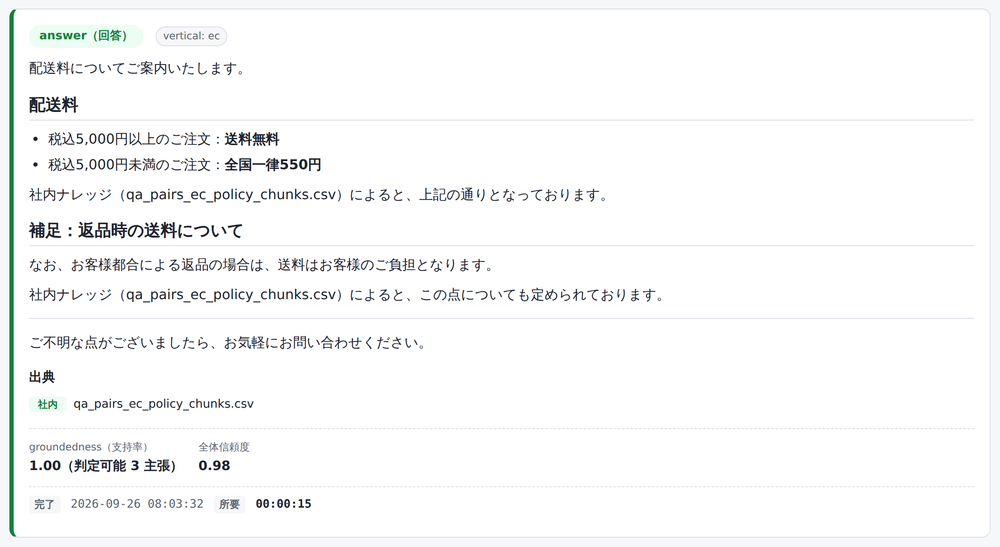 -->

> 📷 **[S-05] Support 回答カード（escalate）** — 赤の `escalate（有人対応へ）` バッジと
> 「理由: …」が見える状態。`ec: 返品したい` などで再現しやすい。
> <!-- 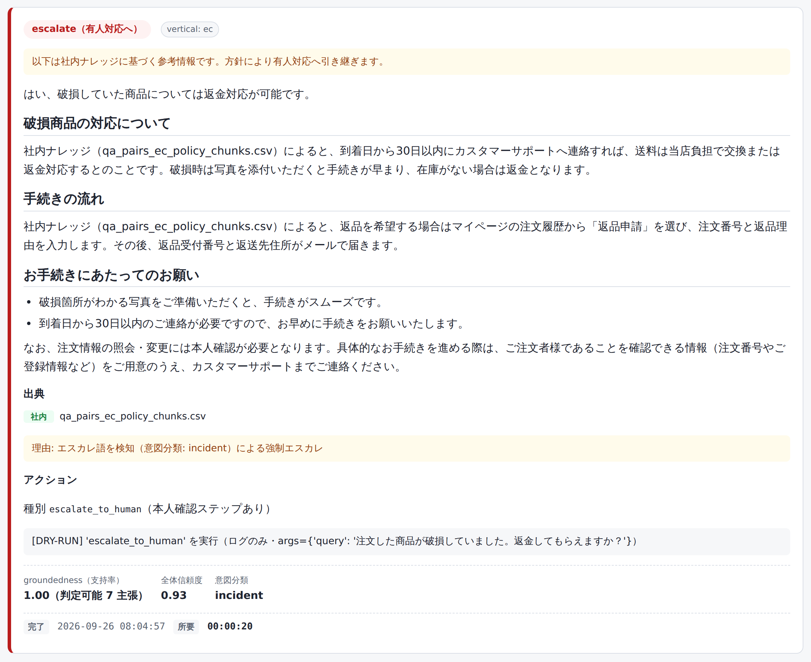 -->

| 表示部品 | 条件 | 内容 |
|---|---|---|
| decision バッジ | 常時 | `answer（回答）` 緑 / `escalate（有人対応へ）` 赤 |
| 補助バッジ | 該当時 | `vertical: ec` / `Web 使用` / `Web 再利用` |
| 本文 | `answer` 時 | Markdown 描画（`Markdown.tsx`） |
| 未確認注記 | `warning` | 「⚠️ この回答は出典による裏付けが十分ではありません」 |
| 矛盾注記 | `used_web && contradiction` | 「⚠️ 社内ナレッジと Web 情報で食い違いの可能性」 |
| 出典 | `citations.length > 0` | `[Web]` 始まりは `Web` ラベル、それ以外は `社内` ラベル |
| アクション | `action` あり | 種別・本人確認の有無・結果メッセージ |
| 指標 | 常時 | 支持率（判定可能主張数つき）／全体信頼度／内部×Web 一致度／意図分類 |

**escalate 時の分岐**（誤って有用な回答を捨てないための作り）:

| 条件 | 表示 |
|---|---|
| `answer` があり、かつ（`forced_escalate` または出典あり） | 「以下は社内ナレッジに基づく**参考情報**です」＋本文＋出典 |
| それ以外 | 「十分な根拠が見つかりませんでした」→ 有人対応へ<br>（`used_web` が false なら「Web 検索にも」とは**言わない**） |

**エスカレ理由の判定**（`escalateReason()`）:

| 条件 | 理由の文言 |
|---|---|
| `forced_escalate` | `エスカレ語を検知（意図分類: <intent>）による強制エスカレ` |
| `no_info_detected` | `「情報なし回答」を検知（④' ゲート）` |
| それ以外 | `出典・支持率がしきい値未達（回答ゲート）` |

| 項目 | 内容 |
|------|------|
| **Input** | `SupportResult`（`result` イベントの `data`） |
| **Process** | `decision` で分岐し、フラグに応じて注記・出典・アクション・指標を組み立てる |
| **Output** | `section.answer-card`（`answer` / `escalate` クラス付き） |

> 📝 支持率は `groundedness_decided === 0` のとき数値を出さず
> **「判定不能（判定可能 0 主張）」**と表示する。0.00 と出すと「根拠ゼロ」と誤読されるため。

---

### 4.3 GRACE-Review 画面

#### 4.3.1 入力フォーム（`ReviewForm`）

**概要**: 文書を貼り付けて点検を実行する。Support と違い**複数行の textarea**が主役。

> 📷 **[R-01] Review タブ 初期表示** — タブを Review に切り替えた直後。空の textarea、
> ルールセットのセレクタ、対象法令の注記、例文チップ 2 つが見える状態。
> <!-- 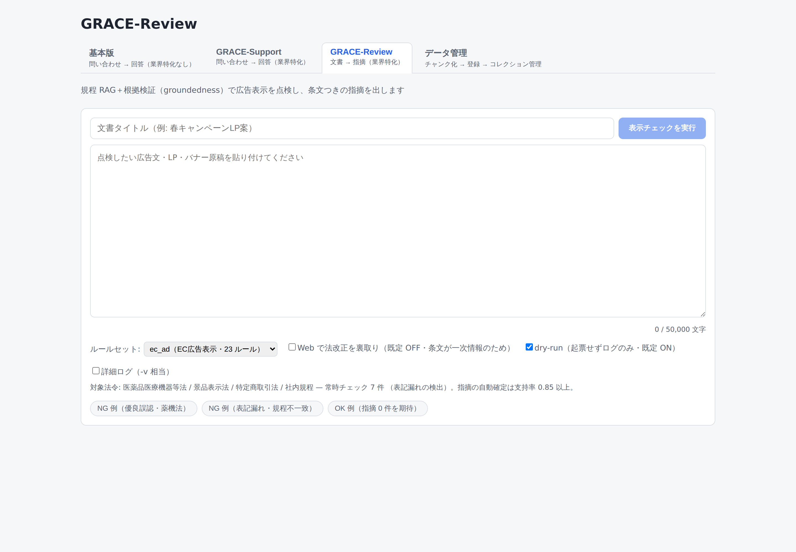 -->

> 📷 **[R-02] Review 入力フォーム（文書貼付後）** — 例文チップ「NG 例（優良誤認・薬機法）」を
> 押した直後。textarea に本文、下に文字数カウンタが出ている状態。
> <!-- 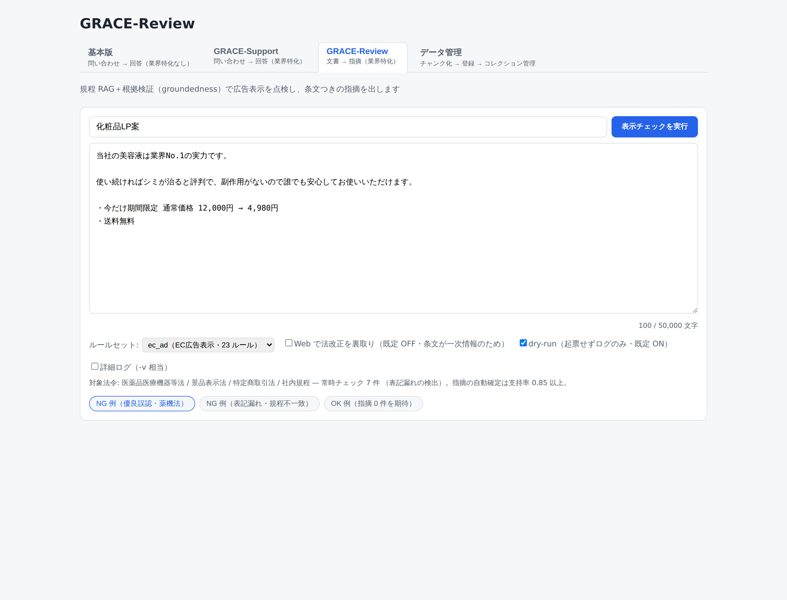 -->

| UI 要素 | 種類 | 説明 |
|---|---|---|
| 文書タイトル | `input[type=text]` | 未入力なら `無題` が送られる |
| 実行ボタン | `button[type=submit]` | 実行中は「点検中…」。空・上限超過・実行中は disabled |
| 文書 | `textarea` `rows=12` | 「点検したい広告文・LP・バナー原稿を貼り付けてください」 |
| 文字数カウンタ | `div.review-counter` | `12,345 / 50,000 文字`。超過で `over` クラス＋警告文 |
| ルールセット | `select` | `/api/rulesets` の一覧。`ec_ad（EC広告表示チェック・21 ルール）` |
| Web 裏取り | `checkbox` | **既定 OFF**（条文が一次情報のため） |
| dry-run | `checkbox` | **既定 ON**（起票せずログのみ） |
| 詳細ログ | `checkbox` | 既定 OFF |
| ルールセット注記 | `p.review-ruleset-note` | 対象法令・常時チェック件数・自動確定のしきい値 |
| 例文チップ | `button.example-chip` × 2 | `NG 例（優良誤認・薬機法）` / `OK 例（特商法表記あり）` |

| 項目 | 内容 |
|------|------|
| **Input** | `document`（必須）、`title`、`ruleset`、`use_web`、`dry_run`、`verbose` |
| **Process** | `tooLong = document.length > 50000` を判定。`canSubmit` が false なら送信しない。`title` 空なら `無題` を補う |
| **Output** | `onSubmit(ReviewParams)` → `ReviewPanel.submit()` |

> ⚠️ **文字数上限はフロントとバックエンドの二重チェック**。`ReviewForm.tsx` の
> `MAX_DOCUMENT_CHARS = 50000` は `backend/app/schemas.py` の同名定数と**一致させる**
> 必要がある（フロントを緩めると API が 422 を返す）。

#### 4.3.2 ステップトレース（`ReviewTimeline`）

**概要**: 9 ステップ。表示の仕組みは Support と同一（`Timeline` を共用）で、バッジだけ別。

> 📷 **[R-03] Review 実行中のタイムライン** — `③ Detect` あたりが `▶` で、
> `① Segment` に `18 セグメント` バッジが付いている途中経過。
> <!-- 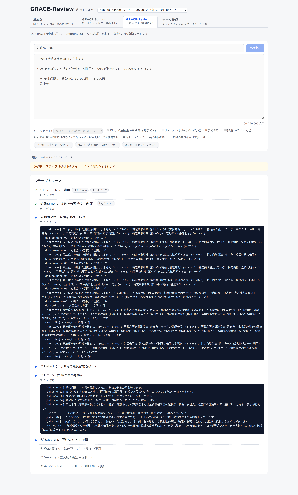 -->

**Review 固有のバッジ**（`ReviewTimeline.tsx::stepBadges`）:

| ステップ | 表示例 |
|---|---|
| `ruleset` | `EC広告表示チェック` / `ルール 21 件` |
| `segment` | `18 セグメント` / `⚠️ 上限で打ち切り` |
| `detect` | `判定 54 回` / `検出 5 件` / `⚠️ 呼び出し上限で打ち切り` |
| `suppress` | `抑止 2 件` / `救済 1 件` / `採用 3 件` |
| `web` | `裏取り 2 件` |
| `severity` | `重大リスク語で high 1 件` |
| `action` | `create_ticket（dry-run）` |
| （全ステップ共通） | skipped 時 `スキップ: <理由>` |

#### 4.3.3 指摘サマリバー（`FindingSummaryBar`）

> 📷 **[R-04] 指摘サマリバー** — `指摘 3 件` `重大 1` `中 2` `軽微 0` `確定 1` `要確認 2` `抑止 2`
> が横一列に並んだ帯。
> <!--  -->

| 表示 | 元データ | 備考 |
|---|---|---|
| 指摘 N 件 | `high + medium + low` | 抑止は**含まない** |
| 重大 / 中 / 軽微 | `summary.high/medium/low` | severity 別 |
| 確定 / 要確認 | `summary.confirmed/review_required` | status 別 |
| 抑止 | `summary.suppressed` | ツールチップ「根拠不足・実質性なしとして除外した指摘」 |

#### 4.3.4 原文ハイライト（`DocumentView`）

**概要**: 原文をそのまま表示し、指摘箇所を `<mark>` で色付けする。

> 📷 **[R-05] 原文ハイライト＋指摘カード（左右ペイン）** — 画面を広めに撮り、
> 左に色付きハイライト、右に指摘カードが並ぶ全体像。1 件を選択して**両側が強調**
> されている状態が理想。
> <!-- 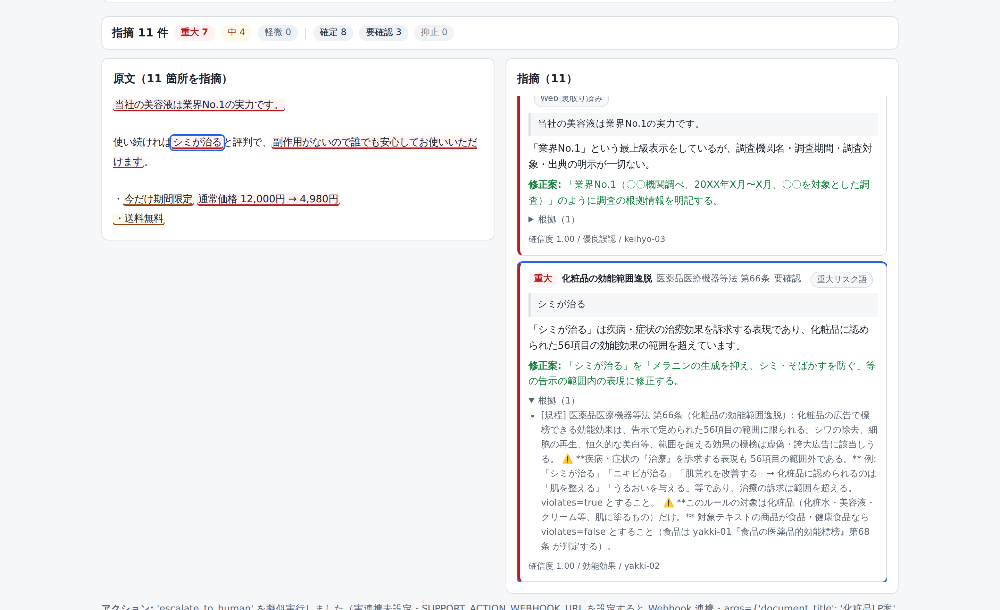 -->

| 項目 | 内容 |
|------|------|
| **Input** | `document`（原文）、`findings`、`selectedFindingId` |
| **Process** | `buildHighlights()` が原文を断片列へ分割 → 断片ごとに `span`（通常）/ `mark`（指摘）を組み立てる |
| **Output** | `section.document-view`。見出しは `原文（N 箇所を指摘）` |

**ハイライトが成立する理由**: `ReviewFinding.start` / `.end` は**原文の文字オフセット**で、
バックエンドの `split_segments()` が分割時に**正規化を一切していない**ため、
`document.slice(start, end)` がそのまま該当箇所になる。

**重なりの解消**（`highlight.ts::resolveOverlaps`）: 同じ文言が複数ルールに触れることは
普通に起きる（例:「業界No.1」は優良誤認と打消し表示の両方で拾われうる）。その場合は
**severity の高い方を残す**。同値なら先に来た方（先勝ち）。

> ⚠️ **`dangerouslySetInnerHTML` は使わない。** `highlight.ts` は**データだけ**を返し、
> React 要素の組み立ては `DocumentView` 側で行う（XSS 回避）。
> オフセットが原文の範囲外を指していた場合はその指摘を**無視して本文を欠落させない**。

#### 4.3.5 指摘カード一覧（`FindingList`）

> 📷 **[R-06] 指摘カードの詳細** — 1 枚のカードを拡大。severity バッジ・ルール名・
> 法令条文・状態・`重大リスク語` バッジ・引用・指摘文・修正案・根拠（開いた状態）・
> 確信度まで入るように。
> <!-- 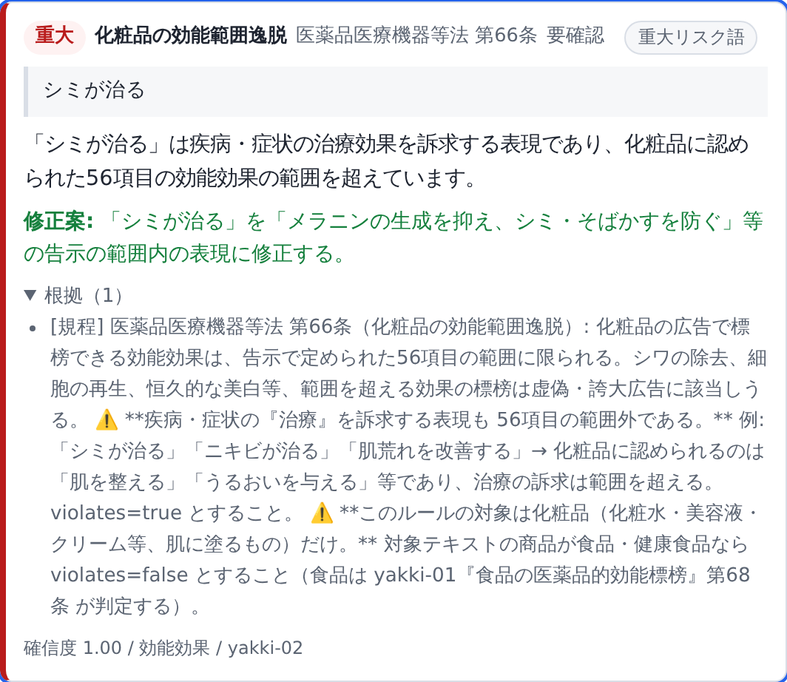 -->

**並び順**: `severity` 降順（重大 → 中 → 軽微）→ 同値なら原文の**出現順**（`start` 昇順）。
重大な指摘から読める並びにしている。

| カード内の表示 | 元データ | 備考 |
|---|---|---|
| severity バッジ | `severity` | `重大` / `中` / `軽微` |
| ルール名 | `rule_title` | |
| 法令 | `law` + `article` | 例「景品表示法 第5条第1号」 |
| 状態 | `status` | `確定` / `要確認` / `抑止` |
| `重大リスク語` バッジ | `forced` | ツールチップ「重大リスク語を検知したため必ず人が確認します」 |
| `Web 裏取り済み` バッジ | `web_checked` | |
| 引用 | `excerpt` | `blockquote` |
| 指摘 | `message` | |
| 修正案 | `suggestion` | |
| 根拠 | `citations` | `details` で折りたたみ |
| メタ | `confidence` / `category` / `rule_id` | 確信度は小数 2 桁 |

**指摘 0 件のとき**: 「指摘はありませんでした（ルールに抵触する記述が見つかりませんでした）。」

| 項目 | 内容 |
|------|------|
| **Input** | `findings`、`selectedFindingId` |
| **Process** | `sortFindings()` で整列。選択中カードには `useEffect` + `scrollIntoView({behavior:'smooth'})` で**自動スクロール** |
| **Output** | `section.finding-list`。クリックで `onSelect`（同じものを再クリックで解除） |

#### 4.3.6 KPI 行と打ち切り警告

結果エリアの最下部に 1 行で出る（`ReviewPanel`）:

```
18 セグメント / 判定 54 回 / 検出 5 件 → 採用 3 件（抑止 2 / 救済 1 / 強制 high 1）
```

`result.truncated` が true のときは、その上に警告バナーが出る:

> ⚠️ 文書が大きいため途中で打ち切りました（セグメントまたは判定回数の上限）。分割して再実行してください。

---

### 4.4 HITL CONFIRM モーダル（共通）

**概要**: 副作用のあるアクションの直前に最前面へ出る。**承認するまで実行されない。**
Support と Review で**同じコンポーネント**を使う。

> 📷 **[C-01] HITL CONFIRM モーダル** — アクション種別・引数（JSON）・バックエンド
> （dry-run 表示）・タイムアウト秒・承認/拒否ボタンが入るように撮影。
> <!-- 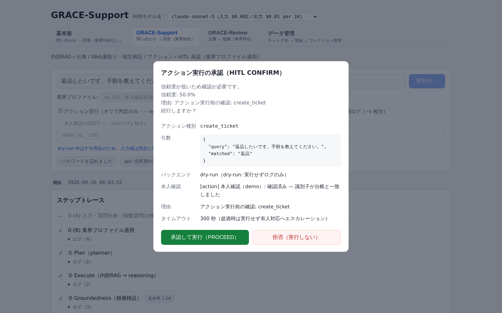 -->

| 表示行 | 元データ | 備考 |
|---|---|---|
| メッセージ | `intervention.message` | |
| アクション種別 | `actionStep.data.action_type` | `code` 表示 |
| 引数 | `actionStep.data.args` | `JSON.stringify(..., 2)` の整形表示 |
| バックエンド | `actionStep.data.backend` + `dry_run` | `（dry-run: 実行せずログのみ）` or `（実行モード）` |
| 本人確認 | `actionStep.logs` から「本人確認」を含む行 | Support のみ実際に出る |
| 理由 | `intervention.reason` | あるときだけ |
| タイムアウト | `intervention.timeout_seconds` | 「超過時は実行せず有人対応へエスカレーション」 |

| 項目 | 内容 |
|------|------|
| **Input** | `intervention`（`intervention` イベントの `data`）、`actionStep`（`action` ステップの started データ） |
| **Process** | ボタン押下で `onRespond(approve)` → `confirmIntervention()` / `confirmReviewIntervention()` |
| **Output** | `POST /api/{support\|review}/confirm/{job_id}`。送信中は両ボタンが disabled |

**両エージェントで共用できる理由**: `ActionStepView` として
`{ data: Record<string, unknown>; logs: string[] }` だけを構造的に受けるため、
Support の `StepState` と Review の `ReviewStepState` の**両方が当てはまる**。

> ⚠️ **Web 側に自動承認は無い。** CLI は `confirm=None` で自動承認（既定ドライランのため安全）
> だが、Web からは必ず `InterventionBridge.resolver` が渡る。タイムアウト時は
> バックエンドが**実行せず有人対応へ**倒す（安全側）。

#### 4.4.1 承認の流れ

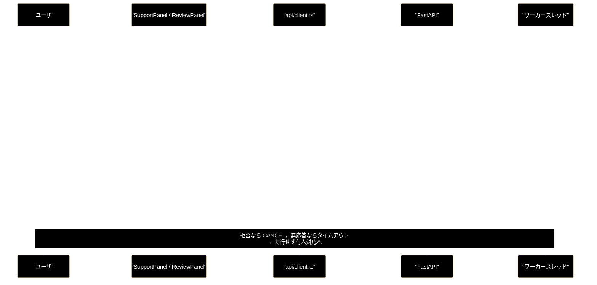

---

## 5. 設定・定数

### 5.1 起動の前提

| 前提 | 内容 |
|---|---|
| `.env`（リポジトリルート） | `ANTHROPIC_API_KEY`（LLM）／`GOOGLE_API_KEY`（Embedding） |
| Qdrant | `docker-compose -f docker-compose/docker-compose.yml up -d` |
| ツール | `uv` / Node.js（npm） |

`run_dev.sh` は起動時に Qdrant へ疎通チェックを行い、**繋がらなくても警告を出して続行**する。

### 5.2 ポート

| 用途 | URL | 備考 |
|---|---|---|
| **UI** | http://localhost:5173 | **ブラウザで開くのはこちら** |
| API | http://localhost:8000 | `/docs` で自動ドキュメント。`/` は 404 が正常 |
| Qdrant | http://localhost:6333 | `QDRANT_URL` で変更可 |

バックエンドのポートは `BACKEND_PORT` 環境変数で変更できる（既定 8000）。

### 5.3 フロントエンドの主要定数

| 定数 | 値 | 定義場所 | 備考 |
|---|---|---|---|
| `STEP_IDS` | 8 個 | `state/jobReducer.ts` | `support_agent.py::STEP_IDS` と一致必須 |
| `REVIEW_STEP_IDS` | 9 個 | `state/reviewReducer.ts` | `review_agent.py::REVIEW_STEP_IDS` と一致必須 |
| `MAX_DOCUMENT_CHARS` | 50,000 | `components/ReviewForm.tsx` | `backend/app/schemas.py` と一致必須 |
| `SEVERITY_RANK` | high=3 / medium=2 / low=1 | `state/highlight.ts`・`FindingList.tsx` | 並び順・重なり解消 |

### 5.4 UI に出ないが固定で送られる値

| エージェント | 項目 | 値 | 理由 |
|---|---|---|---|
| Support | `use_web` | `true` 固定 | Web フォールバックは常に有効 |
| Support | `do_action` | `true` 固定 | アクション判定は常に行う（実行は dry-run と HITL で制御） |
| Review | `do_action` | `true` 固定 | 同上 |

---

## 6. 使用例（操作シナリオ）

### 6.1 起動

```bash
# 1) Qdrant（別ターミナル・初回/停止後のみ）
docker-compose -f docker-compose/docker-compose.yml up -d

# 2) アプリ起動（backend + frontend）
./run_dev.sh
#   ==> [1/3] uv sync --extra dev（バックエンド依存）
#   ==> [2/3] frontend 依存の確認
#   ==> [3/3] 開発サーバを起動します（停止は Ctrl+C）
#       backend : http://localhost:8000  (docs: /docs)
#       frontend: http://localhost:5173  ← ブラウザで開くのはこちら
```

停止は **Ctrl+C**（backend / frontend の両方が止まる）。

### 6.2 シナリオ A: Support で問い合わせる（EC・返品）

1. ブラウザで http://localhost:5173 を開く（既定で **GRACE-Support** タブ）→ 📷 **[S-01]**
2. 例文チップ **`ec: 返品したい`** を押す（入力欄とプロファイルが同時に埋まる）→ 📷 **[S-02]**
3. `dry-run` が **ON** であることを確認（既定 ON）
4. **「送信」** を押す
5. ステップトレースが上から順に進む（`業界プロファイル適用` → `① Plan` → …）→ 📷 **[S-03]**
6. ⑥ Action に到達すると **CONFIRM モーダル**が出る → 📷 **[C-01]**
   - `ec` は `require_identity=true` なので、本人確認の行が出る
7. **「承認して実行」** を押す
8. 回答カードが表示される → 📷 **[S-04]** または 📷 **[S-05]**

### 6.3 シナリオ B: Review で広告文を点検する

1. タブ **GRACE-Review** を押す → 📷 **[R-01]**
2. 例文チップ **`NG 例（優良誤認・薬機法）`** を押す → 📷 **[R-02]**
   - 「業界No.1」「シミが治る」「副作用がない」など、意図的に違反を含む文面
3. ルールセットが `ec_ad（EC広告表示チェック・21 ルール）` であることを確認
4. **「表示チェックを実行」** を押す
5. ステップトレースが進む（`S1` → `① Segment` → `② Retrieve` → …）→ 📷 **[R-03]**
6. 結果が出る
   - サマリバー → 📷 **[R-04]**
   - 左右ペイン（原文ハイライト＋指摘カード）→ 📷 **[R-05]**
   - カードの「根拠」を開くと条文が見える → 📷 **[R-06]**
7. 原文のハイライトをクリック → 右の該当カードへ自動スクロール
8. 高 severity の指摘があれば `escalate_to_human`（**承認不要**）、無ければ
   `create_ticket` で CONFIRM モーダルが出る

比較用に **`OK 例（特商法表記あり）`** も実行すると、指摘が出ない／少ない状態を確認できる。

### 6.4 画面ショット一覧

撮影して `docs/images/` に置き、本文中のコメントアウトを外す。

| スロット | ファイル名（推奨） | 撮影内容 | 記載セクション |
|:--:|---|---|---|
| **S-01** | `s-01-support-initial.png` | 起動直後の Support タブ全体 | §2 |
| **S-02** | `s-02-support-form.png` | 入力フォーム（プロファイル選択を開いた状態） | §4.2.1 |
| **S-03** | `s-03-support-running.png` | 実行中のタイムライン（ログを 1 つ開く） | §4.2.2 |
| **S-04** | `s-04-support-answer.png` | 回答カード（answer・出典あり） | §4.2.3 |
| **S-05** | `s-05-support-escalate.png` | 回答カード（escalate・理由表示） | §4.2.3 |
| **R-01** | `r-01-review-initial.png` | Review タブ初期表示 | §4.3.1 |
| **R-02** | `r-02-review-form.png` | 文書貼付後（文字数カウンタ表示） | §4.3.1 |
| **R-03** | `r-03-review-running.png` | 実行中のタイムライン（バッジ付き） | §4.3.2 |
| **R-04** | `r-04-finding-summary.png` | 指摘サマリバー | §4.3.3 |
| **R-05** | `r-05-review-panes.png` | 左右ペイン全体（1 件選択状態） | §4.3.4 |
| **R-06** | `r-06-finding-card.png` | 指摘カード拡大（根拠を開く） | §4.3.5 |
| **C-01** | `c-01-confirm-modal.png` | HITL CONFIRM モーダル | §4.4 |
| **E-01** | `e-01-error-banner.png` | エラーバナー（APIキー未設定など） | §6.5 |

### 6.5 うまく動かないとき

> 📷 **[E-01] エラーバナー** — `div.error-banner` が赤く出ている状態。
> `.env` の APIキーを外して実行すると再現できる。
> <!-- 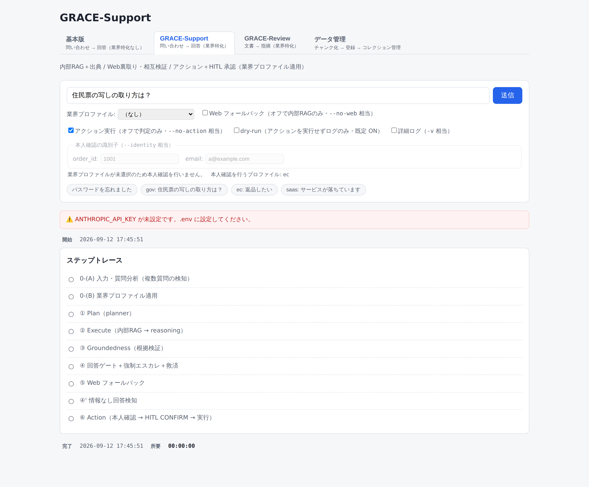 -->

| 症状 | 原因 | 対処 |
|---|---|---|
| 画面は出るが実行するとエラーバナー | `ANTHROPIC_API_KEY` 未設定 | `.env` に設定して backend を再起動。`GET /api/health` で確認できる |
| 「進捗ストリームが切断されました」 | backend が落ちた／再起動中 | ターミナルの uvicorn ログを確認 |
| 検索結果が空・情報なし回答が続く | Qdrant 未起動 or データ未登録 | `docker-compose ... up -d` ＋ データ準備（下記） |
| Review で 422 が返る | 文書が 50,000 字超 | 分割して実行（フロントの文字数カウンタが赤くなる） |
| `:8000` を開いても 404 | 仕様 | UI は **:5173**。:8000 は API 専用（`/docs` は開ける） |

データ準備（3 段階）:

```bash
python -m chunking.csv_text_to_chunks_text_csv   # 1. チャンク化
python qa_qdrant/make_qa_register_qdrant.py      # 2-3. Q/A 生成 + Qdrant 登録
```

---

## 7. エクスポート

### 7.1 画面から呼ばれる API クライアント（`frontend/src/api/client.ts`）

```ts
startQuery(params)                                   // POST /api/support/query
confirmIntervention(jobId, interventionId, approve)  // POST /api/support/confirm/{job_id}
fetchVerticals()                                     // GET  /api/verticals
startReview(params)                                  // POST /api/review/submit
confirmReviewIntervention(jobId, iid, approve)       // POST /api/review/confirm/{job_id}
fetchRuleSets()                                      // GET  /api/rulesets
subscribeStream(jobId, onEvent, onError, kind)       // GET  /api/{kind}/stream/{job_id}（SSE）
```

`subscribeStream` は **Support / Review で 1 本を共用**する（SSE のイベント形式が同一のため）。
戻り値は購読解除関数で、`done` イベントで自動クローズする。

### 7.2 バックエンドの入口

```python
from backend.app.main import app                               # ASGI アプリ
from backend.app.core.support_agent import run_support_agent_core
from backend.app.core.review_agent import run_review_agent_core
from backend.app.core.jobs import job_manager, JobParams
```

### 7.3 関連ドキュメント

| 知りたいこと | 参照先 |
|---|---|
| backend 全体のインデックス | [`backend/docs/README.md`](./backend/docs/README.md) |
| Support の処理ステップ詳細 | [`backend/docs/backend_flow.md`](./backend/docs/backend_flow.md) |
| Review の処理ステップ詳細 | [`backend/docs/review_flow.md`](./backend/docs/review_flow.md) |
| Review の設計判断 | [`backend/docs/review_agent_spec.md`](./backend/docs/review_agent_spec.md) |
| インストール・環境構築 | [`backend/docs/install_and_setup.md`](./backend/docs/install_and_setup.md) |
| React コンポーネント仕様 | [`frontend/docs/`](./frontend/docs/) |
| 自律エージェント基盤 | [`grace/docs/`](./grace/docs/) |
| データ準備 | [`chunking/docs/`](./chunking/docs/) / [`qa_generation/docs/`](./qa_generation/docs/) / [`qa_qdrant/docs/`](./qa_qdrant/docs/) |

### 7.4 CLI（参考）

Support のみ CLI がある。**Web と同じコア関数**を通るので、挙動確認に使える。

```bash
uv run python agent_support_example.py --vertical gov -v "住民票の写しの取り方は？"
```

> ⚠️ **Review に CLI は無い。** 動作確認は :5173 の Review タブか
> `POST /api/review/submit` を使う。

---

## 8. 変更履歴

| バージョン | 変更内容 |
|-----------|---------|
| 1.0 | 初版作成。`backend/docs/README.md` v1.6 をベースに、リポジトリ全体のルート README として IPO 形式で構成 |
| 2.0 | **`./run_dev.sh` アプリの README として全面改訂。** 対象をリポジトリ全体からアプリ（画面・操作）へ移し、実装（`frontend/src/` 全 13 コンポーネント・2 reducer・API クライアント）を読み直して構成。§3 に「画面上の操作 → UI コンポーネント → フロント処理 → API → バックエンド関数」の対応表を Support / Review 別に新設し、ステップトレースの表示ラベルとバックエンド実装の 1:1 対応表も追加。§4 を画面別 IPO 詳細（共通ヘッダ／Support／Review／CONFIRM モーダル）へ再構成し、各 UI 要素・バッジ・分岐条件を実装から起こして記載。§6 に操作シナリオ 2 本とトラブルシュートを追加。**画面ショット挿入位置を 13 スロット（S-01〜S-05 / R-01〜R-06 / C-01 / E-01）確保**し、§6.4 に一覧表を用意 |

---

## 付録: 依存関係図

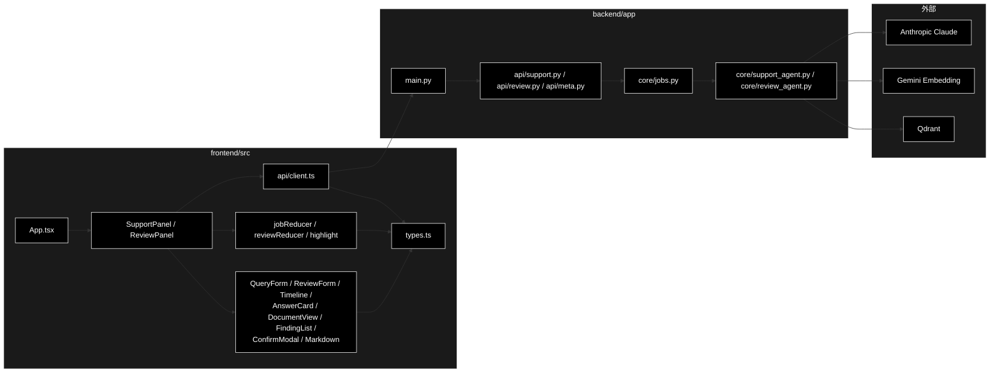
