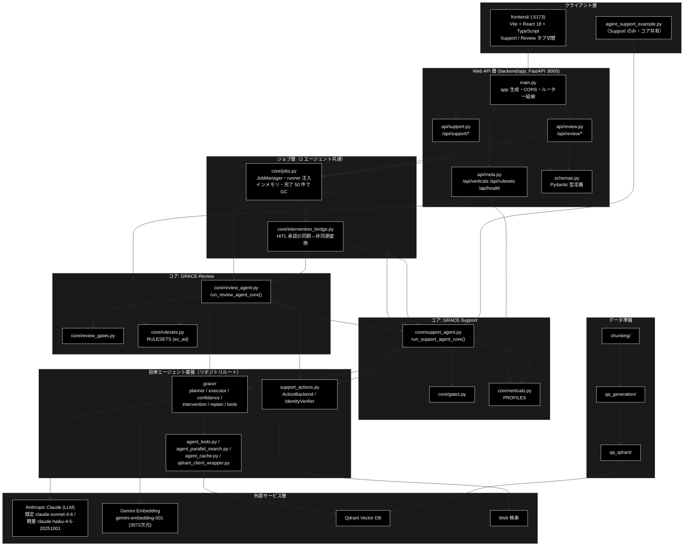
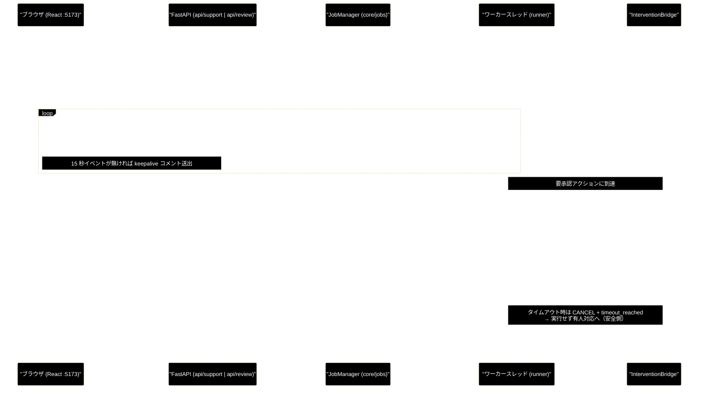
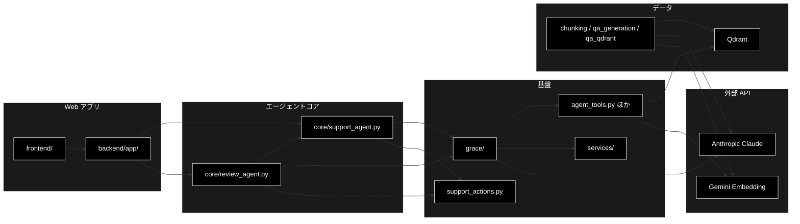

# GRACE — 業界特化・自律型エージェント（Support / Review）ドキュメント

**Version 1.0** | 最終更新: 2026-08-01

---

## 目次

1. [概要](#概要)
2. [アーキテクチャ構成図](#1-アーキテクチャ構成図)
3. [モジュール構成図](#2-モジュール構成図)
4. [クラス・関数一覧表](#3-クラス関数一覧表)
5. [クラス・関数 IPO詳細](#4-クラス関数-ipo詳細)
6. [設定・定数](#5-設定定数)
7. [使用例](#6-使用例)
8. [エクスポート](#7-エクスポート)
9. [変更履歴](#8-変更履歴)
10. [付録: 依存関係図](#付録-依存関係図)

---

## 概要

**GRACE** は、日本語 RAG（Retrieval-Augmented Generation）に**根拠検証（groundedness）・
Web 裏取り・HITL（Human-In-The-Loop）アクション**を組み合わせた、業界特化・自律型
エージェントのプラットフォームである。

提供するエージェントは **2 つ**。両者は**ジョブ基盤・SSE 配信・HITL ブリッジ・
アクション実行を共有**し、違うのはパラメータ型・結果型・パイプラインの中身だけである。

| エージェント | コア | ルータ |
|---|---|---|
| GRACE-Support（問い合わせ → 回答） | `core/support_agent.py` | `/api/support/*` |
| GRACE-Review（文書 → 指摘） | `core/review_agent.py` | `/api/review/*` |

- **GRACE-Support** — 問い合わせに内部 RAG ＋ Web 裏取りで答え、確度が足りなければ
  有人へ倒す。業界プロファイル（`gov` / `saas` / `ec`）で検索スコープ・しきい値・
  本人確認要否・アクション対応を切り替える。**CLI と Web の両方**から同じコアを通る。
- **GRACE-Review** — 文書（EC の LP・商品説明文など）を規程（景表法・特商法・薬機法）に
  照らして点検し、**根拠条文つきの指摘リスト**を返す。ルールセット `ec_ad`（21 ルール）を
  同梱。**Web 専用**（CLI エントリポイントは持たない）。

> ⚠️ **Web API と CLI は同じコア関数を通る。** `uvicorn backend.app.main:app` も
> `agent_support_example.py` も `run_support_agent_core()` を呼ぶ。「Web だけ / CLI だけ」の
> 分岐は存在しないので、片方で検証した挙動は他方にも当てはまる。

### 主な責務

- 問い合わせに対する回答生成と、確度不足時の有人エスカレーション（Support）
- 文書の規程違反検出と、根拠条文つき指摘リストの生成（Review）
- 回答・指摘の**根拠検証**（`GroundednessVerifier`）と誤検知の抑止・救済
- 副作用のあるアクションの HITL 承認と実行（起票・返信・有人引き継ぎ）
- SSE によるステップ進捗のリアルタイム配信と、フロントのタイムライン表示
- RAG データの準備（チャンク化 → Q/A 生成 → Qdrant 登録）

### 各責務対応のモジュール

| # | 責務 | 対応モジュール | 説明 |
|---|------|--------------|------|
| 1 | Support パイプライン | `backend/app/core/support_agent.py` | `run_support_agent_core()`（①〜⑥） |
| 2 | Review パイプライン | `backend/app/core/review_agent.py` | `run_review_agent_core()`（S1・①〜⑦） |
| 3 | 判定ロジック（Support） | `backend/app/core/gates.py` | 回答ゲート・強制エスカレ・情報なし検知・救済（純関数） |
| 4 | 判定ロジック（Review） | `backend/app/core/review_gates.py` | 二段判定・誤検知抑止・救済・重大度（純関数） |
| 5 | 業界定義 | `backend/app/core/verticals.py` / `rulesets.py` | `PROFILES`（gov/saas/ec）/ `RULESETS`（ec_ad） |
| 6 | ジョブ・HITL 基盤 | `backend/app/core/jobs.py` / `intervention_bridge.py` | runner 注入・SSE 供給・承認の同期⇔非同期変換 |
| 7 | Web API | `backend/app/api/` + `main.py` | `/api/support/*` `/api/review/*` `/api/*`（meta） |
| 8 | 自律エージェント基盤 | `grace/` | planner / executor / confidence / intervention / replan / tools |
| 9 | ツール・検索 | `agent_tools.py` / `agent_parallel_search.py` / `qdrant_client_wrapper.py` | RAG 検索・並列検索・Qdrant 接続 |
| 10 | アクション実行 | `support_actions.py` | `ActionBackend`（dry-run / webhook / pseudo）・`IdentityVerifier` |
| 11 | フロントエンド | `frontend/` | Vite + React 18 + TypeScript（Support / Review タブ） |
| 12 | データ準備 | `chunking/` / `qa_generation/` / `qa_qdrant/` | チャンク化 → Q/A 生成 → Qdrant 登録 |

### 主要機能一覧

| 機能 | 説明 |
|------|------|
| `run_support_agent_core()` | Support のコアパイプライン（イベント発行型） |
| `run_review_agent_core()` | Review のコアパイプライン（イベント発行型） |
| `JobManager.start()` | params 型から runner を解決してジョブを起動 |
| `InterventionBridge` | HITL 承認の同期⇔非同期変換（タイムアウトは安全側） |
| `GroundednessVerifier` | 主張／指摘が出典・規程で裏付けられるかを検証 |
| `PROFILES` | 業界プロファイル（`gov` / `saas` / `ec`） |
| `RULESETS` | ルールセット（`ec_ad`・21 ルール） |
| `ActionBackend` | アクション実行のバックエンド（既定はドライラン） |

---

## 1. アーキテクチャ構成図

「API 層（FastAPI）→ ジョブ層（スレッド実行・SSE 配信・HITL 仲介）→ コアパイプライン層」の
3 層。**ジョブ層より上は 2 エージェントで完全に共通**で、分岐するのはコア層だけ。



### 1.1 データフロー（Web リクエスト → SSE → HITL 承認）

1 リクエスト = 1 ジョブ。パイプラインはワーカースレッドで実行され、進捗は `Job.events`
に蓄積される。SSE は**常に先頭からリプレイ**されるため、再接続・途中購読でも取りこぼさない。



---

## 2. モジュール構成図


> ⚠️ **番号順 ≠ 実行順。** 両パイプラインとも番号は呼称で、図の並びが実際の実行順。
> Support は ④'（no_info）が ⑤（web）の**後**、Review は ⑥（web）が ⑤（severity）の**前**。

### 2.1 リポジトリ構成

```
grace_v2/
├── backend/app/                    # Web API（FastAPI :8000）
│   ├── main.py                     # app 生成・CORS・ルーター結線
│   ├── schemas.py                  # Pydantic 型（Support + Review）
│   ├── api/                        # support.py / review.py / meta.py
│   └── core/                       # ★コアパイプラインと判定ロジック
├── frontend/                       # Vite + React 18 + TypeScript（:5173）
│   └── src/                        # components / state / api / markdown
├── grace/                          # 自律エージェント基盤
│   ├── planner.py  executor.py  confidence.py
│   ├── intervention.py  replan.py  tools.py  memory.py
│   └── calibration.py  llm_compat.py  config.py  schemas.py
├── services/                       # ReAct エージェント・設定・ログ等のサービス層
├── chunking/  qa_generation/  qa_qdrant/   # データ準備（3 段階）
├── agent_tools.py  agent_parallel_search.py  agent_cache.py
├── qdrant_client_wrapper.py  support_actions.py  config.py
├── agent_support_example.py        # Support の CLI エントリポイント
├── docker-compose/                 # Qdrant
└── run_dev.sh                      # backend + frontend 一括起動
```

### 2.2 外部依存関係

| 依存先 | 用途 | 鍵 |
|---|---|---|
| Anthropic Claude | **全 LLM 用途**（Plan / Execute / Reasoning / Confidence / Replan / 二段判定） | `ANTHROPIC_API_KEY` |
| Gemini Embedding | **検索用 Embedding のみ**（`gemini-embedding-001`・3072 次元） | `GOOGLE_API_KEY` |
| Qdrant | ベクトル DB（`docker-compose/docker-compose.yml`） | — |
| Web 検索 | ⑤ フォールバック（Support）／法改正の裏取り（Review） | — |

---

## 3. クラス・関数一覧表

### 3.1 コア関数一覧

| 関数 | モジュール | 概要 |
|---|---|---|
| `run_support_agent_core()` | `backend/app/core/support_agent.py` | Support パイプライン（①〜⑥）。CLI / Web 共通 |
| `run_review_agent_core()` | `backend/app/core/review_agent.py` | Review パイプライン（S1・①〜⑦） |
| `result_to_dict()` / `review_result_to_dict()` | 同上 | 結果を JSON 化可能な dict へ変換 |
| `register_runner()` | `backend/app/core/jobs.py` | params 型に対する既定 runner を登録 |
| `split_segments()` | `backend/app/core/review_agent.py` | 文書を検査単位へ決定的に分割 |

### 3.2 主要クラス一覧

| クラス | モジュール | 概要 |
|---|---|---|
| `SupportEvent` | `core/support_agent.py` | 進捗イベント（step / log / intervention / result / error） |
| `SupportResult` | `core/support_agent.py` | Support の結果（回答・出典・支持率・decision・KPI） |
| `ReviewResult` | `core/review_agent.py` | Review の結果（指摘リスト・集計・KPI） |
| `ReviewFinding` | `core/review_agent.py` | 1 件の指摘（UI の指摘カード 1 枚に対応） |
| `JobManager` / `Job` | `core/jobs.py` | ジョブの生成・参照・HITL 応答注入（インメモリ） |
| `InterventionBridge` | `core/intervention_bridge.py` | HITL 承認の同期⇔非同期変換 |
| `VerticalProfile` | `core/verticals.py` | 業界プロファイル（差し替えの共通枠） |
| `RuleSet` / `RuleItem` | `core/rulesets.py` | ルールセットと個別ルール |

### 3.3 API エンドポイント一覧

| エージェント | 起動 | 進捗（SSE） | HITL 応答 | 結果 |
|---|---|---|---|---|
| Support | `POST /api/support/query` | `GET /api/support/stream/{job_id}` | `POST /api/support/confirm/{job_id}` | `GET /api/support/result/{job_id}` |
| Review | `POST /api/review/submit` | `GET /api/review/stream/{job_id}` | `POST /api/review/confirm/{job_id}` | `GET /api/review/result/{job_id}` |
| メタ | `GET /api/verticals`・`GET /api/rulesets`・`GET /api/health` | | | |

---

## 4. クラス・関数 IPO詳細

### 4.1 `run_support_agent_core`

**概要**: GRACE-Support パイプラインを実行する。進捗は `emit`、HITL は `confirm` で解決する。
CLI（print / 自動承認）と Web（SSE / `InterventionBridge`）の違いはこの 2 つの配線だけ。

```python
def run_support_agent_core(
    query: str = DEFAULT_QUERY,
    verbose: bool = False,
    use_web: bool = True,
    do_action: bool = True,
    dry_run: bool = True,
    vertical: Optional[str] = None,
    identity: Optional[Dict[str, str]] = None,
    emit: Optional[EmitFn] = None,
    confirm: Optional[ConfirmFn] = None,
) -> Optional[SupportResult]
```

| パラメータ | 型 | デフォルト | 説明 |
|------------|------|-----------|------|
| `query` | str | `DEFAULT_QUERY` | 問い合わせ内容 |
| `verbose` | bool | False | 詳細ログ（groundedness 内訳等） |
| `use_web` | bool | True | ⑤ Web フォールバックの有効化 |
| `do_action` | bool | True | ⑥ アクション実行の有効化 |
| `dry_run` | bool | True | アクションをドライラン（安全） |
| `vertical` | Optional[str] | None | 業界プロファイル（`gov` / `saas` / `ec`） |
| `identity` | Optional[Dict[str, str]] | None | 本人確認用の識別子 |
| `emit` | Optional[EmitFn] | None | 進捗イベントのコールバック（None=通知なし） |
| `confirm` | Optional[ConfirmFn] | None | HITL 解決コールバック（None=自動承認＝CLI 互換） |

| 項目 | 内容 |
|------|------|
| **Input** | `query`, `vertical`, 各フラグ, `emit`, `confirm`、環境変数 `ANTHROPIC_API_KEY` |
| **Process** | 1. APIキー確認（未設定なら `error` → `None`）<br>2. `config = copy.deepcopy(get_config())`（リクエスト単位の分離）<br>3. S1 プロファイル適用（検索スコープ・方針・優先ドメインを config へ注入）<br>4. ① Plan → ② Execute（内部 RAG ＋ 動的 Web 検知）<br>5. ③ Groundedness（出典**本文**を渡す） → ④ 回答ゲート＋強制エスカレ＋救済<br>6. ⑤ Web フォールバック（escalate かつ非強制時。② で Web 済みなら再検証のみ）<br>7. ④' 情報なし回答検知 → 該当なら escalate へ倒す<br>8. ⑥ 本人確認 → HITL CONFIRM → アクション実行<br>9. KPI メタ付与 → `result` イベント発行 |
| **Output** | `Optional[SupportResult]`（APIキー未設定時は `None`）。副作用: `emit` への進捗イベント列 |

**戻り値例**:
```python
SupportResult(
    answer="返品は商品到着後14日以内に承ります。…",
    citations=["[社内] ec_policy_anthropic/return.md", "[Web] 返品FAQ（https://…）"],
    groundedness=0.75, groundedness_decided=4,
    decision="answer", warning=True, used_web=True, web_reused=True,
    vertical="ec", identity_checked=True, action_result="create_ticket: 起票しました（dry-run）",
)
```

```python
# 使用例（Web ワーカーからの配線）
result = run_support_agent_core(
    "返品したい", vertical="ec",
    emit=job.emit,              # SSE ストリームへ
    confirm=bridge.resolver,    # InterventionBridge の承認待ち
)
```

---

### 4.2 `run_review_agent_core`

**概要**: 文書レビューのパイプラインを実行する。Support と情報の流れが逆
（**文書 → 指摘**）だが、根拠検証・HITL・アクション実行は Support の機構をそのまま使う。

```python
def run_review_agent_core(
    document: str,
    document_title: str = "無題",
    ruleset: Optional[str] = "ec_ad",
    use_web: bool = False,
    do_action: bool = True,
    dry_run: bool = True,
    verbose: bool = False,
    emit: Optional[EmitFn] = None,
    confirm: Optional[ConfirmFn] = None,
) -> Optional[ReviewResult]
```

| パラメータ | 型 | デフォルト | 説明 |
|------------|------|-----------|------|
| `document` | str | - | 点検対象の文書（最大 `MAX_DOCUMENT_CHARS` = 50,000 字） |
| `document_title` | str | `"無題"` | 文書タイトル（レポートに使う） |
| `ruleset` | Optional[str] | `"ec_ad"` | ルールセット ID |
| `use_web` | bool | **False** | ⑥ Web 裏取り（条文が一次情報のため既定 OFF） |
| `do_action` | bool | True | ⑦ アクション実行の有効化 |
| `dry_run` | bool | True | アクションをドライラン（安全） |
| `verbose` | bool | False | セグメント単位の詳細ログ |
| `emit` / `confirm` | Optional | None | Support と同じ（Web からは必ず `bridge.resolver`） |

| 項目 | 内容 |
|------|------|
| **Input** | `document`, `ruleset`, 各フラグ, `emit`, `confirm`、環境変数 `ANTHROPIC_API_KEY` |
| **Process** | 1. APIキー確認 → `config = copy.deepcopy(get_config())`<br>2. S1 RuleSet 適用（検索スコープ・しきい値・方針を注入）<br>3. ① Segment（決定的分割・**原文オフセット保持**）<br>4. ②〜④' を「セグメント × 候補ルール」の二重ループで実行<br>　② 規程を RAG 検索 → ③ 二段判定で違反検出 → ④ 指摘の根拠検証 → ④' 抑止＋救済<br>5. ⑥ Web 裏取り（**判定は変えない**） → ⑤ 重大度確定＋強制 high<br>6. ⑦ レポート生成 → HITL CONFIRM → アクション実行<br>7. `result` イベント発行 |
| **Output** | `Optional[ReviewResult]`（APIキー未設定時は `None`）。副作用: `emit` への進捗イベント列 |

**戻り値例**:
```python
ReviewResult(
    document_title="春の新商品LP", ruleset="ec_ad",
    findings=[ReviewFinding(rule_id="ad-001", severity="high", status="confirmed",
                            excerpt="業界No.1の効果！", start=0, end=9, confidence=0.92, …)],
    summary=FindingSummary(high=1, medium=2, low=0, confirmed=1,
                           review_required=2, suppressed=2),
    segments_total=18, rules_evaluated=54, detected_raw=5, rescued=1,
    forced_high=1, truncated=False, used_web=False,
)
```

```python
# 使用例（コア直呼び）
result = run_review_agent_core(
    document=open("lp.txt", encoding="utf-8").read(),
    document_title="春の新商品LP", ruleset="ec_ad",
)
for f in result.findings:
    print(f.severity, f.rule_id, f.excerpt, f.confidence)
```

---

## 5. 設定・定数

### 5.1 プロバイダ方針（恒久ルール）

| 用途 | プロバイダ | 既定 | APIキー |
|---|---|---|---|
| **Embedding（検索）のみ** | **Gemini** | `gemini-embedding-001`（3072次元） | `GOOGLE_API_KEY` |
| **それ以外の全 LLM 用途** | **Anthropic** | `claude-sonnet-4-6`（軽量 `claude-haiku-4-5-20251001`） | `ANTHROPIC_API_KEY` |

> ⚠️ **Embedding 文脈の `provider="gemini"` / `GOOGLE_API_KEY` は正しい**ので変更しない。

### 5.2 環境変数（`.env`）

```bash
ANTHROPIC_API_KEY=sk-ant-...     # 全 LLM 用途（必須）
GOOGLE_API_KEY=...               # Embedding 用途（必須）
QDRANT_URL=http://localhost:6333 # 省略可（既定 localhost）
```

### 5.3 業界プロファイル（Support・`core/verticals.py`）

| ID | 名称 | 本人確認 | しきい値（notify / confirm） |
|---|---|:--:|---|
| `gov` | 自治体 | 不要 | 0.8 / 0.5（正確性最優先で厳しめ） |
| `saas` | SaaS | 不要 | config 既定 |
| `ec` | EC | **必須** | config 既定 |

### 5.4 ルールセット（Review・`core/rulesets.py`）

| ID | 名称 | ルール数 | しきい値の既定 |
|---|---|---:|---|
| `ec_ad` | EC 広告表示チェック | 21 | `DEFAULT_NOTIFY_TH=0.85` / `DEFAULT_CONFIRM_TH=0.60` |

### 5.5 ガード上限（Review）

```python
MAX_SEGMENTS = 200        # 分割の上限
MAX_LLM_CALLS = 300       # 第2段 LLM 呼び出しの上限
MAX_SEGMENT_CHARS = 400   # これを超える段落は文末で再分割
MAX_DOCUMENT_CHARS = 50_000   # 文書長の上限（Pydantic が 422 で弾く）
```

### 5.6 支持率の定義（両エージェント共通）

```
support_rate = supported / (supported + contradicted)
```

**neutral は分母から除外する**（＝答えていない内容を減点しない）。

---

## 6. 使用例

### 6.1 基本ワークフロー（起動）

```bash
# 1) Qdrant（ベクトルDB）を起動
docker-compose -f docker-compose/docker-compose.yml up -d

# 2) backend + frontend を 1 コマンドで起動
./run_dev.sh
#   → backend:  http://localhost:8000（/docs）
#   → frontend: http://localhost:5173  ← ブラウザで開くのはこちら
```

個別に起動する場合:

```bash
uv sync --extra dev
uv run uvicorn backend.app.main:app --reload --port 8000   # バックエンド
cd frontend && npm install && npm run dev                   # フロントエンド
```

**CLI 版**（Support のみ・コア共有）:

```bash
uv run python agent_support_example.py --vertical gov -v "住民票の写しの取り方は？"
```

> ⚠️ **Review に CLI は無い。** 動作確認は :5173 の Review タブか
> `POST /api/review/submit` を使う。

### 6.2 応用ワークフロー（データ準備の 3 段階）

```bash
# 1. チャンク化
python -m chunking.csv_text_to_chunks_text_csv

# 2-3. Q/A 生成 + Qdrant 登録
python qa_qdrant/make_qa_register_qdrant.py
#   登録のみ: python qa_qdrant/register_to_qdrant.py
```

### 6.3 検証（CI と同じ 4 ゲート）

```bash
uv run ruff check . --no-cache                          # lint
uv run pytest backend/tests -q                          # backend テスト
python -m compileall -q -x '\.venv|/\.git/|/logs/' .    # 構文ゲート
cd frontend && npm run lint && npm test && npm run build # frontend
```

> ⚠️ **frontend ゲートを忘れない。** Python 側が全部緑でも `frontend/src/types.ts` の
> 型エラー 1 個でマージは止まる。API スキーマを変えたら `types.ts` も必ず追随させる。

---

## 7. エクスポート

リポジトリ全体としての `__all__` は定義していない。外部から使う主な入口は以下。

```python
# Support コア
from backend.app.core.support_agent import run_support_agent_core, SupportResult, SupportEvent
# Review コア
from backend.app.core.review_agent import run_review_agent_core, ReviewResult, ReviewParams
# ジョブ基盤
from backend.app.core.jobs import job_manager, JobParams, register_runner
# 業界定義
from backend.app.core.verticals import PROFILES, VerticalProfile
from backend.app.core.rulesets import RULESETS, get_ruleset
# ASGI アプリ
from backend.app.main import app
```

### 7.1 ドキュメント一覧

| 領域 | 所在 |
|---|---|
| backend（本体・IPO） | [`backend/docs/`](./backend/docs/) — [インデックス](./backend/docs/README.md) |
| Support の処理フロー詳細 | [`backend/docs/backend_flow.md`](./backend/docs/backend_flow.md) |
| Review の処理フロー詳細 | [`backend/docs/review_flow.md`](./backend/docs/review_flow.md) |
| Review の設計書 | [`backend/docs/review_agent_spec.md`](./backend/docs/review_agent_spec.md) |
| インストール・環境設定 | [`backend/docs/install_and_setup.md`](./backend/docs/install_and_setup.md) |
| React コンポーネント | [`frontend/docs/`](./frontend/docs/) |
| 自律エージェント基盤 | [`grace/docs/`](./grace/docs/) |
| データ準備 | [`chunking/docs/`](./chunking/docs/) / [`qa_generation/docs/`](./qa_generation/docs/) / [`qa_qdrant/docs/`](./qa_qdrant/docs/) |
| サービス層 | [`services/docs/`](./services/docs/) |
| 横断・設計メモ | [`docs/`](./docs/) |

> 📝 ドキュメントの所在は **`docs`（複数形）に統一**。単数形 `doc/` は使わない。

---

## 8. 変更履歴

| バージョン | 変更内容 |
|-----------|---------|
| 1.0 | 初版作成。`backend/docs/README.md` v1.6 をベースに、リポジトリ全体のルート README として IPO 形式（`a_class_method_md_format.md`）で構成。GRACE-Support / GRACE-Review の 2 エージェントを軸に、アーキテクチャ構成図（3 層＋基盤＋データ準備）・データフロー（SSE / HITL のシーケンス図）・両パイプラインの実行順・コア 2 関数の IPO 詳細・プロバイダ方針・業界プロファイル / ルールセット・ガード上限・起動手順・CI 4 ゲート・ドキュメント一覧を記載 |

---

## 付録: 依存関係図


