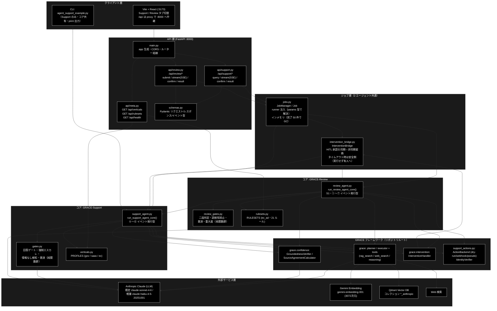
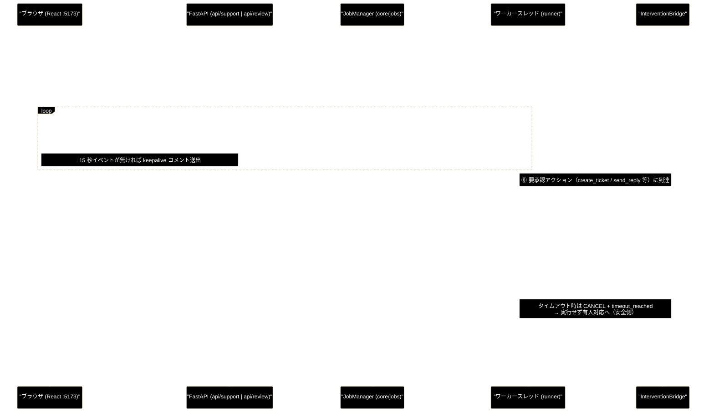

# backend/ ドキュメント整備インデックス

**Version 1.6** | 最終更新: 2026-08-01

> ✅ **本インデックス掲載のモジュール仕様（IPO）13 ファイルはすべて作成済み**（§4 参照）。

`backend/`（GRACE Web API: FastAPI + コアサービス）配下のモジュールについて、
アーキテクチャ・処理フロー・データフローの全体像と、ドキュメント作成対象・出力先・進捗を
一覧化した資料。個別モジュールの詳細ドキュメントは IPO 形式
（`.claude/skills/grace-agent-docs/a_class_method_md_format.md`）で作成し、
**`backend/docs/<module>.md`**（本 README と同じディレクトリ）に配置する。

### エージェントは 2 つ

`backend/app/` は**2 つの自律型エージェント**を提供する。両者は**ジョブ基盤
（`core/jobs.py`）・SSE・HITL ブリッジ・アクション実行を共有**し、違うのは
パラメータ型・結果型・パイプライン中身だけである。

| エージェント | 何をするか | コア | ルータ |
|---|---|---|---|
| **GRACE-Support**（問い合わせ → 回答） | 問い合わせに内部 RAG ＋ Web 裏取りで答え、確度が足りなければ有人へ倒す | `core/support_agent.py` | `/api/support/*` |
| **GRACE-Review**（文書 → 指摘） | 文書を規程（景表法・特商法・薬機法）に照らし、根拠条文つきの指摘を返す | `core/review_agent.py` | `/api/review/*` |

> 📌 **Support は CLI と Web の両方**から同じコアを通るが、**Review は Web 専用**
> （CLI エントリポイントは存在しない）。

---

## 目次

0. [アプリの実行方法（クイックスタート）](#0-アプリの実行方法クイックスタート)
1. [アーキテクチャ構成図](#1-アーキテクチャ構成図)
2. [処理フロー](#2-処理フロー)
   - [2-1. GRACE-Support パイプライン（①〜⑥）](#2-1-grace-support-パイプライン)
   - [2-2. GRACE-Review パイプライン（S1・①〜⑦）](#2-2-grace-review-パイプライン)
3. [データフロー（Web リクエスト → SSE → HITL 承認）](#3-データフローweb-リクエスト--sse--hitl-承認)
4. [モジュール仕様（IPO 形式）一覧](#4-モジュール仕様ipo-形式一覧)
5. [テスト仕様（SAE 形式）で扱うファイル](#5-テスト仕様sae-形式で扱うファイル)
6. [補足ドキュメント](#6-補足ドキュメント)
7. [backend/ 構成（参考）](#7-backend-構成参考)
8. [変更履歴](#8-変更履歴)

---

## 0. アプリの実行方法（クイックスタート）

GRACE は **FastAPI（バックエンド, :8000）＋ Vite + React（フロントエンド, :5173）** の
2 プロセス構成。**画面は :5173 で開く**（:8000 は API 専用で、`/` は 404 が正常）。
Support / Review はフロントの**タブ切替**で使い分ける（同一プロセス・同一ジョブ基盤）。

> 📦 初回のインストール・環境構築（uv / Node / Docker / `.env` / トラブルシュート）は
> **[`install_and_setup.md`](./install_and_setup.md)** を参照。以下は導入済み前提の起動手順。

**前提**: リポジトリルートの `.env` に `ANTHROPIC_API_KEY`（LLM）と `GOOGLE_API_KEY`（Embedding）、
Python 3.11+ / `uv` / Node.js / Docker が導入済み。

### 最短（推奨・1 コマンドで起動）

```bash
# 1) Qdrant（ベクトルDB）を起動（別実行・初回/停止後のみ）
docker-compose -f docker-compose/docker-compose.yml up -d

# 2) backend + frontend を 1 コマンドで起動（依存の用意も自動）
./run_dev.sh
#   → backend:  http://localhost:8000（/docs）
#   → frontend: http://localhost:5173  ← ブラウザで開くのはこちら
#   停止は Ctrl+C（両方まとめて停止）
```

`run_dev.sh` は `uv sync --extra dev` → frontend 依存の用意 → uvicorn(:8000) と
Vite(:5173) の同時起動までを行う（リポジトリルートの `run_dev.sh`）。

### 手動（プロセスを分けて起動）

```bash
# 1) Qdrant（ベクトルDB）を起動
docker-compose -f docker-compose/docker-compose.yml up -d

# 2) バックエンド（FastAPI）★リポジトリルートで実行
uv sync --extra dev
uv run uvicorn backend.app.main:app --reload --port 8000
#   → API: http://localhost:8000 、自動ドキュメント: http://localhost:8000/docs

# 3) フロントエンド（別ターミナル）
cd frontend
npm install
npm run dev
#   → UI: http://localhost:5173（/api は Vite proxy で http://127.0.0.1:8000 へ中継）
```

ブラウザで **http://localhost:5173** を開く。フロントの `/api/*` は Vite の proxy
（`frontend/vite.config.ts`）で :8000 の FastAPI へ中継される（SSE 進捗も同経路）。

**CLI 版**（Support のみ・コア共有）:

```bash
uv run python agent_support_example.py --vertical ec "返品したい"
```

> ⚠️ **Review に CLI は無い。** `run_review_agent_core()` を直接呼ぶことは可能だが、
> エントリポイントスクリプトは存在しないため、動作確認は :5173 の Review タブか
> `POST /api/review/submit` を使う。

**動作確認だけ**したい場合: `http://localhost:8000/api/health`（APIキー設定の有無を返す）。

**API の入口**（詳細は [`api_support.md`](./api_support.md) / [`api_review.md`](./api_review.md)）:

| エージェント | 起動 | 進捗（SSE） | HITL 応答 | 結果 |
|---|---|---|---|---|
| Support | `POST /api/support/query` | `GET /api/support/stream/{job_id}` | `POST /api/support/confirm/{job_id}` | `GET /api/support/result/{job_id}` |
| Review | `POST /api/review/submit` | `GET /api/review/stream/{job_id}` | `POST /api/review/confirm/{job_id}` | `GET /api/review/result/{job_id}` |
| メタ | `GET /api/verticals`（Support のプロファイル）・`GET /api/rulesets`（Review のルールセット）・`GET /api/health` | | | |

---

## 1. アーキテクチャ構成図

`backend/app/` は「API 層（FastAPI）→ ジョブ層（スレッド実行・SSE 配信・HITL 仲介）→
コアパイプライン層（判定ロジック）」の 3 層で、LLM 呼び出し・RAG 検索・Web 検索などの
実行部品はリポジトリルートの **GRACE フレームワーク（`grace/`）** と `support_actions.py` に委譲する。

**ジョブ層より上は 2 エージェントで完全に共通**、分岐するのはコアパイプライン層だけ。



**設計の要点**:

- **CLI と Web は同一コア**を共有する。`run_support_agent_core()` は入出力を
  `emit`（進捗イベント）/ `confirm`（HITL 承認）のコールバックに抽象化しており、
  CLI は print / 自動承認、Web は SSE / `InterventionBridge` を配線するだけの違い。
  Review も同じ形（`run_review_agent_core()`）だが、CLI エントリポイントは持たない。
- **ジョブ基盤は runner 注入で汎用化**されている。`job_manager.start(params)` が
  `params` の型（`JobParams` / `ReviewParams`）から runner を解決するため、
  `jobs.py` は Review 側のモジュールを一切知らない（循環 import も起きない）。
  runner の登録は各コアが import 時に `register_runner()` で行う。
- **Review は Support の機構を再利用する**。`GroundednessVerifier` を
  「主張が出典で裏付けられるか」→「**指摘が規程で裏付けられるか**」と読み替え、
  `_perform_action` / `ActionBackend` / `InterventionBridge` はそのまま使う。
  新規実装は Segment / Detect / Severity の 3 つだけ。
- **Web 側に自動承認を持ち込まない**。副作用のあるアクションは必ずフロントの承認
  （CONFIRM モーダル）を経由し、タイムアウト時は実行せず有人対応へ倒す。
- ジョブ管理はローカル開発用の**インメモリ・シングルプロセス前提**（永続化なし）。
- **設定はリクエスト単位で `copy.deepcopy`**（P-08）。両コアとも検索スコープ・方針を
  config へ書き込むため、シングルトンのままだとジョブ間で値を奪い合う。

---

## 2. 処理フロー

2 エージェントとも「ステップ列を `step`（started / finished / skipped）イベントとして
SSE へ配信し、UI のタイムラインと 1:1 対応させる」構造は同じ。中身だけが異なる。

### 2-1. GRACE-Support パイプライン

`run_support_agent_core()`（`core/support_agent.py`）が実行するステップ列。
各ステップは `step`（started / finished / skipped）イベントとして SSE に配信され、
UI のタイムライン表示（STEP_IDS: profile / plan / execute / confidence / gate / web /
no_info / action）と 1:1 に対応する。

```mermaid
flowchart TB
    START(["問い合わせ query"]) --> KEY{"ANTHROPIC_API_KEY<br>設定済み？"}
    KEY -- "未設定" --> ERR["error イベント → 終了"]
    KEY -- "OK" --> S1["S1 profile: 業界プロファイル適用<br>（--vertical 指定時のみ）<br>検索スコープ・しきい値・エスカレ語・本人確認を切替"]
    S1 --> P1["① Plan（planner）<br>クエリを実行計画に分解"]
    P1 --> P2["② Execute（executor + tools）<br>内部RAG検索 → reasoning<br>RAGスコア不足時は web_search を動的挿入"]
    P2 --> P3["③ Confidence（GroundednessVerifier）<br>回答の主張ごとに出典で裏付け検証<br>→ 支持率 support_rate"]
    P3 --> P4["④ 回答ゲート（_answer_gate）<br>支持率 ≥ notify → answer（高信頼）<br>confirm ≤ 支持率 < notify → answer＋未確認注記<br>低信頼/未検証/出典0 → escalate"]
    P4 --> FORCE{"エスカレ語に一致？<br>（二段判定: キーワード<br>→ 意図分類 Haiku）"}
    FORCE -- "一致かつ intent ≠ question" --> FESC["強制エスカレ<br>decision = escalate（⑤スキップ）"]
    FORCE -- "不一致 / FAQ質問（誤検知抑止）" --> RESCUE{"④-救済:<br>escalate だが 矛盾なし・<br>出典あり・実質回答？"}
    RESCUE -- "はい" --> RESC["answer に救済（未確認注記）<br>無駄な Web 二次生成を回避"]
    RESCUE -- "いいえ" --> WEBQ{"decision = escalate<br>かつ use_web？"}
    RESC --> NOINFO
    WEBQ -- "いいえ（answer 確定）" --> NOINFO
    WEBQ -- "はい" --> P5["⑤ Web フォールバック<br>②で Web 検索済みなら回答を再利用し再検証のみ<br>（重複推論を省略）／未使用なら<br>web_search → reasoning → 内部×Web 相互検証"]
    P5 --> NOINFO{"④' 情報なし回答検知<br>（answer のみ。二段判定:<br>定型句候補 or 出典Webのみ<br>→ 実質回答判定 Haiku）"}
    FESC --> NOINFO2["④' はスキップ（escalate のため）"]
    NOINFO -- "no_info（実質情報ゼロ）" --> TOESC["escalate に倒す<br>（no_info_detected=True）"]
    NOINFO -- "answered（実質回答）" --> P6
    NOINFO2 --> P6
    TOESC --> P6["⑥ Action（do_action 時）<br>_decide_action: escalate → escalate_to_human（承認不要）<br>answer → action_map の二段判定で起票/返信"]
    P6 --> IDCHK{"本人確認必須？<br>（require_identity）"}
    IDCHK -- "未確認" --> NOEXEC["実行せず有人対応へ引き継ぎ"]
    IDCHK -- "確認済み / 不要" --> HITL{"requires_confirmation？"}
    HITL -- "はい" --> CONFIRM["HITL CONFIRM<br>（Web: フロント承認待ち /<br>タイムアウト → 実行せず有人へ）"]
    HITL -- "いいえ（escalate_to_human）" --> EXEC
    CONFIRM -- "承認" --> EXEC["ActionBackend で実行<br>（dry-run / webhook / pseudo）"]
    CONFIRM -- "拒否 / タイムアウト" --> NOEXEC
    EXEC --> DONE(["result イベント（SupportResult）"])
    NOEXEC --> DONE
classDef default fill:#000,stroke:#fff,color:#fff
classDef subgraphStyle fill:#1a1a1a,stroke:#fff,color:#fff
class START,KEY,ERR,S1,P1,P2,P3,P4,FORCE,FESC,RESCUE,RESC,WEBQ,P5,NOINFO,NOINFO2,TOESC,P6,IDCHK,NOEXEC,HITL,CONFIRM,EXEC,DONE default
```



**判定ロジックの要点**（詳細は [`core_gates.md`](./core_gates.md) / [`core_support_agent.md`](./core_support_agent.md) /
ステップ別の IPO は [`backend_flow.md`](./backend_flow.md)）:

| 機構 | 目的 | 実装 |
|------|------|------|
| 回答ゲート | 支持率と出典数で answer / escalate を判定（プロファイルでしきい値上書き可） | `_answer_gate` |
| 強制エスカレ（二段判定） | エスカレ語（例: 障害・返金・訴訟）の一致 → 意図分類（Haiku）で FAQ 質問の誤検知を抑止 | `_should_force_escalate` + `create_intent_classifier` |
| ④-救済 | 「肯定の裏付けが弱いだけで矛盾なし・出典付き」の内部回答を escalate から救い、誤エスカレと無駄な Web 二次生成を防ぐ | `_should_rescue_unaffirmed` |
| ⑤ Web フォールバック | 内部 escalate 時のみ Web で裏取り。② が Web 検索済みなら回答を再利用して再検証だけ行う（1 ケース十数秒〜の短縮） | `run_support_agent_core` 内 |
| ④' 情報なし検知（二段判定） | 誠実な「見つかりませんでした」型回答（ゲートを answer で通過してしまう）を実質回答判定（Haiku）で検出し有人へ | `_detect_no_info_answer` + `create_no_info_judge` |
| ⑥ Action | 本人確認 → HITL CONFIRM → バックエンド実行。escalate 時の `escalate_to_human` は承認不要で直接実行（引き継ぎの取りこぼし防止） | `_decide_action` + `_perform_action` |

---

### 2-2. GRACE-Review パイプライン

`run_review_agent_core()`（`core/review_agent.py`）が実行するステップ列。
Support が「問い合わせ → 回答」なのに対し、**「文書 → 指摘」**と情報の流れが逆になる。

> ⚠️ **番号順 ≠ 実行順。** 番号は Support との**対応**を示す呼称で、実際の実行順は
> `REVIEW_STEP_IDS` の並び **S1 → ① → ② → ③ → ④ → ④' → ⑥ → ⑤ → ⑦**。
> **⑥ Web 裏取りが ⑤ Severity より先**に来る（Support で ④' が ⑤ の後に来るのと同じ事情）。

```mermaid
flowchart TB
    START(["文書 document"]) --> KEY{"ANTHROPIC_API_KEY<br>設定済み？"}
    KEY -- "未設定" --> ERR["error イベント → 終了"]
    KEY -- "OK" --> S1["S1 ruleset: RuleSet 適用<br>検索スコープ・しきい値・重大リスク語<br>（既定 ec_ad・21 ルール）"]
    S1 --> P1["① segment: 文書を検査単位へ分割<br>決定的・LLM 不使用<br>原文の文字オフセットを保持（UI ハイライト用）"]
    P1 --> EMPTY{"セグメント 0 件<br>または RuleSet 未解決？"}
    EMPTY -- "はい" --> DONE0(["空の result イベント → 終了"])
    EMPTY -- "いいえ" --> LOOP["②〜④' セグメント × 候補ルールの二重ループ"]
    LOOP --> P2["② retrieve: 規程を RAG 検索<br>（rag_search 無改造・limit 5）<br>0 件なら RuleItem.description へフォールバック"]
    P2 --> P3["③ detect: 二段判定<br>第1段 キーワードで候補ルール抽出<br>→ 第2段 LLM で violates 判定"]
    P3 --> P4["④ ground: GroundednessVerifier<br>「指摘が規程で裏付けられるか」<br>→ confidence = support_rate"]
    P4 --> P5{"④' suppress: 状態判定<br>confirmed / review_required / suppressed"}
    P5 -- "suppressed だが<br>矛盾なし・根拠あり・実質的" --> RESC["救済 → review_required"]
    P5 -- "suppressed" --> SUP["findings から除外<br>（理由を記録・件数のみ集計）"]
    P5 -- "confirmed / review_required" --> KEEP["findings に追加"]
    RESC --> KEEP
    KEEP --> GUARD{"LLM 呼び出しが<br>上限 300 に到達？"}
    SUP --> GUARD
    GUARD -- "はい" --> TRUNC["truncated=True で打ち切り"]
    GUARD -- "いいえ・ループ継続" --> LOOP
    TRUNC --> P6
    LOOP --> P6{"⑥ web: use_web かつ指摘あり？"}
    P6 -- "いいえ" --> P7
    P6 -- "はい" --> WEBC["法改正・ガイドラインを確認<br>⚠️ 新しい指摘は作らない<br>web_checked を立てるだけ"]
    WEBC --> P7["⑤ severity: 重大度の確定<br>adjust_severity（確信度で上下）<br>＋ 重大リスク語の二段判定で強制 high"]
    P7 --> P8{"⑦ action: 指摘あり かつ do_action？"}
    P8 -- "いいえ" --> DONE
    P8 -- "high あり" --> ESC["escalate_to_human<br>（承認不要・引き継ぎの取りこぼし防止）"]
    P8 -- "high なし" --> TICKET["create_ticket（要承認）<br>→ HITL CONFIRM 待ち"]
    ESC --> EXEC["ActionBackend で実行<br>（dry-run / webhook / pseudo）<br>本人確認は不要"]
    TICKET -- "承認" --> EXEC
    TICKET -- "拒否 / タイムアウト" --> NOEXEC["実行せず有人対応へ"]
    EXEC --> DONE(["result イベント（ReviewResult）"])
    NOEXEC --> DONE
classDef default fill:#000,stroke:#fff,color:#fff
classDef subgraphStyle fill:#1a1a1a,stroke:#fff,color:#fff
class START,KEY,ERR,S1,P1,EMPTY,DONE0,LOOP,P2,P3,P4,P5,RESC,SUP,KEEP,GUARD,TRUNC,P6,WEBC,P7,P8,ESC,TICKET,EXEC,NOEXEC,DONE default
```



**判定ロジックの要点**（詳細は [`core_review_gates.md`](./core_review_gates.md) /
[`core_review_agent.md`](./core_review_agent.md) / ステップ別の IPO は [`review_flow.md`](./review_flow.md)）:

| 機構 | 目的 | 実装 |
|------|------|------|
| ① 決定的分割 | 空行→段落、箇条書き・見出しは行単位、400 字超は文末で再分割。**原文オフセットを保持**（正規化するとハイライトがずれる） | `split_segments` |
| ③ 二段判定 | 第1段のキーワードで候補ルールを絞り、第2段の LLM で違反判定。全組合せを流すと 200×21=4,200 回になるため | `select_candidate_rules` + `create_violation_detector` |
| 組合せ爆発ガード | `MAX_SEGMENTS=200` / `MAX_LLM_CALLS=300` で必ず打ち切り、`truncated` に記録 | `run_review_agent_core` 内 |
| ④ Ground | Support の `GroundednessVerifier` をそのまま流用し、「指摘が規程で裏付けられるか」を検証 | `create_groundedness_verifier` |
| ④' 抑止 + 救済 | 根拠不足・実質性なしを `suppressed` で落とす。ただし「矛盾なし・根拠あり」は保留として救済 | `decide_finding_status` + `should_rescue_finding` |
| ⑥ Web 裏取り | 法改正の確認**のみ**。⚠️ Web を根拠に新しい指摘は作らない（出典の信頼性を担保できない）。既定 OFF | `_web_crosscheck` |
| ⑤ 強制 high（二段判定） | 重大リスク語の一致 → 言及種別の分類で「単なる言及」の誤検知を抑止 | `should_force_high` + `create_mention_classifier` |
| ⑦ Action | high があれば `escalate_to_human`（承認不要）、無ければ `create_ticket`（要承認）。**本人確認は不要** | `_decide_review_action` + `_perform_action` |

**Support との対応関係**:

| 観点 | GRACE-Support | GRACE-Review |
|---|---|---|
| 入力 | 問い合わせ（短文） | 文書（長文・最大 `MAX_DOCUMENT_CHARS`） |
| 出力 | 回答 ＋ 出典 ＋ decision | 指摘リスト ＋ 根拠条文 ＋ severity |
| 検証の読み替え | 回答の主張が出典で裏付けられるか | **指摘が規程で裏付けられるか** |
| 二段判定の用途 | 強制エスカレ・情報なし検知 | 違反検出・強制 high |
| 本人確認 | プロファイル次第（`ec` は必須） | **不要** |
| Web の役割 | 内部で答えられない時の**フォールバック**（回答を作る） | 法改正の**裏取り**（判定は変えない） |
| CLI | あり（`agent_support_example.py`） | **なし**（Web 専用） |

---

## 3. データフロー（Web リクエスト → SSE → HITL 承認）

1 リクエスト = 1 ジョブ。パイプラインはワーカースレッドで実行され、進捗は `Job.events`
に蓄積される。SSE は**常に先頭からリプレイ**されるため、再接続・途中購読でも取りこぼさない。

> 📌 **この流れは 2 エージェント共通。** 以下は Support で描くが、Review も
> エンドポイントが `/api/review/*`、パラメータが `ReviewParams`、結果が `ReviewResult`
> に変わるだけで、ジョブ起動・SSE・HITL・結果取得の構造は**完全に同一**
> （`api/review.py` は `api/support.py` と同じ形をしている）。
> イベント形式も同一（`data: {SupportEventModel の JSON}`・イベント名なし・末尾に done 番兵）
> なので、**フロントは同じパーサを使える**。



**データの流れ・形式**（詳細は [`schemas.md`](./schemas.md) / [`core_jobs.md`](./core_jobs.md) /
[`core_intervention_bridge.md`](./core_intervention_bridge.md)）:

1. **入力**: `QueryRequest`（CLI 引数と 1:1。`vertical` は `gov`/`saas`/`ec`、既定 `dry_run=True`）
2. **進捗**: `SupportEvent`（type = step / log / intervention / result / error）に
   `seq`（通し番号）と `ts`（時刻）を付与した JSON を SSE（`data:` 行・イベント名なし）で配信
3. **HITL**: `intervention` イベント（waiting）→ `POST /confirm` → resolved / timeout。
   応答は `threading.Event` でワーカースレッドへ同期的に返る
4. **出力**: `SupportResult`（answer / citations / groundedness / decision / warning /
   used_web / source_agreement / action_result / KPI メタデータ等）を `result` イベントと
   `GET /result/{job_id}` の両方で取得可能
5. **エラー**: APIキー未設定・Qdrant 未起動・LLM タイムアウト等は `error` イベントとして
   配信され、ジョブは `failed` で終了する

---

## 4. モジュール仕様（IPO 形式）一覧

- **対象**: `backend/app/` 配下の Python モジュール（FastAPI 起動・API 層・コア層・スキーマ）。
- **フォーマット**: IPO 形式（`a_class_method_md_format.md`）。
  単体テストは SAE 形式（`a_test_md_format.md`、`grace-agent-tests` スキル担当・§5）。
- **出力先**: **`backend/docs/<module>.md`**（本 README と同じディレクトリ）。
- **技術スタック表記**: LLM = Anthropic Claude（既定 `claude-sonnet-4-6`、
  軽量判定 `claude-haiku-4-5-20251001`）／ Embedding = Gemini（`gemini-embedding-001`, 3072次元）。

#### 共通（アプリ基盤）

| # | ソースファイル | 行数 | クラス/関数 | 役割 | ドキュメント | 状態 |
|---|---|---:|---:|---|---|:--:|
| 1 | `backend/app/main.py` | 59 | 0（モジュール構成のみ） | FastAPI 起動・CORS・ルーター結線 | [`main.md`](./main.md) | ✅ |
| 2 | `backend/app/schemas.py` | 228 | 16 | Pydantic リクエスト/レスポンス/イベント型 | [`schemas.md`](./schemas.md) | ✅ |
| 3 | `backend/app/api/meta.py` | 68 | 3 | `/api/verticals`・`/api/rulesets`・`/api/health` | [`api_meta.md`](./api_meta.md) | ✅ |
| 4 | `backend/app/core/jobs.py` | 263 | 6 | ジョブ管理（runner 注入・スレッド実行・SSE 供給） | [`core_jobs.md`](./core_jobs.md) | ✅ |
| 5 | `backend/app/core/intervention_bridge.py` | 125 | 2 | HITL ↔ フロント承認の非同期ブリッジ | [`core_intervention_bridge.md`](./core_intervention_bridge.md) | ✅ |

#### GRACE-Support（問い合わせ → 回答）

| # | ソースファイル | 行数 | クラス/関数 | 役割 | ドキュメント | 状態 |
|---|---|---:|---:|---|---|:--:|
| 6 | `backend/app/api/support.py` | 83 | 4 | `/api/support/*`（query / stream(SSE) / confirm / result） | [`api_support.md`](./api_support.md) | ✅ |
| 7 | `backend/app/core/support_agent.py` | 568 | 5 | ★コア（①〜⑥ イベント発行型パイプライン） | [`core_support_agent.md`](./core_support_agent.md) | ✅ |
| 8 | `backend/app/core/gates.py` | 393 | 15 | 回答ゲート/強制エスカレ/情報なし検知/救済/出典整形（純関数群） | [`core_gates.md`](./core_gates.md) | ✅ |
| 9 | `backend/app/core/verticals.py` | 123 | 2 | VerticalProfile 定義（gov / saas / ec） | [`core_verticals.md`](./core_verticals.md) | ✅ |

#### GRACE-Review（文書 → 指摘）

| # | ソースファイル | 行数 | クラス/関数 | 役割 | ドキュメント | 状態 |
|---|---|---:|---:|---|---|:--:|
| 10 | `backend/app/api/review.py` | 101 | 4 | `/api/review/*`（submit / stream(SSE) / confirm / result） | [`api_review.md`](./api_review.md) | ✅ |
| 11 | `backend/app/core/review_agent.py` | 814 | 8 | ★コア（S1・①〜⑦ イベント発行型パイプライン） | [`core_review_agent.md`](./core_review_agent.md) | ✅ |
| 12 | `backend/app/core/review_gates.py` | 418 | 12 | 二段判定・指摘ゲート・誤検知抑止・重大度（純関数群＋ファクトリ） | [`core_review_gates.md`](./core_review_gates.md) | ✅ |
| 13 | `backend/app/core/rulesets.py` | 450 | 5 | RuleSet 定義（ec_ad・21 ルール） | [`core_rulesets.md`](./core_rulesets.md) | ✅ |

> **設計書**: GRACE-Review の全体設計は [`review_agent_spec.md`](./review_agent_spec.md)（実装済み）。
> **ステップ別 IPO**: Support は [`backend_flow.md`](./backend_flow.md)、Review は [`review_flow.md`](./review_flow.md)。
> **フロントエンド**: Review の UI は [`../../frontend/docs/review_ui.md`](../../frontend/docs/review_ui.md)。

**ドキュメント不要（対象外）**: いずれも空ファイル（0 行）—
`backend/__init__.py`、`backend/app/__init__.py`、`backend/app/api/__init__.py`、
`backend/app/core/__init__.py`、`backend/tests/__init__.py`。

---

## 5. テスト仕様（SAE 形式）で扱うファイル

> 本インデックスの担当外（`grace-agent-tests` スキル・別フォーマット）。参考として掲載。
> テストはスタブベースで**実 API キー・Qdrant 不要**（`conftest.py` 参照）。

| ソースファイル | 行数 | 内容 |
|---|---:|---|
| `backend/tests/conftest.py` | 293 | pytest フィクスチャ（スタブベース・API キー不要）。Support / Review 両方 |
| `backend/tests/test_support_agent_core.py` | 235 | CLI とコアの同等性テスト |
| `backend/tests/test_api.py` | 163 | Support API エンドポイントのテスト |
| `backend/tests/test_intervention_bridge.py` | 105 | HITL ブリッジのテスト |
| `backend/tests/test_jobs_generic.py` | 337 | ジョブ基盤の汎用化（**Support の回帰ガード**＋runner 注入） |
| `backend/tests/test_rulesets.py` | 258 | RuleSet の整合（件数・ID 一意・always_check ⟷ keywords 排他） |
| `backend/tests/test_review_gates.py` | 356 | 判定・抑止の純関数（しきい値境界・救済条件・強制 high） |
| `backend/tests/test_review_agent_core.py` | 664 | Review パイプラインの配線（オフセット・KPI・ガード） |
| `backend/tests/test_review_api.py` | 285 | Review API・422 ガード・`/api/rulesets`・Support の無影響 |

**フロントエンド**（vitest・43 件）:

| ソースファイル | 内容 |
|---|---|
| `frontend/src/state/jobReducer.test.ts` | Support の reducer（7 件） |
| `frontend/src/state/reviewReducer.test.ts` | Review の reducer（13 件） |
| `frontend/src/state/highlight.test.ts` | ハイライト分割・重なり解消（13 件） |
| `frontend/src/markdown/parseMarkdown.test.ts` | Markdown パーサ（10 件） |

---

## 6. 補足ドキュメント

モジュール仕様（IPO・§4）以外に、`backend/docs/` には以下の横断ドキュメントがある。

| ファイル | 対象 | 内容 |
|---|:--:|---|
| [`install_and_setup.md`](./install_and_setup.md) | 共通 | インストール・環境設定ガイド（uv / Node / Docker / `.env` / トラブルシュート） |
| [`react_processing_flow.md`](./react_processing_flow.md) | 共通 | `run_dev.sh` 起点の React ↔ FastAPI 処理フロー詳細 |
| [`confidence_flow_grace_vs_backend.md`](./confidence_flow_grace_vs_backend.md) | 共通 | 信頼度測定フローの比較（`grace/` 自律エージェント本体 vs `backend/app/` Web 判定層） |
| [`backend_flow.md`](./backend_flow.md) | Support | 処理フロー ステップ詳細 (0)〜(8)（実装関数・シグネチャ・IPO・戻り値例） |
| [`review_flow.md`](./review_flow.md) | Review | 処理フロー ステップ詳細 S1・①〜⑦（同上） |
| [`review_agent_spec.md`](./review_agent_spec.md) | Review | 設計書（意図と判断の記録）。**実装後はモジュール仕様が正** |

> 📝 `backend_flow.md` は元々 `backend/app/` にあったが、CLAUDE.md §7.1
> （backend のドキュメントは `backend/docs/`）に合わせて本ディレクトリへ移設した。

---

## 7. backend/ 構成（参考）

```
backend/
├── app/
│   ├── main.py                     # FastAPI 起動・CORS・ルーター結線（support / review / meta）
│   ├── schemas.py                  # Pydantic: リクエスト/レスポンス/イベント（Support + Review）
│   ├── api/
│   │   ├── support.py              # /api/support/*  query / stream(SSE) / confirm / result
│   │   ├── review.py               # /api/review/*   submit / stream(SSE) / confirm / result
│   │   └── meta.py                 # GET /api/verticals, /api/rulesets, /api/health
│   └── core/
│       │  ── 共通（2 エージェントで共有）──
│       ├── jobs.py                 # ジョブ管理（runner 注入・インメモリ・スレッド実行）
│       ├── intervention_bridge.py  # HITL ↔ フロント承認の非同期ブリッジ
│       │  ── GRACE-Support ──
│       ├── support_agent.py        # ★コア（①〜⑥ イベント発行型パイプライン）
│       ├── gates.py                # 回答ゲート/強制エスカレ/情報なし検知/救済（純関数）
│       ├── verticals.py            # VerticalProfile 定義（gov / saas / ec）
│       │  ── GRACE-Review ──
│       ├── review_agent.py         # ★コア（S1・①〜⑦ イベント発行型パイプライン）
│       ├── review_gates.py         # 二段判定/誤検知抑止/救済/重大度（純関数）
│       └── rulesets.py             # RuleSet 定義（ec_ad・21 ルール）
├── docs/                           # ← 本 README とモジュールドキュメント（IPO形式）の配置先
└── tests/                          # pytest（スタブベース・API キー不要）
    └── data/                       # Review のテストデータ（ec_ad_{ok,ng,edge}_sample.txt）
```

---

## 8. 変更履歴

| バージョン | 変更内容 |
|-----------|---------|
| 1.0 | 初版作成（backend/ ドキュメント整備の対象一覧・出力先・進捗をまとめたインデックス。`main.py` を作成済としてマーク） |
| 1.1 | モジュール仕様（IPO）残り 8 ファイル（schemas / api_support / api_meta / core_support_agent / core_gates / core_jobs / core_intervention_bridge / core_verticals）を作成し、状態列を全て「作成済」に更新 |
| 1.2 | 先頭に「§0 アプリの実行方法（クイックスタート）」を追加し、`install_and_setup.md`（インストール・環境設定）へのリンクを追記 |
| 1.3 | §0 に「最短（1 コマンド `./run_dev.sh`）」の起動方法を追加（backend + frontend を一括起動） |
| 1.4 | 実コード再読による全面最新化: §1 アーキテクチャ構成図（6 層）・§2 処理フロー（パイプライン ①〜⑥＋二段判定・救済・HITL）・§3 データフロー（SSE / HITL 承認のシーケンス図）を新設。ドキュメント出力先の誤記を実配置（`backend/docs/`）に修正し、各ドキュメントへのリンクを追加。行数を実測に更新（support_agent 538 / gates 374 / test_support_agent_core 235）。補足ドキュメント一覧（§6）を追加し、目次を整備 |
| 1.5 | GRACE-Review の追加に追随（PR #37〜#43）: モジュール一覧を Support / Review / 共通の 3 区分へ再編し、Review の 4 モジュール（`review_agent` / `review_gates` / `rulesets` / `api_review`）を追加。行数を実測に更新。テスト一覧に Review の 4 ファイルとフロントの vitest を追記 |
| 1.6 | **2 エージェント構成へ全面改訂**: 冒頭に Support / Review の対比表を追加（Review は Web 専用＝CLI なし）。§1 構成図に Review のコア 3 モジュール・`api/review.py` を追加し、ジョブ層が runner 注入で共通化されている点・Review が Support の機構を再利用する点・P-08 の設定分離を設計の要点へ追記。§2 を 2-1（Support）/ 2-2（Review）に分割し、Review のパイプライン図（S1・①〜⑦）＋判定ロジック表＋Support との対応関係表を新設（**番号順 ≠ 実行順**、⑥ Web が ⑤ Severity より先である点を明記）。§0 に両エージェントのエンドポイント表と「Review に CLI は無い」注記を追加。§3 に 2 エージェント共通である旨を明記。§6 に `backend_flow.md`（移設）・`review_flow.md`（新規）・`review_agent_spec.md` を掲載。§7 構成ツリーを Review 込みへ更新。`gates.py` の関数数を実測に修正（14 → 15） |
