# GRACE（grace_v2）- 業界特化・自律型エージェント基盤 ドキュメント

**Version 4.0** | 最終更新: 2026-10-08

> 日本語 RAG に、根拠検証（groundedness）・Web 裏取り・HITL（Human-In-The-Loop）承認を組み合わせた、
> 業界特化の自律型エージェント。`./run_dev.sh` で起動し、ブラウザ（http://localhost:5173）の 4 タブから使う。

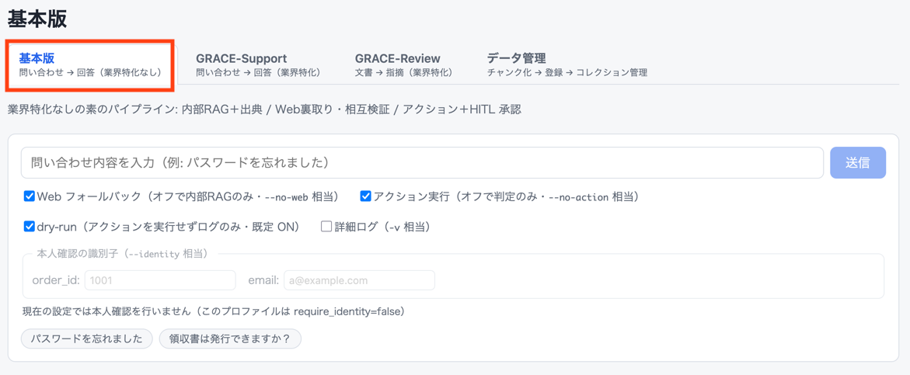

---

## 目次

- [概要](#概要)
  - [主な責務](#主な責務)
  - [各責務対応のモジュール](#各責務対応のモジュール)
  - [アーキテクチャ構成図](#アーキテクチャ構成図)
- [1. アプリの 4 タブ（`./run_dev.sh`）](#1-アプリの-4-タブrun_devsh)
- [2. 基本版 — 問い合わせ ＋ RAG](#2-基本版--問い合わせ--rag)
- [3. GRACE-Support — 問い合わせ ＋ RAG ＋ 業界プロファイル](#3-grace-support--問い合わせ--rag--業界プロファイル)
- [4. GRACE-Review — 規程 RAG ＋ 根拠検証で広告表示を点検](#4-grace-review--規程-rag--根拠検証で広告表示を点検)
- [5. データ管理 — チャンキング → Q/A 作成 → Qdrant 登録 → コレクション管理](#5-データ管理--チャンキング--qa-作成--qdrant-登録--コレクション管理)
- [6. 処理概要（主要な処理モジュール）](#6-処理概要主要な処理モジュール)
- [7. 起動と設定](#7-起動と設定)
- [8. 全タブ共通の仕組み](#8-全タブ共通の仕組み)
- [9. 検証（CI と同じゲート）](#9-検証ci-と同じゲート)
- [10. うまく動かないとき](#10-うまく動かないとき)
- [11. 関連ドキュメント](#11-関連ドキュメント)
- [12. 変更履歴](#12-変更履歴)

---

## 概要

**GRACE** は、問い合わせや文書を受け取り、社内ナレッジ（Qdrant に登録した RAG コレクション）を根拠に
**回答**または**指摘**を返すエージェント基盤である。出した回答・指摘が出典で裏付けられるかを検証し、
支持率で「そのまま出す / 注意つきで出す / 人へ引き継ぐ」を決め、起票や返信などの副作用は
**人が承認するまで実行しない**。

本書はリポジトリの入口として、画面の 4 タブそれぞれの「**業界特化**」「**処理フロー**」「**回答（出力）**」と、
それを支える**主要な処理モジュール**をまとめる。各モジュールの詳細（IPO）・各画面部品の詳細は
それぞれの `docs/` に置き、本書からはリンクする（[11. 関連ドキュメント](#11-関連ドキュメント)）。

| タブ | 情報の流れ | 業界特化 | コア関数 |
|---|---|---|---|
| **基本版** | 問い合わせ → 回答 | なし（全コレクションを検索） | `run_support_agent_core`（`vertical=None`） |
| **GRACE-Support** | 問い合わせ → 回答 | 業界の How-to（`VerticalProfile`：`gov` / `saas` / `ec`） | `run_support_agent_core`（`vertical` 指定） |
| **GRACE-Review** | 文書 → 指摘 | 業界の法令遵守（`RuleSet`：`ec_ad`） | `run_review_agent_core` |
| **データ管理** | CSV → チャンク → Q/A → Qdrant | — | `backend/app/core/data_jobs.py` の各ランナー |

技術スタック:

| 用途 | 採用 | 既定 |
|---|---|---|
| LLM（回答生成・推論・根拠検証・Q/A 生成ほか） | Anthropic Claude | `claude-sonnet-5-5`（軽量・判定系とチャンキングは `claude-haiku-5-5`） |
| Embedding（検索） | Gemini | `gemini-embedding-001`（3072 次元） |
| ベクトル DB | Qdrant | `docker-compose/docker-compose.yml` |
| Web API | FastAPI（SSE でステップ進捗を配信） | :8000 |
| フロントエンド | Vite + React 18 + TypeScript | :5173 |

### 主な責務

- 問い合わせに、登録済みの全コレクションを根拠として回答する（基本版）
- 問い合わせに、業界プロファイルで絞った社内ナレッジと業界の方針で回答する（GRACE-Support）
- 広告文書を EC 広告表示ルールと規程 RAG で点検し、条文つきの指摘を出す（GRACE-Review）
- 回答・指摘が出典で裏付けられるかを検証し、支持率で確定・要確認・有人対応に振り分ける
- 副作用のあるアクション（起票・返信）を、人間の承認（HITL CONFIRM）を得るまで実行しない
- RAG の元データを、チャンク化 → Q/A 生成 → Qdrant 登録の 3 工程で用意し、コレクションを管理する（データ管理）
- 画面からの実行をジョブとして受け付け、各ステップの進捗を SSE で画面へ配信する

### 各責務対応のモジュール

| # | 責務 | 対応モジュール | 説明 |
|---|------|--------------|------|
| 1 | 全コレクションを根拠とした回答（基本版） | `backend/app/core/support_agent.py` | `run_support_agent_core` を `vertical=None` で実行。画面は `SupportPanel`（`variant="basic"`） |
| 2 | 業界プロファイル適用の回答（GRACE-Support） | `backend/app/core/verticals.py` | `PROFILES`（`gov` / `saas` / `ec`）。コアは 1 と同じ関数（`variant="vertical"`） |
| 3 | 広告文書の点検と条文つき指摘（GRACE-Review） | `backend/app/core/review_agent.py` | `run_review_agent_core`。ルールは `backend/app/core/rulesets.py::EC_AD`（23 ルール） |
| 4 | 根拠検証と確定・要確認・有人対応の振り分け | `grace/confidence.py` | `GroundednessVerifier`（両エージェント共用）。判定は `backend/app/core/gates.py` / `backend/app/core/review_gates.py` |
| 5 | アクションの HITL 承認 | `support_actions.py` | `ActionBackend`（両エージェント共用）。承認待ちは `grace/intervention.py` ⇄ `backend/app/core/intervention_bridge.py` ⇄ 画面の `ConfirmModal` |
| 6 | RAG データの準備とコレクション管理 | `backend/app/core/data_jobs.py` | 工程ごとのランナーが `chunking/` / `qa_generation/` / `qa_qdrant/` / `services/` を呼ぶ（CLI と同じ関数） |
| 7 | ジョブの受付と SSE 配信 | `backend/app/core/jobs.py` | `JobManager`。ルーターは `backend/app/api/`、画面側の購読は `frontend/src/api/client.ts::subscribeStream` |

### アーキテクチャ構成図

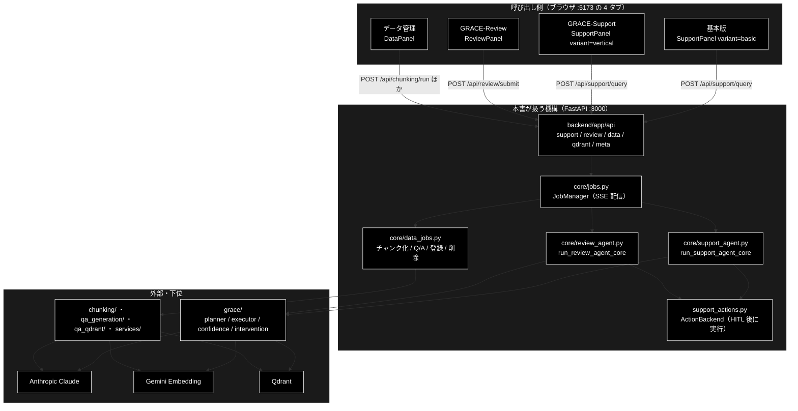
```mermaid
flowchart TB
    subgraph CALLER["呼び出し側（ブラウザ :5173 の 4 タブ）"]
        T1["基本版<br>SupportPanel variant=basic"]
        T2["GRACE-Support<br>SupportPanel variant=vertical"]
        T3["GRACE-Review<br>ReviewPanel"]
        T4["データ管理<br>DataPanel"]
    end
    subgraph MECH["本書が扱う機構（FastAPI :8000）"]
        API["backend/app/api<br>support / review / data / qdrant / meta"]
        JOB["core/jobs.py<br>JobManager（SSE 配信）"]
        SUP["core/support_agent.py<br>run_support_agent_core"]
        REV["core/review_agent.py<br>run_review_agent_core"]
        DATA["core/data_jobs.py<br>チャンク化 / Q/A / 登録 / 削除"]
        ACT["support_actions.py<br>ActionBackend（HITL 後に実行）"]
    end
    subgraph EXTERNAL["外部・下位"]
        GRACE["grace/<br>planner / executor / confidence / intervention"]
        PREP["chunking/ ・ qa_generation/ ・ qa_qdrant/ ・ services/"]
        LLM["Anthropic Claude"]
        EMB["Gemini Embedding"]
        QD["Qdrant"]
    end
    T1 -->|"POST /api/support/query"| API
    T2 -->|"POST /api/support/query"| API
    T3 -->|"POST /api/review/submit"| API
    T4 -->|"POST /api/chunking/run ほか"| API
    API --> JOB
    JOB --> SUP
    JOB --> REV
    JOB --> DATA
    SUP --> ACT
    REV --> ACT
    SUP --> GRACE
    REV --> GRACE
    DATA --> PREP
    GRACE --> LLM
    GRACE --> EMB
    GRACE --> QD
    PREP --> LLM
    PREP --> EMB
    PREP --> QD
classDef default fill:#000,stroke:#fff,color:#fff
classDef subgraphStyle fill:#1a1a1a,stroke:#fff,color:#fff
class T1,T2,T3,T4,API,JOB,SUP,REV,DATA,ACT,GRACE,PREP,LLM,EMB,QD default
style CALLER fill:#1a1a1a,stroke:#fff,color:#fff
style MECH fill:#1a1a1a,stroke:#fff,color:#fff
style EXTERNAL fill:#1a1a1a,stroke:#fff,color:#fff
```

**データフロー**:

1. 画面は実行をジョブとして投入し（`202 Accepted` で `job_id` が返る）、`GET .../stream/{job_id}`（SSE）で各ステップの進捗を受け取る
2. 基本版と GRACE-Support は**同じコア関数**へ入る。違いは `vertical` を渡すかどうかだけ。GRACE-Review は別のコア関数で、ルールセットを適用する
3. コアは `grace/` の部品で Qdrant を検索し（Gemini で Embedding）、Claude で回答・指摘を生成し、`GroundednessVerifier` で根拠を検証する
4. ゲートが支持率で結果を振り分け、副作用のあるアクションは画面の承認（`POST .../confirm/{job_id}`）を待ってから `ActionBackend` が実行する
5. データ管理は、3 タブが検索するコレクションを用意する側である。チャンク化と Q/A 生成で Claude を、登録で Gemini Embedding を使う

---

## 1. アプリの 4 タブ（`./run_dev.sh`）


| | 基本版 | GRACE-Support | GRACE-Review | データ管理 |
|---|---|---|---|---|
| 画面の説明文 | 問い合わせ → 回答（業界特化なし） | 問い合わせ → 回答（業界特化） | 文書 → 指摘（業界特化） | チャンク化 → 登録 → コレクション管理 |
| 入力 | 短い質問 | 短い質問 ＋ 業界（`gov` / `saas` / `ec`） | 広告文書（LP など）＋ ルールセット | CSV / テキスト・コレクション名 |
| 業界特化 | **なし**（RAG のコレクション情報のみ） | **業界の How-to**（`VerticalProfile`） | **業界の法令遵守**（`RuleSet`） | — |
| 検索する知識 | **全コレクション** | 業界の専用コレクション | 規程・条文のコレクション | — |
| 出力 | 回答 1 件 ＋ 出典 | 回答 1 件 ＋ 出典 | 指摘 N 件（条文・重大度つき） | チャンク CSV / Q/A CSV / コレクション |
| 確からしさの指標 | groundedness（支持率）・全体信頼度 | 同左 | 指摘ごとの支持率 → 確定 / 要確認 / 抑止 | — |
| ステップ数 | 9（0-(B) はスキップ） | 9 | 9 | 工程ごと |

- タブの並びは「**業界特化を足していく順**」である。基本版が素のパイプラインで、GRACE-Support は
  `VerticalProfile`、GRACE-Review は `RuleSet` を差し替えたものにあたる
- 基本版と GRACE-Support は**同じ画面部品**（`SupportPanel`）に `variant` を渡しているだけで、別実装ではない
- 3 タブの見え方の正本は [`docs/app_tabs_overview.md`](docs/app_tabs_overview.md)、ステップの対照表とモード別の
  ガードレールの正本は [`docs/pipelines.md`](docs/pipelines.md) にある

---

## 2. 基本版 — 問い合わせ ＋ RAG

業界プロファイルを使わない**素のパイプライン**。画面のリード文は
「業界特化なしの素のパイプライン: 内部RAG＋出典 / Web裏取り・相互検証 / アクション＋HITL 承認」。
業界由来のガードレールが効かないので、パイプライン本体の挙動を確かめる用途に向く。

### 2.1 業界特化

**なし。** RAG のコレクション情報だけで答える。

- 検索スコープを絞らない（`allowed_collections = []` → **登録済みの全コレクション**が対象）
- しきい値はグローバル既定（`config/grace_config.yml` の `confidence.thresholds`：notify 0.7 / confirm 0.4）
- 担当範囲の判定・強制エスカレのキーワード・本人確認・業界方針のプロンプト注入は**行わない**

### 2.2 処理フロー

画面のステップトレースの表示名（`frontend/src/state/jobReducer.ts::STEP_LABELS`）を実行順に並べる。
右列は例文「領収書は発行できますか？」の実行例である。

| 実行順 | ステップ（画面の表示名） | ステップ ID | 実行例 |
|:--:|---|---|---|
| 1 | 0-(A) 入力・質問分析（複数質問の検知） | `analyze` | 単一の質問として通過 |
| 2 | 0-(B) 業界プロファイル適用 | `profile` | **スキップ**（基本版はプロファイルなし） |
| 3 | ① Plan（planner） | `plan` | 実行計画を生成 |
| 4 | ② Execute（内部RAG → reasoning） | `execute` | 全コレクションを検索し、回答を生成 |
| 5 | ③ Groundedness（根拠検証） | `confidence` | 支持率 1.00 |
| 6 | ④ 回答ゲート＋強制エスカレ＋救済 | `gate` | 判定: answer |
| 7 | ⑤ Web フォールバック | `web` | スキップ: 内部回答で確定 |
| 8 | ④' 情報なし回答検知 | `no_info` | 実質的な回答あり |
| 9 | ⑥ Action（本人確認 → HITL CONFIRM → 実行） | `action` | アクション対象なし（本人確認は行わない） |

- **0-(A)** で 1 つの入力に複数の質問があると検知したら、主質問を選ぶモーダル（`QuestionSelectModal`）を出して再構成する
- **④** は支持率 ≥ notify かつ出典 1 件以上で answer、confirm 以上なら注意つきの answer、
  それ未満・未検証・出典 0 件なら escalate（有人対応）にする。救済判定は、根拠の弱い回答を一律に落とさないための例外である
- **⑤** は内部回答で確定しなかったときだけ Web を検索する。画面の「Web フォールバック」を OFF にすると、
  ⑤ だけでなく ② の中の Web 検索も止まる（内部 RAG のみ）
- **④'** は「情報がありません」のような実質のない回答を検知し（定型句の候補 → 軽量 LLM の二段判定）、escalate に倒す

### 2.3 回答

```
answer（回答）
はい、領収書は発行できます。

groundedness（支持率）   1.00（判定可能 3 主張）
全体信頼度               0.96
```

- **groundedness（支持率）** = supported ÷（supported ＋ contradicted）。neutral（出典から判定できない主張）は分母から除く
  （＝答えていない内容を減点しない）
- **全体信頼度**は支持率とは別の指標で、② の各ステップの信頼度（検索の質・情報源の一致度・LLM の自己評価など）を
  集約した値である（`grace/executor.py` が `grace/confidence.py` の部品で計算する）

> 実行例の数値は画面で得た一例である（2026-10 時点）。モデル・登録データ・LLM の揺れで変わる。

### 2.4 画面操作とプログラムの対応

基本版と GRACE-Support は**同じ表**である（`SupportPanel` を `variant` で共用しているため）。
違いは業界プロファイル関連の 2 行（#2・#4）だけで、基本版ではこの 2 行が存在しない（`vertical` は常に `null`）。

| # | 画面上の操作 | UI コンポーネント | API | バックエンド |
|---|---|---|---|---|
| 1 | タブを押す | `App.tsx` | — | — |
| 2 | 画面表示時（自動）**※Support のみ** | `SupportPanel` | `GET /api/verticals` | `api/meta.py` |
| 3 | 問い合わせを入力（複数行。Ctrl+Enter / ⌘+Enter で送信） | `QueryForm` | — | — |
| 4 | 業界プロファイルを選ぶ **※Support のみ** | `QueryForm` | — | `verticals.py::PROFILES`（表示元） |
| 5 | Web フォールバック（既定 ON）/ アクション実行（既定 ON）/ dry-run（既定 OFF）/ 詳細ログ（既定 ON）を切り替え | `QueryForm` | — | `run_support_agent_core(use_web, do_action, dry_run, verbose)` |
| 6 | 本人確認の識別子（注文番号・メール）を入力 | `QueryForm` | — | `support_actions.IdentityVerifier`（[3.4](#34-本人確認の識別子が効く条件)） |
| 7 | 例文チップを押す | `QueryForm` | — | — |
| 8 | **「送信」を押す** | `QueryForm` → `SupportPanel` | `POST /api/support/query` | `api/support.py` → `JobManager` → `run_support_agent_core` |
| 9 | （自動）進捗を受信 | `StepTimeline` | `GET /api/support/stream/{job_id}`（SSE） | `Job.stream_events` |
| 10 | **承認 / 拒否を押す** | `ConfirmModal`（主質問の選択は `QuestionSelectModal`） | `POST /api/support/confirm/{job_id}` | `JobManager.confirm` → `InterventionBridge` |
| 11 | 結果を読む | `AnswerCard` | （`result` イベント） | `run_support_agent_core` の戻り値 |

旧 CLI（`agent_support_example.py`・2026-09-19 削除）の引数は、すべて上の操作に置き換わっている
（`--vertical` → #4、`--no-web` / `--no-action` / `--dry-run` / `-v` → #5、`--identity` → #6）。

部品ごとの詳細は [`frontend/docs/SupportPanel.md`](frontend/docs/SupportPanel.md) /
[`QueryForm.md`](frontend/docs/QueryForm.md) / [`StepTimeline.md`](frontend/docs/StepTimeline.md) /
[`AnswerCard.md`](frontend/docs/AnswerCard.md)。

---

## 3. GRACE-Support — 問い合わせ ＋ RAG ＋ 業界プロファイル

基本版と**同じパイプライン**に、業界プロファイルを適用したもの。画面のリード文は
「内部RAG＋出典 / Web裏取り・相互検証 / アクション＋HITL 承認（業界プロファイル適用）」。

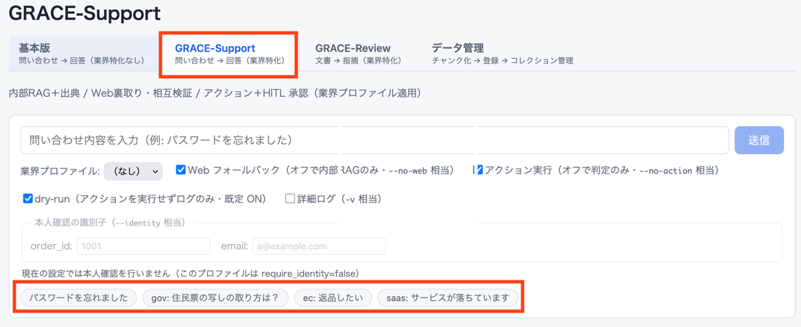

### 3.1 業界特化

**業界の How-to 情報**で答える。`backend/app/core/verticals.py::PROFILES` に 3 業界がある。

| 業界 | 検索スコープ | 強制エスカレ語（例） | 本人確認 | しきい値 | 業界の方針（プロンプトへ注入） |
|---|---|---|:--:|---|---|
| `gov` 自治体 | `gov_faq_anthropic` / `gov_laws_anthropic` | 法的・訴訟・減免・不服 | — | notify 0.8 / confirm 0.5（厳しめ） | 条例・公式案内に基づき、該当ページ・担当課を明示。Web は `go.jp` / `lg.jp` を優先 |
| `saas` SaaS | `saas_docs_anthropic` / `saas_api_anthropic` | 障害・ダウン・課金・セキュリティ | — | 既定 | 製品バージョン・再現手順・公式ドキュメント URL を添える |
| `ec` EC | `ec_policy_anthropic` / `ec_faq_anthropic` | 決済・返金・破損・クレーム | ✅ | 既定 | 注文情報の照会・変更は本人確認必須。返品・交換は規定の版に基づく |

このほか、各業界は**担当範囲**（`scope_description`）を持ち、範囲外の質問（天気・ニュースなど）には
回答せずに窓口を案内する。基本版との差の全項目は [`docs/pipelines.md`](docs/pipelines.md) §3、
業界プロファイルの設計は [`backend/docs/verticals_and_rulesets.md`](backend/docs/verticals_and_rulesets.md)。

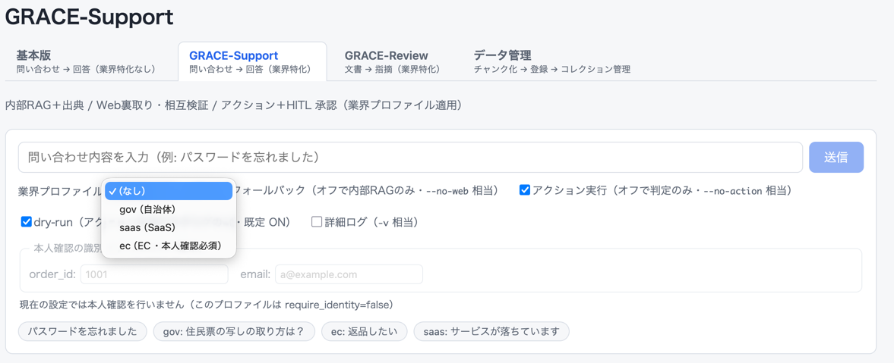

### 3.2 処理フロー

ステップは基本版と同じ 9 つ。違いは **0-(B) が実行される**ことと、②〜⑥ が業界プロファイルの値で動くこと。
右列は例文「住民票の写しの取り方は？」（`gov`）の実行例である。

| 実行順 | ステップ（画面の表示名） | 実行例 / 業界プロファイルが効く点 |
|:--:|---|---|
| 1 | 0-(A) 入力・質問分析（複数質問の検知） | 単一の質問として通過 |
| 2 | 0-(B) 業界プロファイル適用 | `gov`：検索スコープ・しきい値（0.8 / 0.5）・方針を適用 |
| 3 | ① Plan（planner） | 実行計画を生成 |
| 4 | ② Execute（内部RAG → reasoning） | `gov` のコレクションだけを検索し、方針つきで回答を生成 |
| 5 | ③ Groundedness（根拠検証） | 支持率 1.00 |
| 6 | ④ 回答ゲート＋強制エスカレ＋救済 | 判定: answer（強制エスカレ語なし） |
| 7 | ⑤ Web フォールバック | スキップ: 内部回答で確定 |
| 8 | ④' 情報なし回答検知 | 実質的な回答あり |
| 9 | ⑥ Action（本人確認 → HITL CONFIRM → 実行） | `gov` の「申請・手続・様式」なら返信アクションを承認待ちにする。`ec` は先に本人確認 |

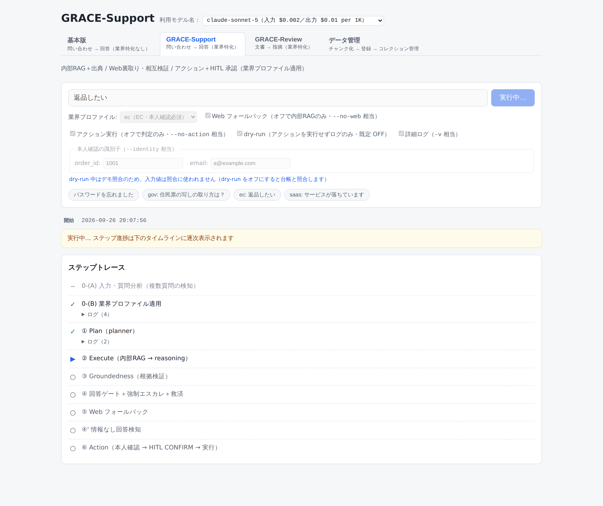

### 3.3 回答

```
answer（回答）  vertical: gov
住民票の写しは、次の3つの方法で取得できます。
・社内ナレッジ（gov_faq.csv）によると、次のとおりです。
・出典: gov_faq.csv
・ご案内

groundedness（支持率）   1.00（判定可能 6 主張）
全体信頼度               0.95
```

基本版との見え方の違いは、**出典が業界のナレッジ（ここでは `gov_faq.csv`）に限られる**ことと、
業界の方針（担当課の明示など）に沿った文面になることである。

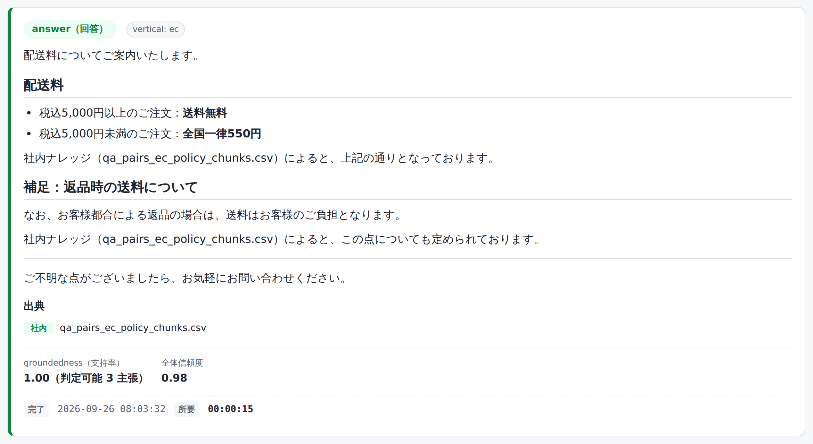

画面の例文 3 業界と範囲外の質問 1 件を、それぞれ 3 回流した実行例（2026-10-07・Web OFF・アクションは dry-run。
元ログは `backend/docs/GRACE-Support_例文4件.txt`）:

| 業界 | 質問 | 判定 | 出典 | 支持率（判定可能な主張） | アクション |
|---|---|---|---|---|---|
| `gov` | 住民票の写しの取り方は？ | answer | `gov_faq.csv` | 1.00（6 / 5 / 7） | なし |
| `saas` | サービスが落ちています | **escalate**（強制エスカレ語「落ち」） | `saas_docs.csv` | 1.00（10） | `escalate_to_human` |
| `ec` | 返品したい | answer | `ec_policy.csv` | 1.00（10） | `create_ticket`（本人確認つき） |
| `gov` | 明日の東京の天気を教えてください（範囲外） | **escalate**（回答なし・出典 0 件） | なし | 0.00（0） | `escalate_to_human` |

- `saas` は根拠つきの回答を作れているのに escalate になる。強制エスカレ語は回答の出来より優先される（④）

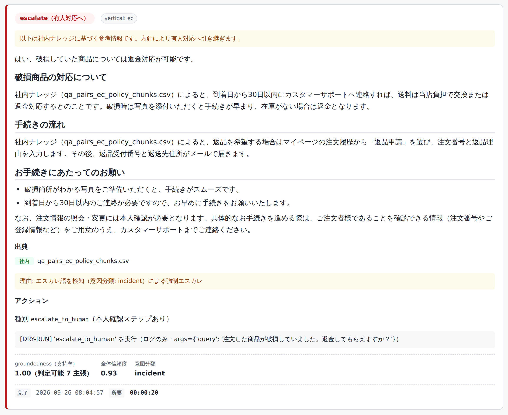

### 3.4 本人確認の識別子が効く条件

識別子欄（注文番号・メール）は常に表示するが、実際に照合される経路は狭い。画面は欄の下に状態を必ず出す。

| 状態 | 欄 | 照合 |
|---|:--:|---|
| 基本版タブ / プロファイル未選択 | disabled | 行わない |
| `gov` / `saas`（`require_identity=false`） | disabled | 行わない（識別子は送らない） |
| `ec` ＋ dry-run ON | 有効 | デモ照合（入力値は使わない） |
| `ec` ＋ dry-run OFF | 有効 | `SUPPORT_IDENTITY_FILE` の顧客台帳と照合（未設定なら常に未確認＝安全側） |

入力値が本当に使われるのは **`ec` ＋ `dry_run=false` ＋ `SUPPORT_IDENTITY_FILE` 設定**の 1 経路だけである。
判定は `frontend/src/state/queryParams.ts`（画面）と `support_actions.py::create_identity_verifier`（バックエンド）。

| 識別子欄が無効（`gov`） | 識別子欄が有効（`ec`） |
|---|---|
| 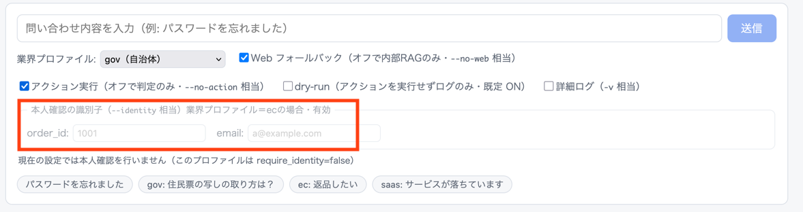 | 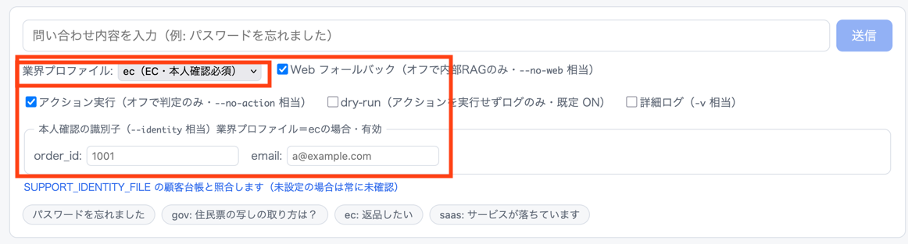 |

---

## 4. GRACE-Review — 規程 RAG ＋ 根拠検証で広告表示を点検

規程 RAG ＋ 根拠検証（groundedness）で広告表示を点検し、**条文つきの指摘**を出すタブ。
入出力の向きが Support と逆で、**文書 → 指摘**である。コア関数は別だが、Retrieve・Ground・誤検知抑止・Action は
Support と同じ機構を再利用している（新規実装は Segment / Detect / Severity の 3 つ）。設計は
[`backend/docs/review_flow.md`](backend/docs/review_flow.md)。

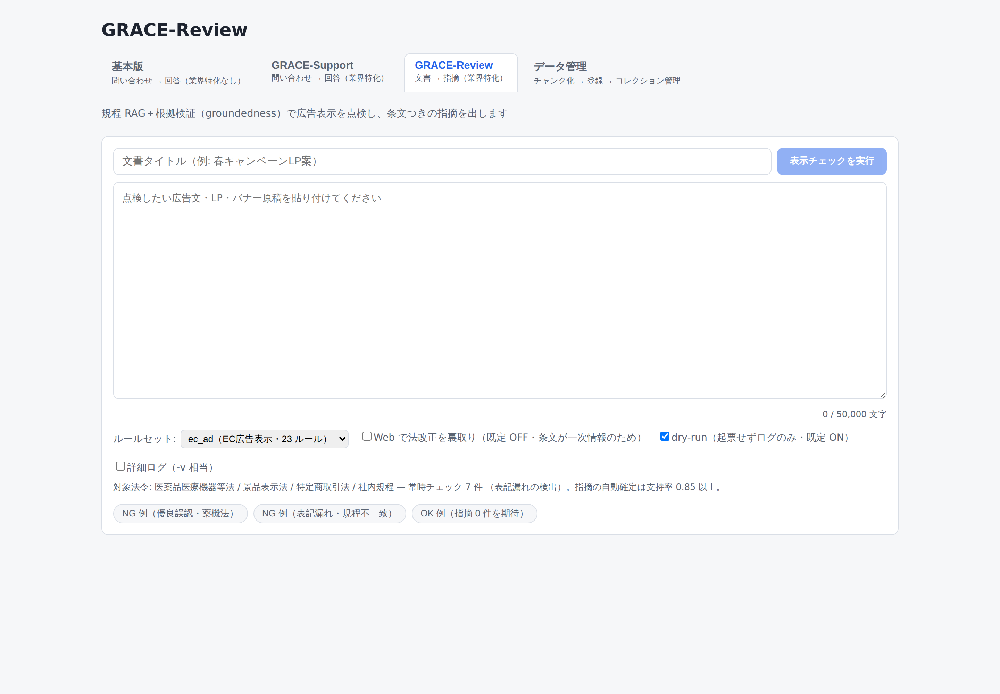

### 4.1 業界特化

**業界の法令遵守**を点検する。`backend/app/core/rulesets.py::EC_AD`（EC 広告表示）を使う。
画面のルールセット欄には次のように表示される。

```
■ 特定商取引法に基づく表記
ルールセット: 対象法令: 医薬品医療機器等法 / 景品表示法 / 特定商取引法 / 社内規程
— 常時チェック 7 件（表記漏れの検出）。指摘の自動確定は支持率 0.85 以上。
```

| 項目 | 内容 |
|---|---|
| 対象法令 | 景品表示法（12）/ 医薬品医療機器等法（4）/ 特定商取引法（6）/ 社内規程（1）＝ **23 ルール** |
| 常時チェック | **7 件**（特定商取引法 6 ＋ 社内規程 1）。キーワードに関係なく必ず判定する＝**表記漏れの検出** |
| 指摘の自動確定 | 支持率 **0.85 以上**（要確認は 0.60 以上）。誤指摘のコストが高いので Support（`gov` 0.8）より厳しい |
| 重大リスク語 | 「No.1」「日本一」「最安」「完治」「治る」「副作用がない」「絶対」「100%」など。一致すると重大度を high に引き上げる |
| 検索スコープ | `ec_ad_rules_anthropic`（規程・条文）/ `ec_policy_anthropic`（社内規程） |

画面の例文は 3 つ：**NG 例（優良誤認・薬機法）**／**NG 例（表記漏れ・規程不一致）**／**OK 例（指摘 0 件を期待）**。

| オプション | 既定 | 意味 |
|---|:--:|---|
| Web で法改正を裏取り | OFF | ⑥ を実行する。結果は信頼度を**下げる方向にだけ**使う |
| dry-run | OFF | 起票せずログのみ |
| 詳細ログ | ON | 各段の判断根拠をステップトレースに出す |

文書の上限は **50,000 字**。超えるとカウンタが赤くなり、送信ボタンが無効になる（サーバへ送る前に画面で止める）。

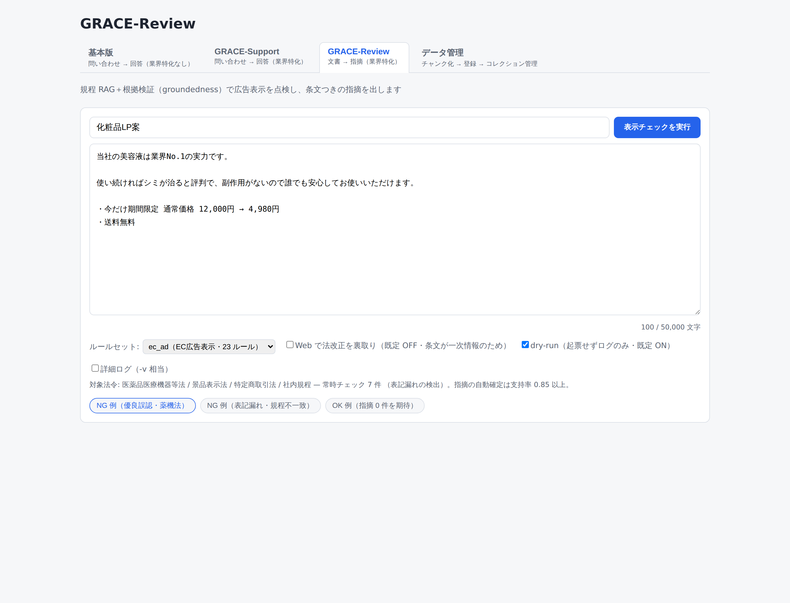

### 4.2 処理フロー

`REVIEW_STEP_IDS` の順に実行する。番号は Support との**対応を示す呼称**なので、⑥ が ⑤ より先に来る。
表示名は `frontend/src/state/reviewReducer.ts::REVIEW_STEP_LABELS`。右列は「OK 例」の実行例である。

| 実行順 | ステップ（画面の表示名） | ステップ ID | 実行例（OK 例） |
|:--:|---|---|---|
| 1 | S1 ルールセット適用 | `ruleset` | EC広告表示ルール 23 件 |
| 2 | ① Segment（文書を検査単位へ分割） | `segment` | 11 セグメント（原文の位置を保持） |
| 3 | ② Retrieve（規程を RAG 検索） | `retrieve` | セグメントごとに規程を検索 |
| 4 | ③ Detect（二段判定で違反候補を検出） | `detect` | 判定 9 回・検出 0 件 |
| 5 | ④ Ground（指摘の根拠を検証） | `ground` | 検証対象なし |
| 6 | ④' Suppress（誤検知抑止 + 救済） | `suppress` | 抑止 0 件・採用 0 件 |
| 7 | ⑥ Web 裏取り（法改正・ガイドライン更新） | `web` | スキップ: 無効 |
| 8 | ⑤ Severity（重大度の確定＋強制 high） | `severity` | 対象なし |
| 9 | ⑦ Action（レポート → HITL CONFIRM → 実行） | `action` | スキップ: 指摘なし |

- **③ Detect の二段判定**: 第 1 段でルールのキーワードに当たるセグメントを絞り、第 2 段で LLM が違反かどうかを判定する。
  常時チェックの 7 件はキーワード不問で第 2 段へ進む
- **④' Suppress**: 支持率で状態を決める（0.85 以上 = **確定**、0.60 以上 = **要確認**、それ未満 = **抑止**）。
  未検証・根拠 0 件の指摘は消さずに**要確認**にする（Support が escalate に倒すのとは逆）
- **⑦ Action**: 指摘があればレポートを作る。重大（high）の指摘があれば承認なしで有人対応へ引き継ぎ
  （`escalate_to_human`）、なければ HITL 承認のあとに起票する（`create_ticket`）

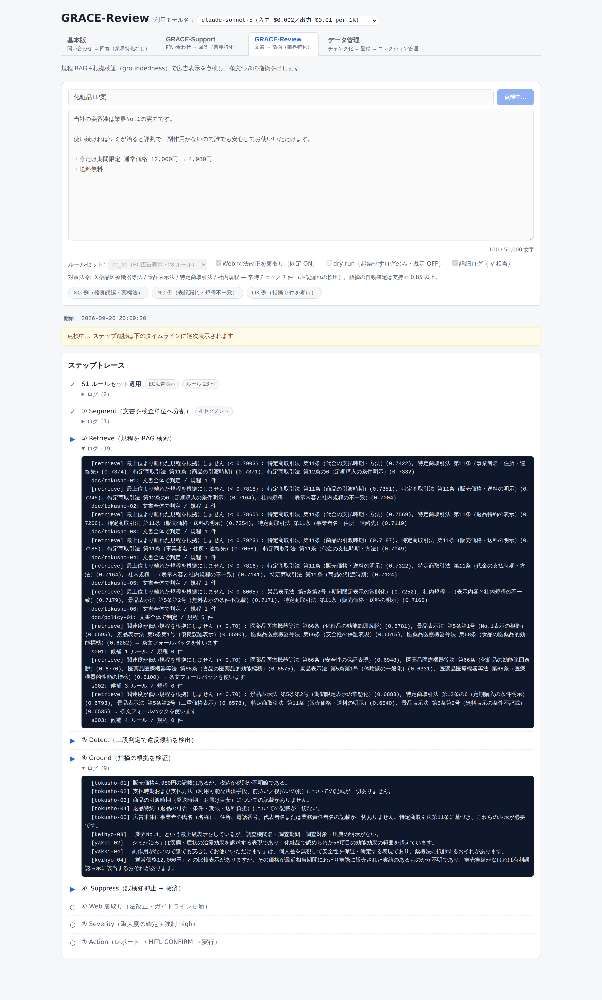

### 4.3 回答（指摘）

```
指摘 0 件   重大 0  中 0  軽微 0 | 確定 0  要確認 0  抑止 0

原文（指摘なし）
当社の美容液は、うるおいを与えて肌をなめらかに整えます。

■ 特定商取引法に基づく表記
  …（販売業者・所在地・送料・お支払い方法・発送時期・返品 など）
```

指摘がある場合は、左ペインの原文の該当箇所がハイライトされ、右ペインの指摘カードに**条文・重大度（重大 / 中 / 軽微）・状態**が付く。
ハイライトとカードは相互に選択が連動する。

| 指摘サマリ | 左右 2 ペイン（原文 ⇄ 指摘） | 指摘カード |
|---|---|---|
|  | 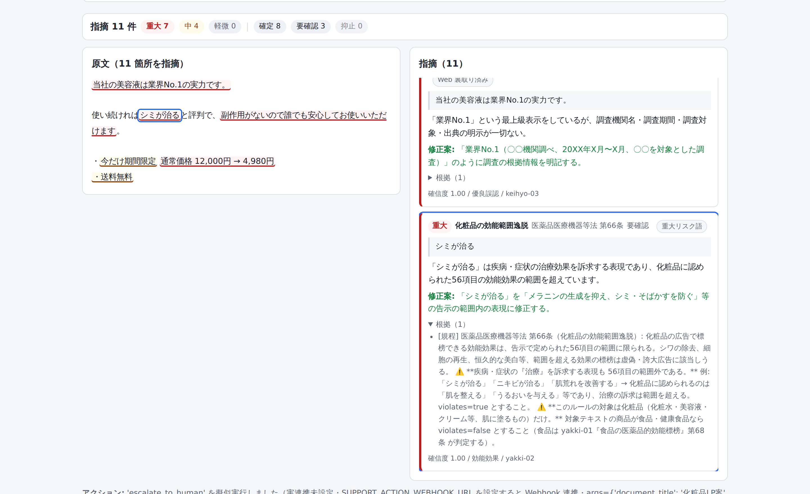 | 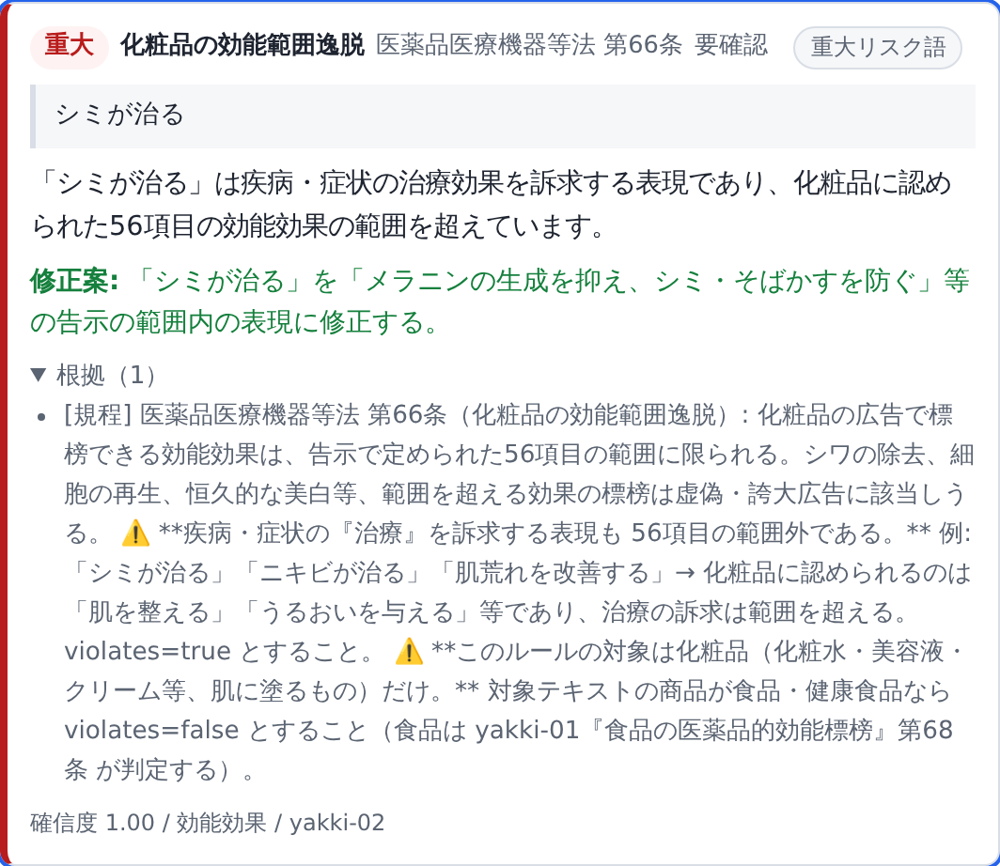 |

画面の 3 例文を 3 回ずつ流した実行例（2026-10-07・Web 裏取り OFF。元ログは `backend/docs/GRACE-Review_例文3件.txt`）:

| 例文 | 指摘 | 重大 / 中 / 軽微 | 確定 / 要確認 / 抑止 | 主な指摘 |
|---|---:|---|---|---|
| NG 例（優良誤認・薬機法）`化粧品LP案` | 10 | 7 / 3 / 0 | 6 / 4 / 0 | No.1 の根拠・二重価格・「シミが治る」・「副作用がない」・特商法の表示漏れ 5 件 |
| NG 例（表記漏れ・規程不一致）`表記漏れLP案` | 4 | 1 / 3 / 0 | 4 / 0 / 0 | 送料・支払方法・引渡時期の表示漏れ・返品 8 日 < 規程 14 日 |
| OK 例（指摘 0 件を期待）`適正LP案` | 0 | 0 / 0 / 0 | 0 / 0 / 0 | なし |

3 回とも、当たったルール・重大度・状態が同じだった。変わったのは指摘文の言い回しだけである。

### 4.4 画面操作とプログラムの対応

| # | 画面上の操作 | UI コンポーネント | API | バックエンド |
|---|---|---|---|---|
| 1 | 画面表示時（自動） | `ReviewPanel` | `GET /api/rulesets` | `api/meta.py` |
| 2 | 文書タイトル・文書を入力（例文チップでも可） | `ReviewForm` | — | — |
| 3 | ルールセット・Web 裏取り・dry-run・詳細ログを選ぶ | `ReviewForm` | — | `rulesets.py::RULESETS`（表示元） |
| 4 | **「表示チェックを実行」を押す** | `ReviewForm` → `ReviewPanel` | `POST /api/review/submit` | `api/review.py` → `JobManager` → `run_review_agent_core` |
| 5 | （自動）進捗を受信 | `ReviewTimeline` | `GET /api/review/stream/{job_id}`（SSE） | `Job.stream_events` |
| 6 | ハイライト / 指摘カードを押す | `DocumentView` / `FindingList` | — | — |
| 7 | **承認 / 拒否を押す** | `ConfirmModal` | `POST /api/review/confirm/{job_id}` | `JobManager.confirm` → `InterventionBridge` |

部品ごとの詳細は [`frontend/docs/ReviewPanel.md`](frontend/docs/ReviewPanel.md) /
[`ReviewForm.md`](frontend/docs/ReviewForm.md) / [`DocumentView.md`](frontend/docs/DocumentView.md) /
[`FindingList.md`](frontend/docs/FindingList.md) / [`review_ui.md`](frontend/docs/review_ui.md)。

---

## 5. データ管理 — チャンキング → Q/A 作成 → Qdrant 登録 → コレクション管理

3 タブが検索するコレクションを用意するタブ。サブタブ 4 つが RAG データ準備の工程に対応する。
**CLI と同じ関数を呼ぶ**ので、画面から実行しても CLI から実行しても結果は変わらない。設計は
[`backend/docs/data_pipeline.md`](backend/docs/data_pipeline.md)。

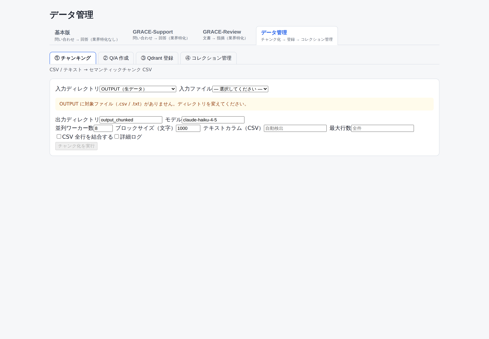

### 5.1 4 工程

| サブタブ | 入力 → 出力 | API | バックエンド → 処理モジュール | 既定モデル |
|---|---|---|---|---|
| ① チャンキング | CSV / テキスト → セマンティックチャンク CSV | `POST /api/chunking/run` | `data_jobs._chunking_runner` → `services/data_pipeline_service.py::run_chunking_sync` → `chunking/` | `claude-haiku-5-5` |
| ② Q/A 作成 | チャンク CSV → Q/A ペア CSV（LLM で生成） | `POST /api/qa/generate` | `data_jobs._qa_runner` → `qa_generation/pipeline.py::QAPipeline`（Celery 並列も可） | `claude-sonnet-5-5` |
| ③ Qdrant 登録 | Q/A CSV → Qdrant コレクション（Embedding 生成つき） | `POST /api/qdrant/register` | `data_jobs._register_runner` → `qa_qdrant/register_to_qdrant.py` | Gemini `gemini-embedding-001` |
| ④ コレクション管理 | 一覧・プレビュー・削除 | `GET /api/qdrant/collections` ほか・`POST /api/qdrant/delete` | `api/qdrant.py` → `services/qdrant_service.py` / `data_jobs._delete_runner` | — |

- 4 工程とも**ジョブ**として走り、進捗は `GET /api/data/stream/{job_id}`（SSE）で画面に出る
- ③ は既存コレクションを作り直す（recreate）ときだけ、④ の削除は常に **HITL CONFIRM** を出す（`POST /api/data/confirm/{job_id}`）
- 入力ファイルの選択肢は `GET /api/files` が返す（許可されたディレクトリの外は読まない）
- ① と ② のモデルは、ヘッダーの「① チャンキング：」「② Q/A 作成：」で工程ごとに変えられる（[7.4](#74-利用モデル)）

### 5.2 画面

| ① チャンキング | ① 実行中 |
|---|---|
|  | 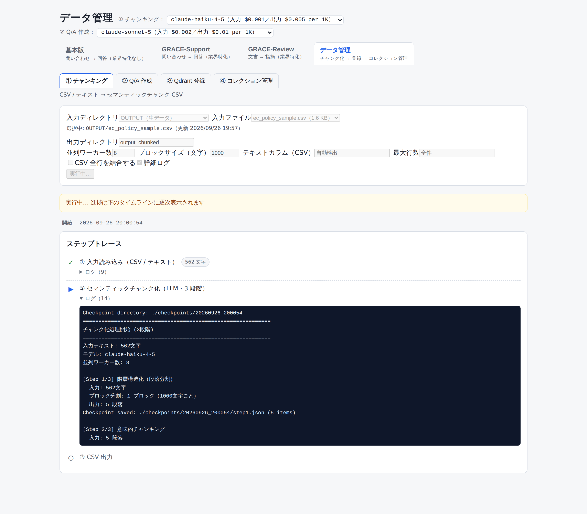 |

| ② Q/A 作成 | ③ Qdrant 登録 | ③ 作り直しの承認 |
|---|---|---|
| 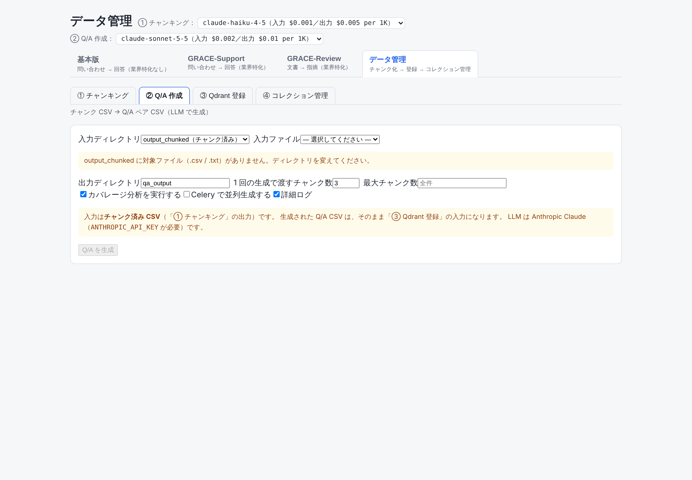 | 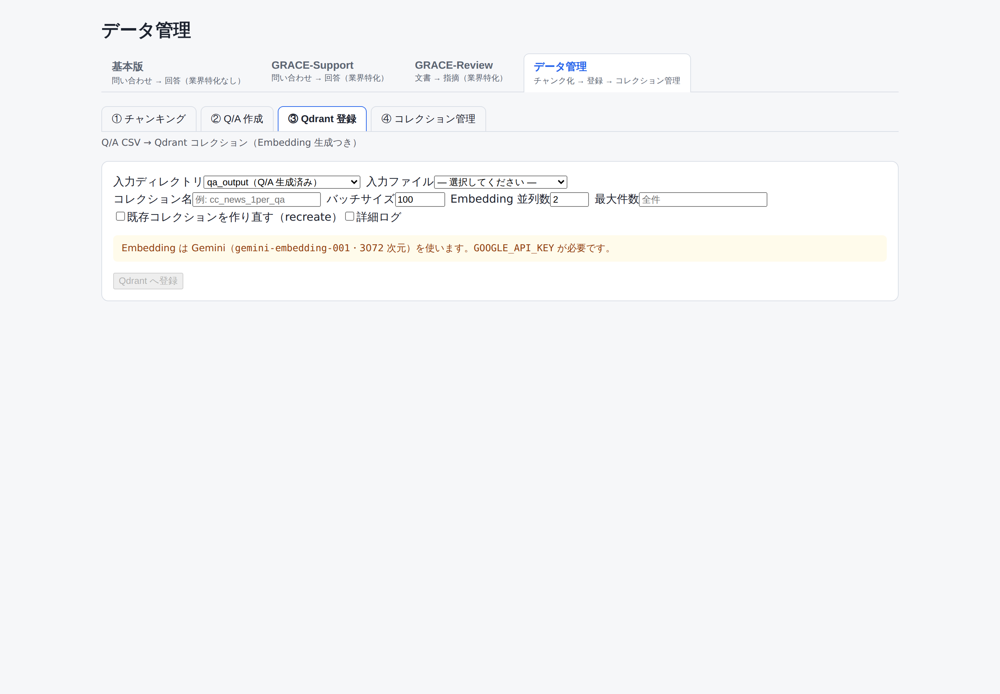 | 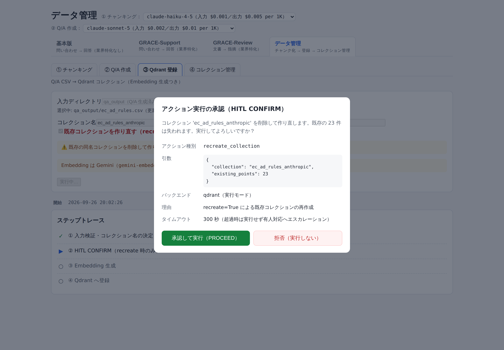 |

| ④ コレクション一覧 | ④ コレクション詳細 | ④ 削除の承認 |
|---|---|---|
| 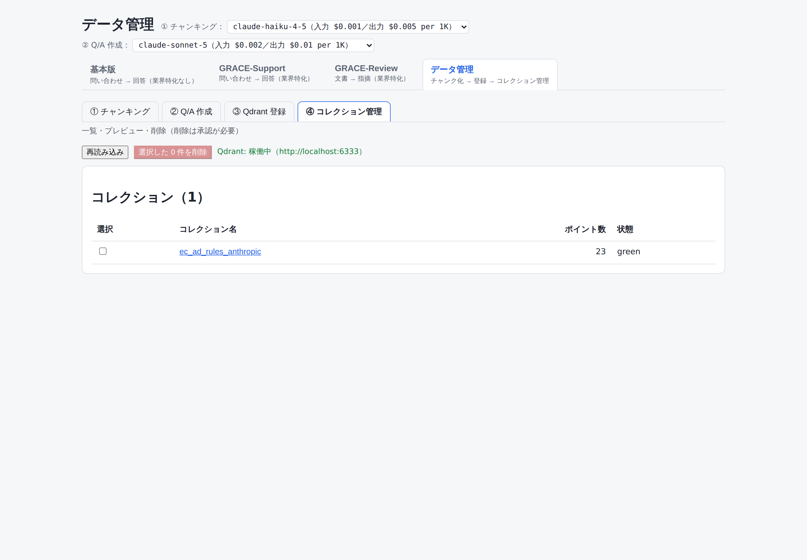 | 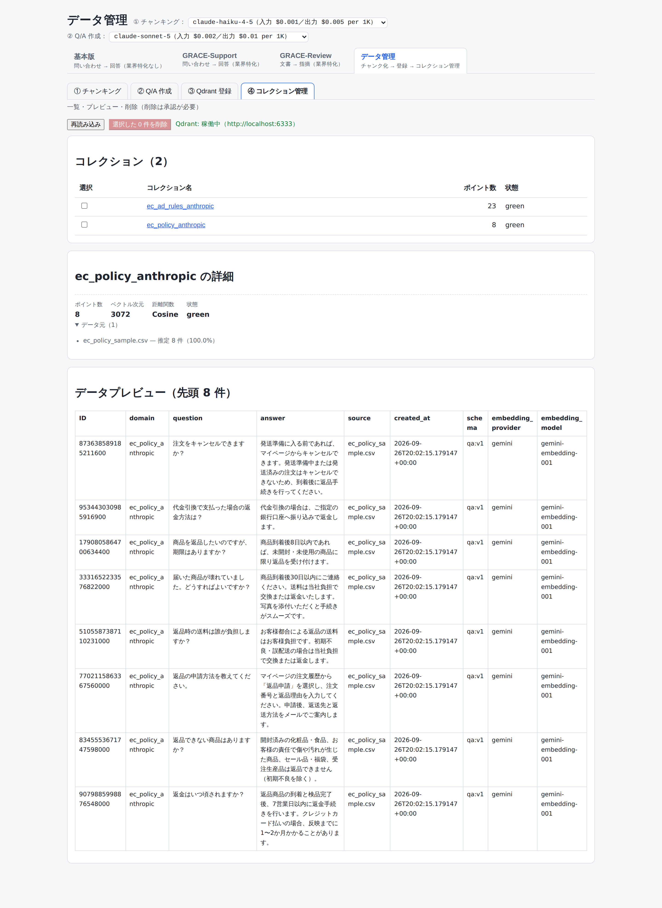 | 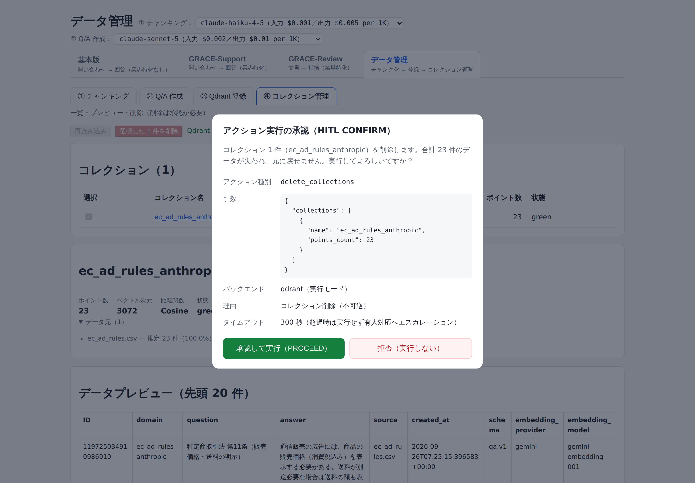 |

### 5.3 CLI（大規模バッチ向け）

`--resume` つきの大規模バッチは、引き続き CLI の方が向いている。

```bash
python -m chunking.csv_text_to_chunks_text_csv        # 1. チャンク化（出力は output_chunked/<入力名>_chunks.csv）
python qa_qdrant/make_qa_register_qdrant.py           # 2-3. Q/A 生成 + Qdrant 登録
python qa_qdrant/register_to_qdrant.py                # 3. 登録のみ
./start_celery.sh                                     # Q/A 生成を Celery 並列で走らせるときのワーカー
```

> ⚠️ **エージェント（基本版 / GRACE-Support / GRACE-Review）の実行に CLI は無い。** 唯一の入口は Web API である
> （`agent_support_example.py` と `grace/step_trace/s*.py` は 2026-09-19 に削除）。挙動は画面か `backend/tests/` で確かめる。

---

## 6. 処理概要（主要な処理モジュール）

### 6.1 コアモジュール — `grace/` ・ `services/` ・ `config.py`

| モジュール | 役割 | 詳細 |
|---|---|---|
| `grace/` | 自律エージェント基盤。コア 8 つ：`planner`（計画）/ `executor`（実行）/ `confidence`（根拠検証 `GroundednessVerifier`）/ `calibration`（信頼度の較正）/ `memory`（実行メモリ）/ `intervention`（HITL）/ `replan`（再計画）/ `tools`（RAG 検索・Web 検索）。基盤は `config.py`（設定の読み込み・検証）/ `schemas.py`（データ契約）/ `llm_compat.py`（Claude 呼び出しの薄いアダプタ） | [`grace/docs/README.md`](grace/docs/README.md) |
| `services/` | アプリ横断のサービス層。データ管理タブが使う `data_pipeline_service.py`（入力ファイル解決・チャンク化・コレクション削除）と `qdrant_service.py`（コレクション一覧・健全性）、Q/A 生成の `qa_service.py`、トークン計数の `token_service.py` ほか。`agent_service.py` は Legacy ReAct 経路専用 | [`services/docs/README.md`](services/docs/README.md) |
| `config.py` | アプリ全体の定数。`ModelConfig`（既定モデル・選択肢・単価・上限・Embedding の定義）/ `GeminiConfig`（Embedding 用途）/ `QdrantConfig` | [`backend/docs/config_and_providers.md`](backend/docs/config_and_providers.md) |

使い方は 2 つのエージェントで違う。**基本版・GRACE-Support** は `planner` → `executor` の計画→実行ループを
まるごと使い、**GRACE-Review** は `planner` / `executor` を通らず `tools`・`confidence`・`intervention`・`llm_compat` を
直接呼ぶ。ステップごとのモジュール対応表の正本は [`grace/docs/README.md`「概要」](grace/docs/README.md#概要)。

リポジトリ直下には、エージェントが使う共用部品として `support_actions.py`（`ActionBackend`・本人確認）/
`agent_tools.py` / `qdrant_client_wrapper.py`、Embedding・LLM のクライアントとして `helper/` がある。

### 6.2 画面系 — `backend/` ・ `frontend/`

| モジュール | 役割 | 詳細 |
|---|---|---|
| `backend/app/api/` | FastAPI のルーター。`support.py`（`/api/support/*`）/ `review.py`（`/api/review/*`）/ `data.py`・`qdrant.py`（データ管理）/ `meta.py`（`/api/models`・`/api/model`・`/api/verticals`・`/api/rulesets`・`/api/health`） | [`backend/docs/api_contract.md`](backend/docs/api_contract.md) |
| `backend/app/core/` | パイプライン本体。`support_agent.py` / `gates.py` / `verticals.py`（Support）、`review_agent.py` / `review_gates.py` / `rulesets.py`（Review）、`data_jobs.py`（データ管理）、`jobs.py`（ジョブと SSE）/ `intervention_bridge.py`（HITL の橋渡し） | [`backend/docs/README.md`](backend/docs/README.md) |
| `backend/app/schemas.py` | API のリクエスト・レスポンスの型（Pydantic）。`frontend/src/types.ts` と対で保つ | [`backend/docs/reference/schemas.md`](backend/docs/reference/schemas.md) |
| `frontend/src/components/` | 画面部品。`App.tsx`（ヘッダー・タブ）/ `SupportPanel`・`QueryForm`・`StepTimeline`・`AnswerCard` / `ReviewPanel`・`ReviewForm`・`DocumentView`・`FindingList` / `DataPanel`・`DataJobPanel`・`CollectionPanel` / `ConfirmModal`・`QuestionSelectModal` ほか | [`frontend/docs/README.md`](frontend/docs/README.md) |
| `frontend/src/state/` | 判断ロジックの純関数（送信ペイロード・送信キー・タブ移動・入力退避・モデル選択・SSE の監視）と 3 つの reducer。コンポーネントは入力の保持と描画だけを持つ | [`frontend/docs/README.md`](frontend/docs/README.md) |
| `frontend/src/api/client.ts` | API クライアント（ジョブ投入・SSE 購読・承認・メタ取得） | 同上 |

### 6.3 データ管理 — `chunking/` ・ `qa_generation/` ・ `qa_qdrant/`

| モジュール | 役割 | 詳細 |
|---|---|---|
| `chunking/` | CSV / テキストをセマンティックチャンクへ分割する（階層分割 → 意味的チャンク化 → 連続性チェック。文書境界を保証し、1 チャンク 512 トークン以下） | [`chunking/docs/README.md`](chunking/docs/README.md) |
| `qa_generation/` | チャンクから Q/A ペアを LLM で生成する（`QAPipeline` / `SmartQAGenerator`・評価） | [`qa_generation/docs/README.md`](qa_generation/docs/README.md) |
| `qa_qdrant/` | Q/A 生成と Qdrant 登録の CLI と登録処理（`make_qa_register_qdrant.py` / `make_qa.py` / `register_to_qdrant.py`） | [`qa_qdrant/docs/README.md`](qa_qdrant/docs/README.md) |

### 6.4 依存の向き

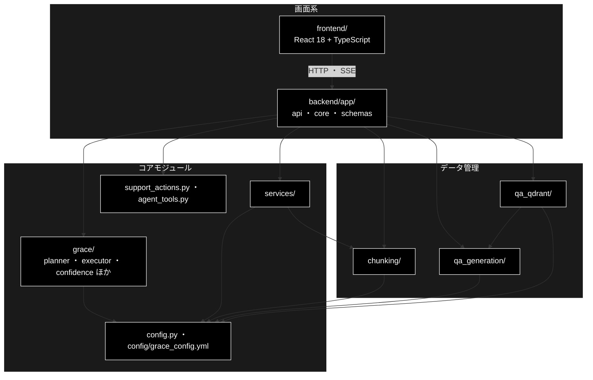
```mermaid
flowchart TB
    subgraph SCREEN["画面系"]
        FE["frontend/<br>React 18 + TypeScript"]
        BE["backend/app/<br>api ・ core ・ schemas"]
    end
    subgraph CORE["コアモジュール"]
        GR["grace/<br>planner ・ executor ・ confidence ほか"]
        SV["services/"]
        SA["support_actions.py ・ agent_tools.py"]
        CF["config.py ・ config/grace_config.yml"]
    end
    subgraph PREP["データ管理"]
        CH["chunking/"]
        QG["qa_generation/"]
        QQ["qa_qdrant/"]
    end
    FE -->|"HTTP ・ SSE"| BE
    BE --> GR
    BE --> SA
    BE --> SV
    BE --> CH
    BE --> QG
    BE --> QQ
    SV --> CH
    QQ --> QG
    GR --> CF
    SV --> CF
    CH --> CF
    QG --> CF
    QQ --> CF
classDef default fill:#000,stroke:#fff,color:#fff
classDef subgraphStyle fill:#1a1a1a,stroke:#fff,color:#fff
class FE,BE,GR,SV,SA,CF,CH,QG,QQ default
style SCREEN fill:#1a1a1a,stroke:#fff,color:#fff
style CORE fill:#1a1a1a,stroke:#fff,color:#fff
style PREP fill:#1a1a1a,stroke:#fff,color:#fff
```

---

## 7. 起動と設定

### 7.1 前提

| 前提 | 内容 |
|---|---|
| `.env`（リポジトリルート） | `ANTHROPIC_API_KEY`（LLM）／`GOOGLE_API_KEY`（Embedding） |
| Qdrant | `docker compose -f docker-compose/docker-compose.yml up -d` |
| ツール | `uv` / Node.js（npm） |

導入の詳細は [`backend/docs/install_and_setup.md`](backend/docs/install_and_setup.md)。

### 7.2 起動

```bash
# 1) Qdrant（初回 / 停止後のみ）
docker compose -f docker-compose/docker-compose.yml up -d

# 2) アプリ（backend :8000 + frontend :5173）
./run_dev.sh
#   ==> [1/3] uv sync --extra dev（バックエンド依存）
#   ==> [2/3] frontend 依存の確認
#   ==> [3/3] 開発サーバを起動します（停止は Ctrl+C）
#       backend : http://localhost:8000  (docs: /docs)
#       frontend: http://localhost:5173  ← ブラウザで開くのはこちら

# バックエンド単体
uvicorn backend.app.main:app --reload --port 8000
```

- `run_dev.sh` は起動時に Qdrant へ疎通確認を行い、**繋がらなくても警告を出して続行**する
- 起動前に :8000（`BACKEND_PORT`）と :5173 が使用中なら、使っているプロセスを停止する（止めたくない場合は `RUN_DEV_FREE_PORTS=0 ./run_dev.sh`）
- Ctrl+C では子プロセス（uvicorn・vite）まで止める

### 7.3 ポート

| 用途 | URL | 備考 |
|---|---|---|
| **UI** | http://localhost:5173 | **ブラウザで開くのはこちら** |
| API | http://localhost:8000 | `/docs` で自動ドキュメント。`/` は 404 が正常 |
| Qdrant | http://localhost:6333 | `QDRANT_URL` で変更可 |

### 7.4 利用モデル

ヘッダーのモデル欄で、そのタブで使うモデルを選べる（選んだ値はそのリクエストだけに効き、他のジョブへは漏れない）。

| ヘッダーの欄 | 表示されるタブ | 既定 | 既定の定義 |
|---|---|---|---|
| 利用モデル名： | 基本版 / GRACE-Support / GRACE-Review | `claude-sonnet-5-5` | `config/grace_config.yml` の `llm.model` |
| ① チャンキング： | データ管理 | `claude-haiku-5-5` | `config.py::ModelConfig.CHUNKING_MODEL` |
| ② Q/A 作成： | データ管理 | `claude-sonnet-5-5` | `config.py::ModelConfig.DEFAULT_MODEL` |

- 選択肢は `claude-fable-5-1` / `claude-opus-5-5` / `claude-sonnet-5-5` / `claude-haiku-5-5` の 4 つ（`ModelConfig.SELECTABLE_MODELS`）
- 意図分類・情報なし判定などの**判定系は軽量モデル** `claude-haiku-5-5`（yml の `llm.light_model`）のままで、ヘッダーの選択では変わらない
- Embedding は `gemini-embedding-001`（3072 次元）。**変えると既存コレクションが使えなくなる**（エラーにならず検索結果だけが壊れる）
- 既定モデルを変えるときは、解決経路 5 本をすべて確認する（[`CLAUDE.md`](CLAUDE.md) §3.1、[`backend/docs/config_and_providers.md`](backend/docs/config_and_providers.md)）

---

## 8. 全タブ共通の仕組み

### 8.1 HITL CONFIRM（承認モーダル）

副作用のある処理は、画面の承認を得るまで実行しない。バックエンドは `InterventionBridge` で処理を止めて
`confirm` イベントを送り、画面の `ConfirmModal` が「承認 / 拒否」を返す。無条件承認はテスト用であり、Web 経路には持ち込まない。

| 出る場面 | 承認すると |
|---|---|
| 基本版 / GRACE-Support の ⑥ Action | 起票・返信などのアクションを実行（dry-run ならログのみ） |
| GRACE-Review の ⑦ Action | 指摘レポートを起票 |
| データ管理 ③ の作り直し・④ の削除 | コレクションを作り直す / 削除する |

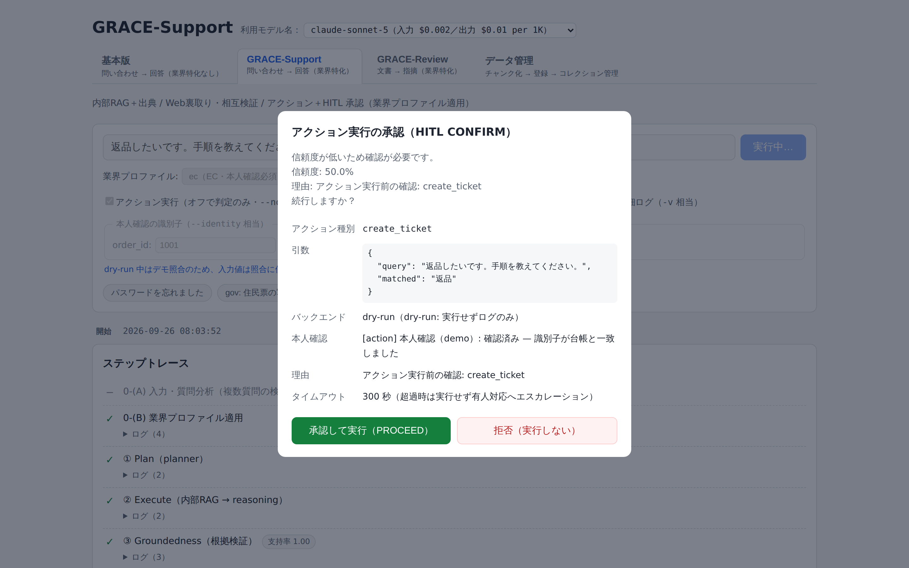

0-(A) で複数の質問を検知したときは、承認の代わりに主質問を選ぶモーダル（`QuestionSelectModal`）が出る。

### 8.2 タブを離れても入力を保持する

タブ切替は画面部品を作り直すが、入力（問い合わせ・文書・トグル）は `frontend/src/state/formMemory.ts` が退避・復元する。

| 入力してからタブを離れる | 戻ってきても残っている |
|---|---|
| 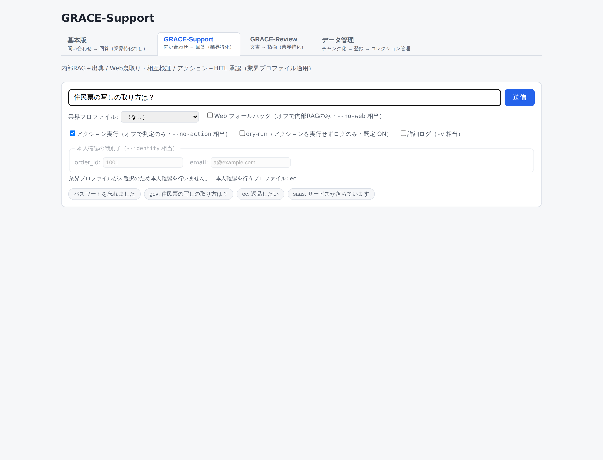 | 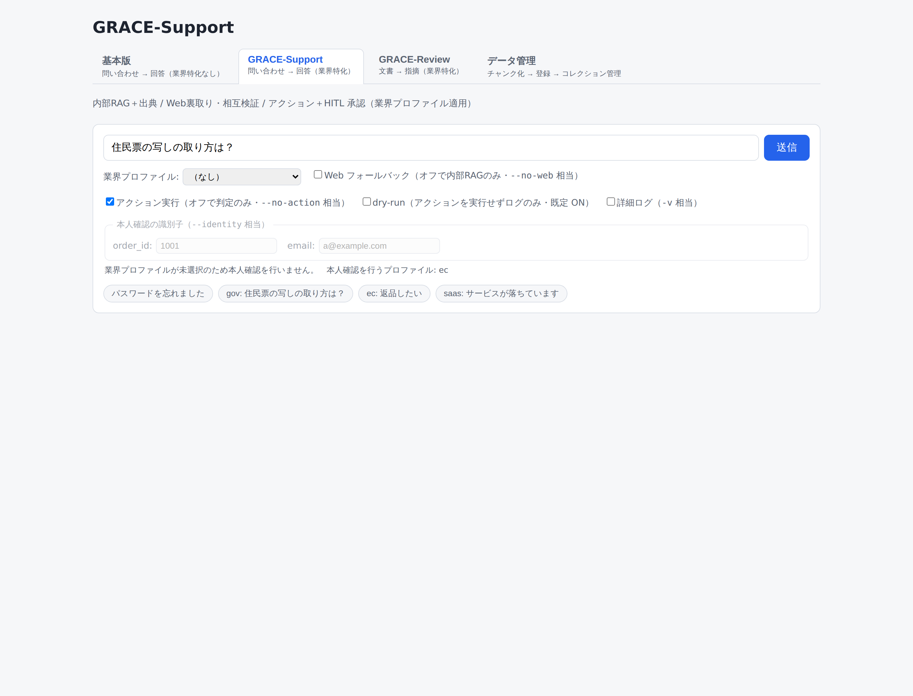 |

### 8.3 実行時間の表示

送信した時刻をフォームの直下に、決着した時刻と所要時間を結果の一番下に出す（失敗時も出す）。
整形は `frontend/src/state/elapsed.ts` の純関数。

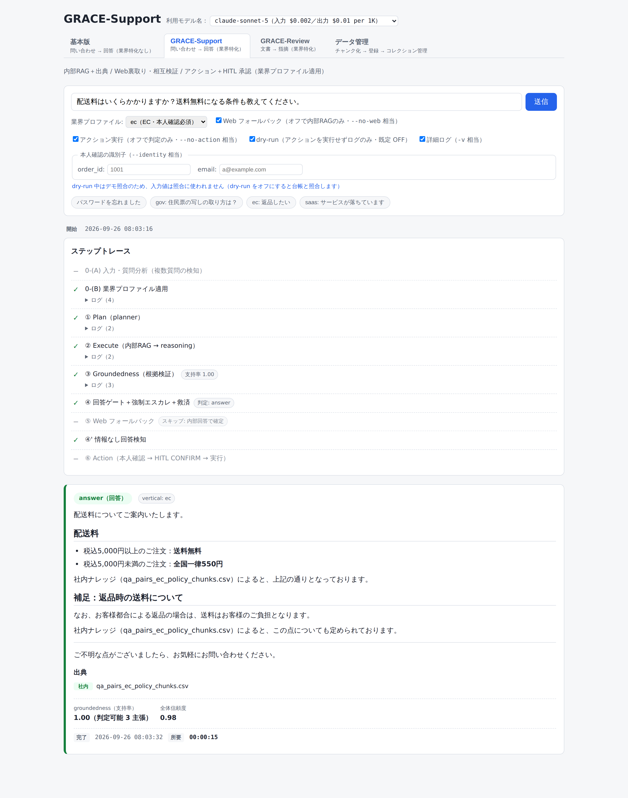

---

## 9. 検証（CI と同じゲート）

`claude/*` ブランチの PR は、次の 4 ゲートがすべて緑になると自動で master へマージされる。

```bash
uvx ruff@0.12.11 check . --no-cache                      # lint
uv run --no-sync pytest backend/tests -q -rs             # backend（実 API キー・Qdrant 不要）
python -m compileall -q -x '\.venv|/\.git/|/logs/' .     # 構文
cd frontend && npm run lint && npm test && npm run build # frontend
```

| 種類 | 置き場所 | 実行条件 |
|---|---|---|
| 単体テスト（スタブ） | `backend/tests/` ・ `frontend/src/**/*.test.ts` | 常に（CI） |
| 結合テスト（実 Qdrant / Redis） | `backend/tests/integration/` | 起動していれば走る。未起動なら skip |
| E2E（実 LLM・実 Embedding・実データ・課金あり） | `backend/tests/e2e/` | `GRACE_E2E=1` のときだけ |

詳細は [`backend/docs/testing.md`](backend/docs/testing.md)。

---

## 10. うまく動かないとき

| 症状 | 原因 | 対処 |
|---|---|---|
| 業界プロファイル / ルールセットが選べない（セレクタが空） | backend（:8000）が起動していない | 画面上部のメタ取得エラーバナーに理由と手順が出る。`./run_dev.sh` で起動し直し、「再取得」を押す |
| 実行するとエラーバナー | `ANTHROPIC_API_KEY` 未設定など | `.env` に設定して backend を再起動。`GET /api/health` で確認できる |
| 「進捗ストリームが切断されました」 | backend が落ちた / 再起動中 | ターミナルの uvicorn ログを確認 |
| 検索結果が空・情報なし回答が続く | Qdrant 未起動 or データ未登録 | `docker compose ... up -d` ＋ データ管理タブ（[5](#5-データ管理--チャンキング--qa-作成--qdrant-登録--コレクション管理)）で登録 |
| Review で送信できない / 422 | 文書が 50,000 字超 | 分割して実行（文字数カウンタが赤くなる） |
| `:8000` を開いても 404 | 仕様 | UI は **:5173**。:8000 は API 専用（`/docs` は開ける） |

| 実行エラー（実行後に出る） | メタ取得エラー（実行前に出る） | 文字数上限の超過（Review） |
|---|---|---|
| 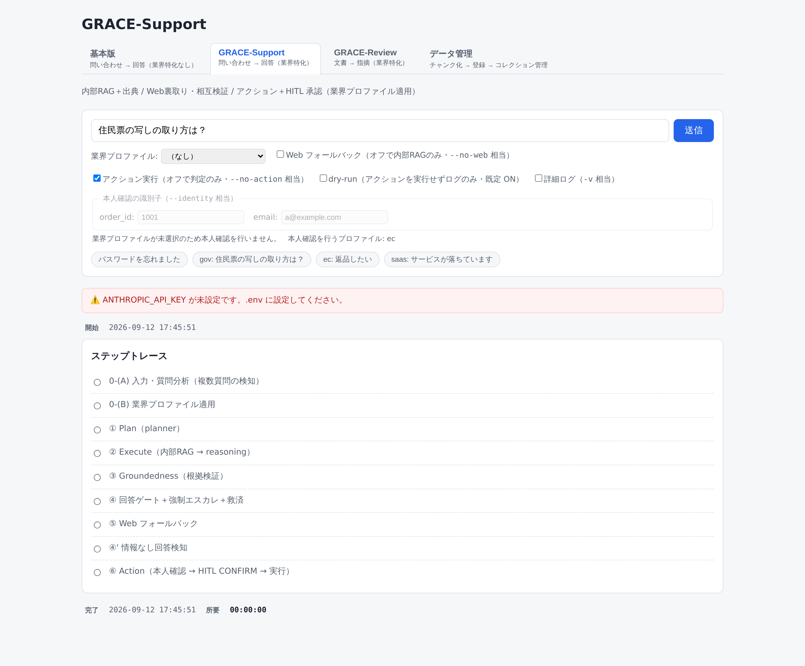 | 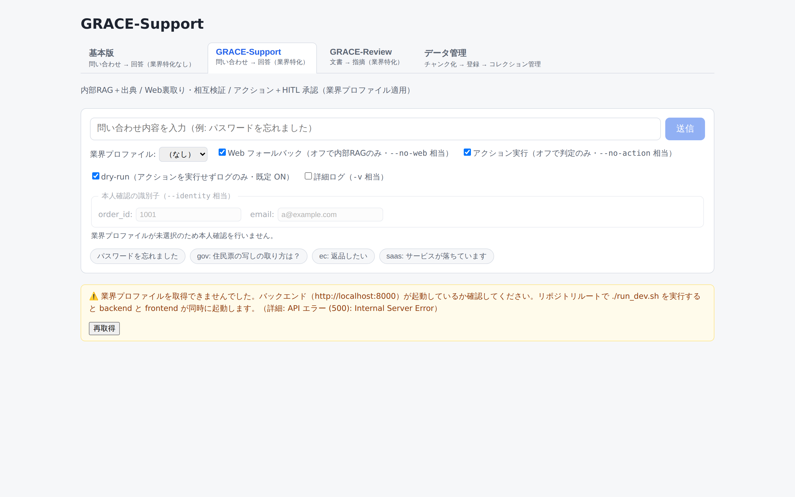 | 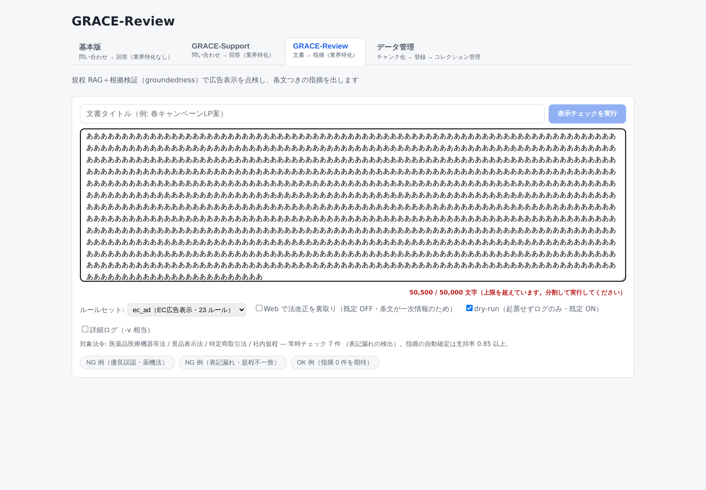 |

既知の落とし穴の一覧は [`backend/docs/pitfalls.md`](backend/docs/pitfalls.md)。

---

## 11. 関連ドキュメント

| 文書 | 何の正本か |
|---|---|
| [`docs/README.md`](docs/README.md) | 直下 `docs/` の索引と、文書の配置ルール |
| [`docs/app_tabs_overview.md`](docs/app_tabs_overview.md) | 処理 3 タブ（基本版 / GRACE-Support / GRACE-Review）の概要 |
| [`docs/pipelines.md`](docs/pipelines.md) | 3 モードのステップ対照表・基本版と Support の差・モード別ガードレール |
| [`docs/guardrails.md`](docs/guardrails.md) | ゲート・しきい値・失敗時にどちらへ倒すか |
| [`docs/reasoning_flow.md`](docs/reasoning_flow.md) | 回答生成（reasoning）と指摘生成（detect）のプロンプト構造 |
| [`docs/agent_layers.md`](docs/agent_layers.md) | 一般的なエージェント用語と実装の対応 |
| [`backend/docs/README.md`](backend/docs/README.md) | backend の索引（`support_flow.md` / `review_flow.md` / `data_pipeline.md` / `api_contract.md` ほか） |
| [`grace/docs/README.md`](grace/docs/README.md) | grace の索引と、Support / Review が使う grace モジュールの対応表 |
| [`frontend/docs/README.md`](frontend/docs/README.md) | 画面部品の索引（各コンポーネントの props・状態・SSE） |
| [`chunking/docs/README.md`](chunking/docs/README.md) ・ [`qa_generation/docs/README.md`](qa_generation/docs/README.md) ・ [`qa_qdrant/docs/README.md`](qa_qdrant/docs/README.md) ・ [`services/docs/README.md`](services/docs/README.md) | データ準備とサービス層の各モジュール（IPO） |
| [`CLAUDE.md`](CLAUDE.md) | 開発の指針（プロバイダ方針・モデル名の解決経路・CI・姉妹リポジトリとの関係） |

姉妹リポジトリ `grace_v2_local` は同じ構造で、LLM をローカルの Ollama に置き換えた版である（Embedding と Qdrant は共用）。

---

## 12. 変更履歴

| バージョン | 変更内容 |
|-----------|---------|
| 1.0 | 初版作成。当時の `backend/docs/README.md` v1.6 をベースに、リポジトリ全体のルート README として IPO 形式で構成（同ファイルはその後 `c1669ff` で削除された） |
| 2.0 | **`./run_dev.sh` アプリの README として全面改訂。** 対象をリポジトリ全体からアプリ（画面・操作）へ移し、実装（`frontend/src/` 全 13 コンポーネント・2 reducer・API クライアント）を読み直して構成。§3 に「画面上の操作 → UI コンポーネント → フロント処理 → API → バックエンド関数」の対応表を Support / Review 別に新設し、ステップトレースの表示ラベルとバックエンド実装の 1:1 対応表も追加。§4 を画面別 IPO 詳細（共通ヘッダ／Support／Review／CONFIRM モーダル）へ再構成し、各 UI 要素・バッジ・分岐条件を実装から起こして記載。§6 に操作シナリオ 2 本とトラブルシュートを追加。**画面ショット挿入位置を 13 スロット（S-01〜S-05 / R-01〜R-06 / C-01 / E-01）確保**し、§6.4 に一覧表を用意 |
| 2.1 | **「責務」の記述をフォーマット仕様に適合させた。** 2.0 では「主な責務」がアプリの責務ではなく UI の配線（タブ切替・パラメータ組み立て等）を並べたものになっており、かつ「各責務対応のモジュール」が 12 行と箇条書き 5 項目に対応していなかった（`a_class_method_md_format.md` §2.5「責務の数（行数）は主な責務の項目数と一致させる」「責務列は主な責務の箇条書きと 1 対 1 で対応させる」に違反）。主な責務を**アプリが引き受ける役割**として 7 項目に書き直し、対応表を同じ文言の 7 行へ揃えて 1 対 1 を回復。さらに「エージェント別の責務」を新設し、GRACE-Support / GRACE-Review それぞれの**引き受けること・引き受けないこと**を実装（関数名）と対応づけて明示。責務が長い前置きに埋もれていたため「画面ショット挿入位置について」を概要の後ろへ移動し、目次に責務の各節を掲載 |
| 2.2 | **§2 モジュール構成図（画面構成）の 2 図を縦積みに変更。** 図が横に広がって描画時に文字が縮み、読めなくなっていたため。(1) 画面レイアウト図は `MODALL` が `RESULT` から横へ枝分かれしていたのを単一の縦チェーンへ直し、長いノードラベル（`header: h1（アクティブなタブ名）+ nav.tabs（GRACE-Support / GRACE-Review）` 等）を短縮。図から外した各領域の中身は Support / Review 対比表として本文へ移した。(2) 左右ペイン図は `flowchart LR`（横並び）＋長いエッジラベルが原因で最も横長だったため `flowchart TB` へ変更し、エッジラベルを「ハイライトをクリック」等へ短縮。ペインの内容と連動の動きは表として本文へ移し、「図は縦だが実画面では左右に並ぶ」旨を注記 |
| 2.3 | **§2 の 2 図に `direction TB` を追加し、実際に縦積みになることを描画して確認した。** 2.2 で `flowchart TB` にしたが**表示は横並びのままだった**（Mermaid はサブグラフ内の並びに外側の `flowchart TB` を適用しないため）。Mermaid 9.4.3 ＋ ヘッドレス Chromium で描画してノード座標を実測し、修正候補を比較して確定: エッジをサブグラフ内へ移すだけでは変化なし（1457×158 のまま）、**サブグラフ内の `direction TB` の 1 行だけが効く**。適用後は画面レイアウト図が 1457×158 → **298×759**（7 ノードすべて x=149 で同一列）、左右ペイン図が 623×183 → **324×272** となり、いずれも同じ行に複数ノードが並ばないことを確認 |
| 2.4 | **メニューを 3 つに拡張し、`agent_support_example.py`（CLI）と同等の操作を画面に載せた。** タブを「基本版（業界特化なし）／ GRACE-Support（`VerticalProfile`）／ GRACE-Review（`RuleSet`）」の 3 つにし、**業界特化を足していく順**に並べた。基本版と Support は同一パイプラインのため `SupportPanel` を `variant` で共用する（複製しない・`key={tab}` で確実に作り直す）。CLI 引数のうち画面に無かった **`--no-web` / `--no-action` をトグルとして追加**し、**`--identity` を API → `JobParams` → コアまで新規に通した**（従来は `identity=None` 直書きで画面から渡せなかった）。識別子欄は常時表示しつつ、本人確認が起動しない設定では disabled にして理由を表示する（§4.2.2）。§概要に `VerticalProfile` と `RuleSet` がほぼ同型である旨の対比表、§3.1 に CLI 引数との対応表を追加 |
| 2.5 | **画面ショットスロットを 3 タブ構成へ更新し、送信ペイロードの組み立てにテストを追加。** スロットは 2 タブ時代のままだったため、`B-01`（基本版タブ初期表示）と `S-06a/b`（識別子欄の disabled / 有効）を追加し、`S-01` を「Support タブ初期表示（B-01 との差分）」へ振り直して 16 枚に整理。§6.2 のシナリオを「基本版 → Support で業界特化の差を見る」構成に書き換え、CLI との対応も注記した。あわせて §4.2 の小節番号の重複（4.2.2 が 2 つ）と目次の見出しずれを修正。コード側は `QueryForm` の判断ロジック（基本版の `vertical` 固定・識別子を送るかどうか・状態メッセージ）を `state/queryParams.ts` の純関数へ切り出し、vitest 19 件を追加（frontend 計 43 → 62 件）。React テストライブラリは導入せず、既存の「純関数だけテストする」方針に揃えた |
| 2.6 | **4 タブ構成と、その後に入った 3 つの改修へ追随させた。** §4.1 が 3 タブ時代のままで、`TABS` の定義もレンダリング分岐も**データ管理タブを欠いていた**ため実装から起こし直した（タブボタン 3 つ → 4 つ、矢印キー移動 `state/tabKeys.ts` を Input に追記）。あわせて (1) **タブ往復で入力が保持される**仕組み（`state/formMemory.ts`）を §4.1 に新設、(2) **メタ取得エラーバナー**（`MetaErrorBanner`・backend 停止時に業界プロファイル / ルールセットが空になる理由と復旧手順を出す）を §6.5 の症状表と新スロット E-02 に追加、(3) テスト表を実測へ更新（5 ファイル 62 件 → **12 ファイル 167 件**）。テスト表には `vite.config.ts` の `test.include` が `.test.ts` のみで **`.test.tsx` は 1 件も実行されない**という落とし穴を明記した。画面ショットは **H-01（タブヘッダ 4 つ）/ H-02a・H-02b（タブ往復の前後）/ E-02（メタ取得エラー）** の 4 枠を追加し、本文では 1 枠だった `S-06` を一覧に合わせて `S-06a` / `S-06b` へ分割して **28 枚**に統一した（本文と §6.4 一覧でスロット数が食い違っていたのを解消）。「画面ショット挿入位置について」に**各スロットが「どの画面か・どうやって出すか・何が読み取れるべきか」の 3 点を書く**という方針とスロット ID の接頭辞表を追加した |
| 2.7 | **撮影済みの画面ショット 5 枚を掲載した。** `nakashima2toshio/grace_v2_local` の `docs/images/` にあった 5 枚（`b-01` / `s-01` / `s-02` / `s-06a` / `s-06b`）を本リポジトリへ取り込み、該当スロットのコメントを外した。あわせて**埋め込み様式を実態に合わせて修正**した——従来の説明では画像行を `> ` の中に残す形になっていたが、引用ブロック内だと縦罫線の内側へインデントされて窮屈になるため、**説明は引用のまま画像行だけを外に出す**形に改めた（grace_v2_local での実運用と一致）。`B-01` は README 冒頭にも再掲してアプリの第一印象を最初に見せる。§画面ショット挿入位置に「撮影の進捗」表（撮影済み 5 / 未撮影 23）を新設し、§6.4 の一覧にも状態列（✅ / ⬜）を追加した |
| 2.8 | **§1 に概観図（4 層）を追加した。** 既存の構成図は 17 ノードあり、初見で全体像を掴むには細かすぎた。**ブラウザ → Vite → FastAPI → コアパイプライン**の 4 ノードだけの図を §1.0 として先に置き、既存図を §1.1 詳細へ送った。4 ノードは既存図のサブグラフ名と同一なので、概観と詳細が 1 対 1 で対応する。各層の実体と役割の対応表も添えた。ヘッドレス Chromium ＋ Mermaid 11 で README 内の全 6 ブロックを描画し、新図が 276×406（4 ノードが縦一列）で成立することを確認済み |
| 2.9 | **4 タブすべてに実行時間の表示を追加した（§4.6 を新設）。** 送信した時刻をフォーム直下に、決着した時刻と所要時間を結果の一番下に出す。時刻は **reducer に持たせず**パネルの state で持つ（reducer は純関数であり `Date.now()` を中で呼ぶと純粋性が壊れるため）。判断と整形は `state/elapsed.ts` の純関数へ出し、vitest 22 件を追加（frontend 計 167 → 189 件）。**失敗時も完了行を出す**——結果カードは成功時にしか描画されないため、結果が無いときはパネル直下へ出す。ブラウザで 4 タブすべての表示を実測し、起動 API を 6 秒遅延させたケースで所要が `00:00:06`（スクリプト実測 6.3 秒）になることも確認した。画面ショット枠 `T-01` を追加して 28 → 29 枚 |
| 3.0 | **実装との事実突き合わせで記述のずれを是正した。** (1) §3.3 の Support ステップ表が **8 行**で、先頭の `analyze`（0-(A) 入力・質問分析／複数質問の検知）が欠けていた——`support_agent.py::STEP_IDS` と `jobReducer.ts::STEP_IDS` はどちらも **9 個**であり、「`step` イベントと 1:1 で対応する」という同節の記述自体と矛盾していたため行を追加し、表示ラベルを `STEP_LABELS` / `REVIEW_STEP_LABELS` の逐語へ揃えた。(2) §5.3 の `STEP_IDS` を **8 個 → 9 個**へ。「`support_agent.py::STEP_IDS` と一致必須」と書きながら不一致だった。(3) §5.4「UI に出ないが固定で送られる値」から Support の `use_web` / `do_action` を削除——実際は `QueryForm` のトグルで、`state/queryParams.ts::buildQueryParams()` が `state.useWeb` / `state.doAction` を送っている。固定なのは `ReviewForm.tsx` にリテラルで書かれた Review の `do_action: true` **だけ**なので、節名を「送信ペイロードの既定値」に変えフォーム別のトグル数（Support 4 / Review 3）を明記した。(4) **`QuestionSelectModal` の記載が 0 件**だった——0-(A) で複数質問を検知したとき主質問を選ばせるモーダルで、`SupportPanel` が `state/interventionKind.ts` の判定で `ConfirmModal` と出し分けている。§2 の画面レイアウト図と対比表へ追加した。(5) §2 の `StepTimeline` を 8 → **9 ステップ**、`QueryForm` の「問い合わせ 1 行」を **textarea（複数行・Ctrl+Enter / ⌘+Enter で送信）**へ。(6) フロントのテスト表を実測へ更新（**189 件 / 13 ファイル → 276 件 / 19 ファイル**）。`citations` / `dataParams` / `documentLimit` / `interventionKind` / `serverTiming` / `submitKey` / `ReviewForm.examples` の 7 ファイルが表から漏れていた。(7) §4.3 のステップ詳細の例を `ルール 21 件` → **23 件**へ（`len(EC_AD.rules)` を実行して確認。keihyo 12 / tokusho 6 / yakki 4 / policy 1）。(8) §8 の **`2.8` が重複**し、並びが 2.6 → 2.8 → 2.9 → 2.7 → 2.8 と崩れていたので、詳細な方の 2.8 を残して 2.6 → 2.7 → 2.8 → 2.9 の昇順へ直した |
| 3.1 | §5.2 に `run_dev.sh` の使用中ポートの解放（:8000 / :5173。`RUN_DEV_FREE_PORTS=0` で無効）と、Ctrl+C で子プロセスまで止めるようにした変更を追記（grace_v2_local と同じ変更） |
| 3.2 | **詳細ログの既定を ON へ変更**（基本版 / GRACE-Support / GRACE-Review は `DEFAULT_QUERY_FORM` / `DEFAULT_REVIEW_FORM` の `verbose`、データ管理は `DataJobPanel` の `useState`） |
| 3.3 | **フォーマット仕様の共通骨格に合わせた**（2026-09-24）。1 行目のタイトルが `##`（H2）になっていたのを H1 へ直し、目次の前に `##` 見出しで置かれていたスローガンを引用行へ改めた（見出し階層から外す）。目次に「grace_v2 で実装した機構」を追加 |
| 3.4 | **画面ショット `D-05`〜`D-08` を撮影して掲載**（2026-09-26）。Qdrant を起動し、`qa_output/ec_ad_rules.csv` をアプリの「③ Qdrant 登録」から実際に登録（23 件・3072 次元）した状態で撮った。D-05 / D-08 の CONFIRM は「拒否」で閉じたのでデータは消していない。撮影済み 17 → 21 枚、未撮影 14 → 10 枚（残りはすべて `ANTHROPIC_API_KEY` が要る画面） |
| 3.5 | **残りの画面ショット 10 枚（`S-03`〜`S-05` / `R-03`〜`R-06` / `C-01` / `D-03` / `T-01`）を撮影して掲載**（2026-09-26）。アプリ用の API キーをバックエンドにだけ渡して LLM を実行し、架空の EC ストア規程をデータ管理タブでチャンク化 → Q/A 生成 → `ec_policy_anthropic` へ登録した状態で Support を、`ec_ad_rules_anthropic` を登録した状態で Review を撮った。`C-01` は「拒否」で閉じ、Support / Review とも dry-run ON で実行した。撮影済み 21 → 31 枚（全スロット完了）。あわせて §4.3.1 の Review フォームの既定値を実装（`formMemory.ts::DEFAULT_REVIEW_FORM`）に合わせて訂正した — Web 裏取りは **既定 ON**、dry-run は **既定 OFF**（従来は逆に書かれていた） |
| 3.6 | **基本版 / GRACE-Support の dry-run の既定値を実装に合わせて訂正した**（2026-09-26）。概要の主要機能一覧・§4.2.1 の UI 要素表・§6.2 の手順 8 が「既定 ON」のままだったが、実装（`formMemory.ts::DEFAULT_QUERY_FORM` の `dryRun: false`、フォームのラベル「既定 OFF」）は **OFF**。とくに手順 8 はそのまま進めると本人確認が通らず CONFIRM が出ないため、「ON にする」手順へ改め理由を添えた。§4.1 の formMemory の説明（「外した dry-run が ON へ復帰する」）も既定値に依存しない言い方へ直した（Review 側は v3.5 で訂正済み） |
| 3.7 | 「grace_v2 で実装した機構」の表に、入口の `docs/app_tabs_overview.md`（処理 3 タブの概要）と、`grace/docs/README.md`「概要」（Support / Review が使う grace モジュールの対応表と比較）へのリンクを追加（2026-10-06）。「実行メモリ」行の「3 文書とも未記載」を、上記の対応表と `grace/docs/memory.md` へのリンクに置き換えた |
| 3.8 | §4.5.3 の [D-09] の説明を現在の UI に合わせた（2026-10-06）。モデルのセレクタはフォーム内ではなくヘッダーの「② Q/A 作成：」にあり（2026-09-23 から）、未選択時はサーバーの既定モデル名がそのまま出る。「（既定値: …）」の表記と、そこに書かれていた旧既定モデル名は現在の画面に無い。掲載中の画像はフォーム内に「モデル」入力欄（`claude-sonnet-4-6`）がある旧 UI のものであることを注記した |
| 3.9 | [D-09]（② Q/A 作成フォーム）の画像を現在の UI で撮り直した（2026-10-06）。backend（:8000）と Vite（:5173）を起動し、データ管理タブ → ② Q/A 作成を 1440×1000・2 倍密度で撮影。旧画像はフォーム内に「モデル」入力欄がある旧 UI だった。撮影環境に `output_chunked/` が無いため入力ファイルは未選択のまま撮っている。v3.8 で入れた「旧 UI である」旨の注記を、撮り直しの記録に置き換えた |
| 3.10 | 軽量モデルを Haiku 4.5（`claude-haiku-4-5` / `claude-haiku-4-5-20251001`）から Claude Haiku 5.5（`claude-haiku-5-5`）へ変更したのに追随（2026-10-08） |
| 4.0 | **一から書き直した**（2026-10-08）。直下 `docs/` の横断文書の形式（`a_cross_doc_md_format.md` 種別 A）に合わせ、番号なしの `## 概要` に主な責務（7）・各責務対応のモジュール（1 対 1）・3 層のアーキテクチャ構成図を置いた。本文は**アプリの 4 タブ**（基本版 / GRACE-Support / GRACE-Review / データ管理）ごとに「業界特化・処理フロー・回答」を実行例つきで並べ、続けて**処理概要**（コア：`grace/` ・ `services/` ・ `config.py`／画面系：`backend/` ・ `frontend/`／データ管理：`chunking/` ・ `qa_generation/` ・ `qa_qdrant/`）を新設した。旧版の画面別 IPO 詳細（各 UI 要素・バッジ・分岐条件）、API クライアントの関数一覧、画面ショットの撮影手順は、正本である `frontend/docs/<Component>.md` と `backend/docs/` へ委ねて本書から外した（画面操作とプログラムの対応表と、本人確認の識別子が効く条件は §2.4・§3.4 に要約して残した）。画面ショット 31 枚はすべて該当する節へ配置し直した。旧付録の依存関係図（ファイル単位）は §6.4 のモジュール単位の図に置き換えた。内容は実装で確かめた：ステップの表示名（`STEP_LABELS` / `REVIEW_STEP_LABELS`）、例文、ルール数（23 件・常時チェック 7 件を `EC_AD` から数えた）、フォームの既定値（`formMemory.ts`）、API ルート、既定モデル（回答・Q/A は `claude-sonnet-5-5`、チャンキングと判定系は `claude-haiku-5-5`） |
