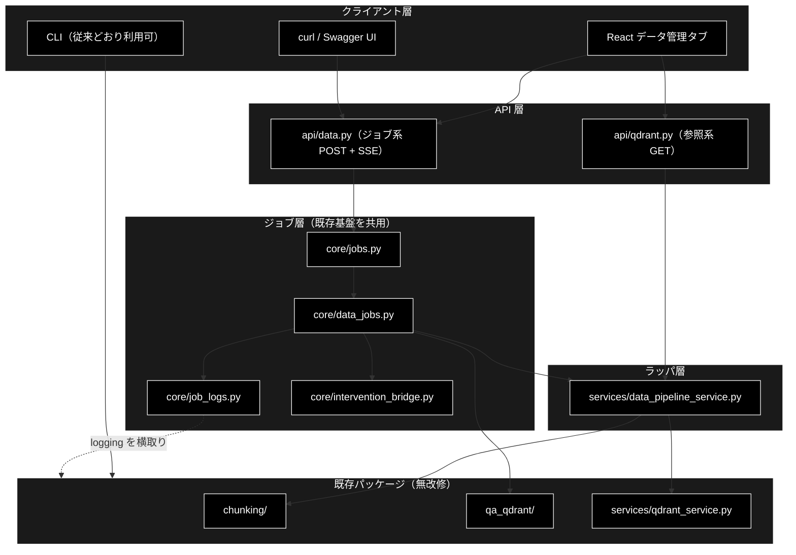
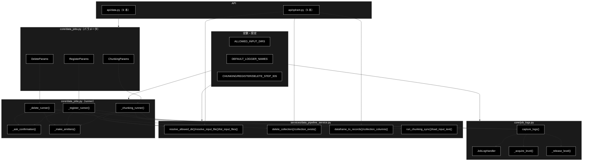
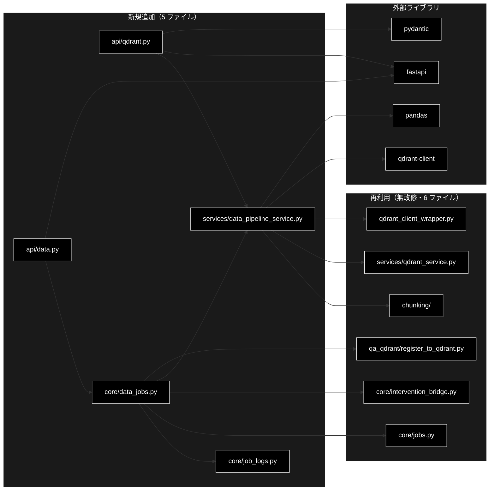

# データ管理（チャンキング / Qdrant CRUD） ドキュメント

**Version 1.0** | 最終更新: 2026-08-05

---

## 目次

1. [概要](#概要)
2. [アーキテクチャ構成図](#1-アーキテクチャ構成図)
   - [システム全体構成](#11-システム全体構成)
   - [データフロー](#12-データフロー)
3. [モジュール構成図](#2-モジュール構成図)
   - [内部モジュール構成](#21-内部モジュール構成)
   - [外部依存関係](#22-外部依存関係)
   - [内部依存モジュール](#23-内部依存モジュール)
4. [クラス・関数一覧表](#3-クラス関数一覧表)
   - [クラス一覧](#31-クラス一覧)
   - [関数一覧（カテゴリ別）](#32-関数一覧カテゴリ別)
5. [クラス・関数 IPO詳細](#4-クラス関数-ipo詳細)
   - [JobLogHandler クラス](#41-jobloghandler-クラス)
   - [ログ転送関数](#42-ログ転送関数)
   - [パス検証関数](#43-パス検証関数)
   - [Qdrant 操作関数](#44-qdrant-操作関数)
   - [データ変換関数](#45-データ変換関数)
   - [チャンキング関数](#46-チャンキング関数)
   - [ジョブパラメータ クラス](#47-ジョブパラメータ-クラス)
   - [ジョブ runner 関数](#48-ジョブ-runner-関数)
   - [API エンドポイント関数](#49-api-エンドポイント関数)
6. [設定・定数](#5-設定定数)
7. [使用例](#6-使用例)
8. [エクスポート](#7-エクスポート)
9. [変更履歴](#8-変更履歴)
10. [付録: 依存関係図](#付録-依存関係図)

---

## 概要

データ管理機能は、CLI でしか実行できなかった**データ準備の 3 工程**（チャンク化 → Q/A 生成 → Qdrant 登録）とコレクション管理を、Web API と React 画面から実行できるようにしたモジュール群である。`./run_dev.sh` で起動するアプリの **4 タブ目「データ管理」**から利用する。

GRACE-Support・GRACE-Review と**同じジョブ基盤**（`backend/app/core/jobs.py`）に乗せているため、SSE による進捗配信・HITL CONFIRM・ジョブ管理を新規に実装していない。

**既存パッケージ（`chunking/` `qa_generation/` `qa_qdrant/` `services/qdrant_service.py`）は 1 行も変更していない。** 追加したのは、CLI に埋まっていた処理を関数として取り出すラッパ層と、進捗を SSE へ転送する仕組み、そしてジョブ基盤に載せる runner の 3 つである。

### 主な責務

- チャンク化の実行（CSV / テキスト → セマンティックチャンク CSV）
- Qdrant 登録の実行（Q/A CSV → コレクション、Embedding 生成つき）
- コレクションの参照（一覧・詳細・ポイントのプレビュー・稼働確認）
- コレクションの削除（**必ず人間の承認を経る**）
- 破壊的操作の承認制御（削除は常時、登録は `recreate=True` のときだけ）
- 既存モジュールを無改修のまま進捗を SSE へ流す
- 入力ファイルの安全な選択（許可ディレクトリのホワイトリスト内に限定）

### 各責務対応のモジュール

| # | 責務 | 対応モジュール | 説明 |
|---|------|--------------|------|
| 1 | チャンク化の実行 | `backend/app/core/data_jobs.py` | `_chunking_runner` が `chunking/csv_text_to_chunks_text_csv.py` へ委譲 |
| 2 | Qdrant 登録の実行 | `backend/app/core/data_jobs.py` | `_register_runner` が `qa_qdrant/register_to_qdrant.py` へ委譲 |
| 3 | コレクションの参照 | `backend/app/api/qdrant.py` | `services/qdrant_service.py` の結果を JSON 化 |
| 4 | コレクションの削除 | `backend/app/core/data_jobs.py` | `_delete_runner` が `services/data_pipeline_service.py` へ委譲 |
| 5 | 破壊的操作の承認制御 | `backend/app/core/intervention_bridge.py` | Support / Review と同一の HITL 機構（無改修で再利用） |
| 6 | 進捗の SSE 転送 | `backend/app/core/job_logs.py` | `logging.Handler` でログを横取り |
| 7 | 入力ファイルの安全な選択 | `services/data_pipeline_service.py` | ホワイトリスト ＋ `resolve()` の二段検証 |

### 主要機能一覧

| 機能 | 説明 |
|------|------|
| `JobLogHandler` | 自スレッドのログレコードだけを進捗イベントへ転送する Handler |
| `JobLogHandler.emit()` | ログレコードを `log` イベントとして転送 |
| `JobLogHandler.set_step()` | 転送先のステップ ID を切り替え |
| `capture_logs()` | 指定ロガーの出力を転送するコンテキストマネージャ |
| `PathNotAllowedError` | 許可ディレクトリ外を指したときの例外 |
| `resolve_allowed_dir()` | ディレクトリ名を絶対パスへ解決（検証つき） |
| `list_input_files()` | 入力ファイル候補の列挙（更新日時降順） |
| `resolve_input_file()` | `dir/name` 形式を実パスへ解決 |
| `delete_collection()` | コレクションを 1 つ削除（例外を投げず `bool`） |
| `collection_exists()` | コレクションの存在確認 |
| `dataframe_to_records()` | DataFrame を JSON 化可能な `list[dict]` へ変換 |
| `collection_columns()` | レコード列から出現順に列名を抽出 |
| `run_chunking_sync()` | `chunks_all_async()` の同期ラッパ |
| `load_input_text()` | チャンク化の入力テキストを読み込み |
| `ChunkingParams` | チャンク化ジョブのパラメータ |
| `RegisterParams` | 登録ジョブのパラメータ |
| `DeleteParams` | 削除ジョブのパラメータ |
| `_chunking_runner()` | チャンク化ジョブの本体 |
| `_register_runner()` | 登録ジョブの本体 |
| `_delete_runner()` | 削除ジョブの本体 |
| `_ask_confirmation()` | HITL CONFIRM を要求し `(承認, タイムアウト)` を返す |
| `qdrant_health()` | `GET /api/qdrant/health` |
| `list_collections()` | `GET /api/qdrant/collections` |
| `get_collection()` | `GET /api/qdrant/collections/{name}` |
| `get_collection_points()` | `GET /api/qdrant/collections/{name}/points` |
| `list_files()` | `GET /api/files` |
| `run_chunking()` | `POST /api/chunking/run` |
| `register_collection()` | `POST /api/qdrant/register` |
| `delete_collections()` | `POST /api/qdrant/delete` |
| `stream_events()` | `GET /api/data/stream/{job_id}` |
| `confirm_intervention()` | `POST /api/data/confirm/{job_id}` |
| `get_result()` | `GET /api/data/result/{job_id}` |

---

## 1. アーキテクチャ構成図

### 1.1 システム全体構成



> 📝 **注意**: CLI は残している。大規模バッチや `--resume` は CLI の方が適しており、画面化の目的は「小〜中規模の試行と可視化」である。両者は同じ関数を呼ぶので挙動は一致する。

### 1.2 データフロー

1. React（またはブラウザ・curl）がジョブ起動 API（`POST /api/chunking/run` など）を呼ぶ
2. `JobManager.start()` が params の型から runner を解決し、ワーカースレッドで実行する
3. runner が `capture_logs()` を張り、既存パッケージの `logging` 出力を `log` イベントへ転送する
4. runner がステップの区切りで `step` イベントを発行する
5. 破壊的操作（削除・`recreate`）では `InterventionBridge` が `intervention` イベントを流し、承認が来るまでブロックする
6. クライアントは `GET /api/data/stream/{job_id}` の SSE でイベント列を受信し、画面を更新する
7. 承認が必要な場合は `POST /api/data/confirm/{job_id}` で応答を注入する
8. 完了後、`result` イベントと `done` 番兵が流れる

---

## 2. モジュール構成図

### 2.1 内部モジュール構成



### 2.2 外部依存関係

| ライブラリ | バージョン | 用途 |
|-----------|-----------|------|
| `fastapi` | >=0.116.0 | API ルーター・SSE（`StreamingResponse`） |
| `pydantic` | 2.11.7 | リクエスト/レスポンススキーマ |
| `qdrant-client` | 1.15.1 | Qdrant への接続・コレクション操作 |
| `pandas` | 2.3.1 | `QdrantDataFetcher` の戻り値（DataFrame）を受ける |

### 2.3 内部依存モジュール

| モジュール | 用途 |
|-----------|------|
| `backend.app.core.jobs` | `register_runner()` / `JobManager`（**無改修で再利用**） |
| `backend.app.core.intervention_bridge` | HITL CONFIRM（**無改修で再利用**） |
| `backend.app.core.support_agent` | `SupportEvent` / `EmitFn` / `ConfirmFn` の型 |
| `backend.app.schemas` | API のリクエスト/レスポンススキーマ |
| `grace.intervention` | `InterventionLevel` / `InterventionRequest` |
| `services.qdrant_service` | `get_all_collections()` / `QdrantDataFetcher` / `QdrantHealthChecker` |
| `qdrant_client_wrapper` | `get_qdrant_client()`（シングルトン） |
| `chunking.csv_text_to_chunks_text_csv` | `chunks_all_async()` / `load_text_from_csv()` / `generate_output_filename()` |
| `chunking.checkpoint_manager` | `CheckpointManager`（`--resume` 相当） |
| `qa_qdrant.register_to_qdrant` | `register_to_qdrant()` |

---

## 3. クラス・関数一覧表

### 3.1 クラス一覧

#### JobLogHandler

| メソッド | 概要 |
|---------|------|
| `__init__(emit_fn, step, thread_ident)` | 生成時のスレッド ident を記録して転送先を設定 |
| `emit(record)` | 自スレッドのレコードだけを `log` イベントへ転送 |
| `set_step(step)` | 転送先のステップ ID を切り替え |

#### ChunkingParams（dataclass）

| フィールド | 概要 |
|---------|------|
| `input_file` | 入力ファイル（`dir/name` 形式） |
| `output_dir` / `model` / `workers` / `block_size` | チャンク化の設定 |
| `text_column` / `max_rows` / `combine_rows` | CSV 読み込みの設定 |
| `resume` / `verbose` | 再開ジョブ ID・詳細ログ |

#### RegisterParams（dataclass）

| フィールド | 概要 |
|---------|------|
| `input_file` / `collection` | 入力 Q/A CSV と登録先 |
| `recreate` | **既存を削除して作り直す（要承認）** |
| `batch_size` / `embed_workers` / `provider` | Embedding の設定 |
| `text_col` / `domain` / `max_docs` | 登録内容の絞り込み |
| `normalize_filename` / `create_ui_csv` / `ui_output_dir` | 付随処理 |

#### DeleteParams（dataclass）

| フィールド | 概要 |
|---------|------|
| `collections` | 削除するコレクション名の一覧 |
| `verbose` | 詳細ログ |

#### PathNotAllowedError（例外）

| 継承元 | 概要 |
|---------|------|
| `ValueError` | 許可ディレクトリの外を指すパスが渡された |

### 3.2 関数一覧（カテゴリ別）

#### ログ転送関数

| 関数名 | 概要 |
|-------|------|
| `capture_logs(emit_fn, logger_names, step, level)` | 指定ロガーの出力を転送するコンテキストマネージャ |
| `_acquire_level(logger, level)` | ロガーの level を引き上げ参照数を増やす |
| `_release_level(logger)` | 参照数を減らし 0 で元の level へ戻す |

#### パス検証関数

| 関数名 | 概要 |
|-------|------|
| `resolve_allowed_dir(dir_name, base)` | 許可ディレクトリ名を絶対パスへ解決 |
| `list_input_files(dir_name, base, suffixes)` | 入力ファイル候補を更新日時降順で列挙 |
| `resolve_input_file(rel_path, base)` | `dir/name` を実パスへ解決 |

#### Qdrant 操作関数

| 関数名 | 概要 |
|-------|------|
| `delete_collection(client, collection_name)` | コレクションを 1 つ削除（例外を投げない） |
| `collection_exists(client, collection_name)` | コレクションの存在確認 |

#### データ変換関数

| 関数名 | 概要 |
|-------|------|
| `dataframe_to_records(df)` | DataFrame を `list[dict]` へ（NaN → None） |
| `collection_columns(records)` | レコード列から出現順に列名を抽出 |

#### チャンキング関数

| 関数名 | 概要 |
|-------|------|
| `run_chunking_sync(text, *, model, ...)` | `chunks_all_async()` の同期ラッパ |
| `load_input_text(path, *, text_column, ...)` | CSV / テキストの読み込み |

#### ジョブ runner 関数

| 関数名 | 概要 |
|-------|------|
| `_chunking_runner(params, emit, confirm)` | 読み込み → チャンク化 → 出力 |
| `_register_runner(params, emit, confirm)` | 検証 → 承認（条件付き）→ Embedding → 登録 |
| `_delete_runner(params, emit, confirm)` | 対象確認 → 承認 → 削除 |
| `_ask_confirmation(confirm, message, reason)` | HITL CONFIRM を要求 |
| `_make_emitters(emit)` | `log` / `step_started` / `step_finished` / `step_skipped` / `error` を生成 |

#### API エンドポイント関数

| 関数名 | 概要 |
|-------|------|
| `qdrant_health()` | Qdrant の稼働確認（落ちていても 200） |
| `list_collections()` | コレクション一覧 |
| `get_collection(name)` | コレクション詳細 |
| `get_collection_points(name, limit)` | ポイントのプレビュー |
| `list_files(dir)` | 入力ファイル候補 |
| `run_chunking(request)` | チャンク化ジョブの起動 |
| `register_collection(request)` | 登録ジョブの起動 |
| `delete_collections(request)` | 削除ジョブの起動 |
| `stream_events(job_id)` | 進捗の SSE 配信 |
| `confirm_intervention(job_id, request)` | HITL 応答の注入 |
| `get_result(job_id)` | ジョブ状態と結果の取得 |

---

## 4. クラス・関数 IPO詳細

### 4.1 JobLogHandler クラス

既存パッケージの `logging` 出力を、ジョブの進捗イベントへ転送する `logging.Handler` の実装。

#### コンストラクタ: `__init__`

**概要**: 生成時のスレッド ident を記録し、転送先のコールバックとステップ ID を保持する。

```python
JobLogHandler(
    emit_fn: EmitFn,
    step: Optional[str] = None,
    thread_ident: Optional[int] = None
)
```

| パラメータ | 型 | デフォルト | 説明 |
|------------|------|-----------|------|
| `emit_fn` | EmitFn | - | 進捗イベントの送信先（`Job.emit`） |
| `step` | Optional[str] | None | 転送するイベントの step ID |
| `thread_ident` | Optional[int] | None | 対象スレッド。None なら `threading.get_ident()` |

| 項目 | 内容 |
|------|------|
| **Input** | `emit_fn: EmitFn`, `step: Optional[str] = None`, `thread_ident: Optional[int] = None` |
| **Process** | 1. `logging.Handler.__init__()` を呼ぶ<br>2. コールバックを `_emit_fn` として保持（`emit` はメソッド名と衝突するため別名）<br>3. スレッド ident を記録 |
| **Output** | `JobLogHandler` インスタンス |

**戻り値例**:
```python
<JobLogHandler (NOTSET)>
```

```python
# 使用例
from backend.app.core.job_logs import JobLogHandler

events = []
handler = JobLogHandler(events.append, step="chunk")
print(handler.level)
# 出力: 0
```

#### メソッド: `emit`

**概要**: ログレコードを `log` イベントとして転送する。**自スレッド以外のレコードは無視する。**

```python
def emit(self, record: logging.LogRecord) -> None
```

| パラメータ | 型 | デフォルト | 説明 |
|------------|------|-----------|------|
| `record` | logging.LogRecord | - | 転送対象のログレコード |

| 項目 | 内容 |
|------|------|
| **Input** | `record: logging.LogRecord` |
| **Process** | 1. `record.thread` が生成時のスレッドと一致しなければ何もしない<br>2. `self.format(record)` で文字列化<br>3. 空白のみなら捨てる<br>4. `SupportEvent(type="log", ...)` を `_emit_fn` へ渡す<br>5. 例外は `handleError()` に委ねて握りつぶす |
| **Output** | `None` |

**戻り値例**:
```python
# _emit_fn へ渡される SupportEvent
SupportEvent(
    type="log",
    step="chunk",
    message="チャンク化処理開始 (3段階)",
    data={"level": "INFO"}
)
```

```python
# 使用例
import logging
from backend.app.core.job_logs import JobLogHandler

events = []
handler = JobLogHandler(events.append, step="chunk")
handler.setFormatter(logging.Formatter("%(message)s"))
logger = logging.getLogger("chunking")
logger.setLevel(logging.INFO)
logger.addHandler(handler)

logger.info("チャンク化処理開始")
print(events[0].message)
# 出力: チャンク化処理開始
```

> 📝 **注意**: 進捗の送信に失敗しても本処理（チャンク化・登録）を落とさない。`logging` の慣行どおり `handleError()` に委ねる。

#### メソッド: `set_step`

**概要**: 転送先のステップ ID を切り替える（同じジョブ内で段階が進んだとき）。

```python
def set_step(self, step: Optional[str]) -> None
```

| パラメータ | 型 | デフォルト | 説明 |
|------------|------|-----------|------|
| `step` | Optional[str] | - | 新しいステップ ID。None ならステップに紐づけない |

| 項目 | 内容 |
|------|------|
| **Input** | `step: Optional[str]` |
| **Process** | `self._step` を差し替える |
| **Output** | `None` |

**戻り値例**:
```python
None
```

```python
# 使用例
with capture_logs(emit, ["qa_qdrant"], step="embed") as handler:
    do_embedding()
    handler.set_step("upsert")   # 以降のログは upsert ステップへ
    do_upsert()
```

---

### 4.2 ログ転送関数

#### `capture_logs`

**概要**: 指定ロガーの出力を `emit_fn` へ転送するコンテキストマネージャ。既存モジュールを無改修のまま進捗を SSE へ流すための中核。

```python
@contextmanager
def capture_logs(
    emit_fn: EmitFn,
    logger_names: Sequence[str] = DEFAULT_LOGGER_NAMES,
    step: Optional[str] = None,
    level: int = logging.INFO
) -> Iterator[JobLogHandler]
```

| パラメータ | 型 | デフォルト | 説明 |
|------------|------|-----------|------|
| `emit_fn` | EmitFn | - | 進捗イベントの送信先 |
| `logger_names` | Sequence[str] | `("chunking", "qa_generation", "qa_qdrant", "services")` | 横取りするロガー名 |
| `step` | Optional[str] | None | 転送するイベントの step ID |
| `level` | int | `logging.INFO`(20) | 転送する最低レベル |

| 項目 | 内容 |
|------|------|
| **Input** | `emit_fn: EmitFn`, `logger_names: Sequence[str] = DEFAULT_LOGGER_NAMES`, `step: Optional[str] = None`, `level: int = 20` |
| **Process** | 1. `JobLogHandler` を生成（生成時のスレッド ident を記録）<br>2. ロックを取り、各ロガーへ `addHandler` し level を参照カウント付きで引き上げ<br>3. `yield handler`<br>4. `finally` で `removeHandler` と level 復元 |
| **Output** | `Iterator[JobLogHandler]`: 取り付けたハンドラ（`set_step()` で切り替え可） |

**戻り値例**:
```python
# with 文で受け取れる値
<JobLogHandler (INFO)>
```

```python
# 使用例
from backend.app.core.job_logs import capture_logs

events = []
with capture_logs(events.append, ["chunking"], step="chunk"):
    chunks = run_chunking_sync(text, model="claude-haiku-4-5", ...)

print(f"転送されたログ: {len(events)} 件")
# 出力: 転送されたログ: 42 件
```

> ⚠️ **参照カウントが必要な理由**: 素朴に「入るとき `logger.level` を控えて出るとき書き戻す」と実装すると、**同時に 2 本のジョブが走ったときに復元されない**。ジョブ B が「すでに引き上げられた値」を元の値として控えてしまい、最後に出る側がそれを書き戻すためである。最初に入った 1 本だけが元の値を持ち、最後に出る 1 本がそれを戻す方式にしてある。

> 📝 **注意**: 同時に走るジョブが違う `level` を要求した場合、先に入った方が勝つ。全ジョブが既定の INFO を使う限り問題にならない。

#### `_acquire_level`

**概要**: ロガーの level を引き上げ、参照数を 1 増やす（`_level_lock` 内で呼ぶ）。

```python
def _acquire_level(logger: logging.Logger, level: int) -> None
```

| パラメータ | 型 | デフォルト | 説明 |
|------------|------|-----------|------|
| `logger` | logging.Logger | - | 対象ロガー |
| `level` | int | - | 引き上げ先のレベル |

| 項目 | 内容 |
|------|------|
| **Input** | `logger: logging.Logger`, `level: int` |
| **Process** | 1. `_level_refs` に未登録なら「元の level と参照数 1」を記録し、必要なら `setLevel(level)`<br>2. 登録済みなら参照数を +1（**元の値は書き換えない**） |
| **Output** | `None` |

**戻り値例**:
```python
# _level_refs の状態
{"chunking": (0, 1)}   # (元の level=NOTSET, 参照数=1)
```

```python
# 使用例（capture_logs 内部から呼ばれる）
with _level_lock:
    _acquire_level(logging.getLogger("chunking"), logging.INFO)
```

#### `_release_level`

**概要**: 参照数を 1 減らし、0 になったら元の level へ戻す（`_level_lock` 内で呼ぶ）。

```python
def _release_level(logger: logging.Logger) -> None
```

| パラメータ | 型 | デフォルト | 説明 |
|------------|------|-----------|------|
| `logger` | logging.Logger | - | 対象ロガー |

| 項目 | 内容 |
|------|------|
| **Input** | `logger: logging.Logger` |
| **Process** | 1. 未登録なら何もしない<br>2. 参照数が 1 以下なら元の level へ戻して登録を削除<br>3. それ以外は参照数を -1 |
| **Output** | `None` |

**戻り値例**:
```python
# 最後の 1 本が抜けた後の _level_refs
{}
```

```python
# 使用例（capture_logs の finally から呼ばれる）
with _level_lock:
    _release_level(logging.getLogger("chunking"))
```

---

### 4.3 パス検証関数

#### `resolve_allowed_dir`

**概要**: 許可ディレクトリ名を絶対パスへ解決する。ホワイトリスト照合と `resolve()` 後の基点チェックの**二段**で検証する。

```python
def resolve_allowed_dir(
    dir_name: str,
    base: Optional[Path] = None
) -> Path
```

| パラメータ | 型 | デフォルト | 説明 |
|------------|------|-----------|------|
| `dir_name` | str | - | `ALLOWED_INPUT_DIRS` のいずれか |
| `base` | Optional[Path] | None | 基点。省略時はカレントディレクトリ |

| 項目 | 内容 |
|------|------|
| **Input** | `dir_name: str`, `base: Optional[Path] = None` |
| **Process** | 1. `ALLOWED_INPUT_DIRS` に含まれるか照合<br>2. `base` を `resolve()` して基点を確定<br>3. `base / dir_name` を `resolve()`<br>4. 結果が基点配下にあるか確認 |
| **Output** | `Path`: 絶対パス |

**戻り値例**:
```python
PosixPath('/home/user/grace_v2/OUTPUT')
```

```python
# 使用例
from services.data_pipeline_service import resolve_allowed_dir, PathNotAllowedError

print(resolve_allowed_dir("OUTPUT"))
# 出力: /home/user/grace_v2/OUTPUT

try:
    resolve_allowed_dir("logs")
except PathNotAllowedError as e:
    print(e)
# 出力: 許可されていないディレクトリです: 'logs'（許可: ['OUTPUT', 'output_chunked', 'qa_output', 'datasets']）
```

> ⚠️ **ホワイトリスト照合だけでは足りない**。`OUTPUT/../..` のような値に備えて、`resolve()` した結果が基点配下にあることも確認する。

#### `list_input_files`

**概要**: 許可ディレクトリ内の入力ファイル候補を、更新日時の降順で列挙する。

```python
def list_input_files(
    dir_name: str,
    base: Optional[Path] = None,
    suffixes: tuple[str, ...] = (".csv", ".txt")
) -> List[Dict[str, Any]]
```

| パラメータ | 型 | デフォルト | 説明 |
|------------|------|-----------|------|
| `dir_name` | str | - | 許可ディレクトリ名 |
| `base` | Optional[Path] | None | 基点 |
| `suffixes` | tuple[str, ...] | `(".csv", ".txt")` | 対象とする拡張子 |

| 項目 | 内容 |
|------|------|
| **Input** | `dir_name: str`, `base: Optional[Path] = None`, `suffixes: tuple[str, ...] = ('.csv', '.txt')` |
| **Process** | 1. `resolve_allowed_dir()` で検証<br>2. ディレクトリが無ければ空リストを返す（エラーにしない）<br>3. ファイルのみ・対象拡張子のみを走査<br>4. `modified` の降順で並べ替え |
| **Output** | `List[Dict[str, Any]]`: `{name, path, size, modified, suffix}` の一覧 |

**戻り値例**:
```python
[
    {
        "name": "cc_news_1per.csv",
        "path": "OUTPUT/cc_news_1per.csv",
        "size": 1048576,
        "modified": 1754380800.0,
        "suffix": ".csv"
    },
    {
        "name": "faq.csv",
        "path": "OUTPUT/faq.csv",
        "size": 20480,
        "modified": 1754294400.0,
        "suffix": ".csv"
    }
]
```

```python
# 使用例
from services.data_pipeline_service import list_input_files

files = list_input_files("OUTPUT")
for f in files:
    print(f"{f['path']} ({f['size']} bytes)")
# 出力: OUTPUT/cc_news_1per.csv (1048576 bytes)
```

> 📝 **注意**: 絶対パスは返さない。`path` は `ディレクトリ名/ファイル名` 形式に限定し、サーバのディレクトリ構造を漏らさない。

#### `resolve_input_file`

**概要**: `list_input_files()` が返した `dir/name` 形式を実パスへ戻す。

```python
def resolve_input_file(
    rel_path: str,
    base: Optional[Path] = None
) -> Path
```

| パラメータ | 型 | デフォルト | 説明 |
|------------|------|-----------|------|
| `rel_path` | str | - | `ディレクトリ名/ファイル名` 形式 |
| `base` | Optional[Path] | None | 基点 |

| 項目 | 内容 |
|------|------|
| **Input** | `rel_path: str`, `base: Optional[Path] = None` |
| **Process** | 1. `/` で 2 分割できるか検証<br>2. ファイル名側に区切り・`.`・`..` が混ざっていないか検証<br>3. `resolve_allowed_dir()` でディレクトリを検証<br>4. `resolve()` 後に基点配下か確認<br>5. 実ファイルの存在を確認 |
| **Output** | `Path`: 絶対パス |

**戻り値例**:
```python
PosixPath('/home/user/grace_v2/OUTPUT/cc_news_1per.csv')
```

```python
# 使用例
from services.data_pipeline_service import resolve_input_file, PathNotAllowedError

print(resolve_input_file("OUTPUT/cc_news_1per.csv"))
# 出力: /home/user/grace_v2/OUTPUT/cc_news_1per.csv

for bad in ["a.csv", "OUTPUT/../../etc/passwd", "logs/app.log"]:
    try:
        resolve_input_file(bad)
    except (PathNotAllowedError, FileNotFoundError) as e:
        print(f"{bad}: 拒否")
# 出力: a.csv: 拒否
#       OUTPUT/../../etc/passwd: 拒否
#       logs/app.log: 拒否
```

---

### 4.4 Qdrant 操作関数

#### `delete_collection`

**概要**: コレクションを 1 つ削除する。`qdrant_delete_collection.py` の `main()` に直書きされていた処理を関数として切り出したもの。

```python
def delete_collection(
    client: QdrantClient,
    collection_name: str
) -> bool
```

| パラメータ | 型 | デフォルト | 説明 |
|------------|------|-----------|------|
| `client` | QdrantClient | - | Qdrant クライアント |
| `collection_name` | str | - | 削除するコレクション名 |

| 項目 | 内容 |
|------|------|
| **Input** | `client: QdrantClient`, `collection_name: str` |
| **Process** | 1. `client.delete_collection()` を呼ぶ<br>2. 成功をログに記録<br>3. 例外は捕まえてログに記録し `False` を返す |
| **Output** | `bool`: 削除できたら True、存在しない・失敗したら False |

**戻り値例**:
```python
True
```

```python
# 使用例
from qdrant_client_wrapper import get_qdrant_client
from services.data_pipeline_service import delete_collection

client = get_qdrant_client()
if delete_collection(client, "old_collection"):
    print("削除しました")
else:
    print("削除できませんでした")
# 出力: 削除しました
```

> ⚠️ **確認プロンプトは持たない**。承認は呼び出し側の責務（Web は HITL CONFIRM、CLI は `--yes`）とする。**例外を投げない**設計なので、呼び出し側は戻り値で判定すること。

#### `collection_exists`

**概要**: コレクションの存在を確認する（削除前チェック用）。

```python
def collection_exists(
    client: QdrantClient,
    collection_name: str
) -> bool
```

| パラメータ | 型 | デフォルト | 説明 |
|------------|------|-----------|------|
| `client` | QdrantClient | - | Qdrant クライアント |
| `collection_name` | str | - | 確認するコレクション名 |

| 項目 | 内容 |
|------|------|
| **Input** | `client: QdrantClient`, `collection_name: str` |
| **Process** | 1. `client.get_collections()` で名前の集合を取得<br>2. 含まれるか判定<br>3. 接続失敗時は例外を捕まえて `False` |
| **Output** | `bool`: 存在すれば True |

**戻り値例**:
```python
False
```

```python
# 使用例
from services.data_pipeline_service import collection_exists

if not collection_exists(client, "faq_anthropic"):
    print("未作成です。登録してください。")
# 出力: 未作成です。登録してください。
```

---

### 4.5 データ変換関数

#### `dataframe_to_records`

**概要**: pandas DataFrame を JSON 化できる `list[dict]` へ変換する。**NaN を None へ寄せる。**

```python
def dataframe_to_records(df: Any) -> List[Dict[str, Any]]
```

| パラメータ | 型 | デフォルト | 説明 |
|------------|------|-----------|------|
| `df` | Any | - | pandas DataFrame（None・空も可） |

| 項目 | 内容 |
|------|------|
| **Input** | `df: Any` |
| **Process** | 1. None・空 DataFrame なら空リスト<br>2. `astype(object).where(pd.notnull(df), None)` で NaN を None へ<br>3. `to_dict(orient="records")` |
| **Output** | `List[Dict[str, Any]]`: レコードの一覧 |

**戻り値例**:
```python
[
    {"ID": 1, "question": "住民票の取り方は？", "answer": None},
    {"ID": 2, "question": "印鑑証明は？", "answer": "窓口で発行できます"}
]
```

```python
# 使用例
import pandas as pd
from services.data_pipeline_service import dataframe_to_records

df = pd.DataFrame([{"ID": 1, "q": "あ"}, {"ID": 2, "extra": 5}])
rows = dataframe_to_records(df)
print(rows[0]["extra"])
# 出力: None
```

> ⚠️ **NaN を残すと不正な JSON になる**。JSON に NaN というリテラルは無く、`json.dumps` が `NaN` という**パースできないトークン**を出力する。列が揃わないコレクション（payload のキーがレコードごとに違う）では必ず NaN が発生するため、この変換は必須である。

#### `collection_columns`

**概要**: レコード列から列名を出現順に抽出する。payload のキーはコレクションごとに違うため列を固定できない。

```python
def collection_columns(records: List[Dict[str, Any]]) -> List[str]
```

| パラメータ | 型 | デフォルト | 説明 |
|------------|------|-----------|------|
| `records` | List[Dict[str, Any]] | - | `dataframe_to_records()` の戻り値 |

| 項目 | 内容 |
|------|------|
| **Input** | `records: List[Dict[str, Any]]` |
| **Process** | 全レコードを走査し、初出のキーを順に追加する（`dict` は挿入順を保つ） |
| **Output** | `List[str]`: 出現順の列名 |

**戻り値例**:
```python
["ID", "question", "answer"]
```

```python
# 使用例
from services.data_pipeline_service import collection_columns

rows = [{"ID": 1, "question": "あ"}, {"ID": 2, "answer": "い", "question": "う"}]
print(collection_columns(rows))
# 出力: ['ID', 'question', 'answer']
```

---

### 4.6 チャンキング関数

#### `run_chunking_sync`

**概要**: `chunks_all_async()` を同期呼び出しできるようにラップする。ジョブ runner はワーカースレッドで動く同期関数なので、async をそのまま呼べない。

```python
def run_chunking_sync(
    text: str,
    *,
    model: str,
    max_workers: int,
    block_size: int,
    output_file: str,
    dataset_type: str,
    source_file: Optional[str] = None,
    job_id: Optional[str] = None
) -> List[str]
```

| パラメータ | 型 | デフォルト | 説明 |
|------------|------|-----------|------|
| `text` | str | - | チャンク化する原文 |
| `model` | str | - | 使用する LLM |
| `max_workers` | int | - | 並列ワーカー数 |
| `block_size` | int | - | ブロックサイズ（文字数） |
| `output_file` | str | - | 出力 CSV パス |
| `dataset_type` | str | - | データセット種別 |
| `source_file` | Optional[str] | None | 元ファイル名（メタデータ用） |
| `job_id` | Optional[str] | None | 再開用ジョブ ID。None なら新規発行 |

| 項目 | 内容 |
|------|------|
| **Input** | `text: str`, `model: str`, `max_workers: int`, `block_size: int`, `output_file: str`, `dataset_type: str`, `source_file: Optional[str] = None`, `job_id: Optional[str] = None` |
| **Process** | 1. `chunking` を遅延 import（呼ばない経路で import コストを払わない）<br>2. `CheckpointManager` を生成（`job_id` があれば再開）<br>3. `asyncio.run(chunks_all_async(...))` |
| **Output** | `List[str]`: 生成されたチャンクの一覧 |

**戻り値例**:
```python
[
    "住民票の写しは、お住まいの市区町村の窓口で取得できます。",
    "必要なものは本人確認書類と手数料です。"
]
```

```python
# 使用例
from services.data_pipeline_service import run_chunking_sync

chunks = run_chunking_sync(
    text="...原文...",
    model="claude-haiku-4-5",
    max_workers=8,
    block_size=1000,
    output_file="output_chunked/faq_chunks.csv",
    dataset_type="faq",
)
print(f"生成チャンク数: {len(chunks)}")
# 出力: 生成チャンク数: 128
```

> ⚠️ **`asyncio.run()` は「実行中のイベントループが無いこと」を要求する**。FastAPI のリクエストハンドラ（async）から直接呼ぶと `RuntimeError: asyncio.run() cannot be called from a running event loop` になる。必ずジョブのワーカースレッド側から呼ぶこと。

#### `load_input_text`

**概要**: チャンク化の入力テキストを読み込む（CSV / テキスト）。`csv_text_to_chunks_text_csv.py` の `main()` が行っている分岐と同じ。

```python
def load_input_text(
    path: Path,
    *,
    text_column: Optional[str] = None,
    max_rows: Optional[int] = None,
    combine_rows: bool = False
) -> str
```

| パラメータ | 型 | デフォルト | 説明 |
|------------|------|-----------|------|
| `path` | Path | - | 入力ファイルの絶対パス |
| `text_column` | Optional[str] | None | CSV のテキストカラム名。None なら自動検出 |
| `max_rows` | Optional[int] | None | 最大処理行数。None なら全件 |
| `combine_rows` | bool | False | CSV 全行を 1 つのテキストへ結合するか |

| 項目 | 内容 |
|------|------|
| **Input** | `path: Path`, `text_column: Optional[str] = None`, `max_rows: Optional[int] = None`, `combine_rows: bool = False` |
| **Process** | 1. 拡張子が `.csv` なら `load_text_from_csv()` へ委譲<br>2. それ以外は UTF-8 で素読み |
| **Output** | `str`: 読み込んだテキスト |

**戻り値例**:
```python
"住民票の写しは、お住まいの市区町村の窓口で取得できます。\n必要なものは..."
```

```python
# 使用例
from pathlib import Path
from services.data_pipeline_service import load_input_text, resolve_input_file

path = resolve_input_file("OUTPUT/faq.csv")
text = load_input_text(path, text_column="Text", max_rows=100)
print(f"読み込み: {len(text):,} 文字")
# 出力: 読み込み: 52,340 文字
```

---

### 4.7 ジョブパラメータ クラス

`backend/app/core/jobs.py` の `register_runner(params_type, runner, kind)` により、**params の型から runner が解決される**。したがってこれらのクラスは「どのジョブを実行するか」の識別子でもある。

#### コンストラクタ: `ChunkingParams`

**概要**: チャンク化ジョブのパラメータ（CLI 引数と 1:1 対応）。

```python
ChunkingParams(
    input_file: str,
    output_dir: str = "output_chunked",
    model: str = "claude-haiku-4-5",
    workers: int = 8,
    block_size: int = 1000,
    text_column: Optional[str] = None,
    max_rows: Optional[int] = None,
    combine_rows: bool = False,
    resume: Optional[str] = None,
    verbose: bool = False
)
```

| パラメータ | 型 | デフォルト | 説明 |
|------------|------|-----------|------|
| `input_file` | str | - | `ディレクトリ名/ファイル名` 形式 |
| `output_dir` | str | "output_chunked" | 出力ディレクトリ |
| `model` | str | "claude-haiku-4-5" | チャンク化に使う LLM |
| `workers` | int | 8 | 並列ワーカー数 |
| `block_size` | int | 1000 | ブロックサイズ（文字数） |
| `text_column` | Optional[str] | None | CSV のテキストカラム名 |
| `max_rows` | Optional[int] | None | 最大処理行数 |
| `combine_rows` | bool | False | CSV 全行を結合 |
| `resume` | Optional[str] | None | 再開するジョブ ID |
| `verbose` | bool | False | 詳細ログ |

| 項目 | 内容 |
|------|------|
| **Input** | 上記 10 フィールド |
| **Process** | dataclass による属性の保持のみ（検証は runner 側） |
| **Output** | `ChunkingParams` インスタンス |

**戻り値例**:
```python
ChunkingParams(
    input_file='OUTPUT/cc_news_1per.csv',
    output_dir='output_chunked',
    model='claude-haiku-4-5',
    workers=8,
    block_size=1000,
    text_column=None,
    max_rows=None,
    combine_rows=False,
    resume=None,
    verbose=False
)
```

```python
# 使用例
from backend.app.core.data_jobs import ChunkingParams
from backend.app.core.jobs import job_manager

job = job_manager.start(ChunkingParams(input_file="OUTPUT/faq.csv", workers=4))
print(job.kind)
# 出力: chunking
```

#### コンストラクタ: `RegisterParams`

**概要**: Qdrant 登録ジョブのパラメータ。`recreate=True` は既存コレクションを削除して作り直すため承認を要する。

```python
RegisterParams(
    input_file: str,
    collection: str,
    recreate: bool = False,
    batch_size: int = 100,
    embed_workers: int = 2,
    text_col: Optional[str] = None,
    domain: Optional[str] = None,
    max_docs: Optional[int] = None,
    provider: str = "gemini",
    normalize_filename: bool = True,
    create_ui_csv: bool = True,
    ui_output_dir: str = "qa_output",
    verbose: bool = False
)
```

| パラメータ | 型 | デフォルト | 説明 |
|------------|------|-----------|------|
| `input_file` | str | - | Q/A CSV（`ディレクトリ名/ファイル名`） |
| `collection` | str | - | 登録先コレクション名 |
| `recreate` | bool | False | **既存を削除して作り直す（要承認）** |
| `batch_size` | int | 100 | Embedding バッチサイズ |
| `embed_workers` | int | 2 | Embedding 先読みの並列スレッド数 |
| `text_col` | Optional[str] | None | ベクトル化対象カラム。None で自動検出 |
| `domain` | Optional[str] | None | payload の domain 値。None でコレクション名 |
| `max_docs` | Optional[int] | None | 登録する最大件数 |
| `provider` | str | "gemini" | Embedding プロバイダ |
| `normalize_filename` | bool | True | ファイル名正規化を行うか |
| `create_ui_csv` | bool | True | UI 用 CSV を生成するか |
| `ui_output_dir` | str | "qa_output" | UI 用 CSV の出力先 |
| `verbose` | bool | False | 詳細ログ |

| 項目 | 内容 |
|------|------|
| **Input** | 上記 13 フィールド |
| **Process** | dataclass による属性の保持のみ |
| **Output** | `RegisterParams` インスタンス |

**戻り値例**:
```python
RegisterParams(
    input_file='qa_output/faq_qa.csv',
    collection='faq_anthropic',
    recreate=False,
    batch_size=100,
    embed_workers=2,
    provider='gemini',
    ...
)
```

```python
# 使用例
from backend.app.core.data_jobs import RegisterParams
from backend.app.core.jobs import job_manager

job = job_manager.start(RegisterParams(
    input_file="qa_output/faq_qa.csv",
    collection="faq_anthropic",
))
print(job.kind)
# 出力: register
```

> 📝 **注意**: `provider="gemini"` は正しい。CLAUDE.md のプロバイダ方針により **Embedding は Gemini**（`gemini-embedding-001`・3072 次元・`GOOGLE_API_KEY`）で、LLM 用途（Anthropic Claude）とは別系統である。

#### コンストラクタ: `DeleteParams`

**概要**: コレクション削除ジョブのパラメータ。**必ず HITL CONFIRM を通る。**

```python
DeleteParams(
    collections: List[str],
    verbose: bool = False
)
```

| パラメータ | 型 | デフォルト | 説明 |
|------------|------|-----------|------|
| `collections` | List[str] | - | 削除するコレクション名の一覧 |
| `verbose` | bool | False | 詳細ログ |

| 項目 | 内容 |
|------|------|
| **Input** | `collections: List[str]`, `verbose: bool = False` |
| **Process** | dataclass による属性の保持のみ |
| **Output** | `DeleteParams` インスタンス |

**戻り値例**:
```python
DeleteParams(collections=['old_collection', 'tmp_test'], verbose=False)
```

```python
# 使用例
from backend.app.core.data_jobs import DeleteParams
from backend.app.core.jobs import job_manager

job = job_manager.start(DeleteParams(collections=["old_collection"]))
print(job.kind)
# 出力: delete
```

---

### 4.8 ジョブ runner 関数

#### `_ask_confirmation`

**概要**: HITL CONFIRM を要求し、承認されたかとタイムアウトしたかを返す。

```python
def _ask_confirmation(
    confirm: ConfirmFn,
    message: str,
    reason: str
) -> tuple[bool, bool]
```

| パラメータ | 型 | デフォルト | 説明 |
|------------|------|-----------|------|
| `confirm` | ConfirmFn | - | 承認リゾルバ（Web は `InterventionBridge.resolver`） |
| `message` | str | - | 承認画面に出す本文 |
| `reason` | str | - | 承認を求める理由 |

| 項目 | 内容 |
|------|------|
| **Input** | `confirm: ConfirmFn`, `message: str`, `reason: str` |
| **Process** | 1. `InterventionRequest(level=CONFIRM, message, reason)` を作る<br>2. `confirm()` を呼ぶ（**承認が来るまでブロックする**）<br>3. `should_continue` と `timeout_reached` を返す |
| **Output** | `tuple[bool, bool]`<br>- bool: 承認されたか<br>- bool: タイムアウトしたか |

**戻り値例**:
```python
(False, True)   # 承認されず、タイムアウトした
```

```python
# 使用例
approved, timed_out = _ask_confirmation(
    confirm,
    message="コレクション 'old' を削除します。元に戻せません。",
    reason="コレクション削除（不可逆）",
)
if not approved:
    print("タイムアウト" if timed_out else "拒否されました")
# 出力: タイムアウト
```

#### `_chunking_runner`

**概要**: CSV / テキストをセマンティックチャンク CSV へ変換するジョブ本体。承認は不要（非破壊）。

```python
def _chunking_runner(
    params: ChunkingParams,
    emit: EmitFn,
    confirm: ConfirmFn
) -> Optional[Dict[str, Any]]
```

| パラメータ | 型 | デフォルト | 説明 |
|------------|------|-----------|------|
| `params` | ChunkingParams | - | 実行パラメータ |
| `emit` | EmitFn | - | 進捗イベントの送信先 |
| `confirm` | ConfirmFn | - | 承認リゾルバ（**この runner では未使用**） |

| 項目 | 内容 |
|------|------|
| **Input** | `params: ChunkingParams`, `emit: EmitFn`, `confirm: ConfirmFn` |
| **Process** | 1. `ANTHROPIC_API_KEY` の有無を確認<br>2. `load` ステップ: 入力パス検証 → `load_input_text()`<br>3. 空テキストなら error<br>4. `chunk` ステップ: `run_chunking_sync()`（`capture_logs` でログ転送）<br>5. `save` ステップ: 出力ファイルの存在確認 |
| **Output** | `Optional[Dict[str, Any]]`: 結果 dict。失敗時は None |

**戻り値例**:
```python
{
    "kind": "chunking",
    "input_file": "OUTPUT/cc_news_1per.csv",
    "output_file": "output_chunked/cc_news_1per_chunks.csv",
    "chunks": 128,
    "chars": 52340,
    "model": "claude-haiku-4-5"
}
```

```python
# 使用例
from backend.app.core.data_jobs import ChunkingParams, _chunking_runner

events = []
result = _chunking_runner(
    ChunkingParams(input_file="OUTPUT/faq.csv"),
    events.append,
    lambda req: None,      # 承認は使わない
)
print(f"生成: {result['chunks']} チャンク")
# 出力: 生成: 128 チャンク
```

#### `_register_runner`

**概要**: Q/A CSV を Qdrant コレクションへ登録するジョブ本体。**`recreate=True` かつ既存コレクションがあるときだけ**承認を求める。

```python
def _register_runner(
    params: RegisterParams,
    emit: EmitFn,
    confirm: ConfirmFn
) -> Optional[Dict[str, Any]]
```

| パラメータ | 型 | デフォルト | 説明 |
|------------|------|-----------|------|
| `params` | RegisterParams | - | 実行パラメータ |
| `emit` | EmitFn | - | 進捗イベントの送信先 |
| `confirm` | ConfirmFn | - | 承認リゾルバ |

| 項目 | 内容 |
|------|------|
| **Input** | `params: RegisterParams`, `emit: EmitFn`, `confirm: ConfirmFn` |
| **Process** | 1. `prepare` ステップ: 入力パス検証・既存コレクションの有無と件数を取得<br>2. `confirm` ステップ: `recreate` かつ既存ありなら承認を求める。承認されなければ中止<br>3. `embed` ステップ: `register_to_qdrant()`（`capture_logs` でログ転送）<br>4. `upsert` ステップ: 登録後の件数を確認 |
| **Output** | `Optional[Dict[str, Any]]`: 結果 dict。失敗時は None |

**戻り値例**:
```python
{
    "kind": "register",
    "collection": "faq_anthropic",
    "input_file": "qa_output/faq_qa.csv",
    "registered": True,
    "cancelled": False,
    "points": 512,
    "points_before": 0,
    "recreate": False
}
```

```python
# 使用例
from backend.app.core.data_jobs import RegisterParams, _register_runner
from grace.intervention import InterventionAction, InterventionResponse

def approve(req):
    return InterventionResponse(action=InterventionAction.PROCEED)

result = _register_runner(
    RegisterParams(input_file="qa_output/faq_qa.csv", collection="faq_anthropic"),
    [].append,
    approve,
)
print(f"登録後: {result['points']} 件")
# 出力: 登録後: 512 件
```

**承認を求める条件**:

| `recreate` | コレクション | 承認 | 理由 |
|:---:|---|:---:|---|
| `False` | 任意 | 不要 | 既存を壊さない（追記） |
| `True` | 存在する | **必要** | 削除して作り直す＝破壊的 |
| `True` | 存在しない | 不要 | 壊すものが無い |

#### `_delete_runner`

**概要**: コレクションを削除するジョブ本体。**必ず HITL CONFIRM を通る。**

```python
def _delete_runner(
    params: DeleteParams,
    emit: EmitFn,
    confirm: ConfirmFn
) -> Optional[Dict[str, Any]]
```

| パラメータ | 型 | デフォルト | 説明 |
|------------|------|-----------|------|
| `params` | DeleteParams | - | 実行パラメータ |
| `emit` | EmitFn | - | 進捗イベントの送信先 |
| `confirm` | ConfirmFn | - | 承認リゾルバ |

| 項目 | 内容 |
|------|------|
| **Input** | `params: DeleteParams`, `emit: EmitFn`, `confirm: ConfirmFn` |
| **Process** | 1. 空リストなら error<br>2. `inspect` ステップ: 各対象の存在と件数を確認。存在しないものは `missing` へ<br>3. 対象が 0 件なら承認を求めず error<br>4. `confirm` ステップ: 対象名と合計件数を提示して承認を求める<br>5. `delete` ステップ: 承認されたものだけ `delete_collection()` |
| **Output** | `Optional[Dict[str, Any]]`: 結果 dict。失敗時は None |

**戻り値例**:
```python
{
    "kind": "delete",
    "deleted": ["old_collection"],
    "failed": [],
    "missing": ["does_not_exist"],
    "cancelled": False,
    "total_points": 1024
}
```

```python
# 使用例
from backend.app.core.data_jobs import DeleteParams, _delete_runner
from grace.intervention import InterventionAction, InterventionResponse

def reject(req):
    return InterventionResponse(action=InterventionAction.CANCEL)

result = _delete_runner(
    DeleteParams(collections=["old_collection"]),
    [].append,
    reject,
)
print(f"中止: {result['cancelled']} / 削除: {result['deleted']}")
# 出力: 中止: True / 削除: []
```

**承認結果ごとの挙動**:

| 状況 | 挙動 |
|---|---|
| 承認 | 削除する |
| **拒否** | **削除しない**。`cancelled: True` で完了 |
| **タイムアウト** | **削除しない**（安全側）。`reason` に「タイムアウト」 |
| 一部が存在しない | 存在する分だけ削除し、`missing` に載せる |
| 全部存在しない | 承認を求めず error |

> ⚠️ **HTTP `DELETE` メソッドは提供していない**。承認を経ずに消える経路を作らないためで、画面を迂回して API を直接叩かれても同じである。

#### `_make_emitters`

**概要**: `support_agent.py` と同じ形の `log` / `step_started` / `step_finished` / `step_skipped` / `error` ヘルパを生成する。

```python
def _make_emitters(emit: EmitFn)
```

| パラメータ | 型 | デフォルト | 説明 |
|------------|------|-----------|------|
| `emit` | EmitFn | - | 進捗イベントの送信先 |

| 項目 | 内容 |
|------|------|
| **Input** | `emit: EmitFn` |
| **Process** | 5 つのクロージャを生成してタプルで返す |
| **Output** | `Tuple[Callable, Callable, Callable, Callable, Callable]`<br>- log: メッセージ送信<br>- step_started: ステップ開始<br>- step_finished: ステップ完了<br>- step_skipped: ステップスキップ<br>- error: エラー送信 |

**戻り値例**:
```python
(
    <function log>,
    <function step_started>,
    <function step_finished>,
    <function step_skipped>,
    <function error>
)
```

```python
# 使用例（runner 内部から呼ばれる）
log, step_started, step_finished, step_skipped, error = _make_emitters(emit)

step_started("load", "① 入力読み込み", input_file="OUTPUT/faq.csv")
log("  読み込み完了: 52,340 文字", step="load")
step_finished("load", chars=52340)
```

---

### 4.9 API エンドポイント関数

#### `qdrant_health`

**概要**: Qdrant の稼働確認。**落ちていても 200 を返す**（本文の `available` で判定する）。

```python
@router.get("/qdrant/health", response_model=QdrantHealth)
def qdrant_health() -> QdrantHealth
```

| パラメータ | 型 | デフォルト | 説明 |
|------------|------|-----------|------|
| （なし） | - | - | - |

| 項目 | 内容 |
|------|------|
| **Input** | なし |
| **Process** | 1. `QdrantHealthChecker().check_qdrant()` を呼ぶ<br>2. 例外は捕まえて `available=False` に倒す<br>3. コレクション件数を抽出 |
| **Output** | `QdrantHealth`: `{available, message, url, collections_count}` |

**戻り値例**:
```python
{
    "available": False,
    "message": "Qdrant に接続できません",
    "url": "http://localhost:6333",
    "collections_count": None
}
```

```python
# 使用例
import requests

health = requests.get("http://localhost:8000/api/qdrant/health").json()
if not health["available"]:
    print("docker-compose up -d で起動してください")
# 出力: docker-compose up -d で起動してください
```

> 📝 **注意**: 503 にしないのは、画面側で「エラー」と「起動してください」の案内を出し分けられるようにするため。

#### `list_collections`

**概要**: コレクション一覧（名前・ポイント数・状態）を返す。

```python
@router.get("/qdrant/collections", response_model=List[CollectionInfo])
def list_collections() -> List[CollectionInfo]
```

| パラメータ | 型 | デフォルト | 説明 |
|------------|------|-----------|------|
| （なし） | - | - | - |

| 項目 | 内容 |
|------|------|
| **Input** | なし |
| **Process** | 1. `_get_client()` で接続（不可なら 503）<br>2. `get_all_collections()` を呼ぶ<br>3. `CollectionInfo` へ整形 |
| **Output** | `List[CollectionInfo]`: 一覧 |

**戻り値例**:
```python
[
    {"name": "faq_anthropic", "points_count": 512, "status": "green"},
    {"name": "gov_anthropic", "points_count": 1024, "status": "green"}
]
```

```python
# 使用例
import requests

for c in requests.get("http://localhost:8000/api/qdrant/collections").json():
    print(f"{c['name']}: {c['points_count']:,} 件")
# 出力: faq_anthropic: 512 件
#       gov_anthropic: 1,024 件
```

#### `get_collection`

**概要**: コレクションの詳細（ベクトル設定＋データ元の集計）を返す。

```python
@router.get("/qdrant/collections/{name}", response_model=CollectionDetail)
def get_collection(name: str) -> CollectionDetail
```

| パラメータ | 型 | デフォルト | 説明 |
|------------|------|-----------|------|
| `name` | str | - | コレクション名（パスパラメータ） |

| 項目 | 内容 |
|------|------|
| **Input** | `name: str` |
| **Process** | 1. `collection_exists()` で存在確認（無ければ 404）<br>2. `fetch_collection_info()` でベクトル設定を取得<br>3. `fetch_collection_source_info()` でデータ元を集計 |
| **Output** | `CollectionDetail`: 詳細情報 |

**戻り値例**:
```python
{
    "name": "faq_anthropic",
    "points_count": 512,
    "vectors_count": 512,
    "indexed_vectors": 512,
    "status": "green",
    "vector_size": 3072,
    "distance": "Cosine",
    "sources": {
        "faq.csv": {
            "sample_count": 200,
            "method": "smart_qa",
            "domain": "faq",
            "estimated_total": 512,
            "percentage": 100.0
        }
    },
    "sample_size": 200,
    "error": None
}
```

```python
# 使用例
import requests

d = requests.get("http://localhost:8000/api/qdrant/collections/faq_anthropic").json()
print(f"次元: {d['vector_size']} / 距離: {d['distance']}")
# 出力: 次元: 3072 / 距離: Cosine
```

> 📝 **注意**: `vector_size` / `distance` は Named vectors 構成だと **dict になりうる**ため、型を緩めてある。

#### `get_collection_points`

**概要**: コレクションのポイントをプレビューする。payload のキーはコレクションごとに違うため、列名を `columns` として別に返す。

```python
@router.get("/qdrant/collections/{name}/points", response_model=CollectionPoints)
def get_collection_points(
    name: str,
    limit: int = Query(default=50, ge=1, le=500)
) -> CollectionPoints
```

| パラメータ | 型 | デフォルト | 説明 |
|------------|------|-----------|------|
| `name` | str | - | コレクション名（パスパラメータ） |
| `limit` | int | 50 | 取得件数（1〜500） |

| 項目 | 内容 |
|------|------|
| **Input** | `name: str`, `limit: int = 50` |
| **Process** | 1. 存在確認（無ければ 404）<br>2. `fetch_collection_points()` で DataFrame 取得<br>3. `dataframe_to_records()` で JSON 化<br>4. `collection_columns()` で列名を抽出 |
| **Output** | `CollectionPoints`: `{name, columns, rows, limit}` |

**戻り値例**:
```python
{
    "name": "faq_anthropic",
    "columns": ["ID", "question", "answer", "source"],
    "rows": [
        {"ID": 1, "question": "住民票は？", "answer": "窓口で...", "source": "faq.csv"},
        {"ID": 2, "question": "印鑑証明は？", "answer": None, "source": "faq.csv"}
    ],
    "limit": 2
}
```

```python
# 使用例
import requests

p = requests.get(
    "http://localhost:8000/api/qdrant/collections/faq_anthropic/points?limit=2"
).json()
print(p["columns"])
# 出力: ['ID', 'question', 'answer', 'source']
```

#### `list_files`

**概要**: 入力ファイルの候補を列挙する（チャンク化・登録の入力選択用）。

```python
@router.get("/files", response_model=InputFileListResponse)
def list_files(dir: str = Query(default="OUTPUT")) -> InputFileListResponse
```

| パラメータ | 型 | デフォルト | 説明 |
|------------|------|-----------|------|
| `dir` | str | "OUTPUT" | 許可ディレクトリ名（クエリパラメータ） |

| 項目 | 内容 |
|------|------|
| **Input** | `dir: str = "OUTPUT"` |
| **Process** | 1. `list_input_files()` を呼ぶ<br>2. `PathNotAllowedError` は 400 へ変換<br>3. 許可ディレクトリ一覧を同梱（画面が選択肢を作れるように） |
| **Output** | `InputFileListResponse`: `{dir, allowed_dirs, files}` |

**戻り値例**:
```python
{
    "dir": "OUTPUT",
    "allowed_dirs": ["OUTPUT", "output_chunked", "qa_output", "datasets"],
    "files": [
        {
            "name": "cc_news_1per.csv",
            "path": "OUTPUT/cc_news_1per.csv",
            "size": 1048576,
            "modified": 1754380800.0,
            "suffix": ".csv"
        }
    ]
}
```

```python
# 使用例
import requests

r = requests.get("http://localhost:8000/api/files?dir=logs")
print(r.status_code, r.json()["detail"])
# 出力: 400 許可されていないディレクトリです: 'logs'（許可: [...]）
```

#### `run_chunking`

**概要**: チャンク化ジョブを起動する（非破壊なので承認なし）。

```python
@router.post("/chunking/run", response_model=QueryAccepted, status_code=202)
def run_chunking(request: ChunkingRequest) -> QueryAccepted
```

| パラメータ | 型 | デフォルト | 説明 |
|------------|------|-----------|------|
| `request` | ChunkingRequest | - | リクエストボディ |

| 項目 | 内容 |
|------|------|
| **Input** | `request: ChunkingRequest` |
| **Process** | 1. `ChunkingParams` へ詰め替える<br>2. `job_manager.start()` でジョブ起動（型から runner を解決）<br>3. `job_id` と `stream_url` を返す |
| **Output** | `QueryAccepted`: `{job_id, stream_url}`（HTTP 202） |

**戻り値例**:
```python
{
    "job_id": "571c495610f7",
    "stream_url": "/api/data/stream/571c495610f7"
}
```

```python
# 使用例
import requests

r = requests.post("http://localhost:8000/api/chunking/run", json={
    "input_file": "OUTPUT/cc_news_1per.csv",
    "workers": 8,
})
print(r.status_code, r.json()["job_id"])
# 出力: 202 571c495610f7
```

> 📝 **注意**: 入力ファイルの検証は runner 側で行う（許可外・不在なら `error` イベントを流してジョブが失敗する）。ここで 400 を返さないのは、起動と検証の責務を runner に寄せて 3 種の API を同じ形にするため。

#### `register_collection`

**概要**: Q/A CSV を Qdrant へ登録するジョブを起動する。`recreate=True` のときだけ承認要求が流れる。

```python
@router.post("/qdrant/register", response_model=QueryAccepted, status_code=202)
def register_collection(request: RegisterRequest) -> QueryAccepted
```

| パラメータ | 型 | デフォルト | 説明 |
|------------|------|-----------|------|
| `request` | RegisterRequest | - | リクエストボディ |

| 項目 | 内容 |
|------|------|
| **Input** | `request: RegisterRequest` |
| **Process** | 1. `RegisterParams` へ詰め替える<br>2. `job_manager.start()` でジョブ起動<br>3. `job_id` と `stream_url` を返す |
| **Output** | `QueryAccepted`: `{job_id, stream_url}`（HTTP 202） |

**戻り値例**:
```python
{
    "job_id": "8a3f21c04b9e",
    "stream_url": "/api/data/stream/8a3f21c04b9e"
}
```

```python
# 使用例
import requests

r = requests.post("http://localhost:8000/api/qdrant/register", json={
    "input_file": "qa_output/faq_qa.csv",
    "collection": "faq_anthropic",
    "recreate": False,
})
print(r.json()["stream_url"])
# 出力: /api/data/stream/8a3f21c04b9e
```

#### `delete_collections`

**概要**: コレクション削除ジョブを起動する。**必ず承認を求める。**

```python
@router.post("/qdrant/delete", response_model=QueryAccepted, status_code=202)
def delete_collections(request: DeleteCollectionsRequest) -> QueryAccepted
```

| パラメータ | 型 | デフォルト | 説明 |
|------------|------|-----------|------|
| `request` | DeleteCollectionsRequest | - | リクエストボディ（`collections` は 1 件以上） |

| 項目 | 内容 |
|------|------|
| **Input** | `request: DeleteCollectionsRequest` |
| **Process** | 1. `DeleteParams` へ詰め替える<br>2. `job_manager.start()` でジョブ起動<br>3. `job_id` と `stream_url` を返す |
| **Output** | `QueryAccepted`: `{job_id, stream_url}`（HTTP 202） |

**戻り値例**:
```python
{
    "job_id": "c92e00fa7d31",
    "stream_url": "/api/data/stream/c92e00fa7d31"
}
```

```python
# 使用例
import requests

r = requests.post("http://localhost:8000/api/qdrant/delete",
                  json={"collections": ["old_collection"]})
print(r.status_code)
# 出力: 202

# 空リストは Pydantic が弾く
r = requests.post("http://localhost:8000/api/qdrant/delete", json={"collections": []})
print(r.status_code)
# 出力: 422
```

> ⚠️ **HTTP の `DELETE` メソッドにしていない**。承認を経ずに消える経路を作らないためである。

#### `stream_events`

**概要**: 進捗を SSE で逐次配信する（形式は Support / Review と完全に同一）。

```python
@router.get("/data/stream/{job_id}")
def stream_events(job_id: str) -> StreamingResponse
```

| パラメータ | 型 | デフォルト | 説明 |
|------------|------|-----------|------|
| `job_id` | str | - | ジョブ ID（パスパラメータ） |

| 項目 | 内容 |
|------|------|
| **Input** | `job_id: str` |
| **Process** | 1. ジョブを取得（無ければ 404）<br>2. `job.stream_events()` を先頭から回す<br>3. `None`（タイムアウト）は keepalive コメント<br>4. 末尾に `done` 番兵を送る |
| **Output** | `StreamingResponse`: `text/event-stream` |

**戻り値例**:
```
data: {"seq":0,"ts":1754380800.0,"type":"step","step":"inspect","status":"started",...}

data: {"seq":3,"ts":1754380800.1,"type":"intervention","step":"confirm","status":"waiting",...}

: keepalive

data: {"type":"done","status":"completed"}
```

```python
# 使用例
import requests

with requests.get(
    "http://localhost:8000/api/data/stream/571c495610f7", stream=True
) as r:
    for line in r.iter_lines():
        if line.startswith(b"data: "):
            print(line[6:].decode())
# 出力: {"seq":0,...,"type":"step",...}
```

> 📝 **注意**: イベントは**常に先頭からリプレイされる**。再接続しても取りこぼさないため、タブを離れて戻ったときの復元にこの性質を使っている。

#### `confirm_intervention`

**概要**: HITL CONFIRM への応答（承認 / 拒否）を注入する。

```python
@router.post("/data/confirm/{job_id}", response_model=ConfirmResponse)
def confirm_intervention(job_id: str, request: ConfirmRequest) -> ConfirmResponse
```

| パラメータ | 型 | デフォルト | 説明 |
|------------|------|-----------|------|
| `job_id` | str | - | ジョブ ID（パスパラメータ） |
| `request` | ConfirmRequest | - | `{intervention_id, approve}` |

| 項目 | 内容 |
|------|------|
| **Input** | `job_id: str`, `request: ConfirmRequest` |
| **Process** | 1. `job_manager.confirm()` で応答を注入<br>2. `not_found` なら 404<br>3. 状態文字列を返す |
| **Output** | `ConfirmResponse`: `{status}`（`resolved` / `not_waiting`） |

**戻り値例**:
```python
{"status": "resolved"}
```

```python
# 使用例
import requests

r = requests.post(
    "http://localhost:8000/api/data/confirm/c92e00fa7d31",
    json={"intervention_id": "a1b2c3d4e5f6", "approve": True},
)
print(r.json()["status"])
# 出力: resolved
```

> ⚠️ **拒否・タイムアウトの場合、削除も再作成も実行されない**（安全側）。

#### `get_result`

**概要**: ジョブの状態と結果を返す（ポーリング用フォールバック、および再購読前の存在確認）。

```python
@router.get("/data/result/{job_id}", response_model=DataJobStatusResponse)
def get_result(job_id: str) -> DataJobStatusResponse
```

| パラメータ | 型 | デフォルト | 説明 |
|------------|------|-----------|------|
| `job_id` | str | - | ジョブ ID（パスパラメータ） |

| 項目 | 内容 |
|------|------|
| **Input** | `job_id: str` |
| **Process** | 1. ジョブを取得（無ければ 404）<br>2. `job_id` / `kind` / `status` / `result` を返す |
| **Output** | `DataJobStatusResponse`: 状態と結果 |

**戻り値例**:
```python
{
    "job_id": "c92e00fa7d31",
    "kind": "delete",
    "status": "completed",
    "result": {
        "kind": "delete",
        "deleted": ["old_collection"],
        "failed": [],
        "missing": [],
        "cancelled": False,
        "total_points": 1024
    }
}
```

```python
# 使用例
import requests

r = requests.get("http://localhost:8000/api/data/result/c92e00fa7d31")
print(r.json()["status"])
# 出力: completed

# 消えたジョブは 404（画面はこれを見て記憶を捨てる）
print(requests.get("http://localhost:8000/api/data/result/deadbeef").status_code)
# 出力: 404
```

> 📝 **注意**: `result` はジョブ種別で形が違うため、素の dict で返し `kind` で判別させる。完了ジョブは 50 件（`MAX_FINISHED_JOBS`）までしか保持されないため、古い `job_id` は 404 になる。

---

## 5. 設定・定数

### 5.1 ALLOWED_INPUT_DIRS

画面から入力ファイルを選ばせる対象ディレクトリ。**ここに無いディレクトリは参照させない。**

```python
ALLOWED_INPUT_DIRS: tuple[str, ...] = (
    "OUTPUT",          # 生データ（チャンク化の入力）
    "output_chunked",  # チャンク化の出力（Q/A 生成の入力）
    "qa_output",       # Q/A 生成の出力（Qdrant 登録の入力）
    "datasets",        # ダウンロードしたデータセット
)
```

| 値 | 用途 |
|-----|------|
| `OUTPUT` | 生データ。チャンク化の入力 |
| `output_chunked` | チャンク化の出力。Q/A 生成の入力 |
| `qa_output` | Q/A 生成の出力。Qdrant 登録の入力 |
| `datasets` | ダウンロードしたデータセット |

### 5.2 DEFAULT_LOGGER_NAMES

既定で横取りするロガー名。パッケージロガーに付ければ、`logging.getLogger(__name__)` で作られた子ロガーの出力も propagate で拾える。

```python
DEFAULT_LOGGER_NAMES: tuple[str, ...] = (
    "chunking",
    "qa_generation",
    "qa_qdrant",
    "services",
)
```

| 値 | 対象 |
|-----|------|
| `chunking` | チャンク化パッケージ |
| `qa_generation` | Q/A 生成パッケージ |
| `qa_qdrant` | Qdrant 登録パッケージ |
| `services` | サービス層（`qdrant_service` 等） |

### 5.3 ステップ ID と表示名

フロントの `Timeline` が使う ID と 1:1 対応する。

```python
CHUNKING_STEP_IDS = ("load", "chunk", "save")
REGISTER_STEP_IDS = ("prepare", "confirm", "embed", "upsert")
DELETE_STEP_IDS = ("inspect", "confirm", "delete")
```

| ジョブ | ステップ | 表示名 |
|--------|---------|--------|
| chunking | `load` | ① 入力読み込み（CSV / テキスト） |
| chunking | `chunk` | ② セマンティックチャンク化（LLM・3 段階） |
| chunking | `save` | ③ CSV 出力 |
| register | `prepare` | ① 入力検証・コレクション名の決定 |
| register | `confirm` | ② HITL CONFIRM（recreate 時のみ） |
| register | `embed` | ③ Embedding 生成 |
| register | `upsert` | ④ Qdrant へ登録 |
| delete | `inspect` | ① 削除対象の確認 |
| delete | `confirm` | ② HITL CONFIRM（承認が必要） |
| delete | `delete` | ③ 削除実行 |

### 5.4 レベル退避テーブル（内部）

```python
_level_lock = threading.Lock()
_level_refs: dict[str, tuple[int, int]] = {}   # {ロガー名: (元の level, 参照数)}
```

| キー | 説明 |
|-----|------|
| ロガー名 | `capture_logs()` で level を引き上げた対象 |
| 元の level | **最初に入った 1 本だけ**が記録する真の値 |
| 参照数 | 現在この level を要求しているジョブ数 |

---

## 6. 使用例

### 6.1 基本的なワークフロー（画面から）

```bash
# 前提: .env に ANTHROPIC_API_KEY / GOOGLE_API_KEY、Qdrant 起動済み
docker-compose -f docker-compose/docker-compose.yml up -d

./run_dev.sh          # backend :8000 + frontend :5173
# → ブラウザで「データ管理」タブ
#   ① チャンキング → ② Qdrant 登録 → ③ コレクション管理
```

### 6.2 基本的なワークフロー（API から）

```python
import json
import requests

BASE = "http://localhost:8000"

# 1. Qdrant の稼働確認
health = requests.get(f"{BASE}/api/qdrant/health").json()
assert health["available"], health["message"]

# 2. 入力ファイルを選ぶ
files = requests.get(f"{BASE}/api/files?dir=OUTPUT").json()["files"]
target = files[0]["path"]

# 3. チャンク化ジョブを起動
job = requests.post(f"{BASE}/api/chunking/run", json={
    "input_file": target,
    "workers": 8,
}).json()

# 4. 進捗を購読
with requests.get(f"{BASE}{job['stream_url']}", stream=True) as r:
    for line in r.iter_lines():
        if not line.startswith(b"data: "):
            continue
        event = json.loads(line[6:])
        if event["type"] == "done":
            break
        print(event.get("message") or event.get("step"))

# 5. 結果を確認
result = requests.get(f"{BASE}/api/data/result/{job['job_id']}").json()
print(f"生成: {result['result']['chunks']} チャンク")
# 出力: 生成: 128 チャンク
```

### 6.3 承認が必要なワークフロー（削除）

```python
import json
import requests

BASE = "http://localhost:8000"

# 1. 削除ジョブを起動（この時点ではまだ削除されない）
job = requests.post(f"{BASE}/api/qdrant/delete",
                    json={"collections": ["old_collection"]}).json()

# 2. SSE から intervention を拾う
intervention_id = None
with requests.get(f"{BASE}{job['stream_url']}", stream=True) as r:
    for line in r.iter_lines():
        if not line.startswith(b"data: "):
            continue
        event = json.loads(line[6:])
        if event["type"] == "intervention":
            print(event["message"])
            intervention_id = event["data"]["intervention_id"]
            break

# 3. 承認を注入（拒否するなら approve=False）
requests.post(f"{BASE}/api/data/confirm/{job['job_id']}", json={
    "intervention_id": intervention_id,
    "approve": True,
})

# 4. 結果を確認
result = requests.get(f"{BASE}/api/data/result/{job['job_id']}").json()
print(f"削除: {result['result']['deleted']}")
# 出力: 削除: ['old_collection']
```

### 6.4 応用的なワークフロー（進捗を見失ったとき）

```python
import requests

BASE = "http://localhost:8000"
job_id = "571c495610f7"

# ジョブがまだ存在するかを先に確かめる（消えていれば 404）
status = requests.get(f"{BASE}/api/data/result/{job_id}")
if status.status_code == 404:
    print("ジョブはもう存在しません")
else:
    # 生きていれば購読し直す。先頭から全イベントが流れてくる
    with requests.get(f"{BASE}/api/data/stream/{job_id}", stream=True) as r:
        for line in r.iter_lines():
            print(line)
```

> ⚠️ **存在確認を挟むのが重要**。完了ジョブは 50 件で GC される。消えた `job_id` に SSE で直接つなぐと、ブラウザ側では `onerror` が発火して「切断されました」という**誤ったエラー**になる。

### 6.5 CLI（従来どおり）

```bash
# 大規模バッチ・--resume は CLI の方が適している
python -m chunking.csv_text_to_chunks_text_csv \
  --input-file OUTPUT/cc_news_1per.csv --output output_chunked

python qa_qdrant/register_to_qdrant.py \
  --input-file qa_output/faq_qa.csv --collection faq_anthropic

python qdrant_delete_collection.py old_collection --yes
```

> 📝 **注意**: `make_qa.py` の `--use-celery` は Redis + worker の起動が前提のため、**Web からは同期モードのみ**を許可している。Celery が要る規模では CLI を使うこと。

---

## 7. エクスポート

各モジュールが提供する要素：

```python
# backend/app/core/job_logs.py
__all__ = [
    # クラス
    "JobLogHandler",
    # 関数
    "capture_logs",
    # 定数・型
    "DEFAULT_LOGGER_NAMES",
    "EmitFn",
]

# services/data_pipeline_service.py
__all__ = [
    # 例外
    "PathNotAllowedError",
    # パス検証
    "resolve_allowed_dir",
    "list_input_files",
    "resolve_input_file",
    # Qdrant 操作
    "delete_collection",
    "collection_exists",
    # データ変換
    "dataframe_to_records",
    "collection_columns",
    # チャンキング
    "run_chunking_sync",
    "load_input_text",
    # 定数
    "ALLOWED_INPUT_DIRS",
]

# backend/app/core/data_jobs.py
__all__ = [
    # パラメータ（dataclass）
    "ChunkingParams",
    "RegisterParams",
    "DeleteParams",
    # ステップ定義
    "CHUNKING_STEP_IDS",
    "REGISTER_STEP_IDS",
    "DELETE_STEP_IDS",
    "CHUNKING_STEP_LABELS",
    "REGISTER_STEP_LABELS",
    "DELETE_STEP_LABELS",
]
```

> 📝 **注意**: runner（`_chunking_runner` 等）は private。`register_runner()` により **params の型から解決される**ため、外から直接呼ぶ必要はない。

---

## 8. 変更履歴

| バージョン | 変更内容 |
|-----------|---------|
| 1.0 | 初版作成。参照 API・ジョブ 3 種・HITL 承認・進捗転送・React データ管理タブを実装（D0〜D10） |

---

## 付録: 依存関係図



**新規 5 ファイルに対し、再利用 6 ファイルは無改修。** `jobs.py` の `register_runner` 機構と `InterventionBridge` が、そのまま 3 種類目のジョブ系統を受け入れられる設計だったことによる。

---

## 関連ドキュメント

| 知りたいこと | 参照先 |
|---|---|
| バックエンドの設計判断 | [`backend/docs/data_pipeline.md`](./backend/docs/data_pipeline.md) |
| React データ管理タブ | [`frontend/docs/DataPanel.md`](./frontend/docs/DataPanel.md) |
| チャンク化・登録の画面 | [`frontend/docs/DataJobPanel.md`](./frontend/docs/DataJobPanel.md) |
| コレクション管理の画面 | [`frontend/docs/CollectionPanel.md`](./frontend/docs/CollectionPanel.md) |
| ジョブ基盤（共用） | [`backend/docs/core_jobs.md`](./backend/docs/core_jobs.md) |
| HITL 承認（共用） | [`backend/docs/core_intervention_bridge.md`](./backend/docs/core_intervention_bridge.md) |
| アプリ全体 | [`README.md`](./README.md) |
