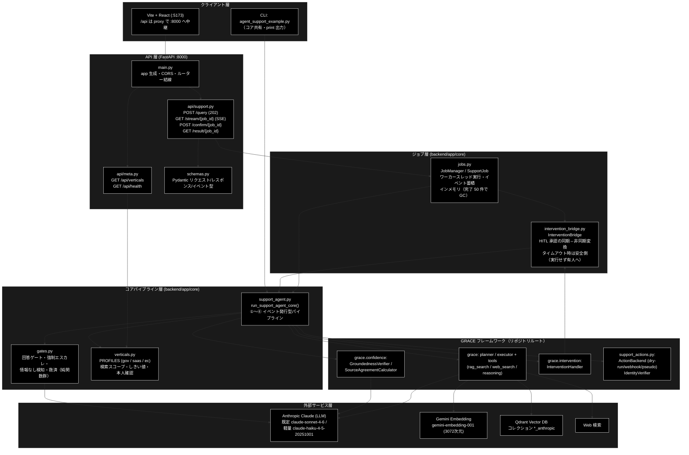
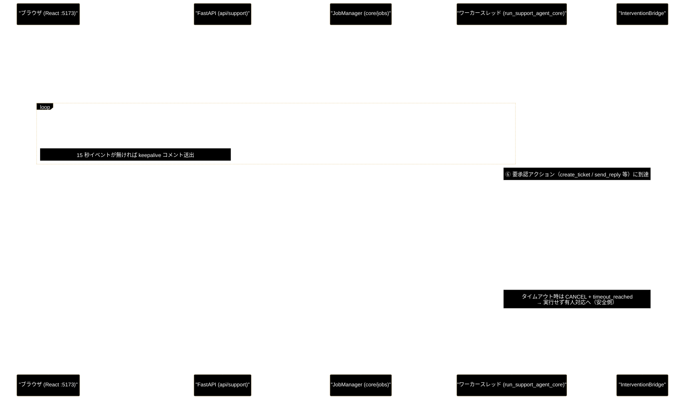

# backend/ ドキュメント整備インデックス

**Version 1.4** | 最終更新: 2026-07-24

> ✅ **本インデックス掲載のモジュール仕様（IPO）9 ファイルはすべて作成済み**（§4 参照）。

`backend/`（GRACE-Support Web API: FastAPI + コアサービス）配下のモジュールについて、
アーキテクチャ・処理フロー・データフローの全体像と、ドキュメント作成対象・出力先・進捗を
一覧化した資料。個別モジュールの詳細ドキュメントは IPO 形式
（`.claude/skills/grace-agent-docs/a_class_method_md_format.md`）で作成し、
**`backend/docs/<module>.md`**（本 README と同じディレクトリ）に配置する。

---

## 目次

0. [アプリの実行方法（クイックスタート）](#0-アプリの実行方法クイックスタート)
1. [アーキテクチャ構成図](#1-アーキテクチャ構成図)
2. [処理フロー（GRACE-Support パイプライン ①〜⑥）](#2-処理フローgrace-support-パイプライン-)
3. [データフロー（Web リクエスト → SSE → HITL 承認）](#3-データフローweb-リクエスト--sse--hitl-承認)
4. [モジュール仕様（IPO 形式）一覧](#4-モジュール仕様ipo-形式一覧)
5. [テスト仕様（SAE 形式）で扱うファイル](#5-テスト仕様sae-形式で扱うファイル)
6. [補足ドキュメント](#6-補足ドキュメント)
7. [backend/ 構成（参考）](#7-backend-構成参考)
8. [変更履歴](#8-変更履歴)

---

## 0. アプリの実行方法（クイックスタート）

GRACE-Support は **FastAPI（バックエンド, :8000）＋ Vite + React（フロントエンド, :5173）** の
2 プロセス構成。**画面は :5173 で開く**（:8000 は API 専用で、`/` は 404 が正常）。

> 📦 初回のインストール・環境構築（uv / Node / Docker / `.env` / トラブルシュート）は
> **[`install_and_setup.md`](./install_and_setup.md)** を参照。以下は導入済み前提の起動手順。

**前提**: リポジトリルートの `.env` に `ANTHROPIC_API_KEY`（LLM）と `GOOGLE_API_KEY`（Embedding）、
Python 3.11+ / `uv` / Node.js / Docker が導入済み。

### 最短（推奨・1 コマンドで起動）

```bash
# 1) Qdrant（ベクトルDB）を起動（別実行・初回/停止後のみ）
docker-compose -f docker-compose/docker-compose.yml up -d

# 2) backend + frontend を 1 コマンドで起動（依存の用意も自動）
./run_dev.sh
#   → backend:  http://localhost:8000（/docs）
#   → frontend: http://localhost:5173  ← ブラウザで開くのはこちら
#   停止は Ctrl+C（両方まとめて停止）
```

`run_dev.sh` は `uv sync --extra dev` → frontend 依存の用意 → uvicorn(:8000) と
Vite(:5173) の同時起動までを行う（リポジトリルートの `run_dev.sh`）。

### 手動（プロセスを分けて起動）

```bash
# 1) Qdrant（ベクトルDB）を起動
docker-compose -f docker-compose/docker-compose.yml up -d

# 2) バックエンド（FastAPI）★リポジトリルートで実行
uv sync --extra dev
uv run uvicorn backend.app.main:app --reload --port 8000
#   → API: http://localhost:8000 、自動ドキュメント: http://localhost:8000/docs

# 3) フロントエンド（別ターミナル）
cd frontend
npm install
npm run dev
#   → UI: http://localhost:5173（/api は Vite proxy で http://127.0.0.1:8000 へ中継）
```

ブラウザで **http://localhost:5173** を開く。フロントの `/api/*` は Vite の proxy
（`frontend/vite.config.ts`）で :8000 の FastAPI へ中継される（SSE 進捗も同経路）。

**CLI 版**（従来どおり・コア共有）:

```bash
uv run python agent_support_example.py --vertical ec "返品したい"
```

**動作確認だけ**したい場合: `http://localhost:8000/api/health`（APIキー設定の有無を返す）。

---

## 1. アーキテクチャ構成図

`backend/app/` は「API 層（FastAPI）→ ジョブ層（スレッド実行・SSE 配信・HITL 仲介）→
コアパイプライン層（判定ロジック）」の 3 層で、LLM 呼び出し・RAG 検索・Web 検索などの
実行部品はリポジトリルートの **GRACE フレームワーク（`grace/`）** と `support_actions.py` に委譲する。



**設計の要点**:

- **CLI と Web は同一コア**を共有する。`run_support_agent_core()` は入出力を
  `emit`（進捗イベント）/ `confirm`（HITL 承認）のコールバックに抽象化しており、
  CLI は print / 自動承認、Web は SSE / `InterventionBridge` を配線するだけの違い。
- **Web 側に自動承認を持ち込まない**（受け入れ条件 §5-2）。副作用のあるアクションは
  必ずフロントの承認（CONFIRM モーダル）を経由し、タイムアウト時は実行せず有人対応へ倒す。
- ジョブ管理はローカル開発用の**インメモリ・シングルプロセス前提**（永続化なし）。

---

## 2. 処理フロー（GRACE-Support パイプライン ①〜⑥）

`run_support_agent_core()`（`core/support_agent.py`）が実行するステップ列。
各ステップは `step`（started / finished / skipped）イベントとして SSE に配信され、
UI のタイムライン表示（STEP_IDS: profile / plan / execute / confidence / gate / web /
no_info / action）と 1:1 に対応する。

```mermaid
flowchart TB
    START(["問い合わせ query"]) --> KEY{"ANTHROPIC_API_KEY<br>設定済み？"}
    KEY -- "未設定" --> ERR["error イベント → 終了"]
    KEY -- "OK" --> S1["S1 profile: 業界プロファイル適用<br>（--vertical 指定時のみ）<br>検索スコープ・しきい値・エスカレ語・本人確認を切替"]
    S1 --> P1["① Plan（planner）<br>クエリを実行計画に分解"]
    P1 --> P2["② Execute（executor + tools）<br>内部RAG検索 → reasoning<br>RAGスコア不足時は web_search を動的挿入"]
    P2 --> P3["③ Confidence（GroundednessVerifier）<br>回答の主張ごとに出典で裏付け検証<br>→ 支持率 support_rate"]
    P3 --> P4["④ 回答ゲート（_answer_gate）<br>支持率 ≥ notify → answer（高信頼）<br>confirm ≤ 支持率 < notify → answer＋未確認注記<br>低信頼/未検証/出典0 → escalate"]
    P4 --> FORCE{"エスカレ語に一致？<br>（二段判定: キーワード<br>→ 意図分類 Haiku）"}
    FORCE -- "一致かつ intent ≠ question" --> FESC["強制エスカレ<br>decision = escalate（⑤スキップ）"]
    FORCE -- "不一致 / FAQ質問（誤検知抑止）" --> RESCUE{"④-救済:<br>escalate だが 矛盾なし・<br>出典あり・実質回答？"}
    RESCUE -- "はい" --> RESC["answer に救済（未確認注記）<br>無駄な Web 二次生成を回避"]
    RESCUE -- "いいえ" --> WEBQ{"decision = escalate<br>かつ use_web？"}
    RESC --> NOINFO
    WEBQ -- "いいえ（answer 確定）" --> NOINFO
    WEBQ -- "はい" --> P5["⑤ Web フォールバック<br>②で Web 検索済みなら回答を再利用し再検証のみ<br>（重複推論を省略）／未使用なら<br>web_search → reasoning → 内部×Web 相互検証"]
    P5 --> NOINFO{"④' 情報なし回答検知<br>（answer のみ。二段判定:<br>定型句候補 or 出典Webのみ<br>→ 実質回答判定 Haiku）"}
    FESC --> NOINFO2["④' はスキップ（escalate のため）"]
    NOINFO -- "no_info（実質情報ゼロ）" --> TOESC["escalate に倒す<br>（no_info_detected=True）"]
    NOINFO -- "answered（実質回答）" --> P6
    NOINFO2 --> P6
    TOESC --> P6["⑥ Action（do_action 時）<br>_decide_action: escalate → escalate_to_human（承認不要）<br>answer → action_map の二段判定で起票/返信"]
    P6 --> IDCHK{"本人確認必須？<br>（require_identity）"}
    IDCHK -- "未確認" --> NOEXEC["実行せず有人対応へ引き継ぎ"]
    IDCHK -- "確認済み / 不要" --> HITL{"requires_confirmation？"}
    HITL -- "はい" --> CONFIRM["HITL CONFIRM<br>（Web: フロント承認待ち /<br>タイムアウト → 実行せず有人へ）"]
    HITL -- "いいえ（escalate_to_human）" --> EXEC
    CONFIRM -- "承認" --> EXEC["ActionBackend で実行<br>（dry-run / webhook / pseudo）"]
    CONFIRM -- "拒否 / タイムアウト" --> NOEXEC
    EXEC --> DONE(["result イベント（SupportResult）"])
    NOEXEC --> DONE
classDef default fill:#000,stroke:#fff,color:#fff
classDef subgraphStyle fill:#1a1a1a,stroke:#fff,color:#fff
class START,KEY,ERR,S1,P1,P2,P3,P4,FORCE,FESC,RESCUE,RESC,WEBQ,P5,NOINFO,NOINFO2,TOESC,P6,IDCHK,NOEXEC,HITL,CONFIRM,EXEC,DONE default
```



**判定ロジックの要点**（詳細は [`core_gates.md`](./core_gates.md) / [`core_support_agent.md`](./core_support_agent.md)）:

| 機構 | 目的 | 実装 |
|------|------|------|
| 回答ゲート | 支持率と出典数で answer / escalate を判定（プロファイルでしきい値上書き可） | `_answer_gate` |
| 強制エスカレ（二段判定） | エスカレ語（例: 障害・返金・訴訟）の一致 → 意図分類（Haiku）で FAQ 質問の誤検知を抑止 | `_should_force_escalate` + `create_intent_classifier` |
| ④-救済 | 「肯定の裏付けが弱いだけで矛盾なし・出典付き」の内部回答を escalate から救い、誤エスカレと無駄な Web 二次生成を防ぐ | `_should_rescue_unaffirmed` |
| ⑤ Web フォールバック | 内部 escalate 時のみ Web で裏取り。② が Web 検索済みなら回答を再利用して再検証だけ行う（1 ケース十数秒〜の短縮） | `run_support_agent_core` 内 |
| ④' 情報なし検知（二段判定） | 誠実な「見つかりませんでした」型回答（ゲートを answer で通過してしまう）を実質回答判定（Haiku）で検出し有人へ | `_detect_no_info_answer` + `create_no_info_judge` |
| ⑥ Action | 本人確認 → HITL CONFIRM → バックエンド実行。escalate 時の `escalate_to_human` は承認不要で直接実行（引き継ぎの取りこぼし防止） | `_decide_action` + `_perform_action` |

---

## 3. データフロー（Web リクエスト → SSE → HITL 承認）

1 クエリ = 1 ジョブ。パイプラインはワーカースレッドで実行され、進捗は `SupportJob.events`
に蓄積される。SSE は**常に先頭からリプレイ**されるため、再接続・途中購読でも取りこぼさない。



**データの流れ・形式**（詳細は [`schemas.md`](./schemas.md) / [`core_jobs.md`](./core_jobs.md) /
[`core_intervention_bridge.md`](./core_intervention_bridge.md)）:

1. **入力**: `QueryRequest`（CLI 引数と 1:1。`vertical` は `gov`/`saas`/`ec`、既定 `dry_run=True`）
2. **進捗**: `SupportEvent`（type = step / log / intervention / result / error）に
   `seq`（通し番号）と `ts`（時刻）を付与した JSON を SSE（`data:` 行・イベント名なし）で配信
3. **HITL**: `intervention` イベント（waiting）→ `POST /confirm` → resolved / timeout。
   応答は `threading.Event` でワーカースレッドへ同期的に返る
4. **出力**: `SupportResult`（answer / citations / groundedness / decision / warning /
   used_web / source_agreement / action_result / KPI メタデータ等）を `result` イベントと
   `GET /result/{job_id}` の両方で取得可能
5. **エラー**: APIキー未設定・Qdrant 未起動・LLM タイムアウト等は `error` イベントとして
   配信され、ジョブは `failed` で終了する

---

## 4. モジュール仕様（IPO 形式）一覧

- **対象**: `backend/app/` 配下の Python モジュール（FastAPI 起動・API 層・コア層・スキーマ）。
- **フォーマット**: IPO 形式（`a_class_method_md_format.md`）。
  単体テストは SAE 形式（`a_test_md_format.md`、`grace-agent-tests` スキル担当・§5）。
- **出力先**: **`backend/docs/<module>.md`**（本 README と同じディレクトリ）。
- **技術スタック表記**: LLM = Anthropic Claude（既定 `claude-sonnet-4-6`、
  軽量判定 `claude-haiku-4-5-20251001`）／ Embedding = Gemini（`gemini-embedding-001`, 3072次元）。

| # | ソースファイル | 行数 | クラス/関数 | 役割 | ドキュメント | 状態 |
|---|---|---:|---:|---|---|:--:|
| 1 | `backend/app/main.py` | 49 | 0（モジュール構成のみ） | FastAPI 起動・CORS・ルーター結線 | [`main.md`](./main.md) | ✅ |
| 2 | `backend/app/schemas.py` | 106 | 9 | Pydantic リクエスト/レスポンス/イベント型 | [`schemas.md`](./schemas.md) | ✅ |
| 3 | `backend/app/api/support.py` | 83 | 4 | `/api/support/*`（query / stream(SSE) / confirm / result） | [`api_support.md`](./api_support.md) | ✅ |
| 4 | `backend/app/api/meta.py` | 42 | 2 | `/api/verticals`・`/api/health` | [`api_meta.md`](./api_meta.md) | ✅ |
| 5 | `backend/app/core/support_agent.py` | 538 | 5 | ★コア（①〜⑥ イベント発行型パイプライン） | [`core_support_agent.md`](./core_support_agent.md) | ✅ |
| 6 | `backend/app/core/gates.py` | 374 | 14 | 回答ゲート/強制エスカレ/情報なし検知/救済（純関数群） | [`core_gates.md`](./core_gates.md) | ✅ |
| 7 | `backend/app/core/jobs.py` | 168 | 3 | ジョブ管理（インメモリ・スレッド実行・SSE 供給） | [`core_jobs.md`](./core_jobs.md) | ✅ |
| 8 | `backend/app/core/intervention_bridge.py` | 125 | 2 | HITL ↔ フロント承認の非同期ブリッジ | [`core_intervention_bridge.md`](./core_intervention_bridge.md) | ✅ |
| 9 | `backend/app/core/verticals.py` | 84 | 2 | VerticalProfile 定義（gov / saas / ec） | [`core_verticals.md`](./core_verticals.md) | ✅ |

**ドキュメント不要（対象外）**: いずれも空ファイル（0 行）—
`backend/__init__.py`、`backend/app/__init__.py`、`backend/app/api/__init__.py`、
`backend/app/core/__init__.py`、`backend/tests/__init__.py`。

---

## 5. テスト仕様（SAE 形式）で扱うファイル

> 本インデックスの担当外（`grace-agent-tests` スキル・別フォーマット）。参考として掲載。
> テストはスタブベースで**実 API キー・Qdrant 不要**（`conftest.py` 参照）。

| ソースファイル | 行数 | 内容 |
|---|---:|---|
| `backend/tests/test_support_agent_core.py` | 235 | CLI とコアの同等性テスト |
| `backend/tests/test_api.py` | 163 | API エンドポイントのテスト |
| `backend/tests/test_intervention_bridge.py` | 105 | HITL ブリッジのテスト |
| `backend/tests/conftest.py` | 119 | pytest フィクスチャ（スタブベース・API キー不要） |

---

## 6. 補足ドキュメント

モジュール仕様（IPO・§4）以外に、`backend/docs/` には以下の横断ドキュメントがある。

| ファイル | 内容 |
|---|---|
| [`install_and_setup.md`](./install_and_setup.md) | インストール・環境設定ガイド（uv / Node / Docker / `.env` / トラブルシュート） |
| [`react_processing_flow.md`](./react_processing_flow.md) | `run_dev.sh` 起点の React ↔ FastAPI 処理フロー詳細 |
| [`confidence_flow_grace_vs_backend.md`](./confidence_flow_grace_vs_backend.md) | 信頼度測定フローの比較（`grace/` 自律エージェント本体 vs `backend/app/` Web 判定層） |

---

## 7. backend/ 構成（参考）

```
backend/
├── app/
│   ├── main.py                     # FastAPI 起動・CORS・ルーター結線
│   ├── schemas.py                  # Pydantic: リクエスト/レスポンス/イベント
│   ├── api/
│   │   ├── support.py              # POST /api/support/query, GET /stream(SSE), POST /confirm, GET /result
│   │   └── meta.py                 # GET /api/verticals, GET /api/health
│   └── core/
│       ├── support_agent.py        # ★コアサービス（①〜⑥ イベント発行型パイプライン）
│       ├── gates.py                # 回答ゲート/強制エスカレ/情報なし検知/救済（純関数）
│       ├── intervention_bridge.py  # HITL ↔ フロント承認の非同期ブリッジ
│       ├── jobs.py                 # ジョブ管理（インメモリ・スレッド実行）
│       └── verticals.py            # VerticalProfile 定義（gov / saas / ec）
├── docs/                           # ← 本 README とモジュールドキュメント（IPO形式）の配置先
└── tests/                          # pytest（スタブベース・API キー不要）
```

---

## 8. 変更履歴

| バージョン | 変更内容 |
|-----------|---------|
| 1.0 | 初版作成（backend/ ドキュメント整備の対象一覧・出力先・進捗をまとめたインデックス。`main.py` を作成済としてマーク） |
| 1.1 | モジュール仕様（IPO）残り 8 ファイル（schemas / api_support / api_meta / core_support_agent / core_gates / core_jobs / core_intervention_bridge / core_verticals）を作成し、状態列を全て「作成済」に更新 |
| 1.2 | 先頭に「§0 アプリの実行方法（クイックスタート）」を追加し、`install_and_setup.md`（インストール・環境設定）へのリンクを追記 |
| 1.3 | §0 に「最短（1 コマンド `./run_dev.sh`）」の起動方法を追加（backend + frontend を一括起動） |
| 1.4 | 実コード再読による全面最新化: §1 アーキテクチャ構成図（6 層）・§2 処理フロー（パイプライン ①〜⑥＋二段判定・救済・HITL）・§3 データフロー（SSE / HITL 承認のシーケンス図）を新設。ドキュメント出力先の誤記を実配置（`backend/docs/`）に修正し、各ドキュメントへのリンクを追加。行数を実測に更新（support_agent 538 / gates 374 / test_support_agent_core 235）。補足ドキュメント一覧（§6）を追加し、目次を整備 |
