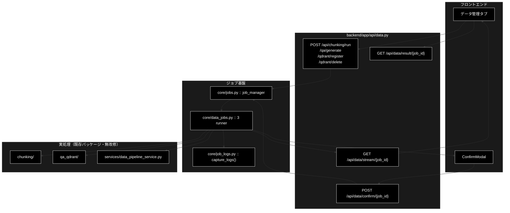

# api/data.py - データ準備ジョブ API ドキュメント

**Version 1.2** | 最終更新: 2026-09-12

> **参考ドキュメント**
> - [`backend/docs/core_data_jobs.md`](./core_data_jobs.md) — 各ジョブの runner 実装
> - [`backend/docs/core_jobs.md`](./core_jobs.md) — ジョブ基盤（`JobManager` / SSE / HITL ブリッジ）
> - [`backend/docs/data_pipeline.md`](./data_pipeline.md) — データ準備パイプライン全体の設計

---

## 目次

- [概要](#概要)
- [1. アーキテクチャ構成図](#1-アーキテクチャ構成図)
- [2. エンドポイント一覧](#2-エンドポイント一覧)
- [3. エンドポイント IPO 詳細](#3-エンドポイント-ipo-詳細)
  - [使用例](#31-使用例)
- [4. 設定・定数](#4-設定定数)
- [5. 使用例](#5-使用例)
- [6. 変更履歴](#6-変更履歴)

---

## 概要

`backend/app/api/data.py` は、データ準備パイプライン（チャンク化 / Q/A 生成 / Qdrant 登録 / コレクション削除）を
**非同期ジョブとして起動し、SSE で進捗を配信する** API 層である。

`api/support.py` / `api/review.py` と**構造は同一**。違うのはジョブのパラメータ型と結果の形だけで、
ジョブ基盤・SSE・HITL ブリッジは `core/jobs.py` をそのまま使う。

### 主な責務

- 4 種のジョブ（チャンク化 / Q/A 生成 / 登録 / 削除）を `job_manager.start()` で起動し `202 Accepted` を返す
- 進捗を SSE（`text/event-stream`）で逐次配信する
- HITL CONFIRM への応答（承認 / 拒否）を注入する
- ジョブの状態と結果をポーリングで返す（SSE のフォールバック）

### 各責務対応のモジュール

| # | 責務 | 対応モジュール | 説明 |
|---|------|--------------|------|
| 1 | ジョブ起動 | `core/jobs.py` | `job_manager.start(params)` が params の型から runner を解決 |
| 2 | 実処理 | `core/data_jobs.py` | `_chunking_runner` / `_qa_runner` / `_register_runner` / `_delete_runner` |
| 3 | 進捗の横取り | `core/job_logs.py` | 既存パッケージの `logging` 出力を log イベントへ転送 |
| 4 | リクエスト／レスポンス型 | `backend/app/schemas.py` | `ChunkingRequest` / `QaGenerationRequest` / `RegisterRequest` / `DeleteCollectionsRequest` ほか |

### 主要機能一覧

| 機能 | 説明 |
|------|------|
| `run_chunking(request)` | チャンク化ジョブを起動（承認なし） |
| `generate_qa(request)` | チャンク済み CSV から Q/A を生成（承認なし） |
| `register_collection(request)` | Q/A CSV を Qdrant へ登録（`recreate=True` のときだけ承認） |
| `delete_collections(request)` | コレクション削除（**常に**承認） |
| `stream_events(job_id)` | 進捗を SSE で配信（4 種で共通） |
| `confirm_intervention(job_id, request)` | HITL CONFIRM への応答を注入（4 種で共通） |
| `get_result(job_id)` | ジョブの状態・結果を返す（ポーリング用） |

---

## 1. アーキテクチャ構成図



---

## 2. エンドポイント一覧

| メソッド | パス | ステータス | レスポンス | CONFIRM |
|---|---|---|---|---|
| POST | `/api/chunking/run` | 202 | `QueryAccepted` | なし（非破壊） |
| POST | `/api/qa/generate` | 202 | `QueryAccepted` | なし（非破壊） |
| POST | `/api/qdrant/register` | 202 | `QueryAccepted` | `recreate=True` のときだけ |
| POST | `/api/qdrant/delete` | 202 | `QueryAccepted` | **常に** |
| GET | `/api/data/stream/{job_id}` | 200 | `text/event-stream` | — |
| POST | `/api/data/confirm/{job_id}` | 200 | `ConfirmResponse` | — |
| GET | `/api/data/result/{job_id}` | 200 | `DataJobStatusResponse` | — |

> 📝 **SSE と HITL 応答は 4 種で共通のエンドポイントにまとめてある。**
> ジョブ種別ごとに分けても中身が同じになるため。種別は `job.kind` が持つ。

> ⚠️ **`backend.app.core.data_jobs` の import には副作用がある。**
> import 時に `register_runner()` が 4 件走る。パラメータ型を使う以上この import は
> 必ず発生するので、**登録漏れは構造的に起きない**（`review_agent.py` と同じ方式）。

---

## 3. エンドポイント IPO 詳細

### 3.1 使用例

#### 3.1.1 基本的なワークフロー（入力ファイルの確認 → チャンク化）

> 📌 **`TestClient` を使うとサーバを起動せずに試せる**（実 API キー・Qdrant 不要の範囲）。
> 実サーバへ投げるなら `./run_dev.sh` の後に `curl http://localhost:8000/...`。

```python
from fastapi.testclient import TestClient
from backend.app.main import app

c = TestClient(app)

# 1. 入力候補を見る（許可ディレクトリの外は列挙も取得もできない）
print(c.get("/api/files").json())

# 2. チャンク化ジョブを起動する（202 + job_id）
r = c.post("/api/chunking/run", json={"input_file": "OUTPUT/cc_news_1per.csv"})
job_id = r.json()["job_id"]

# 3. 進捗を SSE で購読し、4. 結果を取る
#    GET /api/data/stream/{job_id} → GET /api/data/result/{job_id}

# 出力例（入力ディレクトリが空の環境で実測）:
# {'dir': 'OUTPUT', 'allowed_dirs': ['OUTPUT', 'output_chunked', 'qa_output', 'datasets'], 'files': []}
```

> ⚠️ **`allowed_dirs` の外は弾かれる。** パスはホワイトリストで検証しており、
> `../` を含む指定は `PathNotAllowedError` になる（`services/data_pipeline_service.py`）。

#### 3.1.2 破壊的操作は CONFIRM を通る

削除は常に、登録は `recreate=True` のときだけ承認待ちになる。

```python
from fastapi.testclient import TestClient
from backend.app.main import app

c = TestClient(app)

# 1. 削除ジョブを起動する
r = c.post("/api/qdrant/delete", json={"collections": ["demo_anthropic"]})
job_id = r.json()["job_id"]

# 2. SSE に intervention イベントが流れるので、intervention_id を取り承認する
c.post(f"/api/data/confirm/{job_id}",
       json={"intervention_id": "...", "approve": True})

# 3. 承認しなければ削除は実行されない（タイムアウトは安全側＝実行しない）
print(c.get("/api/data/result/unknown").status_code)

# 出力例:
# 404
```


### 3.2 `run_chunking`

```python
@router.post("/chunking/run", response_model=QueryAccepted, status_code=202)
def run_chunking(request: ChunkingRequest) -> QueryAccepted
```

| 項目 | 内容 |
|------|------|
| **Input** | `ChunkingRequest`（`input_file` / `output_dir` / `model` / `workers` / `block_size` / `text_column` / `max_rows` / `combine_rows` / `resume` / `verbose`） |
| **Process** | `ChunkingParams` へ詰め替えて `job_manager.start()` |
| **Output** | `QueryAccepted(job_id, stream_url)` — `202 Accepted` |

> 📝 **入力ファイルの検証はここでしない。** 許可ディレクトリ外・不在なら runner 側が
> error イベントを流してジョブが失敗する。400 を返さないのは、**起動と検証の責務を
> runner に寄せて 4 種の API を同じ形にするため**。

### 3.3 `generate_qa`

```python
@router.post("/qa/generate", response_model=QueryAccepted, status_code=202)
def generate_qa(request: QaGenerationRequest) -> QueryAccepted
```

| 項目 | 内容 |
|------|------|
| **Input** | `QaGenerationRequest`（`input_file` / `output_dir` / `model` / `max_docs` / `use_celery` / `concurrency` / `batch_chunks` / `analyze_coverage` / `verbose`） |
| **Process** | `QaGenerationParams` へ詰め替えて `job_manager.start()` |
| **Output** | `QueryAccepted(job_id, stream_url)` — `202 Accepted` |

> 📝 入力は**チャンク済み CSV**（`/api/chunking/run` の出力）。出力の Q/A CSV は
> そのまま `/api/qdrant/register` の入力になる。パイプラインの流れは
> **チャンク化 → Q/A 生成 → Qdrant 登録**。

> ⚠️ **`use_celery=True` を渡すなら Celery ワーカーが起動していること。**
> 落ちている場合はジョブが error イベントで失敗する。起動時に弾かないのは、
> ワーカーの生死が起動から実行までの間に変わりうるため（実行時に確かめる）。

### 3.4 `register_collection`

```python
@router.post("/qdrant/register", response_model=QueryAccepted, status_code=202)
def register_collection(request: RegisterRequest) -> QueryAccepted
```

| 項目 | 内容 |
|------|------|
| **Input** | `RegisterRequest`（`input_file` / `collection` / `recreate` / `batch_size` / `embed_workers` / `text_col` / `domain` / `max_docs` / `provider` / `normalize_filename` / `create_ui_csv` / `ui_output_dir` / `verbose`） |
| **Process** | `RegisterParams` へ詰め替えて `job_manager.start()` |
| **Output** | `QueryAccepted(job_id, stream_url)` |

> ⚠️ **`recreate=True` のときだけ intervention イベントが流れる。**
> 既存コレクションを削除して作り直すため。フロントは既存の `ConfirmModal` で承認を返す。

> 📝 **入力は「既に作られた Q/A CSV」である。** Q/A 生成そのものは UI に無く CLI のみ。

### 3.5 `delete_collections`

```python
@router.post("/qdrant/delete", response_model=QueryAccepted, status_code=202)
def delete_collections(request: DeleteCollectionsRequest) -> QueryAccepted
```

| 項目 | 内容 |
|------|------|
| **Input** | `DeleteCollectionsRequest`（`collections: List[str]` / `verbose`） |
| **Process** | `DeleteParams` へ詰め替えて `job_manager.start()` |
| **Output** | `QueryAccepted(job_id, stream_url)` |

> ⚠️ **HTTP の `DELETE` メソッドにしていない。**
> 承認を経ずに消える経路を作らないため。削除は不可逆なので、
> **必ず intervention → 承認 → 実行**を通す。

### 3.6 `stream_events`

```python
@router.get("/data/stream/{job_id}")
def stream_events(job_id: str) -> StreamingResponse
```

| 項目 | 内容 |
|------|------|
| **Input** | `job_id` |
| **Process** | `job_manager.get(job_id)`（無ければ **404**）。`job.stream_events()` を回し、`None` は `": keepalive\n\n"`、それ以外は `data: {json}\n\n` として yield。最後に `done_event(job)`（`type` / `status` / `ts` / `started_at`）を送る |
| **Output** | `StreamingResponse`（`media_type="text/event-stream"`、`Cache-Control: no-cache` / `X-Accel-Buffering: no`） |

> 📝 **形式は Support / Review と完全に同一。** 既存パッケージの `logging` 出力は
> `core/job_logs.py` が横取りして log イベントとして流れてくる。
> **イベントは常に先頭からリプレイされる**ため、再接続しても取りこぼさない。

> 📝 `X-Accel-Buffering: no` は nginx 等のリバースプロキシがバッファリングして
> SSE が届かなくなるのを防ぐため。

### 3.7 `confirm_intervention`

```python
@router.post("/data/confirm/{job_id}", response_model=ConfirmResponse)
def confirm_intervention(job_id: str, request: ConfirmRequest) -> ConfirmResponse
```

| 項目 | 内容 |
|------|------|
| **Input** | `job_id`、`ConfirmRequest(intervention_id, approve)` |
| **Process** | `job_manager.confirm(job_id, intervention_id, approve)`。戻り値が `"not_found"` なら **404** |
| **Output** | `ConfirmResponse(status)` |

> ⚠️ **拒否・タイムアウトの場合、削除も再作成も実行されない**（安全側）。

### 3.8 `get_result`

```python
@router.get("/data/result/{job_id}", response_model=DataJobStatusResponse)
def get_result(job_id: str) -> DataJobStatusResponse
```

| 項目 | 内容 |
|------|------|
| **Input** | `job_id` |
| **Process** | `job_manager.get(job_id)`（無ければ **404**） |
| **Output** | `DataJobStatusResponse(job_id, kind, status, result)` |

> 📝 **`result` は素の dict のまま返す。** 結果の形はジョブ種別で違うため、
> `kind`（`"chunking"` / `"register"` / `"delete"`）で判別させる。

---

## 4. 設定・定数

| 名前 | 値 | 説明 |
|---|---|---|
| `router` | `APIRouter(prefix="/api", tags=["data"])` | 全エンドポイントの接頭辞 |
| `_STREAM_URL` | `"/api/data/stream/{job_id}"` | 3 種で共通の SSE URL |

---

## 5. 使用例

```bash
# ① チャンク化を起動
curl -X POST http://localhost:8000/api/chunking/run \
  -H 'Content-Type: application/json' \
  -d '{"input_file": "OUTPUT/cc_news_1per.csv", "output_dir": "output_chunked"}'
# → {"job_id": "...", "stream_url": "/api/data/stream/..."}

# ② 進捗を SSE で受ける
curl -N http://localhost:8000/api/data/stream/<job_id>

# ③ CONFIRM が来たら承認を返す（削除・recreate 時）
curl -X POST http://localhost:8000/api/data/confirm/<job_id> \
  -H 'Content-Type: application/json' \
  -d '{"intervention_id": "...", "approve": true}'

# ④ 結果を取る（SSE を使わない場合）
curl http://localhost:8000/api/data/result/<job_id>
```

---

## 6. 変更履歴

| バージョン | 変更内容 |
|-----------|---------|
| 1.2 | **§3.1「使用例」を新設**（2026-09-15）。ドキュメント規約 `a_class_method_md_format.md` §6.1 が IPO 詳細セクションの冒頭に必須としている代表ワークフローが欠落していた。入力候補の確認 → チャンク化ジョブ起動、破壊的操作の CONFIRM 経路の 2 本を追加し、**実行して出力を確認した**（外部依存が要る例はその旨を明記）。旧 §3.1〜§3.7 は §3.2〜§3.8 へ繰り下げ |
| 1.0 | 初版作成。`backend/app/api/data.py`（160 行）の 6 エンドポイントを IPO 形式で記述。3 種のジョブと CONFIRM の要否、SSE / HITL を共通エンドポイントにまとめた理由、`DELETE` メソッドを使わない理由、入力検証を runner に寄せた理由を実コードのコメントから起こして記載 |
| 1.1 | **`POST /api/qa/generate` を追加**（`QaGenerationRequest` → `QaGenerationParams`）。ジョブは 4 種になり、SSE / HITL の共通エンドポイントもそのまま 4 種で共有する。§3 の節番号を繰り下げ |
