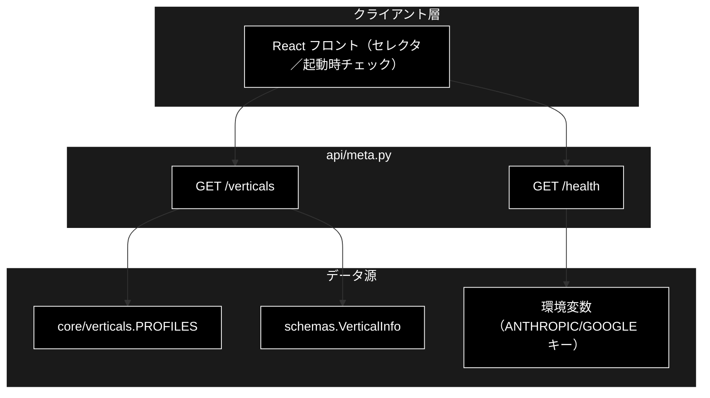
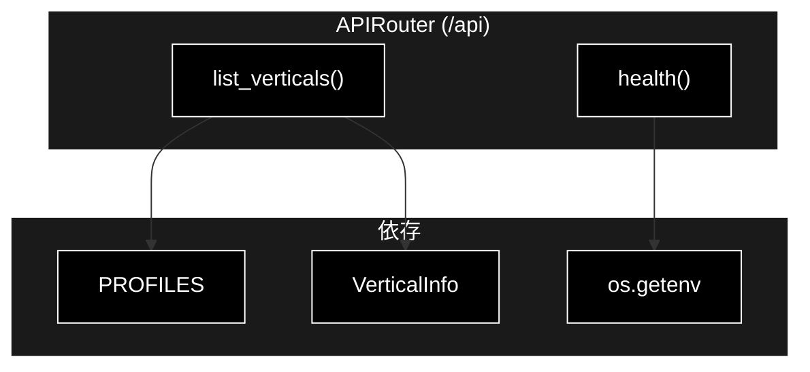
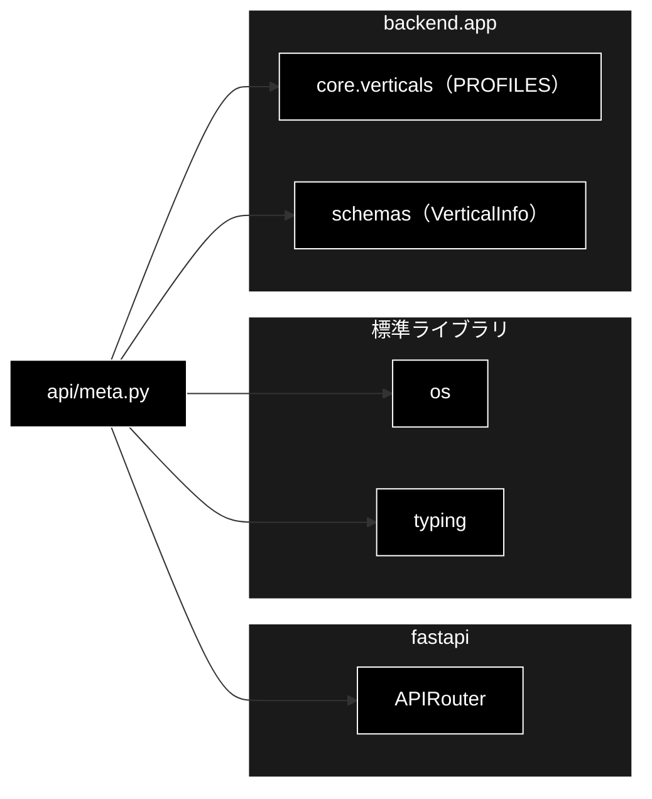

# api/meta.py - メタ情報 API ドキュメント

**Version 1.0** | 最終更新: 2026-07-15

---

## 目次

1. [概要](#概要)
2. [アーキテクチャ構成図](#1-アーキテクチャ構成図)
3. [モジュール構成図](#2-モジュール構成図)
4. [クラス・関数一覧表](#3-クラス関数一覧表)
5. [クラス・関数 IPO詳細](#4-クラス関数-ipo詳細)
6. [使用例](#5-使用例)
7. [エクスポート](#6-エクスポート)
8. [変更履歴](#7-変更履歴)
9. [付録: 依存関係図](#付録-依存関係図)

---

## 概要

`backend/app/api/meta.py` は、GRACE-Support の**メタ情報 API**（業界プロファイル一覧・
ヘルスチェック）を提供する FastAPI ルーターモジュール。UI のプロファイルセレクタ用に
組み込み業界プロファイル（`PROFILES`）を返す `GET /api/verticals` と、稼働確認・実行前提
（APIキー設定有無）を返す `GET /api/health` の 2 エンドポイントを定義する。

LLM は Anthropic Claude（`ANTHROPIC_API_KEY`）、Embedding は Gemini（`GOOGLE_API_KEY`）を
使うため、health は両キーの設定有無を返す。

### 主な責務

- 組み込み業界プロファイル一覧の提供（`GET /api/verticals`）
- 稼働確認と API キー設定有無の可視化（`GET /api/health`）

### 各責務対応のモジュール

| # | 責務 | 対応モジュール | 説明 |
|---|------|--------------|------|
| 1 | プロファイル一覧 | `api/meta.py` → `core/verticals.py` | `PROFILES` を `VerticalInfo` へ整形 |
| 2 | ヘルスチェック | `api/meta.py` | `os.getenv` でキー設定有無を返す |
| 3 | 出力スキーマ | `backend/app/schemas.py` | `VerticalInfo` |

### 主要機能一覧

| 機能 | 説明 |
|------|------|
| `router` | `APIRouter(prefix="/api")` |
| `list_verticals()` | GET /verticals（業界プロファイル一覧） |
| `health()` | GET /health（稼働確認＋APIキー有無） |

---

## 1. アーキテクチャ構成図

### 1.1 システム全体構成



### 1.2 データフロー

1. フロントが起動時に `GET /api/verticals` でプロファイル一覧を取得しセレクタを構築
2. `GET /api/health` で稼働確認と APIキー設定有無を確認（未設定なら注意表示）

---

## 2. モジュール構成図

### 2.1 内部モジュール構成



### 2.2 外部依存関係

| ライブラリ | バージョン | 用途 |
|-----------|-----------|------|
| `fastapi` | >=0.115.6 | `APIRouter` |
| `os` | 標準 | 環境変数（APIキー）の参照 |
| `typing` | 標準 | `Dict` / `List` |

### 2.3 内部依存モジュール

| モジュール | 用途 |
|-----------|------|
| `backend.app.core.verticals` | `PROFILES`（業界プロファイル辞書） |
| `backend.app.schemas` | `VerticalInfo`（出力スキーマ） |

---

## 3. クラス・関数一覧表

### 3.1 クラス一覧

本モジュールにクラス定義はない（`router` はモジュールレベルの `APIRouter`）。

### 3.2 関数一覧（エンドポイント）

| 関数名 | メソッド/パス | 概要 |
|-------|--------------|------|
| `list_verticals()` | GET /verticals | 組み込み業界プロファイルを返す |
| `health()` | GET /health | 稼働確認とAPIキー設定有無を返す |

---

## 4. クラス・関数 IPO詳細

### 4.1 エンドポイント関数

#### `list_verticals`

**概要**: UI のプロファイルセレクタ用に、組み込み業界プロファイル（`PROFILES`）を `VerticalInfo`
のリストで返す。

```python
@router.get("/verticals", response_model=List[VerticalInfo])
def list_verticals() -> List[VerticalInfo]
```

| パラメータ | 型 | デフォルト | 説明 |
|------------|------|-----------|------|
| （なし） | - | - | 引数なし |

| 項目 | 内容 |
|------|------|
| **Input** | なし |
| **Process** | `PROFILES.items()` を走査し、各 `VerticalProfile` を `VerticalInfo`（id/name/collections/escalate_keywords/action_map/require_identity/notify_th/confirm_th/prompt_addendum）へ整形 |
| **Output** | `List[VerticalInfo]`: 業界プロファイル一覧 |

**戻り値例**:
```python
[
    {"id": "gov", "name": "自治体",
     "collections": ["gov_faq_anthropic", "gov_laws_anthropic", "wikipedia_ja"],
     "escalate_keywords": ["法的", "訴訟", "減免", "個別", "例外", "不服"],
     "action_map": {"申請": "send_reply"}, "require_identity": false,
     "notify_th": 0.8, "confirm_th": 0.5, "prompt_addendum": "条例・公式案内に基づき…"},
    {"id": "saas", "name": "SaaS", ...},
    {"id": "ec", "name": "EC", "require_identity": true, ...}
]
```

```python
# 使用例
GET /api/verticals
# → [{"id": "gov", ...}, {"id": "saas", ...}, {"id": "ec", ...}]
```

#### `health`

**概要**: 稼働確認と実行前提（APIキー設定有無）を可視化する。

```python
@router.get("/health")
def health() -> Dict[str, object]
```

| パラメータ | 型 | デフォルト | 説明 |
|------------|------|-----------|------|
| （なし） | - | - | 引数なし |

| 項目 | 内容 |
|------|------|
| **Input** | なし |
| **Process** | `os.getenv("ANTHROPIC_API_KEY")` / `os.getenv("GOOGLE_API_KEY")` の有無を bool 化して返す |
| **Output** | `Dict[str, object]`: `{status, anthropic_api_key, google_api_key}` |

**戻り値例**:
```python
{"status": "ok", "anthropic_api_key": true, "google_api_key": false}
```

```python
# 使用例
GET /api/health
# → {"status": "ok", "anthropic_api_key": true, "google_api_key": true}
```

---

## 5. 使用例

### 5.1 基本的なワークフロー（フロント起動時）

```text
1. GET /api/health
   → {"status": "ok", "anthropic_api_key": true, "google_api_key": true}
   （いずれか false なら「.env にキー未設定」を UI で警告）

2. GET /api/verticals
   → [{"id": "gov", ...}, {"id": "saas", ...}, {"id": "ec", ...}]
   （プロファイルセレクタの選択肢に反映）
```

---

## 6. エクスポート

`__all__` 定義はない。`main.py` が `meta.router` を `include_router()` する。

```python
router  # APIRouter(prefix="/api", tags=["meta"])
```

---

## 7. 変更履歴

| バージョン | 変更内容 |
|-----------|---------|
| 1.0 | 初版作成（GET /verticals・GET /health の IPO ドキュメント） |

---

## 付録: 依存関係図


