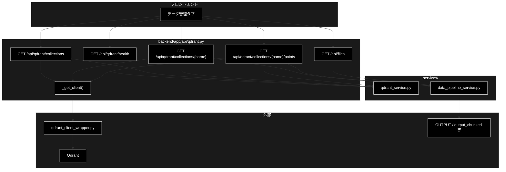

# api/qdrant.py - Qdrant 参照 API ドキュメント

**Version 1.0** | 最終更新: 2026-09-04

> **参考ドキュメント**
> - [`backend/docs/api_data.md`](./api_data.md) — 登録・削除（副作用のある系）のジョブ API
> - [`backend/docs/data_pipeline.md`](./data_pipeline.md) — データ準備パイプライン全体の設計

---

## 目次

- [概要](#概要)
- [1. アーキテクチャ構成図](#1-アーキテクチャ構成図)
- [2. エンドポイント一覧](#2-エンドポイント一覧)
- [3. 関数 IPO 詳細](#3-関数-ipo-詳細)
- [4. Qdrant 未起動時の扱い](#4-qdrant-未起動時の扱い)
- [5. 使用例](#5-使用例)
- [6. 変更履歴](#6-変更履歴)

---

## 概要

`backend/app/api/qdrant.py` は、Qdrant コレクションの**参照 API（読み取り専用）**である。

チャンキング → Q/A 生成 → Qdrant 登録 というデータ準備パイプラインのうち、
**副作用のない参照系**だけをここに置く。登録・削除はジョブ基盤（`core/jobs.py`）と
HITL CONFIRM を経由するため、別ルータ（[`api/data.py`](./api_data.md)）になる。

実処理は `services/qdrant_service.py` が持つ。本モジュールは
`services/data_pipeline_service.py` を挟んで **JSON 化するだけの薄い層**である。

### 主な責務

- Qdrant の稼働確認（**落ちていても 200 を返す**）
- コレクション一覧・詳細・ポイントのプレビュー
- 入力ファイル候補の列挙（チャンキング・登録の入力選択用）

### 各責務対応のモジュール

| # | 責務 | 対応モジュール |
|---|------|--------------|
| 1 | 稼働確認 | `services/qdrant_service.py` :: `QdrantHealthChecker` |
| 2 | コレクション取得 | `services/qdrant_service.py` :: `get_all_collections` / `QdrantDataFetcher` |
| 3 | 整形（DataFrame → JSON） | `services/data_pipeline_service.py` :: `dataframe_to_records` / `collection_columns` |
| 4 | 入力ファイル列挙 | `services/data_pipeline_service.py` :: `list_input_files` / `ALLOWED_INPUT_DIRS` |
| 5 | クライアント生成 | `qdrant_client_wrapper.py` :: `get_qdrant_client` |

### 主要機能一覧

| 機能 | 説明 |
|------|------|
| `_get_client()` | Qdrant クライアントを取得。接続不可なら **503** |
| `qdrant_health()` | 稼働確認。**落ちていても 200**（本文の `available` で判定） |
| `list_collections()` | コレクション一覧（名前・件数・ステータス） |
| `get_collection(name)` | 詳細（ベクトル設定＋データ元の集計） |
| `get_collection_points(name, limit)` | ポイントのプレビュー |
| `list_files(dir)` | 入力ファイル候補の列挙（許可ディレクトリ内のみ） |

---

## 1. アーキテクチャ構成図



---

## 2. エンドポイント一覧

| メソッド | パス | レスポンス | Qdrant 停止時 |
|---|---|---|---|
| GET | `/api/qdrant/health` | `QdrantHealth` | **200**（`available: false`） |
| GET | `/api/qdrant/collections` | `List[CollectionInfo]` | 503 |
| GET | `/api/qdrant/collections/{name}` | `CollectionDetail` | 503 |
| GET | `/api/qdrant/collections/{name}/points` | `CollectionPoints` | 503 |
| GET | `/api/files` | `InputFileListResponse` | 200（Qdrant 不要） |

---

## 3. 関数 IPO 詳細

### 3.1 `_get_client`

```python
def _get_client()
```

| 項目 | 内容 |
|------|------|
| **Input** | なし |
| **Process** | `qdrant_client_wrapper.get_qdrant_client()` を呼び、例外を捕まえて `HTTPException(503)` に変換する |
| **Output** | Qdrant クライアント |

> ⚠️ **`get_qdrant_client()` はシングルトンを返すが、生成時点では接続確認をしない。**
> 実際にリクエストを送るまで失敗が分からないため、呼び出し側で例外を捕まえて 503 に変換している。
> 503 の本文には起動コマンド（`docker-compose -f docker-compose/docker-compose.yml up -d`）を載せる。

### 3.2 `qdrant_health`

```python
@router.get("/qdrant/health", response_model=QdrantHealth)
def qdrant_health() -> QdrantHealth
```

| 項目 | 内容 |
|------|------|
| **Input** | なし |
| **Process** | `QdrantHealthChecker().check_qdrant()` を呼ぶ。例外なら `available=False` ＋ 理由を本文へ。`info` からコレクション数を拾う（`collections` がリストならその長さ、`collections_count` が int ならそれ） |
| **Output** | `QdrantHealth(available, message, url, collections_count)` — **常に 200** |

> ⚠️ **Qdrant が落ちていても 200 を返す。**
> 503 にすると画面側で「エラーバナー」と「Qdrant を起動してください」という案内を
> **出し分けられない**ため。稼働の有無は本文の `available` で判定させる。

### 3.3 `list_collections`

```python
@router.get("/qdrant/collections", response_model=List[CollectionInfo])
def list_collections() -> List[CollectionInfo]
```

| 項目 | 内容 |
|------|------|
| **Input** | なし |
| **Process** | `_get_client()` → `get_all_collections(client)`。例外は **503** |
| **Output** | `List[CollectionInfo]`（`name` / `points_count` / `status`） |

### 3.4 `get_collection`

```python
@router.get("/qdrant/collections/{name}", response_model=CollectionDetail)
def get_collection(name: str) -> CollectionDetail
```

| 項目 | 内容 |
|------|------|
| **Input** | `name` |
| **Process** | `collection_exists()` で存在確認（無ければ **404**）。`QdrantDataFetcher.fetch_collection_info()` と `fetch_collection_source_info()` を呼び、`config` からベクトル設定を取り出す |
| **Output** | `CollectionDetail`（件数・ベクトル数・インデックス済み数・status・`vector_size` / `distance`・`sources` / `sample_size`・`error`） |

> 📝 **`fetch_*` は例外を投げず `{"error": ...}` を返す実装。**
> そのまま拾って `CollectionDetail.error` に載せる。`fetch_collection_info` が
> エラーを返した時点で早期 return し、`sources` は取りに行かない。

### 3.5 `get_collection_points`

```python
@router.get("/qdrant/collections/{name}/points", response_model=CollectionPoints)
def get_collection_points(name: str, limit: int = Query(default=50, ge=1, le=500)) -> CollectionPoints
```

| 項目 | 内容 |
|------|------|
| **Input** | `name`、`limit`（1–500・既定 50） |
| **Process** | 存在確認（無ければ 404）→ `fetch_collection_points(name, limit)` → `dataframe_to_records()` で dict 化 → `collection_columns(rows)` で列名を決める |
| **Output** | `CollectionPoints(name, columns, rows, limit)` |

> 📝 **`columns` を別に返すのは payload のキーがコレクションごとに違うから。**
> 画面はこの順で列を並べる。長い文字列は `fetch_collection_points` 側で
> **200 文字に切り詰められている。**

### 3.6 `list_files`

```python
@router.get("/files", response_model=InputFileListResponse)
def list_files(dir: str = Query(default="OUTPUT")) -> InputFileListResponse
```

| 項目 | 内容 |
|------|------|
| **Input** | `dir`（許可ディレクトリ名・既定 `"OUTPUT"`） |
| **Process** | `list_input_files(dir)`。`PathNotAllowedError` なら **400** |
| **Output** | `InputFileListResponse(dir, allowed_dirs, files)` |

> ⚠️ **許可ディレクトリのホワイトリスト外を指定すると 400。**
> 絶対パスは返さず **`ディレクトリ名/ファイル名` 形式に限定**する
> （そのままチャンキング・登録の `input_file` に渡せる形）。

---

## 4. Qdrant 未起動時の扱い

| エンドポイント | 挙動 | 理由 |
|---|---|---|
| `/api/qdrant/health` | **200** ＋ `available: false` ＋ 理由 | 画面でエラーバナーと起動案内を出し分けるため |
| 一覧・詳細・ポイント | **503** ＋ 起動コマンド入りの本文 | Qdrant が要るので素直に失敗させる |
| `/api/files` | 200（Qdrant 不要） | ファイルシステムだけを見る |

---

## 5. 使用例

```bash
# 稼働確認（落ちていても 200）
curl http://localhost:8000/api/qdrant/health
# {"available": true, "message": "...", "url": "http://localhost:6333", "collections_count": 7}

# 一覧
curl http://localhost:8000/api/qdrant/collections

# 詳細
curl http://localhost:8000/api/qdrant/collections/gov_faq_anthropic

# ポイントのプレビュー（既定 50 件・最大 500）
curl 'http://localhost:8000/api/qdrant/collections/gov_faq_anthropic/points?limit=10'

# 入力ファイル候補
curl 'http://localhost:8000/api/files?dir=OUTPUT'
```

---

## 6. 変更履歴

| バージョン | 変更内容 |
|-----------|---------|
| 1.0 | 初版作成。`backend/app/api/qdrant.py`（200 行）の 6 関数を IPO 形式で記述。「health だけ 200 を返す」設計理由、`get_qdrant_client()` が生成時に接続確認をしないため 503 変換が要ること、`fetch_*` が例外ではなく `{"error": ...}` を返すこと、`columns` を別に返す理由、許可ディレクトリのホワイトリストを実コードのコメントから起こして記載 |
