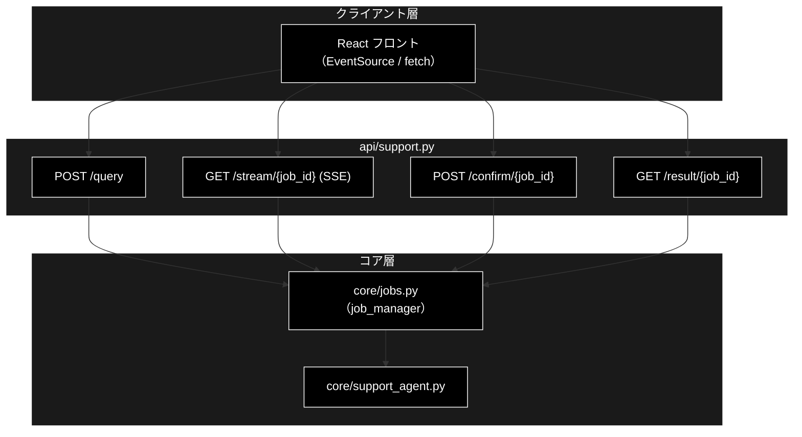
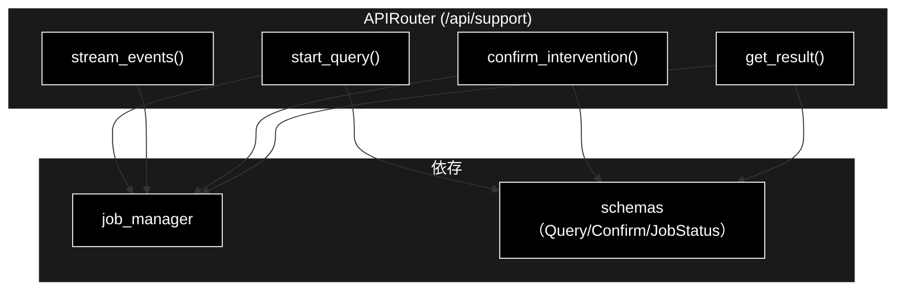
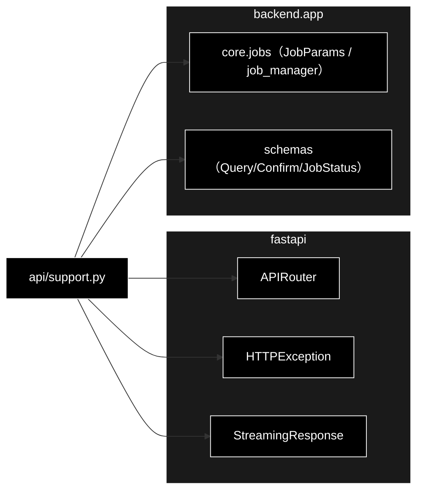

# api/support.py - サポート問い合わせ API ドキュメント

**Version 1.0** | 最終更新: 2026-07-15

---

## 目次

1. [概要](#概要)
2. [アーキテクチャ構成図](#1-アーキテクチャ構成図)
3. [モジュール構成図](#2-モジュール構成図)
4. [クラス・関数一覧表](#3-クラス関数一覧表)
5. [クラス・関数 IPO詳細](#4-クラス関数-ipo詳細)
6. [使用例](#5-使用例)
7. [エクスポート](#6-エクスポート)
8. [変更履歴](#7-変更履歴)
9. [付録: 依存関係図](#付録-依存関係図)

---

## 概要

`backend/app/api/support.py` は、GRACE-Support の**サポート問い合わせ API**（`/api/support/*`）を
提供する FastAPI ルーターモジュール。ジョブ起動（POST）・進捗配信（SSE）・HITL 応答（POST）・
結果取得（GET）の 4 エンドポイントを定義し、実処理は `core/jobs.py` の `job_manager` に委譲する。

進捗は **SSE（Server-Sent Events）** で配信し、イベントは常に先頭からリプレイされるため
再接続でも取りこぼさない。CONFIRM（人間承認）が必要な副作用アクションは、SSE の
`intervention` イベント → フロントのモーダル → `POST /confirm` の応答で解決する。

### 主な責務

- 問い合わせジョブの起動（`POST /api/support/query`）
- ステップ進捗の SSE 配信（`GET /api/support/stream/{job_id}`）
- HITL CONFIRM 応答の注入（`POST /api/support/confirm/{job_id}`）
- ジョブ状態・最終結果の取得（`GET /api/support/result/{job_id}`）
- 存在しないジョブへの 404 応答

### 各責務対応のモジュール

| # | 責務 | 対応モジュール | 説明 |
|---|------|--------------|------|
| 1 | ジョブ起動 | `api/support.py` → `core/jobs.py` | `job_manager.start(JobParams)` |
| 2 | SSE 進捗配信 | `api/support.py` → `core/jobs.py` | `job.stream_events()` を SSE 整形 |
| 3 | HITL 応答注入 | `api/support.py` → `core/jobs.py` | `job_manager.confirm(...)` |
| 4 | 結果取得 | `api/support.py` → `core/jobs.py` | `job_manager.get(job_id)` |
| 5 | 入出力スキーマ | `backend/app/schemas.py` | Query/Confirm/JobStatus 各モデル |

### 主要機能一覧

| 機能 | 説明 |
|------|------|
| `router` | `APIRouter(prefix="/api/support")` |
| `start_query()` | POST /query（ジョブ起動、202 Accepted） |
| `stream_events()` | GET /stream/{job_id}（SSE 進捗配信） |
| `confirm_intervention()` | POST /confirm/{job_id}（HITL 応答） |
| `get_result()` | GET /result/{job_id}（結果取得） |

---

## 1. アーキテクチャ構成図

### 1.1 システム全体構成



### 1.2 データフロー

1. `POST /query` → `job_manager.start()` がワーカースレッドを起動し `QueryAccepted` を返す
2. `GET /stream/{job_id}` → `job.stream_events()` を `data: {JSON}\n\n` で逐次配信、末尾に `done`
3. CONFIRM 到達時 → SSE に `intervention` → `POST /confirm/{job_id}` で承認/拒否を注入
4. `GET /result/{job_id}` → ジョブ状態と `SupportResult`（ポーリング用フォールバック）

---

## 2. モジュール構成図

### 2.1 内部モジュール構成



### 2.2 外部依存関係

| ライブラリ | バージョン | 用途 |
|-----------|-----------|------|
| `fastapi` | >=0.115.6 | `APIRouter` / `HTTPException` |
| `fastapi.responses` | >=0.115.6 | `StreamingResponse`（SSE） |
| `json` | 標準 | イベントの JSON シリアライズ |

### 2.3 内部依存モジュール

| モジュール | 用途 |
|-----------|------|
| `backend.app.core.jobs` | `JobParams` / `job_manager`（起動・参照・HITL 注入） |
| `backend.app.schemas` | `QueryRequest` / `QueryAccepted` / `ConfirmRequest` / `ConfirmResponse` / `JobStatusResponse` |

---

## 3. クラス・関数一覧表

### 3.1 クラス一覧

本モジュールにクラス定義はない（`router` はモジュールレベルの `APIRouter` インスタンス）。

### 3.2 関数一覧（エンドポイント）

| 関数名 | メソッド/パス | 概要 |
|-------|--------------|------|
| `start_query(request)` | POST /query | 問い合わせジョブを起動 |
| `stream_events(job_id)` | GET /stream/{job_id} | 進捗を SSE で配信 |
| `confirm_intervention(job_id, request)` | POST /confirm/{job_id} | HITL 応答を注入 |
| `get_result(job_id)` | GET /result/{job_id} | ジョブ状態と結果を取得 |

---

## 4. クラス・関数 IPO詳細

### 4.1 エンドポイント関数

#### `start_query`

**概要**: 問い合わせジョブを起動する。進捗は返却された `stream_url` の SSE で配信される。

```python
@router.post("/query", response_model=QueryAccepted, status_code=202)
def start_query(request: QueryRequest) -> QueryAccepted
```

| パラメータ | 型 | デフォルト | 説明 |
|------------|------|-----------|------|
| `request` | QueryRequest | - | query / vertical / dry_run / use_web / do_action / verbose |

| 項目 | 内容 |
|------|------|
| **Input** | `request: QueryRequest` |
| **Process** | 1. `JobParams` を組み立て<br>2. `job_manager.start()` でワーカースレッド起動<br>3. `QueryAccepted`（job_id / stream_url）を返す（202） |
| **Output** | `QueryAccepted`: `{job_id, stream_url}` |

**戻り値例**:
```python
{"job_id": "a1b2c3d4e5f6", "stream_url": "/api/support/stream/a1b2c3d4e5f6"}
```

```python
# 使用例（クライアント）
POST /api/support/query  {"query": "返品したい", "vertical": "ec"}
# 202 → {"job_id": "...", "stream_url": "/api/support/stream/..."}
```

#### `stream_events`

**概要**: ステップ進捗（①〜⑥）を SSE で逐次配信する。イベントは先頭からリプレイされるため
再接続でも取りこぼさない。各メッセージは `data: {SupportEventModel の JSON}`。

```python
@router.get("/stream/{job_id}")
def stream_events(job_id: str) -> StreamingResponse
```

| パラメータ | 型 | デフォルト | 説明 |
|------------|------|-----------|------|
| `job_id` | str | - | 対象ジョブ ID |

| 項目 | 内容 |
|------|------|
| **Input** | `job_id: str` |
| **Process** | 1. `job_manager.get(job_id)`、無ければ 404<br>2. `job.stream_events()` を反復<br>3. None は `: keepalive` コメント、イベントは `data: {JSON}`<br>4. 終端で `data: {"type": "done", "status": ...}` を送出 |
| **Output** | `StreamingResponse`（media_type=`text/event-stream`、`Cache-Control: no-cache` / `X-Accel-Buffering: no`） |

**戻り値例**:
```
data: {"seq": 0, "ts": 1752543210.1, "type": "log", "step": "plan", "message": "❓ 問い合わせ: 返品したい"}

: keepalive

data: {"type": "done", "status": "completed"}
```

```python
# 使用例（フロント）
const es = new EventSource("/api/support/stream/a1b2c3d4e5f6");
es.onmessage = (e) => handle(JSON.parse(e.data));
```

#### `confirm_intervention`

**概要**: HITL CONFIRM への応答（承認 / 拒否）を注入する。`approve=True` で PROCEED、
False で CANCEL。対象なし・タイムアウト済みは not_found / not_waiting を返す。

```python
@router.post("/confirm/{job_id}", response_model=ConfirmResponse)
def confirm_intervention(job_id: str, request: ConfirmRequest) -> ConfirmResponse
```

| パラメータ | 型 | デフォルト | 説明 |
|------------|------|-----------|------|
| `job_id` | str | - | 対象ジョブ ID |
| `request` | ConfirmRequest | - | intervention_id / approve |

| 項目 | 内容 |
|------|------|
| **Input** | `job_id: str`, `request: ConfirmRequest` |
| **Process** | 1. `job_manager.confirm(job_id, intervention_id, approve)`<br>2. `not_found` は 404<br>3. それ以外は `ConfirmResponse(status=...)` |
| **Output** | `ConfirmResponse`: `{status}`（resolved / not_waiting）／ not_found は 404 |

**戻り値例**:
```python
{"status": "resolved"}
```

```python
# 使用例
POST /api/support/confirm/a1b2c3d4e5f6  {"intervention_id": "9f8e...", "approve": true}
# → {"status": "resolved"}
```

#### `get_result`

**概要**: ジョブの状態と最終結果（`SupportResult`）を返す（SSE を使わないポーリング用フォールバック）。

```python
@router.get("/result/{job_id}", response_model=JobStatusResponse)
def get_result(job_id: str) -> JobStatusResponse
```

| パラメータ | 型 | デフォルト | 説明 |
|------------|------|-----------|------|
| `job_id` | str | - | 対象ジョブ ID |

| 項目 | 内容 |
|------|------|
| **Input** | `job_id: str` |
| **Process** | 1. `job_manager.get(job_id)`、無ければ 404<br>2. `JobStatusResponse`（job_id / status / result）を返す |
| **Output** | `JobStatusResponse`: `{job_id, status, result}` |

**戻り値例**:
```python
{"job_id": "a1b2c3d4e5f6", "status": "completed",
 "result": {"answer": "…", "decision": "answer", "vertical": "ec"}}
```

```python
# 使用例
GET /api/support/result/a1b2c3d4e5f6
# → {"job_id": "...", "status": "completed", "result": { ... }}
```

---

## 5. 使用例

### 5.1 基本的なワークフロー（クライアント視点）

```text
1. POST /api/support/query {"query": "返品したい", "vertical": "ec"}
   → 202 {"job_id": "J", "stream_url": "/api/support/stream/J"}

2. new EventSource("/api/support/stream/J")
   → data: {type:"step", step:"plan", ...}
   → data: {type:"intervention", step:"action", data:{intervention_id:"I", ...}}

3. POST /api/support/confirm/J {"intervention_id": "I", "approve": true}
   → {"status": "resolved"}

4. data: {type:"result", data:{...}}  /  data: {type:"done", status:"completed"}
   （必要なら GET /api/support/result/J でも取得可）
```

---

## 6. エクスポート

`__all__` 定義はない。`main.py` が `support.router` を `include_router()` する。

```python
router  # APIRouter(prefix="/api/support", tags=["support"])
```

---

## 7. 変更履歴

| バージョン | 変更内容 |
|-----------|---------|
| 1.0 | 初版作成（4 エンドポイント: query / stream(SSE) / confirm / result の IPO ドキュメント） |

---

## 付録: 依存関係図


