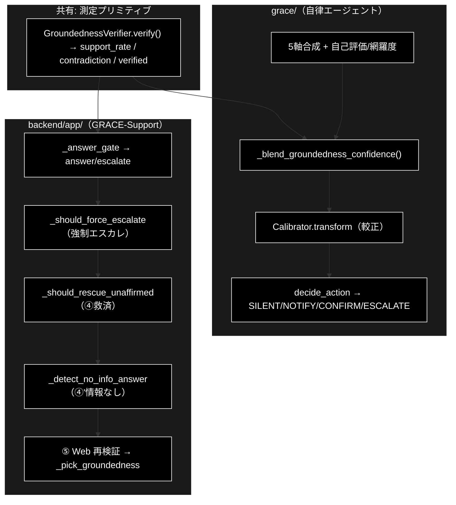

# 信頼度測定フロー比較 — grace/ と backend/app/ ドキュメント

**Version 1.0** | 最終更新: 2026-07-15

同じ「信頼度（根拠妥当性）測定」を土台にしつつ、**grace/（自律エージェント本体）**と
**backend/app/（GRACE-Support Web の判定層）**では、その使い方・最終判定が異なる。
本書は両者の**処理・流れを比較**し、どこが共有でどこが独自かを明確化する。

- 測定の詳細: `grace/docs/confidence_calibration.md`（`confidence.py` × `calibration.py`）
- backend 判定の詳細: `backend/docs/core_gates.md`（`gates.py` の純関数群）

技術スタック: LLM = Anthropic Claude（既定 `claude-sonnet-4-6`／軽量
`claude-haiku-4-5-20251001`）、Embedding = Gemini（`gemini-embedding-001`）。

---

## 目次

1. [概要](#概要)
2. [共有する測定プリミティブ](#1-共有する測定プリミティブ)
3. [grace/ の信頼度フロー](#2-grace-の信頼度フロー)
4. [backend/app/ の判定フロー](#3-backendapp-の判定フロー)
5. [比較表](#4-比較表)
6. [並置フロー図](#5-並置フロー図)
7. [設計上の含意](#6-設計上の含意)
8. [関連ドキュメント](#7-関連ドキュメント)
9. [変更履歴](#8-変更履歴)

---

## 概要

**測定の心臓部（`GroundednessVerifier` による支持率）は両者で共有**している。違うのは
「その支持率を最終的にどう判定へ落とすか」である。

- **grace/**: 5 軸の信頼度を合成し groundedness を主成分にブレンド、**温度スケーリングで較正**
  した単一の `overall_confidence` を作り、`decide_action` で **4 値の介入レベル**
  （SILENT/NOTIFY/CONFIRM/ESCALATE）へ落とす。汎用の自律実行向け。
- **backend/app/**: `GroundednessVerifier` の**支持率を直接** `_answer_gate` に通し、
  **2 値（answer/escalate）**へ落とす。加えて業界特化のビジネスルール（強制エスカレ・
  ④救済・④'情報なし検知・⑤Web 再検証）を重ねる。サポート応答（HITL）向け。

### 主な責務

- 両者が共有する測定プリミティブ（`GroundednessVerifier` / groundedness 支持率）の明確化
- grace/ の「多軸→ブレンド→較正→介入レベル」フローの整理
- backend/app/ の「支持率→回答ゲート→二段判定→救済/情報なし/Web」フローの整理
- 2 系統の処理・しきい値・出力の差分の対比

### 各責務対応のモジュール

| # | 責務 | 対応モジュール | 説明 |
|---|------|--------------|------|
| 1 | 支持率の測定（共有） | `grace/confidence.py`（`GroundednessVerifier`） | backend も `create_groundedness_verifier` を再利用 |
| 2 | grace 側の信頼度合成・較正 | `grace/executor.py` ＋ `grace/calibration.py` | overall_confidence → 介入レベル |
| 3 | backend 側の回答ゲート | `backend/app/core/gates.py`（`_answer_gate` 他） | support_rate → answer/escalate |
| 4 | backend 側パイプライン統括 | `backend/app/core/support_agent.py` | ④ゲート・⑤Web・④'情報なし・⑥Action |

### 主要機能一覧

| 機能 | 所属 | 説明 |
|------|------|------|
| `GroundednessVerifier.verify()` | grace（共有） | 支持率・矛盾有無・検証可否 |
| `_calculate_overall_confidence()` | grace/executor | 5軸→groundedness ブレンド→較正 |
| `Calibrator.transform()` | grace/calibration | 温度スケーリング較正 |
| `decide_action()` | grace/confidence | overall_confidence → 介入レベル |
| `_answer_gate()` | backend/gates | support_rate → answer/escalate |
| `_should_force_escalate()` / `_should_rescue_unaffirmed()` / `_detect_no_info_answer()` | backend/gates | 強制エスカレ／救済／情報なし検知 |

---

## 1. 共有する測定プリミティブ

backend は独自に信頼度検証器を持たず、**grace の `GroundednessVerifier` をそのまま再利用**する
（`backend/app/core/support_agent.py` が `from grace.confidence import create_groundedness_verifier`）。

| 共有要素 | 内容 |
|---------|------|
| `GroundednessVerifier.verify(query, answer, sources)` | 各主張を supported/contradicted/neutral に LLM 判定 |
| `GroundednessResult.support_rate` | `supported / (supported+contradicted)`（neutral は分母外） |
| `has_contradiction` / `verified` | 矛盾検出／検証成立可否 |

→ **「回答の各主張が引用ソースに支持されるか」という測定は同一**。差が出るのはこの後段。

---

## 2. grace/ の信頼度フロー

`grace/executor.py::_calculate_overall_confidence()` が統括（詳細は
`grace/docs/confidence_calibration.md`）。

```
① 各ステップ ConfidenceScore（ConfidenceCalculator, 5軸）
② 最終回答の自己評価＋網羅度（LLMSelfEvaluator.evaluate_final）
③ 補助集約（ConfidenceAggregator.aggregate, weighted）
④ groundedness ブレンド（_blend_groundedness_confidence）
     answer_conf = 0.6*support_rate + 0.25*self_eval + 0.15*coverage
     contradiction → min(・, 0.3);  final = 0.8*answer_conf + 0.2*aggregated
⑤ 較正（Calibrator.transform, 温度スケーリング）
⑥ 介入判定（decide_action）
     ≥0.9 SILENT / ≥0.7 NOTIFY / ≥0.4 CONFIRM / else ESCALATE
```

- 出力は**単一の `overall_confidence`（0-1）**と 4 値の `InterventionLevel`。
- **温度スケーリング較正**を最後に適用する（`config/calibration.json`）。
- 曖昧クエリ（ask_user 計画・最終回答なし）は低信頼固定（0.3）で CONFIRM/ESCALATE 帯へ。

---

## 3. backend/app/ の判定フロー

`backend/app/core/support_agent.py` の ④〜⑤ で、grace の `overall_confidence` は**使わず**、
`GroundednessVerifier` の支持率を `gates.py` の純関数へ通して **answer/escalate** を決める。

```
④ 回答ゲート:
     gres = verifier.verify(query, internal_answer, citations)
     decision, warning = _answer_gate(gres.support_rate, gres.verified,
                                       len(citations), notify_th, confirm_th)
   ＋ 強制エスカレ: _should_force_escalate（エスカレ語＋意図分類の二段判定）
   ＋ ④救済:      _should_rescue_unaffirmed（出典付き・矛盾なし・実質回答を維持）
⑤ Web フォールバック（escalate かつ非強制時）:
     gres_web = verifier.verify(...);  再度 _answer_gate
     _pick_groundedness(gres, gres_web) で支持率と判定数を採用
④' 情報なし検知: _detect_no_info_answer（定型句＋軽量LLMの二段判定）→ 情報なしは escalate
⑥ Action: 本人確認 → HITL CONFIRM → 実行
```

`_answer_gate` のロジック（純関数）:

| 条件 | 結果 |
|------|------|
| `not verified` または `citation_count == 0` | `("escalate", False)` |
| `support_rate ≥ notify_th` | `("answer", False)`（高信頼） |
| `support_rate ≥ confirm_th` | `("answer", True)`（中信頼・未確認注記） |
| それ未満 | `("escalate", False)` |

- しきい値 `notify_th`/`confirm_th` は**業界プロファイル**（gov=0.8/0.5 等）または config 既定
  （notify 0.7 / confirm 0.4）。
- 出力は **2 値（answer/escalate）＋ warning フラグ**。
- `SupportResult.overall_confidence` には executor の `overall_confidence`（＝grace 側の較正済み値）
  を**受領・表示**するが、**判定には使わない**（判定は groundedness 支持率ベース）。
- `groundedness`（support_rate）・`groundedness_decided` を結果に格納。

---

## 4. 比較表

| 観点 | grace/（executor + confidence + calibration） | backend/app/（support_agent + gates） |
|------|---|---|
| 測定の主プリミティブ | `GroundednessVerifier`（共有） | `GroundednessVerifier`（**同じものを再利用**） |
| 信頼度の主軸 | `overall_confidence`（5軸→groundedness ブレンド→較正） | groundedness `support_rate` を直結 |
| 較正（温度スケーリング） | **あり**（`Calibrator.transform`） | **なし**（支持率の生値でゲート） |
| 自己評価/網羅度 | `evaluate_final` で信頼度に混合 | 使わない（別途 no_info 判定を使用） |
| 最終判定の値域 | 4 値 `InterventionLevel`（SILENT/NOTIFY/CONFIRM/ESCALATE） | 2 値 `decision`（answer/escalate）＋ warning |
| 判定関数 | `decide_action`（しきい値: 0.9/0.7/0.4） | `_answer_gate`（notify_th/confirm_th・vertical 可変） |
| ビジネスルール | なし（汎用の介入判定のみ） | 強制エスカレ・④救済・④'情報なし検知・⑤Web再検証 |
| 意図分類の使用 | なし | あり（強制エスカレ／アクション判定の二段目） |
| `overall_confidence` の役割 | 介入判定に使用 | 受領・表示のみ（判定には未使用） |
| 想定ユースケース | 汎用の自律実行（Plan/Execute） | 業界特化サポート応答（HITL・回答/エスカレ） |

---

## 5. 並置フロー図



---

## 6. 設計上の含意

- **測定は共有、判定は分離**。同じ支持率（groundedness）を、grace は「連続値の信頼度＋介入
  レベル」に、backend は「回答するか有人へ回すかの二択＋業界ルール」に変換する。責務が
  異なるため、判定ロジックを別モジュールに置くのは妥当。
- **較正の適用点の違い**。grace は較正済み `overall_confidence` を介入判定に使うが、backend の
  ゲートは支持率の生値を使う（較正は overall_confidence を通じて結果に**表示**されるのみ）。
  backend の回答/エスカレ境界を厳密に較正したい場合は、`notify_th`/`confirm_th` の
  プロファイル調整、または支持率への較正適用の是非が検討ポイントになる。
- **backend 固有の安全弁**。④救済（出典付き・矛盾なし・実質回答を escalate から救う）と
  ④'情報なし検知（誠実な「見つかりません」を有人へ倒す）は、groundedness 単独では拾えない
  誤判定を補正するための backend 独自ルールで、grace 側には無い。

---

## 7. 関連ドキュメント

| ドキュメント | 内容 |
|---|---|
| `grace/docs/confidence_calibration.md` | `confidence.py` × `calibration.py` の処理順・処理内容 |
| `backend/docs/core_gates.md` | `gates.py`（`_answer_gate` 等）の IPO 詳細 |
| `backend/docs/core_support_agent.md` | ④〜⑥ を統括するコアパイプライン |
| `grace/doc/confidence.md` / `grace/doc/calibration.md` | 各モジュールの IPO 詳細 |

---

## 8. 変更履歴

| バージョン | 変更内容 |
|-----------|---------|
| 1.0 | 初版作成（grace/ と backend/app/ の信頼度測定・判定フローの比較） |
