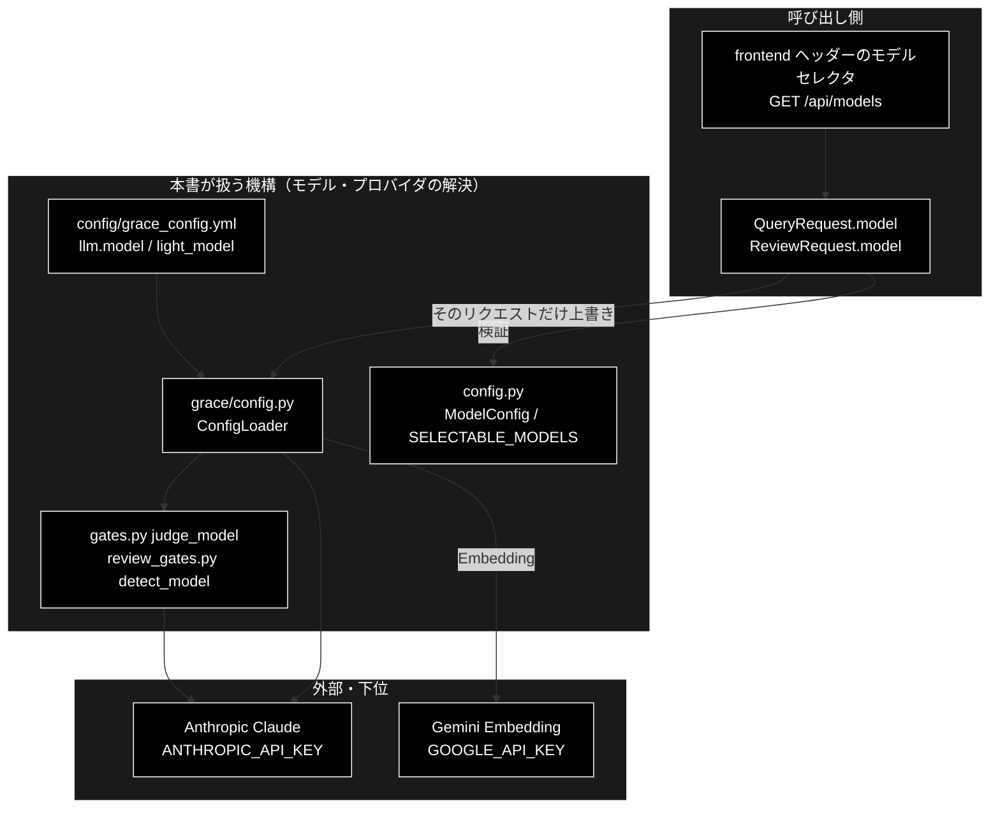
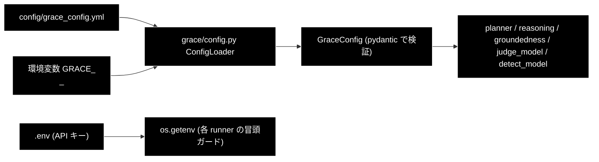

# 設定・モデル・プロバイダの解決経路 ドキュメント

**Version 1.5** | 最終更新: 2026-09-26

---

## 目次

- [概要](#概要)
- [1. プロバイダ方針（恒久ルール）](#1-プロバイダ方針恒久ルール)
- [2. モデル名の解決経路](#2-モデル名の解決経路)
- [3. backend の各所が使うモデル](#3-backend-の各所が使うモデル)
- [3.1 UI から選ぶ（リクエスト単位の上書き）](#31-ui-から選ぶリクエスト単位の上書き)
- [4. API キーと起動ガード](#4-api-キーと起動ガード)
- [5. 設定の読み込み順](#5-設定の読み込み順)
- [6. 既定モデルを変えるときの手順](#6-既定モデルを変えるときの手順)
- [7. 変更履歴](#7-変更履歴)

---

## 概要

> **本書の位置づけ**: 「**どのモデルが、どこで決まるのか**」を backend 視点で 1 枚にする。
> 既定モデルを変える・API キーの前提を確認する・プロバイダを取り違えていないか
> 検証するときに読む。恒久ルールの正本は `CLAUDE.md` §3。

> **関連ドキュメント**
> - [`install_and_setup.md`](./install_and_setup.md) — `.env` と起動手順
> - [`pitfalls.md`](./pitfalls.md) — 触る前に知っておく落とし穴
> - [`data_pipeline.md`](./data_pipeline.md) — 登録時の Embedding プロバイダ

### 主な責務

- 用途でプロバイダを分ける（LLM は Anthropic、Embedding だけ Gemini）
- モデル名を §2 の 3 本の経路と §3.1 のリクエスト単位の上書きで解決し（CLAUDE.md §3.1 の「4 本」）、設定ファイル（yml）を正とする
- 判定系と ③ Detect のモデルを解決関数で決める
- UI で選んだモデルをリクエスト単位の上書きとして適用する
- API キーを用途ごとに要求し、ジョブ実行時にガードする

### 各責務対応のモジュール

| # | 責務 | 対応モジュール | 説明 |
|---|------|--------------|------|
| 1 | プロバイダの使い分け | `config.py`（`ModelConfig` / `GeminiConfig`）/ `grace/llm_compat.py` / `helper/helper_embedding.py` | `GeminiConfig` は Embedding 用途に限って参照する（§1） |
| 2 | 解決経路 | `config/grace_config.yml` / `grace/config.py` / `backend/app/core/verticals.py` / `config.py` | `llm.model` / `INTENT_MODEL` / `ModelConfig.DEFAULT_MODEL`（§2）。4 本目のリクエスト上書きは下の #4 |
| 3 | 判定系・Detect のモデル | `backend/app/core/gates.py` / `backend/app/core/review_gates.py` | `judge_model()` / `detect_model()` が yml を正として解決する |
| 4 | リクエスト単位の上書き | `config.py::get_selectable_models()` / `backend/app/schemas.py` / `backend/app/core/support_agent.py` / `review_agent.py` | 選択肢は 1 箇所で決まり、`_validate_model_choice` で検証、`copy.deepcopy(get_config())` のコピーだけを書き換える（§3.1） |
| 5 | API キーのガード | `backend/app/core/support_agent.py` / `review_agent.py` / `backend/app/api/meta.py` | `ANTHROPIC_API_KEY` が無ければジョブ実行時に error イベントで返す。`GET /api/health` が有無を返す（§4） |

### アーキテクチャ構成図



**データフロー**:

1. 起動時に yml → 環境変数（`GRACE_`）→ `GraceConfig` の順で設定を読む
2. リクエストが `model` を指定すると、コアが設定のコピーの `llm.model` だけを差し替える（`light_model` は変えない）
3. 生成・推論は `llm.model`、判定系は `judge_model()` / `detect_model()` が返すモデルで Anthropic を呼ぶ
4. 検索と登録のベクトル化だけは Gemini Embedding を呼ぶ

---

## 1. プロバイダ方針（恒久ルール）

| 用途 | プロバイダ | 既定 | API キー |
|---|---|---|---|
| **Embedding（検索）のみ** | **Gemini** | `gemini-embedding-001`（3072 次元。定義は `config.py::ModelConfig.EMBEDDING_MODEL` の 1 箇所） | `GOOGLE_API_KEY` |
| **それ以外の全 LLM 用途** | **Anthropic** | `claude-sonnet-5`（軽量 `claude-haiku-4-5-20251001`） | `ANTHROPIC_API_KEY` |

- **LLM 用途**: Plan / Execute / Reasoning / Confidence / Replan / ReAct、意図分類・
  情報なし判定・違反検出、Q/A 生成、チャンク化
- **Embedding 用途**: Qdrant への登録と検索クエリのベクトル化

> ⚠️ **Embedding 文脈の `provider="gemini"` / `GOOGLE_API_KEY` は正しい。**
> 「Anthropic 版なのに Gemini がある」と見えて直したくなるが、
> `RegisterParams.provider` を `"anthropic"` にすると**ベクトルの次元が変わり、
> 既存 Qdrant コレクションが全滅**する。

---

## 2. モデル名の解決経路

**経路は 3 本ある。1 箇所だけ直すと取り残しが出る。**

| # | 経路 | 実体 | 誰が読むか |
|---|---|---|---|
| 1 | **設定ファイル（正）** | `config/grace_config.yml` の `llm.model` / `llm.light_model` | `grace/config.py::ConfigLoader` 経由で planner / reasoning / groundedness / ReAct |
| 2 | モジュール定数 | `backend/app/core/verticals.py::INTENT_MODEL`（リテラル） | 判定系のフォールバックのみ |
| 3 | Python 定数 | `config.py::ModelConfig.DEFAULT_MODEL` | チャンク化・Q/A 生成（CLI 側と共通） |

### 経路 1 を正にする 2 つの解決関数

backend には**設定を正としてフォールバックする**関数が 2 つある。
**新しいコードはこの 2 つを使う。定数を直接参照しない。**

```python
# backend/app/core/gates.py — 軽量モデル（意図分類・情報なし判定）
def judge_model(config) -> str:
    llm = getattr(config, "llm", None)
    return getattr(llm, "light_model", None) or INTENT_MODEL

# backend/app/core/review_gates.py — 本モデル（③ Detect の第2段）
def detect_model(config) -> str:
    llm = getattr(config, "llm", None)
    return getattr(llm, "model", None) or ModelConfig.DEFAULT_MODEL
```

フォールバックは `llm` 属性を持たない**テスト用スタブ**のために残してある。

> **これは机上の懸念ではない。** `detect_model()` が無かった頃、
> 姉妹リポジトリ（grace_v2_local）で Review 3 回の実行の Detect 33 回が
> **すべて 404** になり、指摘が全件「自動判定に失敗したため要確認」に落ちた。
> 同じプロセス・同じ base_url の groundedness は成功しており、差は
> **どちらの経路でモデル名を解決したか**だけだった。

> ⚠️ 経路 1 と 2 は現在たまたま同じ値（`claude-haiku-4-5-20251001`）なので、
> **取り残しはテストでは表面化しない。**

---

## 3. backend の各所が使うモデル

| 使う場所 | 解決 | 既定 |
|---|---|---|
| planner / executor / reasoning / groundedness（`grace/`） | 経路 1 | `llm.model` = `claude-sonnet-5` |
| 意図分類・情報なし判定（`gates.py`） | `judge_model()` | `llm.light_model` = `claude-haiku-4-5-20251001` |
| 言及分類・空疎判定（`review_gates.py`） | `judge_model()` | 同上 |
| ③ Detect 第2段（`review_gates.py`） | `detect_model()` | `llm.model` |
| チャンク化（`ChunkingParams.model`） | 経路 3 相当のリクエスト既定 | `claude-haiku-4-5` |
| Q/A 生成（`QaGenerationParams.model`） | 同上 | `claude-sonnet-5` |
| Qdrant 登録の Embedding（`RegisterParams.provider`） | リクエスト既定 | `gemini` |

> ⚠️ **`claude-haiku-4-5`（日付なし）はエイリアスであって書き損じではない。**
> チャンク化の既定値として意図的に使っている。`claude-haiku-4-5-20251001` へ
> 「統一」しないこと（`CLAUDE.md` §3.2）。

---

## 3.1 UI から選ぶ（リクエスト単位の上書き）

上の既定は「何も選ばなかったとき」の値である。画面（4 タブすべて）には
モデルセレクタがあり、**リクエストごとに**上書きできる。

### 選択肢は 1 箇所で決まる

```python
# config.py
ModelConfig.SELECTABLE_MODELS = [
    "claude-fable-5-1",  # 最上位
    "claude-opus-5-5",   # 上位
    "claude-sonnet-5",   # 既定
    "claude-haiku-4-5",  # 軽量
]

def get_selectable_models() -> List[str]: ...
```

| 読む側 | 何に使うか |
|---|---|
| `GET /api/models` | セレクタの選択肢（単価・上限つき） |
| `backend/app/schemas.py::_validate_model_choice` / `_require_model_choice` | 受付時の検証（範囲外は **422**） |
| `run_support_agent_core` / `run_review_agent_core` | コア側の再検証（スキーマを通らない CLI 経路のため） |

> ⚠️ **`AVAILABLE_MODELS` と混同しない。** あちらは「単価・上限を知っている
> モデル」の一覧で、旧既定（`claude-sonnet-4-6`）と日付指定エイリアス
> （`claude-haiku-4-5-20251001`）も含む。どちらも実在する有効なモデル名なので
> 消さない（`CLAUDE.md` R1）。**選択肢に出さないだけ**である
> （同じモデルが 2 行並ぶのを避けるため）。旧上位 `claude-opus-5` も同様に
> 選択肢からは外したが、`llm.heavy_model` 等の既存設定のために表には残している。

### モデル世代で API への送り方が違う

`grace/llm_compat.py` と `helper/helper_llm.py::AnthropicClient` は、
`ModelConfig` の 3 つの表を見てリクエストを組み立てる。
**選択肢にモデルを足すときは、この表にも載せること**（載せないと旧世代扱いで
`temperature` や `{"type": "disabled"}` を送り、API が 400 を返す）。

| 表 | 該当モデル | 意味 |
|---|---|---|
| `NO_TEMPERATURE_MODELS` | Sonnet 5 / Opus 5 / Opus 5.5 / Fable 5.1 | `temperature` を送らない（送ると 400） |
| `ADAPTIVE_THINKING_MODELS` | 同上 | 思考を有効にするときは `{"type": "adaptive"}`（`budget_tokens` は 400） |
| `ALWAYS_THINKING_MODELS` | Opus 5.5 / Fable 5.1 | 思考を無効化できない。`thinking` を省略し `output_config.effort = "low"`、`max_tokens` を 4096 以上に広げる |

Haiku 4.5・Sonnet 4.6 はどの表にも載らず、従来どおり
`{"type": "disabled"}` ＋ `temperature`（思考有効時は `budget_tokens`）で送る。

### 上書きの範囲

```python
if model:
    config.llm.model = model        # ← ここだけ
```

| フィールド | 上書きするか | 理由 |
|---|---|---|
| `llm.model` | **する** | 生成・推論・根拠検証・③ Detect が読む |
| `llm.light_model` | **しない** | 判定系（意図分類・情報なし判定・RAG 適合性）は 2 値しか返さない定型判定で、上位モデルでも精度は変わらず単価だけ上がる（haiku と opus で 5 倍） |
| `llm.heavy_model` | しない | `""` のとき `model` へフォールバックするため、選んだモデルへ自動で揃う |

回帰テストは `backend/tests/test_model_selection.py`（26 件）。

### 「（既定値）」に出す名前は API から取る

`GET /api/model` が**解決後**の値を返す。フロントに既定のモデル名を焼き付けると、
`config/grace_config.yml` を変えたときに画面と実挙動がずれる。

```json
{
  "model": "claude-sonnet-5",
  "light_model": "claude-haiku-4-5-20251001",
  "heavy_model": "",
  "chunking_model": "claude-haiku-4-5",
  "qa_model": "claude-sonnet-5"
}
```

> ⚠️ **データ準備側の既定はエージェントの既定と別物。** チャンク化は軽量
> モデルを使うので、データ管理タブの「（既定値: …）」に `model` を出すと
> 実際に走るモデルと違う名前を表示してしまう。`chunking_model` / `qa_model`
> は `ChunkingRequest` / `QaGenerationRequest` のスキーマ既定値から引いている。

### Embedding は対象外

セレクタにも上書き経路にも Embedding は出てこない。Gemini
`gemini-embedding-001`（3072 次元）固定で、変えると既存 Qdrant コレクションが
使えず全件再登録になる（次元が同じでもモデルが違えばベクトルの意味が合わず、エラーに
ならずに検索結果が壊れる）。モデル名の定義は `config.py::ModelConfig.EMBEDDING_MODEL` の
1 箇所で、他のファイルに書かないことを `backend/tests/test_embedding_model_single_source.py` が検査する。`backend/tests/test_model_selection.py` が
「選択肢に embedding を含むモデル名が無い」ことを固定している。

---

## 4. API キーと起動ガード

`.env`（リポジトリルート）を `main.py` が `load_dotenv()` で読む（未導入でも起動は続行）。

| キー | 必須 | 用途 |
|---|---|---|
| `ANTHROPIC_API_KEY` | **必須** | すべての LLM 用途 |
| `GOOGLE_API_KEY` | **必須** | Embedding（検索・登録） |
| `SERPAPI_KEY` | 任意 | ⑤ Web フォールバック |
| `QDRANT_URL` | 任意 | 既定 `http://localhost:6333` |

### ガードは「起動時」ではなく「ジョブ実行時」に効く

`ANTHROPIC_API_KEY` の欠落は**アプリ起動を止めない**。各 runner の冒頭で確認し、
`error` イベントを出してジョブを `failed` にする（`support_agent.py:274` /
`review_agent.py:485` / `data_jobs.py:245,353`）。

```
⚠️ ANTHROPIC_API_KEY が未設定です。.env に設定してください。
```

**設定の有無は `GET /api/health` で確認できる**（値そのものは返さない）。

---

## 5. 設定の読み込み順



- 環境変数の接頭辞は `GRACE_`。**セクション名は先頭 1 語のみ**なので、
  `GRACE_WEB_SEARCH_*` は `web.search_*` と解釈されて効かない（yml で直す）。
- **API キーは yml に書かない。** `.env` / 環境変数を使う。

> ⚠️ トップレベルの **`config.py`（モジュール）** と **`config/`（ディレクトリ）** は別物。
> `config/` に入っているのは `grace_config.yml` だけで、`import config` は `config.py` を指す。

---

## 6. 既定モデルを変えるときの手順

1. `config/grace_config.yml` の `llm.model` / `llm.light_model` を変える（**経路 1 が正**）
2. `verticals.py::INTENT_MODEL` が同じ値のままで良いか確認する（フォールバック用）
3. `config.py::ModelConfig.DEFAULT_MODEL` を確認する（チャンク化・Q/A 生成）
4. `MODEL_PRICING` / `MODEL_LIMITS` に新しいモデルが登録されているか確認する
5. `ModelConfig.SELECTABLE_MODELS` に載っているか確認する（**既定は選択肢にも含める**。
   含めないと「（既定値）」と同じモデルを明示的に選べない）
6. **モデル名のマッピングは作らない**（`CLAUDE.md` R1）
7. `judge_model()` / `detect_model()` を経由しない直接参照を新たに書いていないか grep する
8. `backend/tests/test_model_selection.py` を通す（yml と `ModelConfig` の既定が
   割れていないことをここが見ている）

---

## 7. 変更履歴

| Version | 日付 | 変更内容 |
|---|---|---|
| 1.5 | 2026-09-26 | Embedding を `gemini-embedding-001` に戻したのに追随（2026-09-26。同日に一度 `gemini-embedding-2` へ変えたが、既存の Qdrant コレクションと grace_v2_local（同じ Qdrant を共用）をそのまま使うため戻した。定義は `config.py::ModelConfig.EMBEDDING_MODEL`） |
| 1.4 | 2026-09-26 | Embedding を `gemini-embedding-2` へ変更し、モデル名の定義を `config.py::ModelConfig.EMBEDDING_MODEL` の 1 箇所へ集約（2026-09-26）。§3 の表と「Embedding は対象外」を追随 |
| 1.3 | 2026-09-24 | `a_cross_doc_md_format.md` v1.1（種別 A）に準拠（2026-09-24）。概要（主な責務／各責務対応のモジュール／3 層のアーキテクチャ構成図）を追加し、冒頭の説明文を概要へ移した。本文の章番号は変えていない。ヘッダーの Version と変更履歴の最新版の食い違いも解消した |
| 1.2 | 2026-09-23 | 選択肢を 4 件へ変更（`claude-fable-5-1` / `claude-opus-5-5` を追加、`claude-opus-5` を外した）。「モデル世代で API への送り方が違う」を追加 |
| 1.1 | 2026-09-16 | 既定を `claude-sonnet-5` へ変更。§3.1（UI からのモデル選択・上書き範囲・Embedding が対象外である理由）を追加 |
| 1.0 | 2026-09-16 | 新規作成。3 本の解決経路・2 つの解決関数・キーのガード位置を実装から整理した |
