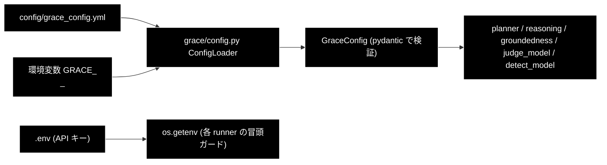

# 設定・モデル・プロバイダの解決経路 ドキュメント

**Version 1.0** | 最終更新: 2026-09-16

> **本書の位置づけ**: 「**どのモデルが、どこで決まるのか**」を backend 視点で 1 枚にする。
> 既定モデルを変える・API キーの前提を確認する・プロバイダを取り違えていないか
> 検証するときに読む。恒久ルールの正本は `CLAUDE.md` §3。

> **関連ドキュメント**
> - [`install_and_setup.md`](./install_and_setup.md) — `.env` と起動手順
> - [`pitfalls.md`](./pitfalls.md) — 触る前に知っておく落とし穴
> - [`data_pipeline.md`](./data_pipeline.md) — 登録時の Embedding プロバイダ

---

## 目次

- [1. プロバイダ方針（恒久ルール）](#1-プロバイダ方針恒久ルール)
- [2. モデル名の解決経路](#2-モデル名の解決経路)
- [3. backend の各所が使うモデル](#3-backend-の各所が使うモデル)
- [4. API キーと起動ガード](#4-api-キーと起動ガード)
- [5. 設定の読み込み順](#5-設定の読み込み順)
- [6. 既定モデルを変えるときの手順](#6-既定モデルを変えるときの手順)
- [7. 変更履歴](#7-変更履歴)

---

## 1. プロバイダ方針（恒久ルール）

| 用途 | プロバイダ | 既定 | API キー |
|---|---|---|---|
| **Embedding（検索）のみ** | **Gemini** | `gemini-embedding-001`（3072 次元） | `GOOGLE_API_KEY` |
| **それ以外の全 LLM 用途** | **Anthropic** | `claude-sonnet-4-6`（軽量 `claude-haiku-4-5-20251001`） | `ANTHROPIC_API_KEY` |

- **LLM 用途**: Plan / Execute / Reasoning / Confidence / Replan / ReAct、意図分類・
  情報なし判定・違反検出、Q/A 生成、チャンク化
- **Embedding 用途**: Qdrant への登録と検索クエリのベクトル化

> ⚠️ **Embedding 文脈の `provider="gemini"` / `GOOGLE_API_KEY` は正しい。**
> 「Anthropic 版なのに Gemini がある」と見えて直したくなるが、
> `RegisterParams.provider` を `"anthropic"` にすると**ベクトルの次元が変わり、
> 既存 Qdrant コレクションが全滅**する。

---

## 2. モデル名の解決経路

**経路は 3 本ある。1 箇所だけ直すと取り残しが出る。**

| # | 経路 | 実体 | 誰が読むか |
|---|---|---|---|
| 1 | **設定ファイル（正）** | `config/grace_config.yml` の `llm.model` / `llm.light_model` | `grace/config.py::ConfigLoader` 経由で planner / reasoning / groundedness / ReAct |
| 2 | モジュール定数 | `backend/app/core/verticals.py::INTENT_MODEL`（リテラル） | 判定系のフォールバックのみ |
| 3 | Python 定数 | `config.py::ModelConfig.DEFAULT_MODEL` | チャンク化・Q/A 生成（CLI 側と共通） |

### 経路 1 を正にする 2 つの解決関数

backend には**設定を正としてフォールバックする**関数が 2 つある。
**新しいコードはこの 2 つを使う。定数を直接参照しない。**

```python
# backend/app/core/gates.py — 軽量モデル（意図分類・情報なし判定）
def judge_model(config) -> str:
    llm = getattr(config, "llm", None)
    return getattr(llm, "light_model", None) or INTENT_MODEL

# backend/app/core/review_gates.py — 本モデル（③ Detect の第2段）
def detect_model(config) -> str:
    llm = getattr(config, "llm", None)
    return getattr(llm, "model", None) or ModelConfig.DEFAULT_MODEL
```

フォールバックは `llm` 属性を持たない**テスト用スタブ**のために残してある。

> **これは机上の懸念ではない。** `detect_model()` が無かった頃、
> 姉妹リポジトリ（grace_v2_local）で Review 3 回の実行の Detect 33 回が
> **すべて 404** になり、指摘が全件「自動判定に失敗したため要確認」に落ちた。
> 同じプロセス・同じ base_url の groundedness は成功しており、差は
> **どちらの経路でモデル名を解決したか**だけだった。

> ⚠️ 経路 1 と 2 は現在たまたま同じ値（`claude-haiku-4-5-20251001`）なので、
> **取り残しはテストでは表面化しない。**

---

## 3. backend の各所が使うモデル

| 使う場所 | 解決 | 既定 |
|---|---|---|
| planner / executor / reasoning / groundedness（`grace/`） | 経路 1 | `llm.model` = `claude-sonnet-4-6` |
| 意図分類・情報なし判定（`gates.py`） | `judge_model()` | `llm.light_model` = `claude-haiku-4-5-20251001` |
| 言及分類・空疎判定（`review_gates.py`） | `judge_model()` | 同上 |
| ③ Detect 第2段（`review_gates.py`） | `detect_model()` | `llm.model` |
| チャンク化（`ChunkingParams.model`） | 経路 3 相当のリクエスト既定 | `claude-haiku-4-5` |
| Q/A 生成（`QaGenerationParams.model`） | 同上 | `claude-sonnet-4-6` |
| Qdrant 登録の Embedding（`RegisterParams.provider`） | リクエスト既定 | `gemini` |

> ⚠️ **`claude-haiku-4-5`（日付なし）はエイリアスであって書き損じではない。**
> チャンク化の既定値として意図的に使っている。`claude-haiku-4-5-20251001` へ
> 「統一」しないこと（`CLAUDE.md` §3.2）。

---

## 4. API キーと起動ガード

`.env`（リポジトリルート）を `main.py` が `load_dotenv()` で読む（未導入でも起動は続行）。

| キー | 必須 | 用途 |
|---|---|---|
| `ANTHROPIC_API_KEY` | **必須** | すべての LLM 用途 |
| `GOOGLE_API_KEY` | **必須** | Embedding（検索・登録） |
| `SERPAPI_KEY` | 任意 | ⑤ Web フォールバック |
| `QDRANT_URL` | 任意 | 既定 `http://localhost:6333` |

### ガードは「起動時」ではなく「ジョブ実行時」に効く

`ANTHROPIC_API_KEY` の欠落は**アプリ起動を止めない**。各 runner の冒頭で確認し、
`error` イベントを出してジョブを `failed` にする（`support_agent.py:274` /
`review_agent.py:485` / `data_jobs.py:245,353`）。

```
⚠️ ANTHROPIC_API_KEY が未設定です。.env に設定してください。
```

**設定の有無は `GET /api/health` で確認できる**（値そのものは返さない）。

---

## 5. 設定の読み込み順



- 環境変数の接頭辞は `GRACE_`。**セクション名は先頭 1 語のみ**なので、
  `GRACE_WEB_SEARCH_*` は `web.search_*` と解釈されて効かない（yml で直す）。
- **API キーは yml に書かない。** `.env` / 環境変数を使う。

> ⚠️ トップレベルの **`config.py`（モジュール）** と **`config/`（ディレクトリ）** は別物。
> `config/` に入っているのは `grace_config.yml` だけで、`import config` は `config.py` を指す。

---

## 6. 既定モデルを変えるときの手順

1. `config/grace_config.yml` の `llm.model` / `llm.light_model` を変える（**経路 1 が正**）
2. `verticals.py::INTENT_MODEL` が同じ値のままで良いか確認する（フォールバック用）
3. `config.py::ModelConfig.DEFAULT_MODEL` を確認する（チャンク化・Q/A 生成）
4. `MODEL_PRICING` / `MODEL_LIMITS` に新しいモデルが登録されているか確認する
5. **モデル名のマッピングは作らない**（`CLAUDE.md` R1）
6. `judge_model()` / `detect_model()` を経由しない直接参照を新たに書いていないか grep する

---

## 7. 変更履歴

| Version | 日付 | 変更内容 |
|---|---|---|
| 1.0 | 2026-09-16 | 新規作成。3 本の解決経路・2 つの解決関数・キーのガード位置を実装から整理した |
