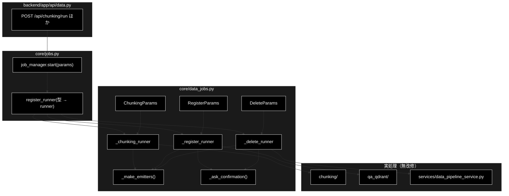

# core/data_jobs.py - データ準備ジョブ runner ドキュメント

**Version 1.0** | 最終更新: 2026-09-04

> **参考ドキュメント**
> - [`backend/docs/api_data.md`](./api_data.md) — 本モジュールを起動する API 層
> - [`backend/docs/core_jobs.md`](./core_jobs.md) — ジョブ基盤（`register_runner` / `JobManager`）
> - [`backend/docs/core_job_logs.md`](./core_job_logs.md) — `capture_logs()` の仕組み
> - [`backend/docs/data_pipeline.md`](./data_pipeline.md) — パイプライン全体の設計

---

## 目次

- [概要](#概要)
- [1. アーキテクチャ構成図](#1-アーキテクチャ構成図)
- [2. ステップ定義](#2-ステップ定義)
- [3. クラス・関数一覧表](#3-クラス関数一覧表)
- [4. パラメータ IPO 詳細](#4-パラメータ-ipo-詳細)
- [5. runner IPO 詳細](#5-runner-ipo-詳細)
- [6. 破壊的操作の承認（HITL CONFIRM）](#6-破壊的操作の承認hitl-confirm)
- [7. 変更履歴](#7-変更履歴)

---

## 概要

`backend/app/core/data_jobs.py` は、データ準備パイプライン
（チャンキング / Qdrant 登録 / コレクション削除）の**ジョブ runner** である。

GRACE-Support・GRACE-Review と**同じジョブ基盤**（`core/jobs.py`）に乗せる。
`register_runner(params_type, runner, kind)` で params の型から runner を解決する
仕組みがすでにあるため、**`jobs.py` 側に手を入れずに** 3 種類を追加できる。

| params | kind | 実処理 |
|---|---|---|
| `ChunkingParams` | `chunking` | `chunking/csv_text_to_chunks_text_csv.py` |
| `RegisterParams` | `register` | `qa_qdrant/register_to_qdrant.py` |
| `DeleteParams` | `delete` | `services/data_pipeline_service.delete_collection` |

### 主な責務

- 3 種のジョブパラメータ（dataclass）を定義する
- 各 runner でステップを刻み、`step` / `log` / `error` イベントを出す
- 既存パッケージの `logging` 出力を `capture_logs()` で横取りして SSE へ流す
- 破壊的操作の前に HITL CONFIRM を通す

### 各責務対応のモジュール

| # | 責務 | 対応モジュール |
|---|------|--------------|
| 1 | ジョブ基盤への登録 | `core/jobs.py` :: `register_runner` |
| 2 | ログ横取り | `core/job_logs.py` :: `capture_logs` |
| 3 | HITL CONFIRM | `grace/intervention.py` :: `InterventionRequest` / `InterventionLevel` |
| 4 | イベント型 | `core/support_agent.py` :: `SupportEvent` / `EmitFn` / `ConfirmFn` |
| 5 | 実処理 | `chunking/` `qa_qdrant/` `services/data_pipeline_service.py` |

### 主要機能一覧

| 機能 | 説明 |
|------|------|
| `ChunkingParams` / `RegisterParams` / `DeleteParams` | 3 種のジョブパラメータ |
| `CHUNKING_STEP_IDS` ほか 6 定数 | フロントの Timeline が使うステップ ID とラベル |
| `_make_emitters(emit)` | `log` / `step_started` / `step_finished` / `step_skipped` / `error` を作る |
| `_ask_confirmation(confirm, message, reason)` | HITL CONFIRM を要求し `(承認, タイムアウト)` を返す |
| `_chunking_runner` / `_register_runner` / `_delete_runner` | 3 種の実処理 |

### 進捗の出し方

3 パッケージとも進捗コールバックを持たないため、`core/job_logs.py` の
`capture_logs()` で `logging` 出力を横取りして SSE の log イベントへ流す
（**既存コードは無改修**）。ステップの区切りだけは runner 側で `step` イベントを出す。

---

## 1. アーキテクチャ構成図



---

## 2. ステップ定義

フロントの Timeline が使う ID と **1:1** で対応する。
ID のタプル（`*_STEP_IDS`）とラベルの辞書（`*_STEP_LABELS`）を対で持つ。

| 定数 | 型 | 用途 |
|---|---|---|
| `CHUNKING_STEP_IDS` / `CHUNKING_STEP_LABELS` | `tuple[str, ...]` / `Dict[str, str]` | チャンキングの 3 段 |
| `REGISTER_STEP_IDS` / `REGISTER_STEP_LABELS` | 同上 | 登録の 4 段 |
| `DELETE_STEP_IDS` / `DELETE_STEP_LABELS` | 同上 | 削除の 3 段 |

runner は `step_started(id, LABELS[id], ...)` の形でラベルを引く。

### 2.1 チャンキング（`CHUNKING_STEP_IDS`）

| ID | ラベル |
|---|---|
| `load` | ① 入力読み込み（CSV / テキスト） |
| `chunk` | ② セマンティックチャンク化（LLM・3 段階） |
| `save` | ③ CSV 出力 |

### 2.2 登録（`REGISTER_STEP_IDS`）

| ID | ラベル |
|---|---|
| `prepare` | ① 入力検証・コレクション名の決定 |
| `confirm` | ② HITL CONFIRM（recreate 時のみ） |
| `embed` | ③ Embedding 生成 |
| `upsert` | ④ Qdrant へ登録 |

### 2.3 削除（`DELETE_STEP_IDS`）

| ID | ラベル |
|---|---|
| `inspect` | ① 削除対象の確認 |
| `confirm` | ② HITL CONFIRM（承認が必要） |
| `delete` | ③ 削除実行 |

---

## 3. クラス・関数一覧表

| 名前 | 種別 | 概要 |
|---|---|---|
| `ChunkingParams` | dataclass | `POST /api/chunking/run` のパラメータ（CLI 引数と 1:1） |
| `RegisterParams` | dataclass | `POST /api/qdrant/register` のパラメータ |
| `DeleteParams` | dataclass | `POST /api/qdrant/delete` のパラメータ |
| `_make_emitters(emit)` | 関数 | `support_agent.py` と同じ形の step/log ヘルパを 5 つ返す |
| `_ask_confirmation(confirm, message, reason)` | 関数 | CONFIRM を要求し `(承認されたか, タイムアウトしたか)` を返す |
| `_chunking_runner(params, emit, confirm)` | runner | CSV / テキスト → セマンティックチャンク CSV |
| `_register_runner(params, emit, confirm)` | runner | Q/A CSV → Qdrant コレクション |
| `_delete_runner(params, emit, confirm)` | runner | コレクション削除 |

---

## 4. パラメータ IPO 詳細

### 4.1 `ChunkingParams`

```python
@dataclass
class ChunkingParams:
    input_file: str                      # 'ディレクトリ名/ファイル名' 形式
    output_dir: str = "output_chunked"
    model: str = "claude-haiku-4-5"
    workers: int = 8
    block_size: int = 1000
    text_column: Optional[str] = None
    max_rows: Optional[int] = None
    combine_rows: bool = False
    resume: Optional[str] = None         # CheckpointManager の再開用ジョブ ID
    verbose: bool = False
```

> 📝 **CLI 引数と 1:1 対応**。`resume` は `--resume` 相当で、
> `CheckpointManager` の再開に使う。

### 4.2 `RegisterParams`

```python
@dataclass
class RegisterParams:
    input_file: str
    collection: str
    recreate: bool = False               # ⚠️ True は破壊的。CONFIRM を通す
    batch_size: int = 100
    embed_workers: int = 2
    text_col: Optional[str] = None
    domain: Optional[str] = None
    max_docs: Optional[int] = None
    provider: str = "gemini"             # Embedding は Gemini
    normalize_filename: bool = True
    create_ui_csv: bool = True
    ui_output_dir: str = "qa_output"
    verbose: bool = False
```

> ⚠️ **`recreate=True` は既存コレクションを削除して作り直す ＝ 破壊的。** CONFIRM を通す。

> 📝 **`provider="gemini"` は正しい。** Embedding は Gemini（`gemini-embedding-001`・3072 次元）で、
> LLM 用途（Anthropic）とは別系統（CLAUDE.md §3 のプロバイダ方針）。

### 4.3 `DeleteParams`

```python
@dataclass
class DeleteParams:
    collections: List[str]
    verbose: bool = False
```

> ⚠️ **必ず CONFIRM を通る。**

---

## 5. runner IPO 詳細

### 5.1 `_make_emitters`

```python
def _make_emitters(emit: EmitFn)
```

| 項目 | 内容 |
|------|------|
| **Input** | `emit` |
| **Process** | クロージャで 5 つの関数を作る |
| **Output** | `(log, step_started, step_finished, step_skipped, error)` |

| 返る関数 | 送る `SupportEvent` |
|---|---|
| `log(message, step, **data)` | `type="log"` |
| `step_started(step, title, **data)` | `type="step"`, `status="started"` |
| `step_finished(step, **data)` | `type="step"`, `status="finished"` |
| `step_skipped(step, **data)` | `type="step"`, `status="skipped"` |
| `error(message, **data)` | `type="error"` |

> 📝 `support_agent.py` と**同じ形**にしてあるので、フロントの Timeline は
> Support / Review / データ準備を同じコードで描ける。

### 5.2 `_ask_confirmation`

```python
def _ask_confirmation(confirm: ConfirmFn, message: str, reason: str) -> tuple[bool, bool]
```

| 項目 | 内容 |
|------|------|
| **Input** | `confirm`、`message`（ユーザーに見せる文）、`reason` |
| **Process** | `confirm(InterventionRequest(level=CONFIRM, message=..., reason=...))` |
| **Output** | `(response.should_continue, response.timeout_reached)` |

> 📝 **`confirm` が `None` のケースは呼び出し側で潰してある**（Web は必ず
> `InterventionBridge.resolver` が渡る）。CLI から使う場合は呼び出し側で
> `confirm or ...` を用意すること。

### 5.3 `_chunking_runner`

| 項目 | 内容 |
|------|------|
| **Input** | `ChunkingParams`、`emit`、`confirm`（**使わない**） |
| **Process** | ① `ANTHROPIC_API_KEY` が無ければ error して終了 ② `load`: `resolve_input_file()` → `capture_logs(step="load")` の中で `load_input_text()`。空なら error ③ `chunk`: `generate_output_filename()` で出力先を決め、`capture_logs(step="chunk")` の中で `run_chunking_sync()` ④ `save`: 出力ファイルの存在を確認（無ければ警告ログ） |
| **Output** | `{"kind": "chunking", "input_file", "output_file", "chunks", "chars", "model"}`（失敗時は `None`） |

> 📝 **`confirm` は使わない。** チャンク化は既存データを壊さないため承認不要。
> 出力ファイルが既にあっても、**CLI と同じく上書きする**。

### 5.4 `_register_runner`

| 項目 | 内容 |
|------|------|
| **Input** | `RegisterParams`、`emit`、`confirm` |
| **Process** | ① `prepare`: `resolve_input_file()` → Qdrant へ接続し `collection_exists()` と既存件数を取る（接続失敗は起動コマンド入りの error） ② `confirm`: **`recreate=True` かつ既存があるときだけ** `_ask_confirmation()`。承認されなければ `cancelled: True` で返す（既存データは維持）。それ以外は `step_skipped` ③ `embed`: `capture_logs(step="embed")` の中で `register_to_qdrant()` を呼び、途中で `handler.set_step("upsert")` ④ `upsert`: 登録後の件数を確認（取得失敗は警告に留める） |
| **Output** | `{"kind": "register", "collection", "input_file", ...}`（失敗時は `None`、中止時は `cancelled: True`） |

> 📝 **`embed` と `upsert` は `register_to_qdrant()` が両方やる。**
> ステップの切り替えは `capture_logs()` が返すハンドラの `set_step()` で行う。

> 📝 **登録後の件数取得に失敗しても error にしない。** 登録自体は成功しているため、
> 警告ログに留める。

### 5.5 `_delete_runner`

| 項目 | 内容 |
|------|------|
| **Input** | `DeleteParams`、`emit`、`confirm` |
| **Process** | ① 対象が空なら error ② `inspect`: 全コレクションを引き、存在するものを `targets`、しないものを `missing` に分ける。合計件数を出す。`targets` が空なら error ③ `confirm`: **常に** `_ask_confirmation()`。承認されなければ `cancelled: True` で返す ④ `delete`: `capture_logs(step="delete")` の中で `delete_collection()` を 1 件ずつ呼び、`deleted` / `failed` に振り分ける |
| **Output** | `{"kind": "delete", "deleted", "failed", "missing", "cancelled", "total_points"}` |

> ⚠️ **単発の `DELETE` エンドポイントにしていない。**
> 誤操作で不可逆に消えるのを防ぐため。承認画面には**対象名と件数**を出す
> （「合計 N 件のデータが失われ、元に戻せません」）。

> 📝 **存在しないコレクションは `missing` として扱い、処理は続ける。**
> 指定の一部が既に消えていても、残りは削除できる。

---

## 6. 破壊的操作の承認（HITL CONFIRM）

| 操作 | 承認 | 理由 |
|---|---|---|
| チャンク化 | **なし** | 既存データを壊さない |
| 登録（`recreate=False`） | なし | 追記のみ |
| 登録（`recreate=True`） | **あり** | 既存コレクションを削除して作り直す |
| 削除 | **常にあり** | 不可逆 |

> 📝 **登録で毎回ダイアログを出さない理由。** 煩わしいため、**破壊を伴う場合に限定**する。

承認は Support / Review と同じ `InterventionBridge` を通るので、フロントは既存の
`ConfirmModal` をそのまま使える。**タイムアウト時は実行しない**（安全側）。

### runner の登録

```python
# この import 時点で jobs.py に効く
register_runner(ChunkingParams, _chunking_runner, "chunking")
register_runner(RegisterParams, _register_runner, "register")
register_runner(DeleteParams,   _delete_runner,   "delete")
```

> ⚠️ **モジュール末尾の副作用。** `api/data.py` はパラメータ型を使うために必ず
> このモジュールを import するので、**登録漏れは構造的に起きない**
> （`review_agent.py` と同じ方式）。

---

## 7. 変更履歴

| バージョン | 変更内容 |
|-----------|---------|
| 1.0 | 初版作成。`backend/app/core/data_jobs.py`（547 行）の全公開要素を IPO 形式で記述。3 種のステップ定義、`jobs.py` に手を入れず `register_runner` で追加する方式、既存 3 パッケージを無改修のまま `capture_logs()` で進捗を出す方式、CONFIRM の要否（削除は常に／登録は `recreate=True` のときだけ）とその理由、`provider="gemini"` が Embedding 用途として正しいことを実コードのコメントから起こして記載 |
