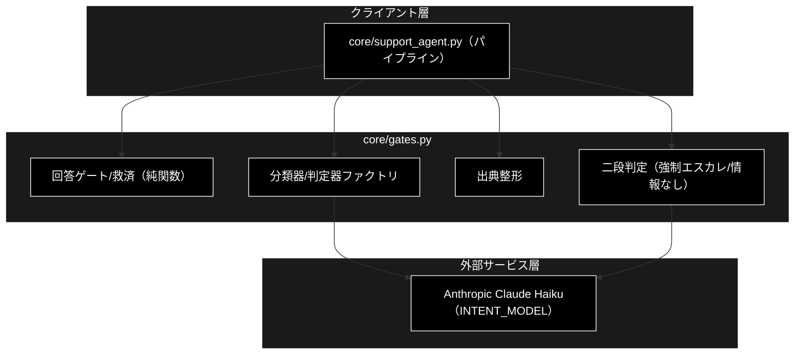
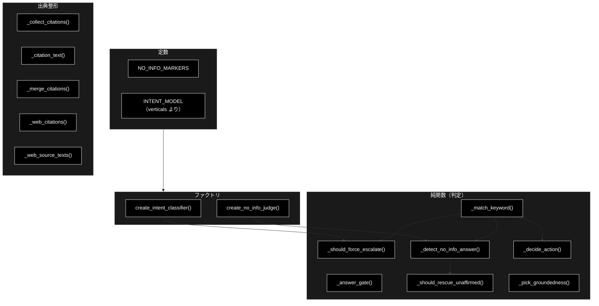
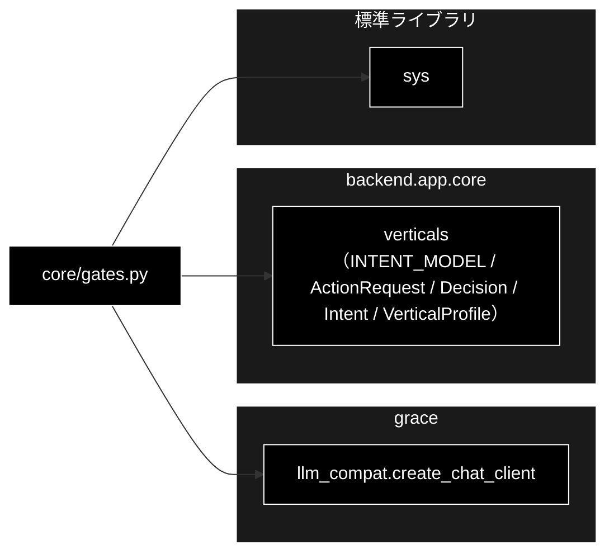

# core/gates.py - 回答ゲート・判定ロジック ドキュメント

**Version 1.0** | 最終更新: 2026-07-15

---

## 目次

1. [概要](#概要)
2. [アーキテクチャ構成図](#1-アーキテクチャ構成図)
3. [モジュール構成図](#2-モジュール構成図)
4. [クラス・関数一覧表](#3-クラス関数一覧表)
5. [クラス・関数 IPO詳細](#4-クラス関数-ipo詳細)
6. [設定・定数](#5-設定定数)
7. [使用例](#6-使用例)
8. [エクスポート](#7-エクスポート)
9. [変更履歴](#8-変更履歴)
10. [付録: 依存関係図](#付録-依存関係図)

---

## 概要

`backend/app/core/gates.py` は、GRACE-Support の**回答ゲート・強制エスカレ・情報なし検知・
救済・出典整形などの純ロジック関数群**を集めたモジュール。`agent_support_example.py`（CLI）
から移設したもので、判定結果が CLI 版と同一になるようロジックは一切変更していない
（後方互換のため `agent_support_example` が再エクスポート）。

多くが副作用のない純関数で、`core/support_agent.py` のパイプラインから呼ばれる。二段判定
（第 1 段=キーワード候補検出、第 2 段=軽量 LLM 判定）が中核で、LLM は Anthropic Claude の
軽量モデル `claude-haiku-4-5-20251001`（`INTENT_MODEL`）を使う。LLM 判定に失敗した場合は
常に安全側（従来のキーワード判定 / escalate）へ倒す。

### 主な責務

- 支持率・出典数からの回答可否判定（`_answer_gate`）
- 強制エスカレの二段判定（`_should_force_escalate` ＋ 意図分類器）
- 「情報なし回答」の二段判定（`_detect_no_info_answer` ＋ 実質回答判定器）
- 出典付き・矛盾なし内部回答の救済判定（`_should_rescue_unaffirmed`）
- アクション種別の決定（`_decide_action`）
- 出典（`[社内]`/`[Web]`）の収集・整形・マージ（`_collect_citations` 他）

### 各責務対応のモジュール

| # | 責務 | 対応モジュール | 説明 |
|---|------|--------------|------|
| 1 | 回答可否判定 | `gates.py` | `_answer_gate`（純関数） |
| 2 | 強制エスカレ判定 | `gates.py` | `_should_force_escalate` ＋ `create_intent_classifier` |
| 3 | 情報なし検知 | `gates.py` | `_detect_no_info_answer` ＋ `create_no_info_judge` |
| 4 | 救済判定 | `gates.py` | `_should_rescue_unaffirmed` |
| 5 | アクション決定 | `gates.py` | `_decide_action` |
| 6 | 出典整形 | `gates.py` | `_collect_citations`/`_merge_citations`/`_web_citations` 他 |

### 主要機能一覧

| 機能 | 説明 |
|------|------|
| `create_intent_classifier()` | 意図分類器（question/request/incident）を返すファクトリ |
| `create_no_info_judge()` | 情報なし回答判定器（answered/no_info）を返すファクトリ |
| `_answer_gate()` | 支持率・出典数から (decision, warning) を判定 |
| `_should_force_escalate()` | 強制エスカレの二段判定 |
| `_detect_no_info_answer()` | 情報なし回答の二段判定 |
| `_should_rescue_unaffirmed()` | 内部回答の救済可否 |
| `_pick_groundedness()` | 複数検証から (支持率, 判定数) を選ぶ |
| `_decide_action()` | アクション種別を決定 |
| `_match_keyword()` | キーワード部分一致（第 1 段） |
| `_collect_citations()` / `_merge_citations()` / `_web_citations()` / `_web_source_texts()` / `_citation_text()` | 出典の収集・整形・抽出 |

---

## 1. アーキテクチャ構成図

### 1.1 システム全体構成



### 1.2 データフロー

1. パイプラインが `_answer_gate()` で内部回答の可否を判定
2. `_should_force_escalate()` がエスカレ語 → 意図分類（第 2 段）で誤検知抑止
3. `_should_rescue_unaffirmed()` が出典付き・矛盾なし回答を救済
4. `_detect_no_info_answer()` が「情報なし回答」を二段判定で検知
5. `_decide_action()` がアクション種別を決定、出典整形関数群が citations を組み立て

---

## 2. モジュール構成図

### 2.1 内部モジュール構成



### 2.2 外部依存関係

| ライブラリ | バージョン | 用途 |
|-----------|-----------|------|
| `sys` | 標準 | 警告メッセージの stderr 出力 |
| `grace.llm_compat` | - | `create_chat_client`（分類器/判定器の LLM クライアント） |

### 2.3 内部依存モジュール

| モジュール | 用途 |
|-----------|------|
| `backend.app.core.verticals` | `INTENT_MODEL` / `ActionRequest` / `Decision` / `Intent` / `VerticalProfile` |

---

## 3. クラス・関数一覧表

### 3.1 クラス一覧

本モジュールにクラス定義はない（純関数とファクトリのみ）。

### 3.2 関数一覧（カテゴリ別）

#### ファクトリ（LLM 判定器）

| 関数名 | 概要 |
|-------|------|
| `create_intent_classifier(config)` | 意図分類器を返す |
| `create_no_info_judge(config)` | 情報なし回答判定器を返す |

#### 判定（純関数）

| 関数名 | 概要 |
|-------|------|
| `_match_keyword(query, keywords)` | キーワード部分一致（第 1 段） |
| `_answer_gate(support_rate, verified, citation_count, notify_th, confirm_th)` | 回答可否判定 |
| `_should_force_escalate(query, profile, classify)` | 強制エスカレの二段判定 |
| `_detect_no_info_answer(query, answer, judge, force_judge)` | 情報なし回答の二段判定 |
| `_should_rescue_unaffirmed(decision, forced_escalate, has_contradiction, citation_count, answer, query, no_info_judge)` | 救済可否 |
| `_pick_groundedness(*results)` | (支持率, 判定数) を選ぶ |
| `_decide_action(query, decision, profile, classify)` | アクション種別を決定 |

#### 出典整形

| 関数名 | 概要 |
|-------|------|
| `_collect_citations(step_results)` | 出典を収集・ラベル付け |
| `_citation_text(citation)` | ラベルを外して中身を返す |
| `_merge_citations(internal, web)` | 内部と Web の出典を重複なく結合 |
| `_web_citations(web_output)` | Web 検索結果から出典表示を作る |
| `_web_source_texts(web_output)` | Web 検索結果の本文を抽出 |

---

## 4. クラス・関数 IPO詳細

### 4.1 ファクトリ関数

#### `create_intent_classifier`

**概要**: 問い合わせ意図の LLM 分類器（軽量モデル・二段判定の第 2 段）を返す。返す関数は
query を question / request / incident へ分類し、失敗時は None（呼び出し側が安全側へ）。

```python
def create_intent_classifier(config) -> Callable[[str], Optional[Intent]]
```

| パラメータ | 型 | デフォルト | 説明 |
|------------|------|-----------|------|
| `config` | Config | - | grace の設定（LLM クライアント生成に使用） |

| 項目 | 内容 |
|------|------|
| **Input** | `config` |
| **Process** | 1. `create_chat_client(config)` を生成<br>2. クロージャ `classify(query)` を返す<br>3. `classify` は `INTENT_MODEL` に分類プロンプトを投げ、出力に含まれるラベルを検出 |
| **Output** | `Callable[[str], Optional[Intent]]`: 分類関数（失敗時 None） |

**戻り値例**:
```python
classify = create_intent_classifier(config)
classify("課金プランの違いを教えて")  # -> "question"
classify("返品したい")                # -> "request"
classify("サービスが落ちています")      # -> "incident"
```

```python
# 使用例
classify = create_intent_classifier(config)
intent = classify(query)  # None なら従来のキーワード判定を優先
```

#### `create_no_info_judge`

**概要**: 「情報なし回答」の LLM 判定器（軽量モデル・第 2 段）を返す。返す関数は
`(query, answer)` を受け、実質回答なら False（answered）、情報なしなら True（no_info）、
失敗時 None（安全側 escalate）。

```python
def create_no_info_judge(config) -> Callable[[str, str], Optional[bool]]
```

| パラメータ | 型 | デフォルト | 説明 |
|------------|------|-----------|------|
| `config` | Config | - | grace の設定 |

| 項目 | 内容 |
|------|------|
| **Input** | `config` |
| **Process** | 1. `create_chat_client(config)` を生成<br>2. クロージャ `judge(query, answer)` を返す<br>3. `INTENT_MODEL` に品質チェックプロンプトを投げ、answered/no_info を判定 |
| **Output** | `Callable[[str, str], Optional[bool]]`: 判定関数（True=no_info / False=answered / None=失敗） |

**戻り値例**:
```python
judge = create_no_info_judge(config)
judge("返品規定を教えて", "30日以内であれば…（末尾に弊社固有の規定は見当たりません）")  # -> False
judge("入荷予定日は？", "商品ページで確認できる場合があります…")                       # -> True
```

```python
# 使用例
judge = create_no_info_judge(config)
verdict = judge(query, answer)  # None は escalate に倒す
```

### 4.2 判定（純関数）

#### `_answer_gate`

**概要**: 支持率・出典数から回答可否を判定する純関数。

```python
def _answer_gate(
    support_rate: float, verified: bool, citation_count: int,
    notify_th: float, confirm_th: float,
) -> tuple[Decision, bool]
```

| パラメータ | 型 | デフォルト | 説明 |
|------------|------|-----------|------|
| `support_rate` | float | - | groundedness 支持率 |
| `verified` | bool | - | 検証が成立したか |
| `citation_count` | int | - | 出典数 |
| `notify_th` | float | - | 高信頼しきい値 |
| `confirm_th` | float | - | 中信頼しきい値 |

| 項目 | 内容 |
|------|------|
| **Input** | `support_rate`, `verified`, `citation_count`, `notify_th`, `confirm_th` |
| **Process** | 未検証/出典0→escalate。支持率>=notify→answer。>=confirm→answer(warning)。それ未満→escalate |
| **Output** | `tuple[Decision, bool]`: (decision, warning) |

**戻り値例**:
```python
("answer", False)  # 高信頼
("answer", True)   # 中信頼（未確認注記）
("escalate", False)  # 低信頼／未検証／出典0
```

```python
# 使用例
decision, warning = _answer_gate(0.83, True, 2, 0.8, 0.5)  # -> ("answer", False)
```

#### `_should_force_escalate`

**概要**: 強制エスカレの二段判定。エスカレ語一致 → 意図分類で question なら誤検知抑止、
request/incident は有人へ。分類器なし/失敗は安全側（強制エスカレ）。

```python
def _should_force_escalate(
    query: str, profile: Optional[VerticalProfile],
    classify: Optional[Callable[[str], Optional[Intent]]] = None,
) -> tuple[bool, Optional[str], Optional[Intent]]
```

| パラメータ | 型 | デフォルト | 説明 |
|------------|------|-----------|------|
| `query` | str | - | 問い合わせ |
| `profile` | Optional[VerticalProfile] | - | 業界プロファイル（None なら常に False） |
| `classify` | Optional[Callable] | None | 意図分類器 |

| 項目 | 内容 |
|------|------|
| **Input** | `query`, `profile`, `classify` |
| **Process** | 1. profile なし→(False,None,None)<br>2. `escalate_keywords` 一致検出（第1段）<br>3. 一致時 `classify`（第2段）。question→誤検知抑止、それ以外→強制エスカレ |
| **Output** | `tuple[bool, Optional[str], Optional[Intent]]`: (forced, matched_keyword, intent) |

**戻り値例**:
```python
(True, "減免", "request")    # gov「減免を個別に判断してほしい」→ 有人へ
(False, "課金", "question")  # saas「課金プランの違いを教えて」→ 誤検知抑止
(False, None, None)          # エスカレ語なし
```

```python
# 使用例
forced, kw, intent = _should_force_escalate(query, profile, classify)
```

#### `_detect_no_info_answer`

**概要**: 「情報なし回答」の二段判定。第1段=`NO_INFO_MARKERS` 部分一致、第2段=LLM 判定。
`force_judge=True`（出典が Web のみ）なら候補句なしでも第2段を必ず実施。

```python
def _detect_no_info_answer(
    query: str, answer: str,
    judge: Optional[Callable[[str, str], Optional[bool]]] = None,
    force_judge: bool = False,
) -> tuple[bool, Optional[str]]
```

| パラメータ | 型 | デフォルト | 説明 |
|------------|------|-----------|------|
| `query` | str | - | 問い合わせ |
| `answer` | str | - | 回答本文 |
| `judge` | Optional[Callable] | None | 情報なし判定器（None なら通す） |
| `force_judge` | bool | False | Web のみ出典時に第2段を強制 |

| 項目 | 内容 |
|------|------|
| **Input** | `query`, `answer`, `judge`, `force_judge` |
| **Process** | 1. `NO_INFO_MARKERS` 一致検出<br>2. 候補なし かつ force_judge でない→(False,None)<br>3. judge なし→(False,marker)<br>4. judge の verdict が False→(False,marker)、それ以外→(True,marker) |
| **Output** | `tuple[bool, Optional[str]]`: (no_info, matched_marker) |

**戻り値例**:
```python
(True, "見当たりません")   # 情報なし → escalate
(False, "見当たりません")  # 候補句はあるが実質回答 → 維持
(False, None)              # 候補句なし
```

```python
# 使用例
no_info, marker = _detect_no_info_answer(query, answer, judge, force_judge=web_only)
```

#### `_should_rescue_unaffirmed`

**概要**: 出典付き・非「情報なし」・矛盾なしの内部回答を escalate から救うか。支持数ではなく
「矛盾がないか」で判定する（Haiku の出力ぶれによる誤エスカレ・無駄な Web 二次生成を回避）。

```python
def _should_rescue_unaffirmed(
    decision: Decision, forced_escalate: bool, has_contradiction: bool,
    citation_count: int, answer: str, query: str,
    no_info_judge: Optional[Callable[[str, str], Optional[bool]]] = None,
) -> bool
```

| パラメータ | 型 | デフォルト | 説明 |
|------------|------|-----------|------|
| `decision` | Decision | - | ④ゲートの判定 |
| `forced_escalate` | bool | - | 強制エスカレか |
| `has_contradiction` | bool | - | 矛盾検出の有無 |
| `citation_count` | int | - | 出典数 |
| `answer` | str | - | 回答本文 |
| `query` | str | - | 問い合わせ |
| `no_info_judge` | Optional[Callable] | None | 情報なし判定器 |

| 項目 | 内容 |
|------|------|
| **Input** | `decision`, `forced_escalate`, `has_contradiction`, `citation_count`, `answer`, `query`, `no_info_judge` |
| **Process** | escalate かつ非強制、矛盾なし、出典>=1、本文あり、かつ実質回答（`_detect_no_info_answer` が False）なら True |
| **Output** | `bool`: 救済するなら True |

**戻り値例**:
```python
True   # ec「返金ポリシー」出典付き・矛盾なし・実質回答 → answer 維持
False  # 矛盾あり／出典0／範囲外の情報なし回答 → escalate 維持
```

```python
# 使用例
if _should_rescue_unaffirmed(decision, forced, gres.has_contradiction,
                             len(citations), answer, query, no_info_judge):
    decision, warning = "answer", True
```

#### `_pick_groundedness`

**概要**: 複数の GroundednessResult から (支持率, 判定できた主張数) を選ぶ純関数。支持率最大、
同率なら decided が多い方。

```python
def _pick_groundedness(*results) -> tuple[float, int]
```

| パラメータ | 型 | デフォルト | 説明 |
|------------|------|-----------|------|
| `*results` | GroundednessResult | - | 1 つ以上の検証結果 |

| 項目 | 内容 |
|------|------|
| **Input** | `*results` |
| **Process** | 各結果の `(support_rate, supported+contradicted)` の最大を返す |
| **Output** | `tuple[float, int]`: (支持率, 判定数) |

**戻り値例**:
```python
(0.83, 3)
```

```python
# 使用例
g_rate, g_decided = _pick_groundedness(gres, gres_web)
```

#### `_decide_action`

**概要**: 問い合わせ内容と回答判定から必要なアクションを決める（二段判定）。escalate は常に
有人エスカレ。question（FAQ質問）は起票せず回答のみ。

```python
def _decide_action(
    query: str, decision: Decision,
    profile: Optional[VerticalProfile] = None,
    classify: Optional[Callable[[str], Optional[Intent]]] = None,
) -> Optional[ActionRequest]
```

| パラメータ | 型 | デフォルト | 説明 |
|------------|------|-----------|------|
| `query` | str | - | 問い合わせ |
| `decision` | Decision | - | 回答判定 |
| `profile` | Optional[VerticalProfile] | None | 業界プロファイル |
| `classify` | Optional[Callable] | None | 意図分類器 |

| 項目 | 内容 |
|------|------|
| **Input** | `query`, `decision`, `profile`, `classify` |
| **Process** | 1. escalate→`escalate_to_human`<br>2. profile ありは `action_map` 一致、無しはデモ既定マッピング<br>3. 候補あり かつ intent=question→None（回答のみ） |
| **Output** | `Optional[ActionRequest]`: アクション（不要なら None） |

**戻り値例**:
```python
ActionRequest("create_ticket", {"query": "返品したい", "matched": "返品"})
ActionRequest("escalate_to_human", {"query": "…"})
None  # FAQ 質問 → 回答のみ
```

```python
# 使用例
action = _decide_action(query, support.decision, profile, classify)
```

#### `_match_keyword`

**概要**: キーワード候補の部分一致（二段判定の第 1 段）。最初に一致した語を返す。

```python
def _match_keyword(query: str, keywords) -> Optional[str]
```

| パラメータ | 型 | デフォルト | 説明 |
|------------|------|-----------|------|
| `query` | str | - | 対象文字列 |
| `keywords` | Iterable[str] | - | キーワード候補 |

| 項目 | 内容 |
|------|------|
| **Input** | `query`, `keywords` |
| **Process** | 候補を順に部分一致判定、最初の一致語を返す |
| **Output** | `Optional[str]`: 一致語（なければ None） |

**戻り値例**:
```python
"返品"  # query に「返品」を含む
None    # 一致なし
```

```python
# 使用例
matched = _match_keyword(query, profile.escalate_keywords)
```

### 4.3 出典整形

#### `_collect_citations`

**概要**: 各ステップの sources を重複排除して出典リストにする。URL は `[Web]`、それ以外は
`[社内]` とラベル付け。

```python
def _collect_citations(step_results) -> List[str]
```

| パラメータ | 型 | デフォルト | 説明 |
|------------|------|-----------|------|
| `step_results` | list | - | executor のステップ結果 |

| 項目 | 内容 |
|------|------|
| **Input** | `step_results` |
| **Process** | 各 `sr.sources` を走査、http(s) 始まりは `[Web]`、他は `[社内]` を付与し重複排除 |
| **Output** | `List[str]`: ラベル付き出典リスト |

**戻り値例**:
```python
["[社内] ec_policy_anthropic/return.md", "[Web] https://example.com/faq"]
```

```python
# 使用例
citations = _collect_citations(result.step_results)
```

#### `_citation_text` / `_merge_citations` / `_web_citations` / `_web_source_texts`

**概要**: 出典文字列のラベル除去・内部×Web のマージ・Web 結果からの出典表示生成・本文抽出。

```python
def _citation_text(citation: str) -> str
def _merge_citations(internal: List[str], web: List[str]) -> List[str]
def _web_citations(web_output: list) -> List[str]
def _web_source_texts(web_output: list) -> List[str]
```

| 関数 | Input | Process | Output |
|------|-------|---------|--------|
| `_citation_text` | `citation: str` | `"] "` で分割し中身を返す | `str`: ラベルなし本文 |
| `_merge_citations` | `internal`, `web` | 内部本文を含む Web 出典を除外して結合 | `List[str]` |
| `_web_citations` | `web_output: list` | payload の title/source から `[Web] title（url）` を生成 | `List[str]` |
| `_web_source_texts` | `web_output: list` | payload.answer を抽出（groundedness 検証用） | `List[str]` |

**戻り値例**:
```python
_citation_text("[社内] return.md")          # -> "return.md"
_web_citations([{"payload": {"title": "FAQ", "source": "https://x"}}])
# -> ["[Web] FAQ（https://x）"]
```

```python
# 使用例
merged = _merge_citations(internal_citations, _web_citations(web_output))
texts = _web_source_texts(web_output)  # verifier.verify() へ渡す
```

---

## 5. 設定・定数

### 5.1 NO_INFO_MARKERS

「情報なし回答」の候補検出パターン（第 1 段）。活用差を吸収するため語幹で照合する。

```python
NO_INFO_MARKERS = (
    "見当たりません", "見つかりません", "確認できません",
    "確認ができません", "情報がありません", "情報はありません",
)
```

| 用途 | 説明 |
|------|------|
| 候補検出 | 一致しても即 no_info とはせず、第 2 段の LLM 判定（実質回答か）で最終決定する |

### 5.2 INTENT_MODEL（`verticals.py` から import）

意図分類・情報なし判定に使う軽量モデル。

```python
INTENT_MODEL = "claude-haiku-4-5-20251001"  # verticals.py で定義
```

---

## 6. 使用例

### 6.1 基本的なワークフロー（パイプラインでの利用）

```python
from backend.app.core.gates import (
    _answer_gate, _should_force_escalate, _should_rescue_unaffirmed,
    _detect_no_info_answer, _decide_action,
    create_intent_classifier, create_no_info_judge,
)

classify = create_intent_classifier(config)
no_info_judge = create_no_info_judge(config)

# ④ 回答ゲート
decision, warning = _answer_gate(gres.support_rate, gres.verified,
                                 len(citations), notify_th, confirm_th)
# 強制エスカレ
forced, kw, intent = _should_force_escalate(query, profile, classify)
# ④救済
if _should_rescue_unaffirmed(decision, forced, gres.has_contradiction,
                             len(citations), answer, query, no_info_judge):
    decision, warning = "answer", True
# ⑥ アクション
action = _decide_action(query, decision, profile, classify)
```

---

## 7. エクスポート

`__all__` 定義はない。`core/support_agent.py` が個別 import し、`agent_support_example` が
後方互換のため再エクスポートする。

```python
# 公開シンボル（明示的 __all__ はなし）
create_intent_classifier, create_no_info_judge,
_answer_gate, _should_force_escalate, _detect_no_info_answer,
_should_rescue_unaffirmed, _pick_groundedness, _decide_action, _match_keyword,
_collect_citations, _citation_text, _merge_citations, _web_citations, _web_source_texts,
NO_INFO_MARKERS
```

---

## 8. 変更履歴

| バージョン | 変更内容 |
|-----------|---------|
| 1.0 | 初版作成（回答ゲート・二段判定・救済・出典整形の純関数群と 2 ファクトリの IPO ドキュメント） |

---

## 付録: 依存関係図


