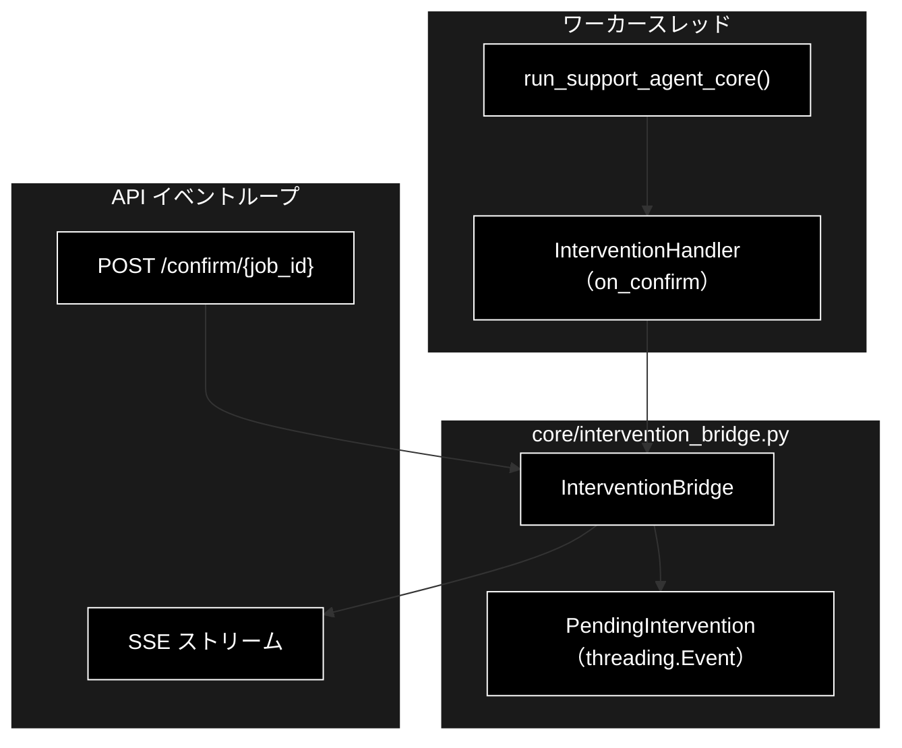
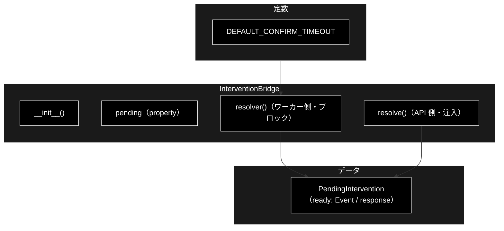
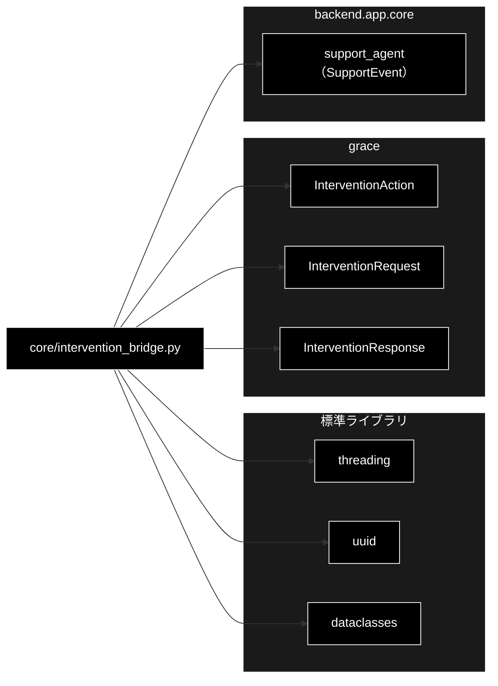

# core/intervention_bridge.py - HITL 非同期ブリッジ ドキュメント

**Version 1.0** | 最終更新: 2026-07-15

---

## 目次

1. [概要](#概要)
2. [アーキテクチャ構成図](#1-アーキテクチャ構成図)
3. [モジュール構成図](#2-モジュール構成図)
4. [クラス・関数一覧表](#3-クラス関数一覧表)
5. [クラス・関数 IPO詳細](#4-クラス関数-ipo詳細)
6. [設定・定数](#5-設定定数)
7. [使用例](#6-使用例)
8. [エクスポート](#7-エクスポート)
9. [変更履歴](#8-変更履歴)
10. [付録: 依存関係図](#付録-依存関係図)

---

## 概要

`backend/app/core/intervention_bridge.py` は、**HITL（Human-in-the-Loop）↔ フロントエンド承認の
非同期ブリッジ**を提供するモジュール。`grace.intervention.InterventionHandler` の `on_confirm` /
`on_escalate` は**同期コールバック**（`InterventionRequest → InterventionResponse`）だが、Web 化では
パイプラインをワーカースレッドで実行し、CONFIRM に達したら次の 3 段で解決する:

1. `intervention` イベントを SSE ストリームへ流す（フロントはモーダル表示）
2. `POST /api/support/confirm/{job_id}` の応答が来るまで `threading.Event` で待つ
3. タイムアウトしたら**安全側＝実行せずエスカレーション**（CANCEL + `timeout_reached=True`）

CLI 版の自動承認（`AUTO_PROCEED`）は Web 側へ持ち込まない（受け入れ条件 §5-2）。

### 主な責務

- ワーカースレッド側の同期リゾルバ（承認が来るまでブロック）の提供（`resolver`）
- CONFIRM 到達時の `intervention` イベント発行（waiting / resolved / timeout）
- API 側からの承認/拒否の注入（`resolve`）
- タイムアウト時の安全側フォールバック（実行せずエスカレーション）

### 各責務対応のモジュール

| # | 責務 | 対応モジュール | 説明 |
|---|------|--------------|------|
| 1 | 同期リゾルバ | `intervention_bridge.py` | `InterventionBridge.resolver` を handler へ渡す |
| 2 | 承認注入 | `intervention_bridge.py` | `InterventionBridge.resolve`（API 側から） |
| 3 | イベント発行 | `core/support_agent.py`（SupportEvent） | waiting/resolved/timeout を emit |
| 4 | HITL 型 | `grace` | `InterventionRequest` / `InterventionResponse` / `InterventionAction` |

### 主要機能一覧

| 機能 | 説明 |
|------|------|
| `PendingIntervention` | 応答待ちの CONFIRM/ESCALATE（dataclass） |
| `InterventionBridge` | 1 ジョブ分の HITL 承認待ちを仲介 |
| `InterventionBridge.resolver()` | ワーカーから呼ぶ同期リゾルバ（ブロック） |
| `InterventionBridge.resolve()` | API から承認/拒否を注入 |
| `InterventionBridge.pending`（property） | 応答待ちの有無 |

---

## 1. アーキテクチャ構成図

### 1.1 システム全体構成



### 1.2 データフロー

1. ワーカーが CONFIRM に達し、handler が `resolver(request)` を呼ぶ（ブロック開始）
2. `resolver` が `PendingIntervention` を作り、`intervention`(waiting) イベントを SSE へ emit
3. フロントがモーダルで承認/拒否 → `POST /confirm` → `resolve(intervention_id, approve)`
4. `resolve` が `threading.Event` をセット → `resolver` が応答を返し `intervention`(resolved) を emit
5. タイムアウト時は `intervention`(timeout) を emit し、CANCEL + `timeout_reached=True` を返す

---

## 2. モジュール構成図

### 2.1 内部モジュール構成



### 2.2 外部依存関係

| ライブラリ | バージョン | 用途 |
|-----------|-----------|------|
| `threading` | 標準 | `Event` / `Lock`（承認待ちの同期） |
| `uuid` | 標準 | intervention ID 生成 |
| `dataclasses` | 標準 | `PendingIntervention` |
| `grace` | - | `InterventionAction` / `InterventionRequest` / `InterventionResponse` |

### 2.3 内部依存モジュール

| モジュール | 用途 |
|-----------|------|
| `backend.app.core.support_agent` | `SupportEvent`（intervention イベントの発行） |

---

## 3. クラス・関数一覧表

### 3.1 クラス一覧

#### PendingIntervention（dataclass）

| メソッド | 概要 |
|---------|------|
| （dataclass） | intervention_id / request / ready(Event) / response |

#### InterventionBridge

| メソッド | 概要 |
|---------|------|
| `__init__(emit, timeout_seconds)` | emit とタイムアウトを保持 |
| `pending`（property） | 応答待ちの `PendingIntervention` |
| `resolver(request)` | ワーカーから呼ぶ同期リゾルバ（ブロック） |
| `resolve(intervention_id, approve)` | API から承認/拒否を注入 |

### 3.2 関数一覧

モジュールレベル関数はない。

---

## 4. クラス・関数 IPO詳細

### 4.1 PendingIntervention クラス

**概要**: フロントエンドの応答待ちの CONFIRM/ESCALATE を表す dataclass。

```python
PendingIntervention(
    intervention_id: str,
    request: InterventionRequest,
    ready: threading.Event = <new Event>,
    response: Optional[InterventionResponse] = None,
)
```

| パラメータ | 型 | デフォルト | 説明 |
|------------|------|-----------|------|
| `intervention_id` | str | - | 承認識別子（uuid 12桁） |
| `request` | InterventionRequest | - | HITL 要求（message / level / options 等） |
| `ready` | threading.Event | 新規 Event | 応答到着の通知フラグ |
| `response` | Optional[InterventionResponse] | None | 注入された応答 |

| 項目 | 内容 |
|------|------|
| **Input** | `intervention_id`, `request`, `ready`, `response` |
| **Process** | 値を保持（`ready` で待機・通知） |
| **Output** | `PendingIntervention` |

**戻り値例**:
```python
PendingIntervention(intervention_id="9f8e7d6c5b4a", request=<InterventionRequest>)
```

```python
# 使用例（resolver 内部）
pending = PendingIntervention(intervention_id=uuid.uuid4().hex[:12], request=request)
```

### 4.2 InterventionBridge クラス

1 ジョブ分の HITL 承認待ちを仲介する。ワーカー側は `resolver` を handler に渡し、API 側は
`resolve()` で応答を注入する。

#### コンストラクタ: `__init__`

**概要**: emit コールバックとタイムアウトを保持し、内部状態を初期化する。

```python
InterventionBridge(
    emit: Callable[[SupportEvent], None],
    timeout_seconds: Optional[float] = None,
)
```

| パラメータ | 型 | デフォルト | 説明 |
|------------|------|-----------|------|
| `emit` | Callable[[SupportEvent], None] | - | intervention イベントの発行先（通常 `job.emit`） |
| `timeout_seconds` | Optional[float] | None | 承認待ちタイムアウト（None なら request/既定にフォールバック） |

| 項目 | 内容 |
|------|------|
| **Input** | `emit`, `timeout_seconds` |
| **Process** | `_emit` / `_timeout` / `_lock` / `_pending=None` を設定 |
| **Output** | `InterventionBridge` |

**戻り値例**:
```python
# 内部状態: _pending=None, _timeout=None
```

```python
# 使用例
bridge = InterventionBridge(emit=job.emit)
```

#### メソッド: `resolver`

**概要**: ワーカースレッドから呼ばれる同期リゾルバ。承認が来るまでブロックし、タイムアウト時は
安全側（CANCEL + timeout_reached）を返す。

```python
def resolver(self, request: InterventionRequest) -> InterventionResponse
```

| パラメータ | 型 | デフォルト | 説明 |
|------------|------|-----------|------|
| `request` | InterventionRequest | - | HITL 要求 |

| 項目 | 内容 |
|------|------|
| **Input** | `request` |
| **Process** | 1. `PendingIntervention` 生成・`_pending` 設定<br>2. timeout を解決し `intervention`(waiting) を emit<br>3. `ready.wait(timeout)` でブロック<br>4. 未応答/タイムアウト→`intervention`(timeout) emit → CANCEL+timeout_reached<br>5. 応答あり→`intervention`(resolved) emit → response 返却 |
| **Output** | `InterventionResponse`: 承認（PROCEED）/拒否（CANCEL）/タイムアウト（CANCEL+timeout_reached） |

**戻り値例**:
```python
InterventionResponse(action=InterventionAction.PROCEED)                    # 承認
InterventionResponse(action=InterventionAction.CANCEL, timeout_reached=True)  # タイムアウト
```

```python
# 使用例（core への配線）
handler = create_intervention_handler(config, on_confirm=bridge.resolver, on_escalate=bridge.resolver)
```

#### メソッド: `resolve`

**概要**: API 側から承認/拒否を注入する。対象が待機中でなければ False。

```python
def resolve(self, intervention_id: str, approve: bool) -> bool
```

| パラメータ | 型 | デフォルト | 説明 |
|------------|------|-----------|------|
| `intervention_id` | str | - | 対象 intervention ID |
| `approve` | bool | - | True=PROCEED / False=CANCEL |

| 項目 | 内容 |
|------|------|
| **Input** | `intervention_id`, `approve` |
| **Process** | 1. ロック下で `_pending` を確認、ID 不一致/なしなら False<br>2. `response` を PROCEED/CANCEL で設定し `ready.set()`<br>3. True を返す |
| **Output** | `bool`: 注入成功なら True、待機中でなければ False |

**戻り値例**:
```python
True   # 承認/拒否を注入できた
False  # 対象が待機中でない（タイムアウト済み等）
```

```python
# 使用例（JobManager.confirm 経由）
ok = bridge.resolve(intervention_id, approve=True)
```

---

## 5. 設定・定数

### 5.1 DEFAULT_CONFIRM_TIMEOUT

```python
DEFAULT_CONFIRM_TIMEOUT = 300
```

| 定数名 | 値 | 説明 |
|-------|----|------|
| `DEFAULT_CONFIRM_TIMEOUT` | 300（秒） | 承認待ちの既定タイムアウト。`grace.config` の `intervention.default_timeout`（既定 300 秒）や `request.timeout_seconds` より優先度の低いフォールバックとしてのみ使う |

> 📝 **タイムアウト解決順**: `self._timeout`（コンストラクタ指定）→ `request.timeout_seconds` → `DEFAULT_CONFIRM_TIMEOUT`。

---

## 6. 使用例

### 6.1 基本的なワークフロー

```python
from backend.app.core.intervention_bridge import InterventionBridge

# ジョブごとにブリッジを生成（emit は SSE へ配線）
bridge = InterventionBridge(emit=job.emit)

# ワーカー: handler に resolver を渡す（core 内部で行われる）
# handler = create_intervention_handler(config, on_confirm=bridge.resolver, ...)

# API: 承認を注入
bridge.resolve(intervention_id="9f8e7d6c5b4a", approve=True)
```

---

## 7. エクスポート

`__all__` 定義はない。`jobs.py` が `InterventionBridge` を import する。

```python
# 公開シンボル（明示的 __all__ はなし）
PendingIntervention, InterventionBridge, DEFAULT_CONFIRM_TIMEOUT
```

---

## 8. 変更履歴

| バージョン | 変更内容 |
|-----------|---------|
| 1.0 | 初版作成（PendingIntervention / InterventionBridge の IPO ドキュメント） |

---

## 付録: 依存関係図


