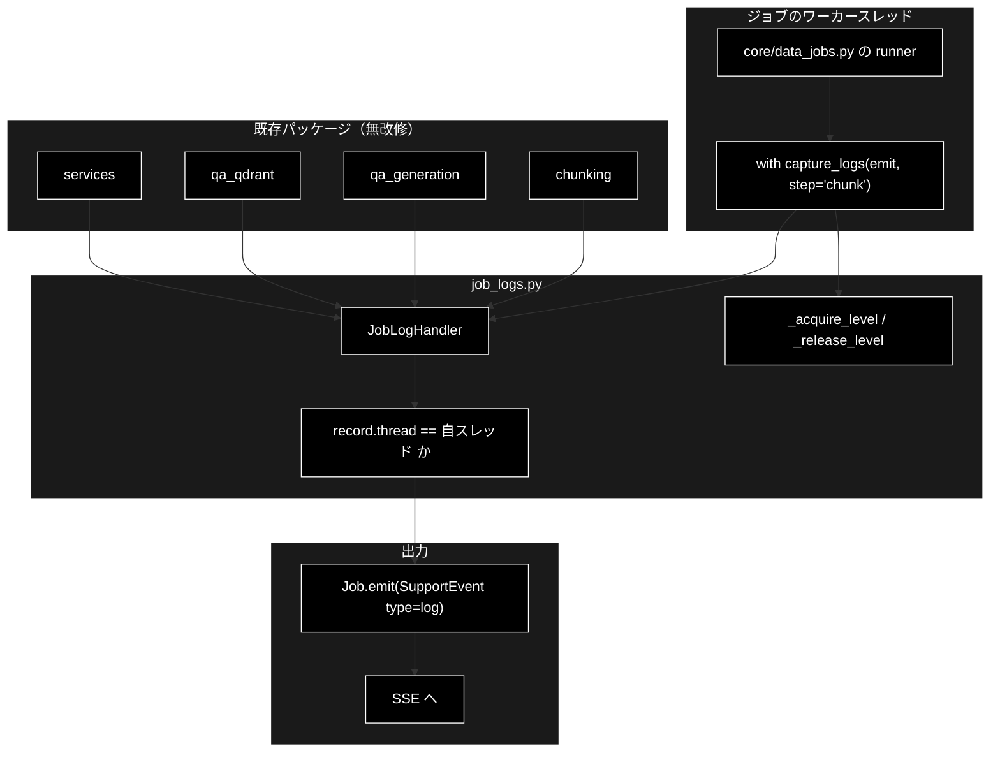

# core/job_logs.py - ジョブ進捗へのログ転送 ドキュメント

**Version 1.0** | 最終更新: 2026-09-04

> **参考ドキュメント**
> - [`backend/docs/core_data_jobs.md`](./core_data_jobs.md) — 本モジュールの唯一の利用者
> - [`backend/docs/core_jobs.md`](./core_jobs.md) — ジョブ基盤（`Job.emit` の実体）

---

## 目次

- [概要](#概要)
- [1. アーキテクチャ構成図](#1-アーキテクチャ構成図)
- [2. クラス・関数一覧表](#2-クラス関数一覧表)
- [3. クラス・関数 IPO 詳細](#3-クラス関数-ipo-詳細)
- [4. 設定・定数](#4-設定定数)
- [5. 落とし穴](#5-落とし穴)
- [6. 使用例](#6-使用例)
- [7. 変更履歴](#7-変更履歴)

---

## 概要

`backend/app/core/job_logs.py` は、**既存モジュールの `logging` 出力を
ジョブの進捗イベントへ転送する**仕組みである。

### なぜ必要か

`chunking/` `qa_generation/` `qa_qdrant/` の各パイプラインは、進捗を
`logger.info(...)` と `tqdm` にしか出しておらず、**進捗コールバックを持たない**。
GRACE-Support / GRACE-Review が `emit(SupportEvent(...))` で SSE へ流しているのに対し、
データ準備側にはその経路が無い。

そこで各モジュールへ `emit` 引数を足す（＝ 3 パッケージを改修する）代わりに、
**ジョブ実行スレッドに紐づく `logging.Handler` を一時的に取り付けてログレコードを
横取りする**。**既存コードは 1 行も変えずに**進捗が SSE へ流れる。

### 主な責務

- 対象ロガーへ `JobLogHandler` を一時的に取り付ける／確実に外す
- **自スレッドのレコードだけ**を転送する（同時実行ジョブとの混線防止）
- 対象ロガーの `level` を一時的に下げ、**参照カウント方式で**元へ戻す

### 各責務対応の要素

| # | 責務 | 対応する要素 |
|---|------|------------|
| 1 | レコードの転送 | `JobLogHandler.emit()` |
| 2 | ステップの切り替え | `JobLogHandler.set_step()` |
| 3 | level の一時変更と復元 | `_acquire_level()` / `_release_level()` / `_level_refs` / `_level_lock` |
| 4 | 取り付け・取り外し | `capture_logs()`（コンテキストマネージャ） |

### 主要機能一覧

| 機能 | 説明 |
|------|------|
| `EmitFn` | 進捗イベントを送る関数の型（`Job.emit` と同じ形） |
| `DEFAULT_LOGGER_NAMES` | 既定で横取りするロガー名 4 つ |
| `JobLogHandler` | 自スレッドのレコードだけを `emit` へ転送する `logging.Handler` |
| `capture_logs()` | 取り付け〜取り外しをまとめたコンテキストマネージャ |

---

## 1. アーキテクチャ構成図



---

## 2. クラス・関数一覧表

### 2.1 クラス

| クラス | 概要 |
|---|---|
| `JobLogHandler(logging.Handler)` | 自スレッドのログレコードだけを `emit` へ転送する |

| メソッド | 概要 |
|---|---|
| `__init__(emit_fn, step, thread_ident)` | 生成時のスレッド ID を記録する |
| `emit(record)` | レコードを log イベントとして転送（`logging.Handler` の API） |
| `set_step(step)` | 転送先のステップ ID を切り替える |

### 2.2 モジュール関数・定数

| 名前 | 概要 |
|---|---|
| `EmitFn` | `Callable[[SupportEvent], None]` |
| `DEFAULT_LOGGER_NAMES` | `("chunking", "qa_generation", "qa_qdrant", "services")` |
| `_level_lock` / `_level_refs` | level 退避テーブルとそのロック |
| `_acquire_level(logger, level)` | level を引き上げ、参照数を 1 増やす |
| `_release_level(logger)` | 参照数を 1 減らし、0 で元の level へ戻す |
| `capture_logs(emit_fn, logger_names, step, level)` | 取り付け〜取り外しのコンテキストマネージャ |

---

## 3. クラス・関数 IPO 詳細

### 3.1 `JobLogHandler.__init__`

```python
def __init__(self, emit_fn: EmitFn, step: Optional[str] = None,
             thread_ident: Optional[int] = None) -> None
```

| 項目 | 内容 |
|------|------|
| **Input** | `emit_fn`、`step`、`thread_ident`（省略時は `threading.get_ident()`） |
| **Process** | `logging.Handler.__init__()` を呼び、3 つを保持する |
| **Output** | `JobLogHandler` |

> 📝 **コールバックを `_emit_fn` という別名で持つ理由。**
> `logging.Handler.emit(record)` を実装するのが本体なので、
> **メソッド名 `emit` と衝突する**。

### 3.2 `JobLogHandler.emit`

```python
def emit(self, record: logging.LogRecord) -> None
```

| 項目 | 内容 |
|------|------|
| **Input** | `record` |
| **Process** | ① `record.thread != self._thread_ident` なら**何もせず return**（他ジョブとの混線防止）② `self.format(record)` — 失敗したら `handleError()` へ委ねて return ③ 空文字（空白のみ）なら return ④ `SupportEvent(type="log", step=..., message=..., data={"level": record.levelname})` を `_emit_fn` へ |
| **Output** | `None` |

> ⚠️ **転送中の例外は握りつぶす。** `logging` の慣行どおり `handleError()` に委ね、
> **ログ出力の失敗で本処理を落とさない。** 購読者側の失敗も同様に波及させない。

### 3.3 `JobLogHandler.set_step`

```python
def set_step(self, step: Optional[str]) -> None
```

同じジョブ内で段階が進んだときに、転送先のステップ ID を切り替える。
`capture_logs()` が `yield` するハンドラに対して呼ぶ。

### 3.4 `_acquire_level` / `_release_level`

```python
def _acquire_level(logger: logging.Logger, level: int) -> None
def _release_level(logger: logging.Logger) -> None
```

| | `_acquire_level` | `_release_level` |
|---|---|---|
| **Input** | `logger`、`level` | `logger` |
| **Process** | 初回なら `_level_refs[name] = (logger.level, 1)` として**本当の元の値**を控え、`NOTSET` か `level` より大きければ `setLevel(level)`。2 回目以降は参照数だけ +1 | 参照数を −1。**0 になったときだけ**控えた元の値へ `setLevel()` してエントリを削除 |
| **Output** | `None` | `None` |

> ⚠️ **どちらも `_level_lock` の中で呼ぶ。** `capture_logs()` が `with _level_lock:` で囲っている。

### 3.5 `capture_logs`

```python
@contextmanager
def capture_logs(emit_fn: EmitFn,
                 logger_names: Sequence[str] = DEFAULT_LOGGER_NAMES,
                 step: Optional[str] = None,
                 level: int = logging.INFO) -> Iterator[JobLogHandler]
```

| パラメータ | 型 | 既定 | 説明 |
|---|---|---|---|
| `emit_fn` | `EmitFn` | **必須** | 進捗イベントの送信先（`Job.emit`） |
| `logger_names` | `Sequence[str]` | `DEFAULT_LOGGER_NAMES` | 横取りするロガー名 |
| `step` | `Optional[str]` | `None` | 転送するイベントの step ID |
| `level` | `int` | `logging.INFO` | 転送する最低レベル |

| 項目 | 内容 |
|------|------|
| **Input** | 上記 |
| **Process** | `JobLogHandler` を作り `setLevel(level)` / `setFormatter(Formatter("%(message)s"))`。`_level_lock` の中で各ロガーへ `_acquire_level()` ＋ `addHandler()`。`yield handler` のあと **`finally` で** `removeHandler()` ＋ `_release_level()` |
| **Output（yield）** | `JobLogHandler` — `set_step()` でステップを切り替えられる |

> ⚠️ **`finally` で必ず取り外す。** 外し忘れるとハンドラが積み上がり、
> **1 行のログが N 回転送される**ようになる。コンテキストマネージャなので例外時も外れる。

> 📝 **対象ロガーの `level` を一時的に下げる理由。** 既定では多くのロガーが未設定
> （＝ root の WARNING を継承）なので、**下げないと INFO が届かない。**

> 📝 **同時に走るジョブが違う `level` を要求した場合、先に入った方が勝つ。**
> 全ジョブが既定の INFO を使う限り問題にならない。

---

## 4. 設定・定数

| 名前 | 値 | 説明 |
|---|---|---|
| `EmitFn` | `Callable[[SupportEvent], None]` | 進捗イベント送信関数の型 |
| `DEFAULT_LOGGER_NAMES` | `("chunking", "qa_generation", "qa_qdrant", "services")` | 既定で横取りするロガー名 |
| `_level_lock` | `threading.Lock()` | `_level_refs` を守るロック |
| `_level_refs` | `dict[str, tuple[int, int]]` | `{ロガー名: (元の level, 参照数)}` |

> 📝 **パッケージロガーに付ける理由。** `logging.getLogger(__name__)` で作られた
> 子ロガーの出力も **propagate で拾える**ため、モジュールごとに登録しなくてよい。

---

## 5. 落とし穴

### 5.1 スレッドで絞らないと他ジョブのログが混ざる

`JobManager.start()` はジョブごとにワーカースレッドを立てる。ハンドラはロガー
（`chunking` 等のパッケージロガー）に付くため、**取り付けたハンドラは他のジョブの
ログレコードも受け取ってしまう**。同時に 2 本のチャンキングを走らせると、
片方の進捗にもう片方のログが混ざる。

これを防ぐため、ハンドラは生成時に `threading.get_ident()` を記録し、
`record.thread` が一致するレコードだけを転送する。
**ハンドラの取り付け自体はプロセス全体に効くが、転送は自分のスレッド分だけ**になる。

### 5.2 level の復元に参照カウントが要る（実測で見つかった不具合）

素朴に「入るとき `logger.level` を控え、出るとき戻す」と書くと、
**同時に 2 本のジョブが走ったときに level が復元されない。**

```
ジョブA: level=NOTSET(0) を控える → INFO(20) に上げる
ジョブB: すでに 20 になっているものを「元の値」として控える → 20 のまま
ジョブA: 終了 → 0 に戻す
ジョブB: 終了 → 20 に戻してしまう（元は 0 だったのに）
```

結果、**全ジョブ終了後もロガーが INFO のまま残り、コンソール出力が増え続ける。**
`_level_refs` は「最初に入った 1 本だけが元の値を持ち、最後に出る 1 本がそれを戻す」形にする。

---

## 6. 使用例

```python
from backend.app.core.job_logs import capture_logs

# 既存コードは無改修。中の logger.info が log イベントとして SSE へ流れる
with capture_logs(emit, ["chunking"], step="chunk"):
    chunks_all_async(...)

# 同じジョブ内で段階が進むとき
with capture_logs(emit, step="embed") as handler:
    register_to_qdrant(...)
    handler.set_step("upsert")      # 以降のログは upsert ステップとして流れる
```

---

## 7. 変更履歴

| バージョン | 変更内容 |
|-----------|---------|
| 1.0 | 初版作成。`backend/app/core/job_logs.py`（193 行）の全公開要素を IPO 形式で記述。既存 3 パッケージを無改修のまま進捗を SSE へ流すという設計意図、スレッドで絞らないと同時実行ジョブのログが混ざること、level の復元に参照カウントが要る理由（素朴な実装では全ジョブ終了後もロガーが INFO のまま残る）を実コードのコメントから起こして記載 |
