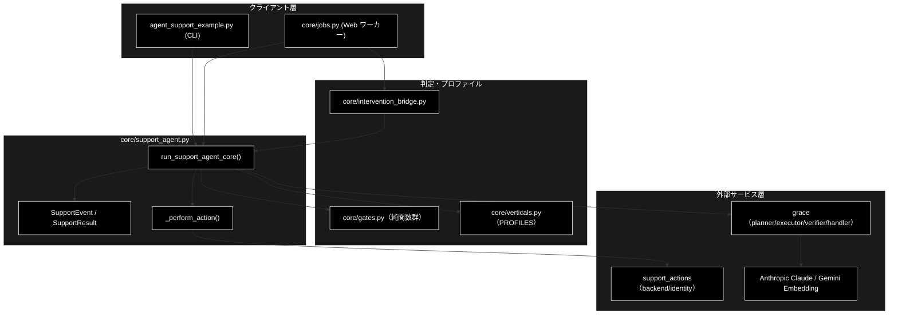
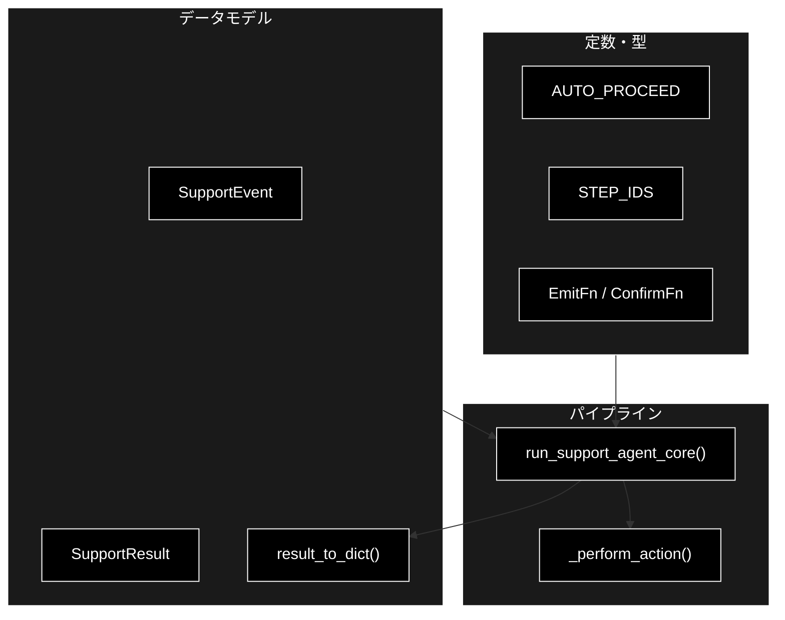
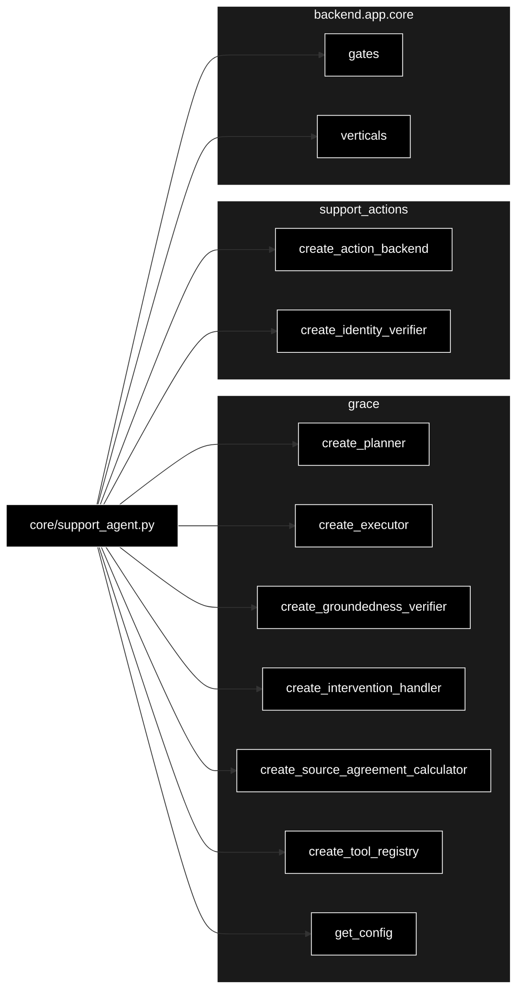

# core/support_agent.py - GRACE-Support コアサービス ドキュメント

**Version 1.0** | 最終更新: 2026-07-15

---

## 目次

1. [概要](#概要)
2. [アーキテクチャ構成図](#1-アーキテクチャ構成図)
3. [モジュール構成図](#2-モジュール構成図)
4. [クラス・関数一覧表](#3-クラス関数一覧表)
5. [クラス・関数 IPO詳細](#4-クラス関数-ipo詳細)
6. [設定・定数](#5-設定定数)
7. [使用例](#6-使用例)
8. [エクスポート](#7-エクスポート)
9. [変更履歴](#8-変更履歴)
10. [付録: 依存関係図](#付録-依存関係図)

---

## 概要

`backend/app/core/support_agent.py` は、GRACE-Support（業界特化・自律型サポートエージェント）の
**UI 非依存・イベント発行型コアサービス**である。CLI 版 `agent_support_example.py` の
`run_support_agent()` から標準出力（print / `_banner`）への密結合を分離した版で、
処理パイプライン（①Plan〜⑥Action、④'・④救済・二段判定）は CLI 版と完全に同一。
変えたのは「入出力の経路」だけで、途中経過は `emit(SupportEvent)` コールバック、
HITL CONFIRM は `confirm` コールバックで解決する。

CLI はこのコアを print に配線する薄いラッパ、Web は `jobs.py`／`InterventionBridge` を
介して SSE ストリームと HTTP 承認へ配線する。LLM は Anthropic Claude、Embedding は
Gemini（検索）。同等性は `backend/tests/test_support_agent_core.py` で固定している。

### 主な責務

- パイプライン進捗を `SupportEvent` として発行（step/log/intervention/result/error）
- ①Plan → ②Execute（内部RAG）→ ③Groundedness → ④回答ゲート → ⑤Web裏取り → ④'情報なし検知 → ⑥Action の統括
- 業界プロファイル（`--vertical`）によるしきい値・検索スコープ・方針の切り替え
- HITL CONFIRM の解決（CLI=自動承認 / Web=InterventionBridge 承認待ち）
- 副作用アクションの本人確認 → CONFIRM → バックエンド実行の統括
- KPI 計測用メタデータ（強制エスカレ・本人確認・情報なし検知・Web再利用）の付与

### 各責務対応のモジュール

| # | 責務 | 対応モジュール | 説明 |
|---|------|--------------|------|
| 1 | 進捗イベント発行 | `support_agent.py` | `SupportEvent` を `emit` で通知 |
| 2 | パイプライン統括 | `support_agent.py` | `run_support_agent_core()` が①〜⑥を実行 |
| 3 | 業界プロファイル適用 | `core/verticals.py` | `PROFILES` からしきい値・スコープを取得 |
| 4 | 回答ゲート等の判定 | `core/gates.py` | 純関数群（`_answer_gate` 他）へ委譲 |
| 5 | HITL 承認の解決 | `core/intervention_bridge.py` | Web の `resolver` を `confirm` に渡す |
| 6 | Plan/Execute/検証/アクション | `grace` / `support_actions.py` | planner/executor/verifier/backend |

### 主要機能一覧

| 機能 | 説明 |
|------|------|
| `SupportEvent` | パイプライン進捗イベント（dataclass） |
| `SupportResult` | サポート回答の結果（dataclass） |
| `result_to_dict()` | `SupportResult` を JSON 化可能な dict へ変換 |
| `run_support_agent_core()` | コアパイプライン本体（イベント発行型） |
| `_perform_action()` | 本人確認 → HITL CONFIRM → バックエンド実行 |
| `AUTO_PROCEED` | CLI 用の自動承認レスポンス（Web では使用禁止） |
| `STEP_IDS` | パイプラインのステップ ID 一覧（UI タイムライン対応） |

---

## 1. アーキテクチャ構成図

### 1.1 システム全体構成



### 1.2 データフロー

1. 呼び出し側（CLI / Web ワーカー）が `run_support_agent_core(query, emit=..., confirm=...)` を実行
2. ①Plan で `planner.create_plan(query)`、②Execute で `executor.execute(plan)`（内部RAG＋動的Web）
3. ③Groundedness で内部回答を検証、④回答ゲートで answer/escalate を判定（＋強制エスカレ＋救済）
4. escalate かつ Web 有効時は⑤で裏取り（重複時は再検証のみ）、④'で「情報なし回答」を検知
5. ⑥で本人確認 → HITL CONFIRM → アクション実行、最後に `result` イベントと `SupportResult` を返す

---

## 2. モジュール構成図

### 2.1 内部モジュール構成



### 2.2 外部依存関係

| ライブラリ | バージョン | 用途 |
|-----------|-----------|------|
| `dataclasses` | 標準 | `SupportEvent` / `SupportResult` の定義・`asdict` |
| `os` | 標準 | `ANTHROPIC_API_KEY` の存在チェック |

### 2.3 内部依存モジュール

| モジュール | 用途 |
|-----------|------|
| `backend.app.core.gates` | 回答ゲート・強制エスカレ・情報なし検知・救済・出典整形の純関数群 |
| `backend.app.core.verticals` | `PROFILES` / `ActionRequest` / `Decision` / `Intent` / `DEFAULT_QUERY` / `INTENT_MODEL` |
| `grace` | planner/executor/verifier/intervention handler/tool registry/config |
| `grace.confidence` | `create_groundedness_verifier` |
| `support_actions` | `create_action_backend` / `create_identity_verifier` |

---

## 3. クラス・関数一覧表

### 3.1 クラス一覧

#### SupportEvent

| メソッド | 概要 |
|---------|------|
| （dataclass） | `type` / `step` / `status` / `title` / `message` / `data` を保持する進捗イベント |

#### SupportResult

| メソッド | 概要 |
|---------|------|
| （dataclass） | 回答・出典・groundedness・decision・アクション結果・KPI メタ等を保持する結果 |

### 3.2 関数一覧（カテゴリ別）

#### 変換

| 関数名 | 概要 |
|-------|------|
| `result_to_dict(result)` | `SupportResult` を JSON 化可能な dict にする |

#### アクション

| 関数名 | 概要 |
|-------|------|
| `_perform_action(action, handler, backend, identity_verifier, identity, emit_log)` | 本人確認 → HITL CONFIRM → バックエンド実行 |

#### パイプライン

| 関数名 | 概要 |
|-------|------|
| `run_support_agent_core(query, verbose, use_web, do_action, dry_run, vertical, identity, emit, confirm)` | コアパイプライン本体 |

---

## 4. クラス・関数 IPO詳細

### 4.1 SupportEvent クラス

パイプラインの進捗イベント。`emit` 経由で呼び出し側（CLI=print / Web=SSE）へ渡る。

#### コンストラクタ: `__init__`

**概要**: 進捗イベントを構築する dataclass。

```python
SupportEvent(
    type: str,
    step: Optional[str] = None,
    status: Optional[str] = None,
    title: str = "",
    message: str = "",
    data: Dict[str, Any] = {},
)
```

| パラメータ | 型 | デフォルト | 説明 |
|------------|------|-----------|------|
| `type` | str | - | `step` / `log` / `intervention` / `result` / `error` |
| `step` | Optional[str] | None | ステップ ID（`STEP_IDS` のいずれか） |
| `status` | Optional[str] | None | `started` / `finished` / `skipped`（type=step 時） |
| `title` | str | "" | ステップ開始時の見出し |
| `message` | str | "" | ログメッセージ |
| `data` | Dict[str, Any] | `{}` | 付随データ（result 時は SupportResult の dict） |

| 項目 | 内容 |
|------|------|
| **Input** | `type: str`, `step`, `status`, `title`, `message`, `data` |
| **Process** | フィールドを保持する（振る舞いなし） |
| **Output** | `SupportEvent` インスタンス |

**戻り値例**:
```python
SupportEvent(type="step", step="plan", status="started", title="① Plan（planner）")
```

```python
# 使用例
emit(SupportEvent(type="log", step="gate", message="[gate] answer（未確認注記）"))
```

### 4.2 SupportResult クラス

サポート回答の結果。API レスポンス（`SupportResultModel`）へ JSON 化される。

#### コンストラクタ: `__init__`

**概要**: 回答本文・出典・groundedness・decision・アクション結果・KPI メタを保持する dataclass。

```python
SupportResult(
    answer: Optional[str],
    citations: List[str] = [],
    groundedness: float = 0.0,
    groundedness_decided: int = 0,
    decision: Decision = "escalate",
    warning: bool = False,
    used_web: bool = False,
    source_agreement: Optional[float] = None,
    contradiction: bool = False,
    action: Optional[ActionRequest] = None,
    action_result: Optional[str] = None,
    vertical: Optional[str] = None,
    overall_confidence: float = 0.0,
    intent: Optional[Intent] = None,
    forced_escalate: bool = False,
    identity_checked: bool = False,
    no_info_detected: bool = False,
    web_reused: bool = False,
)
```

| パラメータ | 型 | デフォルト | 説明 |
|------------|------|-----------|------|
| `answer` | Optional[str] | - | 回答本文（escalate 時も内部回答が入りうる） |
| `citations` | List[str] | `[]` | 出典表示（`[社内]` / `[Web]` プレフィックス付き） |
| `groundedness` | float | 0.0 | 支持率（採用した検証結果の support_rate） |
| `groundedness_decided` | int | 0 | 判定できた主張数（supported+contradicted。0=判定不能） |
| `decision` | Decision | "escalate" | `answer` / `escalate` |
| `warning` | bool | False | 中信頼（未確認）の注意書きを付けるか |
| `used_web` | bool | False | Web を使ったか（動的 or ⑤ フォールバック） |
| `source_agreement` | Optional[float] | None | 内部×Web の意味的一致度 |
| `contradiction` | bool | False | 矛盾の可能性 |
| `action` | Optional[ActionRequest] | None | 実施（予定）のアクション |
| `action_result` | Optional[str] | None | アクション結果メッセージ |
| `vertical` | Optional[str] | None | 適用した業界プロファイル |
| `overall_confidence` | float | 0.0 | executor の総合信頼度 |
| `intent` | Optional[Intent] | None | 意図分類の結果 |
| `forced_escalate` | bool | False | エスカレ語による強制エスカレか（KPI） |
| `identity_checked` | bool | False | 本人確認ステップが起動したか（KPI） |
| `no_info_detected` | bool | False | 情報なし検知で escalate に倒したか |
| `web_reused` | bool | False | ⑤で executor の Web 結果を再利用したか |

| 項目 | 内容 |
|------|------|
| **Input** | 上記フィールド（`answer` は必須） |
| **Process** | フィールドを保持する（振る舞いなし） |
| **Output** | `SupportResult` インスタンス |

**戻り値例**:
```python
SupportResult(
    answer="30日以内であれば返品可能です。…",
    citations=["[社内] ec_policy_anthropic/return.md"],
    groundedness=0.83, groundedness_decided=3,
    decision="answer", warning=False, vertical="ec",
)
```

```python
# 使用例
result = run_support_agent_core("返品したい", vertical="ec")
print(result.decision, result.groundedness)
# answer 0.83
```

### 4.3 パイプライン関数

#### `run_support_agent_core`

**概要**: GRACE-Support パイプラインを実行する（CLI 版 `run_support_agent` と同等）。進捗は
`emit`、HITL は `confirm` で解決する。

```python
def run_support_agent_core(
    query: str = DEFAULT_QUERY,
    verbose: bool = False,
    use_web: bool = True,
    do_action: bool = True,
    dry_run: bool = True,
    vertical: Optional[str] = None,
    identity: Optional[Dict[str, str]] = None,
    emit: Optional[EmitFn] = None,
    confirm: Optional[ConfirmFn] = None,
) -> Optional[SupportResult]
```

| パラメータ | 型 | デフォルト | 説明 |
|------------|------|-----------|------|
| `query` | str | `DEFAULT_QUERY` | 問い合わせ内容 |
| `verbose` | bool | False | 詳細ログ（groundedness 内訳等） |
| `use_web` | bool | True | ⑤ Web フォールバックの有効化 |
| `do_action` | bool | True | ⑥ アクション実行の有効化 |
| `dry_run` | bool | True | アクションをドライラン（安全） |
| `vertical` | Optional[str] | None | 業界プロファイル（gov/saas/ec） |
| `identity` | Optional[Dict[str, str]] | None | 本人確認用の識別子 |
| `emit` | Optional[EmitFn] | None | 進捗イベントのコールバック（None=通知なし） |
| `confirm` | Optional[ConfirmFn] | None | HITL 解決コールバック（None=自動承認＝CLI互換） |

| 項目 | 内容 |
|------|------|
| **Input** | `query`, `verbose`, `use_web`, `do_action`, `dry_run`, `vertical`, `identity`, `emit`, `confirm` |
| **Process** | 1. `ANTHROPIC_API_KEY` チェック（未設定なら error イベント→None）<br>2. config/planner/executor/verifier/handler を生成、意図分類・情報なし判定をメモ化配線<br>3. S1 業界プロファイル適用（検索スコープ・方針を config へ注入）<br>4. ①Plan → ②Execute（内部RAG＋動的Web検知）<br>5. ③Groundedness → ④回答ゲート＋強制エスカレ＋④救済<br>6. ⑤Web フォールバック（escalate かつ非強制時。重複時は再検証のみ）<br>7. ④'情報なし回答検知（Webのみ出典は強制判定）<br>8. ⑥本人確認→HITL CONFIRM→アクション実行<br>9. KPI メタ付与→`result` イベント発行 |
| **Output** | `Optional[SupportResult]`: 成功時は結果、APIキー未設定時は `None` |

**戻り値例**:
```python
SupportResult(
    answer="…", citations=["[社内] …", "[Web] …（https://…）"],
    groundedness=0.75, decision="answer", warning=True,
    used_web=True, web_reused=True, vertical="ec",
)
```

```python
# 使用例（Web ワーカーからの配線）
events = []
result = run_support_agent_core(
    "返品したい", vertical="ec",
    emit=events.append,             # SSE ストリームへ配線
    confirm=bridge.resolver,        # InterventionBridge の承認待ち
)
```

### 4.4 アクション関数

#### `_perform_action`

**概要**: 本人確認 → HITL（CONFIRM 承認）→ バックエンド実行 の順でアクションを行う。未確認・
タイムアウト時は安全側（実行せず有人対応）に倒す。

```python
def _perform_action(
    action: ActionRequest,
    handler,
    backend,
    identity_verifier=None,
    identity: Optional[Dict[str, str]] = None,
    emit_log: Optional[Callable[[str], None]] = None,
) -> str
```

| パラメータ | 型 | デフォルト | 説明 |
|------------|------|-----------|------|
| `action` | ActionRequest | - | 実行するアクション（action_type / args） |
| `handler` | InterventionHandler | - | HITL 承認ハンドラ |
| `backend` | ActionBackend | - | 実行先（dry-run/webhook/pseudo） |
| `identity_verifier` | 任意 | None | 本人確認器（None なら本人確認スキップ） |
| `identity` | Optional[Dict[str, str]] | None | 提示された識別子 |
| `emit_log` | Optional[Callable[[str], None]] | None | ログ出力先（None なら print） |

| 項目 | 内容 |
|------|------|
| **Input** | `action`, `handler`, `backend`, `identity_verifier`, `identity`, `emit_log` |
| **Process** | 1. 本人確認（未確認なら有人へ引き継ぎメッセージを返す）<br>2. `ActionDecision(CONFIRM)` を `handler.handle()`<br>3. 非承認: timeout→エスカレ / それ以外→キャンセル<br>4. 承認: `backend.execute(action_type, args)` |
| **Output** | `str`: 実行結果／引き継ぎ／タイムアウト／キャンセルのメッセージ |

**戻り値例**:
```python
"[dry-run] create_ticket を受け付けました（チケットID: TCK-0001）"
```

```python
# 使用例
msg = _perform_action(action, handler, backend,
                      identity_verifier=verifier, identity={"order_id": "A1"})
print(msg)
```

---

## 5. 設定・定数

### 5.1 STEP_IDS

パイプラインのステップ ID（UI タイムライン表示と対応）。

```python
STEP_IDS = (
    "profile", "plan", "execute", "confidence",
    "gate", "web", "no_info", "action",
)
```

| 値 | 説明 |
|----|------|
| `profile` | S1 業界プロファイル適用（`--vertical` 指定時のみ） |
| `plan` | ① Plan |
| `execute` | ② Execute（内部RAG → reasoning） |
| `confidence` | ③ Groundedness |
| `gate` | ④ 回答ゲート＋強制エスカレ＋④救済 |
| `web` | ⑤ Web フォールバック |
| `no_info` | ④' 情報なし回答検知 |
| `action` | ⑥ Action（本人確認 → HITL CONFIRM → 実行） |

### 5.2 AUTO_PROCEED

```python
AUTO_PROCEED = InterventionResponse(action=InterventionAction.PROCEED)
```

| 定数名 | 用途 | 注意 |
|-------|------|------|
| `AUTO_PROCEED` | 非対話 CLI 用の自動承認（実行はドライランで安全） | ⚠️ Web（`backend.app.api`）では使用禁止。承認は必ず `InterventionBridge` を経由する（受け入れ条件 §5-2） |

---

## 6. 使用例

### 6.1 基本的なワークフロー（CLI 相当・自動承認）

```python
from backend.app.core.support_agent import run_support_agent_core

result = run_support_agent_core(
    query="パスワードを忘れました",
    vertical=None,
    emit=lambda e: print(f"[{e.type}] {e.step} {e.message}"),
    # confirm 省略 → AUTO_PROCEED（ドライランで安全）
)
print(result.decision, result.answer)
```

### 6.2 応用ワークフロー（Web・SSE ＋ HITL 承認待ち）

```python
from backend.app.core.intervention_bridge import InterventionBridge

events = []
bridge = InterventionBridge(emit=events.append)

result = run_support_agent_core(
    query="返品したい", vertical="ec", dry_run=True,
    emit=events.append,        # → SSE で逐次配信
    confirm=bridge.resolver,   # → CONFIRM でフロント承認待ち
)
# events には step/log/intervention/result が seq 順に蓄積される
```

---

## 7. エクスポート

本モジュールに `__all__` 定義はない。他モジュール（`jobs.py` / `intervention_bridge.py` /
`agent_support_example.py`）から参照される主なシンボル:

```python
# 公開シンボル（明示的 __all__ はなし）
SupportEvent
SupportResult
result_to_dict
run_support_agent_core
AUTO_PROCEED
STEP_IDS
EmitFn        # type alias: Callable[[SupportEvent], None]
ConfirmFn     # type alias: Callable[[InterventionRequest], InterventionResponse]
```

---

## 8. 変更履歴

| バージョン | 変更内容 |
|-----------|---------|
| 1.0 | 初版作成（イベント発行型コアパイプライン・SupportEvent/SupportResult・_perform_action の IPO ドキュメント） |

---

## 付録: 依存関係図


