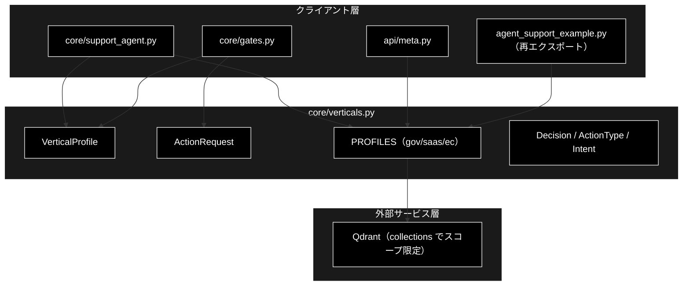
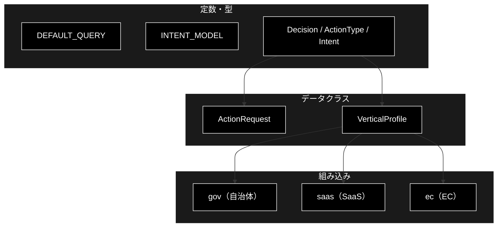
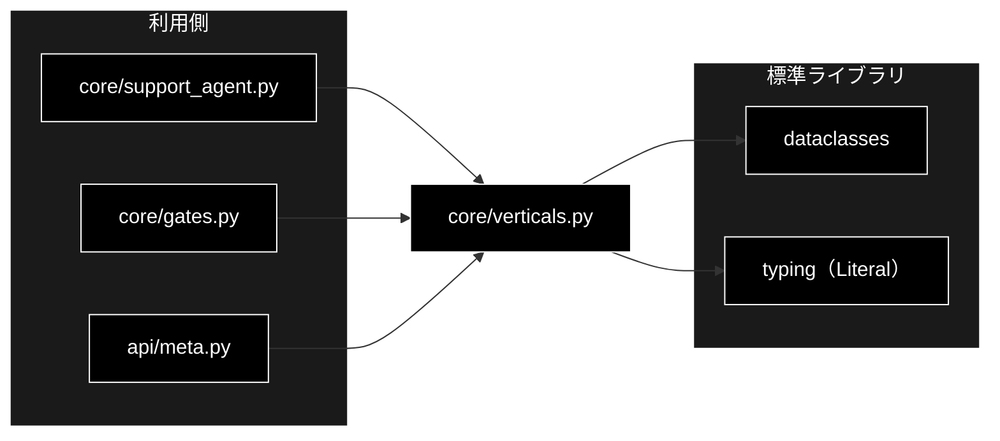

# core/verticals.py - 業界プロファイル定義 ドキュメント

**Version 1.0** | 最終更新: 2026-07-15

---

## 目次

1. [概要](#概要)
2. [アーキテクチャ構成図](#1-アーキテクチャ構成図)
3. [モジュール構成図](#2-モジュール構成図)
4. [クラス・関数一覧表](#3-クラス関数一覧表)
5. [クラス・関数 IPO詳細](#4-クラス関数-ipo詳細)
6. [設定・定数](#5-設定定数)
7. [使用例](#6-使用例)
8. [エクスポート](#7-エクスポート)
9. [変更履歴](#8-変更履歴)
10. [付録: 依存関係図](#付録-依存関係図)

---

## 概要

`backend/app/core/verticals.py` は、GRACE-Support の**業界プロファイル（VerticalProfile）定義**を
提供するモジュール。`agent_support_example.py` から移設（React マイグレーション）したもので、
CLI・API の双方から参照される（後方互換のため `agent_support_example` が再エクスポート）。

業界プロファイルは、検索スコープ（Qdrant コレクション）・強制エスカレ語・アクション対応・
本人確認要否・しきい値・業界方針を 1 つの枠にまとめ、`--vertical`（gov/saas/ec）で切り替える。
組み込みで自治体・SaaS・EC の 3 プロファイル（`PROFILES`）を持つ。意図分類には Anthropic の
軽量モデル `claude-haiku-4-5-20251001`（`INTENT_MODEL`）を使う。

### 主な責務

- 業界プロファイルのデータ構造（`VerticalProfile`）とアクション要求（`ActionRequest`）の定義
- 型エイリアス（`Decision` / `ActionType` / `Intent`）の定義
- 組み込みプロファイル（`PROFILES`: gov / saas / ec）の提供
- 既定クエリ（`DEFAULT_QUERY`）と意図分類モデル（`INTENT_MODEL`）の定義

### 各責務対応のモジュール

| # | 責務 | 対応モジュール | 説明 |
|---|------|--------------|------|
| 1 | プロファイル構造 | `verticals.py` | `VerticalProfile` dataclass |
| 2 | アクション要求 | `verticals.py` | `ActionRequest` dataclass |
| 3 | 型エイリアス | `verticals.py` | `Decision` / `ActionType` / `Intent` |
| 4 | 組み込みプロファイル | `verticals.py` | `PROFILES`（gov/saas/ec） |

### 主要機能一覧

| 機能 | 説明 |
|------|------|
| `ActionRequest` | 副作用のある操作の要求（v3・擬似） |
| `VerticalProfile` | 業界プロファイル（差し替えの共通枠） |
| `PROFILES` | 組み込みプロファイル辞書（gov/saas/ec） |
| `DEFAULT_QUERY` | 既定クエリ |
| `INTENT_MODEL` | 意図分類の軽量モデル |
| `Decision` / `ActionType` / `Intent` | 型エイリアス（Literal） |

---

## 1. アーキテクチャ構成図

### 1.1 システム全体構成



### 1.2 データフロー

1. `run_support_agent_core(vertical=...)` が `PROFILES.get(vertical)` でプロファイルを取得
2. `profile.collections` を `config.qdrant.allowed_collections` に注入し検索スコープを限定
3. `profile.notify_th` / `confirm_th` でしきい値を上書き、`prompt_addendum` を reasoning へ注入
4. `profile.escalate_keywords` / `action_map` / `require_identity` がゲート・アクションで参照される

---

## 2. モジュール構成図

### 2.1 内部モジュール構成



### 2.2 外部依存関係

| ライブラリ | バージョン | 用途 |
|-----------|-----------|------|
| `dataclasses` | 標準 | `ActionRequest` / `VerticalProfile` |
| `typing` | 標準 | `Literal` 型エイリアス |

### 2.3 内部依存モジュール

| モジュール | 用途 |
|-----------|------|
| （なし） | 純粋なデータ定義モジュール（他の backend モジュールへ依存しない） |

---

## 3. クラス・関数一覧表

### 3.1 クラス一覧

#### ActionRequest（dataclass）

| メソッド | 概要 |
|---------|------|
| （dataclass） | action_type / args / requires_confirmation |

#### VerticalProfile（dataclass）

| メソッド | 概要 |
|---------|------|
| （dataclass） | name / collections / escalate_keywords / action_map / require_identity / notify_th / confirm_th / prompt_addendum |

### 3.2 関数一覧

本モジュールに関数定義はない（データクラス・定数のみ）。

---

## 4. クラス・関数 IPO詳細

### 4.1 ActionRequest クラス

**概要**: 副作用のある操作の要求（v3・擬似）。

```python
ActionRequest(
    action_type: ActionType,
    args: dict = {},
    requires_confirmation: bool = True,
)
```

| パラメータ | 型 | デフォルト | 説明 |
|------------|------|-----------|------|
| `action_type` | ActionType | - | create_ticket / send_reply / escalate_to_human |
| `args` | dict | `{}` | アクション引数 |
| `requires_confirmation` | bool | True | 実行前に CONFIRM が必要か |

| 項目 | 内容 |
|------|------|
| **Input** | `action_type`, `args`, `requires_confirmation` |
| **Process** | 値を保持 |
| **Output** | `ActionRequest` |

**戻り値例**:
```python
ActionRequest("create_ticket", {"query": "返品したい", "matched": "返品"})
```

```python
# 使用例（gates._decide_action）
request = ActionRequest(profile.action_map[matched], {"query": query, "matched": matched})
```

### 4.2 VerticalProfile クラス

**概要**: 業界プロファイル（差し替えの共通枠）。しきい値・エスカレ語・アクション対応・
本人確認をまとめる。設計: `agent_support_verticals.md` §1/§6。

```python
VerticalProfile(
    name: str,
    collections: List[str] = [],
    escalate_keywords: List[str] = [],
    action_map: Dict[str, ActionType] = {},
    require_identity: bool = False,
    notify_th: Optional[float] = None,
    confirm_th: Optional[float] = None,
    prompt_addendum: str = "",
)
```

| パラメータ | 型 | デフォルト | 説明 |
|------------|------|-----------|------|
| `name` | str | - | 表示名（自治体/SaaS/EC） |
| `collections` | List[str] | `[]` | 検索スコープ（実 Qdrant コレクション名） |
| `escalate_keywords` | List[str] | `[]` | 強制エスカレ語 |
| `action_map` | Dict[str, ActionType] | `{}` | 意図キーワード→action_type |
| `require_identity` | bool | False | アクション前に本人確認を必須化 |
| `notify_th` | Optional[float] | None | 高信頼しきい値（None なら config 既定） |
| `confirm_th` | Optional[float] | None | 中信頼しきい値 |
| `prompt_addendum` | str | "" | 業界固有の方針（表示・プロンプト注入用） |

| 項目 | 内容 |
|------|------|
| **Input** | 上記フィールド |
| **Process** | 値を保持（パイプラインが検索スコープ・しきい値・方針として参照） |
| **Output** | `VerticalProfile` |

**戻り値例**:
```python
VerticalProfile(
    name="EC",
    collections=["ec_policy_anthropic", "ec_faq_anthropic"],
    escalate_keywords=["決済", "返金", "破損", "クレーム", "不良品"],
    action_map={"返品": "create_ticket", "交換": "create_ticket"},
    require_identity=True,
    prompt_addendum="注文情報の照会・変更は本人確認必須。…",
)
```

```python
# 使用例
profile = PROFILES.get("ec")
config.qdrant.allowed_collections = list(profile.collections)
```

---

## 5. 設定・定数

### 5.1 PROFILES

組み込みプロファイル（自治体 / SaaS / EC）。`collections` は実 Qdrant コレクション名
（命名規約 `*_anthropic`）。RAG 検索は `config.qdrant.allowed_collections` 経由でスコープ限定。

```python
PROFILES: Dict[str, VerticalProfile] = {
    "gov":  VerticalProfile(name="自治体", ...),
    "saas": VerticalProfile(name="SaaS", ...),
    "ec":   VerticalProfile(name="EC", ...),
}
```

| キー | name | collections | require_identity | notify_th / confirm_th |
|-----|------|-------------|:----------------:|-----------------------|
| `gov` | 自治体 | `gov_faq_anthropic` / `gov_laws_anthropic` / `wikipedia_ja` | False | 0.8 / 0.5（正確性最優先） |
| `saas` | SaaS | `saas_docs_anthropic` / `saas_api_anthropic` | False | None / None（config 既定） |
| `ec` | EC | `ec_policy_anthropic` / `ec_faq_anthropic` | True（注文情報操作） | None / None（config 既定） |

> 📝 **注意**: 未登録のコレクションは自動的に無視され、1 つも登録が無い場合は制限なし
> （既定コレクション横断）で従来どおり動作する。

### 5.2 その他の定数・型

```python
DEFAULT_QUERY = "パスワードを忘れました"
INTENT_MODEL = "claude-haiku-4-5-20251001"  # 意図分類の軽量モデル

Decision   = Literal["answer", "escalate"]
ActionType = Literal["create_ticket", "send_reply", "escalate_to_human"]
Intent     = Literal["question", "request", "incident"]
```

| 定数/型 | 説明 |
|--------|------|
| `DEFAULT_QUERY` | 引数省略時の既定クエリ |
| `INTENT_MODEL` | 二段判定の第 2 段で使う Anthropic 軽量モデル |
| `Decision` | 回答可否（answer / escalate） |
| `ActionType` | アクション種別 |
| `Intent` | 意図分類（question=FAQ質問 / request=実行依頼 / incident=障害報告） |

---

## 6. 使用例

### 6.1 基本的なワークフロー

```python
from backend.app.core.verticals import PROFILES, DEFAULT_QUERY

# プロファイル取得
profile = PROFILES.get("ec")

# 検索スコープ・しきい値・方針を config へ注入（core が行う）
collections = list(profile.collections)          # ["ec_policy_anthropic", "ec_faq_anthropic"]
require_identity = profile.require_identity        # True
addendum = profile.prompt_addendum                 # "注文情報の照会・変更は本人確認必須。…"
```

### 6.2 応用: プロファイルの追加

```python
from backend.app.core.verticals import VerticalProfile, PROFILES

PROFILES["fin"] = VerticalProfile(
    name="金融",
    collections=["fin_faq_anthropic"],
    escalate_keywords=["不正利用", "凍結", "紛失"],
    action_map={"再発行": "create_ticket"},
    require_identity=True,
    notify_th=0.85, confirm_th=0.6,
    prompt_addendum="本人確認必須。断定を避け、公式窓口を案内。",
)
```

---

## 7. エクスポート

`__all__` 定義はない。`support_agent.py` / `gates.py` / `api/meta.py` が個別 import し、
`agent_support_example` が後方互換のため再エクスポートする。

```python
# 公開シンボル（明示的 __all__ はなし）
DEFAULT_QUERY, INTENT_MODEL,
Decision, ActionType, Intent,
ActionRequest, VerticalProfile, PROFILES
```

---

## 8. 変更履歴

| バージョン | 変更内容 |
|-----------|---------|
| 1.0 | 初版作成（ActionRequest / VerticalProfile / PROFILES と型エイリアスの IPO ドキュメント） |

---

## 付録: 依存関係図


