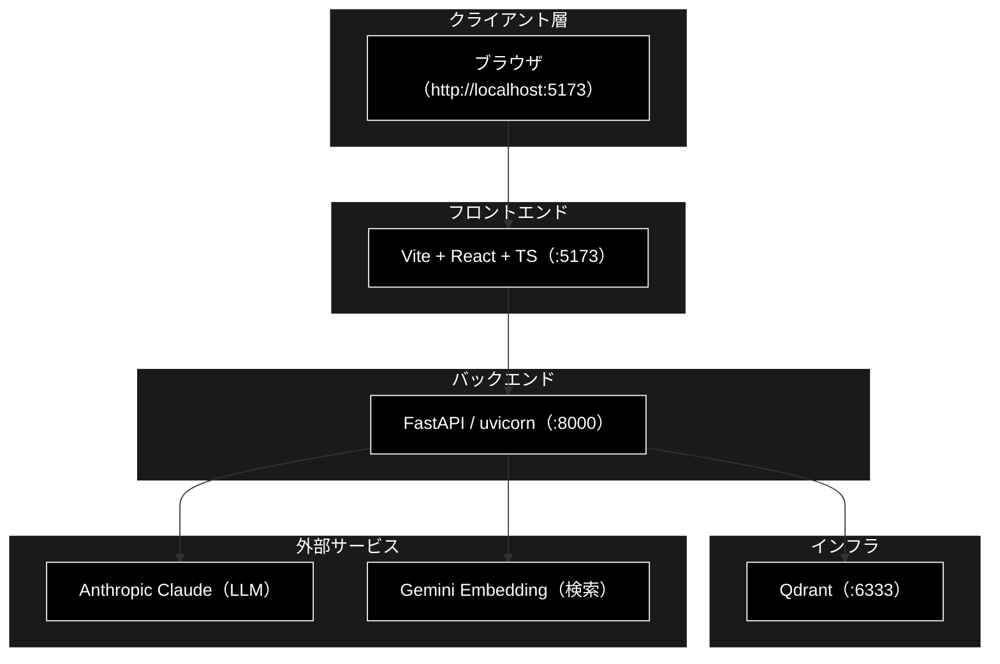

# GRACE-Support インストール・環境設定ガイド

**Version 1.1** | 最終更新: 2026-07-15

GRACE-Support Web アプリ（**FastAPI バックエンド ＋ Vite + React フロントエンド**）を
ローカルで動かすための、インストールと環境設定の手順。認証なし・ローカル開発専用。

---

## 目次

1. [構成の全体像](#1-構成の全体像)
2. [前提ソフトウェア](#2-前提ソフトウェア)
3. [取得と依存インストール](#3-取得と依存インストール)
4. [環境変数（.env）](#4-環境変数env)
5. [Qdrant（ベクトルDB）の起動](#5-qdrantベクトルdbの起動)
6. [起動手順](#6-起動手順)
7. [動作確認](#7-動作確認)
8. [テスト](#8-テスト)
9. [トラブルシューティング](#9-トラブルシューティング)
10. [変更履歴](#10-変更履歴)

---

## 1. 構成の全体像



- **画面は :5173（Vite）で開く。** :8000（FastAPI）は API 専用で、`/` は 404 が正常。
- フロントの `/api/*` は Vite の proxy（`frontend/vite.config.ts`）で :8000 へ中継される（SSE 進捗も同経路）。
- LLM = **Anthropic Claude**（`ANTHROPIC_API_KEY`）、Embedding = **Gemini**（`GOOGLE_API_KEY`）。

---

## 2. 前提ソフトウェア

| ソフトウェア | 推奨バージョン | 用途 | 確認コマンド |
|---|---|---|---|
| Python | **3.11 以上**（`pyproject.toml` の `requires-python = ">=3.11"`） | バックエンド実行 | `python --version` |
| uv | 最新 | Python 依存管理・実行 | `uv --version` |
| Node.js | **18 以上**（Vite 5 / React 18） | フロントエンド開発・ビルド | `node --version` |
| npm | Node 同梱 | フロント依存管理 | `npm --version` |
| Docker / Docker Compose | 最新 | Qdrant 起動 | `docker --version` |

### uv の導入

```bash
# macOS / Linux
curl -LsSf https://astral.sh/uv/install.sh | sh

# Homebrew（macOS）
brew install uv
```

### Node.js の導入（例）

```bash
# Homebrew（macOS）
brew install node
# または nvm
nvm install 20 && nvm use 20
```

---

## 3. 取得と依存インストール

### 3.1 リポジトリ取得

```bash
git clone https://github.com/nakashima2toshio/grace_agent_v2_react_anthropic.git
cd grace_agent_v2_react_anthropic
```

### 3.2 バックエンド依存（uv）

リポジトリルートで実行する。`--extra dev` で pytest 等の開発依存も入る。

```bash
uv sync --extra dev
```

- 主要依存: `fastapi>=0.116.0`, `uvicorn==0.34.0`, `anthropic>=0.111.0`,
  `google-genai>=2.7.0`, `qdrant-client==1.15.1`（`pyproject.toml`）。
- 開発依存（`[project.optional-dependencies].dev`）: `pytest>=8`, `pytest-cov>=5`。

> 📝 `uv sync` は `uv.lock` に基づき仮想環境（`.venv`）を作成する。以降のコマンドは
> `uv run <cmd>` で実行すれば、その仮想環境で動く（`activate` 不要）。

### 3.3 フロントエンド依存（npm）

```bash
cd frontend
npm install
cd ..
```

- 主要依存: `react@^18.3.1`, `react-dom@^18.3.1`。
- 開発依存: `vite@^5.4.11`, `vitest@^2.1.8`, `typescript@^5.6.3`, `@vitejs/plugin-react@^4.3.4`。

---

## 4. 環境変数（.env）

リポジトリルートに `.env` を作成する。バックエンド起動時に `python-dotenv` が読み込む
（`backend/app/main.py`）。

```bash
# .env（リポジトリルート）
ANTHROPIC_API_KEY=sk-ant-xxxxxxxx      # LLM（Plan/Execute/Reasoning/Confidence 等）
GOOGLE_API_KEY=AIzaxxxxxxxx            # Embedding（Gemini gemini-embedding-001）
# QDRANT_URL=http://localhost:6333     # 任意。未指定なら localhost:6333
```

| 変数 | 必須 | 用途 |
|---|:--:|---|
| `ANTHROPIC_API_KEY` | ✅ | すべての LLM 用途（Anthropic Claude） |
| `GOOGLE_API_KEY` | ✅ | Embedding（Gemini。検索・RAG） |
| `QDRANT_URL` | ⚪ | Qdrant の URL（既定 `http://localhost:6333`） |

> 🔑 キーの設定有無は起動後に `GET /api/health` で確認できる
> （`{"status":"ok","anthropic_api_key":true,"google_api_key":true}`）。

> ⚠️ `.env` はコミットしないこと（`.gitignore` 済み）。キーは秘匿情報。

---

## 5. Qdrant（ベクトルDB）の起動

`docker-compose/docker-compose.yml` は **Qdrant（:6333）** と **Redis（:6379）** を定義する。
本 Web アプリのバックエンドが必要とするのは **Qdrant のみ**（Redis は Celery 系用途）。

```bash
# まとめて起動（Qdrant + Redis）
docker-compose -f docker-compose/docker-compose.yml up -d

# Qdrant だけ起動したい場合
docker-compose -f docker-compose/docker-compose.yml up -d qdrant
```

- Qdrant: `localhost:6333`（データは docker volume `qdrant_data` に永続化）。
- 状態確認: `curl http://localhost:6333/healthz` もしくは `docker ps`。

> 📝 コレクション（`*_anthropic` など）が未登録でもアプリは起動する。業界プロファイルの
> 検索スコープは、未登録コレクションを自動的に無視する（`core/verticals.py`）。

---

## 6. 起動手順

### 6.1 最短（推奨・1 コマンド）

リポジトリルートの `run_dev.sh` が、依存の用意（`uv sync --extra dev`／frontend の
`npm install`）と backend(:8000)・frontend(:5173) の同時起動をまとめて行う。

```bash
chmod +x run_dev.sh   # 初回のみ
./run_dev.sh
#   → backend:  http://localhost:8000（/docs）
#   → frontend: http://localhost:5173  ← ブラウザで開くのはこちら
#   停止は Ctrl+C（backend / frontend を両方まとめて停止）
```

- Qdrant は別実行（§5）。`run_dev.sh` は起動時に疎通チェックし、未起動なら警告を出す
  （起動自体は続行）。
- ポートを変えたい場合: `BACKEND_PORT=8080 ./run_dev.sh`。

### 6.2 手動（プロセスを分けて起動）

**別々のターミナル**で 2 プロセスを起動する。

```bash
# ターミナル A: バックエンド（リポジトリルートで）
uv run uvicorn backend.app.main:app --reload --port 8000
#   → http://localhost:8000

# ターミナル B: フロントエンド
cd frontend
npm run dev
#   → http://localhost:5173
```

ブラウザで **http://localhost:5173** を開く。

### CLI 版（任意・コア共有）

Web を使わず CLI でパイプラインを実行することもできる（コアは同一）。

```bash
uv run python agent_support_example.py --vertical ec "返品したい"
```

---

## 7. 動作確認

| 確認項目 | URL / コマンド | 期待 |
|---|---|---|
| バックエンド稼働＋キー | `http://localhost:8000/api/health` | `{"status":"ok","anthropic_api_key":true,"google_api_key":true}` |
| API 自動ドキュメント | `http://localhost:8000/docs` | Swagger UI が表示 |
| 業界プロファイル一覧 | `http://localhost:8000/api/verticals` | gov / saas / ec の配列 |
| フロント画面 | `http://localhost:5173` | チャット画面が表示 |

> ℹ️ `http://localhost:8000/`（ルート）は **404 が正常**。FastAPI は `/api/*` のみ提供し、
> 画面は Vite（:5173）が出す。

---

## 8. テスト

```bash
# バックエンド（backend/tests ＋ 既存 tests/ 全体）
uv run pytest

# backend/tests だけ
uv run pytest backend/tests

# フロントエンド
cd frontend
npm test        # vitest（jobReducer）
npm run build   # tsc --noEmit + vite build
```

- CI（`.github/workflows/ci.yml`）: `ruff` / `compile` / `pytest backend/tests` /
  `frontend（tsc + vitest + build）` がブロッキング、レガシー全体スイートは advisory。

---

## 9. トラブルシューティング

| 症状 | 原因 | 対処 |
|---|---|---|
| `http://localhost:8000/` が 404 | 仕様（API 専用） | 画面は **http://localhost:5173** を開く |
| `GET /api/health` で `anthropic_api_key: false` | `.env` 未設定／読み込み前に起動 | ルートの `.env` にキーを設定し、バックエンドを再起動 |
| バックエンド起動時に接続エラー（6333） | Qdrant 未起動 | `docker-compose ... up -d qdrant` で起動 |
| フロントの `/api` が繋がらない | バックエンド未起動／ポート不一致 | :8000 で uvicorn が動いているか確認（proxy 先は `vite.config.ts`） |
| `uv: command not found` | uv 未導入 | §2「uv の導入」を実施 |
| `npm run dev` が失敗 | Node バージョン不足 | Node 18+ を導入（Vite 5 要件） |
| ジョブ結果が消える | インメモリ・完了 50 件上限（`MAX_FINISHED_JOBS`） | 仕様。永続化なし・シングルプロセス前提 |
| CONFIRM が承認されず止まる | HITL 承認待ち（既定 300 秒でタイムアウト） | 画面のモーダルで承認／拒否。タイムアウトは安全側で有人対応へ |

---

## 10. 変更履歴

| バージョン | 変更内容 |
|-----------|---------|
| 1.0 | 初版作成（前提ソフト・uv/npm 依存・.env・Qdrant・起動・動作確認・テスト・トラブルシュート） |
| 1.1 | §6 に「6.1 最短（1 コマンド `./run_dev.sh`）」を追加（backend + frontend の一括起動） |
