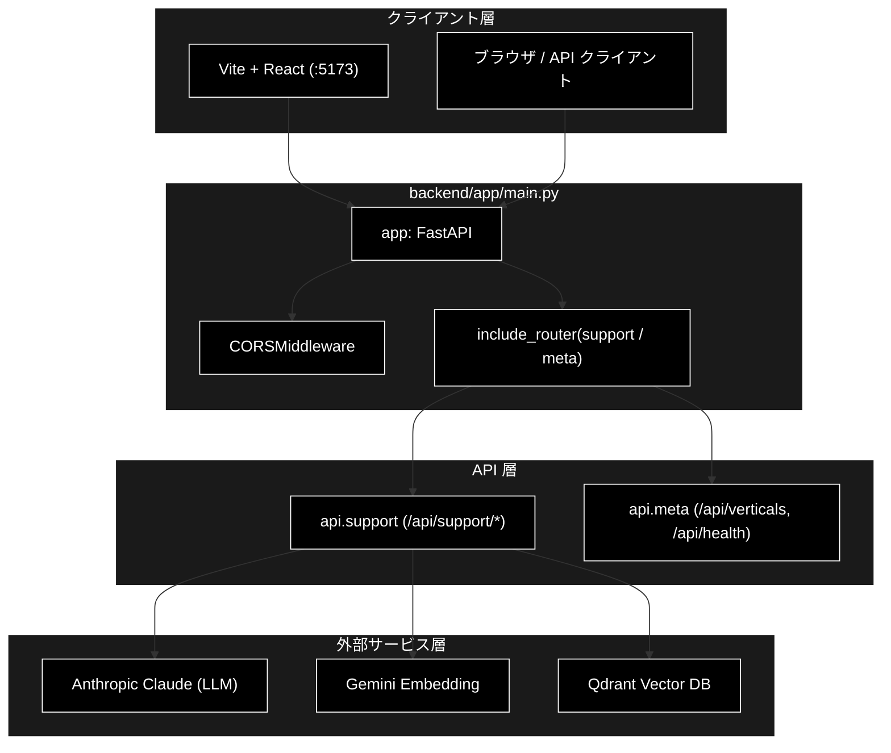
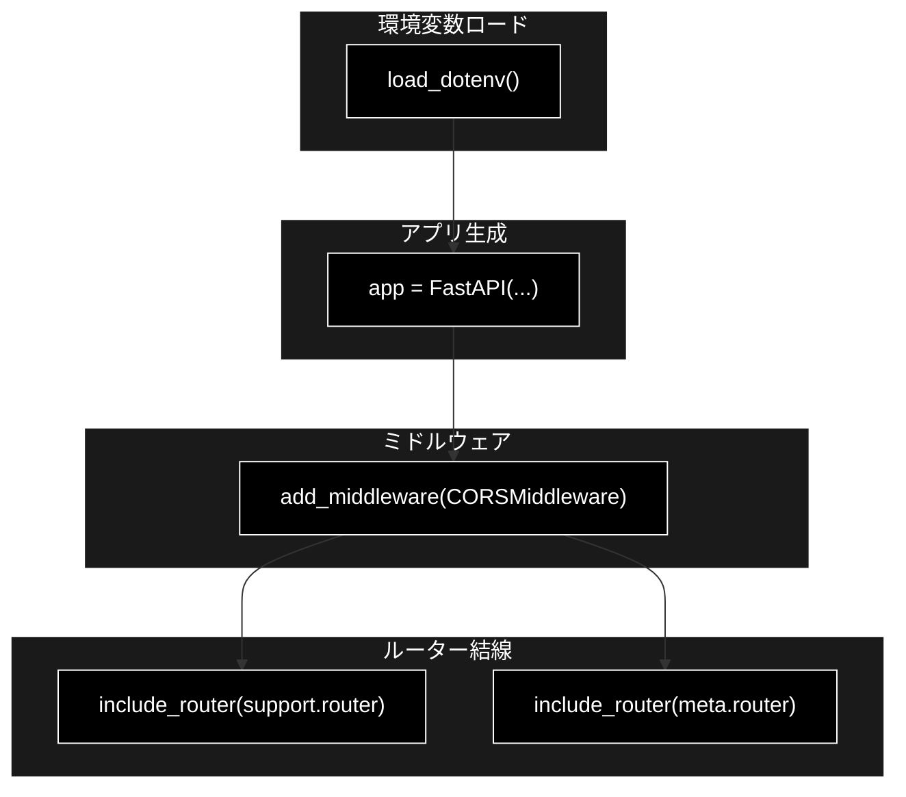
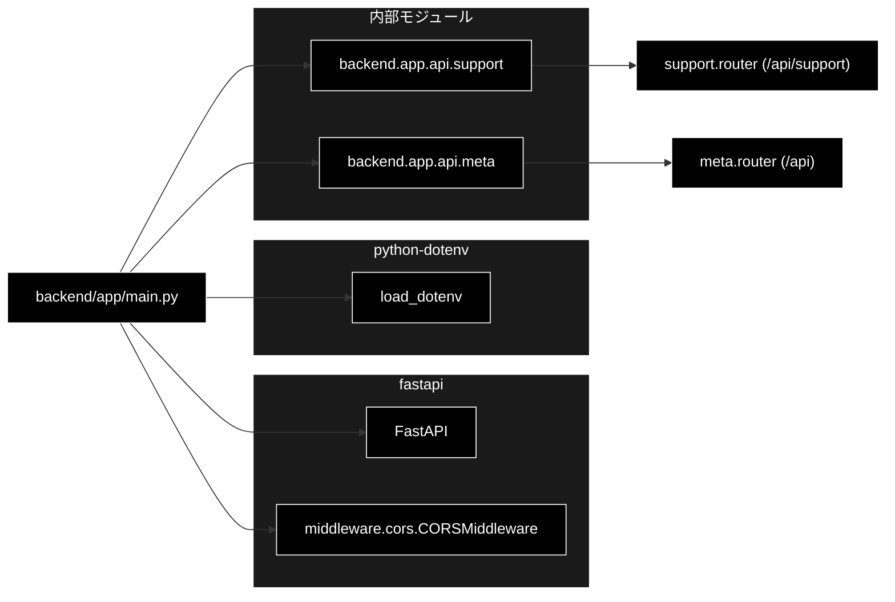

# main.py - GRACE-Support Web API 起動モジュール ドキュメント

**Version 1.0** | 最終更新: 2026-07-15

---

## 目次

1. [概要](#概要)
2. [アーキテクチャ構成図](#1-アーキテクチャ構成図)
3. [モジュール構成図](#2-モジュール構成図)
4. [クラス・関数一覧表](#3-クラス関数一覧表)
5. [クラス・関数 IPO詳細](#4-クラス関数-ipo詳細)
6. [設定・定数](#5-設定定数)
7. [使用例](#6-使用例)
8. [エクスポート](#7-エクスポート)
9. [変更履歴](#8-変更履歴)
10. [付録: 依存関係図](#付録-依存関係図)

---

## 概要

`backend/app/main.py` は、GRACE-Support（業界特化・自律型サポートエージェント）の
**Web API（FastAPI アプリケーション）のエントリポイント**である。CLI 版
`agent_support_example.py` と同一のコアサービス（`backend/app/core/support_agent.py`）を
HTTP/SSE 経由で公開するための「起動と結線」だけを担い、業務ロジックは持たない。

本モジュール自体にクラス・関数は定義されておらず、**モジュールレベルで ASGI アプリ
（`app`）を生成し、CORS ミドルウェアと 2 つの API ルーター（`support` / `meta`）を
結線する**構成である。LLM は Anthropic Claude、Embedding は Gemili（`gemini-embedding-001`）を
用いる（鍵は `.env` の `ANTHROPIC_API_KEY` / `GOOGLE_API_KEY`）。ローカル開発専用で
認証は持たず、CORS は Vite dev サーバ（`http://localhost:5173`）のみ許可する。

### 主な責務

- FastAPI アプリケーション（ASGI `app`）の生成とメタ情報（title/description/version）の設定
- `.env` からの環境変数（`ANTHROPIC_API_KEY` / `GOOGLE_API_KEY` 等）の読み込み
- ローカル開発向け CORS 許可オリジン（Vite dev サーバ）の設定
- サポート問い合わせ API ルーター（`/api/support/*`）の登録
- メタ情報 API ルーター（`/api/verticals` / `/api/health`）の登録

### 各責務対応のモジュール

| # | 責務 | 対応モジュール | 説明 |
|---|------|--------------|------|
| 1 | FastAPI アプリの生成とメタ情報設定 | `backend/app/main.py` | `FastAPI(...)` を生成し `app` として公開 |
| 2 | 環境変数の読み込み | `python-dotenv` | `load_dotenv()` で `.env` を読み込み（未導入でも続行） |
| 3 | CORS 許可オリジンの設定 | `fastapi.middleware.cors` | `CORSMiddleware` で Vite dev サーバのみ許可 |
| 4 | サポート API ルーターの登録 | `backend/app/api/support.py` | `/api/support/*`（query/stream/confirm/result） |
| 5 | メタ API ルーターの登録 | `backend/app/api/meta.py` | `/api/verticals`・`/api/health` |

### 主要機能一覧

| 機能 | 説明 |
|------|------|
| `app` | FastAPI アプリケーションインスタンス（ASGI エントリポイント） |
| `load_dotenv()` | `.env` から環境変数を読み込む（`python-dotenv`。ImportError 時はスキップ） |
| `app.add_middleware(CORSMiddleware, ...)` | Vite dev サーバ向け CORS 許可設定 |
| `app.include_router(support.router)` | サポート問い合わせ API の結線 |
| `app.include_router(meta.router)` | メタ情報 API の結線 |

---

## 1. アーキテクチャ構成図

### 1.1 システム全体構成



### 1.2 データフロー

1. `uvicorn backend.app.main:app` により本モジュールが読み込まれる
2. `load_dotenv()` が `.env` を読み込み、`ANTHROPIC_API_KEY` / `GOOGLE_API_KEY` 等を環境変数化
3. `FastAPI(...)` で `app` を生成し、`CORSMiddleware` を追加（Vite dev サーバのみ許可）
4. `include_router()` で `support`・`meta` の各ルーターを `app` に結線
5. 起動後、クライアント（Vite/ブラウザ）からのリクエストを各ルーターへ委譲

---

## 2. モジュール構成図

### 2.1 内部モジュール構成



### 2.2 外部依存関係

| ライブラリ | バージョン | 用途 |
|-----------|-----------|------|
| `fastapi` | >=0.115.6 | ASGI アプリ（`FastAPI`）・CORS ミドルウェア |
| `python-dotenv` | 任意（未導入可） | `.env` からの環境変数読み込み（`load_dotenv`） |
| `uvicorn` | 任意 | ASGI サーバ（`app` を起動する実行環境。本モジュールは import しない） |

### 2.3 内部依存モジュール

| モジュール | 用途 |
|-----------|------|
| `backend.app.api.support` | サポート問い合わせ API ルーター（`/api/support/*`） |
| `backend.app.api.meta` | メタ情報 API ルーター（`/api/verticals`・`/api/health`） |

---

## 3. クラス・関数一覧表

本モジュールはクラス・関数を定義せず、**モジュールレベルの構成要素**のみで成り立つ。
以下は import した関数・生成したオブジェクトのクイックリファレンス。

### 3.1 モジュールレベル構成要素

| 要素 | 種別 | 概要 |
|------|------|------|
| `app` | オブジェクト（`FastAPI`） | ASGI エントリポイント。`uvicorn backend.app.main:app` で参照される |
| `load_dotenv()` | 呼び出し（`python-dotenv`） | `.env` から環境変数を読み込む（ImportError 時はスキップ） |
| `app.add_middleware(CORSMiddleware, ...)` | 呼び出し | Vite dev サーバ向け CORS 許可設定 |
| `app.include_router(support.router)` | 呼び出し | サポート API を結線 |
| `app.include_router(meta.router)` | 呼び出し | メタ API を結線 |

---

## 4. クラス・関数 IPO詳細

本モジュールには関数・クラス定義がないため、**モジュール実行時（import 時）に評価される
構成要素**を IPO 形式で記述する。

### 4.1 `app`（FastAPI アプリケーションインスタンス）

**概要**: GRACE-Support Web API の ASGI エントリポイント。CLI と同一コアを HTTP/SSE で公開する。

```python
app: FastAPI = FastAPI(
    title="GRACE-Support API",
    description="業界特化・自律型サポートエージェント（内部RAG＋Web裏取り＋HITL アクション）",
    version="1.0.0",
)
```

| パラメータ | 型 | デフォルト | 説明 |
|------------|------|-----------|------|
| `title` | str | "GRACE-Support API" | OpenAPI ドキュメントのタイトル |
| `description` | str | （上記説明文） | OpenAPI ドキュメントの説明 |
| `version` | str | "1.0.0" | API バージョン |

| 項目 | 内容 |
|------|------|
| **Input** | `title: str`, `description: str`, `version: str`（キーワード指定） |
| **Process** | 1. `FastAPI(...)` で ASGI アプリを生成<br>2. `CORSMiddleware` を追加<br>3. `support.router` / `meta.router` を結線 |
| **Output** | `FastAPI`: ルーター・ミドルウェア登録済みの ASGI アプリケーション |

**戻り値例**:
```python
# uvicorn から参照される ASGI アプリ。/docs で下記メタが表示される
{
    "title": "GRACE-Support API",
    "version": "1.0.0",
    "routes": ["/api/support/query", "/api/support/stream/{job_id}",
               "/api/support/confirm/{job_id}", "/api/support/result/{job_id}",
               "/api/verticals", "/api/health"]
}
```

```python
# 使用例（リポジトリルートで実行）
# uvicorn backend.app.main:app --reload --port 8000
from backend.app.main import app  # ASGI アプリを import

print(app.title)    # GRACE-Support API
print(app.version)  # 1.0.0
```

### 4.2 `load_dotenv()`（環境変数の読み込み）

**概要**: `.env` から `ANTHROPIC_API_KEY` / `GOOGLE_API_KEY` 等を読み込む。`python-dotenv`
未導入でもアプリ起動を止めないよう `try/except ImportError` で保護している。

```python
try:
    from dotenv import load_dotenv

    load_dotenv()
except ImportError:
    pass
```

| パラメータ | 型 | デフォルト | 説明 |
|------------|------|-----------|------|
| （なし） | - | - | 既定でカレント基準の `.env` を探索する |

| 項目 | 内容 |
|------|------|
| **Input** | なし（`.env` ファイルを暗黙に参照） |
| **Process** | 1. `python-dotenv` を import 試行<br>2. 成功時 `load_dotenv()` で `.env` を環境変数へ反映<br>3. ImportError 時は `pass`（既存の環境変数のみで続行） |
| **Output** | `None`（副作用として `os.environ` を更新） |

**戻り値例**:
```python
# 副作用として os.environ が更新される
import os
os.getenv("ANTHROPIC_API_KEY")  # -> "sk-ant-..."（.env に定義されていれば）
os.getenv("GOOGLE_API_KEY")     # -> "AIza..."（同上）
```

```python
# 使用例（本モジュール内で import 時に自動実行）
# .env を用意しておけば、以降の api.meta.health() がキー設定を検知できる
# GET /api/health -> {"status": "ok", "anthropic_api_key": true, "google_api_key": true}
```

### 4.3 `app.add_middleware(CORSMiddleware, ...)`（CORS 設定）

**概要**: ローカル開発で Vite dev サーバ（既定 5173）からのクロスオリジンアクセスを許可する。

```python
app.add_middleware(
    CORSMiddleware,
    allow_origins=["http://localhost:5173", "http://127.0.0.1:5173"],
    allow_credentials=True,
    allow_methods=["*"],
    allow_headers=["*"],
)
```

| パラメータ | 型 | デフォルト | 説明 |
|------------|------|-----------|------|
| `allow_origins` | list[str] | `["http://localhost:5173", "http://127.0.0.1:5173"]` | 許可するオリジン（Vite dev サーバのみ） |
| `allow_credentials` | bool | True | クッキー等の資格情報の送信を許可 |
| `allow_methods` | list[str] | `["*"]` | 許可する HTTP メソッド（全許可） |
| `allow_headers` | list[str] | `["*"]` | 許可するリクエストヘッダ（全許可） |

| 項目 | 内容 |
|------|------|
| **Input** | `CORSMiddleware`, `allow_origins`, `allow_credentials`, `allow_methods`, `allow_headers` |
| **Process** | 1. `CORSMiddleware` を `app` のミドルウェアスタックに追加<br>2. 指定オリジンからのプリフライト/実リクエストに CORS ヘッダを付与 |
| **Output** | `None`（`app` にミドルウェアが登録される副作用） |

**戻り値例**:
```python
# プリフライト応答に付与される CORS ヘッダ（Vite からのアクセス時）
{
    "access-control-allow-origin": "http://localhost:5173",
    "access-control-allow-credentials": "true",
    "access-control-allow-methods": "*",
    "access-control-allow-headers": "*"
}
```

```python
# 使用例（frontend/vite.config.ts の proxy 経由アクセス想定）
# :5173 の React から fetch("/api/support/query") -> Vite proxy -> :8000
# CORS 許可済みのため SSE（/api/support/stream/*）も含めてブロックされない
```

### 4.4 `app.include_router(...)`（ルーター結線）

**概要**: サポート API（`support.router`）とメタ API（`meta.router`）を `app` に登録する。
各ルーターは自身に `prefix`（`/api/support`・`/api`）を持つため、本モジュールでは追加の
prefix を与えない。

```python
app.include_router(support.router)
app.include_router(meta.router)
```

| パラメータ | 型 | デフォルト | 説明 |
|------------|------|-----------|------|
| `router` | `APIRouter` | - | 登録するルーター（`support.router` / `meta.router`） |

| 項目 | 内容 |
|------|------|
| **Input** | `support.router: APIRouter`, `meta.router: APIRouter` |
| **Process** | 1. `support.router`（prefix=`/api/support`）を結線<br>2. `meta.router`（prefix=`/api`）を結線<br>3. 各ルーターの経路を `app` の OpenAPI に反映 |
| **Output** | `None`（`app` に経路が登録される副作用） |

**戻り値例**:
```python
# 登録後に app が公開する経路
[
    "POST /api/support/query",
    "GET  /api/support/stream/{job_id}",
    "POST /api/support/confirm/{job_id}",
    "GET  /api/support/result/{job_id}",
    "GET  /api/verticals",
    "GET  /api/health"
]
```

```python
# 使用例
from fastapi.testclient import TestClient
from backend.app.main import app

client = TestClient(app)
resp = client.get("/api/health")
print(resp.json())
# {"status": "ok", "anthropic_api_key": false, "google_api_key": false}
```

---

## 5. 設定・定数

### 5.1 FastAPI アプリメタ情報

`app` 生成時に指定するメタ情報。OpenAPI ドキュメント（`/docs`・`/openapi.json`）に反映される。

```python
app = FastAPI(
    title="GRACE-Support API",
    description="業界特化・自律型サポートエージェント（内部RAG＋Web裏取り＋HITL アクション）",
    version="1.0.0",
)
```

| キー | デフォルト値 | 説明 |
|-----|-------------|------|
| `title` | "GRACE-Support API" | API 名称 |
| `description` | 上記説明文 | API 概要 |
| `version` | "1.0.0" | API バージョン |

### 5.2 CORS 許可オリジン

```python
allow_origins = [
    "http://localhost:5173",
    "http://127.0.0.1:5173",
]
```

| キー | デフォルト値 | 説明 |
|-----|-------------|------|
| `allow_origins` | 上記 2 件 | Vite dev サーバのみ許可（本番配信オリジンは含めない） |
| `allow_credentials` | True | 資格情報付きリクエストを許可 |
| `allow_methods` | `["*"]` | 全メソッド許可 |
| `allow_headers` | `["*"]` | 全ヘッダ許可 |

> 📝 **注意**: 認証なし・ローカル開発専用の設定。公開環境で使う場合は `allow_origins` を
> 実オリジンへ限定し、`allow_methods` / `allow_headers` の全許可も見直すこと。

---

## 6. 使用例

### 6.1 基本的な起動ワークフロー

```bash
# 1. Qdrant を起動（ベクトルDB）
docker-compose -f docker-compose/docker-compose.yml up -d

# 2. 依存を同期し、バックエンドを起動（リポジトリルートで）
uv sync --extra dev
uv run uvicorn backend.app.main:app --reload --port 8000
#   → API: http://localhost:8000 、自動ドキュメント: http://localhost:8000/docs

# 3. フロントエンド（別ターミナル）
cd frontend
npm install
npm run dev
#   → UI: http://localhost:5173（/api は :8000 へ proxy）
```

### 6.2 応用: テストクライアントでの起動確認

```python
from fastapi.testclient import TestClient
from backend.app.main import app

client = TestClient(app)

# ヘルスチェック（APIキー設定の有無を確認）
health = client.get("/api/health").json()
print(health)
# {"status": "ok", "anthropic_api_key": true, "google_api_key": true}

# 業界プロファイル一覧
verticals = client.get("/api/verticals").json()
print([v["id"] for v in verticals])
# ["ec", "saas", "gov", ...]
```

---

## 7. エクスポート

本モジュールに `__all__` 定義はない。外部（`uvicorn` / テスト）から参照される
実質的なエクスポートは ASGI アプリケーション `app` のみ。

```python
# 実質的な公開シンボル
app  # FastAPI インスタンス（uvicorn backend.app.main:app で参照）
```

---

## 8. 変更履歴

| バージョン | 変更内容 |
|-----------|---------|
| 1.0 | 初版作成（FastAPI 起動・CORS・ルーター結線のモジュールドキュメント） |

---

## 付録: 依存関係図


