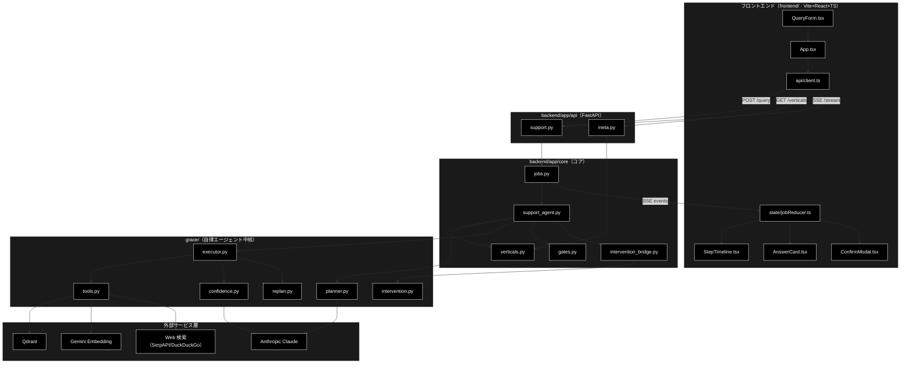
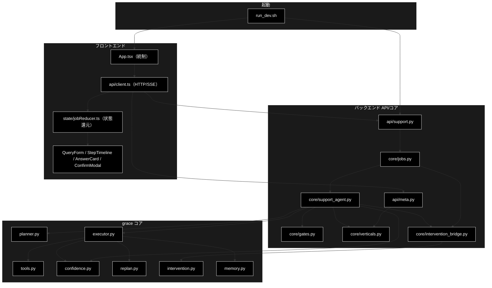
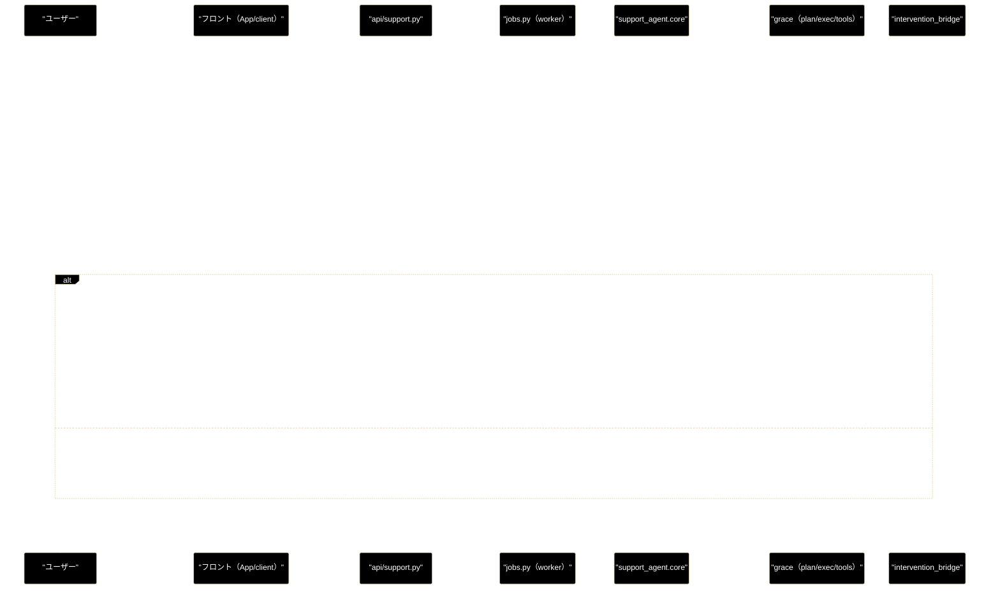
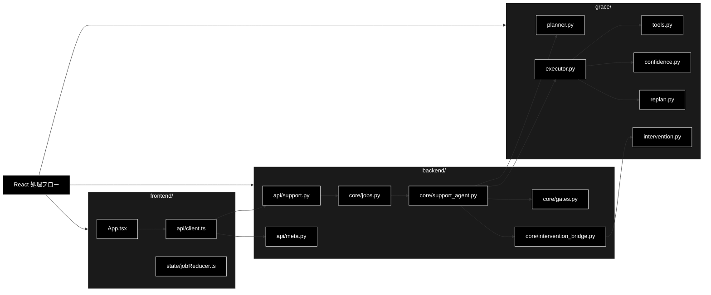

# react_processing_flow - GRACE-Support React 処理フロー（run_dev.sh 起点）ドキュメント

**Version 1.0** | 最終更新: 2026-07-21

---

## 目次

1. [概要](#概要)
2. [アーキテクチャ構成図](#1-アーキテクチャ構成図)
3. [モジュール構成図](#2-モジュール構成図)
4. [処理ステップ一覧表](#3-処理ステップ一覧表)
5. [処理ステップ IPO詳細](#4-処理ステップ-ipo詳細)
6. [エージェントパターン対応](#5-エージェントパターン対応)
7. [リクエストライフサイクル（シーケンス図）](#6-リクエストライフサイクルシーケンス図)
8. [変更履歴](#7-変更履歴)
9. [付録: 依存関係図](#付録-依存関係図)

---

## 概要

本ドキュメントは、`run_dev.sh` で起動する **GRACE-Support の React 版（Web UI + FastAPI + 自律エージェント中核）** の処理の流れを、**処理順のステップ・各ステップの概要・担当モジュール**の観点でまとめたものである。CLI（`agent_support_example.py`）と同一のコア（`backend/app/core/support_agent.py`）を Web から呼ぶ構成で、フロントエンドは `frontend/`（Vite + React + TypeScript）、バックエンドは `backend/`（FastAPI）、推論・検索の中核は `grace/`（Plan/Execute/Confidence/Replan/Intervention）に置かれる。

LLM は **Anthropic Claude**（既定 `claude-sonnet-4-6` / 軽量 `claude-haiku-4-5-20251001`）、Embedding は **Gemini**（`gemini-embedding-001`・3072次元）、ベクタDBは **Qdrant** を用いる。

### 主な責務

- 開発サーバ（backend + frontend）の一括起動と疎通
- 業界プロファイル（gov/saas/ec）の取得と適用
- 問い合わせジョブの起動・進捗の SSE 配信・HITL 応答の注入
- Plan → Execute（内部RAG＋reasoning）→ 信頼度評価 → 根拠検証 → 回答ゲート
- Web 裏取り（相互検証）と「情報なし回答」検知
- アクション（本人確認 → HITL CONFIRM → 実行）と有人エスカレーション
- 進捗タイムライン・最終回答・承認モーダルの描画

### 各責務対応のモジュール

| # | 責務 | 対応モジュール | 説明 |
|---|------|--------------|------|
| 1 | 開発サーバの一括起動 | `run_dev.sh` | `uv sync` → uvicorn(backend:8000) + vite(frontend:5173) |
| 2 | 業界プロファイルの取得 | `backend/app/api/meta.py`, `backend/app/core/verticals.py` | `GET /api/verticals` が `PROFILES` を返す |
| 3 | ジョブ起動・SSE・HITL 応答 | `backend/app/api/support.py`, `backend/app/core/jobs.py` | ワーカースレッド実行＋イベントリプレイ配信 |
| 4 | コアパイプライン（①〜⑥） | `backend/app/core/support_agent.py` | 進捗イベントを emit しながら全工程を統制 |
| 5 | 計画・実行・信頼度・再計画 | `grace/planner.py`, `grace/executor.py`, `grace/tools.py`, `grace/confidence.py`, `grace/replan.py` | Plan & Execute ＋ 評価・最適化ループ |
| 6 | 回答ゲート・強制エスカレ・アクション決定 | `backend/app/core/gates.py` | しきい値判定・エスカレ語×意図分類・アクション選択 |
| 7 | HITL 承認の仲介 | `backend/app/core/intervention_bridge.py`, `grace/intervention.py` | ワーカー ↔ フロント承認の非同期ブリッジ |
| 8 | 進捗・回答・承認の描画 | `frontend/src/*`（`App.tsx` ほか） | SSE を状態に還元して UI を更新 |

### 主要機能一覧

| 機能 | 説明 |
|------|------|
| `run_dev.sh` | backend + frontend の一括起動スクリプト |
| `GET /api/verticals` | 業界プロファイル一覧（UI セレクタ用） |
| `POST /api/support/query` | 問い合わせジョブ起動（202 + `stream_url`） |
| `GET /api/support/stream/{job_id}` | ステップ進捗（①〜⑥）を SSE 配信 |
| `POST /api/support/confirm/{job_id}` | HITL CONFIRM への応答（承認/拒否） |
| `run_support_agent_core()` | イベント駆動のコアパイプライン本体 |
| `JobManager` / `SupportJob` | インメモリのジョブ管理・イベント蓄積 |
| `InterventionBridge` | HITL 承認の非同期仲介（resolver/resolve） |

### 処理ステップ早見表

| ステップ番号 | ステップ名 | 主モジュール名 | 概要 |
|:---:|------|--------------|------|
| A-1 | 開発サーバ起動 | `run_dev.sh` | uv sync → backend(:8000) + frontend(:5173) を同時起動 |
| B-1 | プロファイル取得 | `api/meta.py` | `GET /api/verticals` で業界一覧を取得しセレクタへ反映 |
| C-1 | ジョブ起動 | `core/jobs.py` | `POST /api/support/query` を 202 受理しワーカー起動 |
| C-2 | SSE 購読 | `api/support.py` | `GET /stream/{job_id}` で進捗イベントを逐次配信 |
| ① | 業界プロファイル適用 | `core/verticals.py` | 検索スコープ・しきい値・エスカレ語・方針を切替 |
| ② | Plan（計画） | `grace/planner.py` | 複雑度推定 → 実行計画（rule-based/LLM） |
| ③ | Execute（内部RAG→reasoning） | `grace/executor.py` | ツール実行・ステップ信頼度・必要なら再計画 |
| ④a | Groundedness（根拠検証） | `grace/confidence.py` | 回答主張を出典で検証し支持率を算出 |
| ④b | 回答ゲート＋強制エスカレ | `core/gates.py` | しきい値判定・エスカレ語×意図分類 |
| ⑤ | Web フォールバック（相互検証） | `grace/tools.py` | 内部escalate かつ非強制時に Web 裏取り |
| ④' | 情報なし回答検知 | `core/gates.py` | 「見つからない」型の回答を有人へ倒す |
| ⑥ | Action（本人確認→HITL→実行） | `core/support_agent.py` | アクション決定・承認・実行/エスカレ |
| E-1 | 状態還元・描画 | `state/jobReducer.ts` | SSE を状態に還元し進捗/回答/承認を描画 |
| F-1 | 承認応答注入 | `core/intervention_bridge.py` | 承認/拒否をワーカーへ注入し承認待ちを解除 |

---

## 1. アーキテクチャ構成図

### 1.1 システム全体構成



### 1.2 データフロー

1. `run_dev.sh` が backend（uvicorn:8000）と frontend（vite:5173）を起動する。
2. ブラウザが `frontend` をロードし、`App.tsx` が `GET /api/verticals` で業界プロファイルを取得する（Vite プロキシ経由で `127.0.0.1:8000` へ中継）。
3. ユーザーが問い合わせを送信 → `POST /api/support/query` がジョブを起動し `202 + stream_url` を返す。
4. フロントが `GET /api/support/stream/{job_id}`（SSE）を購読し、進捗イベント（①〜⑥）を逐次受信する。
5. ワーカースレッドが `run_support_agent_core()` を実行し、Plan → Execute → 信頼度 → 根拠検証 → ゲート → Web裏取り → 情報なし検知 → アクション を進める。
6. HITL CONFIRM が発生した場合、`InterventionBridge` が承認待ちになり、`POST /api/support/confirm/{job_id}` の応答でブロック解除する。
7. 最終結果（`SupportResult`）がイベントとして届き、フロントがタイムライン・回答カード・承認モーダルを描画する。

---

## 2. モジュール構成図

### 2.1 内部モジュール構成



### 2.2 外部依存関係

| ライブラリ | 用途 |
|-----------|------|
| `fastapi` / `uvicorn` | Web API サーバ・SSE 配信 |
| `anthropic` | LLM（Plan/Reasoning/Confidence/Groundedness/Intent） |
| `google-genai` | Gemini Embedding（検索用） |
| `qdrant-client` | ベクタ検索（内部RAG） |
| `react` / `vite` | フロントエンド UI・dev サーバ |

### 2.3 内部依存モジュール

| モジュール | 用途 |
|-----------|------|
| `backend.app.core.support_agent` | コアパイプライン（CLI と共有） |
| `grace.executor` / `grace.tools` | ツール実行（rag_search/web_search/reasoning/ask_user） |
| `grace.confidence` | 信頼度集計・LLM 自己評価・根拠検証 |
| `services.qdrant_service` / `qdrant_client_wrapper` | Qdrant 検索・コレクション解決 |
| `helper.helper_embedding` | Gemini/Sparse Embedding クライアント |

---

## 3. 処理ステップ一覧表

| # | フェーズ | ステップ | 概要 | 担当モジュール |
|---|---------|---------|------|--------------|
| A-1 | 起動 | 開発サーバ起動 | uv sync → backend/frontend 同時起動 | `run_dev.sh` |
| B-1 | 初期化 | プロファイル取得 | UI セレクタ用に業界一覧を取得 | `App.tsx`, `api/client.ts`, `api/meta.py`, `verticals.py` |
| C-1 | 送信 | ジョブ起動 | 問い合わせを 202 で受理しワーカー起動 | `QueryForm.tsx`, `api/client.ts`, `api/support.py`, `jobs.py` |
| C-2 | 送信 | SSE 購読 | 進捗イベントの逐次受信を開始 | `api/client.ts`, `api/support.py`, `jobs.py` |
| ① | コア | 業界プロファイル適用 | 検索スコープ・しきい値・エスカレ語・方針を切替 | `support_agent.py`, `verticals.py` |
| ② | コア | Plan（計画） | 複雑度推定 → 実行計画（rule-based/LLM） | `grace/planner.py` |
| ③ | コア | Execute（内部RAG→reasoning） | ツール実行・ステップ信頼度・必要なら再計画 | `grace/executor.py`, `grace/tools.py`, `grace/confidence.py`, `grace/replan.py` |
| ④a | コア | Groundedness（根拠検証） | 回答主張を出典で検証（支持率） | `grace/confidence.py` |
| ④b | コア | 回答ゲート＋強制エスカレ | しきい値判定・エスカレ語×意図分類 | `backend/app/core/gates.py`, `support_agent.py` |
| ⑤ | コア | Web フォールバック（相互検証） | 内部escalate かつ非強制時に Web 裏取り | `grace/tools.py`, `grace/confidence.py` |
| ④' | コア | 情報なし回答検知 | 「見つからない」型の回答を有人へ倒す | `backend/app/core/gates.py`, `support_agent.py` |
| ⑥ | コア | Action（本人確認→HITL→実行） | アクション決定・承認・実行/エスカレ | `support_agent.py`, `gates.py`, `support_actions.py`, `intervention_bridge.py` |
| E-1 | 描画 | 状態還元・描画 | SSE イベントを状態に還元し UI 更新 | `state/jobReducer.ts`, `StepTimeline.tsx`, `AnswerCard.tsx` |
| F-1 | HITL | 承認応答注入 | 承認/拒否をワーカーへ注入 | `ConfirmModal.tsx`, `api/support.py`, `jobs.py`, `intervention_bridge.py` |

---

## 4. 処理ステップ IPO詳細

### 4.A-1 開発サーバ起動

**概要**: `run_dev.sh` が依存を用意し、backend（uvicorn）と frontend（vite）を同時起動する。

**担当モジュール**: `run_dev.sh`（→ `uvicorn backend.app.main:app`, `frontend` の `npm run dev`）

| 項目 | 内容 |
|------|------|
| **Input** | 環境（`.env` に `ANTHROPIC_API_KEY`/`GOOGLE_API_KEY`、Qdrant 起動済み） |
| **Process** | 1. `uv sync --extra dev`（backend 依存）<br>2. `frontend/node_modules` が無ければ `npm install`<br>3. uvicorn(:8000) と vite(:5173) をバックグラウンド起動 |
| **Output** | backend API（`http://127.0.0.1:8000`）と UI（`http://localhost:5173`） |

> 📝 **注意**: Vite の dev プロキシは `/api` を **`http://127.0.0.1:8000`（IPv4）** へ中継する。uvicorn は既定 `127.0.0.1` bind のため、`localhost`（IPv6 優先）にすると `/api/*` が失敗する。

### 4.B-1 プロファイル取得

**概要**: 画面ロード時に業界プロファイル一覧を取得し、セレクタに反映する。

**担当モジュール**: `App.tsx`（`useEffect`）→ `api/client.ts`（`fetchVerticals`）→ `GET /api/verticals` → `api/meta.py` → `verticals.PROFILES`

| 項目 | 内容 |
|------|------|
| **Input** | なし（マウント時に発火） |
| **Process** | 1. `fetchVerticals()` が `/api/verticals` を取得<br>2. `meta.list_verticals()` が `PROFILES`（gov/saas/ec）を `VerticalInfo[]` で返す<br>3. 取得結果を `verticals` state に設定（失敗時は空配列） |
| **Output** | 業界プロファイル配列（`QueryForm` のプルダウンに反映） |

### 4.C-1 ジョブ起動

**概要**: 問い合わせを受理し、ワーカースレッドでコアパイプラインを開始する。

**担当モジュール**: `QueryForm.tsx` → `App.submit` → `api/client.ts`（`startQuery`）→ `POST /api/support/query` → `jobs.JobManager.start`

| 項目 | 内容 |
|------|------|
| **Input** | `QueryParams`（query, vertical, dry_run, use_web, do_action, verbose） |
| **Process** | 1. `start_query` が `JobManager.start` を呼ぶ<br>2. `SupportJob`（job_id・`InterventionBridge`）を生成<br>3. daemon スレッドで `run_support_agent_core` を起動 |
| **Output** | `QueryAccepted`（`job_id`, `stream_url`）を **202** で返す |

**戻り値例**:
```python
{
    "job_id": "1f976248c7da",
    "stream_url": "/api/support/stream/1f976248c7da"
}
```

### 4.C-2 SSE 購読

**概要**: 進捗イベントを先頭からリプレイ購読し、取りこぼしなく受信する。

**担当モジュール**: `api/client.ts`（`subscribeStream`/`EventSource`）→ `GET /api/support/stream/{job_id}` → `jobs.SupportJob.stream_events`

| 項目 | 内容 |
|------|------|
| **Input** | `job_id` |
| **Process** | 1. `stream_events()` がイベント列を先頭から yield<br>2. 新イベントが来ない間は keepalive コメント（`: keepalive`）<br>3. 完了時に `{"type":"done"}` 番兵を送出 |
| **Output** | `text/event-stream`（`data: {SupportEventModel の JSON}`） |

### 4.① 業界プロファイル適用

**概要**: `--vertical` に応じて検索スコープ・しきい値・エスカレ語・アクション対応・本人確認・回答方針を切り替える。

**担当モジュール**: `support_agent.py`（プロファイル解決）, `verticals.PROFILES`

| 項目 | 内容 |
|------|------|
| **Input** | `vertical`（`gov`/`saas`/`ec`/なし） |
| **Process** | 1. `PROFILES[vertical]` を取得<br>2. 検索スコープ（`collections`）・しきい値（`notify_th`/`confirm_th`）・エスカレ語・`action_map`・`prompt_addendum` を確定<br>3. `profile` ステップイベントを emit |
| **Output** | 適用済みプロファイル（後続ステップの前提） |

### 4.② Plan（計画）

**概要**: クエリの複雑度を推定し、実行計画（rule-based または LLM 生成）を作る。**Plan & Execute** の Plan 相当。

**担当モジュール**: `grace/planner.py`（`Planner.create_plan` / `estimate_complexity`）

| 項目 | 内容 |
|------|------|
| **Input** | `query`, プロファイル |
| **Process** | 1. 複雑度を推定（キーワード/LLM）<br>2. `complexity < 0.7` は rule-based の 2 ステップ計画、以上は LLM 計画/ReAct 動的経路<br>3. `plan` ステップイベントを emit |
| **Output** | `ExecutionPlan`（steps: rag_search → reasoning 等） |

### 4.③ Execute（内部RAG → reasoning）

**概要**: 計画に沿ってツールを実行し、各ステップの信頼度を評価する。**Orchestrator-Workers** で `ToolRegistry` を統制し、必要に応じ **Evaluator-Optimizer**（再計画）に回す。

**担当モジュール**: `grace/executor.py`, `grace/tools.py`（`rag_search`/`reasoning`）, `grace/confidence.py`, `grace/replan.py`, `qdrant_client_wrapper.py`, `helper.helper_embedding`

| 項目 | 内容 |
|------|------|
| **Input** | `ExecutionPlan`, プロファイル |
| **Process** | 1. `rag_search`: Gemini 埋め込み → Qdrant 検索（許可コレクションに限定・コサイン類似度フィルタ）<br>2. ステップ信頼度を算出（検索スコア/LLM 自己評価）<br>3. 類似度が閾値未満なら `web_search` フォールバック<br>4. `reasoning`: 参照情報＋業務方針で回答生成<br>5. 低信頼なら `replan`（`ReplanManager`, 閾値 0.4） |
| **Output** | `ExecutionResult`（回答・出典・step信頼度・overall_confidence） |

### 4.④a Groundedness（根拠検証）

**概要**: 生成回答の各主張を出典テキストで検証し、支持率を算出する。**Self-Reflective**（自己内省）相当。

**担当モジュール**: `grace/confidence.py`（`GroundednessVerifier`）

| 項目 | 内容 |
|------|------|
| **Input** | `query`, 回答, 出典テキスト |
| **Process** | 1. 主張を抽出し出典と突き合わせ<br>2. supported/contradicted/total を集計<br>3. 判定可能が 0 の場合は中立（判定不能）とし、フォールバックで回答信頼度を採用 |
| **Output** | `GroundednessResult`（support_rate, supported, total, verified, has_contradiction） |

> 📝 **注意**: 判定可能（decided）が 0 の場合、支持率は「0%」ではなく **判定不能（中立）**。UI は「判定不能」と表示する。

### 4.④b 回答ゲート＋強制エスカレ

**概要**: しきい値（notify/confirm）で回答/確認/エスカレを判定し、プロファイルのエスカレ語×意図分類で強制エスカレを上書きする。

**担当モジュール**: `backend/app/core/gates.py`（`_answer_gate`, `_should_force_escalate`, `_decide_action`）, `support_agent.py`

| 項目 | 内容 |
|------|------|
| **Input** | 支持率・出典数・しきい値・`query`・プロファイル |
| **Process** | 1. `_answer_gate` で `answer`/`escalate` を判定<br>2. エスカレ語一致時のみ意図分類（第2段）を実行し、`incident`/`request` は強制エスカレ<br>3. 出典付き・矛盾なしの実質回答は救済（`answer` 維持） |
| **Output** | `decision`（answer/escalate）, `forced_escalate`, `matched_keyword`, `intent` |

### 4.⑤ Web フォールバック（相互検証）

**概要**: 内部が escalate かつ強制エスカレでない場合に、Web で裏取りし内部回答と相互検証する。**Parallelization/ReAct** の外部行動に相当。

**担当モジュール**: `grace/tools.py`（`WebSearchTool`）, `grace/confidence.py`（`SourceAgreementCalculator`）

| 項目 | 内容 |
|------|------|
| **Input** | `query`, 内部回答, しきい値 |
| **Process** | 1. `web_search` を実行（SerpAPI、フォールバック DuckDuckGo）<br>2. 既に動的 Web 検索済みなら本文スニペットで再検証のみ<br>3. 内部×Web の一致度を算出し矛盾を検出<br>4. Web 側ゲートで最終 `decision` を更新 |
| **Output** | 更新後の `SupportResult`（used_web, source_agreement, contradiction） |

> 📝 **注意**: 強制エスカレ時は本ステップを **スキップ**（`step_skipped("web", reason="強制エスカレ")`）。

### 4.④' 情報なし回答検知

**概要**: 「見つかりませんでした」型の回答が answer で通過するのを防ぎ、有人へ倒す。

**担当モジュール**: `backend/app/core/gates.py`（`_detect_no_info_answer`）, `support_agent.py`

| 項目 | 内容 |
|------|------|
| **Input** | `decision=answer` の回答・出典 |
| **Process** | 1. 定型句候補を検出<br>2. 出典が Web のみの場合は軽量 LLM で二段判定<br>3. 情報なしなら `escalate` に変更 |
| **Output** | `decision`（維持 or escalate）, `no_info_detected` |

### 4.⑥ Action（本人確認 → HITL CONFIRM → 実行）

**概要**: 判定に応じたアクションを決め、副作用のある操作は承認を経て実行する。**Human-in-the-Loop**。

**担当モジュール**: `support_agent.py`（`_perform_action`）, `gates._decide_action`, `support_actions.py`（バックエンド）, `grace/intervention.py`, `intervention_bridge.py`

| 項目 | 内容 |
|------|------|
| **Input** | `decision`, プロファイル, `identity`, `dry_run` |
| **Process** | 1. `_decide_action` でアクション決定（escalate→`escalate_to_human`、`action_map` 一致→`create_ticket`/`send_reply`）<br>2. 本人確認（`require_identity` 時）<br>3. `requires_confirmation=True` のみ HITL CONFIRM（`InterventionBridge`）<br>4. 実行（dry-run/webhook/pseudo）。`escalate_to_human` は承認不要で直接実行 |
| **Output** | `SupportResult`（action, action_result, identity_checked） |

> 📝 **注意**: `escalate_to_human` は「有人対応への引き継ぎそのもの」であり承認を経由しない（承認タイムアウトで引き継ぎが未実行になる循環を回避）。`create_ticket`/`send_reply` は承認必須のまま。

### 4.E-1 状態還元・描画

**概要**: SSE イベントを状態に還元し、進捗タイムライン・回答カード・承認モーダルを更新する。

**担当モジュール**: `state/jobReducer.ts`, `StepTimeline.tsx`, `AnswerCard.tsx`, `ConfirmModal.tsx`, `Markdown.tsx`

| 項目 | 内容 |
|------|------|
| **Input** | `SupportEvent`（step/log/intervention/result/error/done） |
| **Process** | 1. `jobReducer` がイベントをフェーズ状態に還元<br>2. `StepTimeline` が①〜⑥の進捗を表示<br>3. `result` で `AnswerCard`（回答/エスカレ・出典・groundedness）を描画 |
| **Output** | 画面更新（進捗・最終回答） |

### 4.F-1 承認応答注入（HITL 発生時）

**概要**: 承認/拒否をワーカースレッドへ注入し、承認待ちを解除する。

**担当モジュール**: `ConfirmModal.tsx` → `App.respond` → `api/client.ts`（`confirmIntervention`）→ `POST /api/support/confirm/{job_id}` → `jobs.confirm` → `InterventionBridge.resolve`

| 項目 | 内容 |
|------|------|
| **Input** | `job_id`, `intervention_id`, `approve` |
| **Process** | 1. `confirm` が `bridge.resolve` を呼ぶ<br>2. resolver がブロック解除（PROCEED/CANCEL）<br>3. タイムアウト済み/対象なしは `not_waiting`/`not_found` |
| **Output** | `ConfirmResponse`（status: `resolved` / `not_waiting` / `not_found`） |

---

## 5. エージェントパターン対応

本パイプラインは複数のエージェント設計パターンの組み合わせで構成される。

| パターン | 本システムでの実現 | 該当ステップ / モジュール |
|---------|-------------------|------------------------|
| Prompt Chaining（逐次分割） | ①→⑥ の逐次パイプライン | `support_agent.run_support_agent_core` |
| Plan & Execute（計画と実行の分離） | Plan（計画生成）と Execute（実行）を分離 | ② `planner.py` / ③ `executor.py` |
| Orchestrator-Workers（中央制御・役割分担） | Executor が `ToolRegistry` を統制 | ③ `executor.py` + `tools.py`（rag_search/web_search/reasoning/ask_user） |
| Parallelization（並列実行） | 複数コレクションの並列検索 | `agent_parallel_search.py`（`ParallelSearchEngine`） |
| ReAct（推論と行動の反復） | 複雑度 ≥ 0.7 の動的経路 | `services/agent_service.py`（`ReActAgent`）/ Executor dispatch |
| Evaluator-Optimizer（評価・最適化ループ） | 信頼度評価 → 再計画 | ③ `confidence.py` + `replan.py`（閾値 0.4） |
| Self-Reflective（自己内省） | 根拠検証・LLM 自己評価 | ④a `confidence.py`（`GroundednessVerifier`/`LLMSelfEvaluator`） |
| Human-in-the-Loop（人間介入） | CONFIRM 承認・有人エスカレ | ⑥ `intervention.py` + `intervention_bridge.py` |

### 5.1 基本編：8つの必須パターン × モジュール担当

`grace/` と `backend/app/core/` の各モジュールが、8つの必須パターンをどう担うかの対応表。

| # | パターン | `grace/` 担当モジュール | `backend/app/core/` 担当モジュール | 実装概要 |
|:--:|---------|------------------------|-----------------------------------|---------|
| 1 | Prompt Chaining（逐次フェーズ分割） | `executor.py`（ステップ連鎖） | `support_agent.py` | ①→⑥ を逐次連結し、前段の出力を次段の入力にする |
| 2 | Parallelization（並列実行） | `tools.py`（複数コレクション検索） | — | 許可コレクションを横断検索（`ParallelSearchEngine`＝`agent_parallel_search.py`） |
| 3 | Evaluator-Optimizer（評価・最適化ループ） | `confidence.py` / `replan.py` / `calibration.py` / `benchmark.py` | — | 信頼度評価 → 閾値0.4未満で再計画、較正（ECE 縮小）、KPI 計測 |
| 4 | Orchestrator-Workers（中央制御・役割分担） | `executor.py` / `tools.py`（`ToolRegistry`） | `support_agent.py` / `jobs.py` | Executor が rag/web/reasoning/ask_user を統制、Job が実行を編成 |
| 5 | ReAct（推論と行動の反復） | `executor.py`（動的経路） / `tools.py` | — | 複雑度 ≥ 0.7 で推論→行動→観測を反復（`services/agent_service.ReActAgent`） |
| 6 | Self-Reflective（自己内省） | `confidence.py`（`GroundednessVerifier`/`LLMSelfEvaluator`） / `calibration.py` | `gates.py`（情報なし検知） | 生成回答を自己検証（根拠・自己評価・較正） |
| 7 | Plan & Execute（計画と実行の分離） | `planner.py` / `executor.py` / `schemas.py` | `support_agent.py` | 計画生成（Plan）と実行（Execute）を分離し `ExecutionPlan` で受け渡す |
| 8 | Human-in-the-Loop（人間介入） | `intervention.py` | `intervention_bridge.py` / `gates.py` / `support_agent.py` | CONFIRM 承認・強制エスカレ・有人引き継ぎ |

### 5.2 発展編：専門パターン × モジュール担当

| 分類 | パターン | 担当モジュール | 実装概要 |
|------|---------|--------------|---------|
| 目標設定 | Passive / Proactive Goal Creator | `core/verticals.py`（`PROFILES.prompt_addendum`） / `grace/memory.py` | 業界方針で回答目標を設定、実行メモリで事前分布（次回の目標寄せ） |
| モデル最適化 | Prompt Optimizer | `core/verticals.py`（方針注入） / `grace/tools.py`（reasoning プロンプト） | 業務方針（`prompt_addendum`）を reasoning プロンプトに注入 |
| モデル最適化 | RAG | `grace/tools.py`（`rag_search`） / `qdrant_client_wrapper.py` / `helper.helper_embedding` | Gemini 埋め込み × Qdrant の内部検索で回答を根拠付け |
| 計画生成 | Single / Multi-path Plan | `grace/planner.py` / `grace/replan.py` | rule-based/LLM 計画（Single）、失敗時の再計画で代替経路（Multi-path） |
| 反省 | Cross-reflection | `grace/confidence.py`（`SourceAgreementCalculator`） | 内部回答 × Web 回答を独立生成して相互検証（一致度） |
| 反省 | Human Reflection | `grace/intervention.py` / `core/intervention_bridge.py` | 人間の承認/拒否をフィードバックとして取り込む |
| 協調 | Voting / Role / Debate | `grace/confidence.py`（`SourceAgreementCalculator` / `ConfidenceAggregator`）※限定的 | 複数ソース一致度・複数信号の集約による合議的判定（本格的な多エージェント討論は未実装） |
| 安全性・管理 | Guardrails | `core/gates.py` / `grace/schemas.py` / `grace/confidence.py`（groundedness ゲート） | しきい値ゲート・型検証・根拠ゲート・情報なし検知 |
| 安全性・管理 | Registry | `grace/tools.py`（`ToolRegistry`） / `core/verticals.py`（`PROFILES`） | ツール・業界プロファイルの登録簿 |
| 安全性・管理 | Adapter | `grace/llm_compat.py` | google-genai 形式の呼び出しを Anthropic API へ橋渡しする互換アダプタ |
| 安全性・管理 | Evaluator | `grace/confidence.py` / `grace/calibration.py` / `grace/benchmark.py` | 信頼度評価・較正（温度スケーリング）・KPI 計測 |

> 📝 **注記**: 「Voting / Role / Debate」は本システムではソース一致度・信号集約による合議的判定に留まり、独立エージェント同士の討論（Debate）や役割分担投票（Role/Voting）は本格実装していない。

### 5.3 パターンの組み合わせ：実践アーキテクチャ例

GRACE-Support は単一パターンではなく、以下を段階的に重ねて 1 本のパイプラインを構成する。全体は **Prompt Chaining**（①→⑥）で連結される。

| 段階 | 組み合わせる主パターン | `grace/` ・ `backend/app/core/` 担当 | 役割 |
|:--:|---------------------|-------------------------------------|------|
| 骨格 | Plan & Execute | `grace/planner.py` + `grace/executor.py` + `core/support_agent.py` | 計画（Plan）と実行（Execute）を分離した基本骨格 |
| 実行編成 | Orchestrator-Workers | `grace/executor.py` + `grace/tools.py`（`ToolRegistry`） / `core/jobs.py` | Executor がツール群を統制、Job が実行を編成 |
| 検索 | Parallelization ＋ RAG | `grace/tools.py`（`rag_search`） / `qdrant_client_wrapper.py` / `agent_parallel_search.py` | 許可コレクションを並列検索し内部根拠を取得 |
| 複雑クエリ | ReAct | `grace/executor.py`（動的経路） / `services/agent_service.py` | 複雑度 ≥ 0.7 で推論→行動→観測を反復 |
| 品質ループ | Evaluator-Optimizer ＋ Self-Reflective | `grace/confidence.py` + `grace/replan.py` + `grace/calibration.py` | 信頼度評価・根拠検証・較正 → 閾値未達で再計画 |
| 安全弁 | Guardrails | `core/gates.py` + `grace/schemas.py` + groundedness ゲート | しきい値・型・根拠・情報なし検知で回答を守る |
| 人間協調 | Human-in-the-Loop | `grace/intervention.py` + `core/intervention_bridge.py` | 副作用アクションの承認・有人エスカレ |
| 連結 | Prompt Chaining | `core/support_agent.py` | ①〜⑥ を逐次連結し全体を 1 フローに |

> 📝 **対応**: 上記は参考記事の「10. パターンの組み合わせ：実践アーキテクチャ例」に相当する。個々のパターン↔モジュールの対応は §5.1（基本編8）・§5.2（発展編）を参照。

### LLM エージェントの 4 構成要素

| 構成要素 | 役割 | 本システムでの担当 |
|---------|------|-------------------|
| ブレイン | 推論・判断の中核（LLM） | Anthropic Claude（`claude-sonnet-4-6` / 軽量 `claude-haiku-4-5-20251001`） |
| プランニング | タスク分解・計画策定 | `grace/planner.py`（複雑度推定・計画生成） |
| メモリ | 短期（コンテキスト）/ 長期（DB） | `grace/memory.py`・`Scratchpad`・コレクションキャッシュ（`agent_cache.py`）・Qdrant |
| ツール | API・DB・外部サービス連携 | `grace/tools.py`（`ToolRegistry`: rag_search/web_search/reasoning/ask_user） |

---

## 6. リクエストライフサイクル（シーケンス図）



---

## 7. 変更履歴

| バージョン | 変更内容 |
|-----------|---------|
| 1.0 | 初版作成（run_dev.sh 起点の React 処理フロー：起動〜フロント初期化〜ジョブ〜コア①〜⑥〜描画〜HITL、エージェントパターン対応を追加） |

---

## 付録: 依存関係図


