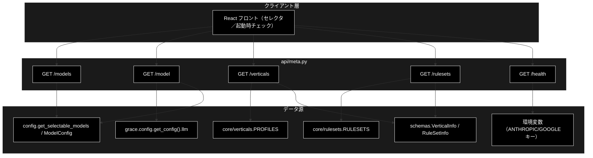
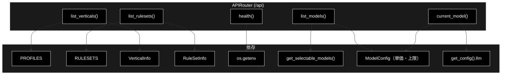
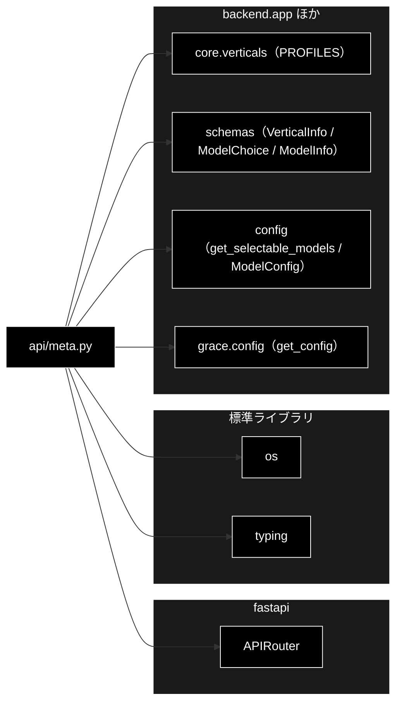

# api/meta.py - メタ情報 API ドキュメント

**Version 1.4** | 最終更新: 2026-09-16

> **本書の位置づけ**: `backend/app/api/meta.py`（モデル一覧 / 業界プロファイル / ルールセット一覧・ヘルスチェック）の **IPO リファレンス**。
> 引くための文書であり、**設計の「なぜ」と処理の流れは上位の文書が正本**である。
>
> | 知りたいこと | 参照先 |
> |---|---|
> | エンドポイント一覧 | [`api_contract.md` §1.5](../api_contract.md) |
> | プロファイル・ルールセットの中身 | [`verticals_and_rulesets.md`](../verticals_and_rulesets.md) |
> | モデル選択の方針・上書き範囲 | [`config_and_providers.md` §3.1](../config_and_providers.md) |
> | API キーの扱い | [`config_and_providers.md` §4](../config_and_providers.md) |
> | 文書全体の地図 | [`README.md`](../README.md) |

---

## 目次

1. [概要](#概要)
2. [アーキテクチャ構成図](#1-アーキテクチャ構成図)
3. [モジュール構成図](#2-モジュール構成図)
4. [クラス・関数一覧表](#3-クラス関数一覧表)
5. [クラス・関数 IPO詳細](#4-クラス関数-ipo詳細)
   - [使用例](#41-使用例)
6. [使用例](#5-使用例)
7. [エクスポート](#6-エクスポート)
8. [変更履歴](#7-変更履歴)
9. [付録: 依存関係図](#付録-依存関係図)

---

## 概要

`backend/app/api/meta.py` は、GRACE-Support の**メタ情報 API**（業界プロファイル一覧・
ヘルスチェック）を提供する FastAPI ルーターモジュール。UI のプロファイルセレクタ用に
組み込み業界プロファイル（`PROFILES`）を返す `GET /api/verticals`、組み込みルールセット
（`RULESETS`）を返す `GET /api/rulesets`、稼働確認・実行前提（APIキー設定有無）を返す
`GET /api/health`、モデルセレクタの選択肢を返す `GET /api/models`、既定モデルの
**解決後**の値を返す `GET /api/model` の 5 エンドポイントを定義する。

LLM は Anthropic Claude（`ANTHROPIC_API_KEY`）、Embedding は Gemini（`GOOGLE_API_KEY`）を
使うため、health は両キーの設定有無を返す。

### 主な責務

- 組み込み業界プロファイル一覧の提供（`GET /api/verticals`）
- 組み込みルールセット一覧の提供（`GET /api/rulesets`）
- 稼働確認と API キー設定有無の可視化（`GET /api/health`）
- モデルセレクタの選択肢の提供（`GET /api/models`）
- 既定モデルの解決結果の提供（`GET /api/model`）

### 各責務対応のモジュール

| # | 責務 | 対応モジュール | 説明 |
|---|------|--------------|------|
| 1 | プロファイル一覧 | `api/meta.py` → `core/verticals.py` | `PROFILES` を `VerticalInfo` へ整形 |
| 1b | ルールセット一覧 | `api/meta.py` → `core/rulesets.py` | `RULESETS` を `RuleSetInfo` へ整形 |
| 2 | ヘルスチェック | `api/meta.py` | `os.getenv` でキー設定有無を返す |
| 3 | 出力スキーマ | `backend/app/schemas.py` | `VerticalInfo` / `RuleSetInfo` / `ModelChoice` / `ModelInfo` |
| 4 | モデル選択肢 | `api/meta.py` → `config.py` | `get_selectable_models()` に単価・上限を添える |
| 5 | 既定モデル | `api/meta.py` → `grace/config.py` | 解決後の `llm.*` とスキーマ既定値を返す |

### 主要機能一覧

| 機能 | 説明 |
|------|------|
| `router` | `APIRouter(prefix="/api")` |
| `list_models()` | GET /models（モデルセレクタの選択肢） |
| `current_model()` | GET /model（既定モデルの解決結果） |
| `list_verticals()` | GET /verticals（業界プロファイル一覧） |
| `list_rulesets()` | GET /rulesets（ルールセット一覧） |
| `health()` | GET /health（稼働確認＋APIキー有無） |

---

## 1. アーキテクチャ構成図

### 1.1 システム全体構成



### 1.2 データフロー

0. フロント（全タブ）が起動時に `GET /api/models` / `GET /api/model` を取得し、
   モデルセレクタと「（既定値: …）」表示を構築
1. フロント（Support タブ）が起動時に `GET /api/verticals` でプロファイル一覧を取得しセレクタを構築
1b. フロント（Review タブ）が起動時に `GET /api/rulesets` でルールセット一覧を取得しセレクタを構築
2. `GET /api/health` で稼働確認と APIキー設定有無を確認（未設定なら注意表示）

---

## 2. モジュール構成図

### 2.1 内部モジュール構成



### 2.2 外部依存関係

| ライブラリ | バージョン | 用途 |
|-----------|-----------|------|
| `fastapi` | >=0.115.6 | `APIRouter` |
| `os` | 標準 | 環境変数（APIキー）の参照 |
| `typing` | 標準 | `Dict` / `List` |

### 2.3 内部依存モジュール

| モジュール | 用途 |
|-----------|------|
| `backend.app.core.verticals` | `PROFILES`（業界プロファイル辞書） |
| `backend.app.core.rulesets` | `RULESETS`（ルールセット辞書） |
| `backend.app.schemas` | `VerticalInfo` / `RuleSetInfo` / `ModelChoice` / `ModelInfo`（出力スキーマ）、`ChunkingRequest` / `QaGenerationRequest`（データ準備側の既定値の引き元） |
| `config`（トップレベル） | `get_selectable_models()` / `ModelConfig`（選択肢・単価・上限） |
| `grace.config` | `get_config().llm`（既定モデルの解決結果） |

---

## 3. クラス・関数一覧表

### 3.1 クラス一覧

本モジュールにクラス定義はない（`router` はモジュールレベルの `APIRouter`）。

### 3.2 関数一覧（エンドポイント）

| 関数名 | メソッド/パス | 概要 |
|-------|--------------|------|
| `list_models()` | GET /models | 選択可能なモデルを単価・上限つきで返す |
| `current_model()` | GET /model | サーバーの既定モデル（解決後）を返す |
| `list_verticals()` | GET /verticals | 組み込み業界プロファイルを返す |
| `list_rulesets()` | GET /rulesets | 組み込みルールセットを返す |
| `health()` | GET /health | 稼働確認とAPIキー設定有無を返す |

---

## 4. クラス・関数 IPO詳細

### 4.1 使用例

#### 4.1.1 基本的なワークフロー（起動確認とメタ取得）

> 📌 **`TestClient` を使うとサーバを起動せずに試せる**（実 API キー・Qdrant 不要の範囲）。
> 実サーバへ投げるなら `./run_dev.sh` の後に `curl http://localhost:8000/...`。

```python
from fastapi.testclient import TestClient
from backend.app.main import app

c = TestClient(app)

# 1. ヘルスチェック（API キー設定の有無が分かる。キーの値は返さない）
print(c.get("/api/health").json())

# 2. 業界プロファイル一覧（基本版タブ以外のセレクタが読む）
print([v["id"] for v in c.get("/api/verticals").json()])

# 3. ルールセット一覧（GRACE-Review のセレクタが読む）
print([r["id"] for r in c.get("/api/rulesets").json()])

# 出力例（.env 未設定の環境で実測）:
# {'status': 'ok', 'anthropic_api_key': False, 'google_api_key': False}
# ['gov', 'saas', 'ec']
# ['ec_ad']
```

> ⚠️ **`status` は API キーが無くても `ok`** である。キーの有無は `anthropic_api_key` /
> `google_api_key` の真偽値で示す（起動の可否とキーの有無は別問題なので分けている）。

#### 4.1.2 プロファイル 1 件に含まれるフィールド

```python
from fastapi.testclient import TestClient
from backend.app.main import app

v = TestClient(app).get("/api/verticals").json()[0]
print(sorted(v))

# 出力例:
# ['action_map', 'collections', 'confirm_th', 'escalate_keywords', 'id', 'name',
#  'notify_th', 'prompt_addendum', 'require_identity']
```

> `prompt_addendum` は**業界固有の方針だけ**を返す（共通の `SCOPE_POLICY` は含まない）。
> 実際に注入されるのは `build_prompt_addendum()` が合成した文字列
> （[`core_verticals.md` §4.1.3](./core_verticals.md#41-使用例)）。


### 4.2 エンドポイント関数

#### `list_models`

**概要**: 3タブ共通のモデルセレクタ用に、選択可能なモデルを単価・上限つきで返す。

```python
@router.get("/models", response_model=List[ModelChoice])
def list_models() -> List[ModelChoice]
```

| パラメータ | 型 | デフォルト | 説明 |
|------------|------|-----------|------|
| （なし） | - | - | 引数なし |

| 項目 | 内容 |
|------|------|
| **Input** | なし |
| **Process** | `get_selectable_models()` の各モデルに `ModelConfig.get_model_pricing()` / `get_model_limits()` を引いて `ModelChoice` へ整形 |
| **Output** | `List[ModelChoice]`: `{id, input_price, output_price, context_window, max_output}` |

**戻り値例**:
```python
[
    {"id": "claude-fable-5-1", "input_price": 0.01, "output_price": 0.05,
     "context_window": 1000000, "max_output": 128000},
    {"id": "claude-opus-5-5", "input_price": 0.004, "output_price": 0.02,
     "context_window": 1000000, "max_output": 128000},
    {"id": "claude-sonnet-5", "input_price": 0.002, "output_price": 0.01,
     "context_window": 1000000, "max_output": 128000},
    {"id": "claude-haiku-4-5", "input_price": 0.001, "output_price": 0.005,
     "context_window": 200000, "max_output": 64000},
]
```

> ⚠️ **旧既定（`claude-sonnet-4-6`）と日付指定エイリアス
> （`claude-haiku-4-5-20251001`）は出てこない。** どちらも実在する有効な
> モデル名で `AVAILABLE_MODELS` には残っている（`CLAUDE.md` R1）。同じモデルが
> 2 行並ぶのを避けるため、**選択肢からだけ外している**。
>
> ⚠️ **Embedding も出てこない。** Gemini `gemini-embedding-001`（3072 次元）固定。

#### `current_model`

**概要**: サーバーが既定として使うモデルの**解決後**の値を返す。UI のヘッダー表示と、
セレクタの「（既定値: …）」に実名を出すために使う。

```python
@router.get("/model", response_model=ModelInfo)
def current_model() -> ModelInfo
```

| パラメータ | 型 | デフォルト | 説明 |
|------------|------|-----------|------|
| （なし） | - | - | 引数なし |

| 項目 | 内容 |
|------|------|
| **Input** | なし |
| **Process** | `get_config().llm` から `model` / `light_model` / `heavy_model` を取り、データ準備側の既定は `ChunkingRequest` / `QaGenerationRequest` の**スキーマ既定値**から引く |
| **Output** | `ModelInfo` |

**戻り値例**:
```python
{"model": "claude-sonnet-5", "light_model": "claude-haiku-4-5-20251001",
 "heavy_model": "", "chunking_model": "claude-haiku-4-5", "qa_model": "claude-sonnet-5"}
```

> ⚠️ **`chunking_model` / `qa_model` は `model` と別物。** チャンク化は軽量モデルを
> 使うので、データ管理タブの「（既定値: …）」に `model` を出すと実際に走る
> モデルと違う名前を表示してしまう。

#### `list_verticals`

**概要**: UI のプロファイルセレクタ用に、組み込み業界プロファイル（`PROFILES`）を `VerticalInfo`
のリストで返す。

```python
@router.get("/verticals", response_model=List[VerticalInfo])
def list_verticals() -> List[VerticalInfo]
```

| パラメータ | 型 | デフォルト | 説明 |
|------------|------|-----------|------|
| （なし） | - | - | 引数なし |

| 項目 | 内容 |
|------|------|
| **Input** | なし |
| **Process** | `PROFILES.items()` を走査し、各 `VerticalProfile` を `VerticalInfo`（id/name/collections/escalate_keywords/action_map/require_identity/notify_th/confirm_th/prompt_addendum）へ整形 |
| **Output** | `List[VerticalInfo]`: 業界プロファイル一覧 |

**戻り値例**:
```python
[
    {"id": "gov", "name": "自治体",
     "collections": ["gov_faq_anthropic", "gov_laws_anthropic", "wikipedia_ja"],
     "escalate_keywords": ["法的", "訴訟", "減免", "個別", "例外", "不服"],
     "action_map": {"申請": "send_reply"}, "require_identity": false,
     "notify_th": 0.8, "confirm_th": 0.5, "prompt_addendum": "条例・公式案内に基づき…"},
    {"id": "saas", "name": "SaaS", ...},
    {"id": "ec", "name": "EC", "require_identity": true, ...}
]
```

```python
# 使用例
GET /api/verticals
# → [{"id": "gov", ...}, {"id": "saas", ...}, {"id": "ec", ...}]
```

#### `list_rulesets`

**概要**: UI のルールセットセレクタ用に、組み込みルールセットを返す。

```python
@router.get("/rulesets", response_model=List[RuleSetInfo])
def list_rulesets() -> List[RuleSetInfo]
```

| パラメータ | 型 | デフォルト | 説明 |
|------------|------|-----------|------|
| （なし） | - | - | 引数なし |

| 項目 | 内容 |
|------|------|
| **Input** | なし |
| **Process** | 1. `RULESETS` を走査<br>2. ルール件数・`always_check` 件数・対象法令（重複排除してソート）を集計<br>3. `RuleSetInfo` へ整形 |
| **Output** | `List[RuleSetInfo]` |

**戻り値例**:
```python
[
    {
        "id": "ec_ad",
        "name": "EC広告表示",
        "collections": ["ec_ad_rules_anthropic", "ec_policy_anthropic"],
        "rule_count": 21,
        "always_check_count": 6,
        "laws": ["医薬品医療機器等法", "景品表示法", "特定商取引法"],
        "critical_keywords": ["No.1", "NO.1", "ナンバーワン", "日本一", "世界一", "..."],
        "action_map": {"修正": "create_ticket", "差し戻し": "send_reply"},
        "notify_th": 0.85,
        "confirm_th": 0.6,
        "prompt_addendum": "景品表示法・特定商取引法・医薬品医療機器等法の条文に基づいて判定し、…"
    }
]
```

```python
# 使用例
GET /api/rulesets
# → [{"id": "ec_ad", "rule_count": 21, ...}]
```

> **`RuleItem.description`（判定基準の本文）は返さない。** LLM プロンプト用で UI では
> 使わないため、件数と対象法令だけを出して選択の判断に足りる情報にとどめている。
> `rules` キー自体がレスポンスに存在しないことは `test_review_api.py` が固定している。

#### `health`

**概要**: 稼働確認と実行前提（APIキー設定有無）を可視化する。

```python
@router.get("/health")
def health() -> Dict[str, object]
```

| パラメータ | 型 | デフォルト | 説明 |
|------------|------|-----------|------|
| （なし） | - | - | 引数なし |

| 項目 | 内容 |
|------|------|
| **Input** | なし |
| **Process** | `os.getenv("ANTHROPIC_API_KEY")` / `os.getenv("GOOGLE_API_KEY")` の有無を bool 化して返す |
| **Output** | `Dict[str, object]`: `{status, anthropic_api_key, google_api_key}` |

**戻り値例**:
```python
{"status": "ok", "anthropic_api_key": true, "google_api_key": false}
```

```python
# 使用例
GET /api/health
# → {"status": "ok", "anthropic_api_key": true, "google_api_key": true}
```

---

## 5. 使用例

### 5.1 基本的なワークフロー（フロント起動時）

```text
0. GET /api/models  /  GET /api/model
   → [{"id": "claude-fable-5-1", ...}, {"id": "claude-opus-5-5", ...}, {"id": "claude-sonnet-5", ...}, {"id": "claude-haiku-4-5", ...}]
   → {"model": "claude-sonnet-5", "light_model": "claude-haiku-4-5-20251001", ...}
   （モデルセレクタの選択肢と「（既定値: …）」表示に反映）

1. GET /api/health
   → {"status": "ok", "anthropic_api_key": true, "google_api_key": true}
   （いずれか false なら「.env にキー未設定」を UI で警告）

2. GET /api/verticals（Support タブ）
   → [{"id": "gov", ...}, {"id": "saas", ...}, {"id": "ec", ...}]
   （プロファイルセレクタの選択肢に反映）

3. GET /api/rulesets（Review タブ）
   → [{"id": "ec_ad", "name": "EC広告表示", "rule_count": 21, ...}]
   （ルールセットセレクタの選択肢に反映）
```

---

## 6. エクスポート

`__all__` 定義はない。`main.py` が `meta.router` を `include_router()` する。

```python
router  # APIRouter(prefix="/api", tags=["meta"])
```

---

## 7. 変更履歴

| バージョン | 日付 | 変更内容 |
|-----------|------|---------|
| 1.5 | 2026-09-23 | `GET /api/models` の戻り値例を 4 件へ更新（`claude-fable-5-1` / `claude-opus-5-5` を追加、`claude-opus-5` を外した） |
| 1.4 | 2026-09-16 | `GET /api/models` / `GET /api/model` を追加（モデルセレクタ）。構成図・一覧表・IPO 詳細・使用例を追随させた |
| 1.3 | 2026-09-16 | 3 階建て再編（`reference/` へ移設）に伴い、冒頭へ**位置づけと上位文書への導線**を追加した |
| 1.2 | 2026-09-15 | **§4.1「使用例」を新設**（2026-09-15）。ドキュメント規約 `a_class_method_md_format.md` §6.1 が IPO 詳細セクションの冒頭に必須としている代表ワークフローが欠落していた。起動確認（health / verticals / rulesets）とプロファイル 1 件のフィールド確認の 2 本を追加し、**実行して出力を確認した**（外部依存が要る例はその旨を明記）。旧 §4.1 は §4.2 へ繰り下げ |
| 1.0 | 2026-07-15 | 初版作成（GET /verticals・GET /health の IPO ドキュメント） |
| 1.1 | 2026-07-29 | `GET /api/rulesets` を追加（PR #41）。既存 2 エンドポイントは無変更 |

---

## 付録: 依存関係図


