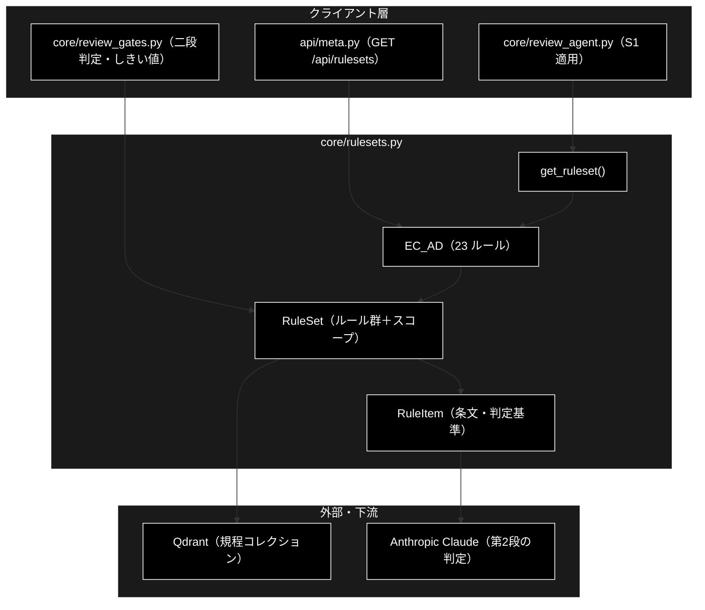
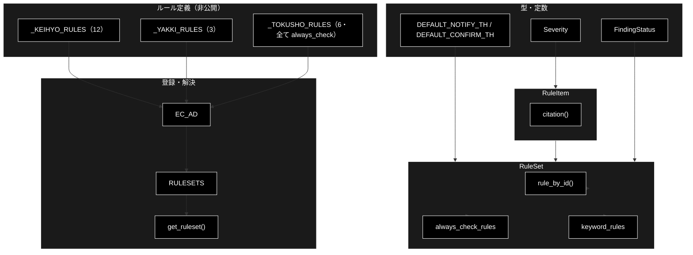
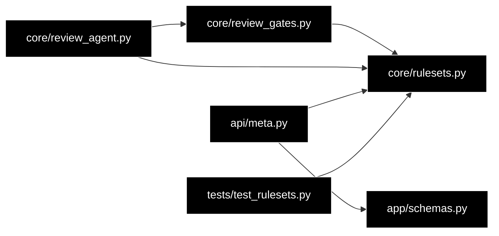

# core/rulesets.py - 文書レビューのルールセット定義 ドキュメント

**Version 1.5** | 最終更新: 2026-09-16

> **本書の位置づけ**: `backend/app/core/rulesets.py`（`RuleSet` / `RuleItem`（`ec_ad`・23 ルール）— **ルール定義の正本**）の **IPO リファレンス**。
> 引くための文書であり、**設計の「なぜ」と処理の流れは上位の文書が正本**である。
>
> | 知りたいこと | 参照先 |
> |---|---|
> | カタログと増やし方 | [`verticals_and_rulesets.md` §2・§3.2](../verticals_and_rulesets.md) |
> | ルールが効く段 | [`review_flow.md` §4.4](../review_flow.md) |
> | 文書全体の地図 | [`README.md`](../README.md) |

---

## 目次

1. [概要](#概要)
2. [アーキテクチャ構成図](#1-アーキテクチャ構成図)
3. [モジュール構成図](#2-モジュール構成図)
4. [クラス・関数一覧表](#3-クラス関数一覧表)
5. [クラス・関数 IPO詳細](#4-クラス関数-ipo詳細)
   - [使用例](#41-使用例)
6. [設定・定数](#5-設定定数)
7. [使用例](#6-使用例)
8. [エクスポート](#7-エクスポート)
9. [変更履歴](#8-変更履歴)
10. [付録: 依存関係図](#付録-依存関係図)

---

## 概要

`backend/app/core/rulesets.py` は、GRACE-Review（文書レビュー）が**何を検査するか**を
定義するモジュール。1 ルールセット = N 個の検査ルール（`RuleItem`）を持ち、
検索スコープ・しきい値・重大リスク語をまとめて保持する。

`verticals.py` の `VerticalProfile`（Support 用の業界プロファイル）と役割は似るが、
**型は分けている**。`VerticalProfile` に 23 個のルール定義を持たせると Support 用の
構造が壊れるため。

初回プロファイルは `ec_ad`（EC 広告表示）で、景品表示法 12 件・特定商取引法 6 件・
医薬品医療機器等法 4 件・社内方針 1 件の計 23 ルールを持つ。

> ⚠️ **本ルールセットは技術検証用のサンプルであり、法務レビューを受けていない。**
> `description` は公開されている条文・ガイドラインの要点を要約したものだが、
> 実運用には法務部門による監修が必須である。

### 主な責務

- 検査ルール（条文・判定基準・キーワード・重大度）の定義
- 二段判定の第1段に渡す候補検出材料（`keywords` / `always_check`）の提供
- ② Retrieve の検索スコープ（`collections`）の提供
- ④' Suppress のしきい値（`notify_th` / `confirm_th`）の提供
- ⑤ Severity の強制 high 用語（`critical_keywords`）の提供
- ルールセット ID からの解決（`get_ruleset`）

### 各責務対応のモジュール

| # | 責務 | 対応モジュール | 説明 |
|---|------|--------------|------|
| 1 | 検査ルールの定義 | `rulesets.py`（`RuleItem`） | 条文・判定基準・重大度を 1 件ずつ保持 |
| 2 | 候補検出材料の提供 | `core/review_gates.py` | `select_candidate_rules()` が第1段で参照 |
| 3 | 検索スコープの提供 | `core/review_agent.py` | `config.qdrant.allowed_collections` へ注入 |
| 4 | しきい値の提供 | `core/review_gates.py` | `decide_finding_status()` / `adjust_severity()` |
| 5 | 強制 high 用語の提供 | `core/review_gates.py` | `should_force_high()` の第1段 |
| 6 | ID からの解決 | `rulesets.py`（`get_ruleset`） | 未知 ID は `None`（S1 をスキップ） |

### 主要機能一覧

| 機能 | 説明 |
|------|------|
| `Severity` | 指摘の重大度（`high` / `medium` / `low`） |
| `FindingStatus` | 指摘の確定状態（`confirmed` / `review_required` / `suppressed`） |
| `RuleItem` | 検査ルール 1 件（条文・判定基準・キーワード） |
| `RuleItem.retrieval_query()` | ② Retrieve の検索クエリ。`evidence_query` の上書きが無ければ `title + description` |
| `RuleItem.citation()` | 根拠フォールバック用の引用ラベルを組み立てる |
| `RuleSet` | ルールセット（ルール群＋スコープ＋しきい値） |
| `RuleSet.rule_by_id()` | ルール ID から `RuleItem` を引く |
| `RuleSet.always_check_rules` | 常時チェック対象のルール（表記漏れ検出用） |
| `RuleSet.keyword_rules` | キーワード一致で候補になるルール |
| `EC_AD` | 組み込みルールセット（EC 広告表示・23 ルール） |
| `RULESETS` | ID → `RuleSet` の登録テーブル |
| `get_ruleset()` | ID からルールセットを解決（未知は `None`） |

---

## 1. アーキテクチャ構成図

### 1.1 システム全体構成



### 1.2 データフロー

1. `review_agent.py` が `get_ruleset(ruleset_id)` でルールセットを解決する
2. `RuleSet.collections` を `config.qdrant.allowed_collections` へ注入し、② Retrieve の検索先を規程に限定する
3. `RuleSet.prompt_addendum` を `config.llm.prompt_addendum` へ注入する
4. 第1段（`select_candidate_rules`）が `always_check_rules` ＋ `keyword_rules` から候補を選ぶ
5. 第2段（LLM）が `RuleItem.description` を判定基準として抵触の有無を返す
6. ④' が `notify_th` / `confirm_th`、⑤ が `critical_keywords` を参照して確定させる

---

## 2. モジュール構成図

### 2.1 内部モジュール構成



### 2.2 外部依存関係

| ライブラリ | バージョン | 用途 |
|-----------|-----------|------|
| （標準ライブラリのみ） | — | `dataclasses` / `typing` |

> 本モジュールは**外部ライブラリに依存しない純データ定義**である。LLM・Qdrant・
> Pydantic のいずれにも触れないため、テストが軽く、import 副作用もない。

### 2.3 内部依存モジュール

| モジュール | 用途 |
|-----------|------|
| （なし） | 他の内部モジュールに依存しない（依存の向きは常に本モジュール ← 利用側） |

---

## 3. クラス・関数一覧表

### 3.1 クラス一覧

#### RuleItem

| メソッド／属性 | 概要 |
|---------|------|
| `rule_id` | ルール ID（例: `keihyo-01`） |
| `title` / `category` / `law` / `article` | 表示・引用に使う条文メタ情報 |
| `description` | 判定基準。第2段のプロンプトと根拠フォールバックに使う |
| `keywords` | 第1段の候補検出語（部分一致） |
| `severity_default` | 重大度の既定値（⑤ で調整される） |
| `always_check` | `True` なら keywords 不問で第2段へ進む |
| `web_check` | `True` なら ⑥ Web 裏取りの対象 |
| `citation()` | `[規程] 法令 条項（タイトル）: 判定基準` を組み立てる |

#### RuleSet

| メソッド／属性 | 概要 |
|---------|------|
| `id` / `name` | ルールセットの識別子と表示名 |
| `collections` | 規程 Qdrant コレクション（検索スコープ） |
| `rules` | `RuleItem` のリスト |
| `critical_keywords` | 強制 high の候補語（⑤ の第1段） |
| `notify_th` / `confirm_th` | ④' の確定・保留しきい値 |
| `action_map` / `prompt_addendum` | アクション対応表とプロンプト追記 |
| `rule_by_id(rule_id)` | ルール ID から `RuleItem` を引く |
| `always_check_rules` | `always_check=True` のルール（プロパティ） |
| `keyword_rules` | `always_check=False` かつ keywords を持つルール（プロパティ） |

### 3.2 関数一覧（カテゴリ別）

#### 解決

| 関数名 | 概要 |
|-------|------|
| `get_ruleset(ruleset_id)` | ID からルールセットを解決する（未知・`None` は `None`） |

---

## 4. クラス・関数 IPO詳細

### 4.1 使用例

#### 4.1.1 基本的なワークフロー（ルールセットの解決）

```python
from backend.app.core.rulesets import get_ruleset

# 1. ruleset ID から解決する（未知の ID は None。S1 はそれを「適用なし」として扱う）
rs = get_ruleset("ec_ad")

# 2. S1 が読むのはこの 3 種（ルール本体・検索スコープ・常時チェックの本数）
print(f"{rs.name}: {len(rs.rules)} ルール / 常時チェック {len(rs.always_check_rules)} 件")
print(f"検索スコープ: {rs.collections}")
print(f"未知の ID: {get_ruleset('unknown')}")

# 出力例:
# EC広告表示: 23 ルール / 常時チェック 7 件
# 検索スコープ: ['ec_ad_rules_anthropic', 'ec_policy_anthropic']
# 未知の ID: None
```

#### 4.1.2 法令別の内訳を数える

```python
import collections
from backend.app.core.rulesets import get_ruleset

rs = get_ruleset("ec_ad")
for law, n in collections.Counter(r.law for r in rs.rules).items():
    print(f"{law}: {n} 件")

# 出力例:
# 景品表示法: 12 件
# 医薬品医療機器等法: 4 件
# 特定商取引法: 6 件
# 社内規程: 1 件
```

> ⚠️ **件数を文書へ書くときは、この方法で数える。** 過去に `RuleSet` へルールを足した際、
> 本書 §5.4 の一覧と `review_spec.md` の表が 21 件のまま取り残された
> （[`docs_audit.md` §1](../docs_audit.md) 問題 #7・#8）。

#### 4.1.3 1 ルールが ②〜④ へ供給するもの

```python
from backend.app.core.rulesets import get_ruleset

rule = get_ruleset("ec_ad").rule_by_id("keihyo-01")

print(f"{rule.rule_id} [{rule.severity_default}] {rule.title}（{rule.law} {rule.article}）")
print(f"第1段の語: {rule.keywords[:5]}")           # ③ Detect の候補検出
print(f"② の検索クエリ: {rule.retrieval_query()[:24]}…")   # ② Retrieve
print(f"④ の根拠フォールバック: {rule.citation()[:24]}…")   # ④ Ground（規程未登録時）

# 出力例:
# keihyo-01 [high] 優良誤認表示（景品表示法 第5条第1号）
# 第1段の語: ['最高', '最強', '世界初', '日本初', '唯一']
# ② の検索クエリ: 優良誤認表示 商品・サービスの品質、規格その他の…
# ④ の根拠フォールバック: [規程] 景品表示法 第5条第1号（優良誤認表示…
```


### 4.2 RuleItem クラス

検査ルール 1 件。条文の要点（`description`）を自己完結的に持つのは、規程コレクションが
未登録でも ④ Ground の根拠として使えるようにするため。

#### コンストラクタ: `__init__`（dataclass 自動生成）

**概要**: 条文メタ情報と判定基準を保持するデータクラス。

```python
RuleItem(
    rule_id: str,
    title: str,
    category: str,
    law: str,
    article: str,
    description: str,
    keywords: List[str] = [],
    severity_default: Severity = "medium",
    always_check: bool = False,
    web_check: bool = False,
    evidence_query: str = "",
    evidence_collections: List[str] = [],
)
```

| パラメータ | 型 | デフォルト | 説明 |
|------------|------|-----------|------|
| `rule_id` | str | - | ルール ID（例: `keihyo-01`）。ルールセット内で一意 |
| `title` | str | - | ルール名（例: `優良誤認表示`） |
| `category` | str | - | 分類（例: `優良誤認`） |
| `law` | str | - | 法令名（例: `景品表示法`） |
| `article` | str | - | 条項（例: `第5条第1号`） |
| `description` | str | - | 判定基準。第2段のプロンプトに埋め込む |
| `keywords` | List[str] | `[]` | 第1段の候補検出語（部分一致） |
| `severity_default` | Severity | `"medium"` | 重大度の既定値 |
| `always_check` | bool | `False` | `True` なら keywords 不問で第2段へ |
| `web_check` | bool | `False` | `True` なら ⑥ Web 裏取りの対象 |
| `evidence_query` | str | `""` | ② Retrieve の検索クエリの上書き。空なら `title + description`（`retrieval_query()`） |
| `evidence_collections` | List[str] | `[]` | ② Retrieve の検索対象コレクションの上書き。空なら `RuleSet.collections` |

| 項目 | 内容 |
|------|------|
| **Input** | 上記パラメータ |
| **Process** | dataclass のフィールド代入のみ（検証ロジックは持たない） |
| **Output** | `RuleItem` インスタンス |

> **注意**: `always_check=True` のルールは `keywords` を持たせない。表記が「無い」ことの
> 検出はキーワード一致では原理的に不可能であり、両方を指定すると意図が二重になる。
> この排他は `backend/tests/test_rulesets.py` が固定している。

> ⚠️ **`evidence_query` / `evidence_collections` は「ルール自身が根拠として引かれる」ルールの逃げ道。**
> 条文コレクション（`ec_ad_rules_anthropic`）には**ルール自身が 1 行として入っている**ため、
> 既定クエリ（`title + description`）はまず自分自身を引き当てる（＝クエリの投げ返し）。
> 条文ルール（`tokusho-*`）はそれで実害が無い（引きたいのが条文そのものだから）が、
> `policy-01` が引きたいのは**自社の実際の規程**であってルール文ではない。
> 実測 2026-08-19 06:11 では自己一致が 0.9380 で居座り、本命の「返品規定（14日）」は 0.6647 で
> 埋もれていた。そこで `policy-01` だけ、取引条件を表す語だけのクエリ
> （`"返品 交換 キャンセル 解約 返金 送料 負担 期限 条件 手数料 …"`）と
> 検索先 `["ec_policy_anthropic"]` を指定している。これで自己一致が候補から消え、
> `evidence_top_ratio` は自社規程どうしの比較になる。

#### メソッド: `citation`

**概要**: 規程コレクションが未登録のときに使う根拠ラベルを組み立てる。

```python
def citation(self) -> str
```

| パラメータ | 型 | デフォルト | 説明 |
|------------|------|-----------|------|
| （なし） | - | - | `self` のみ |

| 項目 | 内容 |
|------|------|
| **Input** | なし（`self` のみ） |
| **Process** | `law` / `article` / `title` / `description` を定型に流し込む |
| **Output** | `str`: `[規程] {law} {article}（{title}）: {description}` |

**戻り値例**:
```python
"[規程] 景品表示法 第5条第1号（優良誤認表示）: 商品・サービスの品質、規格その他の内容について、実際のものよりも著しく優良であると一般消費者に誤認させる表示は禁止される。最上級・唯一性を主張する表現は、客観的な裏付け資料がない限り優良誤認に該当しうる。"
```

```python
# 使用例
from backend.app.core.rulesets import get_ruleset

rule = get_ruleset("ec_ad").rule_by_id("keihyo-01")
print(rule.citation())
# [規程] 景品表示法 第5条第1号（優良誤認表示）: ...
```

---

### 4.3 RuleSet クラス

ルールセット。`review_agent.py` の S1 でこの内容が config へ注入され、以降のステップは
すべてこの範囲で動く。

#### コンストラクタ: `__init__`（dataclass 自動生成）

**概要**: ルール群と、検索スコープ・しきい値・重大リスク語を束ねる。

```python
RuleSet(
    id: str,
    name: str,
    collections: List[str] = [],
    rules: List[RuleItem] = [],
    critical_keywords: List[str] = [],
    notify_th: float = 0.85,
    confirm_th: float = 0.60,
    evidence_min_score: float = 0.70,
    evidence_top_ratio: float = 0.92,
    action_map: Dict[str, str] = {},
    prompt_addendum: str = "",
)
```

| パラメータ | 型 | デフォルト | 説明 |
|------------|------|-----------|------|
| `id` | str | - | ルールセット ID（例: `ec_ad`） |
| `name` | str | - | 表示名（例: `EC広告表示`） |
| `collections` | List[str] | `[]` | 規程 Qdrant コレクション |
| `rules` | List[RuleItem] | `[]` | 検査ルール |
| `critical_keywords` | List[str] | `[]` | 強制 high の候補語 |
| `notify_th` | float | `DEFAULT_NOTIFY_TH`（0.85） | 指摘を自動確定するしきい値 |
| `confirm_th` | float | `DEFAULT_CONFIRM_TH`（0.60） | 保留として残すしきい値 |
| `evidence_min_score` | float | `DEFAULT_EVIDENCE_MIN_SCORE`（0.70） | ② Retrieve で規程を根拠に採用する**絶対**スコアの下限 |
| `evidence_top_ratio` | float | `DEFAULT_EVIDENCE_TOP_RATIO`（0.92） | 同じく Top スコアに対する**相対**比の下限 |
| `action_map` | Dict[str, str] | `{}` | 意図キーワード → `action_type` |
| `prompt_addendum` | str | `""` | reasoning へ注入する方針 |

| 項目 | 内容 |
|------|------|
| **Input** | 上記パラメータ |
| **Process** | dataclass のフィールド代入のみ |
| **Output** | `RuleSet` インスタンス |

#### メソッド: `rule_by_id`

**概要**: ルール ID から `RuleItem` を引く。

```python
def rule_by_id(self, rule_id: str) -> Optional[RuleItem]
```

| パラメータ | 型 | デフォルト | 説明 |
|------------|------|-----------|------|
| `rule_id` | str | - | 探索するルール ID |

| 項目 | 内容 |
|------|------|
| **Input** | `rule_id: str` |
| **Process** | `rules` を線形探索する（23 件のため索引は持たない） |
| **Output** | `Optional[RuleItem]`: 見つからなければ `None` |

**戻り値例**:
```python
RuleItem(rule_id="keihyo-03", title="No.1表示の根拠", law="景品表示法", article="第5条第1号", severity_default="high", web_check=True, ...)
```

```python
# 使用例
ruleset = get_ruleset("ec_ad")
print(ruleset.rule_by_id("keihyo-03").title)   # No.1表示の根拠
print(ruleset.rule_by_id("no-such"))           # None
```

#### プロパティ: `always_check_rules`

**概要**: キーワード不問で必ず第2段へ進むルール（表記漏れの検出用）。

```python
@property
def always_check_rules(self) -> List[RuleItem]
```

| 項目 | 内容 |
|------|------|
| **Input** | なし（`self` のみ） |
| **Process** | `rules` から `always_check=True` を抽出する |
| **Output** | `List[RuleItem]`: `ec_ad` では特定商取引法の 6 件 |

```python
# 使用例
ruleset = get_ruleset("ec_ad")
print([r.rule_id for r in ruleset.always_check_rules])
# ['tokusho-01', 'tokusho-02', 'tokusho-03', 'tokusho-04', 'tokusho-05', 'tokusho-06']
```

#### プロパティ: `keyword_rules`

**概要**: 第1段のキーワード一致で候補になるルール。

```python
@property
def keyword_rules(self) -> List[RuleItem]
```

| 項目 | 内容 |
|------|------|
| **Input** | なし（`self` のみ） |
| **Process** | `rules` から `always_check=False` かつ `keywords` を持つものを抽出する |
| **Output** | `List[RuleItem]`: `ec_ad` では 15 件（景表法 12 ＋ 薬機法 3） |

> `always_check_rules` と `keyword_rules` は**互いに素で、和が全ルール**になる。
> どちらにも入らないルール（`always_check=False` かつ `keywords=[]`）は永久に
> 評価されない死にルールなので、`test_rulesets.py` がこの分割の網羅性を固定している。

---

### 4.4 解決関数

#### `get_ruleset`

**概要**: ルールセット ID から `RuleSet` を解決する。未知 ID・`None` はどちらも `None` を返す。

```python
def get_ruleset(ruleset_id: Optional[str]) -> Optional[RuleSet]
```

| パラメータ | 型 | デフォルト | 説明 |
|------------|------|-----------|------|
| `ruleset_id` | Optional[str] | - | ルールセット ID。`None` ならルールセット未指定 |

| 項目 | 内容 |
|------|------|
| **Input** | `ruleset_id: Optional[str]` |
| **Process** | `RULESETS` から引く。`None` や未知 ID は `None` を返す（例外を投げない） |
| **Output** | `Optional[RuleSet]` |

**戻り値例**:
```python
RuleSet(id="ec_ad", name="EC広告表示", collections=["ec_ad_rules_anthropic", "ec_policy_anthropic"], notify_th=0.85, confirm_th=0.6, ...)
```

```python
# 使用例
from backend.app.core.rulesets import get_ruleset

print(get_ruleset("ec_ad").name)   # EC広告表示
print(get_ruleset("unknown"))      # None
print(get_ruleset(None))           # None
```

> **`None` を返す意味**: `review_agent.py` は `rs is None` のとき S1 を `skipped` にし、
> 検査を行わずに空の `ReviewResult` を返す。API 側（`ReviewRequest.ruleset`）が
> `Literal["ec_ad"]` で 422 検証しているため、Web 経由では通常ここに未知 ID は来ない。

---

## 5. 設定・定数

### 5.1 しきい値

| 定数 | 値 | 説明 |
|------|-----|------|
| `DEFAULT_NOTIFY_TH` | `0.85` | 指摘を `confirmed` にする支持率の下限 |
| `DEFAULT_CONFIRM_TH` | `0.60` | `review_required` として残す支持率の下限 |
| `DEFAULT_EVIDENCE_MIN_SCORE` | `0.70` | ② Retrieve で規程を根拠に採用する**絶対**スコアの下限 |
| `DEFAULT_EVIDENCE_TOP_RATIO` | `0.92` | 同じく **Top スコアに対する相対比**の下限 |

`ec_ad` は既定値をそのまま採用している。Support の `gov`（`notify_th=0.8`）より**厳しい**のは、
法令チェックは誤指摘のコストが高いため。

#### 根拠の足切り（`evidence_min_score` × `evidence_top_ratio`）

② Retrieve は検索結果をそのまま根拠にせず、**2 段で足切りする**
（実装は `review_agent.py` の規程検索。`min_score` → `cutoff` の順に評価する）。

| 段 | 条件 | 落ちたものの扱い |
|---|---|---|
| 絶対 | `score < evidence_min_score` | `[retrieve] 関連度が低い規程を根拠にしません（< 0.70）` として `on_drop` へ |
| 相対 | `score < max(scores) × evidence_top_ratio` | `[retrieve] 最上位より離れた規程を根拠にしません（< …）` として `on_drop` へ |

両方を通った規程が 1 件も無ければ `([], [])` を返し、呼び出し側は
`RuleItem.description`（条文フォールバック）を使う。

> ⚠️ **絶対値だけでは足りない理由。** 条文コレクションの中身は「互いに似た条文が並ぶ集合」に
> なるため、どのルールで検索しても**他ルールの条文が 0.70 を超えて付いてくる**。
> 実測 2026-08-18 22:38 では `tokusho-01` の根拠 5 件中 4 件が別ルールの条文で、
> ③ Detect の【規程】に他ルールの主題が混ざり**指摘文が越境**していた
> （`tokusho-02` の指摘文が `tokusho-03` の主題まで書き、同じ事実が 2 回数えられた）。
>
> ⚠️ **固定値ではなく「比」にしてある理由。** コレクションを差し替えればスコアの絶対水準は
> まとめて動くが、「本来の条文 vs 無関係な条文」の**比**は残る。実測（全 7 ルール）では
> 本来の条文が 0.8496〜0.9380、他ルールの条文が 0.7057〜0.7569 で谷ができており、
> `0.92 × 最小の Top（0.8496）= 0.7816` がその谷のほぼ中央に入る。
>
> ⚠️ **`score` を持たない検索経路の結果は、どちらの足切りも通さずに採用される**
> （実装が `score is not None` のときだけ判定するため）。

> 📝 `on_drop` は Python の logger ではなく `emit` 経由の実行ログ（UI・SSE）へ出す。
> 「なぜ根拠が条文フォールバックになったのか」を画面から追えるようにするため。

### 5.2 `ec_ad` の設定値

| 項目 | 値 |
|------|-----|
| `id` / `name` | `ec_ad` / `EC広告表示` |
| `collections` | `ec_ad_rules_anthropic`, `ec_policy_anthropic` |
| ルール数 | 23（景表法 12 / 薬機法 4 / 特商法 6 / 社内規程 1） |
| `always_check` | 7（特商法 6 ＋ `policy-01`） |
| `web_check` | 5（`keihyo-03` / `keihyo-04` / `keihyo-05` / `yakki-01` / `tokusho-06`） |
| `notify_th` / `confirm_th` | `0.85` / `0.60` |
| `action_map` | `{"修正": "create_ticket", "差し戻し": "send_reply"}` |

### 5.3 重大リスク語（`critical_keywords`）

```python
["No.1", "NO.1", "ナンバーワン", "日本一", "世界一",
 "最安", "業界最", "完治", "治る", "がん", "医薬品",
 "副作用がない", "絶対", "100%"]
```

一致しただけでは強制しない。⑤ の第2段（言及種別の分類）で `negation` / `quotation` と
判定されれば強制 high にしない（「当社は No.1 という表現を使いません」は方針表明であり違反ではない）。

### 5.4 ルール一覧（23 件）

| ルール ID | タイトル | 法令 | 既定 severity | 判定方式 |
|---|---|---|:---:|---|
| `keihyo-01` | 優良誤認表示 | 景品表示法 | high | keywords |
| `keihyo-02` | 有利誤認表示 | 景品表示法 | high | keywords |
| `keihyo-03` | No.1表示の根拠 | 景品表示法 | high | keywords ＋ web_check |
| `keihyo-04` | 二重価格表示 | 景品表示法 | high | keywords ＋ web_check |
| `keihyo-05` | 打消し表示の明瞭性 | 景品表示法 | medium | keywords ＋ web_check |
| `keihyo-06` | 体験談の一般化 | 景品表示法 | medium | keywords |
| `keihyo-07` | 期間限定表示の常態化 | 景品表示法 | medium | keywords |
| `keihyo-08` | 無料表示の条件不記載 | 景品表示法 | medium | keywords |
| `keihyo-09` | 数量限定の根拠 | 景品表示法 | low | keywords |
| `keihyo-10` | おとり広告 | 景品表示法 | high | keywords |
| `keihyo-11` | 原産国の誤認 | 景品表示法 | medium | keywords |
| `keihyo-12` | 景品類の限度額 | 景品表示法 | low | keywords |
| `yakki-01` | 食品の医薬品的効能標榜 | 医薬品医療機器等法 | high | keywords ＋ web_check |
| `yakki-02` | 化粧品の効能範囲逸脱 | 医薬品医療機器等法 | high | keywords |
| `yakki-03` | 医療機器的性能の標榜 | 医薬品医療機器等法 | medium | keywords |
| `yakki-04` | 安全性の保証表現 | 医薬品医療機器等法 | high | keywords |
| `tokusho-01` | 販売価格・送料の明示 | 特定商取引法 | high | always_check |
| `tokusho-02` | 代金の支払時期・方法 | 特定商取引法 | medium | always_check |
| `tokusho-03` | 商品の引渡時期 | 特定商取引法 | medium | always_check |
| `tokusho-04` | 返品特約の表示 | 特定商取引法 | high | always_check |
| `tokusho-05` | 事業者名・住所・連絡先 | 特定商取引法 | high | always_check |
| `tokusho-06` | 定期購入の条件明示 | 特定商取引法 | high | always_check ＋ web_check |
| `policy-01` | 表示内容と社内規程の不一致 | 社内規程 | medium | always_check |

> 📝 `policy-01` だけは**法令違反ではなく社内整合性**の指摘で、`law` が `社内規程`・`article` が `—` になる。
> ② Retrieve も既定と違い、`evidence_query` と `evidence_collections`（`ec_policy_anthropic`）で
> 上書きしている（理由は §4.2 の注記）。

---

## 6. 使用例

### 6.1 基本ワークフロー（S1 の適用）

```python
from backend.app.core.rulesets import get_ruleset

ruleset = get_ruleset("ec_ad")

# ② Retrieve の検索スコープを規程コレクションに限定する
config.qdrant.allowed_collections = list(ruleset.collections)
# reasoning へ業界方針を注入する
config.llm.prompt_addendum = ruleset.prompt_addendum

print(f"{ruleset.name}: {len(ruleset.rules)} ルール"
      f"（常時チェック {len(ruleset.always_check_rules)}）")
# EC広告表示: 23 ルール（常時チェック 7）
```

### 6.2 応用ワークフロー（新しいルールセットの追加）

```python
from backend.app.core.rulesets import RULESETS, RuleItem, RuleSet

FIN_AD = RuleSet(
    id="fin_ad",
    name="金融広告表示",
    collections=["fin_ad_rules_anthropic"],
    rules=[
        RuleItem(
            rule_id="kinshou-01",
            title="断定的判断の提供",
            category="誇大広告",
            law="金融商品取引法",
            article="第38条第2号",
            description="将来の価格や利回りについて断定的判断を提供する表示は禁止される。",
            keywords=["必ず儲かる", "確実に", "元本保証", "絶対に増える"],
            severity_default="high",
        ),
    ],
    critical_keywords=["元本保証", "必ず儲かる"],
)
RULESETS[FIN_AD.id] = FIN_AD
```

追加時のチェックリスト:

1. `always_check` と `keywords` を**両方指定しない**（排他）
2. `rule_id` はルールセット内で一意にする
3. `description` は条文コレクションが無くても根拠として通用する粒度で書く
4. `backend/app/schemas.py` の `ReviewRequest.ruleset`（`Literal[...]`）へ ID を追加する
5. `frontend/src/types.ts` に影響が無いことを確認する（`RuleSetInfo` は ID を文字列で持つため通常は不要）

---

## 7. エクスポート

`__all__` は定義していない。外部から参照される公開要素は以下。

| 要素 | 種別 | 主な参照元 |
|---|---|---|
| `Severity` / `FindingStatus` | 型エイリアス | `review_gates.py` / `review_agent.py` |
| `DEFAULT_NOTIFY_TH` / `DEFAULT_CONFIRM_TH` | 定数 | `review_agent.py` |
| `RuleItem` / `RuleSet` | dataclass | `review_gates.py` / `review_agent.py` |
| `EC_AD` | インスタンス | テスト |
| `RULESETS` | 辞書 | `api/meta.py` |
| `get_ruleset()` | 関数 | `review_agent.py` |

`_KEIHYO_RULES` / `_YAKKI_RULES` / `_TOKUSHO_RULES` は非公開（`EC_AD` 経由で参照する）。

---

## 8. 変更履歴

| バージョン | 日付 | 変更内容 |
|-----------|------|---------|
| 1.5 | 2026-09-16 | 3 階建て再編（`reference/` へ移設）に伴い、冒頭へ**位置づけと上位文書への導線**を追加した |
| 1.4 | 2026-09-15 | **§4.1「使用例」を新設**（2026-09-15）。ドキュメント規約 `a_class_method_md_format.md` §6.1 が IPO 詳細セクションの冒頭に必須としている代表ワークフローが欠落していた。ルールセットの解決、法令別の件数の数え方、1 ルールが ②〜④ へ供給するものの 3 本を追加し、**実行して出力を確認した**（外部依存が要る例はその旨を明記）。旧 §4.1〜§4.3 は §4.2〜§4.4 へ繰り下げ |
| 1.3 | 2026-09-15 | §4.2 `rule_by_id` の Process にあった「21 件程度」を **23 件**へ是正。v1.2 で §5.4 の表は 23 件に直したが、**件数を書いている箇所を全部 grep していなかった**ため 1 行取り残していた |
| 1.2 | 2026-09-15 | **根拠の足切り機構がまるごと未記載だったのを解消**。`RuleSet.evidence_min_score` / `evidence_top_ratio` と `RuleItem.evidence_query` / `evidence_collections` の 4 フィールド、および `DEFAULT_EVIDENCE_MIN_SCORE`（0.70）/ `DEFAULT_EVIDENCE_TOP_RATIO`（0.92）の 2 定数が**フィールド表・定数表のどちらにも無く**、② Retrieve が「関連度の低い規程を根拠として採用しない」ことを本書から読み取れなかった。§5.1 に絶対×相対の 2 段足切りを実装（`review_agent.py` の規程検索）から書き起こし、`policy-01` が検索クエリと検索先を上書きしている理由（ルール自身の自己一致が 0.9380 で居座る）も §4.1 に注記した。あわせて **§5.4 のルール一覧が 21 件のまま**で `yakki-04`（安全性の保証表現）と `policy-01`（表示内容と社内規程の不一致）が抜けていたのを是正（v1.1 で他の箇所は 23 に直したが、この表だけ取り残されていた）。§5.2 の `always_check` も 6 → 7 へ |
| 1.1 | 2026-09-13 | `ec_ad` のルール数を 21 → 23 に更新（`41e634d`）。`RuleItem.retrieval_query()` を追記（`4e4607d`） |
| 1.0 | 2026-07-29 | 初版作成（GRACE-Review STEP1・PR #37 に対応） |

---

## 付録: 依存関係図



依存の向きは**常に本モジュールへ入る側**のみ。`rulesets.py` は他のどのモジュールにも
依存しないため、循環 import の起点にならない。
