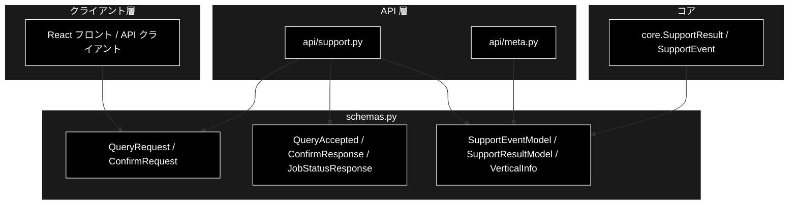
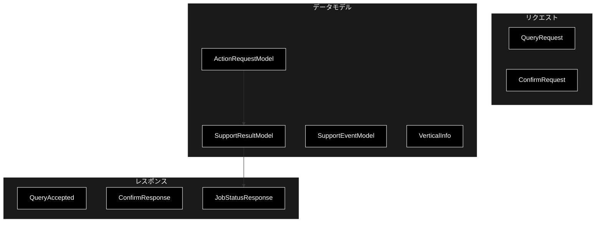
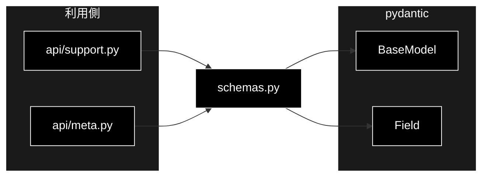

# schemas.py - API スキーマ（Pydantic）ドキュメント

**Version 1.0** | 最終更新: 2026-07-15

---

## 目次

1. [概要](#概要)
2. [アーキテクチャ構成図](#1-アーキテクチャ構成図)
3. [モジュール構成図](#2-モジュール構成図)
4. [クラス・関数一覧表](#3-クラス関数一覧表)
5. [クラス・関数 IPO詳細](#4-クラス関数-ipo詳細)
6. [使用例](#5-使用例)
7. [エクスポート](#6-エクスポート)
8. [変更履歴](#7-変更履歴)
9. [付録: 依存関係図](#付録-依存関係図)

---

## 概要

`backend/app/schemas.py` は、GRACE-Support Web API の**リクエスト / レスポンス / イベントの
Pydantic スキーマ**を定義するモジュール。FastAPI の `response_model` / リクエストボディ検証に
使われ、OpenAPI ドキュメントの型情報にもなる。

コア（`core/support_agent.py`）の `SupportResult`（dataclass）を JSON 化したものが
`SupportResultModel`、進捗イベント `SupportEvent` に通し番号・時刻を足した SSE 用の型が
`SupportEventModel`。API 層（`api/support.py` / `api/meta.py`）はこれらを介して入出力する。

### 主な責務

- 問い合わせ起動リクエスト（`QueryRequest`）と受付レスポンス（`QueryAccepted`）の定義
- HITL 承認リクエスト（`ConfirmRequest`）と応答（`ConfirmResponse`）の定義
- 結果・ジョブ状態（`SupportResultModel` / `JobStatusResponse`）の定義
- SSE イベント（`SupportEventModel`）と業界プロファイル（`VerticalInfo`）の定義
- 入力値の制約（`min_length` / `Literal` による列挙）の付与

### 各責務対応のモジュール

| # | 責務 | 対応モジュール | 説明 |
|---|------|--------------|------|
| 1 | 起動リクエスト/受付 | `schemas.py` | `QueryRequest` / `QueryAccepted` |
| 2 | HITL 応答 | `schemas.py` | `ConfirmRequest` / `ConfirmResponse` |
| 3 | 結果・ジョブ状態 | `schemas.py` | `SupportResultModel` / `JobStatusResponse` |
| 4 | SSE イベント | `schemas.py` | `SupportEventModel`（core.SupportEvent 準拠） |
| 5 | メタ情報 | `schemas.py` | `VerticalInfo`（GET /api/verticals） |

### 主要機能一覧

| 機能 | 説明 |
|------|------|
| `QueryRequest` | POST /api/support/query のボディ（CLI 引数と 1:1） |
| `QueryAccepted` | ジョブ受付レスポンス（job_id / stream_url） |
| `ConfirmRequest` | HITL CONFIRM への応答（intervention_id / approve） |
| `ConfirmResponse` | 応答結果（resolved / not_found / not_waiting） |
| `ActionRequestModel` | アクション情報（action_type / args / requires_confirmation） |
| `SupportResultModel` | `SupportResult` の JSON 表現 |
| `JobStatusResponse` | GET /api/support/result/{job_id} |
| `SupportEventModel` | SSE で配信される進捗イベント |
| `VerticalInfo` | GET /api/verticals の 1 要素 |

---

## 1. アーキテクチャ構成図

### 1.1 システム全体構成



### 1.2 データフロー

1. フロントが `QueryRequest` を POST → API が検証し `QueryAccepted` を返す
2. SSE で `SupportEventModel`（seq/ts 付き）が逐次配信される
3. CONFIRM 到達時、フロントが `ConfirmRequest` を POST → `ConfirmResponse`
4. 完了後、`JobStatusResponse`（`SupportResultModel` 内包）で最終結果を取得

---

## 2. モジュール構成図

### 2.1 内部モジュール構成



### 2.2 外部依存関係

| ライブラリ | バージョン | 用途 |
|-----------|-----------|------|
| `pydantic` | >=2 | `BaseModel` / `Field` によるスキーマ定義・検証 |

### 2.3 内部依存モジュール

| モジュール | 用途 |
|-----------|------|
| （なし） | 純粋なスキーマ定義。コアの `SupportResult` / `SupportEvent` と構造を対応させる（import はしない） |

---

## 3. クラス・関数一覧表

### 3.1 クラス一覧

#### スキーマモデル（すべて `pydantic.BaseModel` 派生）

| モデル | 概要 |
|-------|------|
| `QueryRequest` | 問い合わせ起動リクエスト |
| `QueryAccepted` | ジョブ受付レスポンス |
| `ConfirmRequest` | HITL 応答リクエスト |
| `ConfirmResponse` | HITL 応答結果 |
| `ActionRequestModel` | アクション情報 |
| `SupportResultModel` | 結果（SupportResult の JSON 表現） |
| `JobStatusResponse` | ジョブ状態＋結果 |
| `SupportEventModel` | SSE 進捗イベント |
| `VerticalInfo` | 業界プロファイル情報 |

### 3.2 関数一覧

本モジュールに関数定義はない（スキーマクラスのみ）。

---

## 4. クラス・関数 IPO詳細

### 4.1 QueryRequest

**概要**: `POST /api/support/query` のリクエストボディ。CLI 引数と 1:1 対応。

```python
class QueryRequest(BaseModel):
    query: str = Field(min_length=1)
    vertical: Optional[Literal["gov", "saas", "ec"]] = None
    dry_run: bool = True
    use_web: bool = True
    do_action: bool = True
    verbose: bool = False
```

| フィールド | 型 | デフォルト | 説明 |
|------------|------|-----------|------|
| `query` | str | -（必須, min_length=1） | 問い合わせ内容 |
| `vertical` | Optional[Literal["gov","saas","ec"]] | None | 業界プロファイル |
| `dry_run` | bool | True | アクションのドライラン |
| `use_web` | bool | True | Web フォールバック有効 |
| `do_action` | bool | True | アクション実行有効 |
| `verbose` | bool | False | 詳細ログ |

| 項目 | 内容 |
|------|------|
| **Input** | `query`, `vertical`, `dry_run`, `use_web`, `do_action`, `verbose` |
| **Process** | Pydantic が型・`min_length`・`Literal` を検証 |
| **Output** | 検証済み `QueryRequest`（不正時は 422 バリデーションエラー） |

**戻り値例**:
```python
{"query": "返品したい", "vertical": "ec", "dry_run": true,
 "use_web": true, "do_action": true, "verbose": false}
```

```python
# 使用例
req = QueryRequest(query="返品したい", vertical="ec")
```

### 4.2 QueryAccepted

**概要**: ジョブ受付レスポンス（202 Accepted）。

```python
class QueryAccepted(BaseModel):
    job_id: str
    stream_url: str
```

| フィールド | 型 | デフォルト | 説明 |
|------------|------|-----------|------|
| `job_id` | str | - | 発行されたジョブ ID |
| `stream_url` | str | - | SSE 購読 URL（`/api/support/stream/{job_id}`） |

| 項目 | 内容 |
|------|------|
| **Input** | `job_id`, `stream_url` |
| **Process** | 値を保持 |
| **Output** | `QueryAccepted` |

**戻り値例**:
```python
{"job_id": "a1b2c3d4e5f6", "stream_url": "/api/support/stream/a1b2c3d4e5f6"}
```

```python
# 使用例
QueryAccepted(job_id=job.job_id, stream_url=f"/api/support/stream/{job.job_id}")
```

### 4.3 ConfirmRequest / ConfirmResponse

**概要**: HITL CONFIRM への応答リクエストと結果。

```python
class ConfirmRequest(BaseModel):
    intervention_id: str
    approve: bool

class ConfirmResponse(BaseModel):
    status: Literal["resolved", "not_found", "not_waiting"]
```

| フィールド | 型 | デフォルト | 説明 |
|------------|------|-----------|------|
| `intervention_id` | str | - | 対象 intervention の ID |
| `approve` | bool | - | True=PROCEED / False=CANCEL |
| `status` | Literal[...] | - | resolved / not_found / not_waiting |

| 項目 | 内容 |
|------|------|
| **Input** | `intervention_id`, `approve`（req）／ `status`（resp） |
| **Process** | 値を保持・`Literal` を検証 |
| **Output** | `ConfirmRequest` / `ConfirmResponse` |

**戻り値例**:
```python
# request
{"intervention_id": "9f8e7d6c5b4a", "approve": true}
# response
{"status": "resolved"}
```

```python
# 使用例
ConfirmResponse(status="resolved")
```

### 4.4 ActionRequestModel

**概要**: アクション情報（`SupportResultModel.action`）。core の `ActionRequest` に対応。

```python
class ActionRequestModel(BaseModel):
    action_type: str
    args: Dict[str, Any] = Field(default_factory=dict)
    requires_confirmation: bool = True
```

| フィールド | 型 | デフォルト | 説明 |
|------------|------|-----------|------|
| `action_type` | str | - | create_ticket / send_reply / escalate_to_human 等 |
| `args` | Dict[str, Any] | `{}` | アクション引数 |
| `requires_confirmation` | bool | True | 実行前に CONFIRM が必要か |

| 項目 | 内容 |
|------|------|
| **Input** | `action_type`, `args`, `requires_confirmation` |
| **Process** | 値を保持 |
| **Output** | `ActionRequestModel` |

**戻り値例**:
```python
{"action_type": "create_ticket", "args": {"query": "返品したい", "matched": "返品"},
 "requires_confirmation": true}
```

```python
# 使用例
ActionRequestModel(action_type="create_ticket", args={"query": "返品したい"})
```

### 4.5 SupportResultModel

**概要**: `core.SupportResult` の JSON 表現（`GET /api/support/result/{job_id}` の `result`）。

```python
class SupportResultModel(BaseModel):
    answer: Optional[str] = None
    citations: List[str] = Field(default_factory=list)
    groundedness: float = 0.0
    groundedness_decided: int = 0
    decision: Literal["answer", "escalate"] = "escalate"
    warning: bool = False
    used_web: bool = False
    source_agreement: Optional[float] = None
    contradiction: bool = False
    action: Optional[ActionRequestModel] = None
    action_result: Optional[str] = None
    vertical: Optional[str] = None
    overall_confidence: float = 0.0
    intent: Optional[str] = None
    forced_escalate: bool = False
    identity_checked: bool = False
    no_info_detected: bool = False
    web_reused: bool = False
```

| フィールド | 型 | デフォルト | 説明 |
|------------|------|-----------|------|
| `answer` | Optional[str] | None | 回答本文 |
| `citations` | List[str] | `[]` | 出典（`[社内]`/`[Web]`） |
| `groundedness` | float | 0.0 | 支持率 |
| `groundedness_decided` | int | 0 | 判定できた主張数 |
| `decision` | Literal["answer","escalate"] | "escalate" | 回答可否 |
| `warning` | bool | False | 未確認注記 |
| `used_web` / `web_reused` | bool | False | Web 使用／再利用 |
| `source_agreement` | Optional[float] | None | 内部×Web 一致度 |
| `contradiction` | bool | False | 矛盾の可能性 |
| `action` | Optional[ActionRequestModel] | None | 実施アクション |
| `action_result` | Optional[str] | None | アクション結果 |
| `vertical` | Optional[str] | None | 業界プロファイル |
| `overall_confidence` | float | 0.0 | 総合信頼度 |
| `intent` | Optional[str] | None | 意図分類結果 |
| `forced_escalate` / `identity_checked` / `no_info_detected` | bool | False | KPI メタ |

| 項目 | 内容 |
|------|------|
| **Input** | 上記フィールド（すべて任意・既定あり） |
| **Process** | `core.SupportResult` を `result_to_dict()` 化した dict から構築 |
| **Output** | `SupportResultModel` |

**戻り値例**:
```python
{
    "answer": "30日以内であれば返品可能です。…",
    "citations": ["[社内] ec_policy_anthropic/return.md"],
    "groundedness": 0.83, "decision": "answer",
    "warning": false, "vertical": "ec"
}
```

```python
# 使用例（JobStatusResponse 経由で返る）
SupportResultModel(**result_to_dict(support))
```

### 4.6 JobStatusResponse

**概要**: `GET /api/support/result/{job_id}`。ジョブ状態と最終結果。

```python
class JobStatusResponse(BaseModel):
    job_id: str
    status: Literal["running", "completed", "failed"]
    result: Optional[SupportResultModel] = None
```

| フィールド | 型 | デフォルト | 説明 |
|------------|------|-----------|------|
| `job_id` | str | - | ジョブ ID |
| `status` | Literal[...] | - | running / completed / failed |
| `result` | Optional[SupportResultModel] | None | 完了時の結果 |

| 項目 | 内容 |
|------|------|
| **Input** | `job_id`, `status`, `result` |
| **Process** | 値を保持 |
| **Output** | `JobStatusResponse` |

**戻り値例**:
```python
{"job_id": "a1b2c3d4e5f6", "status": "completed", "result": { ... }}
```

```python
# 使用例
JobStatusResponse(job_id=job.job_id, status=job.status, result=job.result)
```

### 4.7 SupportEventModel

**概要**: SSE で配信される進捗イベント（`core.SupportEvent` に `seq` / `ts` を付与）。

```python
class SupportEventModel(BaseModel):
    seq: int
    ts: float
    type: Literal["step", "log", "intervention", "result", "error"]
    step: Optional[str] = None
    status: Optional[str] = None
    title: str = ""
    message: str = ""
    data: Dict[str, Any] = Field(default_factory=dict)
```

| フィールド | 型 | デフォルト | 説明 |
|------------|------|-----------|------|
| `seq` | int | - | 通し番号（0 起点。リプレイ用） |
| `ts` | float | - | epoch 秒 |
| `type` | Literal[...] | - | step/log/intervention/result/error |
| `step` | Optional[str] | None | ステップ ID |
| `status` | Optional[str] | None | started/finished/skipped/waiting/resolved/timeout |
| `title` / `message` | str | "" | 見出し／メッセージ |
| `data` | Dict[str, Any] | `{}` | 付随データ |

| 項目 | 内容 |
|------|------|
| **Input** | `seq`, `ts`, `type`, `step`, `status`, `title`, `message`, `data` |
| **Process** | 値を保持（実際の SSE 送出は `api/support.py` が JSON 文字列化） |
| **Output** | `SupportEventModel` |

**戻り値例**:
```python
{"seq": 5, "ts": 1752543210.12, "type": "step", "step": "gate",
 "status": "finished", "data": {"decision": "answer", "warning": true}}
```

```python
# 使用例（型としての参照。実送出は jobs.SupportJob.emit の record）
SupportEventModel(seq=0, ts=..., type="log", step="plan", message="❓ 問い合わせ: …")
```

### 4.8 VerticalInfo

**概要**: `GET /api/verticals` の 1 要素（UI のプロファイルセレクタ用）。

```python
class VerticalInfo(BaseModel):
    id: str
    name: str
    collections: List[str]
    escalate_keywords: List[str]
    action_map: Dict[str, str]
    require_identity: bool
    notify_th: Optional[float] = None
    confirm_th: Optional[float] = None
    prompt_addendum: str = ""
```

| フィールド | 型 | デフォルト | 説明 |
|------------|------|-----------|------|
| `id` | str | - | プロファイルキー（gov/saas/ec） |
| `name` | str | - | 表示名（自治体/SaaS/EC） |
| `collections` | List[str] | - | 検索スコープ |
| `escalate_keywords` | List[str] | - | 強制エスカレ語 |
| `action_map` | Dict[str, str] | - | 意図キーワード→action_type |
| `require_identity` | bool | - | 本人確認必須か |
| `notify_th` / `confirm_th` | Optional[float] | None | しきい値（None=config 既定） |
| `prompt_addendum` | str | "" | 業界方針 |

| 項目 | 内容 |
|------|------|
| **Input** | 上記フィールド |
| **Process** | `PROFILES` の `VerticalProfile` から `api/meta.py` が構築 |
| **Output** | `VerticalInfo` |

**戻り値例**:
```python
{"id": "ec", "name": "EC", "collections": ["ec_policy_anthropic", "ec_faq_anthropic"],
 "escalate_keywords": ["決済", "返金", "破損", "クレーム", "不良品"],
 "action_map": {"返品": "create_ticket"}, "require_identity": true,
 "notify_th": null, "confirm_th": null, "prompt_addendum": "注文情報の照会・変更は本人確認必須。…"}
```

```python
# 使用例（api/meta.py）
VerticalInfo(id=key, name=profile.name, collections=list(profile.collections), ...)
```

---

## 5. 使用例

### 5.1 基本的なワークフロー（API 層での利用）

```python
from backend.app.schemas import QueryRequest, QueryAccepted, JobStatusResponse

# 1. リクエスト検証（FastAPI が自動で行う）
req = QueryRequest(query="返品したい", vertical="ec")

# 2. 受付レスポンス
accepted = QueryAccepted(job_id="a1b2c3", stream_url="/api/support/stream/a1b2c3")

# 3. 結果取得
status = JobStatusResponse(job_id="a1b2c3", status="completed", result=None)
```

---

## 6. エクスポート

本モジュールに `__all__` 定義はない。`api/support.py` / `api/meta.py` が個別に import する。

```python
# 公開シンボル（明示的 __all__ はなし）
QueryRequest, QueryAccepted, ConfirmRequest, ConfirmResponse,
ActionRequestModel, SupportResultModel, JobStatusResponse,
SupportEventModel, VerticalInfo
```

---

## 7. 変更履歴

| バージョン | 変更内容 |
|-----------|---------|
| 1.0 | 初版作成（9 スキーマモデルの IPO ドキュメント） |

---

## 付録: 依存関係図


