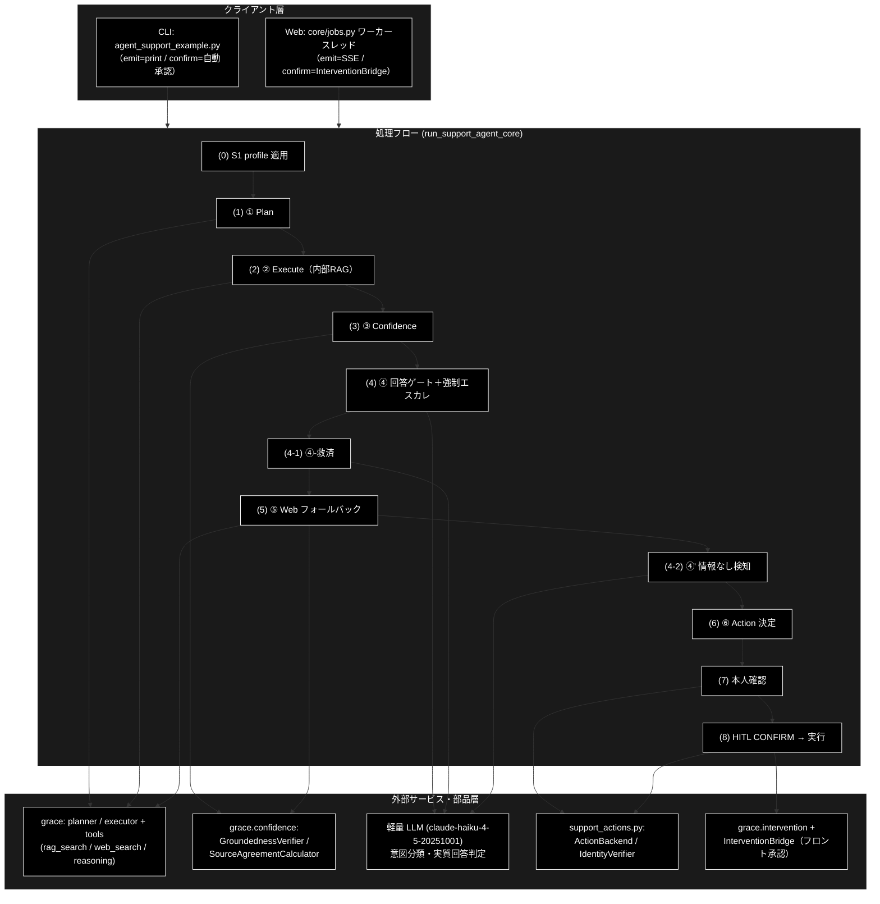
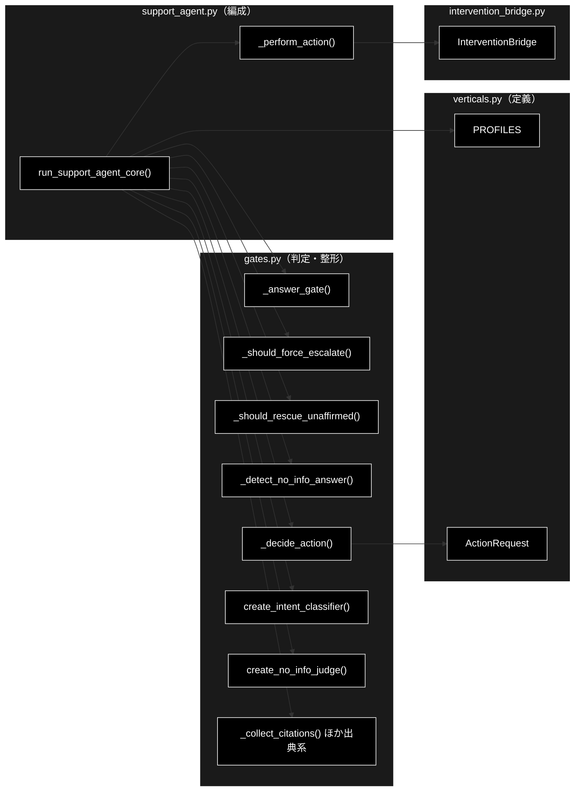
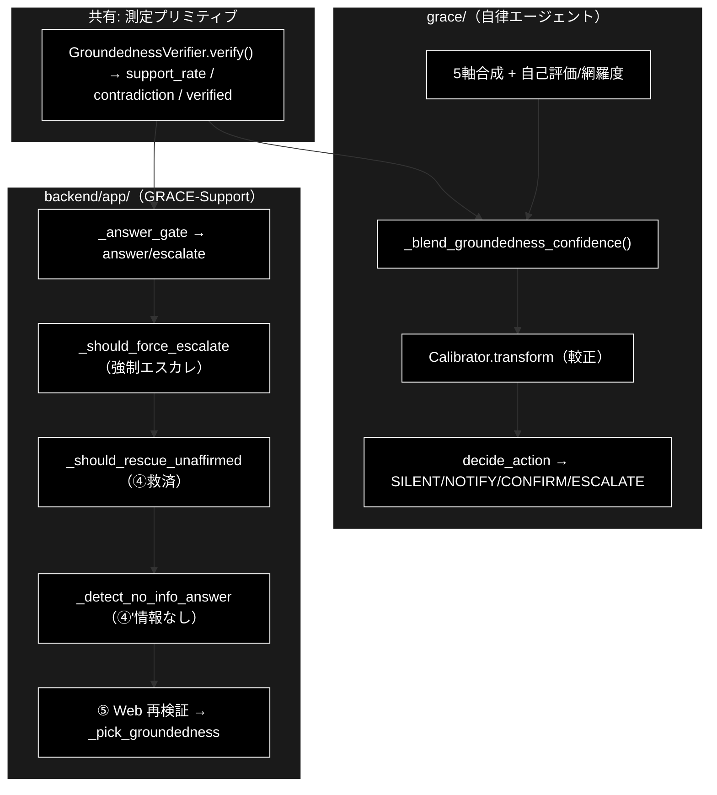
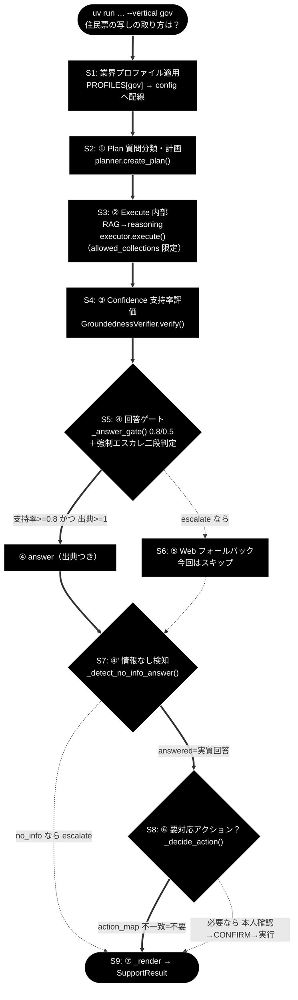
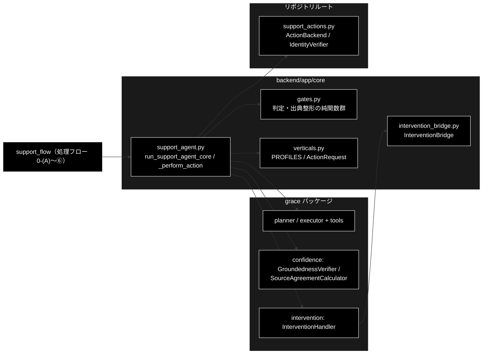

# support_flow.md - GRACE-Support 処理フロー ステップ詳細（0-(A)〜⑥）ドキュメント

**Version 2.0** | 最終更新: 2026-09-15

> 📌 本書は**フロー（WHAT）**——ステップの実行順と各ステップの入出力。
>
> | 知りたいこと | 正本 |
> |---|---|
> | なぜこの判定・しきい値・ポリシーなのか（WHY） | [`support_spec.md`](./support_spec.md) |
> | 関数・クラスの仕様（IPO・シグネチャ） | [`core_support_agent.md`](./reference/core_support_agent.md) / [`core_gates.md`](./reference/core_gates.md) / [`core_verticals.md`](./reference/core_verticals.md) |
> | Web UI 起点の end-to-end（`run_dev.sh`） | [`webapp_flow.md`](./webapp_flow.md) |
> | GRACE-**Review** 側（S1・①〜⑦） | [`review_flow.md`](./review_flow.md) |

> 📝 **統合について（2026-09-15）**: 本書は `backend_flow.md` を改称し、
> `agent_support_example_flow.md`（1 コマンド実行トレース）を**付録B**へ、
> `agent_support_example.md` §8（CLI 仕様）を**付録A**へ、
> `confidence_flow_grace_vs_backend.md`（grace/ と backend/ の信頼度フロー比較）を
> **§3.3** へ統合したものである。あわせて**ステップ番号を `CLAUDE.md` §1 の体系
> （`0-(A)` `0-(B)` `①`〜`⑥` `④'`）へ統一**し、旧番号 `(0)`〜`(8)` との対応表を §4 冒頭に残した。

---

## 目次

1. [概要](#概要)
2. [アーキテクチャ構成図](#1-アーキテクチャ構成図)
3. [モジュール構成図](#2-モジュール構成図)
4. [クラス・関数一覧表](#3-クラス関数一覧表)
5. [処理ステップ IPO詳細（0-(A)〜⑥）](#4-処理ステップ-ipo詳細0-a)
6. [設定・定数](#5-設定定数)
7. [使用例](#6-使用例)
8. [エクスポート](#7-エクスポート)
9. [変更履歴](#8-変更履歴)
10. [付録A: CLI 仕様と実行例](#付録a-cli-仕様と実行例)
11. [付録B: 1 コマンド実行トレース（--vertical gov）](#付録b-1-コマンド実行トレース--vertical-gov)
12. [付録C: 依存関係図](#付録c-依存関係図)

---

## 概要

本ドキュメントは、GRACE-Support パイプライン（`backend/app/core/support_agent.py` の
`run_support_agent_core()`）が実行する **処理フローの各ステップ（`STEP_IDS` の 9 ステップ）** を、
実装関数・シグネチャ・IPO（Input-Process-Output）・戻り値例・使用例つきで記述する。
全体像（アーキテクチャ・データフロー）はリポジトリルートの [`README.md`](../../README.md) §1〜§2 を参照。

> 📝 **注意（実行順）**: 番号は `CLAUDE.md` §1 の呼称であり、**実行順とは一致しない**。
> 実際の実行順は `STEP_IDS` の並び
> **0-(A) → 0-(B) → ① → ② → ③ → ④ → ⑤ → ④' → ⑥** であり、
> **④'（情報なし回答検知）は ⑤（Web フォールバック）の後**に、
> `decision == "answer"` の場合のみ実行される。

### 主な責務

- 業界プロファイル（gov / saas / ec）による検索スコープ・しきい値・エスカレ語・本人確認の切替
- クエリの実行計画への分解（Plan）と内部 RAG → reasoning による回答生成（Execute）
- 回答の主張ごとの裏付け検証（Groundedness）と支持率・出典数に基づく回答可否判定（回答ゲート）
- 誤エスカレ・誤回答の抑止（強制エスカレの二段判定・④-救済・④' 情報なし回答検知）
- 内部根拠不足時の Web フォールバック（回答再利用による重複推論の省略・内部×Web 相互検証）
- 副作用のあるアクションの安全な実行（本人確認 → HITL CONFIRM → バックエンド実行）

### 各責務対応のモジュール

| # | 責務 | 対応モジュール | 説明 |
|---|------|--------------|------|
| 1 | 業界プロファイルの切替 | `backend/app/core/verticals.py` | `PROFILES`（VerticalProfile 定義）。適用は `support_agent.py` 内 |
| 2 | Plan / Execute | `grace`（planner / executor + tools） | `support_agent.py` から呼び出し。出典整形は `gates.py` |
| 3 | Groundedness と回答ゲート | `grace.confidence` / `backend/app/core/gates.py` | 検証は `GroundednessVerifier`、判定は `_answer_gate` |
| 4 | 誤エスカレ・誤回答の抑止 | `backend/app/core/gates.py` | `_should_force_escalate` / `_should_rescue_unaffirmed` / `_detect_no_info_answer` |
| 5 | Web フォールバック | `backend/app/core/support_agent.py` | tools（web_search / reasoning）と相互検証の編成。補助関数は `gates.py` |
| 6 | アクションの安全な実行 | `support_actions.py` / `backend/app/core/intervention_bridge.py` | 本人確認・バックエンド実行・HITL 承認待ち |

### 主要機能一覧

| 機能 | 説明 |
|------|------|
| `run_support_agent_core()` | パイプライン全体の編成（9 ステップの実行主体・イベント発行型） |
| `analyze_questions()` / `reconstruct_query()` | 0-(A) 複数質問の検知・構造解析・再構成 |
| `PROFILES` | 0-(B) 業界プロファイル定義（gov / saas / ec） |
| `_collect_citations()` | ② step_results から出典リストを作成（[社内]/[Web] ラベル付け） |
| `_answer_gate()` | ④ 支持率・出典数から answer / escalate を判定する純関数 |
| `_should_force_escalate()` | ④ エスカレ語の二段判定（キーワード → 意図分類） |
| `create_intent_classifier()` | ④⑥ 意図分類器（question / request / incident。軽量 LLM） |
| `_should_rescue_unaffirmed()` | ④-救済 出典付き・矛盾なしの内部回答を escalate から救済するか判定 |
| `_detect_no_info_answer()` | ④' 「情報なし回答」の二段判定（定型句候補 → 実質回答判定） |
| `create_no_info_judge()` | ④' 実質回答判定器（answered / no_info。軽量 LLM） |
| `_pick_groundedness()` / `_merge_citations()` | ⑤ 内部×Web の検証結果・出典の統合 |
| `_decide_action()` | ⑥ 回答判定と問い合わせ内容から実行アクションを決定（二段判定） |
| `_perform_action()` | ⑥ 本人確認 → HITL CONFIRM → バックエンド実行の編成 |
| `InterventionBridge` | ⑥ HITL 承認の同期⇔非同期変換（Web のフロント承認待ち） |

---

## 1. アーキテクチャ構成図

### 1.1 システム全体構成



### 1.2 データフロー

1. クライアント（CLI / Web ジョブ）が `run_support_agent_core(query, vertical, ..., emit, confirm)` を呼び出す
2. (0) プロファイルを解決し、検索スコープ（`config.qdrant.allowed_collections`）と方針（`config.llm.prompt_addendum`）を config へ注入する
3. (1)〜(3) Plan → Execute → Groundedness 検証で内部回答・出典・支持率を得る
4. (4)〜(4-1) 回答ゲート・強制エスカレ・救済で `decision`（answer / escalate）を確定する
5. (5) escalate かつ非強制エスカレなら Web で裏取りし、検証結果・出典を統合する
6. (4-2) answer の場合のみ「情報なし回答」を検知し、該当すれば escalate に倒す
7. (6)〜(8) アクションを決定し、本人確認 → HITL CONFIRM → バックエンド実行を経て結果メッセージを得る
8. 各ステップの進捗は `emit(SupportEvent)` で通知され、最終的に `SupportResult` が `result` イベントと戻り値で返る

---

## 2. モジュール構成図

### 2.1 内部モジュール構成



### 2.2 外部依存関係

| ライブラリ / パッケージ | バージョン | 用途 |
|-----------|-----------|------|
| `grace`（リポジトリ内） | - | planner / executor + tools / GroundednessVerifier / SourceAgreementCalculator / InterventionHandler |
| `support_actions`（リポジトリ内） | - | ActionBackend（dry-run / webhook / pseudo）・IdentityVerifier |
| Anthropic Claude API | `claude-sonnet-4-6`（既定）/ `claude-haiku-4-5-20251001`（軽量判定） | Plan / reasoning / 検証・分類・判定 |
| Gemini Embedding API | `gemini-embedding-001`（3072次元） | RAG 検索の埋め込み |
| Qdrant | - | 内部ナレッジのベクトル検索（コレクション `*_anthropic`） |

### 2.3 内部依存モジュール

| モジュール | 用途 |
|-----------|------|
| `backend.app.core.support_agent` | パイプライン編成（(0)〜(8) の実行主体） |
| `backend.app.core.gates` | 回答ゲート・二段判定・救済・出典整形（純関数群） |
| `backend.app.core.verticals` | `PROFILES` / `ActionRequest` / `Intent` / `INTENT_MODEL` |
| `backend.app.core.intervention_bridge` | (8) HITL 承認のフロント連携（Web のみ） |

---

## 3. クラス・関数一覧表

### 3.1 ステップ ↔ 実装対応表

| ステップ | `STEP_IDS` | 内容 | 主実装 | 定義元 |
|---|---|---|---|---|
| 0-(A) | `analyze` | 入力・質問分析（複数質問の検知 → 選択 → 再構成 → 担当範囲判定） | `analyze_questions()` / `reconstruct_query()` / `split_by_scope()` | `gates.py` |
| 0-(B) | `profile` | 業界プロファイル適用 | `run_support_agent_core` 内 + `PROFILES` | `support_agent.py` / `verticals.py` |
| ① | `plan` | Plan | `planner.create_plan()` | `grace`（呼び出しは `support_agent.py`） |
| ② | `execute` | Execute | `executor.execute()` + `_collect_citations()` | `grace` / `gates.py` |
| ③ | `confidence` | Confidence | `verifier.verify()` + `_citation_text()` | `grace.confidence` / `gates.py` |
| ④ | `gate` | 回答ゲート＋強制エスカレ | `_answer_gate()` + `_should_force_escalate()` + `create_intent_classifier()` | `gates.py` |
| ④-救済 | `gate` | 支持率が弱いだけの内部回答を救済 | `_should_rescue_unaffirmed()` | `gates.py` |
| ④' | `no_info` | 情報なし回答検知 | `_detect_no_info_answer()` + `create_no_info_judge()` | `gates.py` |
| ⑤ | `web` | Web フォールバック | `run_support_agent_core` 内 + `_web_citations()` / `_web_source_texts()` / `_merge_citations()` / `_pick_groundedness()` | `support_agent.py` / `gates.py` |
| ⑥ | `action` | Action 決定 | `_decide_action()` | `gates.py` |
| ⑥ | `action` | 本人確認 | `create_identity_verifier()` + `_perform_action()` 内 | `support_actions.py` / `support_agent.py` |
| ⑥ | `action` | HITL CONFIRM | `_perform_action()` 内 + `InterventionBridge` | `support_agent.py` / `intervention_bridge.py` |

### 3.2 関数一覧（カテゴリ別）

#### 判定（純関数）

| 関数名 | 概要 |
|-------|------|
| `_answer_gate(support_rate, verified, citation_count, notify_th, confirm_th)` | 支持率・出典数から (decision, warning) を返す |
| `_should_force_escalate(query, profile, classify)` | エスカレ語の二段判定。(forced, matched_keyword, intent) を返す |
| `_should_rescue_unaffirmed(decision, forced_escalate, has_contradiction, citation_count, answer, query, no_info_judge)` | 救済可否を返す |
| `_detect_no_info_answer(query, answer, judge, force_judge)` | (no_info, matched_marker) を返す |
| `_decide_action(query, decision, profile, classify)` | `Optional[ActionRequest]` を返す |
| `_pick_groundedness(*results)` | 複数の検証結果から (支持率, 判定主張数) を選ぶ |

#### LLM 判定器ファクトリ（軽量モデル）

| 関数名 | 概要 |
|-------|------|
| `create_intent_classifier(config)` | query → question / request / incident / None の分類関数を返す |
| `create_no_info_judge(config)` | (query, answer) → answered(False) / no_info(True) / None の判定関数を返す |

#### 出典整形

| 関数名 | 概要 |
|-------|------|
| `_collect_citations(step_results)` | sources を重複排除し [社内]/[Web] ラベル付きの出典リストへ |
| `_citation_text(citation)` | ラベルを外して出典の中身を返す |
| `_merge_citations(internal, web)` | 内部出典と Web 出典を URL 包含で重複排除して結合 |
| `_web_citations(web_output)` / `_web_source_texts(web_output)` | Web 検索結果から出典表示 / 検証用本文を抽出 |

#### 編成・アクション

| 関数名 | 概要 |
|-------|------|
| `run_support_agent_core(query, ..., emit, confirm)` | パイプライン全体の編成。`Optional[SupportResult]` を返す |
| `_perform_action(action, handler, backend, identity_verifier, identity, emit_log)` | 本人確認 → HITL → 実行。結果メッセージ str を返す |
| `InterventionBridge.resolver(request)` / `.resolve(intervention_id, approve)` | (8) 承認待ちのブロック / 応答注入 |

---

---

### 3.3 信頼度フローの比較（`grace/` と `backend/app/`）

> 📝 旧 `confidence_flow_grace_vs_backend.md`（v1.1）を統合した節。
> 測定の詳細は [`grace/docs/confidence_calibration.md`](../../grace/docs/confidence_calibration.md)、
> 判定の詳細は [`core_gates.md`](./reference/core_gates.md) が正本。

**測定の心臓部（`GroundednessVerifier` による支持率）は両者で共有**している。違うのは
「その支持率を最終的にどう判定へ落とすか」である。

- **grace/**: 5 軸の信頼度を合成し groundedness を主成分にブレンド、**温度スケーリングで較正**
  した単一の `overall_confidence` を作り、`decide_action` で **4 値の介入レベル**
  （SILENT/NOTIFY/CONFIRM/ESCALATE）へ落とす。汎用の自律実行向け。
- **backend/app/**: `GroundednessVerifier` の**支持率を直接** `_answer_gate` に通し、
  **2 値（answer/escalate）**へ落とす。加えて業界特化のビジネスルール（強制エスカレ・
  ④救済・④'情報なし検知・⑤Web 再検証）を重ねる。サポート応答（HITL）向け。

#### 共有する測定プリミティブ

backend は独自に信頼度検証器を持たず、**grace の `GroundednessVerifier` をそのまま再利用**する
（`backend/app/core/support_agent.py` が `from grace.confidence import create_groundedness_verifier`）。

| 共有要素 | 内容 |
|---------|------|
| `GroundednessVerifier.verify(query, answer, sources)` | 各主張を supported/contradicted/neutral に LLM 判定 |
| `GroundednessResult.support_rate` | `supported / (supported+contradicted)`（neutral は分母外） |
| `has_contradiction` / `verified` | 矛盾検出／検証成立可否 |

→ **「回答の各主張が引用ソースに支持されるか」という測定は同一**。差が出るのはこの後段。

---

#### grace/ の信頼度フロー

`grace/executor.py::_calculate_overall_confidence()` が統括（詳細は
`grace/docs/confidence_calibration.md`）。

```
① 各ステップ ConfidenceScore（ConfidenceCalculator, 5軸）
② 最終回答の自己評価＋網羅度（LLMSelfEvaluator.evaluate_final）
③ 補助集約（ConfidenceAggregator.aggregate, weighted）
④ groundedness ブレンド（_blend_groundedness_confidence）
     answer_conf = 0.6*support_rate + 0.25*self_eval + 0.15*coverage
     contradiction → min(・, 0.3);  final = 0.8*answer_conf + 0.2*aggregated
⑤ 較正（Calibrator.transform, 温度スケーリング）
⑥ 介入判定（decide_action）
     ≥0.9 SILENT / ≥0.7 NOTIFY / ≥0.4 CONFIRM / else ESCALATE
```

- 出力は**単一の `overall_confidence`（0-1）**と 4 値の `InterventionLevel`。
- **温度スケーリング較正**を最後に適用する（`config/calibration.json`）。
- 曖昧クエリ（ask_user 計画・最終回答なし）は低信頼固定（0.3）で CONFIRM/ESCALATE 帯へ。

---

#### 比較表

| 観点 | grace/（executor + confidence + calibration） | backend/app/（support_agent + gates） |
|------|---|---|
| 測定の主プリミティブ | `GroundednessVerifier`（共有） | `GroundednessVerifier`（**同じものを再利用**） |
| 信頼度の主軸 | `overall_confidence`（5軸→groundedness ブレンド→較正） | groundedness `support_rate` を直結 |
| 較正（温度スケーリング） | **あり**（`Calibrator.transform`） | **なし**（支持率の生値でゲート） |
| 自己評価/網羅度 | `evaluate_final` で信頼度に混合 | 使わない（別途 no_info 判定を使用） |
| 最終判定の値域 | 4 値 `InterventionLevel`（SILENT/NOTIFY/CONFIRM/ESCALATE） | 2 値 `decision`（answer/escalate）＋ warning |
| 判定関数 | `decide_action`（しきい値: 0.9/0.7/0.4） | `_answer_gate`（notify_th/confirm_th・vertical 可変） |
| ビジネスルール | なし（汎用の介入判定のみ） | 強制エスカレ・④救済・④'情報なし検知・⑤Web再検証 |
| 意図分類の使用 | なし | あり（強制エスカレ／アクション判定の二段目） |
| `overall_confidence` の役割 | 介入判定に使用 | 受領・表示のみ（判定には未使用） |
| 想定ユースケース | 汎用の自律実行（Plan/Execute） | 業界特化サポート応答（HITL・回答/エスカレ） |

---

#### 並置フロー図



---

#### 設計上の含意

- **測定は共有、判定は分離**。同じ支持率（groundedness）を、grace は「連続値の信頼度＋介入
  レベル」に、backend は「回答するか有人へ回すかの二択＋業界ルール」に変換する。責務が
  異なるため、判定ロジックを別モジュールに置くのは妥当。
- **較正の適用点の違い**。grace は較正済み `overall_confidence` を介入判定に使うが、backend の
  ゲートは支持率の生値を使う（較正は overall_confidence を通じて結果に**表示**されるのみ）。
  backend の回答/エスカレ境界を厳密に較正したい場合は、`notify_th`/`confirm_th` の
  プロファイル調整、または支持率への較正適用の是非が検討ポイントになる。
- **backend 固有の安全弁**。④救済（出典付き・矛盾なし・実質回答を escalate から救う）と
  ④'情報なし検知（誠実な「見つかりません」を有人へ倒す）は、groundedness 単独では拾えない
  誤判定を補正するための backend 独自ルールで、grace 側には無い。

---

---

## 4. 処理ステップ IPO詳細（0-(A)〜⑥）

> 📝 **旧番号との対応**（`backend_flow.md` v1.1 までの `(0)`〜`(8)`）。
> 本書は `CLAUDE.md` §1 の呼称へ統一した。
>
> | 本書 | `STEP_IDS` | 旧番号 |
> |---|---|---|
> | 0-(A) | `analyze` | —（**旧版には記載が無かった**） |
> | 0-(B) | `profile` | (0) |
> | ① | `plan` | (1) |
> | ② | `execute` | (2) |
> | ③ | `confidence` | (3) |
> | ④ ／ ④-救済 | `gate` | (4) ／ (4-1) |
> | ⑤ | `web` | (5) |
> | ④' | `no_info` | (4-2) |
> | ⑥ | `action` | (6) (7) (8) |

### 4.0 0-(A) `analyze`: 入力・質問分析（複数質問の検知 → 選択 → 再構成）

**概要**: ① Plan の手前に置く**前処理**。1 つの入力に複数の質問が混ざっているときに、
主質問と関連質問のクラスタへ構造化し、担当範囲外の主質問を分け、
採用したクラスタを**1 つの質問文へ再構成**してから後段へ渡す。
**ゲートではない**——planner / executor / gates の判定ロジックは一切変えない。
単一質問なら `step_skipped("analyze")` 相当（`is_multi_question=False`）で現行フローそのままになる。

> 📎 設計判断（なぜ絞るのか・なぜ自動選定しないのか・安全側の向き）は
> [`support_spec.md` §5](./support_spec.md#5-0-a-複数質問クエリと担当範囲外) を参照。
> 関数仕様は [`core_gates.md`](./reference/core_gates.md) が正本。

```python
# run_support_agent_core 内（support_agent.py）
looks_multi = looks_like_multi_question(query)          # 第 1 段（LLM を呼ばない）
analysis = (
    analyze_questions(query, create_question_analyzer(config, profile))  # 第 2 段（LLM 1 回）
    if looks_multi else QuestionAnalysis(None, None)
)
clusters = list(analysis.clusters or [])
# … 担当範囲で分割 → 選択（ask_user 相当）→ reconstruct_query() → query を差し替え
```

| パラメータ | 型 | デフォルト | 説明 |
|------------|------|-----------|------|
| `query` | str | - | 利用者の入力（原文。`original_query` に保持される） |
| `profile` | Optional[VerticalProfile] | None | 担当範囲判定（`scope_description`）に使う |
| `confirm` | ConfirmFn | - | 主質問の選択を利用者に尋ねる（HITL・`selected_option`） |

| 項目 | 内容 |
|------|------|
| **Input** | `query: str`, `profile: Optional[VerticalProfile]`, `config`（判定モデル解決用） |
| **Process** | 1. 第 1 段 `looks_like_multi_question()`（接続表現 or 疑問符 2 個以上。**LLM を呼ばない**）<br>2. 第 1 段が一致したときだけ第 2 段 `analyze_questions()`（構造解析＋担当範囲 IN/OUT を**1 回の LLM**で判定）<br>3. 担当範囲外の主質問を `out_of_scope_questions` へ分離（検索クエリからは外すが、生成側へは渡して断らせる）<br>4. 範囲内の主質問が複数なら利用者へ選択を求める（タイムアウト・拒否は**原文のまま 1 周**）<br>5. `reconstruct_query()` で採用クラスタを 1 文へ再構成し、以降の `query` を差し替える<br>6. 採用しなかった範囲内の主質問を `deferred_questions` へ（**必ず返す**） |
| **Output** | `query`（再構成後）, `question_clusters`, `adopted_cluster_index`, `reconstructed_query`, `deferred_questions`, `out_of_scope_questions`, `out_of_scope_guidance` |

**戻り値例**:
```python
# step_finished("analyze", ...) の data（SSE で配信される）
{
    "is_multi_question": True,
    "adopted_cluster_index": 0,
    "reconstructed_query": "住民票の写しの取り方と、その手数料を教えてください。",
    "deferred_questions": ["印鑑登録はどうすればいいですか？"],
    "out_of_scope_questions": ["明日の東京の天気は？"]
}
```

```python
# 使用例（第 1 段だけを単体で試す。LLM 不要）
from backend.app.core.gates import looks_like_multi_question

print(looks_like_multi_question("住民票の取り方は？ また、手数料は？"))
# 出力: True
```


### 4.1 0-(B) `profile`: 業界プロファイル適用（--vertical 指定時のみ）

**概要**: `vertical`（gov / saas / ec）に応じて検索スコープ・しきい値・エスカレ語・本人確認を
切り替える。`config` へ検索スコープと業界方針を注入することで、後続の tools（rag_search）と
reasoning に効かせる。未指定時は `step_skipped("profile")` としてスキップされる。

```python
# run_support_agent_core 内（support_agent.py）
profile = PROFILES.get(vertical) if vertical else None
notify_th = profile.notify_th if (profile and profile.notify_th is not None) else th.notify
confirm_th = profile.confirm_th if (profile and profile.confirm_th is not None) else th.confirm
config.qdrant.allowed_collections = list(profile.collections) if profile else []
config.llm.prompt_addendum = profile.prompt_addendum if profile else ""
```

| パラメータ | 型 | デフォルト | 説明 |
|------------|------|-----------|------|
| `vertical` | Optional[str] | None | 業界プロファイル ID（`gov` / `saas` / `ec`） |

| 項目 | 内容 |
|------|------|
| **Input** | `vertical: Optional[str]`, `PROFILES: Dict[str, VerticalProfile]`, `config`（grace 設定） |
| **Process** | 1. `PROFILES.get(vertical)` でプロファイル解決（None なら全設定を既定のまま）<br>2. `notify_th` / `confirm_th` をプロファイル値で上書き（None は config 既定を維持）<br>3. `config.qdrant.allowed_collections` に検索スコープを注入（未登録コレクションは自動無視）<br>4. `config.llm.prompt_addendum` に業界方針を注入（reasoning のプロンプトへ）<br>5. `step` イベント（started / finished、未指定時は skipped）を emit |
| **Output** | `profile: Optional[VerticalProfile]`, `notify_th: float`, `confirm_th: float`（後続ステップが参照） |

**戻り値例**:
```python
# step_finished("profile", ...) の data（SSE で配信される）
{
    "vertical": "ec",
    "name": "EC",
    "collections": ["ec_policy_anthropic", "ec_faq_anthropic"],
    "notify_th": 0.7,
    "confirm_th": 0.4,
    "require_identity": True,
    "prompt_addendum": "注文情報の照会・変更は本人確認必須。返品・交換は規定の版に基づいて回答。"
}
```

```python
# 使用例
from backend.app.core.verticals import PROFILES

profile = PROFILES.get("ec")
print(profile.name, profile.require_identity)
# 出力: EC True
```

### 4.2 ① `plan` Plan（planner）— クエリを実行計画に分解

**概要**: grace の planner がクエリを複雑度つきの実行計画（ステップ列）へ分解する。
計画の各ステップは (2) の executor が tools（rag_search 等）で実行する。

```python
plan = planner.create_plan(query)   # planner = create_planner(config)
```

| パラメータ | 型 | デフォルト | 説明 |
|------------|------|-----------|------|
| `query` | str | - | 問い合わせ内容（チャット入力） |

| 項目 | 内容 |
|------|------|
| **Input** | `query: str` |
| **Process** | 1. LLM（Anthropic Claude）でクエリを分析し実行計画を生成<br>2. 複雑度（complexity）を推定<br>3. `step` イベントで進捗（ステップ数・複雑度）を emit |
| **Output** | `Plan`: `steps`（実行ステップ列）と `complexity: float` を持つ計画オブジェクト |

**戻り値例**:
```python
# step_finished("plan", ...) の data
{
    "steps": 2,
    "complexity": 0.35
}
```

```python
# 使用例
plan = planner.create_plan("返品したい")
print(f"{len(plan.steps)} ステップ (complexity={plan.complexity:.2f})")
# 出力: 2 ステップ (complexity=0.35)
```

### 4.3 ② `execute` Execute（executor + tools）— 内部RAG検索 → reasoning

**概要**: executor が計画を実行し、内部 RAG 検索（Qdrant）→ reasoning で回答を生成する。
RAG スコア不足時は executor が `web_search` を**動的挿入**するため、出典に Web 由来が混ざる
（`[Web]` プレフィックスで検知し `used_dynamic_web` として (5) の再利用判定に使う）。

```python
result = executor.execute(plan)
internal_answer = result.final_answer or ""
internal_citations = _collect_citations(result.step_results)
used_dynamic_web = any(c.startswith("[Web]") for c in internal_citations)
```

#### `_collect_citations`

```python
def _collect_citations(step_results) -> List[str]
```

| パラメータ | 型 | デフォルト | 説明 |
|------------|------|-----------|------|
| `step_results` | list | - | executor の各ステップ結果（`sources` を持つ） |

| 項目 | 内容 |
|------|------|
| **Input** | `plan: Plan`（executor へ）、`result.step_results`（_collect_citations へ） |
| **Process** | 1. executor が計画の各ステップを tools で実行（rag_search → reasoning）<br>2. RAG スコア不足時は web_search を動的挿入<br>3. 各ステップの sources を重複排除し、URL は `[Web]`・それ以外は `[社内]` とラベル付け<br>4. `[Web]` の有無で動的 Web 検索の使用を検知 |
| **Output** | `internal_answer: str`（内部回答）, `internal_citations: List[str]`, `used_dynamic_web: bool` |

**戻り値例**:
```python
# internal_citations
[
    "[社内] ec_policy_anthropic: 返品ポリシー.md",
    "[Web] https://example.com/returns-guide"
]
```

```python
# 使用例
citations = _collect_citations(result.step_results)
print(any(c.startswith("[Web]") for c in citations))
# 出力: True（RAG スコア不足で web_search が動的挿入された場合）
```

### 4.4 ③ `confidence` Confidence（GroundednessVerifier）— 支持率 support_rate

**概要**: 回答を主張（claim）単位に分解し、各主張が出典で裏付けられるかを検証する。
支持率 `support_rate = supported / (supported + contradicted)` と矛盾の有無が (4) の入力になる。

```python
gres = verifier.verify(query, internal_answer, [_citation_text(c) for c in internal_citations])
```

| パラメータ | 型 | デフォルト | 説明 |
|------------|------|-----------|------|
| `query` | str | - | 問い合わせ内容 |
| `answer` | str | - | 検証対象の回答（内部回答） |
| `sources` | List[str] | - | 出典テキスト（`_citation_text` でラベルを外した中身） |

| 項目 | 内容 |
|------|------|
| **Input** | `query: str`, `internal_answer: str`, `sources: List[str]` |
| **Process** | 1. 回答を主張単位に分解（LLM）<br>2. 各主張を出典と突き合わせ supported / contradicted / neutral に判定<br>3. 支持率・矛盾有無・検証成否を集計 |
| **Output** | `GroundednessResult`: `support_rate: float`, `supported: int`, `contradicted: int`, `total: int`, `verified: bool`, `has_contradiction: bool` |

**戻り値例**:
```python
# step_finished("confidence", ...) の data
{
    "support_rate": 0.75,
    "supported": 3, "contradicted": 1, "total": 5,
    "verified": True, "has_contradiction": True,
    "citations": 2
}
```

```python
# 使用例
gres = verifier.verify(query, answer, source_texts)
print(f"支持率={gres.support_rate:.2f}（判定可能 {gres.supported + gres.contradicted}/{gres.total} 主張）")
# 出力: 支持率=0.75（判定可能 4/5 主張）
```

### 4.5 ④ `gate` 回答ゲート（_answer_gate）＋ 強制エスカレ

**概要**: 支持率と出典数から回答可否を判定する。さらにプロファイルのエスカレ語に一致した場合は
二段判定（キーワード → 意図分類）で強制エスカレする（FAQ 質問は誤検知として抑止）。

#### `_answer_gate`

```python
def _answer_gate(
    support_rate: float,
    verified: bool,
    citation_count: int,
    notify_th: float,
    confirm_th: float,
) -> tuple[Decision, bool]
```

| パラメータ | 型 | デフォルト | 説明 |
|------------|------|-----------|------|
| `support_rate` | float | - | (3) の支持率 |
| `verified` | bool | - | 検証が成立したか（JSON 崩れ等は False） |
| `citation_count` | int | - | 出典数 |
| `notify_th` | float | - | 高信頼しきい値（プロファイルで上書き可） |
| `confirm_th` | float | - | 中信頼しきい値（同上） |

| 項目 | 内容 |
|------|------|
| **Input** | `support_rate: float`, `verified: bool`, `citation_count: int`, `notify_th: float`, `confirm_th: float` |
| **Process** | 1. 未検証 or 出典 0 → escalate<br>2. 支持率 ≥ notify_th → answer（高信頼）<br>3. confirm_th ≤ 支持率 < notify_th → answer ＋ 未確認注記（warning=True）<br>4. それ未満 → escalate |
| **Output** | `tuple[Decision, bool]`: (decision, warning)。decision は `"answer"` / `"escalate"` |

**戻り値例**:
```python
("answer", True)   # 中信頼: 回答するが「未確認」の注意書きを付ける
```

#### `_should_force_escalate`

```python
def _should_force_escalate(
    query: str,
    profile: Optional[VerticalProfile],
    classify: Optional[Callable[[str], Optional[Intent]]] = None,
) -> tuple[bool, Optional[str], Optional[Intent]]
```

| パラメータ | 型 | デフォルト | 説明 |
|------------|------|-----------|------|
| `query` | str | - | 問い合わせ内容 |
| `profile` | Optional[VerticalProfile] | - | (0) で解決したプロファイル（None なら常に不発動） |
| `classify` | Optional[Callable] | None | 意図分類器（`create_intent_classifier` の戻り値・メモ化済み） |

| 項目 | 内容 |
|------|------|
| **Input** | `query: str`, `profile: Optional[VerticalProfile]`, `classify: Optional[Callable]` |
| **Process** | 1. 第 1 段: `escalate_keywords` の部分一致（不一致なら不発動・LLM 呼び出しなし）<br>2. 第 2 段: 意図分類。`question`（FAQ 質問）なら誤検知として不発動<br>3. `request` / `incident` / 分類失敗（None）は安全側＝強制エスカレ |
| **Output** | `tuple[bool, Optional[str], Optional[Intent]]`: (forced, matched_keyword, intent) |

**戻り値例**:
```python
(False, "課金", "question")   # saas「課金プランの違いを教えて」→ FAQ 質問なので誤検知抑止
(True, "減免", "request")     # gov「減免を個別に判断してほしい」→ 設計どおり有人へ
```

```python
# 使用例
decision, warning = _answer_gate(0.75, True, 2, notify_th=0.8, confirm_th=0.5)
forced, kw, intent = _should_force_escalate("障害が発生しています", profile, classify)
if forced:
    decision, warning = "escalate", False
print(decision, forced, kw, intent)
# 出力: escalate True 障害 incident
```

### 4.6 ④-救済（_should_rescue_unaffirmed）

**概要**: 「肯定の裏付けが弱いだけで**矛盾は検出されていない**」出典付きの内部回答を
escalate から救済し、answer（未確認注記付き）として維持する。放置すると (5) の Web 二次生成で
「情報なし」回答に化けて (4-2) で誤エスカレする（ec「返金ポリシー」等で顕在化）ことへの対策。

```python
def _should_rescue_unaffirmed(
    decision: Decision,
    forced_escalate: bool,
    has_contradiction: bool,
    citation_count: int,
    answer: str,
    query: str,
    no_info_judge: Optional[Callable[[str, str], Optional[bool]]] = None,
) -> bool
```

| パラメータ | 型 | デフォルト | 説明 |
|------------|------|-----------|------|
| `decision` | Decision | - | (4) の判定結果 |
| `forced_escalate` | bool | - | 強制エスカレ発動有無（発動時は救済しない） |
| `has_contradiction` | bool | - | (3) の矛盾検出有無 |
| `citation_count` | int | - | 出典数 |
| `answer` | str | - | 内部回答本文 |
| `query` | str | - | 問い合わせ内容 |
| `no_info_judge` | Optional[Callable] | None | 実質回答判定器（(4-2) と共用） |

| 項目 | 内容 |
|------|------|
| **Input** | `decision`, `forced_escalate`, `has_contradiction`, `citation_count`, `answer`, `query`, `no_info_judge` |
| **Process** | 1. escalate 以外・強制エスカレ時は救済対象外<br>2. 矛盾あり・出典 0・回答空は救済対象外（安全側）<br>3. `_detect_no_info_answer` で実質回答かを確認（「情報なし」回答は救済せず従来どおり escalate） |
| **Output** | `bool`: True なら answer（未確認注記付き）へ救済 |

**戻り値例**:
```python
True   # 矛盾なし・出典 2 件・実質回答 → answer（warning=True）として維持
```

```python
# 使用例
if _should_rescue_unaffirmed(decision, forced, gres.has_contradiction,
                             len(citations), answer, query, no_info_judge):
    decision, warning = "answer", True   # ⑤ の無駄な Web 二次生成・誤エスカレを回避
```

### 4.8 ④' `no_info` 情報なし回答検知（_detect_no_info_answer）

**概要**: 誠実な「見つかりませんでした」型の回答は出典・支持率を伴ってゲートを answer で
通過してしまうため、二段判定（定型句候補 → 実質回答判定 Haiku）で検知し escalate に倒す。
出典が Web のみ（社内根拠ゼロ）の回答は候補句がなくても第 2 段判定を必須にする
（`force_judge=True`。out-of-scope × 動的 Web 検索対策）。**実行位置は (5) の後・
`decision == "answer"` の場合のみ**。

```python
def _detect_no_info_answer(
    query: str,
    answer: str,
    judge: Optional[Callable[[str, str], Optional[bool]]] = None,
    force_judge: bool = False,
) -> tuple[bool, Optional[str]]
```

| パラメータ | 型 | デフォルト | 説明 |
|------------|------|-----------|------|
| `query` | str | - | 問い合わせ内容 |
| `answer` | str | - | 判定対象の回答 |
| `judge` | Optional[Callable] | None | 実質回答判定器（`create_no_info_judge` の戻り値） |
| `force_judge` | bool | False | True なら候補句不一致でも第 2 段判定を実施（出典 Web のみの回答） |

| 項目 | 内容 |
|------|------|
| **Input** | `query: str`, `answer: str`, `judge: Optional[Callable]`, `force_judge: bool` |
| **Process** | 1. 第 1 段: `NO_INFO_MARKERS`（「見当たりません」等 6 句・語幹照合）の部分一致<br>2. 不一致かつ force_judge=False → (False, None)（LLM 呼び出しなし）<br>3. 第 2 段: 軽量 LLM が実質回答（answered）か情報なし（no_info）かを判定<br>4. 判定失敗（None）は安全側＝True（escalate）に倒す |
| **Output** | `tuple[bool, Optional[str]]`: (no_info, matched_marker) |

**戻り値例**:
```python
(True, "見当たりません")    # 情報なし回答 → escalate（no_info_detected=True）
(False, "見当たりません")   # 候補句はあるが実質回答（例: 一般ルール提示＋断り書き）→ answer 維持
(True, None)               # 出典 Web のみ・候補句なしだが実質情報ゼロ → escalate
```

```python
# 使用例
web_only = bool(citations) and all(c.startswith("[Web]") for c in citations)
no_info, marker = _detect_no_info_answer(query, answer, no_info_judge, force_judge=web_only)
if no_info:
    support.decision, support.no_info_detected = "escalate", True
```

### 4.7 ⑤ `web` Web フォールバック

**概要**: 内部判定が escalate（かつ強制エスカレでない・`use_web=True`）の場合のみ Web で
裏取りする。(2) で executor が**同一クエリの Web 検索を使用済み**なら、回答を作り直さず
内部回答を本文スニペットで**再検証だけ**行う（重複推論の省略。1 ケース十数秒〜の短縮）。
未使用なら `web_search → reasoning` で Web 回答を生成し、内部×Web の相互検証を行う。

```python
# run_support_agent_core 内（support_agent.py）。主な補助関数:
def _web_citations(web_output: list) -> List[str]
def _web_source_texts(web_output: list) -> List[str]
def _merge_citations(internal: List[str], web: List[str]) -> List[str]
def _pick_groundedness(*results) -> tuple[float, int]
```

| パラメータ | 型 | デフォルト | 説明 |
|------------|------|-----------|------|
| `decision` | Decision | - | (4)〜(4-1) 確定後の判定（escalate のときのみ実行） |
| `use_web` | bool | True | Web フォールバックの有効化（`--no-web` 相当の逆） |
| `used_dynamic_web` | bool | - | (2) の動的 Web 検索使用有無（再利用判定） |

| 項目 | 内容 |
|------|------|
| **Input** | `query`, `internal_answer`, `internal_citations`, `used_dynamic_web`, `notify_th`, `confirm_th` |
| **Process** | 1. `web_search` を実行（結果なしなら used_web=True のみ記録して終了）<br>2. 再利用時: `web_answer = internal_answer`（reasoning 省略）／ 非再利用時: `reasoning` で Web 回答を生成<br>3. Web 出典・本文スニペットで再検証（GroundednessVerifier）<br>4. 非再利用時のみ内部×Web の意味的一致度を算出（`agreement < confirm_th` なら矛盾扱い。再利用時は同一回答の比較になるためスキップ）<br>5. `_answer_gate` で Web 側判定 → `_pick_groundedness` / `_merge_citations` で結果を統合し `SupportResult` を再構築 |
| **Output** | `SupportResult`（更新）: `answer`（w_decision=answer なら Web 回答）, `citations`（統合済み）, `used_web=True`, `web_reused`, `source_agreement`, `contradiction` |

**戻り値例**:
```python
# step_finished("web", ...) の data
{
    "web_reused": True,          # 内部回答を再利用（重複推論を省略）
    "citations": 3,
    "decision": "answer", "warning": True,
    "support_rate": 0.67,
    "agreement": None,           # 再利用時は相互検証をスキップ
    "contradiction": False
}
```

```python
# 使用例（結果の統合）
g_rate, g_decided = _pick_groundedness(gres, gres_web)       # 支持率が最大の検証結果を採用
citations = _merge_citations(internal_citations, web_citations)  # URL 包含で重複排除
```

### 4.9 ⑥ `action` Action（_decide_action）— do_action 時

**概要**: 回答判定と問い合わせ内容から実行アクションを決める。escalate 時は常に
`escalate_to_human`（**承認不要**・直接実行。タイムアウトで引き継ぎが宙に浮くのを防ぐ）。
answer 時は action_map の二段判定（キーワード → 意図分類）で起票／返信を決め、
FAQ 質問（intent=question）ならアクションなし（回答のみ）とする。

```python
def _decide_action(
    query: str,
    decision: Decision,
    profile: Optional[VerticalProfile] = None,
    classify: Optional[Callable[[str], Optional[Intent]]] = None,
) -> Optional[ActionRequest]
```

| パラメータ | 型 | デフォルト | 説明 |
|------------|------|-----------|------|
| `query` | str | - | 問い合わせ内容 |
| `decision` | Decision | - | 確定済みの回答判定 |
| `profile` | Optional[VerticalProfile] | None | プロファイル（`action_map` を使用。None は既定マッピング） |
| `classify` | Optional[Callable] | None | 意図分類器（(4) とメモ化を共有） |

| 項目 | 内容 |
|------|------|
| **Input** | `query: str`, `decision: Decision`, `profile: Optional[VerticalProfile]`, `classify: Optional[Callable]` |
| **Process** | 1. escalate → `ActionRequest("escalate_to_human", requires_confirmation=False)` を即返す<br>2. 第 1 段: `profile.action_map`（未指定時は既定マッピング）のキーワード一致で候補検出<br>3. 第 2 段: 意図分類。`question` なら None（回答のみ）。分類失敗は従来どおり起票（副作用は (8) の CONFIRM でも守られる） |
| **Output** | `Optional[ActionRequest]`: `action_type`（create_ticket / send_reply / escalate_to_human）・`args`・`requires_confirmation` |

**戻り値例**:
```python
ActionRequest(
    action_type="create_ticket",
    args={"query": "返品したい", "matched": "返品"},
    requires_confirmation=True,
)
```

```python
# 使用例
action = _decide_action("解約方法を教えて", "answer", profile, classify)
print(action)
# 出力: None（intent=question → FAQ 回答のみ。起票しない）
```

### 4.10 ⑥ 本人確認（require_identity）

**概要**: プロファイルが `require_identity=True`（例: ec）の場合、アクション実行前に
`IdentityVerifier` で提示識別子を照合する。**未確認ならアクションを実行せず有人対応へ
引き継ぐ**（安全側）。`_perform_action` の最初の段で行われる。

```python
# support_actions.py
def create_identity_verifier(dry_run: bool = True) -> IdentityVerifier
class IdentityVerifier:
    def verify(self, provided: Optional[Dict[str, str]]) -> IdentityResult
```

| パラメータ | 型 | デフォルト | 説明 |
|------------|------|-----------|------|
| `provided` | Optional[Dict[str, str]] | None | 提示された識別子（注文番号・メール等。Web 版は現状 None） |

| 項目 | 内容 |
|------|------|
| **Input** | `identity: Optional[Dict[str, str]]`, `require_identity: bool`（プロファイル由来） |
| **Process** | 1. `require_identity=False` なら本ステップをスキップ<br>2. `identity_verifier.verify(identity)` で照合（方式・詳細つきの結果）<br>3. 未確認（verified=False）→ アクション中断・有人対応への引き継ぎメッセージを返す<br>4. 確認済み → (8) HITL CONFIRM へ進む |
| **Output** | `IdentityResult`: `verified: bool`, `method: str`, `detail: str`。未確認時は `_perform_action` が中断メッセージ str を返す |

**戻り値例**:
```python
# 未確認時に _perform_action が返すメッセージ
"本人確認が完了しないため 'create_ticket' は実行せず、有人対応へ引き継ぎます"
```

```python
# 使用例（_perform_action 内の流れ）
identity_verifier = create_identity_verifier(dry_run=True) if require_identity else None
result = identity_verifier.verify(identity)   # identity=None → 未確認（安全側）
print("確認済み" if result.verified else "未確認")
# 出力: 未確認
```

### 4.11 ⑥ HITL CONFIRM（フロント承認待ち／タイムアウト → 実行せず有人へ）

**概要**: 副作用のあるアクション（`requires_confirmation=True`。create_ticket / send_reply）は
実行前に必ず人間の承認を経由する。Web では `InterventionBridge` が `intervention` イベントを
SSE へ流してフロントの CONFIRM モーダル応答（`POST /api/support/confirm/{job_id}`）を待ち、
**タイムアウト時は安全側＝実行せずエスカレーション**する。CLI は自動承認（`AUTO_PROCEED`）
だが、**Web 側に自動承認は持ち込まない**（受け入れ条件 §5-2）。

```python
# intervention_bridge.py
class InterventionBridge:
    def resolver(self, request: InterventionRequest) -> InterventionResponse  # ワーカー側（ブロック）
    def resolve(self, intervention_id: str, approve: bool) -> bool            # API 側（応答注入）
```

| パラメータ | 型 | デフォルト | 説明 |
|------------|------|-----------|------|
| `request` | InterventionRequest | - | CONFIRM/ESCALATE 要求（message / reason / timeout_seconds 等） |
| `intervention_id` | str | - | 承認対象 ID（`intervention` イベントで配信済み） |
| `approve` | bool | - | True=承認（PROCEED・実行） / False=拒否（CANCEL） |

| 項目 | 内容 |
|------|------|
| **Input** | `ActionRequest`（requires_confirmation=True）、フロントの承認応答（approve: bool） |
| **Process** | 1. `handler.handle(decision)` → `InterventionBridge.resolver` が呼ばれる<br>2. `intervention` イベント（status=waiting, intervention_id, timeout_seconds）を emit<br>3. `threading.Event` で応答を待機（タイムアウト既定 300 秒）<br>4. 応答あり → PROCEED なら `backend.execute(action_type, args)` を実行 / CANCEL なら中止<br>5. タイムアウト → `CANCEL + timeout_reached=True` を返し、実行せず有人対応へエスカレーション |
| **Output** | `str`: アクション結果メッセージ（`SupportResult.action_result`。実行成功／キャンセル／タイムアウト引き継ぎ） |

**戻り値例**:
```python
# タイムアウト時（安全側）
"承認待ちがタイムアウトしたため 'create_ticket' は実行せず、有人対応へエスカレーションします"
# 拒否時
"アクション 'create_ticket' はキャンセルされました"
# 承認時（dry-run バックエンド実行後の ActionOutcome.message 例）
"[dry-run] create_ticket は実行されませんでした（引数: {'query': '返品したい', 'matched': '返品'}）"
```

```python
# 使用例（API 側からの承認注入。core/jobs.py の confirm 経由）
status = job_manager.confirm(job_id, intervention_id, approve=True)
print(status)
# 出力: resolved（待機中でなければ not_waiting、ジョブ不在なら not_found）
```

---

## 5. 設定・定数

### 5.1 パイプラインのステップ ID（STEP_IDS）

UI のタイムライン表示と 1:1 対応。各ステップは `step` イベント（started / finished / skipped）で配信される。

```python
STEP_IDS = (
    "analyze",     # 0-(A) 入力・質問分析（複数質問の検知 → 選択 → 再構成）
    "profile",     # 0-(B) 業界プロファイル適用（--vertical 指定時のみ）
    "plan",        # ① Plan
    "execute",     # ② Execute（内部RAG → reasoning）
    "confidence",  # ③ Groundedness
    "gate",        # ④ 回答ゲート＋強制エスカレ＋④-救済
    "web",         # ⑤ Web フォールバック
    "no_info",     # ④' 情報なし回答検知
    "action",      # ⑥ Action（本人確認 → HITL CONFIRM → 実行）
)
```

### 5.2 しきい値・モデル・タイムアウト

| キー | デフォルト値 | 説明 |
|-----|-------------|------|
| `notify_th` / `confirm_th` | config 既定（gov のみ 0.8 / 0.5 に上書き） | ④ 回答ゲートのしきい値 |
| `INTENT_MODEL` | `"claude-haiku-4-5-20251001"` | ④ ④' ⑥ の二段判定に使う軽量モデル |
| `NO_INFO_MARKERS` | 「見当たりません」等 6 句 | ④' 第 1 段の候補検出（語幹照合） |
| `DEFAULT_CONFIRM_TIMEOUT` | 300（秒） | ⑥ 承認待ちのフォールバックタイムアウト |
| `dry_run` | True | ⑥ アクションバックエンドの既定（実行せず記録のみ） |

---

## 6. 使用例

### 6.1 基本的なワークフロー（CLI 相当・自動承認）

```python
from backend.app.core.support_agent import run_support_agent_core

# emit/confirm を渡さない場合: 通知なし・自動承認（既定 dry_run のため安全）
result = run_support_agent_core(
    query="返品したい",
    vertical="ec",
)
print(result.decision, result.action.action_type if result.action else None)
# 出力: answer create_ticket
```

### 6.2 応用: イベント購読と HITL 承認（Web 相当）

```python
from backend.app.core.jobs import JobParams, job_manager

# 9 ステップをワーカースレッドで実行し、進捗イベントを蓄積する
job = job_manager.start(JobParams(query="返品したい", vertical="ec"))

for event in job.stream_events():
    if event is None:
        continue  # keepalive
    if event["type"] == "intervention" and event["status"] == "waiting":
        # (8) フロントの CONFIRM モーダル相当: 承認を注入
        job_manager.confirm(job.job_id, event["data"]["intervention_id"], approve=True)
    if event["type"] == "result":
        print(event["data"]["decision"], event["data"]["action_result"])
        # 出力例: answer [dry-run] create_ticket は実行されませんでした（...）
```

---

## 7. エクスポート

本ドキュメントが対象とする各モジュールに `__all__` 定義はない。外部から参照される
実質的な公開シンボルは以下のとおり。

```python
# backend.app.core.support_agent
run_support_agent_core   # パイプライン本体（STEP_IDS の 9 ステップの実行主体）
SupportEvent / SupportResult / result_to_dict / STEP_IDS

# backend.app.core.gates（agent_support_example が後方互換のため再エクスポート）
_answer_gate / _should_force_escalate / _should_rescue_unaffirmed
_detect_no_info_answer / _decide_action / create_intent_classifier / create_no_info_judge

# backend.app.core.verticals
PROFILES / VerticalProfile / ActionRequest / Intent / INTENT_MODEL

# backend.app.core.intervention_bridge
InterventionBridge
```

---

## 8. 変更履歴

| バージョン | 変更内容 |
|-----------|---------|
| 1.0 | 初版作成（`backend/docs/README.md` §2 処理フローの (0)〜(8) を IPO 形式でステップ別に詳細化。実装関数・シグネチャ・戻り値例・使用例・実行順の注記を記載） |
| 1.1 | 配置を `backend/app/backend_flow.md` → **`backend/docs/backend_flow.md`** へ移設（CLAUDE.md §7.1「backend のドキュメントは `backend/docs/`」準拠）。README への相対リンクを `./README.md` に修正し、README §6 の補足ドキュメント一覧へ掲載。Review 版の対応ドキュメントとして [`review_flow.md`](./review_flow.md) を新設 |
| 2.0 | **`backend_flow.md` → `support_flow.md` へ改称し、3 文書を統合**（2026-09-15）。① `confidence_flow_grace_vs_backend.md`（239 行・v1.1）を **§3.3**（信頼度フローの比較）へ — backend 側の判定フロー章は §4.5〜§4.9 と重複するため取り込まず、共有プリミティブ・grace 側フロー・比較表・並置図・設計上の含意だけを残した ② `agent_support_example.md` §8（CLI 仕様）を**付録A**へ ③ `agent_support_example_flow.md`（455 行・v1.2）を**付録B**へ。あわせて**ステップ番号を `CLAUDE.md` §1 の体系（`0-(A)` `0-(B)` `①`〜`⑥` `④'`）へ統一**し、旧 `(0)`〜`(8)` との対応表を §4 冒頭に残した。**旧版に記載が無かった `0-(A)` `analyze`（入力・質問分析）を §4.0 として新規に追加**（`STEP_IDS` には以前から存在していたが、本書は 8 ステップしか書いていなかった）。§5.1 の `STEP_IDS` も実コードの 9 要素へ是正 |

---

---

## 付録A: CLI 仕様と実行例

> 📝 旧 `agent_support_example.md` §8 を統合した付録。
> `agent_support_example.py` は `run_support_agent_core()` を呼ぶ 231 行の CLI ラッパーであり、
> **Web API と同じコアを通る**。

| 引数 | 既定 | 説明 |
|------|------|------|
| `query`（位置・任意） | `"パスワードを忘れました"` | 問い合わせ内容 |
| `-v`, `--verbose` | off | 支持率の内訳（supported/total/矛盾）など詳細を表示 |
| `--vertical {gov\|saas\|ec}` | なし（共通挙動） | 業界プロファイルを適用（検索スコープ・エスカレ語・しきい値・アクション対応・本人確認・方針を一括切替） |
| `--no-web` | off（Web 有効） | Web フォールバックを無効化（内部RAGのみ） |
| `--no-action` | off（アクション有効） | アクション（v3）を無効化 |
| `--dry-run / --no-dry-run` | `dry-run`（安全） | アクションを実行せずログのみ（既定 ON。`--no-dry-run` で実連携/擬似実行） |
| `--identity KEY=VALUE`（複数可） | なし | 本人確認の識別子（例: `--identity order_id=1001`）。`--no-dry-run` 時に台帳と照合（EC 等） |

### A.1 基本（共通・プロファイル未適用）

```bash
# FAQ 即答 → 出典つき回答
uv run python agent_support_example.py "パスワードを忘れました"

# アクション（CONFIRM ＋ 既定ドライラン）
uv run python agent_support_example.py "解約したい"

# 擬似実行（--no-dry-run で実連携/擬似実行に切替）
uv run python agent_support_example.py --no-dry-run "解約したい"

# 内部不足 → Web フォールバック ＋ 相互検証（-v で支持率の内訳も表示）
uv run python agent_support_example.py -v "最新の料金改定は？"
```

### A.2 業界特化（`--vertical`）

`--vertical` を付けると、その業界の**検索スコープ・エスカレ語・しきい値・アクション語彙・本人確認・方針**が一括で適用される。

```bash
# 自治体: 正確性最優先（notify=0.8/confirm=0.5）・断定回避・迷ったら窓口へ
uv run python agent_support_example.py --vertical gov "住民票の写しの取り方は？"

# SaaS: 速く・正確・再現手順（障害/課金は escalate）
uv run python agent_support_example.py --vertical saas -v "Webhook の設定方法は？"
uv run python agent_support_example.py --vertical saas "サービスが落ちています"        # 障害 → escalate

# EC: 副作用操作は 本人確認 → CONFIRM → ドライラン
uv run python agent_support_example.py --vertical ec "返品したい"
uv run python agent_support_example.py --vertical ec --no-dry-run \
    --identity order_id=1001 --identity email=a@example.com "返品したい"
```

> 📎 上記 `--vertical gov "住民票の写しの取り方は？"` の 1 実行が各ステップをどう流れるか
> （IN/OUT データ）は **付録B** を参照。
> 業界特化の全体設計は [`support_spec.md` §6](./support_spec.md#6-業界特化gov--saas--ec)。

---

---

## 付録B: 1 コマンド実行トレース（`--vertical gov`）

> 📝 旧 `agent_support_example_flow.md`（v1.2・455 行）を統合した付録。
> **1 本のコマンドが実際にどのモジュール・コードを通り、どんなデータ（IN/OUT）が
> 受け渡されるか**を追跡する。

```bash
uv run python agent_support_example.py --vertical gov "住民票の写しの取り方は？"
```

| 項目 | 値 |
|------|----|
| クエリ | `"住民票の写しの取り方は？"`（自治体 in-scope の代表質問） |
| プロファイル | `gov`（`PROFILES["gov"]` = 自治体） |
| しきい値 | `notify_th=0.8` / `confirm_th=0.5`（3 業種で最も厳格） |
| 検索スコープ | `gov_faq_anthropic` / `gov_laws_anthropic` / `wikipedia_ja`（暫定代替） |
| Web フォールバック | 有効（`--no-web` 未指定） |
| アクション | 有効（`--no-action` 未指定）・既定ドライラン |
| 本人確認 | 不要（gov は `require_identity=False`） |

**前提**: `.env` に `ANTHROPIC_API_KEY`（LLM）／`GOOGLE_API_KEY`（Embedding）、Qdrant 起動済み。
本トレースは gov の代表質問が**内部 RAG で回答できた（answer）** 場合を主線とし、
別入力での分岐は §B.4 に整理する。

---

### B.1 全体フロー図（トレース経路）

[`support_spec.md` §1](./support_spec.md#1-回答ポリシーgroundedness-ゲート) のフロー図のうち、本コマンドが**実際に通る経路を太線**で示す（`gov` in-scope → answer）。



> 太線（`==>`）が本コマンドの実経路。点線（`-.->`）は今回は通らない分岐（§B.4 で読み替え）。

---

### B.2 ステップ別トレース（モジュール・コード・データ IN/OUT）

各ステップを **モジュール / コード（関数・行） / データ（IN・OUT）** の 3 点で示す。
各ステップはまず **使用例**（`# 使用例` の Python ブロック＝そのステップの実際の呼び出し）を挙げ、
続く `text` ブロックを **IN（入力）→ Process（呼び出すクラス・関数と処理）→ OUT（出力＝Process の生成物）** の
3 段で読む。実装は `backend/app/core/support_agent.py` / `core/gates.py`（`agent_support_example.py` は CLI ラッパー）。

#### S0. 起動・引数解釈（`main()`→`run_support_agent`）

| 観点 | 内容 |
|------|------|
| **モジュール** | `agent_support_example.py` |
| **コード** | `main()`（argparse）→ `run_support_agent(query, ..., vertical="gov", identity=None)` |
| **処理** | 1. `argparse` が `--vertical gov` と位置引数 `query` を解釈<br>2. `--identity` 未指定なので `identity=None`<br>3. `ANTHROPIC_API_KEY` の存在をガード（未設定なら警告して `None` 返却） |

```python
# 使用例
# uv run python agent_support_example.py --vertical gov "住民票の写しの取り方は？"
```

```text
IN     : argv = ["--vertical", "gov", "住民票の写しの取り方は？"]
Process: main() … argparse.parse_args() で argv を解釈し、--identity 未指定→None、
         ANTHROPIC_API_KEY をガードしてから run_support_agent(...) を呼ぶ
OUT    : run_support_agent(
             query="住民票の写しの取り方は？",
             verbose=False, use_web=True, do_action=True, dry_run=True,
             vertical="gov", identity=None)
```

#### S1. 業界プロファイル適用（gov）

| 観点 | 内容 |
|------|------|
| **モジュール** | `agent_support_example.py`（`PROFILES`）＋ `grace.config`（`get_config`） |
| **コード** | `profile = PROFILES.get("gov")` → `config.qdrant.allowed_collections` / `config.llm.prompt_addendum` へ配線 |
| **処理** | 1. `get_config()` で共通設定を取得し、planner/executor/verifier/tool_registry/intervention を生成<br>2. `create_intent_classifier(config)` / `create_no_info_judge(config)`（軽量 `claude-haiku-4-5-20251001`）を用意（**この時点では呼ばない**。候補一致時のみ発火）<br>3. gov プロファイルで `notify_th=0.8 / confirm_th=0.5` に上書き<br>4. **検索スコープと方針をコア config へ書き込む**（tools は config 参照を保持するため実行時に効く） |

```python
# 使用例
config = get_config()
profile = PROFILES.get("gov")
config.qdrant.allowed_collections = list(profile.collections)
config.llm.prompt_addendum = profile.prompt_addendum
notify_th = profile.notify_th   # -> 0.8
```

```text
IN     : vertical="gov"
Process: run_support_agent() 内 … get_config() で config 取得、
         planner/executor/verifier/tool_registry/intervention を生成、
         PROFILES.get("gov") で profile を取得し、
         config.qdrant.allowed_collections / config.llm.prompt_addendum へ配線
OUT    : profile = VerticalProfile(name="自治体",
             collections=["gov_faq_anthropic","gov_laws_anthropic","wikipedia_ja"],
             escalate_keywords=["法的","訴訟","減免","個別","例外","不服"],
             action_map={"申請":"send_reply","手続":"send_reply","様式":"send_reply"},
             require_identity=False, notify_th=0.8, confirm_th=0.5,
             prompt_addendum="条例・公式案内に基づき、断定を避け、該当ページ・担当課を明示。個人情報は尋ねない。")
         config.qdrant.allowed_collections = [...gov 3 コレクション...]   # RAG 検索を限定
         config.llm.prompt_addendum        = "条例・公式案内に基づき…"      # reasoning へ注入
         notify_th=0.8 / confirm_th=0.5
```

**端末出力（抜粋）**:
```text
============================================================
業界プロファイル: 自治体（--vertical gov）
============================================================
  検索スコープ: gov_faq_anthropic, gov_laws_anthropic, wikipedia_ja（未登録コレクションは自動的に無視）
  しきい値: notify=0.8 / confirm=0.5 / 本人確認=False
  方針(reasoningへ注入): 条例・公式案内に基づき、断定を避け、該当ページ・担当課を明示。個人情報は尋ねない。
```

#### S2. ① Plan（質問分類・計画）

| 観点 | 内容 |
|------|------|
| **モジュール** | `grace/planner.py`（`Planner.create_plan`） |
| **コード** | `plan = planner.create_plan(query)` |
| **処理** | LLM がクエリの複雑度を推定し、`rag_search`（必要なら `reasoning`）ステップからなる `ExecutionPlan` を生成 |

```python
# 使用例
plan = planner.create_plan("住民票の写しの取り方は？")
print(len(plan.steps), plan.complexity)   # -> 2 0.35
```

```text
IN     : query="住民票の写しの取り方は？"
Process: Planner.create_plan(query) … LLM がクエリの複雑度を推定し、
         rag_search（必要なら reasoning）ステップからなる ExecutionPlan を生成
OUT    : plan = ExecutionPlan(
             steps=[ PlanStep(step_id=1, action="rag_search", ...),
                     PlanStep(step_id=2, action="reasoning", ...) ],
             complexity=<0.0-1.0>)
```

**端末出力**: `[plan] 2 ステップ (complexity=0.35)` のような 1 行。

#### S3. ② Execute（内部 RAG → reasoning）

| 観点 | 内容 |
|------|------|
| **モジュール** | `grace/executor.py`＋`grace/tools.py`（`RAGSearchTool` / `ReasoningTool`） |
| **コード** | `result = executor.execute(plan)` → `internal_answer` / `internal_citations = _collect_citations(result.step_results)` |
| **処理** | 1. `RAGSearchTool` が Qdrant を検索。**S1 で設定した `allowed_collections` により gov 3 コレクションへ限定**（`_apply_allowed_collections`。未登録は無視、1 つも無ければ制限なし）<br>2. スコア不足時は executor が `web_search` を**動的挿入**（その出典は `[Web]` ラベルになる）<br>3. `ReasoningTool._build_prompt()` が **S1 の `prompt_addendum` を「業務方針（遵守）」としてシステム指示直後に注入**し、根拠から日本語回答を生成 |

```python
# 使用例
result = executor.execute(plan)
internal_answer = result.final_answer or ""
internal_citations = _collect_citations(result.step_results)
```

```text
IN     : plan（②の計画）, config.qdrant.allowed_collections（gov 3 件）, config.llm.prompt_addendum（gov 方針）
Process: executor.execute(plan) … RAGSearchTool が Qdrant を allowed_collections で限定検索
         → （スコア不足なら web_search を動的挿入）→ ReasoningTool._build_prompt() が
         prompt_addendum を注入して回答生成。_collect_citations() で出典にラベル付与
OUT    : result = ExecutionResult(
             final_answer="住民票の写しは、お住まいの市区町村の窓口（市民課等）または"
                          "コンビニ交付・郵送で請求できます。本人確認書類が必要です。"
                          "詳しくは担当課の案内ページをご確認ください。",
             step_results=[StepResult(step_id=1, status="success", sources=["gov_faq_anthropic/住民票.md"]), ...],
             overall_confidence=<0.0-1.0>)
         internal_answer   = result.final_answer
         internal_citations = ["[社内] gov_faq_anthropic/住民票.md", ...]
         used_dynamic_web  = False   # [Web] ラベルが無い＝内部だけで回答
```

**端末出力（抜粋）**: `step1: success (sources=3)` / `step2: success (sources=0)`。

#### S4. ③ Confidence（支持率評価）

| 観点 | 内容 |
|------|------|
| **モジュール** | `grace/confidence.py`（`GroundednessVerifier.verify`） |
| **コード** | `gres = verifier.verify(query, internal_answer, [_citation_text(c) for c in internal_citations])` |
| **処理** | 回答を主張に分解し、各主張が出典に **supported / contradicted / neutral** のどれかを判定。支持率 = supported / (supported+contradicted)。出典が無い／LLM 失敗時は `verified=False` |

```python
# 使用例
gres = verifier.verify(query, internal_answer,
                       [_citation_text(c) for c in internal_citations])
print(gres.support_rate)   # -> 0.86
```

```text
IN     : query, internal_answer, sources=["gov_faq_anthropic/住民票.md", ...]（ラベル除去済み本文/識別子）
Process: GroundednessVerifier.verify(query, answer, sources) … 回答を主張に分解し、
         各主張を supported/contradicted/neutral に判定。支持率=supported/(supported+contradicted)
OUT    : gres = GroundednessResult(
             support_rate=0.86, supported=3, contradicted=0, total=4,
             has_contradiction=False, verified=True)
```

**端末出力**: `[groundedness] 支持率=0.86（判定可能 3/4 主張） / 出典数=3`。

#### S5. ④ 回答ゲート＋強制エスカレ（二段判定）

| 観点 | 内容 |
|------|------|
| **モジュール** | `agent_support_example.py`（`_answer_gate` / `_should_force_escalate` / `_should_rescue_unaffirmed`） |
| **コード** | `decision, warning = _answer_gate(support_rate, verified, citation_count, notify_th=0.8, confirm_th=0.5)` → `_should_force_escalate(query, profile, classify)` |
| **処理** | 1. **回答ゲート**: `verified=True` かつ 出典≥1 かつ 支持率0.86≥notify0.8 → `("answer", warning=False)`<br>2. **強制エスカレ（第 1 段）**: `_match_keyword(query, escalate_keywords)` — クエリに `法的/訴訟/減免/個別/例外/不服` は**含まれない** → 候補なし → **意図分類 LLM は呼ばれない（追加コスト 0）**<br>3. `_should_rescue_unaffirmed` は `decision != "escalate"` なので発火せず（救済不要） |

```python
# 使用例
decision, warning = _answer_gate(0.86, True, 3, notify_th=0.8, confirm_th=0.5)
forced, kw, intent = _should_force_escalate(query, profile, classify)
# -> decision="answer", warning=False, forced=False, kw=None, intent=None
```

```text
IN     : support_rate=0.86, verified=True, citation_count=3, notify_th=0.8, confirm_th=0.5
         query="住民票の写しの取り方は？", profile=gov
Process: _answer_gate(...) が 支持率0.86≥notify0.8 かつ 出典3≥1 → ("answer", False)。
         _should_force_escalate(query, gov, classify) が _match_keyword で候補なし→強制エスカレせず
         （classify=意図分類LLMは未実行）。_should_rescue_unaffirmed は escalate でないため不発。
         結果を SupportResult に集約
OUT    : (decision, warning) = ("answer", False)
         forced_escalate=False, matched_kw=None, intent=None   # エスカレ語なし → classify 未実行
         support = SupportResult(answer=..., citations=[3件], groundedness=0.86,
                                 groundedness_decided=3, decision="answer",
                                 warning=False, used_web=False, vertical="gov",
                                 overall_confidence=...)
```

> 別入力例: 「固定資産税の**減免**を**個別**に判断してほしい」なら第 1 段が `減免` に一致 →
> 第 2 段の意図分類が `request` → **強制エスカレ**（Web もスキップ）。詳細は §4。

#### S6. ⑤ Web フォールバック（今回はスキップ）

| 観点 | 内容 |
|------|------|
| **モジュール** | `grace/tools.py`（`web_search` / `reasoning`）＋ `SourceAgreementCalculator` |
| **コード** | `if decision == "escalate" and use_web and not forced_escalate:` |
| **処理** | 条件は `decision == "escalate"`。今回は **`decision == "answer"` のため丸ごとスキップ**（Web 検索・相互検証は走らない） |

```python
# 使用例
if decision == "escalate" and use_web and not forced_escalate:
    web_res = tool_registry.execute("web_search", query=query)
    # …（今回は decision="answer" のため未実行）
```

```text
IN     : decision="answer", use_web=True, forced_escalate=False
Process: `if decision == "escalate" and use_web and not forced_escalate:` の条件評価。
         decision="answer" のため条件不成立 → ⑤ ブロック全体をスキップ
OUT    : （分岐に入らない。support は S5 のまま）
```

> `decision` が escalate だった場合のみ、内部が Web を使い済みなら**再検証のみ**（重複推論を省略、`web_reused=True`）、
> 未使用なら `web_search → reasoning → 相互検証` を実行する。

#### S7. ④' 情報なし回答検知

| 観点 | 内容 |
|------|------|
| **モジュール** | `agent_support_example.py`（`_detect_no_info_answer` / `create_no_info_judge`） |
| **コード** | `if support.decision == "answer" and support.answer:` → `_detect_no_info_answer(query, answer, no_info_judge, force_judge=web_only)` |
| **処理** | 1. `web_only = 出典がすべて [Web]?` → 今回は `[社内]` 出典があるので **False**<br>2. 第 1 段: `NO_INFO_MARKERS`（「見当たりません」等）が回答に含まれるか → 含まれない → **候補なし**<br>3. `force_judge=False` かつ候補なし → **LLM 判定は呼ばれず** `no_info=False`（実質回答として維持） |

```python
# 使用例
web_only = bool(support.citations) and all(c.startswith("[Web]") for c in support.citations)
no_info, marker = _detect_no_info_answer(query, support.answer, no_info_judge, force_judge=web_only)
# -> no_info=False, marker=None（実質回答 → answer 維持）
```

```text
IN     : query, answer（住民票の取り方の実質回答）, force_judge=False, citations に [社内] を含む
Process: web_only = all(c.startswith("[Web]")) → False。
         _detect_no_info_answer() 第1段: _match_keyword(answer, NO_INFO_MARKERS) 不一致 →
         force_judge=False かつ候補なしのため no_info_judge（LLM）は未実行 → False
OUT    : (no_info, marker) = (False, None)   # 実質回答 → decision="answer" を維持
```

> 出典が Web のみ（社内根拠ゼロ）の回答は `force_judge=True` になり、候補句が無くても
> 軽量 LLM が「実質回答か／確認方法の案内だけか」を判定する（out-of-scope×動的 Web の answer 化対策）。

#### S8. ⑥ Action（今回は起票なし）

| 観点 | 内容 |
|------|------|
| **モジュール** | `agent_support_example.py`（`_decide_action`）＋ `support_actions.py`（`_perform_action` 経由・今回未使用） |
| **コード** | `action = _decide_action(query, support.decision, profile, classify)` |
| **処理** | 1. `decision="answer"` なので有人エスカレは選ばれない<br>2. 第 1 段: `_match_keyword(query, profile.action_map=申請/手続/様式)` → 「住民票の写しの取り方」に**該当語なし** → 候補なし<br>3. `action = None` → **⑥ ブロックに入らない**（CONFIRM も本人確認も走らない） |

```python
# 使用例
action = _decide_action(query, support.decision, profile, classify)
# -> None（action_map に「取り方」の候補なし → 起票せず）
```

```text
IN     : query="住民票の写しの取り方は？", decision="answer", profile.action_map={申請,手続,様式→send_reply}
Process: _decide_action() … decision="answer" で有人エスカレは非選択、
         _match_keyword(query, action_map) が「取り方」に候補なし → classify 未実行 → None。
         action が None なので ⑥（本人確認→CONFIRM→backend.execute）には入らない
OUT    : action = None   # アクションなし
```

> 別入力例: 「保育園の**申請**様式がほしい」なら第 1 段が `申請` に一致 → 第 2 段 `request` →
> `send_reply` を **本人確認（gov は不要）→ CONFIRM 承認 → backend.execute(dry-run)** で擬似実行。§4 参照。

#### S9. ⑦ 応答整形（SupportResult）

| 観点 | 内容 |
|------|------|
| **モジュール** | `agent_support_example.py`（`_render`） |
| **コード** | `support.forced_escalate=False` / `support.intent=None` を確定 → `_render(support)` → `return support` |
| **処理** | `decision="answer"` なので回答本文＋出典一覧＋根拠メタ行を表示。KPI 計測用メタ（vertical/intent/forced/no_info/web_reused）も付与 |

```python
# 使用例
support.forced_escalate = forced_escalate
support.intent = _intent_cache.get(query)
_render(support)
return support
```

```text
IN     : support（S5〜S7 で確定した SupportResult）
Process: support.forced_escalate / support.intent を確定した後、
         _render(support) が回答本文＋出典一覧＋根拠メタ行を整形表示し、
         run_support_agent() が support を return
OUT    : 端末表示 ＋ 呼び出し元へ SupportResult を返却
```

**端末出力（抜粋）**:
```text
============================================================
応答
============================================================
住民票の写しは、お住まいの市区町村の窓口（市民課等）または…（本文）

【出典】
  [1] [社内] gov_faq_anthropic/住民票.md
  [2] [社内] gov_faq_anthropic/窓口案内.md

[根拠] 支持率(groundedness)=0.86 / 全体信頼度=0.78 / decision=answer / web=不使用 / vertical=gov
```

---

### B.3 データの積み上がり（SupportResult 最終形）

同じ `SupportResult` インスタンスが各ステップで少しずつ埋まっていく。本コマンドの最終形:

| フィールド | 値 | 埋めたステップ |
|---|---|---|
| `answer` | 住民票の取り方の回答本文 | S3（② Execute） |
| `citations` | `["[社内] gov_faq_anthropic/…", …]` | S3（`_collect_citations`） |
| `groundedness` | `0.86` | S4（③ Confidence） |
| `groundedness_decided` | `3` | S4 |
| `decision` | `"answer"` | S5（④ ゲート） |
| `warning` | `False` | S5 |
| `used_web` | `False` | S3/S6 |
| `web_reused` | `False` | S6（未発火） |
| `action` / `action_result` | `None` / `None` | S8（未発火） |
| `vertical` | `"gov"` | S1 |
| `intent` | `None`（分類器未発火） | S5 |
| `forced_escalate` | `False` | S5 |
| `identity_checked` | `False` | S8 |
| `no_info_detected` | `False` | S7 |
| `overall_confidence` | executor 由来 | S3 |

> ポイント: gov の in-scope 質問では**軽量 LLM（意図分類・情報なし判定）が一度も呼ばれない**。
> 二段判定はいずれも「第 1 段の候補検出で不一致 → 第 2 段スキップ」で終わり、追加コストは 0。
> LLM 呼び出しは ① Plan・② reasoning・③ groundedness の主要 3 系統に限られる。

---

### B.4 分岐の読み替え（別入力ならどこが変わるか）

同じ gov プロファイルでも入力次第で経路が変わる。主な分岐を S 番号で対応づける。

| 入力例 | 変わるステップ | 挙動 |
|---|---|---|
| 「固定資産税の**減免**を**個別**に判断してほしい」 | **S5** | 第 1 段が `減免` に一致 → 第 2 段の意図分類が `request` → **強制エスカレ**（`decision="escalate"`・Web もスキップ・`forced_escalate=True`） |
| 「住民税の**減免**制度の概要を教えて」（keyword-trap） | **S5** | 第 1 段は `減免` に一致するが第 2 段が `question` → **誤検知抑止**して通常フロー継続 → answer |
| 「来年の税制改正の予測は？」（out-of-scope） | **S6→S7** | 内部根拠なし→ escalate→⑤ Web→ 実質回答風になっても **④' が将来予測×非確定情報を no_info と判定 → escalate**（`no_info_detected=True`） |
| 「保育園の**申請**様式がほしい」 | **S8** | `_decide_action` 第 1 段が `申請` に一致 → 第 2 段 `request` → `send_reply` を **CONFIRM 承認 → backend(dry-run) で擬似実行**（gov は本人確認なし） |
| 内部支持率が 0.5〜0.8 のとき | **S5** | `_answer_gate` が `("answer", warning=True)` → 「未確認の注意書き」つきで回答 |
| 内部が出典 0／verified=False | **S5→S6** | ゲートが escalate → **⑤ Web フォールバック**で裏取り（成功なら answer、なお不足なら escalate） |

> EC（`--vertical ec`）の「返品したい」では S8 で `require_identity=True` により
> **本人確認 → CONFIRM → 実行** の順になる（`identity_checked=True`）。詳細は
> [`support_spec.md` §6.5](./support_spec.md#65-eceコマース)。

---

## 付録C: 依存関係図


