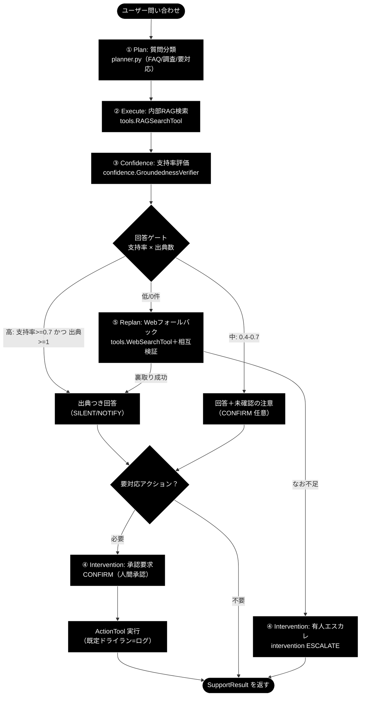
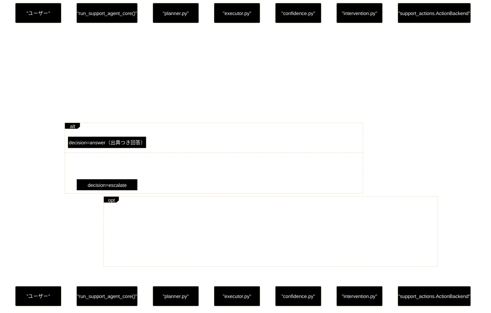
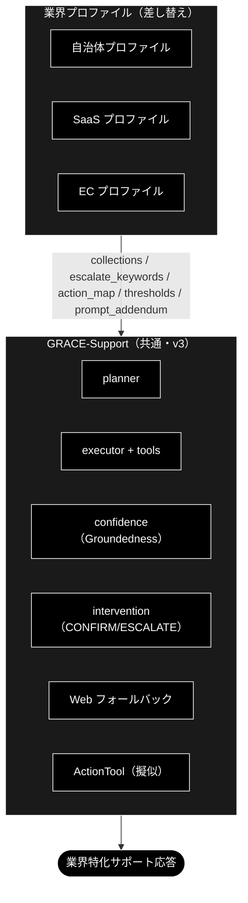

# GRACE-Support 設計書（設計判断の記録）

**Version 1.0** | 最終更新: 2026-09-15 | ステータス: **実装済み**

> 📌 **本書は設計書（WHY）**——なぜこのゲート・しきい値・二段判定・HITL ポリシーなのか、
> という**判断の記録**である。
>
> | 知りたいこと | 正本 |
> |---|---|
> | ステップの実行順と各ステップの入出力（WHAT） | [`support_flow.md`](./support_flow.md) |
> | 関数・クラスの仕様（IPO・シグネチャ・戻り値） | [`core_support_agent.md`](./core_support_agent.md) / [`core_gates.md`](./core_gates.md) / [`core_verticals.md`](./core_verticals.md) |
> | API スキーマ | [`schemas.md`](./schemas.md) / [`api_support.md`](./api_support.md) |
> | Web UI 起点の end-to-end | [`webapp_flow.md`](./webapp_flow.md) |
> | GRACE-**Review**（文書 → 指摘）側 | [`review_spec.md`](./review_spec.md) / [`review_flow.md`](./review_flow.md) |
>
> **設計と実装が食い違う場合は、実装とモジュールドキュメントが正。**
> 本書は IPO を持たない（同じ表を 2 箇所に持つと必ず腐るため）。

> 📝 **統合について（2026-09-15）**: 本書は `agent_support_example.md`（996 行）・
> `agent_support_verticals.md`（389 行）・`multi_question_handling.md` §0/§13（確定仕様）の
> **設計判断部分だけ**を 1 本に統合したものである。
> 3 文書が重複して持っていた関数 IPO は `core_*.md` へのリンクへ置換し、
> `multi_question_handling.md` の不採用案（§1〜§12）は
> [`archive/multi_question_handling.md`](./archive/multi_question_handling.md) に記録として残した。

> **参考ドキュメント**
> - [`grace/docs/grace.md`](../../grace/docs/grace.md) — 5 段階設計の定義と設計思想（WHY）
> - [`grace/docs/grace_core.md`](../../grace/docs/grace_core.md) — コアモジュール群の横断アーキテクチャ（WHAT）
> - [`grace/docs/grace_runtime.md`](../../grace/docs/grace_runtime.md) — 実行時に発行される API とプロンプト全文（HOW）
> - [`../../docs/pipelines.md`](../../docs/pipelines.md) — 基本版 / Support / Review の 3 モード対照

---

## 目次

- [概要](#概要)
- [1. 回答ポリシー（groundedness ゲート）](#1-回答ポリシーgroundedness-ゲート)
- [2. HITL ポリシー](#2-hitl-ポリシー)
- [3. データ契約とアクション実行の設計](#3-データ契約とアクション実行の設計)
- [4. 処理シーケンス（設計レベル）](#4-処理シーケンス設計レベル)
- [5. 0-(A) 複数質問クエリと担当範囲外](#5-0-a-複数質問クエリと担当範囲外)
- [6. 業界特化（gov / saas / ec）](#6-業界特化gov--saas--ec)
- [7. 評価指標（KPI）と現状](#7-評価指標kpiと現状)
- [8. 実装ロードマップ](#8-実装ロードマップ)
- [9. 変更履歴](#9-変更履歴)

---

## 概要

**GRACE-Support** は、日本語 RAG 自律エージェント（GRACE）を土台にした
**カスタマーサポート／社内ナレッジ・コパイロット**である。

一言でいうと——**「社内ナレッジで答え、足りなければ Web で裏取りし、出典を必ず示し、
“わからない/行動が要る”ときは人間に渡す、日本語サポート AI」**。

既存モジュール（planner / executor / confidence / calibration / memory / intervention /
replan / tools）を流用し、**新規に設計したのは「回答ゲート」「Web フォールバックの明示化」
「アクション＋HITL」の 3 点**に限定している。これが本書の中心的な設計判断である。

### 主な責務

- 質問を 3 分類（FAQ 即答／要調査／要対応アクション）して計画を立てる
- 内部 RAG で回答し、**出典（citation）を必ず提示**する
- 根拠不足なら**「わかりません」と誠実に答える**（ハルシネーション抑制）
- 内部知識が不足するときのみ **Web 調査へフォールバック**し、複数ソースを相互検証する
- 副作用のある操作（チケット起票・返信・エスカレーション）は **HITL 承認（CONFIRM）を必須**とする
- 解決履歴・エスカレーション履歴を memory に蓄積し、次回の計画へ反映する

### 使用するモジュール対応

| 分類 | モジュール | この用途での役割 |
|------|-----------|----------------|
| 既存 | `grace/planner.py` | 質問 3 分類 → 計画生成 |
| 既存 | `grace/executor.py` | ステップ実行・動的フォールバック統括 |
| 既存 | `grace/tools.py` | `RAGSearchTool` / `WebSearchTool` / `ReasoningTool` / `AskUserTool` |
| 既存 | `grace/confidence.py` | `GroundednessVerifier`（支持率）/ `SourceAgreementCalculator`（ソース一致） |
| 既存 | `grace/calibration.py` | 信頼度の温度較正 |
| 既存 | `grace/intervention.py` | 出典不足 → ESCALATE、行動前 → CONFIRM |
| 既存 | `grace/replan.py` | 内部 0 件 → Web、矛盾 → 再検索 |
| 既存 | `grace/memory.py` | 解決/エスカレ履歴の学習 |
| **本設計で追加** | `backend/app/core/gates.py` | 回答ゲート・二段判定・④' 情報なし検知・0-(A) 質問分析（純関数群） |
| **本設計で追加** | `backend/app/core/verticals.py` | `VerticalProfile` / `PROFILES` / `ActionRequest` |
| **本設計で追加** | `support_actions.py` | `ActionBackend`（dry-run / pseudo / webhook）＋ `IdentityVerifier` |

> ⚠️ **`agent_support_example.py` は実装ではない。** 231 行の CLI ラッパー
> （`backend.app.core.*` の再エクスポート ＋ `_render()` ＋ `main()`）であり、
> 実体は `backend/app/core/support_agent.py` の `run_support_agent_core()` にある。
> Web API（`uvicorn backend.app.main:app`）も CLI も**この 1 関数を通る**。

---

## 1. 回答ポリシー（groundedness ゲート）

RAG 回答を **groundedness（支持率）でゲート**し、状態に応じて「回答／Web 調査／確認／エスカレ／アクション」へ分岐する。



---

`GroundednessVerifier` の**支持率(support_rate)**と**出典数**で分岐する。しきい値は既存 `config.confidence.thresholds`（`silent=0.9 / notify=0.7 / confirm=0.4`）を流用する。

| 状態 | 条件（例） | decision | 振る舞い |
|------|-----------|----------|---------|
| **自信あり** | 支持率 ≥ 0.7 かつ 出典 ≥ 1 | `answer` | 出典つきで自動回答（SILENT/NOTIFY） |
| **要注意** | 0.4 ≤ 支持率 < 0.7 | `answer`（注意付） | 回答＋「未確認の注意書き」、必要なら CONFIRM |
| **わからない** | 支持率 < 0.4 または 出典 0 | `escalate` 前に Web | 「社内ナレッジには見当たりません」→ Web 調査 → なお不足なら ESCALATE |

> **設計意図**: 「根拠のない断定を構造的に出さない」ことを最優先にする。既存の `GroundednessVerifier`（回答を主張に分解し supported/contradicted/neutral を判定）をそのまま利用し、支持率が低い＝出典で裏付けられない回答は**自動的に“わからない”へ倒す**。

---
---

## 2. HITL ポリシー

| トリガー | 介入レベル | 挙動 |
|---------|-----------|------|
| 副作用のあるアクション実行前 | **CONFIRM** | 人間承認を得るまで実行しない |
| 出典不足・低信頼（支持率 < 0.4） | **ESCALATE** | 有人対応へ引き継ぎ、AI は回答を断定しない |
| 中信頼（0.4–0.7） | NOTIFY | 回答するが「未確認」を明示 |
| 高信頼（≥ 0.7・出典あり） | SILENT/NOTIFY | 自動回答 |

- 非対話 CLI では、CONFIRM/ESCALATE のコールバックを**自動承認＋ログ**（`--dry-run` 既定）にして安全に検証する。
- UI 連携時は実際の確認ダイアログ（`intervention.ConfirmationFlow`）に差し替える。

---
---

## 3. データ契約とアクション実行の設計

### 3.1 データ契約

回答・出典・判定・アクションを 1 つの戻り値へ集約する **`SupportResult`**（dataclass）と、
副作用操作の要求を表す **`ActionRequest`**（dataclass）を設計の基本単位とする。

| 型 | 実装位置 | 仕様の正本 |
|---|---|---|
| `SupportResult` | `backend/app/core/support_agent.py` | [`core_support_agent.md`](./core_support_agent.md) |
| `ActionRequest` / `VerticalProfile` | `backend/app/core/verticals.py` | [`core_verticals.md`](./core_verticals.md) |
| `QuestionCluster` | `backend/app/core/support_agent.py` | [`core_support_agent.md`](./core_support_agent.md) |
| API レスポンス（Pydantic） | `backend/app/schemas.py` | [`schemas.md`](./schemas.md) |

> ⚠️ **フィールド表を本書に置かない。** 以前は本書の前身（`agent_support_example.md` §3）が
> dataclass 定義を丸ごと複製していたが、`SupportResult` に 0-(A) の 7 フィールドが
> 追加された際に取り残された。同じ表を 2 箇所に持つ限り必ず腐る
> （`backend/docs/README.md` §1 問題 #8 と同じ処方箋）。

**設計上の決定事項**（実装が変わっても意味が変わらない部分）:

| 論点 | 決定 | 理由 |
|---|---|---|
| `decision` の値域 | `answer` / `escalate` の **2 値** | 設計当初の `ask` / `action` は `warning` フラグと `action` フィールドへ整理した。判定軸を 1 本にしないとゲートが読めなくなる |
| 中信頼の扱い | `answer` ＋ `warning=True` | 「答えない」ではなく「未確認と明示して答える」。黙って精度を落とさない |
| 判定不能（全 neutral）の扱い | `groundedness_decided=0` として支持率の母数から除外 | Q&A 形式のソースでは全主張が neutral になりうる。母数に入れると「答えていない内容」で減点される |
| 出典の型 | 当面 `list[str]`（`[社内] …` / `[Web] …` ラベル付き） | `Citation` の構造化（kind/collection/score）はコア `schemas.py` 化時に導入予定 |

### 3.2 アクション実行の設計（`ActionTool` 案 → `ActionBackend` で実現）

> ⚠️ **設計当初の `ActionTool`（`grace/tools.py` へ追加する案）は採用しなかった。**
> 実装はリポジトリ直下 `support_actions.py` の **`ActionBackend` 抽象**として実現している
> （`grep -rn "class ActionTool" --include=*.py` は 0 件）。
> 「ツールとして executor に持たせる」のではなく「パイプラインの ⑥ が直接呼ぶ」形にしたのは、
> 副作用の実行を **HITL CONFIRM の直後に閉じ込める**ためである。
> ツール化すると executor が計画の都合で任意のタイミングに差し込めてしまう。

| 項目 | 設計（当初案） | 実装（現在） |
|------|---------------|-------------|
| 置き場所 | `grace/tools.py::ActionTool(BaseTool)` | `support_actions.py::ActionBackend`（ABC） |
| 実体 | `ToolRegistry` へ opt-in 登録 | `DryRunActionBackend` / `PseudoActionBackend` / `WebhookActionBackend` |
| 対応アクション | `create_ticket` / `send_reply` / `escalate_to_human` | 同左（`ActionType`） |
| 既定 | ドライラン（実行せずログ） | **同左**（`--dry-run` 既定 ON） |
| 本人確認 | 設計時は未定義 | `IdentityVerifier` / `CsvIdentityChecker`（台帳未設定なら安全側で未確認 → 有人へ） |

**安全策（設計意図）**:

1. 実行前に **CONFIRM 必須**（intervention 経由）
2. `dry_run=True` ならログのみ。**既定を安全側に置く**
3. 対象・引数を `confidence_factors` に残す（後から何をしようとしたか追える）
4. 実 API 連携（Webhook・JSON POST・Bearer 任意）は **opt-in**（`SUPPORT_ACTION_WEBHOOK_URL`）

> セキュリティ方針は既存 `CodeExecuteTool`（静的チェック＋資源制限＋opt-in）に倣っている。

---

## 4. 処理シーケンス（設計レベル）



---
> 📝 実際の実行順（0-(A) → 0-(B) → ① → ② → ③ → ④ → ⑤ → ④' → ⑥）と
> 各ステップの入出力は [`support_flow.md`](./support_flow.md) を参照。
> 上図は**設計判断（どこで誰が止めるか）**を示すための簡略版である。

---

## 5. 0-(A) 複数質問クエリと担当範囲外

### 5.1 パイプライン上の位置

```
0-(A) 入力・質問分析  ← 本節
 → 0-(B) 業界プロファイル適用
 → ① Plan → ② Execute → ③ Groundedness → ④ 回答ゲート
 → ⑤ Web フォールバック → ④' 情報なし検知 → ⑥ Action
```

**前処理であってゲートではない。** planner / executor / gates の判定ロジックは
1 行も変えていない。再構成後の文を `query` として渡すため、planner から見れば
それが「利用者の元の質問文」であり、完全一致でコピーする規則
（`grace/planner.py:110-111`）とも衝突しない。

### 5.2 二段判定と安全側の向き

| 段 | 実装 | LLM |
|---|---|:--:|
| 第 1 段（候補検出） | `gates.looks_like_multi_question` — 接続表現（`また、` 等）または疑問符 2 個以上 | 呼ばない |
| 第 2 段（構造解析＋担当範囲） | `gates.create_question_analyzer` — 主質問と関連質問へ構造化し、**同じ 1 回で IN/OUT も判定** | 1 回（形式違反のときのみ 2 回） |

##### ⚠️ 第 2 段は「解析結果ではなく了解の返事」を返すことがある

実測 2026-08-29（クラウド版・軽量判定モデル）。同じプロンプトで、返ってきたのは:

```
了解しました。問い合わせの構造を解析し、主質問と関連質問を整理するルールを
理解しました。以下のポイントを確認しました： ✓ 主質問：独立したトピック …
```

規則の羅列＋「入力: … 出力:」の穴埋め形式が、**指示の受け取り**と解釈された。
結果、混在クエリがそのまま検索に流れ（RAG 0.7179。分解できていれば 0.8011）、
関連性判定 NO → Web フォールバック → SerpAPI 500 → ask_user という
無駄な連鎖まで起きた。

対策は 3 つ:

1. **プロンプトの末尾を命令文にする**（`【指示】…結果の行だけを出力すること。
   了解・確認・前置き・ルールの復唱は書かない。`）
2. **形式違反なら 1 回だけ厳格に再要求する**。`SINGLE` と明示されたときは
   正常な判定なので**再要求しない**（単一質問のたびに LLM を 2 回呼ばない）
3. **元の問い合わせに由来しない行は出力ごと捨てる**（`_derives_from_query`・
   文字 2-gram の一致率 0.5 以上）

3 が要るのは、パーサが行を機械的に読むためである。上の実測では前置きが
行数上限（`MAX_QUESTION_CLUSTERS`）を超えたので弾かれたが、**行数が少なければ
散文がそのまま「主質問」として採用され**、聞かれていない質問に答え、UI にも
主質問として表示されていた。部分採用はしない（1 行でも怪しければ全体を捨てる）。

⚠️ **安全側の向きが後段のゲートと逆である。**

| 機構 | 判定できないとき |
|---|---|
| `_detect_no_info_answer` 等 | escalate（答えない方が安全） |
| **複数質問検知** | **「単一とみなす」**（＝現行動作の維持） |

誤って分解する方が害が大きい。選択がタイムアウト・拒否されたときも
**原文のまま 1 回だけ実行する**（escalate に倒さない）。

### 5.3 実装ファイル

| 層 | ファイル | 内容 |
|---|---|---|
| 純ロジック | `backend/app/core/gates.py` | `looks_like_multi_question` / `_parse_cluster_output` / `create_cluster_analyzer` / `detect_question_clusters` / `fallback_reconstruct` / `reconstruct_query` / `deferred_main_questions` / `multi_question_enabled` / `_parse_scope_output` / `create_scope_classifier` / `split_by_scope` |
| パイプライン | `backend/app/core/support_agent.py` | `STEP_IDS` に `analyze` を追加。① Plan の手前で検知 → 選択 → 再構成 |
| スキーマ | `backend/app/schemas.py` / `support_agent.py` | `QuestionCluster` ＋ `SupportResult` に 7 フィールド（すべて optional） |
| 選択 API | `intervention_bridge.py` / `jobs.py` / `api/support.py` | `selected_option` を後方互換で追加（既定 None） |
| フロント | `state/interventionKind.ts` / `components/QuestionSelectModal.tsx` / `AnswerCard.tsx` / `state/jobReducer.ts` | 種類判定（純関数）・選択 UI・保留質問表示・タイムライン |

### 5.4 返すもの（`SupportResult`）

| フィールド | 意味 |
|---|---|
| `is_multi_question` | 複数質問と判定されたか |
| `question_clusters` | `[{main, related[]}]` |
| `adopted_cluster_index` | 採用したクラスタの位置 |
| `reconstructed_query` | 再構成後の質問文（**原文と同じなら null**） |
| `deferred_questions` | 🔴 採用しなかった**範囲内**の主質問。**必ず UI に出す** |
| `out_of_scope_questions` | 担当範囲外と判定した主質問（保留とは別扱い） |
| `out_of_scope_guidance` | 範囲外の質問へ添える窓口案内（プロファイル由来） |

`deferred_questions` を出さないと、「片方の質問が無言で落ちたのに support_rate が
高いので高信頼として提示される」事故と区別がつかない。

### 5.5 担当範囲外の質問（**断って窓口案内する**）

複数の主質問のうち、業界プロファイルの担当範囲外のものは**選択肢に出さない**。

| | 保留（`deferred_questions`） | 担当範囲外（`out_of_scope_questions`） |
|---|---|---|
| 意味 | 範囲内だが、今回は答えていない | この窓口では答えられない |
| 利用者が次にすること | 個別に聞き直せば答えが得られる | 別の窓口へ行く |
| UI | 「保留した質問（未回答）」 | 「担当範囲外の質問」＋ `out_of_scope_guidance` |

**この 2 つを混ぜない。** 利用者が取るべき行動が違う。

判定は二段判定の第 2 段（`gates.create_scope_classifier`）で、全主質問を
**1 回の LLM 呼び出し**でまとめて判定する。プロファイルの
`scope_description`（担当範囲の説明）と `out_of_scope_guidance`（窓口案内）を使う。

⚠️ **安全側は「判定できないなら範囲内」。** 範囲外と誤判定すると答えられる質問を
断ってしまう。答えようとして生成側の `SCOPE_POLICY` が断る分には二重の
防波堤が働くだけで害がない。分類器が全件 OUT を返した場合も全件範囲内へ倒す
（分類器の故障と本当に全部範囲外なのを区別できないため）。

**背景（実測 2026-08-29）**:「住民票の写しの取り方は？ ところで、明日の東京の
天気は？」で、天気（gov の範囲外）が選択肢に並び、利用者に 1 往復させたうえ
保留として落ちた。同じ質問を選択なしで通したクラウド版は、住民票に回答しつつ
天気は「担当範囲外です → 気象庁へ」と 1 パスで返しており、そちらのほうが
利用者体験として良い。

##### 範囲外の質問は「1 回の回答」の中で断る

⚠️ **検索クエリからは外すが、生成側へは渡す。**

範囲外の主質問を検索クエリに残すと、意味の重心がボケて検索精度が落ちる
（実測 2026-08-29: 混在クエリ 0.7225 に対し、再構成後 0.8011）。一方で外した
ままだと生成側は範囲外の質問が**あったことすら知らない**ため、`SCOPE_POLICY` の
一般論だけでは断りようがなく、利用者から見て「聞いたはずの片方が返答に出て
こない」状態になる。

そこで `VerticalProfile.build_closing_instruction()` が、範囲外の**質問文だけ**を
reasoning へ足す（**【回答の構成ルール】の後ろ**に置く。理由は後述）:

```
【この問い合わせに含まれる担当範囲外の質問】
- 明日の東京の天気は？
これらには内容を回答しないこと。そのうえで、**同じ回答の末尾に**担当範囲外である
旨と次の案内を必ず書くこと（別の問い合わせとして先送りしない）:
「天気・ニュース・一般常識や他機関の手続きは…」
⚠️ この断りと案内は参照情報に無くてよい。後述の【回答の構成ルール】の
1（参照情報にある事実のみ）・7（捏造禁止）は**事実の記述に対する規則**であり、
担当範囲の案内はその例外である。規則を理由に省略しないこと。
```

これで **検索は絞ったまま、回答は 1 回で両方に対応**する。

##### ⚠️ 指示に従うかはモデル次第なので、コード側で担保する

実測 2026-08-29（**同一の質問・同一の注入**）:

| モデル | 回答本文の断り |
|---|---|
| `claude-sonnet-4-6` | あり（「天気・気象情報は当窓口の担当範囲外」） |
| 姉妹リポジトリのローカル LLM | **なし**（住民票にだけ答えて終わり） |

落ちる理由は、回答生成プロンプトの【回答の構成ルール】1（参照情報にある事実のみ）・
7（捏造禁止）と衝突して見えるためと考えられる。注入文でも「担当範囲の案内はその
例外」と明示したが、それでも従う保証はない。

そこで `gates.ensure_out_of_scope_notice()` が、**回答本文が断りに触れていなければ
追記する**。モデルが自分で断っていれば（`OUT_OF_SCOPE_ANSWER_MARKERS` で判定）
断り本文は足さない。

⚠️ **ただし案内先の URL だけは、モデルが断っている場合でも欠けていれば補う**
（`_append_missing_links`）。断りの指示を `prompt_closing` へ移して以降、
クラウド版では**モデル自身が断りを書くのが通常の経路**になった
（実測 2026-08-31: 本文に「ご注意（担当範囲外のお問い合わせについて）」と
気象庁・e-Gov の URL が出た）。つまり「マーカーがあれば何もしない」分岐が
主経路に変わったので、モデルが断りだけ書いて URL を落とすと案内先が丸ごと消える。
足りないのは URL なので **URL だけ**を足す（定型の断り文を重ねない）。

⚠️ 追記は**ゲートの後**で行う。groundedness も ④' 情報なし検知も、モデルが生成した
内容だけを見るべきで、こちらが後付けした定型文で判定を動かさない。

##### 断りの指示は【回答の構成ルール】の**後ろ**に置く

⚠️ **位置が結果を変える。** 業務方針（参照情報の手前）に混ぜていたとき、後段の
【回答の構成ルール（最重要）】に負けて、モデルが断りを落とす事象が実測 2 回連続で
起きた（2026-08-30 03:00 / 04:07。どちらも同じ注入で、回答は担当範囲内の説明だけで
終わっていた）。

`VerticalProfile.build_closing_instruction()` が返し、`llm.prompt_closing` として
構成ルールの後ろへ置く。業務方針（`build_prompt_addendum()`）は参照情報の読み方に
効くので、位置は変えない。

##### 案内先の URL はこちらが literal で渡す

「担当範囲外です。該当窓口へどうぞ」だけでは、利用者は結局そこから自分で探すことに
なる（実測 2026-08-30 の指摘「あるけど、URL ぐらい欲しい」）。

`VerticalProfile.out_of_scope_links`（表示名 → URL）に案内先を持たせ、
注入プロンプトと `ensure_out_of_scope_notice` の両方から出す。

⚠️ **URL を記憶から書かせない。** 回答の構成ルール 4 は「出典行に無い URL・
ドメイン名を書くことは捏造にあたる」としている。案内先を出したいなら、こちらが
literal で渡すのが唯一の正しい方法である（実測 2026-08-29 のクラウド版は、
渡していない URL を記憶から補っていた）。

⚠️ **実在する公的機関の URL だけを置く。** ここに書いた URL はそのまま回答へ出る。
架空の事業者（saas / ec のサンプル）には URL を持たせない。

UI のカード（`out_of_scope_questions`）は「どの質問が範囲外だったか」という
**構造だけ**を示す。窓口案内は回答本文が持つので、カードには書かない
（同じ案内文を 2 度出さない）。

ここで足した断り文は claim として抽出され neutral になるが、
`grace.confidence.is_unsupportable_policy_claim` が支持率の母数から除外するので、
**正しく断るほど信頼度が下がることはない**。

⚠️ **安全側は「判定できないなら範囲内」。** 範囲外と誤判定すると答えられる質問を
断ってしまう。答えようとして生成側の `SCOPE_POLICY` が断る分には二重の
防波堤が働くだけで害がない。分類器が全件 OUT を返した場合も全件範囲内へ倒す
（分類器の故障と本当に全部範囲外なのを区別できないため）。

**背景（実測 2026-08-29）**:「住民票の写しの取り方は？ ところで、明日の東京の
天気は？」で、天気（gov の範囲外）が選択肢に並び、利用者に 1 往復させたうえ
保留として落ちた。同じ質問を選択なしで通したクラウド版は、住民票に回答しつつ
天気は「担当範囲外です → 気象庁へ」と 1 パスで返しており、そちらのほうが
利用者体験として良い。

### 5.6 挙動の一覧

| 入力 | 第 2 段 | 選択 | 結果 |
|---|---|---|---|
| 単一質問 | 呼ばない | 出さない | **完全に現行どおり**（`analyze` は skipped） |
| 主質問 1 ＋ 関連質問 N | 呼ぶ | 出さない | 再構成して 1 周（指示語を解決） |
| 主質問 N（範囲内 1 ＋ 範囲外 N-1） | 呼ぶ | **出さない** | 範囲内へ回答＋範囲外は断り＋窓口案内 |
| 主質問 N（範囲内が複数） | 呼ぶ | 出す | 選ばれた 1 つを再構成して 1 周＋保留質問を提示 |
| 選択がタイムアウト／拒否 | 呼ぶ | 出す | **原文のまま 1 周**（escalate にしない） |
| 解析器が失敗・空応答 | 呼ぶ | 出さない | 単一とみなす（現行どおり） |

### 5.7 テスト

| ファイル | 内容 |
|---|---|
| `backend/tests/test_multi_question.py` | 純ロジック（第 1 段・出力解析・再構成・保留質問）＋ `judges.multi_question` の独立性 |
| `backend/tests/test_multi_question_pipeline.py` | パイプライン組み込み（単一質問の不変・選択・保留・タイムアウト時の挙動） |
| `frontend/src/state/interventionKind.test.ts` | 承認待ちの種類判定 |

---
### 5.8 採用方式の決定事項（確定仕様）

| 論点 | 決定 |
|---|---|
| 全問に答えるか / 絞るか | **絞る**。1 リクエストで 1 クラスタに回答する |
| 選定主体 | **A. ユーザーが対話で選ぶ**（`ask_user` 相当・1 往復増）。自動選定はしない |
| 採用単位 | **クラスタ ＝ 主質問 ＋ その配下の関連質問** |
| パイプラインへ渡す質問 | クラスタを **1 つの質問文へ再構成**したもの |
| 採用しなかった主質問 | **成果物として明示的に返す**（必須） |
| 検知失敗時 | **「単一質問」とみなす**（＝現行動作を維持） |

### 5.9 クラスタと再構成

**採用単位は「主質問」ではなく「主質問 ＋ その配下の関連質問」のクラスタ**とする。
関連質問は主質問に**従属**しており、切り離すと主質問の回答自体が不完全になるためである。

| 入力 | 構造 | 挙動 |
|---|---|---|
| 「住民票の取り方は？ **その手数料は？**」 | クラスタ 1 つ（主 1 ＋ 関連 1） | **複数質問だが選択不要**。再構成して 1 周 |
| 「住民票の取り方は？ **他市町村への移動は？**」 | クラスタ 2 つ（主 2） | **選択が必要**。`ask_user` で提示 |
| 「住民票の取り方は？ その手数料は？ 他市町村への移動は？」 | クラスタ 2 つ（主 1＋関連 1 / 主 1） | 選択が必要。選んだ側の関連質問も一緒に答える |

> 📝 **クラスタが 1 つしかない場合は `ask_user` を出さない。** 「複数質問だがクラスタは 1 つ」
> （＝主質問 1 ＋ 関連質問 N）は選択の余地が無いため、再構成してそのまま実行する。
> 不要な往復を増やさないための分岐である。

#### 再構成（reconstruct）

採用クラスタを、**自然言語の 1 文へ組み直してから**パイプラインへ渡す。

```
主質問  : 住民票の写しの取り方は？
関連質問: その手数料は？
   ↓ 再構成
「住民票の写しの取り方と、その手数料を教えてください」
```

**再構成する理由**は 2 つある。

1. **指示語を解決するため。** 「**その**手数料」は単体では何の手数料か不明で、
   ベクトル検索がまったく効かない。主質問の文脈を埋め込む必要がある。
2. **原文をそのまま連結すると別トピックのノイズが混じるため。** 採用しなかった主質問の
   文字列が残ると、検索の意味の重心がボケる（§1 の #2 と同じ問題）。

> ⚠️ **`planner.py` の「完全一致でコピー」規則とは衝突しない。**
> `grace/planner.py:110-111` が禁じているのは**要約・キーワード化・分割**であり、
> `:103-105` はむしろ「単語の羅列に変換せず、**自然言語の文脈を維持**せよ」と求めている。
> 再構成は**自然言語の 1 文を保つ**変換であり、この意図に沿う。
>
> かつ、**再構成はパイプラインの外側（前処理）で行う**。
> `run_support_agent_core(query=<再構成後の質問>)`（`support_agent.py:194-195`）として渡すため、
> planner から見れば再構成後の文が「ユーザーの元の質問文」であり、それを完全一致でコピーする。
> **planner・executor・gates は一切改変しない。**

### 5.10 残るリスク

- **1 往復増える。** 自治体窓口のような用途では負担になり得る。運用で問題が出た場合は、
  §5.8 の「選定主体」だけを B（自動選定＋事後表示）へ変える余地を残す
  （スキーマ・再構成・保留質問の明示はそのまま流用できる）。
- **再構成の誤り。** LLM が主質問の意図を取り違えると、誤った質問に答えることになる。
  `reconstructed_query` を UI に表示し、利用者が気付けるようにすることで緩和する。
- **クラスタ化の誤り。** 独立した質問を「関連質問」と誤判定すると、選択肢に現れず
  黙って一緒に答えられてしまう。過剰分解の逆方向の失敗であり、テスト（§5.7）で抑える。
> 📎 **採用しなかった案**（§2〜§9 の fan-out 系ロードマップ・N 問すべてに答える案 A/B/C）は
> [`archive/multi_question_handling.md`](./archive/multi_question_handling.md) に記録として残してある。

---

## 6. 業界特化（gov / saas / ec）

> ## ⚠️ 本書の範囲（2026-09-04）
>
> 本章は **`VerticalProfile`（`backend/app/core/verticals.py`）と、それを使う判定ロジックの設計書**である。
>
> 旧版は KPI 評価基盤 `eval/vertical/`（`run.py` / `metrics.py` / `cases/*.jsonl` /
> `register_test_collections.py` / `data/*.csv`）を 17 箇所から参照し、ヘッダーで
> 「gov 7/7・saas 8/8・ec 9/9＝decision_accuracy 1.000」と実測値まで主張していたが、
> **それらは本リポジトリにも姉妹リポジトリ `grace_v2_local` にも存在しない**
> （`git log --all --full-history -- 'eval/*'` が両方とも空）。他プロジェクト由来の記述だったため、
> **2026-09-04 に KPI 評価章（旧 §8「テスト用データ」・旧 §9.1「KPI 評価」）ごと削除した。**
>
> 現存するテストは `backend/tests/` 配下のみ（§6.7）。

### 6.0 業界特化とは何か

#### 主な責務

業界特化レイヤー（`VerticalProfile`）が GRACE-Support 共通エンジンの上で担う責務は次の 5 つ。

1. **検索範囲の限定** — 業界の専用コレクションだけを回答根拠にする（`allowed_collections`。フォールバック連鎖も業界外へ漏らさない）
2. **判断基準の切替** — 「答える / 人に渡す」の閾値・強制エスカレ語・アクション語彙を業界の業務設計に合わせる
3. **安全装置の業界適合** — 本人確認（EC）・断定回避（gov）・「情報なし回答」の検知（④'）など、**間違え方の業界差**を吸収する
4. **語り口の注入** — `prompt_addendum` により回答方針（用語・禁則・トーン）を業界化する
5. **業界別の品質保証** — 期待ラベル付きテストケースと KPI で「良いサポート」の定義ごと評価する（テスト用データの整備を含む）

#### 各責務対応のモジュール

| 責務 | 実装（`backend/app/core/` / `grace/`） | テスト・データ資産 |
|---|---|---|
| 検索範囲の限定 | `PROFILES[v].collections` → `config.qdrant.allowed_collections` → `RAGSearchTool._apply_allowed_collections` | `backend/tests/test_vertical_scope.py` |
| 判断基準の切替 | `_answer_gate()`（閾値）/ `_should_force_escalate()`（エスカレ語×意図分類）/ `_decide_action()`（アクション語彙） | `backend/tests/test_no_info_judge.py` |
| 安全装置の業界適合 | `_perform_action()`（本人確認）/ `_detect_no_info_answer()`＋`create_no_info_judge()`（④'） | `backend/tests/test_no_info_judge.py` |
| 語り口の注入 | `PROFILES[v].prompt_addendum` → `config.llm.prompt_addendum` → `ReasoningTool._build_prompt()` | —（reasoning 出力に反映） |
| 業界別の品質保証 | ❌ **評価基盤は本リポジトリに無い**（旧版が挙げていた `eval/vertical/` 一式は存在しない） | `backend/tests/test_vertical_scope.py` / `test_no_info_judge.py` |

#### 主要機能一覧

| 機能 | 概要 | 参照 |
|---|---|---|
| `--vertical gov / saas / ec` | プロファイル一括切替 CLI（閾値・エスカレ語・アクション・本人確認・検索範囲・方針） | §7 |
| 二段判定（エスカレ語・アクション語） | キーワード候補一致 → 軽量 LLM 意図分類で FAQ 質問の誤検知を抑止 | §6 |
| ④' 情報なし回答検知 | 「見つかりませんでした」型回答を実質回答判定（answered/no_info）で escalate へ | §6・§9 |

#### 定義: 何をもって「業界特化」と呼ぶか

**「業界特化」＝共通エンジン（GRACE-Support）は 1 つのまま、業界ごとに差し替わる 7 つの機構（VerticalProfile）で挙動を変えること。**
エンジン本体（Plan → 内部 RAG → 根拠検証 → 回答ゲート → Web 裏取り → アクション＋HITL）は
gov / saas / ec で完全に共通であり、業界性はすべて**プロファイルの差分として注入**される。

言い換えると、業界特化の実体は次の 6 軸を業界別に定義したものである:
**「①何を知識源とし、②どこまで自信があれば答え、③何を人間に渡し、④何を実行し、⑤どう語り、⑥何で測るか」**。

#### 業界特化を構成する 7 つの機構

| # | 機構 | 何が業界ごとに変わるか | 例 | 実装位置 |
|---|---|---|---|---|
| 1 | **検索スコープ**（`collections` → `config.qdrant.allowed_collections`） | 回答の根拠にしてよいナレッジの範囲。フォールバック連鎖も業界外へ漏れない | gov=FAQ・法令系のみ / ec=規定・注文 FAQ のみ | `RAGSearchTool._apply_allowed_collections` |
| 2 | **回答の厳しさ**（`notify_th` / `confirm_th`） | 「どこまで確信があれば答えてよいか」の基準 | gov は 0.8/0.5（既定 0.7/0.4 より厳格）＝「間違えるくらいなら窓口へ」 | `_answer_gate()` |
| 3 | **強制エスカレ基準**（`escalate_keywords`＋意図分類） | 機械に答えさせてはいけない話題の定義（二段判定で FAQ 質問の誤検知は抑止） | gov=法的判断・減免・個別事情 / saas=障害・課金 / ec=決済・破損 | `_should_force_escalate()` |
| 4 | **アクション語彙**（`action_map`） | 「対応」と見なす意図と、その処理先 | ec「返品したい」→起票 / gov「様式がほしい」→案内返信（申請自体は人間） | `_decide_action()` |
| 5 | **本人確認**（`require_identity`) | 副作用操作の前に本人確認を要するか | EC のみ True（注文情報の操作） | `_perform_action()` |
| 6 | **業務方針**（`prompt_addendum` → `config.llm.prompt_addendum`） | 回答の語り口・禁則 | gov「断定回避・担当課明示・個人情報を尋ねない」/ saas「バージョン明示・再現手順」 | `ReasoningTool._build_prompt()` |
| 7 | **評価基準**（KPI・期待ラベル付きテスト質問） | 何をもって良いサポートとするか | gov「根拠なし回答=0」/ ec「本人確認遵守率=100%」 | ❌ **未整備**（KPI を自動計測する基盤は本リポジトリに無い） |

#### 成熟度: 現時点で「特化」と呼べる度合い（正直な評価）

- **厚い部分（実質的な差別化）**: 機構 3・4・5。同種の依頼でも EC では「本人確認 → CONFIRM → 起票」、
  gov では「有人窓口へ」と、**業界の業務設計（誰が何をしてよいか）の違いをコードが実際に分岐**している。
- **薄い部分（まだ枠のみ）**:
  - 機構 1 のナレッジは**枠だけがある**段階。プロファイルは `gov_faq_anthropic` 等の
    専用コレクション名を持つが、**その中身を用意する手段が本リポジトリには無い**
    （テストデータと一括登録スクリプトは旧版が実在すると書いていただけで存在しない）。
    登録は汎用の `qa_qdrant/register_to_qdrant.py` を使い、データは自前で用意することになる。
  - 機構 7（評価基準）は**未整備**。KPI を自動計測する基盤が無いため、
    「特化がどれだけ効いているか」を数値で示せる状態にない。
  - 機構 2・6 は数値 2 つと日本語 1 文であり、「特化」というより業界別チューニングの置き場。
  - 業界固有ワークフロー（実返品 API・申請システム連携）、業界用語辞書、制度改正追随は**未実装**。
    ActionTool は擬似（ドライラン）。

#### 設計理由（トレードオフ）

「業界ごとに別アプリを作る」のではなく「プロファイル差し替え」にしたのは、回答エンジン・出典検証・
HITL という難しい共通部分を 1 回だけ作り、**業界追加を設定の追加に落とす**ため。その代償として、
現段階の「特化」の深さは上記パラメータの深さ＝**投入されたデータの質**に依存する。
次の一手は機能追加ではなく**評価基盤の新規実装と、業界ナレッジの登録**である（§9 の残タスク #3 / #8 / #13）。
その先に実運用データの投入がある。

---

### 6.1 業界プロファイル（差し替えの共通枠）

| 差し替え項目 | 説明 | GRACE-Support 上の反映先 |
|---|---|---|
| `collections` | 検索対象コレクションの許可リスト | planner の `collection` 指定 / tools の検索範囲 |
| `sample_queries` | 代表想定質問（評価・回帰用） | KPI 計測・チューニング |
| `escalate_keywords` | 強制エスカレの語（例: 障害・決済・法的判断） | 回答ゲート前の割り込み判定 |
| `require_identity` | 本人確認が必要な操作か | アクション前 HITL（CONFIRM）強化 |
| `action_map` | 意図 → アクション種別の対応 | `_decide_action()` |
| `thresholds` | notify/confirm の上書き（厳しめ/緩め） | `_answer_gate()` |
| `prompt_addendum` | 業界固有の注意（用語・断定回避 等） | reasoning プロンプトへ追記 |
| `kpi` | 運用指標 | 評価 |

---

### 6.2 GRACE-Support への適用



---

### 6.3 自治体（Local Government）

| 項目 | 内容 |
|------|------|
| **主な責務** | **「誤案内ゼロ」**。出典（条例名・案内ページ）を示せる範囲でのみ答え、法的判断・個別事情は必ず窓口へ渡す |
| **対象コレクション** | `条例・要綱`、`手続き案内`、`窓口FAQ`（住民向け） |
| **専用コレクション** | `gov_faq_anthropic` / `gov_laws_anthropic`（＋暫定代替 `wikipedia_ja`） ← **登録データは各自で用意する**（本リポジトリに同梱の CSV は無い） |
| **代表想定質問** | 「住民票の写しの取り方は？」「国民健康保険の加入手続きは？」「粗大ごみの出し方は？」「保育園の申込期限は？」 |
| **エスカレ基準** | 法的判断・個別事情・出典なしは**必ず有人**。断定を避け、根拠（条例名・案内ページ）を必須にする |
| **アクション** | `send_reply`（担当課・必要書類・窓口時間の案内）。申請受付そのものは人間（`escalate_to_human`） |
| **KPI** | 出典付与率 ≈ 100% / 根拠なし回答 = 0 / 一次解決率 / **誤案内 = 0** |
| **特有の注意** | 正確性最優先・**断定回避**、個人情報を聞かない、高齢者にも平易な表現、最新の制度改正への追随 |

> 自治体は「間違えない・出典を示す・迷ったら窓口へ」を最重視。`thresholds` は厳しめ（confirm/notify を上げる）に設定し、少しでも根拠が弱ければエスカレへ倒す。

---

### 6.4 SaaS

| 項目 | 内容 |
|------|------|
| **主な責務** | **「速い自己解決と正しい振り分け」**。ドキュメント根拠で即答し、障害・課金・セキュリティは即時に起票／有人へ |
| **対象コレクション** | `製品ドキュメント`、`APIリファレンス`、`リリースノート`、`既知の不具合` |
| **専用コレクション** | `saas_docs_anthropic` / `saas_api_anthropic` ← **登録データは各自で用意する**（本リポジトリに同梱の CSV は無い） |
| **代表想定質問** | 「API のレート制限は？」「Webhook の設定方法は？」「このエラーコードの意味は？」「v2 への移行手順は？」 |
| **エスカレ基準** | 障害・課金・セキュリティ、再現不能、バージョン不一致は `create_ticket`／`escalate_to_human` |
| **アクション** | `create_ticket`（障害・不具合）、`send_reply`（ドキュメントリンク・ステータスページ案内） |
| **KPI** | 自己解決率（deflection）/ 一次応答時間 / チケット適正振り分け率 / 再現手順取得率 |
| **特有の注意** | **バージョン差の明示**、出典にドキュメント URL、コード例の正確性、Web フォールバックは公式ドキュメント優先 |

> SaaS は「速く・正確に・再現手順つき」。`escalate_keywords` に「障害」「ダウン」「課金」「情報漏えい」等を入れ、即エスカレ。

---

### 6.5 EC（Eコマース）

| 項目 | 内容 |
|------|------|
| **主な責務** | **「安全な実行」**。返品・キャンセル等の副作用操作を本人確認 → CONFIRM の二段で守りながら完遂させる |
| **対象コレクション** | `商品情報`、`返品・交換規定`、`配送・送料`、`注文FAQ` |
| **専用コレクション** | `ec_policy_anthropic` / `ec_faq_anthropic` ← **登録データは各自で用意する**（本リポジトリに同梱の CSV は無い） |
| **代表想定質問** | 「返品したい」「配送状況を知りたい」「サイズ交換できる？」「注文をキャンセルしたい」 |
| **エスカレ基準** | 個人注文情報の照会・変更（**本人確認必須**）、決済トラブルは有人／本人確認フロー |
| **アクション** | `create_ticket`（返品受付・要 CONFIRM＋本人確認）、`send_reply`（規定・返信テンプレ）。注文照会は注文 ID 必須 |
| **KPI** | 自己解決率 / 返品処理時間 / **誤操作 = 0（本人確認必須）** / CS 満足度 |
| **特有の注意** | **個人情報・注文権限の確認を必須**（`require_identity=True` → アクション前 HITL を強化）、規定の版管理 |

> EC は「行動（返品・キャンセル）に直結」するため、v3 のアクション＋HITL が本領。副作用のある操作は本人確認 → CONFIRM の二段で守る。

---

### 6.6 実装への落とし込み

共通コードは変えず、**プロファイルを渡すだけ**で切り替える設計。

> 📎 `VerticalProfile` の**実際のフィールド定義**は
> [`core_verticals.md`](./core_verticals.md) が正本（本書は設計意図のみを持つ）。
> 設計時の案にあった `sample_queries` / `kpi` は、評価基盤を持たないため実装していない。

**適用ポイント（GRACE-Support への差し込み）**:

| プロファイル項目 | 差し込み先（既存関数) | 状態 |
|---|---|---|
| `escalate_keywords` | **二段判定**: キーワード候補一致（`_match_keyword`）→ 軽量 LLM 意図分類（`create_intent_classifier`・question/request/incident）。question（FAQ質問）は誤検知とみなし通常フロー継続、それ以外・分類失敗は即 `escalate`（Web もスキップ） | ✅ 実装済み（`_should_force_escalate`） |
| `notify_th`/`confirm_th` | `_answer_gate()` のしきい値を上書き | ✅ 実装済み |
| `action_map` | `_decide_action()`（二段判定: キーワード候補 → 意図分類。question は起票せず回答のみ） | ✅ 実装済み |
| `require_identity` | `_perform_action()`（本人確認ステップを前置。起動有無は `SupportResult.identity_checked` に記録） | ✅ 実装済み |
| `collections` | `config.qdrant.allowed_collections` 経由で `RAGSearchTool` の検索候補（明示指定・フォールバック連鎖を含む）を許可リストで限定。実コレクション名（`gov_faq_anthropic` 等）を割り当て済み。未登録なら制限を適用せず従来動作（警告ログ） | ✅ 実装済み（`RAGSearchTool._apply_allowed_collections`） |
| `prompt_addendum` | `config.llm.prompt_addendum` 経由で `ReasoningTool._build_prompt()` のシステム指示直後に「業務方針（遵守）」として注入。executor 経由・Web フォールバック経由の両 reasoning に効く | ✅ 実装済み |
| `sample_queries` / `kpi` | 期待ラベル付きテストケースと KPI 計測は dataclass には持たせない方針 | ❌ **未実装**（外部化先とされていた評価ランナーは本リポジトリに無い） |

**CLI**: `uv run python agent_support_example.py --vertical gov "住民票の取り方は？"`（プロファイルを選択）。**実装済み**。
実行例は [`support_flow.md` 付録A](./support_flow.md#付録a-cli-仕様と実行例) を参照。

**実装状況**: `VerticalProfile` 導入と gov/saas/ec の 3 プロファイルは実装済み（PR #106）。設計時の実装順（自治体 → SaaS → EC）どおり 3 業界を同時に組み込み済みで、上表のとおり全項目が配線済み。残件は §7.2 を参照。

---

### 6.7 テスト

#### 単体テスト（実 API・実 Qdrant 不要）

> ⚠️ **リポジトリ直下に `tests/` は無い**（CLAUDE.md §9.4）。テストは `backend/tests/` 配下のみ。

| テスト | 対象 |
|---|---|
| `backend/tests/test_vertical_scope.py` | `allowed_collections` による検索範囲限定（プロファイルの許可リストに汎用コーパスを混ぜないことの固定を含む） |
| `backend/tests/test_no_info_judge.py` | ④' 実質回答判定の理由・エスカレ条件・使用モデル |
| `backend/tests/test_no_info_prediction.py` | ④' 判定の予測挙動 |

実行: `uv run pytest backend/tests -q`（実 API キー・実 Qdrant は不要）。
---

## 7. 評価指標（KPI）と現状

### 7.1 KPI の定義

需要（サポート業務）に直結する指標をそのまま評価に使う。

| 指標 | 定義 | 目標 |
|------|------|------|
| 自己解決率（deflection） | 有人に回さず解決した割合 | 高いほど良い |
| 出典付与率 | 回答に出典が付いた割合 | ≈ 100% |
| 根拠なし回答率 | 出典/根拠なしで断定した割合 | **0 に近いほど良い** |
| エスカレーション適合率 | ESCALATE が妥当だった割合 | 高いほど良い |
| 平均応答時間 | 問い合わせ→回答 | 低いほど良い |

---

### 7.2 実行コストの目安

1 質問あたりの Anthropic 呼び出しは約 7〜10 回（reasoning・ステップ毎の確信度評価・`evaluate_final`・
groundedness 検証・⑤ 再検証・haiku 判定 2 種）。

- 最大費目はステップ毎の確信度評価 `evaluate_with_factors`（およそ 1/3）。
  `claude-haiku-4-5-20251001`（`config.llm.light_model`）で実行され、`reasoning` /
  groundedness / `evaluate_final` は `claude-sonnet-4-6` を使う。
- 費用を抑えたいときは、⑤ Web フォールバックと外部検索を止めるのが最も効く。

> 📝 **金額の実測値は本書に載せない。** 旧版は「1 ケース ≈ 9 円 / 1 run ≈ 80 円」と
> 書いていたが、これは**本リポジトリに存在しない評価基盤での計測値**だった（下の「本書の範囲」を参照）。

---

### 7.3 残タスク（次工程候補）

`VerticalProfile`（`--vertical`）は実装済み（PR #106）。その後の進捗は次のとおり。

| # | 残タスク | 内容 | 状態 |
|---|---------|------|------|
| 1 | `collections` の実検索限定 | プロファイルの対象コレクション（実名 `gov_faq_anthropic` 等）で RAG 検索範囲をスコープ制限。フォールバック連鎖にも適用。未登録コレクションのみなら制限なしで従来動作（警告） | ✅ **実装済み**（`config.qdrant.allowed_collections`＋`RAGSearchTool._apply_allowed_collections`・テスト `backend/tests/test_vertical_scope.py`） |
| 2 | `prompt_addendum` のプロンプト注入 | reasoning プロンプトのシステム指示直後へ業界方針（断定回避・出典必須・本人確認等）を「業務方針（遵守）」として追記 | ✅ **実装済み**（`config.llm.prompt_addendum`＋`ReasoningTool._build_prompt`） |
| 3 | KPI 評価スクリプト | 分岐一致率・誤エスカレ率・**強制エスカレ誤検知率（0 目標）**・出典付与率・**根拠なし回答率（0 目標）**・アクション適合率・本人確認遵守率を自動計測 | ❌ **本リポジトリには無い**（旧版は `eval/vertical/run.py` を実装済みとしていたが、`eval/` は git 全履歴に存在しない） |
| 4 | 二段判定（キーワード誤検知抑止） | エスカレ語・アクション語の部分一致を候補検出に格下げし、一致時のみ軽量 LLM（`claude-haiku-4-5-20251001`）で意図分類（question/request/incident）。question は強制エスカレ・起票を抑止 | ✅ **実装済み**（`_should_force_escalate` / `_decide_action`・単体テスト `backend/tests/test_no_info_judge.py`） |
| 5 | 「情報なし回答」検知ゲート（④'） | 「見つかりませんでした」型の誠実な回答が出典・支持率を伴い answer で通過する問題（3 業種の out-of-scope で顕在化）への対処。定型句の候補検出＋軽量 LLM の実質回答判定（answered/no_info）の二段判定で、情報なしなら escalate に倒す。判定失敗は安全側（escalate） | ✅ **実装済み**（`_detect_no_info_answer` / `create_no_info_judge`） |
| 6 | Web 重複実行の排除（⑤） | executor が動的 Web 検索済みなら、⑤ フォールバックは回答再生成（reasoning）と相互検証を省略し、内部回答を本文スニペットで再検証のみ実施（1 ケースあたり十数秒〜短縮）。出典は URL 包含で重複排除（`_merge_citations`） | ✅ **実装済み** |
| 7 | ④' 判定プロンプトの few-shot 改善 | 「弊社固有の規定は見当たりませんでした」等の断り書きに haiku ジャッジが反応し、実質回答まで no_info と誤判定する over-strict を、判定基準の具体化＋few-shot 判定例で是正 | ✅ **実装済み**（PR #116。ec 9/9 に回復） |
| 8 | テスト用コレクションの整備 | 合成 Q&A ＋一括登録スクリプトで業界別コレクションを用意し、out-of-scope 検証用の「穴」をガードテストで維持する | ❌ **本リポジトリには無い**（旧版は `eval/vertical/register_test_collections.py` を実装済みとしていたが存在しない） |
| 9 | ステップ確信度評価の軽量化 | `evaluate_with_factors` を `claude-haiku-4-5-20251001`（`config.llm.light_model`）で実行し、確信度評価のコストを削減。reasoning・groundedness・evaluate_final は sonnet を維持 | ✅ **実装済み**（PR #118・§8.2） |
| 10 | out-of-scope × 動的 Web の answer 化対策（escalate_recall 回復） | ①④' 判定基準を精密化: 「質問された事柄そのもの」と「確認方法の案内」を区別し案内のみは no_info、将来予測質問への非確定情報（要望・検討段階）の紹介も no_info。一般知識質問への Web 根拠つき実質回答は answered として保護する few-shot を併記。②出典が Web のみ（社内根拠ゼロ）の answer は候補句がなくても ④' 判定を必須化（`_detect_no_info_answer` の `force_judge`）。追加コストは Web-only 回答 1 件あたり haiku 1 呼び出し | ✅ **実装済み・効果確認済み**（`create_no_info_judge` / `_detect_no_info_answer`。escalate_recall の回復を確認。saas 500 エラーは #12） |
| 11 | ungrounded_answer_rate の計測是正（次工程候補①） | `SupportResult`/`CaseResult` に判定できた主張数 `groundedness_decided` を伝搬し、「判定可能（decided>0）かつ支持率 < confirm_th」のみを根拠なしに計上。判定不能（Q&A 形式ソースで全 neutral）は新指標 `groundedness_neutral_rate` で可視化。根本対策として Groundedness プロンプトに Q&A 形式ソースの扱いを明記 | ✅ **実装済み・効果確認済み**（PR #126。2026-07-11 再計測で ungrounded 0.000／neutral_rate saas 0.600・ec 0.667） |
| 12 | web_search のタイムアウト耐性強化（次工程候補②） | タイムアウト→検索0件→情報なし回答→誤エスカレの連鎖（saas「500エラー報告」）を遮断。リトライを設定化（`max_retries`/`retry_backoff_seconds`・対象を Timeout/ConnectionError/5xx に拡大）＋主バックエンド失敗/0件時の `fallback_backend`（既定 duckduckgo・キー不要）を追加 | ✅ **実装済み・効果確認済み**（PR #127。2026-07-11 再計測で saas 8/8 到達＝「500 エラー報告」通過） |
| 13 | 実運用ナレッジの取得整備（次工程候補③） | gov=e-Gov 法令 API（条単位 text CSV）/ saas=OSS 公式ドキュメント（セクション単位 text CSV）を 1 コマンドで取得・整形し、ec は合成 or 自社 CSV を同一手順で登録する | ❌ **本リポジトリには無い**（旧版は `eval/vertical/fetch_real_knowledge.py` を実装済みとしていたが存在しない） |
| 14 | 実 ActionTool 連携と本人確認フロー（次工程候補④） | `support_actions.py`: ActionBackend 抽象（dry-run / **Webhook 実連携**（JSON POST・Bearer 任意）/ pseudo）＋本人確認（dry-run=デモ照合、実モード=顧客台帳 CSV 照合・台帳未設定は安全側で未確認→有人へ）。⑥ Action を「本人確認→CONFIRM→バックエンド実行」に再配線。CLI `--identity KEY=VALUE` 追加 | ✅ **実装済み**（PR #129。実連携は `SUPPORT_ACTION_WEBHOOK_URL` 等で有効化） |

> **#3 / #8 / #13 は「実装済み」ではない。** 旧版はこの 3 件を `eval/vertical/` の
> ファイル名つきで実装済みとしていたが、その基盤は本リポジトリに存在しない（下の「本書の範囲」）。
> 判定ロジック側（#1・#2・#4〜#7・#9〜#12・#14）は実コードで確認できる。
>
> したがって**業界特化の品質を数値で確かめたい場合は、評価基盤の新規実装が前提**になる。
> 現存する自動テストは `backend/tests/` 配下のみ（§8）。

---
---

## 8. 実装ロードマップ

| 版 | 機能 | 追加実装 | 状態 |
|----|------|---------|------|
| **v1 (MVP)** | 内部 RAG → 出典つき回答／根拠不足なら「わかりません」 | 回答ゲート（`_answer_gate`）＋ `SupportResult` | ✅ 実装済み（PR #99） |
| **v2** | 内部不足時に Web フォールバック＋相互検証（矛盾提示） | web_search 起動条件・引用統合・`SourceAgreementCalculator` | ✅ 実装済み（PR #100） |
| **v3** | アクション（起票/返信/エスカレ）＋ HITL（ドライラン） | `support_actions.ActionBackend` ＋ CONFIRM 配線（`_decide_action`/`_perform_action`） | ✅ 実装済み（PR #101） |
| **業界特化** | `--vertical {gov\|saas\|ec}`（検索スコープ・エスカレ語・しきい値・アクション・本人確認・方針） | `VerticalProfile`／`PROFILES`／二段判定（`_should_force_escalate`）／`allowed_collections`／`prompt_addendum` | ✅ 実装済み（PR #106 ほか。§6） |
| **④' 情報なし検知ほか** | 「見つかりません」型回答の escalate 化・Web 重複実行の排除・KPI 是正・本人確認フロー | `_detect_no_info_answer`／`create_no_info_judge`／`_should_rescue_unaffirmed`／`support_actions.py` | ✅ 実装済み（PR #116〜#129。§7.3） |

---
---

## 9. 変更履歴

| バージョン | 変更内容 |
|-----------|---------|
| 1.0 | **3 文書の設計判断部分を統合して新設**（2026-09-15）。`agent_support_example.md`（996 行・v1.3）／`agent_support_verticals.md`（389 行・v2.0）／`multi_question_handling.md` §0・§13（981 行・v3.0）から**設計判断（WHY）だけ**を抜き出して 1 本にまとめ、3 文書が重複して持っていた関数 IPO は `core_gates.md` / `core_support_agent.md` / `core_verticals.md` へのリンクへ置換した。統合にあたって次の**実装との食い違いを是正**した — ① `ActionTool`（`grace/tools.py` へ追加する案）は**存在しない**ため、`support_actions.ActionBackend` による実現として §3.2 に書き直した ② dataclass のフィールド表は 0-(A) の 7 フィールド追加に追随できていなかったため削除しリンク化した ③ `SupportResult` の追加フィールド数「5」を実測値の「7」へ是正した ④ 担当範囲外の指示の注入先を `build_prompt_addendum()` から `build_closing_instruction()` へ是正した（同一文書内で前半と後半が矛盾していた）。採用しなかった案は `archive/multi_question_handling.md` に残した |

> 統合前の 3 文書の変更履歴（v0.1〜v1.3 / v0.1〜v2.0 / v1.0〜v3.0）は git 履歴で追える
> （`git log --follow backend/docs/support_spec.md`）。

