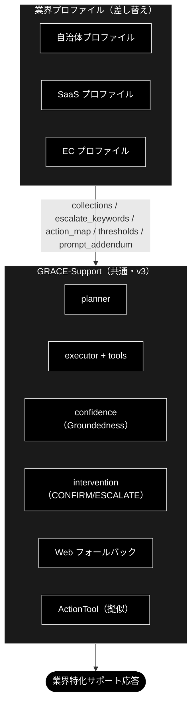

# 業界プロファイルとルールセット ドキュメント

**Version 1.0** | 最終更新: 2026-09-16

> **本書の位置づけ**: GRACE-Support の**業界プロファイル**（`VerticalProfile`・gov / saas / ec）と、
> GRACE-Review の**ルールセット**（`RuleSet`・ec_ad）の**カタログ**。
> 何が業界ごとに差し替わるのか、なぜその設計にしたのか、どう増やすのかを 1 本にまとめる。
>
> ⚠️ **実装の値（フィールド定義・ルール本文・キーワード）は本書に複製しない。**
> 正本は `backend/app/core/verticals.py` / `backend/app/core/rulesets.py` と、
> その IPO 文書（[`reference/core_verticals.md`](./reference/core_verticals.md) /
> [`reference/core_rulesets.md`](./reference/core_rulesets.md)）である。
> 同じ表を 2 箇所に持つと必ず片方が腐る（実例は §2.3 の注記）。

> **関連ドキュメント**
> - [`support_flow.md`](./support_flow.md) — 業界プロファイルが効く処理フローと設計判断
> - [`review_flow.md`](./review_flow.md) — ルールセットが効く処理フローと設計判断
> - [`architecture.md`](./architecture.md) / [`job_runtime.md`](./job_runtime.md)

---

## 目次

- [概要](#概要)
- [1. 業界プロファイル（VerticalProfile）— GRACE-Support](#1-業界プロファイルverticalprofile-grace-support)
- [2. ルールセット（RuleSet）— GRACE-Review](#2-ルールセットruleset-grace-review)
- [3. 増やすときの手順](#3-増やすときの手順)
- [4. 変更履歴](#4-変更履歴)

---

## 概要

2 つのカタログは**役割が似ているが型が違う**。

| | `VerticalProfile`（Support） | `RuleSet`（Review） |
|---|---|---|
| 定義 | `backend/app/core/verticals.py` | `backend/app/core/rulesets.py` |
| 収録 | `gov` / `saas` / `ec` | `ec_ad`（EC広告表示） |
| 構造 | 1 プロファイル = パラメータの束 | **1 プロファイル = N 個の検査ルール**（`RuleItem`） |
| 検索スコープ | `collections` → `config.qdrant.allowed_collections` | 同左 |
| しきい値 | `notify_th` / `confirm_th` | 同左（法令なので厳しめ） |
| 二段判定の第1段 | `escalate_keywords` / `action_map` の語 | `RuleItem.keywords`（＋ `always_check`） |
| API | `GET /api/verticals` | `GET /api/rulesets`（**ルール本文は返さない**） |

**型を分けた理由**: `VerticalProfile` に 23 個のルール定義を持たせると Support 用の構造が壊れるため
（`rulesets.py` の docstring）。検索スコープ・しきい値・アクションマップという**枠は共通**である。

---


## 1. 業界プロファイル（VerticalProfile）— GRACE-Support

> ### ⚠️ 本節の範囲（2026-09-04）
>
> 本節は **`VerticalProfile`（`backend/app/core/verticals.py`）と、それを使う判定ロジックの設計書**である。
>
> 旧版は KPI 評価基盤 `eval/vertical/`（`run.py` / `metrics.py` / `cases/*.jsonl` /
> `register_test_collections.py` / `data/*.csv`）を 17 箇所から参照し、ヘッダーで
> 「gov 7/7・saas 8/8・ec 9/9＝decision_accuracy 1.000」と実測値まで主張していたが、
> **それらは本リポジトリにも姉妹リポジトリ `grace_v2_local` にも存在しない**
> （`git log --all --full-history -- 'eval/*'` が両方とも空）。他プロジェクト由来の記述だったため、
> **2026-09-04 に KPI 評価章（旧 §8「テスト用データ」・旧 §9.1「KPI 評価」）ごと削除した。**
>
> 現存するテストは `backend/tests/` 配下のみ（§1.7）。

### 1.0 業界特化とは何か

#### 主な責務

業界特化レイヤー（`VerticalProfile`）が GRACE-Support 共通エンジンの上で担う責務は次の 5 つ。

1. **検索範囲の限定** — 業界の専用コレクションだけを回答根拠にする（`allowed_collections`。フォールバック連鎖も業界外へ漏らさない）
2. **判断基準の切替** — 「答える / 人に渡す」の閾値・強制エスカレ語・アクション語彙を業界の業務設計に合わせる
3. **安全装置の業界適合** — 本人確認（EC）・断定回避（gov）・「情報なし回答」の検知（④'）など、**間違え方の業界差**を吸収する
4. **語り口の注入** — `prompt_addendum` により回答方針（用語・禁則・トーン）を業界化する
5. **業界別の品質保証** — 期待ラベル付きテストケースと KPI で「良いサポート」の定義ごと評価する（テスト用データの整備を含む）

#### 各責務対応のモジュール

| 責務 | 実装（`backend/app/core/` / `grace/`） | テスト・データ資産 |
|---|---|---|
| 検索範囲の限定 | `PROFILES[v].collections` → `config.qdrant.allowed_collections` → `RAGSearchTool._apply_allowed_collections` | `backend/tests/test_vertical_scope.py` |
| 判断基準の切替 | `_answer_gate()`（閾値）/ `_should_force_escalate()`（エスカレ語×意図分類）/ `_decide_action()`（アクション語彙） | `backend/tests/test_no_info_judge.py` |
| 安全装置の業界適合 | `_perform_action()`（本人確認）/ `_detect_no_info_answer()`＋`create_no_info_judge()`（④'） | `backend/tests/test_no_info_judge.py` |
| 語り口の注入 | `PROFILES[v].prompt_addendum` → `config.llm.prompt_addendum` → `ReasoningTool._build_prompt()` | —（reasoning 出力に反映） |
| 業界別の品質保証 | ❌ **評価基盤は本リポジトリに無い**（旧版が挙げていた `eval/vertical/` 一式は存在しない） | `backend/tests/test_vertical_scope.py` / `test_no_info_judge.py` |

#### 主要機能一覧

| 機能 | 概要 | 参照 |
|---|---|---|
| `--vertical gov / saas / ec` | プロファイル一括切替 CLI（閾値・エスカレ語・アクション・本人確認・検索範囲・方針） | [`support_flow.md` 付録A](./support_flow.md#付録a-cli-仕様と実行例) |
| 二段判定（エスカレ語・アクション語） | キーワード候補一致 → 軽量 LLM 意図分類で FAQ 質問の誤検知を抑止 | 本書 §1.0 |
| ④' 情報なし回答検知 | 「見つかりませんでした」型回答を実質回答判定（answered/no_info）で escalate へ | 本書 §1.0・[`support_flow.md` §4.8](./support_flow.md) |

#### 定義: 何をもって「業界特化」と呼ぶか

**「業界特化」＝共通エンジン（GRACE-Support）は 1 つのまま、業界ごとに差し替わる 7 つの機構（VerticalProfile）で挙動を変えること。**
エンジン本体（Plan → 内部 RAG → 根拠検証 → 回答ゲート → Web 裏取り → アクション＋HITL）は
gov / saas / ec で完全に共通であり、業界性はすべて**プロファイルの差分として注入**される。

言い換えると、業界特化の実体は次の 6 軸を業界別に定義したものである:
**「①何を知識源とし、②どこまで自信があれば答え、③何を人間に渡し、④何を実行し、⑤どう語り、⑥何で測るか」**。

#### 業界特化を構成する 7 つの機構

| # | 機構 | 何が業界ごとに変わるか | 例 | 実装位置 |
|---|---|---|---|---|
| 1 | **検索スコープ**（`collections` → `config.qdrant.allowed_collections`） | 回答の根拠にしてよいナレッジの範囲。フォールバック連鎖も業界外へ漏れない | gov=FAQ・法令系のみ / ec=規定・注文 FAQ のみ | `RAGSearchTool._apply_allowed_collections` |
| 2 | **回答の厳しさ**（`notify_th` / `confirm_th`） | 「どこまで確信があれば答えてよいか」の基準 | gov は 0.8/0.5（既定 0.7/0.4 より厳格）＝「間違えるくらいなら窓口へ」 | `_answer_gate()` |
| 3 | **強制エスカレ基準**（`escalate_keywords`＋意図分類） | 機械に答えさせてはいけない話題の定義（二段判定で FAQ 質問の誤検知は抑止） | gov=法的判断・減免・個別事情 / saas=障害・課金 / ec=決済・破損 | `_should_force_escalate()` |
| 4 | **アクション語彙**（`action_map`） | 「対応」と見なす意図と、その処理先 | ec「返品したい」→起票 / gov「様式がほしい」→案内返信（申請自体は人間） | `_decide_action()` |
| 5 | **本人確認**（`require_identity`) | 副作用操作の前に本人確認を要するか | EC のみ True（注文情報の操作） | `_perform_action()` |
| 6 | **業務方針**（`prompt_addendum` → `config.llm.prompt_addendum`） | 回答の語り口・禁則 | gov「断定回避・担当課明示・個人情報を尋ねない」/ saas「バージョン明示・再現手順」 | `ReasoningTool._build_prompt()` |
| 7 | **評価基準**（KPI・期待ラベル付きテスト質問） | 何をもって良いサポートとするか | gov「根拠なし回答=0」/ ec「本人確認遵守率=100%」 | ❌ **未整備**（KPI を自動計測する基盤は本リポジトリに無い） |

#### 成熟度: 現時点で「特化」と呼べる度合い（正直な評価）

- **厚い部分（実質的な差別化）**: 機構 3・4・5。同種の依頼でも EC では「本人確認 → CONFIRM → 起票」、
  gov では「有人窓口へ」と、**業界の業務設計（誰が何をしてよいか）の違いをコードが実際に分岐**している。
- **薄い部分（まだ枠のみ）**:
  - 機構 1 のナレッジは**枠だけがある**段階。プロファイルは `gov_faq_anthropic` 等の
    専用コレクション名を持つが、**その中身を用意する手段が本リポジトリには無い**
    （テストデータと一括登録スクリプトは旧版が実在すると書いていただけで存在しない）。
    登録は汎用の `qa_qdrant/register_to_qdrant.py` を使い、データは自前で用意することになる。
  - 機構 7（評価基準）は**未整備**。KPI を自動計測する基盤が無いため、
    「特化がどれだけ効いているか」を数値で示せる状態にない。
  - 機構 2・6 は数値 2 つと日本語 1 文であり、「特化」というより業界別チューニングの置き場。
  - 業界固有ワークフロー（実返品 API・申請システム連携）、業界用語辞書、制度改正追随は**未実装**。
    ActionTool は擬似（ドライラン）。

#### 設計理由（トレードオフ）

「業界ごとに別アプリを作る」のではなく「プロファイル差し替え」にしたのは、回答エンジン・出典検証・
HITL という難しい共通部分を 1 回だけ作り、**業界追加を設定の追加に落とす**ため。その代償として、
現段階の「特化」の深さは上記パラメータの深さ＝**投入されたデータの質**に依存する。
次の一手は機能追加ではなく**評価基盤の新規実装と、業界ナレッジの登録**である（[`support_flow.md` §9.3](./support_flow.md#93-残タスク次工程候補) の残タスク #3 / #8 / #13）。
その先に実運用データの投入がある。

---

### 1.1 業界プロファイル（差し替えの共通枠）

| 差し替え項目 | 説明 | GRACE-Support 上の反映先 |
|---|---|---|
| `collections` | 検索対象コレクションの許可リスト | planner の `collection` 指定 / tools の検索範囲 |
| `sample_queries` | 代表想定質問（評価・回帰用） | KPI 計測・チューニング |
| `escalate_keywords` | 強制エスカレの語（例: 障害・決済・法的判断） | 回答ゲート前の割り込み判定 |
| `require_identity` | 本人確認が必要な操作か | アクション前 HITL（CONFIRM）強化 |
| `action_map` | 意図 → アクション種別の対応 | `_decide_action()` |
| `thresholds` | notify/confirm の上書き（厳しめ/緩め） | `_answer_gate()` |
| `prompt_addendum` | 業界固有の注意（用語・断定回避 等） | reasoning プロンプトへ追記 |
| `kpi` | 運用指標 | 評価 |

---

### 1.2 GRACE-Support への適用



---

### 1.3 自治体（Local Government）

| 項目 | 内容 |
|------|------|
| **主な責務** | **「誤案内ゼロ」**。出典（条例名・案内ページ）を示せる範囲でのみ答え、法的判断・個別事情は必ず窓口へ渡す |
| **対象コレクション** | `条例・要綱`、`手続き案内`、`窓口FAQ`（住民向け） |
| **専用コレクション** | `gov_faq_anthropic` / `gov_laws_anthropic`（＋暫定代替 `wikipedia_ja`） ← **登録データは各自で用意する**（本リポジトリに同梱の CSV は無い） |
| **代表想定質問** | 「住民票の写しの取り方は？」「国民健康保険の加入手続きは？」「粗大ごみの出し方は？」「保育園の申込期限は？」 |
| **エスカレ基準** | 法的判断・個別事情・出典なしは**必ず有人**。断定を避け、根拠（条例名・案内ページ）を必須にする |
| **アクション** | `send_reply`（担当課・必要書類・窓口時間の案内）。申請受付そのものは人間（`escalate_to_human`） |
| **KPI** | 出典付与率 ≈ 100% / 根拠なし回答 = 0 / 一次解決率 / **誤案内 = 0** |
| **特有の注意** | 正確性最優先・**断定回避**、個人情報を聞かない、高齢者にも平易な表現、最新の制度改正への追随 |

> 自治体は「間違えない・出典を示す・迷ったら窓口へ」を最重視。`thresholds` は厳しめ（confirm/notify を上げる）に設定し、少しでも根拠が弱ければエスカレへ倒す。

---

### 1.4 SaaS

| 項目 | 内容 |
|------|------|
| **主な責務** | **「速い自己解決と正しい振り分け」**。ドキュメント根拠で即答し、障害・課金・セキュリティは即時に起票／有人へ |
| **対象コレクション** | `製品ドキュメント`、`APIリファレンス`、`リリースノート`、`既知の不具合` |
| **専用コレクション** | `saas_docs_anthropic` / `saas_api_anthropic` ← **登録データは各自で用意する**（本リポジトリに同梱の CSV は無い） |
| **代表想定質問** | 「API のレート制限は？」「Webhook の設定方法は？」「このエラーコードの意味は？」「v2 への移行手順は？」 |
| **エスカレ基準** | 障害・課金・セキュリティ、再現不能、バージョン不一致は `create_ticket`／`escalate_to_human` |
| **アクション** | `create_ticket`（障害・不具合）、`send_reply`（ドキュメントリンク・ステータスページ案内） |
| **KPI** | 自己解決率（deflection）/ 一次応答時間 / チケット適正振り分け率 / 再現手順取得率 |
| **特有の注意** | **バージョン差の明示**、出典にドキュメント URL、コード例の正確性、Web フォールバックは公式ドキュメント優先 |

> SaaS は「速く・正確に・再現手順つき」。`escalate_keywords` に「障害」「ダウン」「課金」「情報漏えい」等を入れ、即エスカレ。

---

### 1.5 EC（Eコマース）

| 項目 | 内容 |
|------|------|
| **主な責務** | **「安全な実行」**。返品・キャンセル等の副作用操作を本人確認 → CONFIRM の二段で守りながら完遂させる |
| **対象コレクション** | `商品情報`、`返品・交換規定`、`配送・送料`、`注文FAQ` |
| **専用コレクション** | `ec_policy_anthropic` / `ec_faq_anthropic` ← **登録データは各自で用意する**（本リポジトリに同梱の CSV は無い） |
| **代表想定質問** | 「返品したい」「配送状況を知りたい」「サイズ交換できる？」「注文をキャンセルしたい」 |
| **エスカレ基準** | 個人注文情報の照会・変更（**本人確認必須**）、決済トラブルは有人／本人確認フロー |
| **アクション** | `create_ticket`（返品受付・要 CONFIRM＋本人確認）、`send_reply`（規定・返信テンプレ）。注文照会は注文 ID 必須 |
| **KPI** | 自己解決率 / 返品処理時間 / **誤操作 = 0（本人確認必須）** / CS 満足度 |
| **特有の注意** | **個人情報・注文権限の確認を必須**（`require_identity=True` → アクション前 HITL を強化）、規定の版管理 |

> EC は「行動（返品・キャンセル）に直結」するため、v3 のアクション＋HITL が本領。副作用のある操作は本人確認 → CONFIRM の二段で守る。

---

### 1.6 実装への落とし込み

共通コードは変えず、**プロファイルを渡すだけ**で切り替える設計。

> 📎 `VerticalProfile` の**実際のフィールド定義**は
> [`core_verticals.md`](./reference/core_verticals.md) が正本（本書は設計意図のみを持つ）。
> 設計時の案にあった `sample_queries` / `kpi` は、評価基盤を持たないため実装していない。

**適用ポイント（GRACE-Support への差し込み）**:

| プロファイル項目 | 差し込み先（既存関数) | 状態 |
|---|---|---|
| `escalate_keywords` | **二段判定**: キーワード候補一致（`_match_keyword`）→ 軽量 LLM 意図分類（`create_intent_classifier`・question/request/incident）。question（FAQ質問）は誤検知とみなし通常フロー継続、それ以外・分類失敗は即 `escalate`（Web もスキップ） | ✅ 実装済み（`_should_force_escalate`） |
| `notify_th`/`confirm_th` | `_answer_gate()` のしきい値を上書き | ✅ 実装済み |
| `action_map` | `_decide_action()`（二段判定: キーワード候補 → 意図分類。question は起票せず回答のみ） | ✅ 実装済み |
| `require_identity` | `_perform_action()`（本人確認ステップを前置。起動有無は `SupportResult.identity_checked` に記録） | ✅ 実装済み |
| `collections` | `config.qdrant.allowed_collections` 経由で `RAGSearchTool` の検索候補（明示指定・フォールバック連鎖を含む）を許可リストで限定。実コレクション名（`gov_faq_anthropic` 等）を割り当て済み。未登録なら制限を適用せず従来動作（警告ログ） | ✅ 実装済み（`RAGSearchTool._apply_allowed_collections`） |
| `prompt_addendum` | `config.llm.prompt_addendum` 経由で `ReasoningTool._build_prompt()` のシステム指示直後に「業務方針（遵守）」として注入。executor 経由・Web フォールバック経由の両 reasoning に効く | ✅ 実装済み |
| `sample_queries` / `kpi` | 期待ラベル付きテストケースと KPI 計測は dataclass には持たせない方針 | ❌ **未実装**（外部化先とされていた評価ランナーは本リポジトリに無い） |

**選択方法**: Web UI の「GRACE-Support」タブの業界プロファイル セレクタ、または
`POST /api/support/submit` の `vertical` フィールド。**実装済み**。
旧 CLI 引数との対応は [`support_flow.md` 付録A](./support_flow.md#付録a-旧-cli-仕様削除済み記録) を参照。

**実装状況**: `VerticalProfile` 導入と gov/saas/ec の 3 プロファイルは実装済み（PR #106）。設計時の実装順（自治体 → SaaS → EC）どおり 3 業界を同時に組み込み済みで、上表のとおり全項目が配線済み。残件は [`support_flow.md` §9.3](./support_flow.md#93-残タスク次工程候補) を参照。

---

### 1.7 テスト

#### 単体テスト（実 API・実 Qdrant 不要）

> ⚠️ **リポジトリ直下に `tests/` は無い**（CLAUDE.md §9.4）。テストは `backend/tests/` 配下のみ。

| テスト | 対象 |
|---|---|
| `backend/tests/test_vertical_scope.py` | `allowed_collections` による検索範囲限定（プロファイルの許可リストに汎用コーパスを混ぜないことの固定を含む） |
| `backend/tests/test_no_info_judge.py` | ④' 実質回答判定の理由・エスカレ条件・使用モデル |
| `backend/tests/test_no_info_prediction.py` | ④' 判定の予測挙動 |

実行: `uv run pytest backend/tests -q`（実 API キー・実 Qdrant は不要）。
---


## 2. ルールセット（RuleSet）— GRACE-Review

### 2.1 データ構造

```python
@dataclass
class RuleItem:
    rule_id: str                       # "keihyo-01"
    title: str                         # "優良誤認表示"
    category: str                      # "優良誤認"
    law: str                           # "景品表示法"
    article: str                       # "第5条第1号"
    description: str                   # 判定基準（LLM プロンプトに埋め込む）
    keywords: List[str] = field(default_factory=list)   # 第1段の候補検出語
    severity_default: Severity = "medium"
    always_check: bool = False         # True なら keywords 不問・文書全体で第2段を実行
    web_check: bool = False            # True なら ⑥ Web 裏取りの対象


@dataclass
class RuleSet:
    id: str                            # "ec_ad"
    name: str                          # "EC広告表示"
    collections: List[str]             # 規程 Qdrant コレクション
    rules: List[RuleItem]
    critical_keywords: List[str] = field(default_factory=list)  # 強制 high
    notify_th: float = 0.85            # 自動確定しきい値（法令なので厳しめ）
    confirm_th: float = 0.60
    action_map: Dict[str, str] = field(default_factory=dict)
    prompt_addendum: str = ""
```

### 2.2 `ec_ad` の設定値

```python
RuleSet(
    id="ec_ad",
    name="EC広告表示",
    collections=["ec_ad_rules_anthropic", "ec_policy_anthropic"],
    critical_keywords=[
        "No.1", "ナンバーワン", "日本一", "世界一", "最安", "業界最",
        "完治", "治る", "がん", "医薬品", "副作用がない", "絶対",
    ],
    notify_th=0.85,     # 既定 (gov=0.8) より厳しい。誤指摘のコストが高いため
    confirm_th=0.60,
    action_map={"修正": "create_ticket", "差し戻し": "send_reply"},
    prompt_addendum=(
        "景品表示法・特定商取引法・医薬品医療機器等法の条文に基づいて判定し、"
        "該当条項番号を必ず明示すること。断定を避け、根拠のない指摘はしないこと。"
    ),
    rules=[...],        # §2.3
)
```

### 2.3 ルール一覧（23 件）

`description` は LLM の判定基準としてそのままプロンプトへ埋め込む。
**規程コレクションが未登録の場合、この `description` と `article` が根拠のフォールバックになる**
ため、条文の要点を自己完結的に書く。

**正本は `backend/app/core/rulesets.py`。** ルール ID・条項・severity・キーワードの一覧は
[`core_rulesets.md` §5.4](./reference/core_rulesets.md#54-ルール一覧23-件) にある。

> ⚠️ **本書はキーワードの一覧を持たない。** 以前は 21 行の表で `keywords` まで複製していたが、
> **実装が更新されるたびに必ず腐った**。2026-09-15 の実測では、キーワードを持つ 15 ルール
> **全部**で語が欠けており（`yakki-02` は実装 15 語に対し文書 4 語＝10 語欠落、
> `keihyo-11` は 6 語に対し 4 語）、さらに `yakki-04`（安全性の保証表現）は
> **文書に一度も出てこなかった**。同じ表を 2 箇所に置いた結果である。
> 語を知りたいときは `rulesets.py` を直接見ること。

現在の構成（実測 2026-09-15）:

| 法令 | 件数 | 判定方式 |
|---|---:|---|
| 景品表示法 | 12 | keywords（うち `keihyo-03` / `keihyo-04` / `keihyo-05` は ＋ web_check） |
| 医薬品医療機器等法 | 4 | keywords（うち `yakki-01` は ＋ web_check） |
| 特定商取引法 | 6 | すべて `always_check=True`（うち `tokusho-06` は ＋ web_check） |
| 社内規程 | 1 | `policy-01` のみ。`always_check=True` |
| **合計** | **23** | `always_check` 7 / `web_check` 5 / keywords 方式 16 |

#### 特商法ルールが `always_check` である理由

表記漏れ（「価格が書かれていない」）の検出は**キーワード一致では原理的に不可能**である。
「無い」ものは語として現れないので、文書全体に対して常時チェックするしかない。
そのため `always_check=True` のルールには `keywords` を持たせない（排他は
`backend/tests/test_rulesets.py` が固定している）。

#### `policy-01` だけ性格が違う

法令違反ではなく**社内整合性**の指摘で、`law="社内規程"` / `article="—"` /
`severity_default="medium"`。② Retrieve も既定と違い、`evidence_query` と
`evidence_collections`（`ec_policy_anthropic`）で上書きしている。

実測 2026-08-17 20:07 では、この種の指摘が**法令ルールに帰属していた**。

    指摘: 規程では返品受付期間を「14日以内」と定めているが、対象テキストでは
          「8日以内」と記載されており、規程と異なる条件が表示されている
    出力: 重大 / 根拠: 特定商取引法 第11条 / 確定

8 日は**法定の既定日数**である（`tokusho-04` の `description` 自身がそう書いている:
「返品特約の表示が無い場合、商品到着後8日間は…返品が可能となる」）。つまり
「8日以内・未開封・送料お客様負担」の表示は**特商法第11条には適合している**。
問題は自社規程（14日）より短いという社内整合性であって法令違反ではない。

同じ事実が `tokusho-04`（返品特約の表示）と `tokusho-06`（定期購入の条件明示）から
二重に出ていたのも、各ルールが自分の主題外を指摘していたためである。
`create_violation_detector` のプロンプトで主題を限定した:

- ルールの主題外は `violates=false`（別のルールで判定される）
- ルールが前提とする取引形態が対象テキストに無ければ `violates=false`
- 「〜の表示」「〜の明示」を求めるルールは**記載の有無だけ**を見る
- 法令が定める既定値どおりの表示を法令違反として指摘しない

> ⚠️ **本 RuleSet は技術検証用のサンプルであり、法務レビューを受けたものではない。**
> `description` は公開されている条文・ガイドラインの要点を要約したものだが、
> **実運用には法務部門による監修が必須**である。この旨をコード冒頭の docstring と
> UI のフッターに明記する。

### 2.4 テストデータ

| ファイル | 内容 |
|---|---|
| `backend/tests/data/ec_ad_ng_sample.txt` | 意図的に違反を仕込んだ LP（各カテゴリ 1 件以上・想定 12 指摘） |
| `backend/tests/data/ec_ad_ok_sample.txt` | 適正表記の LP（想定 0 指摘。**過検知テスト用**） |
| `backend/tests/data/ec_ad_edge_sample.txt` | 誤検知しやすい文（否定文脈の「No.1」等。**抑止機構のテスト用**） |

---


## 3. 増やすときの手順

### 3.1 業界プロファイルを増やす（Support）

1. `backend/app/core/verticals.py` の `PROFILES` に `VerticalProfile` を追加する
   （`collections` / `escalate_keywords` / `action_map` / `require_identity` /
   `notify_th` / `confirm_th` / `prompt_addendum`）
2. `collections` に挙げた Qdrant コレクションを登録する
   （[`data_pipeline.md`](./data_pipeline.md)。**未登録なら検索制限は適用されず警告ログのみ**）
3. `GET /api/verticals` に出ることを確認する（UI のセレクタはこの API を読む）
4. `backend/tests/test_vertical_scope.py` にスコープ固定のテストを追加する

> ⚠️ **プロファイルの許可リストに汎用コーパス（`wikipedia_ja` 等）を混ぜない。**
> 業界外へ根拠が漏れる。上記テストがこれを固定している。

### 3.2 ルールを増やす（Review）

1. `backend/app/core/rulesets.py` の該当リスト（`_KEIHYO_RULES` 等）へ `RuleItem` を追加する
2. `description` は**条文の要点を自己完結的に**書く（規程コレクションが未登録のとき、
   これと `article` が ④ Ground の根拠フォールバックになる）
3. 「表記漏れ」を見る種類のルールは `always_check=True` にし、`keywords` は**持たせない**
   （排他は `backend/tests/test_rulesets.py` が固定している）
4. 件数・`always_check` / `web_check` の数を変えたら、
   [`reference/core_rulesets.md`](./reference/core_rulesets.md) の一覧を追随させる
5. 法務監修を通す（**本ルールセットは技術検証用のサンプルである**）

---

## 4. 変更履歴

| Version | 日付 | 変更内容 |
|---|---|---|
| 1.0 | 2026-09-16 | 新規作成。`support_spec.md` §6（業界特化）と `review_spec.md` §5（RuleSet 定義）を統合し、増やし方（§3）を追加した |
