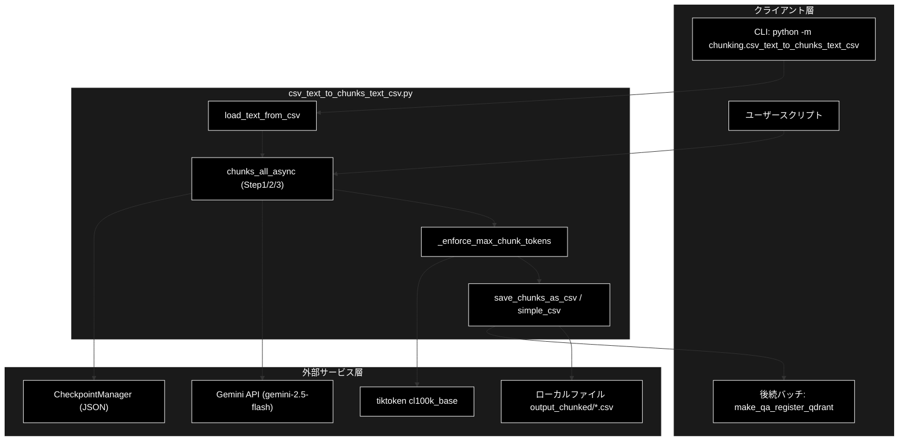
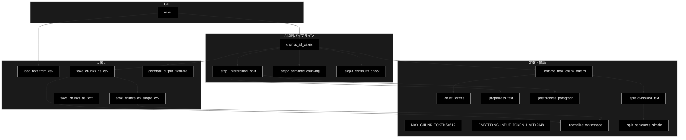
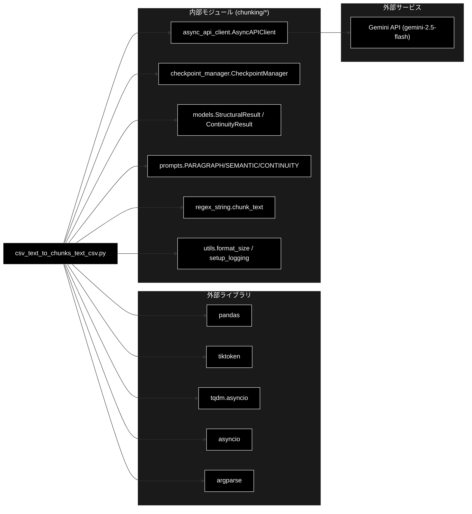

# csv_text_to_chunks_text_csv.py - LLMベースセマンティックチャンキング（統一版） ドキュメント

**Version 1.5** | 最終更新: 2026-06-17

---

## 目次

1. [概要](#概要)
2. [アーキテクチャ構成図](#1-アーキテクチャ構成図)
3. [モジュール構成図](#2-モジュール構成図)
4. [クラス・関数一覧表](#3-クラス関数一覧表)
5. [クラス・関数 IPO詳細](#4-クラス関数-ipo詳細)
6. [設定・定数](#5-設定定数)
7. [使用例](#6-使用例)
8. [エクスポート](#7-エクスポート)
9. [変更履歴](#8-変更履歴)
10. [付録: 依存関係図](#付録-依存関係図)

---

## 概要

`csv_text_to_chunks_text_csv.py` は、テキストまたは CSV ファイルを入力として受け取り、LLM ベースの 3 段階アルゴリズム（階層構造化 → 意味的チャンキング → 文脈連続性チェック）で意味的なチャンクに分割するパイプラインモジュールです。`asyncio` による並列化、`CheckpointManager` による再開機能、最終チャンクの最大トークン数強制（Embedding の無言切り捨て防止）、CSV 出力時の改行正規化、メタデータ付き CSV とシンプル CSV（`Text` カラムのみ）の二系統同時出力を提供します。

### 主な責務

- 入力ファイル（`.txt` / `.csv`）の読み込みとテキスト抽出
- 3 段階 LLM 処理（段落分割 / 意味的分割 / 連続性結合）の実行
- `asyncio.gather` による並列 API 呼び出しと進捗表示（tqdm）
- チェックポイントによる中断・再開のサポート
- 最終チャンクの最大トークン数強制（Embedding 入力上限超過防止）
- CSV 形式での保存（メタデータ付き + シンプル版）

### 各責務対応のモジュール

| # | 責務 | 対応モジュール | 説明 |
|---|------|--------------|------|
| 1 | 入力ファイル読み込み | `csv_text_to_chunks_text_csv.py` | `load_text_from_csv()` / `main()` の直接読み込み |
| 2 | 3 段階チャンク処理 | `csv_text_to_chunks_text_csv.py` | `chunks_all_async()` / `_step1` / `_step2` / `_step3` |
| 3 | 並列 LLM 呼び出し | `chunking/async_api_client.py` | `AsyncAPIClient.generate_content()` |
| 4 | チェックポイント | `chunking/checkpoint_manager.py` | `CheckpointManager.save/load/exists` |
| 5 | トークン上限強制 | `csv_text_to_chunks_text_csv.py` | `_enforce_max_chunk_tokens()` |
| 6 | CSV 保存 | `csv_text_to_chunks_text_csv.py` | `save_chunks_as_csv()` / `save_chunks_as_simple_csv()` |

### 主要機能一覧

| 機能 | 説明 |
|------|------|
| `MAX_CHUNK_TOKENS` | 最終チャンクの最大トークン数（512、cl100k_base 換算） |
| `EMBEDDING_INPUT_TOKEN_LIMIT` | Embedding（gemini-embedding-001）入力上限（2048） |
| `_count_tokens()` | tiktoken／文字数フォールバックでトークン数を概算 |
| `_normalize_whitespace()` | 改行・タブ・連続空白を半角スペース 1 つに正規化 |
| `_preprocess_text()` | 入力テキストを句読点で分割（Step1 前処理） |
| `_postprocess_paragraph()` | Step1 出力段落を文ごとに改行区切り化 |
| `load_text_from_csv()` | CSV からテキストカラムを自動検出して読み込み |
| `save_chunks_as_simple_csv()` | `Text` カラムのみのシンプル CSV を出力 |
| `save_chunks_as_csv()` | メタデータ付き CSV + シンプル CSV を同時出力 |
| `save_chunks_as_text()` | 後方互換のテキスト形式（`---` 区切り）保存 |
| `generate_output_filename()` | 入力ファイル名から `<stem>_chunks.csv` を生成 |
| `_split_sentences_simple()` | 日本語・英語混在の簡易文分割 |
| `_split_oversized_text()` | `max_tokens` 超のテキストを文境界で分割 |
| `_enforce_max_chunk_tokens()` | 最終チャンク全件に上限を強制 |
| `chunks_all_async()` | 3 段階チャンク化のエントリポイント |
| `_step1_hierarchical_split()` | Step1: 段落分割 |
| `_step2_semantic_chunking()` | Step2: 意味的分割 |
| `_step3_continuity_check()` | Step3: 連続性チェックと結合 |
| `main()` | CLI エントリポイント（argparse） |

---

## 1. アーキテクチャ構成図

### 1.1 システム全体構成



### 1.2 データフロー

1. CLI またはユーザースクリプトから入力ファイル（`.txt` / `.csv`）を受け取る
2. `load_text_from_csv()` がテキストカラムを自動検出し、結合テキストを生成
3. `chunks_all_async()` が Step1 → Step2 → Step3 を順次・並列に実行
4. 各 Step は `AsyncAPIClient` 経由で Gemini API を並列呼び出し、`CheckpointManager` に保存
5. `_enforce_max_chunk_tokens()` で最終チャンク全件に 512 トークン上限を強制
6. `save_chunks_as_csv()` がメタデータ付き CSV + シンプル CSV の 2 ファイルを出力

---

## 2. モジュール構成図

### 2.1 内部モジュール構成



### 2.2 外部依存関係

| ライブラリ | 用途 |
|-----------|------|
| `pandas` | CSV 読み書きと DataFrame 操作 |
| `tiktoken` | `cl100k_base` トークナイザでトークン数計測 |
| `tqdm.asyncio` | 非同期処理の進捗表示 |
| `asyncio` | 並列タスク制御 |
| `argparse` | CLI 引数解析 |
| `re` / `pathlib` | テキスト整形・パス操作 |

### 2.3 内部依存モジュール

| モジュール | 用途 |
|-----------|------|
| `chunking.async_api_client.AsyncAPIClient` | Gemini API の非同期並列呼び出し |
| `chunking.checkpoint_manager.CheckpointManager` | Step1/2/3 のチェックポイント保存・再開 |
| `chunking.models.StructuralResult` | Step1/Step2 応答スキーマ |
| `chunking.models.ContinuityResult` | Step3 応答スキーマ |
| `chunking.prompts.PARAGRAPH_SEPARATION_PROMPT` | Step1 用プロンプト |
| `chunking.prompts.SEMANTIC_CHUNKING_PROMPT` | Step2 用プロンプト |
| `chunking.prompts.CONTINUITY_CHECK_PROMPT` | Step3 用プロンプト |
| `chunking.regex_string.chunk_text` | 日本語・英語の文分割 |
| `chunking.utils.format_size` / `setup_logging` | サイズ整形・ログ設定 |

---

## 3. クラス・関数一覧表

本モジュールはクラスを定義しません。すべて関数構成です。

### 3.1 関数一覧（カテゴリ別）

#### トークン・テキスト補助

| 関数名 | 概要 |
|-------|------|
| `_count_tokens(text)` | tiktoken（失敗時は文字数）でトークン数を概算 |
| `_normalize_whitespace(text)` | 改行・タブ・連続空白を半角スペース 1 つに正規化 |
| `_preprocess_text(text)` | 句読点ベースで長い 1 行を分割（Step1 前処理） |
| `_postprocess_paragraph(paragraph)` | 段落を文ごとに改行区切り化（Step1 後処理） |
| `_split_sentences_simple(text)` | 日本語・英語の簡易文分割 |
| `_split_oversized_text(text, max_tokens)` | max_tokens 超のテキストを文境界で分割 |
| `_enforce_max_chunk_tokens(chunks, max_tokens)` | 最終チャンク全件に上限を強制 |

#### 入出力

| 関数名 | 概要 |
|-------|------|
| `load_text_from_csv(csv_path, text_column, max_rows, combine_rows)` | CSV からテキストを読み込み結合 |
| `save_chunks_as_simple_csv(chunks, output_file, normalize_whitespace)` | Text カラムのみのシンプル CSV を保存 |
| `save_chunks_as_csv(chunks, output_file, dataset_type, source_file, normalize_whitespace, save_simple_csv)` | メタデータ付き CSV + シンプル CSV を保存 |
| `save_chunks_as_text(chunks, output_file)` | 後方互換のテキスト形式（`---` 区切り）保存 |
| `generate_output_filename(input_file, output_dir, dataset_type)` | `<stem>_chunks.csv` のパスを生成 |

#### パイプライン（3 段階）

| 関数名 | 概要 |
|-------|------|
| `chunks_all_async(text, model, max_workers, block_size, checkpoint_manager, output_file, dataset_type, source_file)` | 3 段階チャンク化のエントリポイント |
| `_step1_hierarchical_split(text, client, model, block_size, checkpoint_manager)` | Step1: 段落分割 |
| `_step2_semantic_chunking(paragraphs, client, model, checkpoint_manager)` | Step2: 意味的チャンキング |
| `_step3_continuity_check(chunks, client, model, checkpoint_manager)` | Step3: 連続性チェックと結合 |

#### CLI

| 関数名 | 概要 |
|-------|------|
| `main()` | argparse による CLI エントリポイント |

---

## 4. クラス・関数 IPO詳細

### 4.1 トークン・テキスト補助関数

#### `_count_tokens`

**概要**: tiktoken `cl100k_base` でトークン数を計測。BPE 取得に失敗するオフライン環境では文字数ベースに自動フォールバックする。

```python
def _count_tokens(text: str) -> int
```

| パラメータ | 型 | デフォルト | 説明 |
|------------|------|-----------|------|
| `text` | str | - | 計測対象のテキスト |

| 項目 | 内容 |
|------|------|
| **Input** | `text: str` |
| **Process** | 1. グローバルキャッシュ `_TOKENIZER` を初期化（失敗時はフラグ立て）<br>2. 利用可能なら `tokenizer.encode(text)` の長さを返す<br>3. 不可なら ASCII は 4 文字≈1 トークン、非 ASCII は 1 文字≈1 トークンで概算 |
| **Output** | `int`: トークン数（最低 1） |

**戻り値例**:
```python
12
```

```python
# 使用例
from chunking.csv_text_to_chunks_text_csv import _count_tokens
print(_count_tokens("日本語のサンプルテキスト"))
# 出力例: 11
```

---

#### `_normalize_whitespace`

**概要**: 改行・タブ・連続空白を半角スペース 1 つに正規化し、CSV セル内のテキストをクリーンにする。

```python
def _normalize_whitespace(text: str) -> str
```

| パラメータ | 型 | デフォルト | 説明 |
|------------|------|-----------|------|
| `text` | str | - | 正規化対象テキスト |

| 項目 | 内容 |
|------|------|
| **Input** | `text: str` |
| **Process** | 1. `\n` / `\r` / `\t` を半角スペースに置換<br>2. `\s+` を 1 つの空白に圧縮<br>3. 先頭・末尾の空白を除去 |
| **Output** | `str`: 正規化済みテキスト |

**戻り値例**:
```python
'行1 行2'
```

```python
# 使用例
_normalize_whitespace("  複数    空白  ")
# '複数 空白'
```

---

#### `_preprocess_text`

**概要**: 改行のない長い 1 行を日本語/英語の句読点で文単位に分割し、Step1 LLM への入力を整形する。

```python
def _preprocess_text(text: str) -> str
```

| パラメータ | 型 | デフォルト | 説明 |
|------------|------|-----------|------|
| `text` | str | - | 前処理対象テキスト |

| 項目 | 内容 |
|------|------|
| **Input** | `text: str` |
| **Process** | 1. 改行で行に分割<br>2. 各行を `chunk_text(line, keep_delimiter=True)` で文分割<br>3. 改行で再結合 |
| **Output** | `str`: 句読点改行で整形されたテキスト |

**戻り値例**:
```python
"これは文1です。\nこれは文2です。"
```

```python
# 使用例
text = _preprocess_text("これは文1です。これは文2です。")
```

---

#### `_postprocess_paragraph`

**概要**: Step1 出力段落を文ごとに改行区切りに整形し、Step2/Step3 の精度を向上させる。

```python
def _postprocess_paragraph(paragraph: str) -> str
```

| パラメータ | 型 | デフォルト | 説明 |
|------------|------|-----------|------|
| `paragraph` | str | - | 後処理対象の段落 |

| 項目 | 内容 |
|------|------|
| **Input** | `paragraph: str` |
| **Process** | 1. 段落を行ごとに分割<br>2. `chunk_text()` で文分割<br>3. 改行で再結合 |
| **Output** | `str`: 文単位に改行区切りされた段落 |

**戻り値例**:
```python
"問題提起の文。\n解決策の文。"
```

```python
# 使用例
result = _postprocess_paragraph("問題提起の文。解決策の文。")
```

---

#### `_split_sentences_simple`

**概要**: 日本語・英語の終止符（`。．.！？!?`）で簡易的に文分割。

```python
def _split_sentences_simple(text: str) -> List[str]
```

| パラメータ | 型 | デフォルト | 説明 |
|------------|------|-----------|------|
| `text` | str | - | 分割対象テキスト |

| 項目 | 内容 |
|------|------|
| **Input** | `text: str` |
| **Process** | 1. 正規表現で終止符付き文を抽出<br>2. 終止符なしの末尾は別文として追加<br>3. 各文を strip |
| **Output** | `List[str]`: 文のリスト |

**戻り値例**:
```python
["これは文1です。", "これは文2です。"]
```

```python
# 使用例
_split_sentences_simple("これは文1です。これは文2です。")
```

---

#### `_split_oversized_text`

**概要**: `max_tokens` を超えるテキストを文境界で複数ピースに分割する。1 文単独で超過する場合は文の途中で切らずに保持する。

```python
def _split_oversized_text(text: str, max_tokens: int) -> List[str]
```

| パラメータ | 型 | デフォルト | 説明 |
|------------|------|-----------|------|
| `text` | str | - | 分割対象テキスト |
| `max_tokens` | int | - | 1 ピースあたりの上限トークン数 |

| 項目 | 内容 |
|------|------|
| **Input** | `text: str`, `max_tokens: int` |
| **Process** | 1. `_split_sentences_simple()` で文分割<br>2. 累積トークン数を監視し閾値超過で flush<br>3. 残りを最終ピースとして追加 |
| **Output** | `List[str]`: 文境界で区切られたピース |

**戻り値例**:
```python
["前半の文を結合した塊。", "後半の塊。"]
```

```python
# 使用例
pieces = _split_oversized_text(long_text, max_tokens=512)
```

---

#### `_enforce_max_chunk_tokens`

**概要**: 全チャンクに最大トークン数を強制する。Step3 の結合時上限ではカバーされない Step2 単一出力やフォールバック保全分にも上限を掛け、Embedding（gemini-embedding-001, 上限 2048）の無言切り捨てを防ぐ。

```python
def _enforce_max_chunk_tokens(chunks: List[str], max_tokens: int) -> List[str]
```

| パラメータ | 型 | デフォルト | 説明 |
|------------|------|-----------|------|
| `chunks` | List[str] | - | 強制対象のチャンクリスト |
| `max_tokens` | int | - | 上限トークン数 |

| 項目 | 内容 |
|------|------|
| **Input** | `chunks: List[str]`, `max_tokens: int` |
| **Process** | 1. 各チャンクのトークン数を計測<br>2. 上限以下はそのまま追加<br>3. 上限超は `_split_oversized_text()` で分割<br>4. 1 文単独超過時は警告を出し保持<br>5. 分割件数をログ出力 |
| **Output** | `List[str]`: 上限強制後のチャンクリスト |

**戻り値例**:
```python
["短いチャンク", "分割された前半...", "分割された後半..."]
```

```python
# 使用例
final = _enforce_max_chunk_tokens(chunks, MAX_CHUNK_TOKENS)
```

---

### 4.2 入出力関数

#### `load_text_from_csv`

**概要**: CSV ファイルからテキストカラムを自動検出（または明示指定）して読み込み、行を改行で結合した単一文字列を返す。

```python
def load_text_from_csv(
    csv_path: str,
    text_column: Optional[str] = None,
    max_rows: Optional[int] = None,
    combine_rows: bool = False,
) -> str
```

| パラメータ | 型 | デフォルト | 説明 |
|------------|------|-----------|------|
| `csv_path` | str | - | 入力 CSV パス |
| `text_column` | Optional[str] | None | テキストカラム名（未指定時は自動検出） |
| `max_rows` | Optional[int] | None | 最大処理行数 |
| `combine_rows` | bool | False | 全行を結合するか（ログ表記のみ差異） |

| 項目 | 内容 |
|------|------|
| **Input** | `csv_path: str`, `text_column: Optional[str] = None`, `max_rows: Optional[int] = None`, `combine_rows: bool = False` |
| **Process** | 1. `pandas.read_csv` で読み込み<br>2. `max_rows` で行数制限<br>3. 候補リスト（text/content/Combined_Text/body/document/answer 等）から自動検出、無ければ最初のカラム<br>4. 非空テキストを strip し `\n\n` で結合 |
| **Output** | `str`: 結合済みテキスト |

**戻り値例**:
```python
"テキスト1の本文...\n\nテキスト2の本文..."
```

```python
# 使用例
text = load_text_from_csv("OUTPUT/cc_news_2per.csv", max_rows=100)
```

---

#### `save_chunks_as_simple_csv`

**概要**: チャンクを `Text` カラムのみのシンプル CSV として保存。Q/A 生成バッチへの受け渡し用フォーマット。

```python
def save_chunks_as_simple_csv(
    chunks: List[str],
    output_file: str,
    normalize_whitespace: bool = True,
) -> str
```

| パラメータ | 型 | デフォルト | 説明 |
|------------|------|-----------|------|
| `chunks` | List[str] | - | チャンクのリスト |
| `output_file` | str | - | 出力 CSV パス |
| `normalize_whitespace` | bool | True | 改行・空白を正規化するか |

| 項目 | 内容 |
|------|------|
| **Input** | `chunks: List[str]`, `output_file: str`, `normalize_whitespace: bool = True` |
| **Process** | 1. 各チャンクを `_normalize_whitespace()` で整形（任意）<br>2. `Text` 列のみの DataFrame を作成<br>3. UTF-8 で CSV 保存<br>4. ログ出力 |
| **Output** | `str`: 保存ファイルパス |

**戻り値例**:
```python
"output_chunked/cc_news_2per_chunks_simple.csv"
```

```python
# 使用例
save_chunks_as_simple_csv(chunks, "output_chunked/doc_chunks_simple.csv")
```

---

#### `save_chunks_as_csv`

**概要**: メタデータ付き CSV（chunk_id / text / tokens / chunk_idx / dataset_type / type / sentence_count / source_file）を保存し、同時にシンプル CSV も生成する。

```python
def save_chunks_as_csv(
    chunks: List[str],
    output_file: str,
    dataset_type: str = "custom",
    source_file: Optional[str] = None,
    normalize_whitespace: bool = True,
    save_simple_csv: bool = True,
) -> str
```

| パラメータ | 型 | デフォルト | 説明 |
|------------|------|-----------|------|
| `chunks` | List[str] | - | チャンクのリスト |
| `output_file` | str | - | メタデータ付き CSV 出力パス |
| `dataset_type` | str | "custom" | データセット種別（chunk_id プレフィックスにも使用） |
| `source_file` | Optional[str] | None | 元ファイル名（メタ列に記録） |
| `normalize_whitespace` | bool | True | 改行・空白を正規化するか |
| `save_simple_csv` | bool | True | `<stem>_simple.csv` も同時保存するか |

| 項目 | 内容 |
|------|------|
| **Input** | `chunks: List[str]`, `output_file: str`, `dataset_type: str = "custom"`, `source_file: Optional[str] = None`, `normalize_whitespace: bool = True`, `save_simple_csv: bool = True` |
| **Process** | 1. tiktoken `cl100k_base` を取得<br>2. 各チャンクを正規化＋センテンス分割しメタ行を生成<br>3. UTF-8 で CSV 保存しサマリログ出力<br>4. `save_simple_csv=True` なら `<stem>_simple.csv` も出力 |
| **Output** | `str`: メタデータ付き CSV のパス |

**戻り値例**:
```python
"output_chunked/cc_news_2per_chunks.csv"
```

```python
# 使用例
save_chunks_as_csv(
    chunks=final_chunks,
    output_file="output_chunked/cc_news_2per_chunks.csv",
    dataset_type="cc_news_2per",
    source_file="cc_news_2per.csv",
)
```

---

#### `save_chunks_as_text`

**概要**: 後方互換のため、チャンクを `---` 区切りでテキストファイルに保存。

```python
def save_chunks_as_text(chunks: List[str], output_file: str) -> str
```

| パラメータ | 型 | デフォルト | 説明 |
|------------|------|-----------|------|
| `chunks` | List[str] | - | チャンクのリスト |
| `output_file` | str | - | 出力テキストパス |

| 項目 | 内容 |
|------|------|
| **Input** | `chunks: List[str]`, `output_file: str` |
| **Process** | 1. UTF-8 で開く<br>2. 各チャンクを `chunk + '\n---\n'` で逐次書き込み<br>3. ログ出力 |
| **Output** | `str`: 保存ファイルパス |

**戻り値例**:
```python
"output_chunked/doc.txt"
```

```python
# 使用例
save_chunks_as_text(chunks, "output_chunked/doc.txt")
```

---

#### `generate_output_filename`

**概要**: 入力ファイル名のステムに `_chunks.csv` を付与し、出力ディレクトリ配下のパスを返す（ディレクトリ自動作成）。

```python
def generate_output_filename(
    input_file: str,
    output_dir: str,
    dataset_type: str = "custom",
) -> str
```

| パラメータ | 型 | デフォルト | 説明 |
|------------|------|-----------|------|
| `input_file` | str | - | 入力ファイルパス |
| `output_dir` | str | - | 出力ディレクトリ |
| `dataset_type` | str | "custom" | 互換性のため残存（未使用） |

| 項目 | 内容 |
|------|------|
| **Input** | `input_file: str`, `output_dir: str`, `dataset_type: str = "custom"` |
| **Process** | 1. `Path(input_file).stem` を取得<br>2. `{stem}_chunks.csv` をファイル名に<br>3. `os.makedirs(output_dir, exist_ok=True)`<br>4. `os.path.join` で結合 |
| **Output** | `str`: 出力ファイルパス |

**戻り値例**:
```python
"chunks_output/input_chunks.csv"
```

```python
# 使用例
generate_output_filename("data/input.txt", "chunks_output")
# 'chunks_output/input_chunks.csv'
```

---

### 4.3 3 段階パイプライン関数

#### `chunks_all_async`

**概要**: テキストを 3 段階（階層構造化 → 意味的分割 → 連続性チェック）で意味的にチャンク化し、最大トークン上限を強制した上で（任意で）CSV 保存する。

```python
async def chunks_all_async(
    text: str,
    model: str = "gemini-2.5-flash",
    max_workers: int = 8,
    block_size: int = 1000,
    checkpoint_manager: Optional[CheckpointManager] = None,
    output_file: Optional[str] = None,
    dataset_type: str = "custom",
    source_file: Optional[str] = None,
) -> List[str]
```

| パラメータ | 型 | デフォルト | 説明 |
|------------|------|-----------|------|
| `text` | str | - | 入力テキスト |
| `model` | str | "gemini-2.5-flash" | LLM モデル名 |
| `max_workers` | int | 8 | 並列ワーカー数 |
| `block_size` | int | 1000 | Step1 のブロックサイズ（文字数） |
| `checkpoint_manager` | Optional[CheckpointManager] | None | チェックポイント管理（未指定時は新規） |
| `output_file` | Optional[str] | None | 出力ファイルパス（指定時のみ保存） |
| `dataset_type` | str | "custom" | メタ列のデータセット種別 |
| `source_file` | Optional[str] | None | メタ列の元ファイル名 |

| 項目 | 内容 |
|------|------|
| **Input** | `text: str`, `model: str = "gemini-2.5-flash"`, `max_workers: int = 8`, `block_size: int = 1000`, `checkpoint_manager: Optional[CheckpointManager] = None`, `output_file: Optional[str] = None`, `dataset_type: str = "custom"`, `source_file: Optional[str] = None` |
| **Process** | 1. `GOOGLE_API_KEY` を環境変数から取得（無ければ `ValueError`）<br>2. `AsyncAPIClient`（`max_retries=3`, `max_output_tokens=16384`）を構築<br>3. Step1 → Step2 → Step3 を順次実行<br>4. `_enforce_max_chunk_tokens(..., MAX_CHUNK_TOKENS)` で上限強制<br>5. `output_file` 指定時、拡張子 `.csv` なら `save_chunks_as_csv`、それ以外は `save_chunks_as_text` |
| **Output** | `List[str]`: 最終チャンクリスト |

**戻り値例**:
```python
[
    "意味的なチャンク1の本文...",
    "意味的なチャンク2の本文...",
]
```

```python
# 使用例
import asyncio
from chunking.csv_text_to_chunks_text_csv import chunks_all_async

chunks = asyncio.run(chunks_all_async(
    text=open("data/document.txt").read(),
    model="gemini-2.5-flash",
    max_workers=8,
    output_file="output_chunked/document_chunks.csv",
    dataset_type="document",
    source_file="document.txt",
))
print(f"生成: {len(chunks)} チャンク")
```

---

#### `_step1_hierarchical_split`

**概要**: テキストを `block_size` 文字単位に分割し、`PARAGRAPH_SEPARATION_PROMPT` で段落構造化する Step1。前処理 `_preprocess_text` と後処理 `_postprocess_paragraph` を内蔵。

```python
async def _step1_hierarchical_split(
    text: str,
    client: AsyncAPIClient,
    model: str,
    block_size: int,
    checkpoint_manager: CheckpointManager,
) -> List[str]
```

| パラメータ | 型 | デフォルト | 説明 |
|------------|------|-----------|------|
| `text` | str | - | 入力テキスト |
| `client` | AsyncAPIClient | - | 非同期 API クライアント |
| `model` | str | - | LLM モデル名 |
| `block_size` | int | - | ブロック文字数 |
| `checkpoint_manager` | CheckpointManager | - | チェックポイント管理 |

| 項目 | 内容 |
|------|------|
| **Input** | `text, client, model, block_size, checkpoint_manager` |
| **Process** | 1. `checkpoint_manager.exists("step1")` なら復元して返却<br>2. `_preprocess_text()` で前処理<br>3. `block_size` 文字でスライス<br>4. 各ブロックを `StructuralResult` スキーマで並列 LLM 呼び出し<br>5. `model_validate_json` で解析、`_postprocess_paragraph()` で整形<br>6. `checkpoint_manager.save("step1", paragraphs)` |
| **Output** | `List[str]`: 段落のリスト |

**戻り値例**:
```python
["段落1のテキスト...", "段落2のテキスト...", "段落3のテキスト..."]
```

```python
# 使用例（通常は chunks_all_async 経由で呼ばれる）
paragraphs = await _step1_hierarchical_split(text, client, "gemini-2.5-flash", 1000, ckpt)
```

---

#### `_step2_semantic_chunking`

**概要**: Step1 の段落を `SEMANTIC_CHUNKING_PROMPT` で意味の単位に分割する Step2。1 段落 1 タスクで並列実行。

```python
async def _step2_semantic_chunking(
    paragraphs: List[str],
    client: AsyncAPIClient,
    model: str,
    checkpoint_manager: CheckpointManager,
) -> List[str]
```

| パラメータ | 型 | デフォルト | 説明 |
|------------|------|-----------|------|
| `paragraphs` | List[str] | - | Step1 出力段落 |
| `client` | AsyncAPIClient | - | 非同期 API クライアント |
| `model` | str | - | LLM モデル名 |
| `checkpoint_manager` | CheckpointManager | - | チェックポイント管理 |

| 項目 | 内容 |
|------|------|
| **Input** | `paragraphs, client, model, checkpoint_manager` |
| **Process** | 1. `step2` チェックポイントがあれば復元<br>2. 段落ごとにプロンプトを生成し並列 LLM 呼び出し（`StructuralResult` スキーマ）<br>3. `paragraphs[*].full_text` をフラット化<br>4. `checkpoint_manager.save("step2", chunks)` |
| **Output** | `List[str]`: 意味的チャンクのリスト |

**戻り値例**:
```python
["チャンク1...", "チャンク2...", "チャンク3...", "チャンク4..."]
```

```python
# 使用例
chunks = await _step2_semantic_chunking(paragraphs, client, "gemini-2.5-flash", ckpt)
```

---

#### `_step3_continuity_check`

**概要**: 隣接チャンクの連続性を `CONTINUITY_CHECK_PROMPT` で判定し、`is_connected=True` なら結合、False なら分離する Step3。Step2 の過分割を修正する役割。

```python
async def _step3_continuity_check(
    chunks: List[str],
    client: AsyncAPIClient,
    model: str,
    checkpoint_manager: CheckpointManager,
) -> List[str]
```

| パラメータ | 型 | デフォルト | 説明 |
|------------|------|-----------|------|
| `chunks` | List[str] | - | Step2 出力チャンク |
| `client` | AsyncAPIClient | - | 非同期 API クライアント |
| `model` | str | - | LLM モデル名 |
| `checkpoint_manager` | CheckpointManager | - | チェックポイント管理 |

| 項目 | 内容 |
|------|------|
| **Input** | `chunks, client, model, checkpoint_manager` |
| **Process** | 1. `step3` チェックポイントがあれば復元<br>2. チャンクが 1 件以下なら即返却<br>3. 隣接ペア (i, i+1) について `ContinuityResult` スキーマで並列判定<br>4. `is_connected` なら直前チャンクに `\n\n` 結合、それ以外は新規追加<br>5. パース失敗時は安全側で新規追加<br>6. `checkpoint_manager.save("step3", final_chunks)` |
| **Output** | `List[str]`: 結合・分離後の最終チャンク |

**戻り値例**:
```python
["結合済みチャンクA...", "独立チャンクB...", "独立チャンクC..."]
```

```python
# 使用例
final = await _step3_continuity_check(step2_chunks, client, "gemini-2.5-flash", ckpt)
```

---

### 4.4 CLI 関数

#### `main`

**概要**: argparse による CLI エントリポイント。`.txt` / `.csv` を入力に取り、`chunks_all_async` を呼び出して出力ディレクトリへ CSV を生成する。

```python
async def main() -> None
```

CLI 引数:

| 引数 | 型 | デフォルト | 説明 |
|------|----|-----------|------|
| `--input-file` | str | （必須） | 入力 `.txt` / `.csv` |
| `--output` | str | `chunks_output` | 出力ディレクトリ |
| `--model` | str | `gemini-2.5-flash` | LLM モデル名 |
| `--workers` | int | 8 | 並列ワーカー数 |
| `--block-size` | int | 1000 | Step1 ブロックサイズ |
| `--verbose` | flag | False | 詳細ログ |
| `--resume` | str | None | 再開ジョブ ID |
| `--text-column` | str | None | CSV テキストカラム名 |
| `--max-rows` | int | None | 最大処理行数 |
| `--combine-rows` | flag | False | CSV 全行を結合 |

| 項目 | 内容 |
|------|------|
| **Input** | CLI 引数 |
| **Process** | 1. `setup_logging(verbose)`<br>2. 入力存在チェック<br>3. `.csv` なら `load_text_from_csv()`、それ以外はファイル直読み<br>4. `generate_output_filename()` で出力パスを生成<br>5. `--resume` 指定時は同 ID で `CheckpointManager`<br>6. `chunks_all_async()` を実行しサマリログ出力 |
| **Output** | `None`（CSV ファイルを副作用で生成） |

**戻り値例**:
```python
None
```

```bash
# 使用例（CLI）
uv run python -m chunking.csv_text_to_chunks_text_csv \
  --input-file OUTPUT/cc_news_2per.csv \
  --output output_chunked \
  --model gemini-2.5-flash \
  --workers 2
```

---

## 5. 設定・定数

### 5.1 モジュール定数

| 定数名 | 値 | 説明 |
|-------|----|------|
| `MAX_CHUNK_TOKENS` | `512` | 最終チャンクの最大トークン数（cl100k_base 換算）。`_enforce_max_chunk_tokens()` の上限として使用。Embedding 入力上限 2048 トークンを必ず下回るよう設定 |
| `EMBEDDING_INPUT_TOKEN_LIMIT` | `2048` | Embedding モデル `gemini-embedding-001` の入力上限。超過時の警告メッセージ参照値 |
| `_TOKENIZER` | `None` → `tiktoken.Encoding` | tiktoken インスタンスの遅延キャッシュ |
| `_TOKENIZER_FAILED` | `False` → `True` | tiktoken 初期化失敗フラグ。文字数フォールバック動作 |

### 5.2 環境変数

| 変数名 | 必須 | 説明 |
|-------|:----:|------|
| `GOOGLE_API_KEY` | ✅ | Gemini API 呼び出し用キー（`chunks_all_async` 内で読み取り） |

> 📝 **注意**: 本リポジトリのプロジェクト全体としては LLM は Anthropic Claude（`claude-sonnet-4-6`、鍵 `ANTHROPIC_API_KEY`）、Embedding は Gemini（`gemini-embedding-001`、3072 次元、鍵 `GOOGLE_API_KEY`）を採用していますが、本モジュールの実装はチャンキング工程に Gemini LLM（`gemini-2.5-flash`）を使用しており、必要な API キーは `GOOGLE_API_KEY` のみです。

---

## 6. 使用例

### 6.1 基本ワークフロー（CLI）

```bash
# Step1: テキスト/CSV → チャンク CSV
uv run python -m chunking.csv_text_to_chunks_text_csv \
  --input-file OUTPUT/cc_news_2per.csv \
  --output output_chunked \
  --model gemini-2.5-flash \
  --workers 2

# 出力:
#   output_chunked/cc_news_2per_chunks.csv        (メタデータ付き)
#   output_chunked/cc_news_2per_chunks_simple.csv (Text カラムのみ)
```

### 6.2 後続バッチへの連携

```bash
# Step2: Q/A 生成 + Qdrant 登録（後続パイプライン）
uv run python qa_qdrant/make_qa_register_qdrant.py \
  --input-file output_chunked/cc_news_2per_chunks.csv \
  --collection cc_news_2per \
  --concurrency 2 \
  --recreate
```

### 6.3 Python API としての利用

```python
# 使用例
import asyncio
from chunking.csv_text_to_chunks_text_csv import (
    load_text_from_csv,
    chunks_all_async,
)
from chunking.checkpoint_manager import CheckpointManager

text = load_text_from_csv("data/sample.csv", max_rows=50)

chunks = asyncio.run(chunks_all_async(
    text=text,
    model="gemini-2.5-flash",
    max_workers=8,
    block_size=1000,
    checkpoint_manager=CheckpointManager(),
    output_file="output_chunked/sample_chunks.csv",
    dataset_type="sample",
    source_file="sample.csv",
))
print(f"生成: {len(chunks)} チャンク")
```

### 6.4 応用: 再開（resume）と詳細ログ

```bash
uv run python -m chunking.csv_text_to_chunks_text_csv \
  --input-file ./data/large_doc.txt \
  --output chunks_output \
  --resume <既存ジョブID> \
  --verbose
```

---

## 7. エクスポート

本モジュールは `__all__` を定義していません（**未定義**）。インポートはモジュールパス経由で個別に行ってください。

```python
from chunking.csv_text_to_chunks_text_csv import (
    MAX_CHUNK_TOKENS,
    EMBEDDING_INPUT_TOKEN_LIMIT,
    load_text_from_csv,
    save_chunks_as_csv,
    save_chunks_as_simple_csv,
    save_chunks_as_text,
    generate_output_filename,
    chunks_all_async,
)
```

---

## 8. 変更履歴

| バージョン | 変更内容 |
|-----------|---------|
| 1.0 | 初版作成 |
| 1.1 | 改行正規化・シンプル CSV 同時出力を追加 |
| 1.2 | 前処理（句読点分割）・後処理（文ごと改行）を追加 |
| 1.3 | チェックポイントによる再開対応を追加 |
| 1.4 | ドキュメント全体のフォーマット改訂 |
| 1.5 | 2026-06-17 — 最大トークン上限強制（`_enforce_max_chunk_tokens`, `MAX_CHUNK_TOKENS=512`, `EMBEDDING_INPUT_TOKEN_LIMIT=2048`）の追記、Mermaid 図を黒背景・白文字仕様に更新、CLI を `python -m chunking.csv_text_to_chunks_text_csv` 形式に統一 |

---

## 付録: 依存関係図


