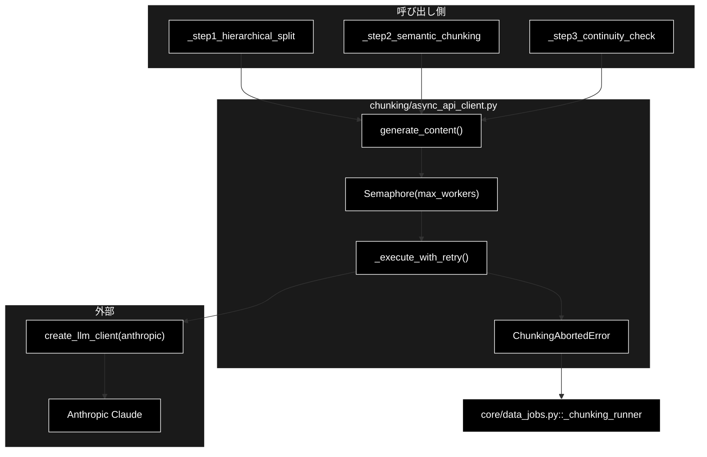
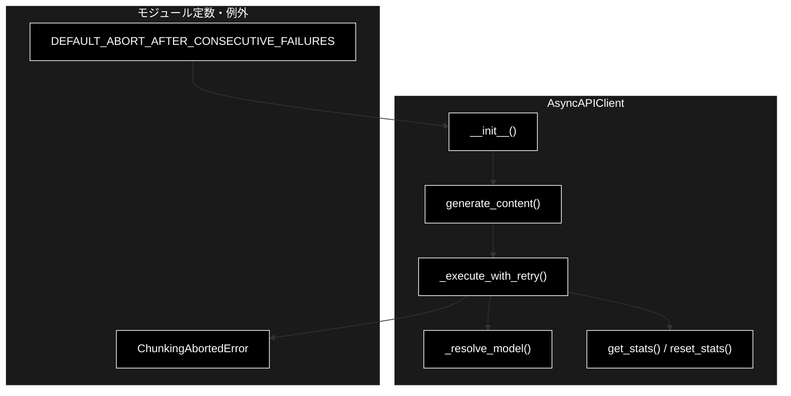
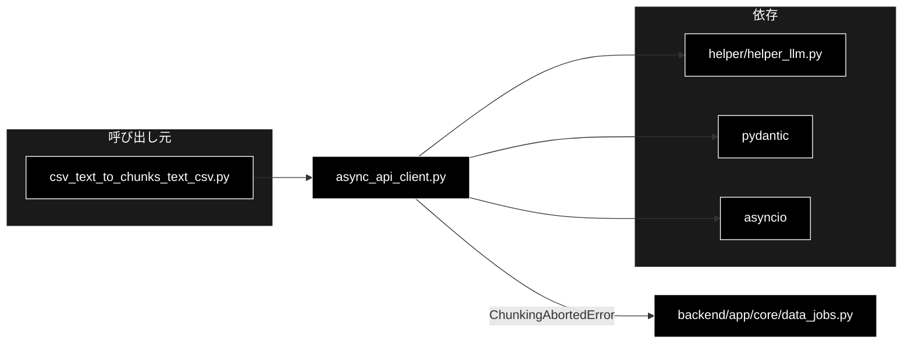

# async_api_client.py - チャンク化用 非同期APIクライアント ドキュメント

**Version 2.0** | 最終更新: 2026-09-12

---

## 目次

1. [概要](#概要)
2. [アーキテクチャ構成図](#1-アーキテクチャ構成図)
3. [モジュール構成図](#2-モジュール構成図)
4. [クラス・関数一覧表](#3-クラス関数一覧表)
5. [クラス・関数 IPO詳細](#4-クラス関数-ipo詳細)
6. [設定・定数](#5-設定定数)
7. [使用例](#6-使用例)
8. [エクスポート](#7-エクスポート)
9. [変更履歴](#8-変更履歴)
10. [付録: 依存関係図](#付録-依存関係図)

---

## 概要

`chunking/async_api_client.py` は、チャンク化の 3 段階（階層分割 → 意味チャンク化 → 連続性チェック）
から呼ばれる**構造化出力つき非同期 LLM クライアント**である。

LLM は **Anthropic Claude**（既定 `claude-sonnet-4-6`・`ANTHROPIC_API_KEY`）。
同期の `create_llm_client("anthropic").generate_structured()` を
`asyncio.to_thread()` でラップし、`asyncio.Semaphore` で並列数を絞る。

> ⚠️ **v1.0 の本書は Gemini 時代の記述だった**（`genai.Client` / `_is_valid_json()` /
> `_is_truncated_response()` など、**現在は存在しないメソッド**を載せていた）。
> v2.0 で実装（210 行）と突き合わせて全面的に書き直している。

### 主な責務

- 構造化出力（Pydantic スキーマ準拠）の生成を**非同期で**行う
- `Semaphore` で並列実行数を絞る
- 指数バックオフでリトライする（レート制限は待ち時間を延ばす）
- **連続失敗が続いたらチャンク化を中断する**（`ChunkingAbortedError`）
- 呼び出し統計を収集する

### 各責務対応のモジュール

| # | 責務 | 対応モジュール | 説明 |
|---|------|--------------|------|
| 1 | LLM 呼び出し | `helper/helper_llm.py` | `create_llm_client("anthropic")` |
| 2 | 非同期化 | 本モジュール | 同期 API を `asyncio.to_thread()` で包む |
| 3 | 並列制御 | 本モジュール | `asyncio.Semaphore(max_workers)` |
| 4 | 中断判断 | 本モジュール | 連続失敗のカウントと `ChunkingAbortedError` |
| 5 | エラー表示 | `backend/app/core/data_jobs.py` | 中断を error イベントへ変換 |

### 主要機能一覧

| 機能 | 説明 |
|------|------|
| `DEFAULT_ABORT_AFTER_CONSECUTIVE_FAILURES` | 連続失敗の既定許容回数（環境変数で変更可） |
| `ChunkingAbortedError` | 連続失敗による中断。**握りつぶしてはいけない** |
| `AsyncAPIClient` | 非同期クライアント本体 |
| `AsyncAPIClient.generate_content()` | セマフォ制御つきの構造化出力生成 |
| `AsyncAPIClient._execute_with_retry()` | リトライと中断判断（プライベート） |
| `AsyncAPIClient._resolve_model()` | 非 Claude 名を既定モデルへ回避（静的メソッド） |
| `AsyncAPIClient.get_stats()` / `reset_stats()` | 統計の取得・リセット |

---

## 1. アーキテクチャ構成図

### 1.1 システム全体構成



### 1.2 データフロー

1. 3 段階のいずれかが `generate_content(model, contents, response_schema, task_id)` を呼ぶ
2. `Semaphore` が空くまで待つ（同時実行は `max_workers` 件まで）
3. `_execute_with_retry()` が `asyncio.to_thread()` で同期の `generate_structured()` を呼ぶ
4. 成功 → Pydantic インスタンスを `model_dump_json()` した**文字列**を返し、連続失敗カウントを 0 に戻す
5. 失敗 → 指数バックオフで `max_retries` 回まで再試行
6. 使い切ったら連続失敗カウントを 1 増やし、
   **上限に達していれば `ChunkingAbortedError` を送出**。達していなければ `None` を返す
   （呼び出し側は機械的分割へフォールバックして次のブロックへ進む）

---

## 2. モジュール構成図

### 2.1 内部モジュール構成



### 2.2 外部依存関係

| ライブラリ | 用途 |
|-----------|------|
| `pydantic` | `BaseModel`（レスポンススキーマの型） |

### 2.3 標準ライブラリ依存

| モジュール | 用途 |
|-----------|------|
| `asyncio` | `to_thread` / `Semaphore` / `sleep` |
| `logging` | リトライ・失敗のログ |
| `os` | `CHUNKING_ABORT_AFTER_FAILURES` の読み取り |

### 2.4 内部依存モジュール

| モジュール | 用途 |
|-----------|------|
| `helper.helper_llm.create_llm_client` | LLM クライアント生成（`provider="anthropic"`） |

---

## 3. クラス・関数一覧表

### 3.1 クラス一覧

#### ChunkingAbortedError

`RuntimeError` のサブクラス。LLM 呼び出しが連続で失敗したためチャンク化を中断したことを表す。

> ⚠️ **握りつぶしてフォールバックで続行してはいけない。** 続行しても、
> LLM を使わない機械的な分割結果しか得られない。
> 捕捉は `backend/app/core/data_jobs.py::_chunking_runner` が行い、error イベントへ変換する。

#### AsyncAPIClient

| メソッド | 概要 |
|---------|------|
| `__init__(api_key, max_workers, max_retries, max_output_tokens, default_model, abort_after_consecutive_failures)` | コンストラクタ |
| `_resolve_model(model, default_model)` | 非 Claude 名を既定モデルへ回避（`@staticmethod`） |
| `generate_content(model, contents, response_schema, task_id)` | セマフォ制御つきの生成（`async`） |
| `_execute_with_retry(model, contents, response_schema, task_id)` | リトライと中断判断（`async`） |
| `get_stats()` | 統計情報を取得 |
| `reset_stats()` | 統計情報をリセット |

### 3.2 関数一覧

モジュールレベル関数はない。

---

## 4. クラス・関数 IPO詳細

### 4.1 `AsyncAPIClient.__init__`

**概要**: LLM クライアント・Semaphore・中断しきい値・統計カウンタを用意する。

```python
AsyncAPIClient(
    api_key: Optional[str] = None,
    max_workers: int = 8,
    max_retries: int = 3,
    max_output_tokens: int = 8192,
    default_model: str = "claude-sonnet-4-6",
    abort_after_consecutive_failures: Optional[int] = None,
)
```

| パラメータ | 型 | デフォルト | 説明 |
|------------|------|-----------|------|
| `api_key` | Optional[str] | None | **未使用**（後方互換のため残置）。実際は `ANTHROPIC_API_KEY` を参照 |
| `max_workers` | int | 8 | 並列実行数（Semaphore 制御） |
| `max_retries` | int | 3 | 1 呼び出しあたりの最大リトライ回数 |
| `max_output_tokens` | int | 8192 | 出力トークン制限 |
| `default_model` | str | `claude-sonnet-4-6` | 既定 Claude モデル |
| `abort_after_consecutive_failures` | Optional[int] | None | 連続失敗の許容回数。None なら `DEFAULT_ABORT_AFTER_CONSECUTIVE_FAILURES`。**0 で中断を無効** |

| 項目 | 内容 |
|------|------|
| **Input** | 上記パラメータ |
| **Process** | ① `create_llm_client("anthropic", default_model=...)`<br>② `asyncio.Semaphore(max_workers)`<br>③ 中断しきい値の決定<br>④ 統計カウンタの初期化 |
| **Output** | `AsyncAPIClient` インスタンス |

**インスタンス属性**:

| 属性 | 型 | 説明 |
|------|-----|------|
| `llm` | LLM クライアント | `create_llm_client("anthropic", ...)` の戻り |
| `default_model` | `str` | 既定モデル |
| `max_workers` / `semaphore` | `int` / `asyncio.Semaphore` | 並列制御 |
| `max_retries` / `max_output_tokens` | `int` | リトライ・出力上限 |
| `abort_after_consecutive_failures` | `int` | 中断しきい値（0 で無効） |
| `_consecutive_failures` | `int` | **連続**失敗回数。成功で 0 に戻る |
| `_total_requests` / `_failed_requests` / `_truncated_responses` | `int` | 統計 |

### 4.2 `AsyncAPIClient._resolve_model`

**概要**: 渡されたモデル名が Claude 系でなければ既定モデルへ回避する。

```python
@staticmethod
def _resolve_model(model: Optional[str], default_model: str) -> str
```

| 項目 | 内容 |
|------|------|
| **Input** | `model`（呼び出し側の指定）、`default_model` |
| **Process** | `model` が `claude` で始まれば採用、それ以外は `default_model` |
| **Output** | 実際に使うモデル名 |

> 📝 チャンク化の呼び出し側にはレガシーで Gemini モデル名を渡す経路が残っている。
> Anthropic エンドポイントへ非 Claude 名を投げて失敗しないための保護である。

### 4.3 `AsyncAPIClient.generate_content`

**概要**: セマフォで並列数を絞りつつ構造化出力を生成する。

```python
async def generate_content(
    model: str,
    contents: str,
    response_schema: Type[BaseModel],
    task_id: Optional[str] = None,
) -> Optional[str]
```

| 項目 | 内容 |
|------|------|
| **Input** | モデル名、プロンプト、レスポンススキーマ、タスク識別子（ログ用） |
| **Process** | `async with self.semaphore:` の中で `_execute_with_retry()` を呼ぶ |
| **Output** | 検証済み JSON **文字列**、または `None`（全リトライ失敗） |

**戻り値例**:

```python
'{"blocks": ["第1節 …", "第2節 …"]}'
```

> 📝 **戻り値は Pydantic インスタンスではなく JSON 文字列。** 呼び出し側が
> `model_validate_json()` でパースする契約を、Gemini 時代から維持している。

### 4.4 `AsyncAPIClient._execute_with_retry`

**概要**: リトライと**中断判断**。本モジュールの中核。

| 項目 | 内容 |
|------|------|
| **Input** | モデル名、プロンプト、レスポンススキーマ、`task_id` |
| **Process** | ① `_resolve_model()`<br>② `max_retries` 回ループし `asyncio.to_thread(generate_structured, ...)`<br>③ 成功したら `_consecutive_failures = 0` にして JSON 文字列を返す<br>④ 失敗は指数バックオフで待つ（レート制限は長め）<br>⑤ 使い切ったら `_failed_requests` と `_consecutive_failures` を加算<br>⑥ しきい値に達していれば `ChunkingAbortedError`、達していなければ `None` |
| **Output** | JSON 文字列 / `None`。中断時は `ChunkingAbortedError` |

**リトライ待機時間**:

| 状況 | 判定 | 待機時間 |
|------|------|---------|
| レート制限 | エラー文字列に `429` / `rate` / `quota` | `30 * (attempt + 1)` 秒（30・60・90） |
| それ以外 | — | `2 ** attempt` 秒（1・2・4） |

#### なぜ中断が要るのか

`None` を返して次のブロックへ進む（＝機械的分割へのフォールバック）は、
**1 ブロックだけ落ちたとき**には正しい。しかし

- API キー切れ・権限不足
- モデル名の誤り
- ネットワーク断・継続的なレート制限

のように**全ブロックで等しく失敗する**原因では話が別で、1 ブロックあたり
`max_retries` 回ぶんの待ちを払い続けたうえ、**LLM を一度も使えていないのに
「成功」した CSV** が出来上がる。ブロック数が多いほど被害が大きい
（姉妹リポジトリ grace_v2_local では 1229 ブロックを 185 時間かけて処理し、
中身のない CSV を書き出した。実測 2026-09-06）。

**連続**失敗で数えるのが要点で、途中で 1 件でも成功すればカウントは 0 に戻る。
単発の失敗が積み上がって止まることはない。

回帰は `backend/tests/test_chunking_abort.py` で固定している。

### 4.5 `AsyncAPIClient.get_stats` / `reset_stats`

| 項目 | 内容 |
|------|------|
| **Input** | なし |
| **Process** | カウンタから成功率を計算（取得）／ カウンタを 0 に戻す（リセット） |
| **Output** | `{"total_requests", "failed_requests", "truncated_responses", "success_rate", "concurrency"}` / `None` |

**戻り値例**:

```python
{"total_requests": 338, "failed_requests": 0, "truncated_responses": 0,
 "success_rate": 100.0, "concurrency": 8}
```

> 📝 `_truncated_responses` は Gemini 時代の切断検出で使っていたカウンタで、
> 現在は**常に 0**。統計の形を変えないために残してある。

---

## 5. 設定・定数

### 5.1 デフォルト設定値

| 設定 | デフォルト値 | 説明 |
|-----|-------------|------|
| `max_workers` | 8 | 並列実行数 |
| `max_retries` | 3 | 最大リトライ回数 |
| `max_output_tokens` | 8192 | 出力トークン制限（呼び出し側は 16384 を渡す） |
| `default_model` | `claude-sonnet-4-6` | 既定モデル |

### 5.2 `DEFAULT_ABORT_AFTER_CONSECUTIVE_FAILURES`

```python
DEFAULT_ABORT_AFTER_CONSECUTIVE_FAILURES = int(
    os.getenv("CHUNKING_ABORT_AFTER_FAILURES", "3")
)
```

| 値 | 挙動 |
|---|---|
| `3`（既定） | 3 ブロック連続で失敗したら中断する |
| `0` | 中断しない（従来どおりフォールバックで進む） |
| `1` | 最初の失敗で中断する |

### 5.3 レート制限の判定キーワード

エラーメッセージ（小文字化）に `429` / `rate` / `quota` のいずれかが含まれるとき、
レート制限として待ち時間を延ばす。

---

## 6. 使用例

### 6.1 基本（チャンク化の 3 段階から）

```python
from chunking.async_api_client import AsyncAPIClient

client = AsyncAPIClient(max_workers=8, max_retries=3, max_output_tokens=16384)

json_text = await client.generate_content(
    model="claude-sonnet-4-6",
    contents=prompt,
    response_schema=Step1Response,
    task_id="step1_block_3",
)
if json_text is None:
    ...   # このブロックだけ失敗 → 機械的分割へフォールバック
else:
    result = Step1Response.model_validate_json(json_text)
```

### 6.2 中断を捕まえる（ジョブ runner 側）

```python
from chunking.async_api_client import ChunkingAbortedError

try:
    chunks = run_chunking_sync(text, model=model, ...)
except ChunkingAbortedError as e:
    # 原因と対処はメッセージ側が持っている。型名を前置きしない
    error(f"❌ {e}")
    return None
```

### 6.3 中断を無効にする

```bash
CHUNKING_ABORT_AFTER_FAILURES=0 python -m chunking.csv_text_to_chunks_text_csv
```

---

## 7. エクスポート

`__all__` の定義はない。公開要素は以下のとおり。

```python
DEFAULT_ABORT_AFTER_CONSECUTIVE_FAILURES   # 連続失敗の既定許容回数
ChunkingAbortedError                       # 連続失敗による中断
AsyncAPIClient                             # 非同期クライアント
```

---

## 8. 変更履歴

| バージョン | 変更内容 |
|-----------|---------|
| 1.0 | 初版作成（Gemini `genai.Client` 前提）（2025-01-29） |
| 2.0 | **実装と突き合わせて全面改訂。** v1.0 は Gemini 時代のままで、現在は存在しない `_is_valid_json()` / `_is_truncated_response()` / `genai.Client` を載せていた。あわせて `ChunkingAbortedError` と `DEFAULT_ABORT_AFTER_CONSECUTIVE_FAILURES` を追加記述（2026-09-12） |

---

## 付録: 依存関係図


