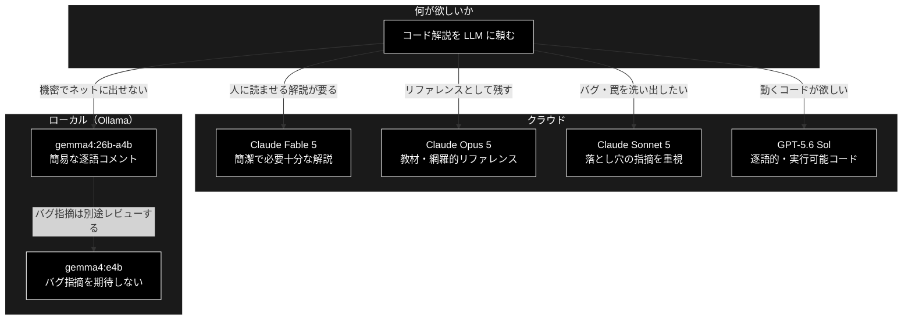

# LLM 7 モデル比較 — 同一設問「React useReducer カウンタの解説」

**Version 1.1** | 最終更新: 2026-08-10

同一の設問を 7 つのモデル（ローカル 3 / クラウド 4）に投げ、生成されたドキュメントの
優劣を比較した記録。`docs/LLM/react_*.md` が各モデルの生の出力である。

---

## 目次

1. [比較の前提](#1-比較の前提)
2. [最重要の発見 2 ファイルが同一](#2-最重要の発見-2-ファイルが同一)
3. [元コードに含まれるバグ](#3-元コードに含まれるバグ)
4. [バグ指摘の比較](#4-バグ指摘の比較)
5. [記述項目の網羅比較](#5-記述項目の網羅比較)
6. [説明の質と体裁](#6-説明の質と体裁)
7. [総合比較表と順位](#7-総合比較表と順位)
8. [モデル規模との関係](#8-モデル規模との関係)
9. [結論と使い分け](#9-結論と使い分け)
10. [検証方法](#10-検証方法)
11. [この評価の限界](#11-この評価の限界)

---

## 1. 比較の前提

### 1.1 設問

全モデルに同一の指示を与えた。

> 以下をのコードをそれぞれのブロックごと、1行ごとに、解説を入れて、
> 日本語のmarkdown のソースとして表示せよ。

```jsx
const initialState = { count: 0 };
const reducer = (state, action) => {
  switch (action.type) {
    case 'increment':
      return {count: state.count + 1};
    case 'decrement':
      return {count: state.count - 1};
    default:
      throw new Error();
  }
}
const Counter => () {
  const [state, dispatch] = useReducer(reducer, initialState);
  return (
    <>
      Count: {state.count}
      <button onClick={() => dispatch({type: 'decrement'})}>-</button>
      <button onClick={() => dispatch({type: 'increment'})}>+</button>
    </>
  );
}
```

> 📝 `docs/LLM/react_llm_Q.md` は空ファイルであり、**本比較の対象外**とする。
> 設問は上記のとおり本書に転記してあるので、比較の再現には本書だけで足りる。

### 1.2 比較対象

| # | モデル | 実行環境 | ファイル | 行数 | 文字数 |
|---:|---|---|---|---:|---:|
| 1 | Claude Fable 5 | クラウド | `react_fable5.md` | 107 | 5,897 |
| 2 | Claude Opus 5 | クラウド | `react_opus5.md` | 729 | 31,514 |
| 3 | Claude Sonnet 5 | クラウド | `react_sonnet5.md`（Q1 のみ） | 134 | 5,568 |
| 4 | OpenAI GPT-5.6 Sol | クラウド | `react_gpt56sol.md` | 281 | 6,285 |
| 5 | qwen3.5:9b | ローカル（Ollama・6.6 GB） | `react_ollama_qwen3_5_9b.md` | 282 | 6,286 |
| 6 | gemma4:e4b | ローカル（Ollama・9.6 GB） | `react_ollama_gemma4_e4b.md` | 148 | 6,227 |
| 7 | gemma4:26b-a4b-it-q4_K_M | ローカル（Ollama・17 GB） | `react_ollama_gemma4_26b-a4b-it-q4_K_M.md` | 51 | 3,136 |

**評価対象の範囲について**

- `react_sonnet5.md` は Q1（本設問）と Q2（Claude モデルの料金比較）を含む Q&A ログである。
  **本比較では Q1 のみを対象**とした（Q2 は別設問のため）。
- `react_opus5.md` は本設問に対する Opus 5 の回答そのものである。

> 📝 `react_ollama_gemma4_e4b.md` は当初 `react_ollama_gemma4_e4b .md`（拡張子の前に半角スペース）
> という名前だった。リンク切れや CLI での扱いづらさの原因になるためリネーム済み。

---

## 2. 最重要の発見 2 ファイルが同一

### 2.1 事実

**`react_gpt56sol.md`（GPT-5.6 Sol）と `react_ollama_qwen3_5_9b.md`（qwen3.5:9b）は、
先頭の空行 1 行を除いて完全に同一の内容である。**

```
$ diff react_gpt56sol.md react_ollama_qwen3_5_9b.md
0a1
>
```

差分は「qwen 側の先頭に空行が 1 行ある」だけ。281 行 / 6,285 文字の本文が**1 文字も違わない**。

### 2.2 何を意味するか

異なるベンダの、しかもパラメータ規模が桁違い（フロンティアモデル vs 9B 量子化モデル）の
2 モデルが、6,000 文字超の日本語文書を偶然 1 文字違わず生成することは**現実的にありえない**。

考えられる原因:

| 可能性 | 説明 |
|---|---|
| **ファイルの取り違え（最有力）** | 同じ出力を 2 つのファイル名で保存してしまった |
| コピー&ペーストの事故 | 片方の内容をもう片方へ上書きした |
| 収集スクリプトの不具合 | モデル切り替えが効かず同じエンドポイントを 2 回叩いた |

### 2.3 本比較での扱い

**この 2 件は独立したデータ点として扱えない。** 以下の表では両方を併記するが、
**「qwen3.5:9b の実力を示すものではない」**という前提で読む必要がある。

> ⚠️ **qwen3.5:9b の評価は保留とする。** 正しい出力を取り直したうえで再評価すること。
> 現状の 7 本は**実質 6 モデル分**である。

---

## 3. 元コードに含まれるバグ

評価の物差しとして、まず設問コードの欠陥を確定させる。

| ID | 箇所 | 種別 | 症状 | 修正 |
|---|---|---|---|---|
| **①** | `const Counter => () {` | **構文エラー（致命的）** | パースに失敗し、ファイル全体が読み込めない | `const Counter = () => {` |
| **②** | `useReducer` の import が無い | **参照エラー（致命的）** | `ReferenceError: useReducer is not defined` | `import { useReducer } from 'react';` |
| ③ | `throw new Error()` にメッセージが無い | 品質上の難点 | 例外は飛ぶが「何の action が不正だったか」が分からない | メッセージを付ける |

**①②はどちらも「動かす前に落ちる」レベル**であり、解説文書としては指摘が必須である。
①だけ直しても②が残れば動かない。

> 補足: `default: throw` を採るか `return state` を採るかは**設計判断**であってバグではない。
> 両論を示せているかは「説明の質」として §5 で評価する。

---

## 4. バグ指摘の比較

| モデル | ① 構文エラー | ② import 漏れ | ③ 空の Error | 判定 |
|---|:---:|:---:|:---:|---|
| **Claude Fable 5** | ✅ 冒頭で警告 | ✅ 末尾で指摘 | ❌ | **①②とも指摘** |
| **Claude Opus 5** | ✅ 冒頭に専用節 | ✅ 冒頭に専用節 | ✅ 明示 | **①②③すべて** |
| **Claude Sonnet 5** | ✅ 該当箇所を切り出し＋末尾で再掲 | ❌ | ❌ | ①のみ |
| **OpenAI GPT-5.6 Sol** | ✅ 該当行の解説内 | ✅ 修正済みコードに含める | △ 改善版を提示（明示的指摘なし） | **①②とも指摘** |
| **qwen3.5:9b** | （GPT と同一のため評価保留） | — | — | — |
| **gemma4:e4b** | ❌ **黙って修正** | ❌ | ❌ | **指摘ゼロ** |
| **gemma4:26b-a4b** | ✅ 冒頭で指摘 | ❌ | ❌ | ①のみ |

### 4.1 最も危険な失敗 — gemma4:e4b の「黙って修正」

`gemma4:e4b` は自分の掲載コードでは `const Counter = () => {` と**正しく書き直している**
（`react_ollama_gemma4_e4b.md` L32・L115）が、**元コードが誤っていた事実を一言も述べていない**。

```
$ grep -c "構文\|誤り\|修正" react_ollama_gemma4_e4b.md
0
```

これは単なる「指摘漏れ」より悪い。読み手は

> 自分のコードは正しかった。解説もその通りに書かれている

と誤解したまま、実行して初めて `SyntaxError` に遭遇する。**誤りを見逃すのではなく、
誤りを覆い隠している**ため、7 本の中で最も実害が大きい。

### 4.2 モデル規模と指摘能力が逆転している

同じ gemma4 系列で、**17 GB の 26b が指摘でき、9.6 GB の e4b が指摘できなかった**。
一方、②の import 漏れは 26b も落としている。ローカルモデルでは
**「動くコードを出す」より「与えられたコードを疑う」ほうが難しい**傾向が読み取れる。

---

## 5. 記述項目の網羅比較

`useReducer` の解説として押さえるべき 20 項目について、各文書の言及有無を機械的に判定した
（判定スクリプトは §10）。

| # | 項目 | Fable5 | Opus5 | Sonnet5 | GPT5.6 | qwen9b | gemma_e4b | gemma_26b |
|---:|---|:---:|:---:|:---:|:---:|:---:|:---:|:---:|
| 1 | 構文エラーの指摘 | ✅ | ✅ | ✅ | ✅ | ✅ | ❌ | ✅ |
| 2 | import 漏れの指摘 | ✅ | ✅ | ❌ | ✅ | ✅ | ❌ | ❌ |
| 3 | reducer は純関数 | ✅ | ✅ | ✅ | ❌ | ❌ | ❌ | ❌ |
| 4 | イミュータブル更新 | ✅ | ✅ | ✅ | ✅ | ✅ | ✅ | △ |
| 5 | **参照比較で変化を判定** | ❌ | ✅ | ✅ | ❌ | ❌ | ❌ | ❌ |
| 6 | **onClick を包む理由** | ❌ | ✅ | ✅ | ❌ | ❌ | ❌ | ❌ |
| 7 | Fragment の説明 | ✅ | ✅ | ✅ | ✅ | ✅ | ❌ | ✅ |
| 8 | `{}` は JS の式 | ✅ | ✅ | ❌ | ✅ | ✅ | ❌ | ❌ |
| 9 | useState との使い分け | ✅ | ✅ | ✅ | ❌ | ❌ | ❌ | ❌ |
| 10 | dispatch の同一性保証 | ❌ | ✅ | ❌ | ❌ | ❌ | ❌ | ❌ |
| 11 | reducer の実行タイミング | ❌ | ✅ | ❌ | ❌ | ❌ | ❌ | ❌ |
| 12 | StrictMode の二重呼び出し | ❌ | ✅ | ❌ | ❌ | ❌ | ❌ | ❌ |
| 13 | `{...state}` の必要性 | ❌ | ✅ | ❌ | ❌ | ❌ | ❌ | ❌ |
| 14 | コンポーネント名は大文字 | ❌ | ✅ | ❌ | ❌ | ❌ | ❌ | ❌ |
| 15 | throw と return state の比較 | ✅ | ✅ | ❌ | ❌ | ❌ | ❌ | ❌ |
| 16 | 動作フローの提示 | ✅ | ✅ | ✅ | ✅ | ✅ | ❌ | ❌ |
| 17 | 修正済みの通しコード | ❌ | ✅ | ❌ | ✅ | ✅ | △ | ❌ |
| 18 | アクセシビリティ | ❌ | ✅ | ❌ | ❌ | ❌ | ❌ | ❌ |
| 19 | TypeScript 版 / 網羅性検査 | ❌ | ❌ | ❌ | ❌ | ❌ | ❌ | ❌ |
| 20 | 3 引数 useReducer（遅延初期化） | ❌ | ✅ | ❌ | ❌ | ❌ | ❌ | ❌ |
| | **✅ の数** | **9** | **19** | **8** | **7** | **7** | **1** | **2** |

凡例: ✅ 明示的に記述 / △ 部分的 / ❌ 記述なし

### 5.1 「初学者が実際に踏む罠」だけを抜き出すと

項目数の多寡より、**踏むと詰まる罠**を押さえているかが実用上の分かれ目になる。

| 罠 | なぜ致命的か | 押さえたモデル |
|---|---|---|
| ① 構文エラー | 動かす前に落ちる | Fable5 / Opus5 / Sonnet5 / GPT5.6 / gemma_26b |
| ② import 漏れ | 動かす前に落ちる | Fable5 / Opus5 / GPT5.6 |
| ⑥ `onClick={dispatch(...)}` と書くと即実行 → 無限ループ | **エラーが出ずブラウザが固まる**ので原因に気づきにくい | **Opus5 / Sonnet5 のみ** |
| ⑤ state を書き換えると再レンダーされない | **エラーが出ず「押しても何も起きない」** | Opus5 / Sonnet5 のみ |

> 📌 **⑤⑥を書けたのは Opus 5 と Sonnet 5 の 2 本だけ。**
> どちらも「エラーメッセージが出ないまま壊れる」類の罠であり、
> 初学者が最も長く詰まる箇所である。Fable 5 がここを落としているのは惜しい。

---

## 6. 説明の質と体裁

### 6.1 「1 行ごと」への忠実さ

設問は「**ブロックごと、1行ごとに**解説」と指定している。

| モデル | 方式 | 忠実さ |
|---|---|---|
| GPT-5.6 Sol | 1 行ずつコードフェンス＋箇条書き。閉じ括弧 `}` `);` まで解説 | ★★★ 最も忠実（やや過剰） |
| Opus 5 | 全行インライン注釈＋ブロック別の 1 行対応表 | ★★★ 忠実 |
| Fable 5 | ブロックごとに「行番号・コード・解説」の 3 列表 | ★★★ 忠実かつ簡潔 |
| gemma4:26b | コード内にインラインコメント（全行） | ★★☆ 忠実だが密度が低い |
| gemma4:e4b | ブロック単位＋主要行のみ箇条書き | ★☆☆ 部分的 |
| Sonnet 5 | ブロック単位。数行まとめて解説 | ★☆☆ 設問への追従は弱い |

### 6.2 体裁上の欠陥

| モデル | 欠陥 | 影響 |
|---|---|---|
| **gemma4:26b-a4b** | 全体を ` ```markdown ` で囲み、**内側でも同じ長さのフェンスを使用** | **Markdown が壊れる**（L11 の閉じフェンスが外側を閉じてしまい、以降の構造が崩壊。末尾 L51 のフェンスは開いたまま） |
| **gemma4:e4b** | 「コード全体」ブロックが**全行に空行が挿入**され、24 行のコードが 42 行に膨張 | 可読性の低下 |
| **gemma4:e4b** | 日本語が行の途中で折り返される（`返しま\nす。`・`宣言してい\nます。`） | 端末幅で切られた出力をそのまま保存した痕跡 |
| Fable 5 | 末尾に「直すべき点は 1 箇所だけ」と書いた直後に import の追加も必要と述べている | 軽微な自己矛盾 |
| Opus 5 | 31,514 文字（他の約 5 倍） | 設問に対して**過剰**。通読負荷が高い |

### 6.3 事実誤認

**7 本すべてにおいて、明確な技術的誤りは発見できなかった。** 記述の差は
「書いていない」か「書いてある」かであり、「間違ったことを書いた」文書は無い。
ローカルモデルであっても、**書いた範囲については正しい**。

---

## 7. 総合比較表と順位

### 7.1 総合表

| 指標 | Fable 5 | Opus 5 | Sonnet 5 | GPT-5.6 Sol | gemma4:26b | gemma4:e4b | qwen3.5:9b |
|---|:---:|:---:|:---:|:---:|:---:|:---:|:---:|
| 網羅（/20） | 9 | **19** | 8 | 7 | 2 | 1 | 保留 |
| 致命バグ①② | 2/2 | **2/2** | 1/2 | **2/2** | 1/2 | **0/2** | 保留 |
| 「気づけない罠」⑤⑥ | 0/2 | **2/2** | **2/2** | 0/2 | 0/2 | 0/2 | 保留 |
| 1 行ごとの忠実さ | ★★★ | ★★★ | ★☆☆ | ★★★ | ★★☆ | ★☆☆ | 保留 |
| 体裁の健全性 | ○ | ○ | ○ | ○ | **× 壊れる** | △ | 保留 |
| 分量の適切さ | **◎** | × 過大 | ◎ | ○ | △ 過少 | ○ | 保留 |
| 事実誤認 | なし | なし | なし | なし | なし | なし | — |

### 7.2 順位 — 2 つの軸で分けて示す

**同じ文書でも「設問への回答」として見るか「教材」として見るかで順位が入れ替わる**ため、
単一のランキングにはしない。

#### 軸A: 設問への回答としての完成度（分量の適切さを重視）

| 順位 | モデル | 理由 |
|---:|---|---|
| **1** | **Claude Fable 5** | 致命バグ①②を両方指摘し、3 ブロック × 行対応表で簡潔。useState 比較・動作フロー・throw の両論併記まで 107 行に収めた**情報密度が最良** |
| 2 | Claude Sonnet 5 | ⑤⑥という「気づけない罠」を押さえた唯一の短編。ただし**import 漏れを落とした**のが減点 |
| 3 | OpenAI GPT-5.6 Sol | 1 行ごとの忠実さと**修正済みの実行可能コード提示**は随一。ただし概念（純関数・参照比較・useState 比較）が手薄 |
| 4 | Claude Opus 5 | 内容は最も厚いが 31,514 文字は設問に対して過剰。回答としては読ませすぎ |
| 5 | gemma4:26b-a4b | 構文エラーは指摘。ただし **Markdown が壊れており**そのままでは使えない |
| 6 | gemma4:e4b | **バグ指摘ゼロ＋黙って修正**。実害が最も大きい |
| — | qwen3.5:9b | 出力取り違えのため評価不能 |

#### 軸B: 教材・リファレンスとしての価値（網羅性を重視）

| 順位 | モデル | 理由 |
|---:|---|---|
| **1** | **Claude Opus 5** | 20 項目中 19。実行トレース・図解・つまずき一覧まで揃い、単体で教材になる |
| 2 | Claude Fable 5 | 必要十分。短時間で全体像を掴むならこちら |
| 3 | Claude Sonnet 5 | 罠の説明は良質だが網羅性は中程度 |
| 4 | OpenAI GPT-5.6 Sol | 逐語的で辞書的。概念の裏付けが薄い |
| 5-7 | ローカル 3 モデル | 教材としては不足 |

> **ユーザーの当初の見立て（「Fable 5 が一番良さそう」）は妥当である。**
> 設問に対する回答としては Fable 5 が最良と判断した。
> ただし Fable 5 は「エラーが出ないまま壊れる」⑤⑥を落としており、**完璧ではない**。
> Fable 5 の構成に Sonnet 5 の⑤⑥を足したものが理想形に近い。

---

## 8. モデル規模との関係

| 区分 | モデル | サイズ | 網羅（/20） | 致命バグ |
|---|---|---:|---:|---:|
| クラウド | Claude Opus 5 | — | 19 | 2/2 |
| クラウド | Claude Fable 5 | — | 9 | 2/2 |
| クラウド | Claude Sonnet 5 | — | 8 | 1/2 |
| クラウド | GPT-5.6 Sol | — | 7 | 2/2 |
| ローカル | gemma4:26b-a4b-it-q4_K_M | 17 GB | 2 | 1/2 |
| ローカル | gemma4:e4b | 9.6 GB | 1 | 0/2 |
| ローカル | qwen3.5:9b | 6.6 GB | 保留 | 保留 |

### 読み取れること

1. **クラウド 4 本とローカル 2 本の間に明確な断絶がある。** 網羅性で 7〜19 対 1〜2。
   差は「コードを説明する能力」ではなく、**「聞かれていないが重要なことを補う能力」**に出ている。
2. **同系列ではサイズが効いた。** gemma4 の 17 GB 版は構文エラーを指摘できたが、
   9.6 GB 版はできなかった。ただし**両方とも import 漏れは落とした**。
3. **ローカルモデルは「書いた内容は正しい」。** 誤りを書いたのではなく、
   **触れる範囲が狭い**。逐語的な説明が欲しいだけなら実用に耐える。
4. **クラウド内での差は網羅性より「何を重要と判断したか」に出る。**
   Opus 5 は全部書き、Fable 5 は絞り、Sonnet 5 は罠に寄せ、GPT-5.6 Sol は逐語に寄せた。

> ⚠️ **本比較は 1 設問・1 回の試行に基づく。** サンプル数 1 で
> 「モデル A は B より優れている」と一般化することはできない。
> 温度設定・プロンプトの言い回し・実行時刻で結果は変わりうる。

---

## 9. 結論と使い分け

### 9.1 結論

| 問い | 答え |
|---|---|
| 必要な点が記述されているか | **Opus 5 が最も網羅（19/20）。Fable 5 が実用上十分（9/20）** |
| バグの指摘ができたか | **①②とも指摘: Fable 5 / Opus 5 / GPT-5.6 Sol。gemma4:e4b は指摘ゼロで黙って修正** |
| 説明の良さ・抜け漏れ | **「エラーが出ないまま壊れる」⑤⑥を押さえたのは Opus 5 / Sonnet 5 のみ** |
| 体裁 | **gemma4:26b は Markdown が壊れており、そのままでは使えない** |
| 総合 | **設問への回答としては Fable 5、教材としては Opus 5** |

### 9.2 用途別の選択



### 9.3 実務上の提言

| # | 提言 |
|---|---|
| 1 | **既存コードのレビューをローカルモデルに任せない。** 今回、ローカル 2 本は import 漏れを検出できず、うち 1 本は構文エラーを黙って修正した。「誤りが無い」という結論を信用できない |
| 2 | **「バグがあれば指摘せよ」と明示的に指示する。** 今回の設問は「解説せよ」であり、バグ指摘は求めていない。それでも指摘したかどうかがモデル差になった。指示すればローカルモデルの成績も変わる可能性がある |
| 3 | **分量を指定する。** Opus 5 の 31,514 文字は「解説せよ」だけでは制御できない。「1,000 字程度で」などの制約が有効 |
| 4 | **収集手順にハッシュ検証を入れる。** §2 の取り違えは `md5sum` を取っていれば即座に気づけた |

---

## 10. 検証方法

本比較の判定は目視ではなく、以下のスクリプトで機械的に行った。再現可能である。

### 10.1 同一性の検証（§2）

```bash
cd docs/LLM
diff react_gpt56sol.md react_ollama_qwen3_5_9b.md
md5sum react_gpt56sol.md react_ollama_qwen3_5_9b.md
```

### 10.2 網羅項目の判定（§5）

各項目を正規表現に落とし、全ファイルへ一括適用した。

```python
checks = [
 ('構文エラー指摘',      r'構文エラー|SyntaxError'),
 ('import漏れ指摘',      r"import \{ useReducer \}|import が必要|import.*が無い|import を"),
 ('純関数',              r'純粋関数|純関数'),
 ('イミュータブル更新',  r'イミュータブル|新しいオブジェクト|直接[書変]|直接変更'),
 ('参照比較/Object.is',  r'Object\.is|参照(が|を)?(変わ|比較)|reference'),
 ('onClick包む理由',     r'即座に実行|即実行|レンダリング時に即|レンダー時に即|遅延させる'),
 # …（全 20 項目）
]
```

> ⚠️ **正規表現による判定には取りこぼしがある。** 実際、初回の判定では
> Opus 5 の「修正済みの通しコード」を見落とした（`実行可能|コード全体|export default`
> という語を使わずに提示していたため）。**表に採用した値は目視で再確認して補正済み**である。

### 10.3 Markdown 体裁の検証（§6.2）

```python
fences = [(i+1, l.strip()) for i, l in enumerate(lines) if l.strip().startswith('```')]
# gemma4:26b → L5 ```markdown / L9 ```javascript / L11 ``` …
# L11 の閉じフェンスが L5 の外側フェンスを閉じてしまう
```

---

## 11. この評価の限界

**読む前に承知しておくべき制約を明示する。**

| # | 限界 |
|---|---|
| 1 | **`react_opus5.md` は本評価の筆者と同一のモデル（Claude Opus 5）による出力である。** 自作物を自己評価しているため、有利に働くバイアスがありうる。軸A で Opus 5 を 4 位に置いたのは「過剰」という減点を意識的に適用した結果だが、**この減点の妥当性自体は第三者に検証してほしい** |
| 2 | **サンプル数 1。** 各モデル 1 回の試行であり、再実行で結果は変わりうる。モデルの優劣を一般化する根拠にはならない |
| 3 | **`qwen3.5:9b` は評価不能。** §2 のとおり出力が取り違えられている |
| 4 | **温度・シード・システムプロンプトの条件が記録されていない。** 同条件での再現ができない |
| 5 | **プロンプトが「解説せよ」であり「バグを指摘せよ」ではない。** バグ指摘の有無をモデル能力の差と断定はできない（指摘しなかったのは指示に忠実だったとも解釈できる）。ただし**①②は動作を妨げる致命的欠陥**であり、解説文書としては触れるべきだったと判断した |
| 6 | **評価軸の重み付けは筆者の主観である。** 「気づけない罠（⑤⑥）を重視する」という判断は、読者の目的（学習用か・リファレンスかなど）によって変わる |

---

## 参考

| 対象 | 場所 |
|---|---|
| 各モデルの出力 | `docs/LLM/react_*.md`（7 本） |
| 本リポジトリの reducer 実装 | `frontend/src/state/jobReducer.ts`, `reviewReducer.ts`, `dataReducer.ts` |

---

## 変更履歴

| 版 | 日付 | 変更内容 |
|---|---|---|
| 1.0 | 2026-08-10 | 初版作成。7 本の機械的比較（規模・網羅 20 項目・バグ指摘 3 件・体裁）。`react_gpt56sol.md` と `react_ollama_qwen3_5_9b.md` が同一である事実、`gemma4:e4b` がバグを黙って修正している事実、`gemma4:26b` の Markdown が壊れている事実を記載 |
| 1.1 | 2026-08-10 | `react_ollama_gemma4_e4b .md` を `react_ollama_gemma4_e4b.md` へリネーム（拡張子前の半角スペースを除去）し、本文の参照 4 箇所を追随。空ファイルの `react_llm_Q.md` を比較対象外と明記（設問は §1.1 に転記済み）|
