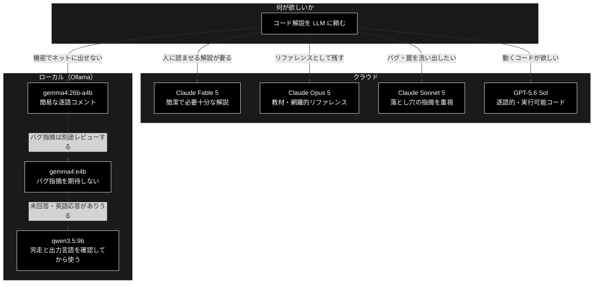

## LLM 7 モデル比較 — 同一設問「React useReducer カウンタの解説」

**Version 1.3** | 最終更新: 2026-08-11

- 同一の設問（Reactコードのドキュメント作成・バグあり）を 7 つのモデル（ローカル 3 / クラウド 4）に投げ、生成されたドキュメントの
- 優劣を比較した記録。`docs/LLM/react_*.md` が各モデルの生の出力である。
#### （結果）「比較モデル」：順位
- No.1 Claude Opus 5
- No.2 Claude Fable 5
- No.3 Claude Sonnet 5
- No.4 OpenAI GPT-5.6 Sol
- No.5 Google gemma4:e4b
- No.6 Google gemma4:26b-a4b-it-q4_K_M
- No.不能 中華   qwen3.5:9b　「圏外（正しく動かない）」

「useReducer」の解説として押さえるべき 20 項目について、各文書の言及有無を機械的に判定した
（判定スクリプトは §10）。

| # | 項目 | Fable5 | Opus5 | Sonnet5 | GPT5.6 | qwen9b ※ | gemma_e4b | gemma_26b |
|---:|---|:---:|:---:|:---:|:---:|:---:|:---:|:---:|
| 1 | 構文エラーの指摘 | ✅ | ✅ | ✅ | ✅ | — | ❌ | ✅ |
| 2 | import 漏れの指摘 | ✅ | ✅ | ❌ | ✅ | — | ❌ | ❌ |
| 3 | reducer は純関数 | ✅ | ✅ | ✅ | ❌ | — | ❌ | ❌ |
| 4 | イミュータブル更新 | ✅ | ✅ | ✅ | ✅ | — | ✅ | △ |
| 5 | **参照比較で変化を判定** | ❌ | ✅ | ✅ | ❌ | — | ❌ | ❌ |
| 6 | **onClick を包む理由** | ❌ | ✅ | ✅ | ❌ | — | ❌ | ❌ |
| 7 | Fragment の説明 | ✅ | ✅ | ✅ | ✅ | — | ❌ | ✅ |
| 8 | `{}` は JS の式 | ✅ | ✅ | ❌ | ✅ | — | ❌ | ❌ |
| 9 | useState との使い分け | ✅ | ✅ | ✅ | ❌ | — | ❌ | ❌ |
| 10 | dispatch の同一性保証 | ❌ | ✅ | ❌ | ❌ | — | ❌ | ❌ |
| 11 | reducer の実行タイミング | ❌ | ✅ | ❌ | ❌ | — | ❌ | ❌ |
| 12 | StrictMode の二重呼び出し | ❌ | ✅ | ❌ | ❌ | — | ❌ | ❌ |
| 13 | `{...state}` の必要性 | ❌ | ✅ | ❌ | ❌ | — | ❌ | ❌ |
| 14 | コンポーネント名は大文字 | ❌ | ✅ | ❌ | ❌ | — | ❌ | ❌ |
| 15 | throw と return state の比較 | ✅ | ✅ | ❌ | ❌ | — | ❌ | ❌ |
| 16 | 動作フローの提示 | ✅ | ✅ | ✅ | ✅ | — | ❌ | ❌ |
| 17 | 修正済みの通しコード | ❌ | ✅ | ❌ | ✅ | — | △ | ❌ |
| 18 | アクセシビリティ | ❌ | ✅ | ❌ | ❌ | — | ❌ | ❌ |
| 19 | TypeScript 版 / 網羅性検査 | ❌ | ❌ | ❌ | ❌ | — | ❌ | ❌ |
| 20 | 3 引数 useReducer（遅延初期化） | ❌ | ✅ | ❌ | ❌ | — | ❌ | ❌ |
| | **✅ の数** | **9** | **19** | **8** | **7** | **—** | **1** | **2** |

凡例: ✅ 明示的に記述 / △ 部分的 / ❌ 記述なし / — 評価対象外

> ※ **qwen3.5:9b は解説ドキュメントを出力していない**ため、全項目を評価対象外とした（§2）。
> 「記述が無い（❌）」ではなく「評価する成果物が無い（—）」である。両者は区別する必要がある。

---

## 目次

1. [比較の前提](#1-比較の前提)
2. [最重要の発見 qwen は回答しておらず日本語でもない](#2-最重要の発見-qwen-は回答しておらず日本語でもない)
3. [元コードに含まれるバグ](#3-元コードに含まれるバグ)
4. [バグ指摘の比較](#4-バグ指摘の比較)
5. [記述項目の網羅比較](#5-記述項目の網羅比較)
6. [説明の質と体裁](#6-説明の質と体裁)
7. [総合比較表と順位](#7-総合比較表と順位)
8. [モデル規模との関係](#8-モデル規模との関係)
9. [結論と使い分け](#9-結論と使い分け)
10. [検証方法](#10-検証方法)
11. [この評価の限界](#11-この評価の限界)

---

## 1. 比較の前提

### 1.1 設問

全モデルに同一の指示を与えた。（コードにバグあり）

> 以下をのコードをそれぞれのブロックごと、1行ごとに、解説を入れて、
> 日本語のmarkdown のソースとして表示せよ。

```jsx
const initialState = { count: 0 };
const reducer = (state, action) => {
  switch (action.type) {
    case 'increment':
      return {count: state.count + 1};
    case 'decrement':
      return {count: state.count - 1};
    default:
      throw new Error();
  }
}
const Counter => () {
  const [state, dispatch] = useReducer(reducer, initialState);
  return (
    <>
      Count: {state.count}
      <button onClick={() => dispatch({type: 'decrement'})}>-</button>
      <button onClick={() => dispatch({type: 'increment'})}>+</button>
    </>
  );
}
```

> 📝 `docs/LLM/react_llm_Q.md` は空ファイルであり、**本比較の対象外**とする。
> 設問は上記のとおり本書に転記してあるので、比較の再現には本書だけで足りる。

### 1.2 比較対象

| # | モデル | 実行環境 | ファイル | 行数 | 文字数 |
|---:|---|---|---|---:|---:|
| 1 | Claude Fable 5 | クラウド | `react_fable5.md` | 107 | 5,897 |
| 2 | Claude Opus 5 | クラウド | `react_opus5.md` | 729 | 31,514 |
| 3 | Claude Sonnet 5 | クラウド | `react_sonnet5.md`（Q1 のみ） | 134 | 5,568 |
| 4 | OpenAI GPT-5.6 Sol | クラウド | `react_gpt56sol.md` | 281 | 6,285 |
| 5 | gemma4:e4b | ローカル（Ollama・9.6 GB） | `react_ollama_gemma4_e4b.md` | 148 | 6,227 |
| 6 | gemma4:26b-a4b-it-q4_K_M | ローカル（Ollama・17 GB） | `react_ollama_gemma4_26b-a4b-it-q4_K_M.md` | 51 | 3,136 |
| **不能** | qwen3.5:9b | ローカル（Ollama・6.6 GB） | `react_ollama_qwen3_5_9b.md` | 224 | 39,196 |

**評価対象の範囲について**

- `react_sonnet5.md` は Q1（本設問）と Q2（Claude モデルの料金比較）を含む Q&A ログである。
  **本比較では Q1 のみを対象**とした（Q2 は別設問のため）。
- `react_opus5.md` は本設問に対する Opus 5 の回答そのものである。
- `react_ollama_qwen3_5_9b.md` は**解説ドキュメントではなく、モデルの内部推敲（thinking）
  そのもの**である。§2 のとおり成果物に到達していないため、**No. を「不能」として最後に置いた**。
  他の 6 本と同じ土俵で番号を振ると、あたかも比較可能な回答が存在するかのように読めてしまう。

> 📝 `react_ollama_gemma4_e4b.md` は当初 `react_ollama_gemma4_e4b .md`（拡張子の前に半角スペース）
> という名前だった。リンク切れや CLI での扱いづらさの原因になるためリネーム済み。

---

## 2. 最重要の発見 qwen は回答しておらず日本語でもない

### 2.1 経緯

本書の初版（v1.0）では、`react_ollama_qwen3_5_9b.md` が `react_gpt56sol.md` と
**先頭の空行 1 行を除いて完全に同一**であった。別ベンダ・桁違いの規模の 2 モデルが
6,000 文字超の日本語を 1 文字違わず生成することはありえないため、収集時の
**ファイル取り違え**と判断して評価を保留した。

その後、正しい出力へ差し替えられた（master `2f93674`）。本節はその**差し替え後**の内容に基づく。

### 2.2 差し替え後の中身 — 解説ドキュメントが存在しない

**`react_ollama_qwen3_5_9b.md` に「ドキュメント部分」は無い。**
224 行 39,196 文字の全体が、モデルが**英語で行った内部推敲**である。

| 指標 | 実測値 |
|---|---|
| 日本語文字の比率 | **0.5%**（日本語 73 文字 / 英字 13,771 文字） |
| Markdown 見出し | 3 個のみ（いずれも推敲中の**下書き例**の中） |
| 一人称の作業メモ | `I will` 16 回 / `I'll` 13 回 / `Wait` 10 回 / `Actually` 10 回 |
| 末尾 | 計画の途中で途切れている |

設問は「**日本語の markdown のソースとして表示せよ**」だったが、モデルは
**この一文の解釈に出力のほぼ全部を費やした**（"markdown source" をどう読むかの議論が 26 箇所）。
そして最終行で、

> I'll generate a response where I use Markdown features (headers `#`, bolding, lists).

と**これから書く宣言をしたところで出力が終わっている**。宣言された文書は存在しない。

### 2.3 日本語で問うたのに日本語で答えていない

成果物が無いこととは**別に、それ自体が独立した不具合**である。

| 項目 | 内容 |
|---|---|
| 設問の言語 | **日本語** |
| 設問の明示的な指定 | 「**日本語の** markdown のソースとして表示せよ」 |
| 実際の出力言語 | **英語**（日本語比率 0.5%） |

出力に現れる日本語 73 文字は、推敲中に下書きした例文の断片にすぎない
（`// ここではカウンターのカウントを最初から「0」に設定しています。...` など）。
**地の文はすべて英語**である。

比較対象の他 6 本は、いずれも日本語で回答している。**指示された言語で応答するという
最低限の要件を満たさなかったのは本モデルだけ**であり、
仮に本文まで完走していたとしても、英語のまま出力された可能性がある。

> ⚠️ **この 1 回の試行から「このモデルは日本語を扱えない」とは結論できない。**
> 観測できたのは「**この試行では日本語指示に英語で応答した**」という事実に限られる。
> システムプロンプトの指定、`thinking` の言語設定、収集方法（§11）によって
> 変わりうる。同様に、開発元が同じ他モデルへ一般化する根拠にもならない。

### 2.4 思考過程では構文エラーを検出していた

成果物は無いが、推敲の中では**構文エラーを繰り返し検出している**（7 箇所）。

> L32: `const Counter => () ->` (This is definitely broken). It looks like they meant `const Counter = () => {`.
>
> L87: The input code ... is invalid JS (missing `'='`). **I will correct it silently** or fix the explanation of what was *intended*.

**注目すべきは「黙って直す」と 3 回決めている点**（L87 / L128 / L185）。
仮に完走していたとしても、`gemma4:e4b` と**同じ失敗モード**——
誤りを指摘せず覆い隠す——になっていた可能性が高い。

一方、**② の import 漏れには思考の中でも一度も触れていない**（`import` の出現 0 回）。

> 📝 これは「思考の中では気づいていた」という観察であって、**成果物の評価ではない**。
> 読み手が受け取るのは成果物だけであり、そこには何も書かれていない。

### 2.5 引用の忠実さにも問題がある

推敲の中でモデルは設問コードを繰り返し引用するが、原文と一致していない。

| 原文 | qwen の引用 |
|---|---|
| `const Counter => () {` | `const Counter => () ->` / `const Counter => () >` |

**入力を正確に読み取れていない。** 構文エラーの存在自体は当てているが、
どう壊れているかの認識は不正確である。

### 2.6 本比較での扱い

- **成果物としての評価は「無」**。§5 の網羅表・§6 の体裁評価では対象にならない
- §1.2 の一覧では **No. を「不能」**とし、他の 6 本の後ろへ置いた
- §2.4 の観察は**参考情報**として扱い、スコアには算入しない
- 原因がモデルの能力なのか、**収集側で thinking だけを保存してしまったのか**は
  本データからは切り分けられない（§11 参照）

---

## 3. 元コードに含まれるバグ

評価の物差しとして、まず設問コードの欠陥を確定させる。

| ID | 箇所 | 種別 | 症状 | 修正 |
|---|---|---|---|---|
| **①** | `const Counter => () {` | **構文エラー（致命的）** | パースに失敗し、ファイル全体が読み込めない | `const Counter = () => {` |
| **②** | `useReducer` の import が無い | **参照エラー（致命的）** | `ReferenceError: useReducer is not defined` | `import { useReducer } from 'react';` |
| ③ | `throw new Error()` にメッセージが無い | 品質上の難点 | 例外は飛ぶが「何の action が不正だったか」が分からない | メッセージを付ける |

**①②はどちらも「動かす前に落ちる」レベル**であり、解説文書としては指摘が必須である。
①だけ直しても②が残れば動かない。

> 補足: `default: throw` を採るか `return state` を採るかは**設計判断**であってバグではない。
> 両論を示せているかは「説明の質」として §5 で評価する。

---

## 4. バグ指摘の比較

| モデル | ① 構文エラー | ② import 漏れ | ③ 空の Error | 判定 |
|---|:---:|:---:|:---:|---|
| **Claude Fable 5** | ✅ 冒頭で警告 | ✅ 末尾で指摘 | ❌ | **①②とも指摘** |
| **Claude Opus 5** | ✅ 冒頭に専用節 | ✅ 冒頭に専用節 | ✅ 明示 | **①②③すべて** |
| **Claude Sonnet 5** | ✅ 該当箇所を切り出し＋末尾で再掲 | ❌ | ❌ | ①のみ |
| **OpenAI GPT-5.6 Sol** | ✅ 該当行の解説内 | ✅ 修正済みコードに含める | △ 改善版を提示（明示的指摘なし） | **①②とも指摘** |
| **qwen3.5:9b** | ❌ 成果物なし（思考では検出＋「黙って直す」と決定） | ❌ 思考でも言及なし | ❌ | **成果物なし** |
| **gemma4:e4b** | ❌ **黙って修正** | ❌ | ❌ | **指摘ゼロ** |
| **gemma4:26b-a4b** | ✅ 冒頭で指摘 | ❌ | ❌ | ①のみ |

### 4.1 最も危険な失敗 — gemma4:e4b の「黙って修正」

`gemma4:e4b` は自分の掲載コードでは `const Counter = () => {` と**正しく書き直している**
（`react_ollama_gemma4_e4b.md` L32・L115）が、**元コードが誤っていた事実を一言も述べていない**。

```
$ grep -c "構文\|誤り\|修正" react_ollama_gemma4_e4b.md
0
```

これは単なる「指摘漏れ」より悪い。読み手は

> 自分のコードは正しかった。解説もその通りに書かれている

と誤解したまま、実行して初めて `SyntaxError` に遭遇する。**誤りを見逃すのではなく、
誤りを覆い隠している**ため、7 本の中で最も実害が大きい。

### 4.2 モデル規模と指摘能力が逆転している

同じ gemma4 系列で、**17 GB の 26b が指摘でき、9.6 GB の e4b が指摘できなかった**。
一方、②の import 漏れは 26b も落としている。ローカルモデルでは
**「動くコードを出す」より「与えられたコードを疑う」ほうが難しい**傾向が読み取れる。

---

## 5. 記述項目の網羅比較

`useReducer` の解説として押さえるべき 20 項目について、各文書の言及有無を機械的に判定した
（判定スクリプトは §10）。

| # | 項目 | Fable5 | Opus5 | Sonnet5 | GPT5.6 | qwen9b ※ | gemma_e4b | gemma_26b |
|---:|---|:---:|:---:|:---:|:---:|:---:|:---:|:---:|
| 1 | 構文エラーの指摘 | ✅ | ✅ | ✅ | ✅ | — | ❌ | ✅ |
| 2 | import 漏れの指摘 | ✅ | ✅ | ❌ | ✅ | — | ❌ | ❌ |
| 3 | reducer は純関数 | ✅ | ✅ | ✅ | ❌ | — | ❌ | ❌ |
| 4 | イミュータブル更新 | ✅ | ✅ | ✅ | ✅ | — | ✅ | △ |
| 5 | **参照比較で変化を判定** | ❌ | ✅ | ✅ | ❌ | — | ❌ | ❌ |
| 6 | **onClick を包む理由** | ❌ | ✅ | ✅ | ❌ | — | ❌ | ❌ |
| 7 | Fragment の説明 | ✅ | ✅ | ✅ | ✅ | — | ❌ | ✅ |
| 8 | `{}` は JS の式 | ✅ | ✅ | ❌ | ✅ | — | ❌ | ❌ |
| 9 | useState との使い分け | ✅ | ✅ | ✅ | ❌ | — | ❌ | ❌ |
| 10 | dispatch の同一性保証 | ❌ | ✅ | ❌ | ❌ | — | ❌ | ❌ |
| 11 | reducer の実行タイミング | ❌ | ✅ | ❌ | ❌ | — | ❌ | ❌ |
| 12 | StrictMode の二重呼び出し | ❌ | ✅ | ❌ | ❌ | — | ❌ | ❌ |
| 13 | `{...state}` の必要性 | ❌ | ✅ | ❌ | ❌ | — | ❌ | ❌ |
| 14 | コンポーネント名は大文字 | ❌ | ✅ | ❌ | ❌ | — | ❌ | ❌ |
| 15 | throw と return state の比較 | ✅ | ✅ | ❌ | ❌ | — | ❌ | ❌ |
| 16 | 動作フローの提示 | ✅ | ✅ | ✅ | ✅ | — | ❌ | ❌ |
| 17 | 修正済みの通しコード | ❌ | ✅ | ❌ | ✅ | — | △ | ❌ |
| 18 | アクセシビリティ | ❌ | ✅ | ❌ | ❌ | — | ❌ | ❌ |
| 19 | TypeScript 版 / 網羅性検査 | ❌ | ❌ | ❌ | ❌ | — | ❌ | ❌ |
| 20 | 3 引数 useReducer（遅延初期化） | ❌ | ✅ | ❌ | ❌ | — | ❌ | ❌ |
| | **✅ の数** | **9** | **19** | **8** | **7** | **—** | **1** | **2** |

凡例: ✅ 明示的に記述 / △ 部分的 / ❌ 記述なし / — 評価対象外

> ※ **qwen3.5:9b は解説ドキュメントを出力していない**ため、全項目を評価対象外とした（§2）。
> 「記述が無い（❌）」ではなく「評価する成果物が無い（—）」である。両者は区別する必要がある。

### 5.1 「初学者が実際に踏む罠」だけを抜き出すと

項目数の多寡より、**踏むと詰まる罠**を押さえているかが実用上の分かれ目になる。

| 罠 | なぜ致命的か | 押さえたモデル |
|---|---|---|
| ① 構文エラー | 動かす前に落ちる | Fable5 / Opus5 / Sonnet5 / GPT5.6 / gemma_26b |
| ② import 漏れ | 動かす前に落ちる | Fable5 / Opus5 / GPT5.6 |
| ⑥ `onClick={dispatch(...)}` と書くと即実行 → 無限ループ | **エラーが出ずブラウザが固まる**ので原因に気づきにくい | **Opus5 / Sonnet5 のみ** |
| ⑤ state を書き換えると再レンダーされない | **エラーが出ず「押しても何も起きない」** | Opus5 / Sonnet5 のみ |

> 📌 **⑤⑥を書けたのは Opus 5 と Sonnet 5 の 2 本だけ。**
> どちらも「エラーメッセージが出ないまま壊れる」類の罠であり、
> 初学者が最も長く詰まる箇所である。Fable 5 がここを落としているのは惜しい。

---

## 6. 説明の質と体裁

### 6.1 「1 行ごと」への忠実さ

設問は「**ブロックごと、1行ごとに**解説」と指定している。

| モデル | 方式 | 忠実さ |
|---|---|---|
| GPT-5.6 Sol | 1 行ずつコードフェンス＋箇条書き。閉じ括弧 `}` `);` まで解説 | ★★★ 最も忠実（やや過剰） |
| Opus 5 | 全行インライン注釈＋ブロック別の 1 行対応表 | ★★★ 忠実 |
| Fable 5 | ブロックごとに「行番号・コード・解説」の 3 列表 | ★★★ 忠実かつ簡潔 |
| gemma4:26b | コード内にインラインコメント（全行） | ★★☆ 忠実だが密度が低い |
| gemma4:e4b | ブロック単位＋主要行のみ箇条書き | ★☆☆ 部分的 |
| Sonnet 5 | ブロック単位。数行まとめて解説 | ★☆☆ 設問への追従は弱い |
| **qwen3.5:9b** | **解説そのものが無い**（内部推敲のみ） | **☆☆☆ 未達** |

### 6.2 体裁上の欠陥

| モデル | 欠陥 | 影響 |
|---|---|---|
| **qwen3.5:9b** | **そもそも文書になっていない。** 英語の内部推敲がそのまま保存されている | **成果物として使えない** |
| **qwen3.5:9b** | **日本語で指示したのに英語で応答**（日本語比率 0.5%）。設問は「日本語の markdown」と明示していた | 仮に完走しても読めない可能性 |
| **gemma4:26b-a4b** | 全体を ` ```markdown ` で囲み、**内側でも同じ長さのフェンスを使用** | **Markdown が壊れる**（L11 の閉じフェンスが外側を閉じてしまい、以降の構造が崩壊。末尾 L51 のフェンスは開いたまま） |
| **gemma4:e4b** | 「コード全体」ブロックが**全行に空行が挿入**され、24 行のコードが 42 行に膨張 | 可読性の低下 |
| **gemma4:e4b** | 日本語が行の途中で折り返される（`返しま\nす。`・`宣言してい\nます。`） | 端末幅で切られた出力をそのまま保存した痕跡 |
| Fable 5 | 末尾に「直すべき点は 1 箇所だけ」と書いた直後に import の追加も必要と述べている | 軽微な自己矛盾 |
| Opus 5 | 31,514 文字（他の約 5 倍） | 設問に対して**過剰**。通読負荷が高い |

### 6.3 事実誤認

**成果物を出した 6 本すべてにおいて、明確な技術的誤りは発見できなかった。** 記述の差は
「書いていない」か「書いてある」かであり、「間違ったことを書いた」文書は無い。
ローカルモデルであっても、**書いた範囲については正しい**。

ただし **qwen3.5:9b の推敲は設問コードを誤って引用している**（§2.5）。
原文 `const Counter => () {` を `const Counter => () ->` と読んでおり、
**入力の読み取り精度そのものに問題がある**。成果物が無いので上の判定には含めていないが、
仮に完走していても引用が原文と食い違った可能性がある。

---

## 7. 総合比較表と順位

### 7.1 総合表

| 指標 | Fable 5 | Opus 5 | Sonnet 5 | GPT-5.6 Sol | gemma4:26b | gemma4:e4b | qwen3.5:9b |
|---|:---:|:---:|:---:|:---:|:---:|:---:|:---:|
| 網羅（/20） | 9 | **19** | 8 | 7 | 2 | 1 | **成果物なし** |
| 致命バグ①② | 2/2 | **2/2** | 1/2 | **2/2** | 1/2 | **0/2** | **0/2** |
| 「気づけない罠」⑤⑥ | 0/2 | **2/2** | **2/2** | 0/2 | 0/2 | 0/2 | 0/2 |
| 1 行ごとの忠実さ | ★★★ | ★★★ | ★☆☆ | ★★★ | ★★☆ | ★☆☆ | ☆☆☆ |
| 体裁の健全性 | ○ | ○ | ○ | ○ | **× 壊れる** | △ | **× 文書でない** |
| 分量の適切さ | **◎** | × 過大 | ◎ | ○ | △ 過少 | ○ | × 未完 |
| **指示言語（日本語）の遵守** | ○ | ○ | ○ | ○ | ○ | ○ | **× 英語で応答** |
| 回答したか | ○ | ○ | ○ | ○ | ○ | ○ | **× 未回答** |
| 事実誤認 | なし | なし | なし | なし | なし | なし | 引用の誤り（§2.5） |

### 7.2 順位 — 2 つの軸で分けて示す

**同じ文書でも「設問への回答」として見るか「教材」として見るかで順位が入れ替わる**ため、
単一のランキングにはしない。

#### 軸A: 設問への回答としての完成度（分量の適切さを重視）

| 順位 | モデル | 理由 |
|---:|---|---|
| **1** | **Claude Fable 5** | 致命バグ①②を両方指摘し、3 ブロック × 行対応表で簡潔。useState 比較・動作フロー・throw の両論併記まで 107 行に収めた**情報密度が最良** |
| 2 | Claude Sonnet 5 | ⑤⑥という「気づけない罠」を押さえた唯一の短編。ただし**import 漏れを落とした**のが減点 |
| 3 | OpenAI GPT-5.6 Sol | 1 行ごとの忠実さと**修正済みの実行可能コード提示**は随一。ただし概念（純関数・参照比較・useState 比較）が手薄 |
| 4 | Claude Opus 5 | 内容は最も厚いが 31,514 文字は設問に対して過剰。回答としては読ませすぎ |
| 5 | gemma4:26b-a4b | 構文エラーは指摘。ただし **Markdown が壊れており**そのままでは使えない |
| 6 | gemma4:e4b | **バグ指摘ゼロ＋黙って修正**。実害が最も大きい |
| 不能 | qwen3.5:9b | **① 回答していない**（内部推敲のみで終了）／**② 日本語で問うたのに英語で応答**。順位を付ける対象にならない |

#### 軸B: 教材・リファレンスとしての価値（網羅性を重視）

| 順位 | モデル | 理由 |
|---:|---|---|
| **1** | **Claude Opus 5** | 20 項目中 19。実行トレース・図解・つまずき一覧まで揃い、単体で教材になる |
| 2 | Claude Fable 5 | 必要十分。短時間で全体像を掴むならこちら |
| 3 | Claude Sonnet 5 | 罠の説明は良質だが網羅性は中程度 |
| 4 | OpenAI GPT-5.6 Sol | 逐語的で辞書的。概念の裏付けが薄い |
| 5-6 | gemma4:26b-a4b / gemma4:e4b | 教材としては不足 |
| 不能 | qwen3.5:9b | 成果物が無く、しかも英語なので教材にならない |

> **ユーザーの当初の見立て（「Fable 5 が一番良さそう」）は妥当である。**
> 設問に対する回答としては Fable 5 が最良と判断した。
> ただし Fable 5 は「エラーが出ないまま壊れる」⑤⑥を落としており、**完璧ではない**。
> Fable 5 の構成に Sonnet 5 の⑤⑥を足したものが理想形に近い。

---

## 8. モデル規模との関係

| 区分 | モデル | サイズ | 網羅（/20） | 致命バグ |
|---|---|---:|---:|---:|
| クラウド | Claude Opus 5 | — | 19 | 2/2 |
| クラウド | Claude Fable 5 | — | 9 | 2/2 |
| クラウド | Claude Sonnet 5 | — | 8 | 1/2 |
| クラウド | GPT-5.6 Sol | — | 7 | 2/2 |
| ローカル | gemma4:26b-a4b-it-q4_K_M | 17 GB | 2 | 1/2 |
| ローカル | gemma4:e4b | 9.6 GB | 1 | 0/2 |
| ローカル | qwen3.5:9b | 6.6 GB | 成果物なし | 0/2 |

### 読み取れること

1. **クラウド 4 本とローカル 2 本の間に明確な断絶がある。** 網羅性で 7〜19 対 1〜2。
   差は「コードを説明する能力」ではなく、**「聞かれていないが重要なことを補う能力」**に出ている。
2. **同系列ではサイズが効いた。** gemma4 の 17 GB 版は構文エラーを指摘できたが、
   9.6 GB 版はできなかった。ただし**両方とも import 漏れは落とした**。
3. **ローカルモデルは「書いた内容は正しい」。** 誤りを書いたのではなく、
   **触れる範囲が狭い**。逐語的な説明が欲しいだけなら実用に耐える。
   ただしこれは**成果物を出せた場合の話**であり、qwen3.5:9b はそこに到達していない。
4. **クラウド内での差は網羅性より「何を重要と判断したか」に出る。**
   Opus 5 は全部書き、Fable 5 は絞り、Sonnet 5 は罠に寄せ、GPT-5.6 Sol は逐語に寄せた。
5. **推論の長さは品質と無関係。** qwen3.5:9b は 39,196 文字を費やしながら
   成果物ゼロだった。一方 gemma4:26b は 3,136 文字で構文エラーを指摘している。
   **「よく考えた」ことと「答えた」ことは別**である。
6. **最小の 6.6 GB は設問の解釈で行き詰まった。** 「日本語の markdown のソースとして表示せよ」
   という一文をどう読むかに出力の大半を使い、書き始める前に力尽きた。
   **曖昧な指示の解釈コストがそのまま失敗要因になっている。**
7. **出力言語は「守れて当然」ではない。** 日本語で問い、かつ「日本語の markdown」と
   明示したにもかかわらず、qwen3.5:9b だけが英語で応答した（§2.3）。
   他の 6 本は全て日本語である。**多言語対応をモデル任せにせず、
   システムプロンプトで出力言語を固定するほうが安全**である。

> ⚠️ **本比較は 1 設問・1 回の試行に基づく。** サンプル数 1 で
> 「モデル A は B より優れている」と一般化することはできない。
> 温度設定・プロンプトの言い回し・実行時刻で結果は変わりうる。

---

## 9. 結論と使い分け

### 9.1 結論

| 問い | 答え |
|---|---|
| 必要な点が記述されているか | **Opus 5 が最も網羅（19/20）。Fable 5 が実用上十分（9/20）** |
| バグの指摘ができたか | **①②とも指摘: Fable 5 / Opus 5 / GPT-5.6 Sol。gemma4:e4b は指摘ゼロで黙って修正。qwen3.5:9b は成果物なし** |
| 説明の良さ・抜け漏れ | **「エラーが出ないまま壊れる」⑤⑥を押さえたのは Opus 5 / Sonnet 5 のみ** |
| 体裁 | **gemma4:26b は Markdown が壊れている。qwen3.5:9b はそもそも文書になっていない** |
| 指示言語（日本語）を守ったか | **qwen3.5:9b だけが英語で応答。他の 6 本は日本語** |
| 総合 | **設問への回答としては Fable 5、教材としては Opus 5。qwen3.5:9b は回答自体が無く比較不能** |

### 9.2 用途別の選択



### 9.3 実務上の提言

| # | 提言 |
|---|---|
| 1 | **既存コードのレビューをローカルモデルに任せない。** 今回、ローカル 2 本は import 漏れを検出できず、うち 1 本は構文エラーを黙って修正した。「誤りが無い」という結論を信用できない |
| 2 | **「バグがあれば指摘せよ」と明示的に指示する。** 今回の設問は「解説せよ」であり、バグ指摘は求めていない。それでも指摘したかどうかがモデル差になった。指示すればローカルモデルの成績も変わる可能性がある |
| 3 | **分量を指定する。** Opus 5 の 31,514 文字は「解説せよ」だけでは制御できない。「1,000 字程度で」などの制約が有効 |
| 4 | **収集手順にハッシュ検証を入れる。** 初版で起きたファイル取り違え（§2.1）は `md5sum` を取っていれば即座に気づけた |
| 5 | **thinking 系モデルは「最終回答が出ているか」を確認してから保存する。** qwen3.5:9b の出力は内部推敲だけで終わっていた。収集側が `<think>` 部分のみを保存した可能性も切り分けられていない。保存時に「日本語比率」「見出しの有無」を簡易チェックするだけでも検出できる |
| 6 | **出力トークン上限に余裕を持たせる。** 推敲に大半を使うモデルでは、上限が近いと本文に到達しないまま打ち切られる |
| 7 | **出力言語をシステムプロンプトで固定する。** 日本語で問い「日本語で」と明示しても、英語で返るモデルがある（§2.3）。`「必ず日本語で回答すること」` を system 側に置くほうが確実 |
| 8 | **受け入れ検査を自動化する。** 「日本語比率が一定以上か」「見出しが 1 つ以上あるか」「所定の語を含むか」を保存時に判定すれば、未回答・言語違いをその場で弾ける |

---

## 10. 検証方法

本比較の判定は目視ではなく、以下のスクリプトで機械的に行った。再現可能である。

### 10.1 qwen3.5:9b が成果物でないことの検証（§2）

「ドキュメントではなく内部推敲である」ことは印象ではなく実測で確定させた。

```python
# 日本語（ひらがな・カタカナ・漢字）と ASCII 英字の比率
jp = sum(1 for c in s if any(unicodedata.name(c, '').startswith(pfx)
                             for pfx in ('HIRAGANA', 'KATAKANA', 'CJK UNIFIED')))
en = sum(1 for c in s if c.isascii() and c.isalpha())
# → 日本語 73 / 英字 13,771 = 日本語比率 0.5%

# Markdown 見出しの数 → 3 個（いずれも推敲中の下書き例の内側）
# 一人称の作業メモ  → I will 16 / I'll 13 / Wait 10 / Actually 10
```

初版（v1.0）で報告した「GPT-5.6 Sol と同一」は、以下で検出したものである。
差し替え後は一致しない。

```bash
cd docs/LLM
diff react_gpt56sol.md react_ollama_qwen3_5_9b.md
md5sum react_gpt56sol.md react_ollama_qwen3_5_9b.md
```

### 10.2 網羅項目の判定（§5）

各項目を正規表現に落とし、全ファイルへ一括適用した。

```python
checks = [
 ('構文エラー指摘',      r'構文エラー|SyntaxError'),
 ('import漏れ指摘',      r"import \{ useReducer \}|import が必要|import.*が無い|import を"),
 ('純関数',              r'純粋関数|純関数'),
 ('イミュータブル更新',  r'イミュータブル|新しいオブジェクト|直接[書変]|直接変更'),
 ('参照比較/Object.is',  r'Object\.is|参照(が|を)?(変わ|比較)|reference'),
 ('onClick包む理由',     r'即座に実行|即実行|レンダリング時に即|レンダー時に即|遅延させる'),
 # …（全 20 項目）
]
```

> ⚠️ **正規表現による判定には取りこぼしがある。** 実際、初回の判定では
> Opus 5 の「修正済みの通しコード」を見落とした（`実行可能|コード全体|export default`
> という語を使わずに提示していたため）。**表に採用した値は目視で再確認して補正済み**である。

### 10.3 Markdown 体裁の検証（§6.2）

```python
fences = [(i+1, l.strip()) for i, l in enumerate(lines) if l.strip().startswith('```')]
# gemma4:26b → L5 ```markdown / L9 ```javascript / L11 ``` …
# L11 の閉じフェンスが L5 の外側フェンスを閉じてしまう
```

---

## 11. この評価の限界

**読む前に承知しておくべき制約を明示する。**

| # | 限界 |
|---|---|
| 1 | **`react_opus5.md` は本評価の筆者と同一のモデル（Claude Opus 5）による出力である。** 自作物を自己評価しているため、有利に働くバイアスがありうる。軸A で Opus 5 を 4 位に置いたのは「過剰」という減点を意識的に適用した結果だが、**この減点の妥当性自体は第三者に検証してほしい** |
| 2 | **サンプル数 1。** 各モデル 1 回の試行であり、再実行で結果は変わりうる。モデルの優劣を一般化する根拠にはならない |
| 3 | **`qwen3.5:9b` の失敗原因を切り分けられていない。** 成果物が無いのは事実だが、それが (a) モデルが本文生成に到達できなかった、(b) 出力トークン上限で打ち切られた、(c) 収集側が thinking 部分だけを保存した、のどれなのかは本データからは判定できない。**「qwen3.5:9b の能力が低い」と結論づけることはできない** |
| 4 | **温度・シード・システムプロンプトの条件が記録されていない。** 同条件での再現ができない |
| 5 | **プロンプトが「解説せよ」であり「バグを指摘せよ」ではない。** バグ指摘の有無をモデル能力の差と断定はできない（指摘しなかったのは指示に忠実だったとも解釈できる）。ただし**①②は動作を妨げる致命的欠陥**であり、解説文書としては触れるべきだったと判断した |
| 6 | **qwen3.5:9b の 2 つの失敗（未回答・英語応答）を一般化しない。** 観測できたのは「この 1 回の試行でそうなった」という事実に限られる。同じモデルの別条件、まして開発元が同じ他モデルへ広げる根拠にはならない |
| 7 | **評価軸の重み付けは筆者の主観である。** 「気づけない罠（⑤⑥）を重視する」という判断は、読者の目的（学習用か・リファレンスかなど）によって変わる |

---

## 参考

| 対象 | 場所 |
|---|---|
| 各モデルの出力 | `docs/LLM/react_*.md`（7 本） |
| 本リポジトリの reducer 実装 | `frontend/src/state/jobReducer.ts`, `reviewReducer.ts`, `dataReducer.ts` |

---

## 変更履歴

| 版 | 日付 | 変更内容 |
|---|---|---|
| 1.0 | 2026-08-10 | 初版作成。7 本の機械的比較（規模・網羅 20 項目・バグ指摘 3 件・体裁）。`react_gpt56sol.md` と `react_ollama_qwen3_5_9b.md` が同一である事実、`gemma4:e4b` がバグを黙って修正している事実、`gemma4:26b` の Markdown が壊れている事実を記載 |
| 1.1 | 2026-08-10 | `react_ollama_gemma4_e4b .md` を `react_ollama_gemma4_e4b.md` へリネーム（拡張子前の半角スペースを除去）し、本文の参照 4 箇所を追随。空ファイルの `react_llm_Q.md` を比較対象外と明記（設問は §1.1 に転記済み）|
| 1.2 | 2026-08-11 | `react_ollama_qwen3_5_9b.md` の差し替え（master `2f93674`）を反映。差し替え後の内容は解説ドキュメントではなくモデルの内部推敲そのもの（日本語比率 0.5%・224 行 39,196 文字）であり、成果物に到達していないことを実測で確定。§2 を全面改稿し、§4〜§9・§11 の qwen 関連の記述を「評価保留」から「成果物なし」へ更新。思考過程では構文エラーを検出しつつ「黙って直す」と決めていたこと、import 漏れには思考でも触れていないこと、設問コードの引用が原文と食い違うことを追記 |
| 1.3 | 2026-08-11 | §1.2 の一覧で qwen3.5:9b を最後尾へ移し、No. を「不能」とした（他 6 本と同じ番号を振ると比較可能な回答が存在するように読めるため）。あわせて「**日本語で問い『日本語の markdown』と明示したのに英語で応答した**」という所見を §2.3 として独立させ、§6〜§9・§11 へ反映。§7.1 の総合表に「指示言語の遵守」「回答したか」の 2 行を追加。§9.3 に出力言語の固定と受け入れ検査の自動化を提言として追加 |
