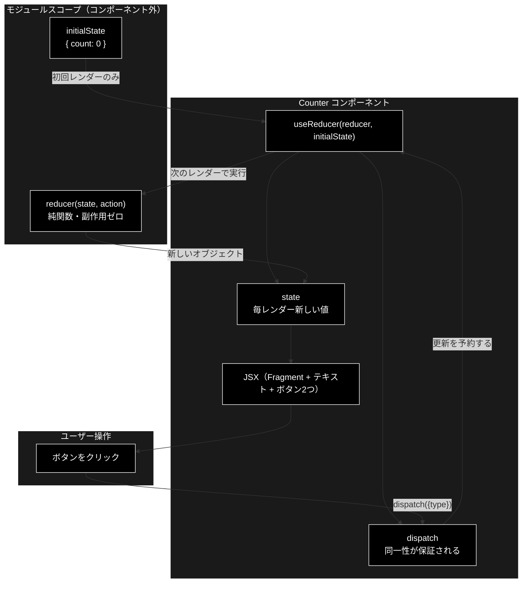
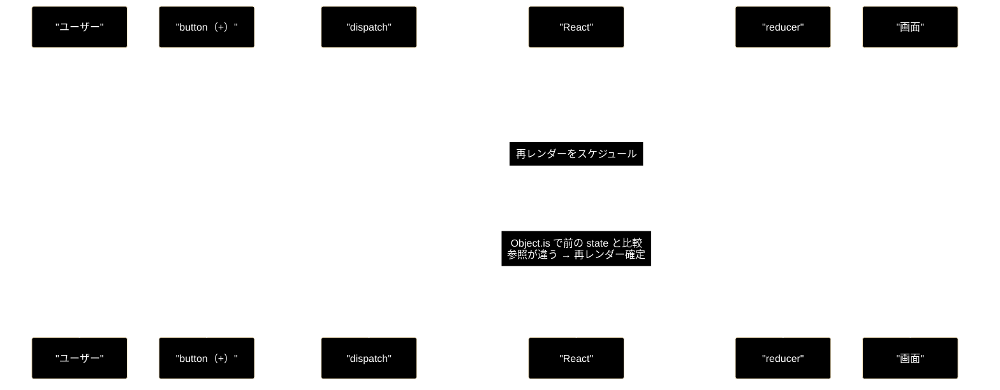

# React `useReducer` カウンタ — 全行注釈つき解説

**Version 1.0** | 最終更新: 2026-08-10

> **Claude Opus 5 による回答ログ。** 「コードに解説を入れる」形式を取り、
> 全行にインラインコメントを付けた注釈版を示したうえで、ブロックごとに掘り下げる。
>
> 同じコードについて Claude Sonnet 5 が答えたログは
> [`react_sonnet5.md`](./react_sonnet5.md) にある（Q1 が本書と同じ設問）。
> **モデルごとの回答を並べて比較するためのディレクトリ**なので、
> 本書に他モデルの回答を混ぜないこと。

---

## 目次

1. [対象コードと 2 つの致命的エラー](#1-対象コードと-2-つの致命的エラー)
2. [全行注釈つきコード](#2-全行注釈つきコード)
3. [ブロック1 初期状態 1行ずつ](#3-ブロック1-初期状態-1行ずつ)
4. [ブロック2 reducer 1行ずつ](#4-ブロック2-reducer-1行ずつ)
5. [ブロック3 Counter 1行ずつ](#5-ブロック3-counter-1行ずつ)
6. [実行トレース](#6-実行トレース)
7. [図解](#7-図解)
8. [つまずきやすい 7 点](#8-つまずきやすい-7-点)
9. [まとめ](#9-まとめ)

---

## 1. 対象コードと 2 つの致命的エラー

### 1.1 提示されたコード（原文ママ）

```jsx
const initialState = { count: 0 };

const reducer = (state, action) => {
  switch (action.type) {
    case 'increment':
      return {count: state.count + 1};
    case 'decrement':
      return {count: state.count - 1};
    default:
      throw new Error();
  }
}

const Counter => () {
  const [state, dispatch] = useReducer(reducer, initialState);
  return (
    <>
      Count: {state.count}
      <button onClick={() => dispatch({type: 'decrement'})}>-</button>
      <button onClick={() => dispatch({type: 'increment'})}>+</button>
    </>
  );
}
```

### 1.2 このコードは実行できない

解説に入る前に確定させる。**設計の考え方は正しいが、構文が壊れている。**

| # | 行 | 症状 | 修正 |
|---|---|---|---|
| **1** | `const Counter => () {` | `SyntaxError` — **パースに失敗**しファイル全体が読み込めない | `const Counter = () => {` |
| **2** | （冒頭） | `ReferenceError: useReducer is not defined` | `import { useReducer } from 'react';` を追加 |

#### エラー1 の詳細

アロー関数の形は **`(引数) => { 本体 }`** である。`Counter` は引数ではなく**代入先の変数名**なので、
`変数名 = (引数) => { 本体 }` の順でなければならない。

```jsx
const Counter => () { ... }     // ❌ = が無い / => と () が逆順
const Counter = () => { ... }   // ✅
function Counter() { ... }      // ✅ これでも等価に動く
```

#### エラー2 の詳細

React 17 以降、**JSX を書くだけなら `import React` は不要**になった（新しい JSX Transform）。
しかし**フックは別**で、使うものを名前付きで import する必要がある。

以降の解説はこの 2 点を修正したものを対象とする。

---

## 2. 全行注釈つきコード

**すべての行にコメントを入れた版。** ここだけ読めば全体像がつかめる。

```jsx
// ───────────────────────────────────────────────────────────────
// import: useReducer フックを React から取り込む。
//         これが無いと ReferenceError。JSX 自体は import 不要（React 17+）。
// ───────────────────────────────────────────────────────────────
import { useReducer } from 'react';


// ═══ ブロック① 初期状態 ═══════════════════════════════════════
// 状態の初期値。コンポーネントの「外」に置くのが要点。
// 内側に書くとレンダーのたびに新しいオブジェクトが作られて無駄になる。
const initialState = { count: 0 };
//                     ^^^^^^^^ オブジェクトにしておくと、後から項目を
//                              増やしても useReducer の使い方が変わらない


// ═══ ブロック② reducer ════════════════════════════════════════
// 「今の状態」と「やりたいこと」を受け取り、「次の状態」を返すだけの純関数。
// React も DOM も知らないので、単体テストがそのまま書ける。
const reducer = (state, action) => {
//               ^^^^^  ^^^^^^ 第2引数 = dispatch() に渡したオブジェクト
//               ^^^^^ 第1引数 = 現在の状態（初回は initialState）

  switch (action.type) {
//        ^^^^^^^^^^^ 何をするかの識別子。`type` は Redux 由来の慣習で、
//                    React が強制するものではない（数値でも文字列でも動く）

    case 'increment':
      return { count: state.count + 1 };
//           ^^^^^^^^^^^^^^^^^^^^^^^^^^ ★最重要★ 新しいオブジェクトを返す。
//                                      state.count++ のような書き換えは禁止。
//                                      React は参照比較で変化を判定するため、
//                                      中身を書き換えても気づいてもらえない。

    case 'decrement':
      return { count: state.count - 1 };
//                                  ^^^ 増加側と対称。1 ずつ減らす

    default:
      throw new Error();
//    ^^^^^^^^^^^^^^^^^ 知らない type が来たときに気づけるようにする。
//                      ただしメッセージが空なので「何が不正だったか」が
//                      分からない → new Error('未知の type: ' + action.type) が良い。
//                      さらにこの throw が飛ぶのは dispatch した瞬間ではなく
//                      「次のレンダー中」である点に注意（§8 の⑥）。
  }
};
// ^ 関数式なので末尾のセミコロンを付けるのが作法（無くても ASI が補う）


// ═══ ブロック③ Counter コンポーネント ═════════════════════════
// props を受け取らず、JSX を返すだけの関数。これが React コンポーネント。
const Counter = () => {
//    ^^^^^^^ ★先頭は必ず大文字★ 小文字だと JSX が「未知の HTML タグ」と
//            解釈し、エラーも出さずに何も描画されない

  const [state, dispatch] = useReducer(reducer, initialState);
//      ^^^^^^^^^^^^^^^^^ 配列の分割代入。返り値は必ず [状態, 送信関数] の2要素
//       ^^^^^ 現在の状態。レンダーごとに新しい値になる
//              ^^^^^^^^ reducer に指示を送る関数。
//                       ★再レンダーをまたいで同一性が保証される★ ので、
//                       useEffect の依存配列に入れても無限ループにならない
//                                    ^^^^^^^  ^^^^^^^^^^^^
//                                    reducer  初期値（初回しか見られない）

  return (
//       ^ 改行して JSX を書くための括弧。無いと ASI が return の直後で
//         文を切ってしまい undefined が返る（有名な落とし穴）

    <>
//  ^^ Fragment の短縮記法。コンポーネントは単一ルートを返す必要があるが、
//     ここでは「テキスト + ボタン + ボタン」の3つを並べたい。
//     <div> と違い DOM には何も出力されないので Flex/Grid を壊さない

      Count: {state.count}
//    ^^^^^^ JSX のテキスト。そのまま描画される
//           ^^^^^^^^^^^^^ {} の中は JavaScript の「式」として評価される。
//                         式なので if 文や for 文は書けない（三項演算子を使う）

      <button onClick={() => dispatch({type: 'decrement'})}>-</button>
//                    ^^^^^^ ★アロー関数で包むのが必須★
//                    包まないとレンダー時に即実行され、無限ループになる。
//                    onClick に渡すのは「関数そのもの」であって
//                    「関数の実行結果」ではない
//                           ^^^^^^^^^^^^^^^^^^^^^^^^^^^^ クリック時にこれが走る

      <button onClick={() => dispatch({type: 'increment'})}>+</button>
//                                                          ^ ラベルが記号だけなので
//                                                            aria-label が望ましい
    </>
  );
};
```

---

## 3. ブロック1 初期状態 1行ずつ

```jsx
const initialState = { count: 0 };
```

| 行 | コード | 解説 |
|---:|---|---|
| 1 | `const initialState = { count: 0 };` | 状態の初期値。`count` を `0` で始める |

### 3行に分けて読む

| 部分 | 意味 |
|---|---|
| `const` | 再代入しない。この変数は最初に決めた形から変わらない |
| `initialState` | 名前。`useReducer` の第 2 引数へそのまま渡す |
| `{ count: 0 }` | 状態の中身。**オブジェクト**にしている |

### なぜ `0` ではなくオブジェクトなのか

```jsx
const initialState = 0;              // これでも動く
const initialState = { count: 0 };   // こちらを選んでいる
```

**後から項目を増やしても、周りのコードの形が変わらないから。**

```jsx
// 増減幅と履歴を足したくなった場合 —— useReducer の呼び出しは一切変えなくてよい
const initialState = { count: 0, step: 1, history: [] };
```

数値のままだと、項目が 2 つになった時点で `useReducer` の使い方から
reducer の戻り値の形まで全部書き換えになる。

### なぜコンポーネントの外に置くのか

| 置き場所 | 挙動 |
|---|---|
| **外**（この例） | オブジェクトは 1 回だけ作られる。テストから import もできる |
| 内 | レンダーのたびに新しいオブジェクトが作られる。動作は変わらないが無駄 |

---

## 4. ブロック2 reducer 1行ずつ

```jsx
const reducer = (state, action) => {
  switch (action.type) {
    case 'increment':
      return { count: state.count + 1 };
    case 'decrement':
      return { count: state.count - 1 };
    default:
      throw new Error();
  }
};
```

| 行 | コード | 解説 |
|---:|---|---|
| 1 | `const reducer = (state, action) => {` | **`(今の状態, やりたいこと) → 次の状態`** の関数。reducer の定義はこれに尽きる |
| 2 | `switch (action.type) {` | `action.type` の値で分岐する。`type` は慣習であり React の要求ではない |
| 3 | `case 'increment':` | `dispatch({type: 'increment'})` されたとき |
| 4 | `return { count: state.count + 1 };` | **新しいオブジェクト**を返す。`state` には触らない |
| 5 | `case 'decrement':` | `dispatch({type: 'decrement'})` されたとき |
| 6 | `return { count: state.count - 1 };` | 同じく新しいオブジェクトを返す |
| 7 | `default:` | 上のどれにも当てはまらないとき |
| 8 | `throw new Error();` | 例外を投げる。メッセージが空なのが難点 |
| 9 | `}` | `switch` を閉じる |
| 10 | `};` | 関数式を閉じる |

### 4.1 なぜ「純関数」でなければならないか

reducer には 3 つの制約がある。**React はこれを前提に最適化している。**

| 制約 | 具体的に禁止されること | 破ったときの症状 |
|---|---|---|
| 引数を書き換えない | `state.count++`, `state.list.push(x)` | **画面が更新されない** |
| 同じ入力なら同じ出力 | `Math.random()`, `Date.now()`, 外部変数の参照 | 開発と本番で挙動が変わる |
| 副作用を持たない | `fetch()`, DOM 操作, `localStorage` 書き込み | 実行回数が保証されず、二重送信などが起きる |

#### 「書き換えない」が最重要な理由

```jsx
// ❌ 画面が更新されない
case 'increment':
  state.count = state.count + 1;   // 中身を書き換えた
  return state;                     // 同じオブジェクトを返している

// ✅ 更新される
case 'increment':
  return { count: state.count + 1 };  // 別のオブジェクト
```

React は状態が変わったかを **`Object.is` による参照比較**で判定する。
中身をいくら書き換えても参照は同じままなので、React は「何も変わっていない」と判断して
再レンダーを省略してしまう。

#### StrictMode では 2 回呼ばれる

開発時に `<StrictMode>` で囲むと、React は **reducer をわざと 2 回呼ぶ**。
純粋でない reducer を炙り出すための検査である。
2 回呼んで結果が同じなら純粋、変わるなら不純、という理屈になっている。

**本番ビルドでは 1 回。** 性能上の心配は不要。

### 4.2 `{ count: ... }` に潜む罠

この例は `count` しか無いので問題にならないが、**項目が増えた瞬間にバグになる。**

```jsx
const initialState = { count: 0, step: 5 };

case 'increment':
  return { count: state.count + 1 };          // ❌ step が消滅する
  return { ...state, count: state.count + 1 }; // ✅ 残りを引き継ぐ
```

`...state`（スプレッド構文）は「state の全項目をここに展開する」という意味で、
そのあとに書いた `count` が上書きする。**先に `...state`、あとに変更したい項目**の順である。

### 4.3 `default: throw` の是非

**気づけるという点では正しい。ただし代償がある。**

| 観点 | `throw new Error()` | `return state`（無視して進む） |
|---|---|---|
| ミスへの気づきやすさ | ✅ 必ずクラッシュするので確実 | ❌ 静かに無視され追跡が困難 |
| 本番での影響 | ❌ **画面が真っ白になる** | ✅ 動き続ける |
| 学習用途 | ✅ 適している | △ ミスに気づけない |

#### throw がどこで飛ぶかに注意

**`dispatch()` を呼んだその場では飛ばない。**
React はカスタム reducer の場合、更新を予約するだけで、
**reducer を実際に走らせるのは次のレンダーのとき**である。

```jsx
try {
  dispatch({ type: 'typo' });   // ここでは何も起きない
} catch (e) {
  // ❌ ここには到達しない
}
```

例外は**レンダー中**に発生するため、Error Boundary を置いていなければ
React はそのツリーごとアンマウントする＝画面が消える。

> 📌 **本リポジトリ（grace_v2）は `return state` を選んでいる。**
> `frontend/src/state/jobReducer.ts` / `dataReducer.ts` を参照。
> バックエンドが送る SSE イベント種別は今後増えうるため、
> **知らない種別 1 つで実行中のジョブ画面ごと落とすのは割に合わない**という判断である。
> どちらが正解ということはなく、アプリの性格で決まる設計判断。

---

## 5. ブロック3 Counter 1行ずつ

```jsx
const Counter = () => {
  const [state, dispatch] = useReducer(reducer, initialState);
  return (
    <>
      Count: {state.count}
      <button onClick={() => dispatch({type: 'decrement'})}>-</button>
      <button onClick={() => dispatch({type: 'increment'})}>+</button>
    </>
  );
};
```

| 行 | コード | 解説 |
|---:|---|---|
| 1 | `const Counter = () => {` | コンポーネント定義。**先頭大文字が必須** |
| 2 | `const [state, dispatch] = useReducer(reducer, initialState);` | フック本体。**配列の分割代入**で 2 つを取り出す |
| 3 | `return (` | JSX を返す。`(` は改行のため（無いと `undefined` が返る） |
| 4 | `<>` | Fragment 開始。DOM には出力されない |
| 5 | `Count: {state.count}` | 固定文字列 + 式の評価結果 |
| 6 | `<button onClick={() => dispatch({type: 'decrement'})}>-</button>` | クリックで減算指示を送る |
| 7 | `<button onClick={() => dispatch({type: 'increment'})}>+</button>` | クリックで加算指示を送る |
| 8 | `</>` | Fragment 終了 |
| 9 | `);` | `return` を閉じる |
| 10 | `};` | コンポーネントを閉じる |

### 5.1 なぜ先頭が大文字か（1行目）

**JSX の変換規則で決まっている。**

```jsx
<counter />   // → React.createElement('counter', ...)   文字列 = HTMLタグ扱い
<Counter />   // → React.createElement(Counter, ...)     変数参照 = コンポーネント扱い
```

小文字にすると「`counter` という未知の HTML タグ」と解釈され、
**エラーも警告も出ないまま何も描画されない**。原因に気づきにくい典型例である。

### 5.2 `useReducer` の返り値（2行目）

```jsx
const [state, dispatch] = useReducer(reducer, initialState);
//     ~~~~~  ~~~~~~~~              ~~~~~~~  ~~~~~~~~~~~~
//       ①      ②                    ③          ④
```

| | 要素 | 何か | 性質 |
|---|---|---|---|
| ① | `state` | 現在の状態 | **レンダーごとに新しい値**になる |
| ② | `dispatch` | reducer に指示を送る関数 | **常に同じ関数オブジェクト**（同一性が保証される） |
| ③ | `reducer` | 状態遷移のルール | 毎回同じものを渡す |
| ④ | `initialState` | 初期値 | **初回レンダーのときしか見られない** |

#### ② の「同一性が保証される」意味

React は `dispatch` が再レンダーをまたいで**同一の関数である**ことを保証している。
そのため依存配列に入れても**無限ループにならない**。

```jsx
useEffect(() => {
  const id = setInterval(() => dispatch({ type: 'increment' }), 1000);
  return () => clearInterval(id);
}, [dispatch]);   // ✅ dispatch は変わらないので 1 回しか実行されない
```

逆に `state` は毎レンダー新しい値になるので、依存配列に入れれば毎回再実行される。

#### ④ の「初回しか見られない」意味

```jsx
// 2回目以降のレンダーでは initialState は完全に無視される。
// 状態をリセットしたければ reducer 側に reset ケースを作る。
case 'reset':
  return initialState;
```

### 5.3 `return (` の括弧（3行目）

**この括弧が無いとバグる。** JavaScript の ASI（自動セミコロン挿入）が
`return` の直後で文を切ってしまうためである。

```jsx
// ❌ undefined が返る
return
  <>...</>;

// ✅
return (
  <>...</>
);
```

### 5.4 Fragment `<>...</>`（4行目・8行目）

コンポーネントは**単一のルート要素**を返さなければならない。
しかしここでは 3 つの要素を並べたい。

| 書き方 | 結果 |
|---|---|
| 括らずに 3 つ並べる | ❌ 構文エラー |
| `<div>` で括る | △ 動くが**意味のない `<div>` が DOM に増える** |
| `<>...</>` で括る | ✅ DOM には何も出力されない |

親が Flexbox / Grid のとき、**余計な `<div>` が 1 枚挟まるだけでレイアウトが崩れる**。
Fragment はこれを避けるためにある。

> 📝 配列を `map` して `key` を付けたいときだけ短縮記法が使えず、
> `<React.Fragment key={id}>` と明示的に書く必要がある。

### 5.5 `{state.count}` の波括弧（5行目）

```jsx
Count: {state.count}
~~~~~~ ~~~~~~~~~~~~~
  ①         ②
```

| | 内容 |
|---|---|
| ① `Count: ` | JSX のテキスト。そのまま描画される |
| ② `{state.count}` | `{}` の中は **JavaScript の式**。評価結果が描画される |

**「式」であって「文」ではない**ので `if` 文や `for` 文は書けない。
条件分岐は三項演算子か `&&` を使う。

```jsx
{count > 0 && <span>プラス</span>}
{count > 0 ? 'プラス' : 'ゼロ以下'}
```

これが成り立つのは、**`null` / `undefined` / `false` が「何も描画されない」**という
JSX の規則があるためである。

> ⚠️ **`0` は描画される。** `{items.length && <List />}` は要素数 0 のとき
> `0` という文字が画面に出てしまう。`items.length > 0 && ...` と書くこと。

### 5.6 `onClick={() => dispatch(...)}`（6-7行目）

```jsx
onClick={() => dispatch({ type: 'decrement' })}
        ~~~~~~
     アロー関数で包む（必須）
```

**包まないと壊れる。**

```jsx
// ❌ レンダー時に dispatch が即実行される → 状態更新 → 再レンダー → …（無限ループ）
onClick={dispatch({ type: 'decrement' })}

// ✅ クリック時に実行される「関数」を渡している
onClick={() => dispatch({ type: 'decrement' })}
```

`onClick` が求めているのは「**関数そのもの**」であって「関数の実行結果」ではない。
`dispatch(...)` と書いた時点でそれは「実行して結果を得る式」になってしまう。

#### 引数が要らない場合は包まなくてよい

```jsx
onClick={handleClick}          // ✅ 関数を渡すだけなら包む必要はない
onClick={() => handleClick()}  // 冗長（動作は同じ）
```

#### 毎回新しい関数が作られる件

このアロー関数はレンダーのたびに生成される。
「`useCallback` すべきか」という議論があるが、**この規模では不要**。

| 渡す先 | 判断 |
|---|---|
| 素の `<button>` | メモ化不要。生成コストは無視できる |
| `React.memo` した子コンポーネント | 検討する（新しい関数が毎回渡ると memo が無効化される） |

### 5.7 action オブジェクトの形

```jsx
dispatch({ type: 'decrement' })
```

`{ type: ... }` は **Redux 由来の慣習**であり React の強制ではない。
`dispatch(1)` でも `dispatch('dec')` でも動作する。
慣習に従うと、追加情報を載せるときの形が自然に決まる。

```jsx
dispatch({ type: 'increment', payload: 10 });
// reducer 側
case 'increment':
  return { count: state.count + action.payload };
```

---

## 6. 実行トレース

**「+」「+」「-」の順にクリックしたとき**、何が・どの順で・何回起きるかを表で追う。

| # | 出来事 | `state` | reducer 呼び出し | 画面 |
|---:|---|---|---|---|
| 0 | 初回レンダー | `{count: 0}` | **呼ばれない**（初期値をそのまま使う） | `Count: 0` |
| 1 | 「+」クリック → `dispatch({type:'increment'})` | `{count: 0}` | まだ呼ばれない（**更新を予約しただけ**） | `Count: 0` |
| 2 | React が再レンダーを実行 | — | `reducer({count:0}, {type:'increment'})` → `{count:1}` | — |
| 3 | 参照比較 → 変化あり → 描画 | `{count: 1}` | — | `Count: 1` |
| 4 | 「+」クリック | `{count: 1}` | 予約のみ | `Count: 1` |
| 5 | 再レンダー | — | `reducer({count:1}, {type:'increment'})` → `{count:2}` | `Count: 2` |
| 6 | 「-」クリック | `{count: 2}` | 予約のみ | `Count: 2` |
| 7 | 再レンダー | — | `reducer({count:2}, {type:'decrement'})` → `{count:1}` | `Count: 1` |

### ここから読み取れること

| # | 事実 |
|---|---|
| 1 | **初回レンダーで reducer は呼ばれない。** 初期値がそのまま使われる |
| 2 | **`dispatch` した瞬間には reducer は動かない。** 予約されるだけ |
| 3 | reducer が呼ばれるのは**再レンダーのとき**。だから `throw` もそこで飛ぶ |
| 4 | 毎回**新しいオブジェクト**が返るので参照が変わり、React が変化を検出できる |

---

## 7. 図解

### 7.1 データの流れ



### 7.2 「+」を 1 回押したときの時系列



---

## 8. つまずきやすい 7 点

| # | 落とし穴 | 症状 | 対策 |
|---|---|---|---|
| ① | `const Counter => () {` | `SyntaxError` | `const Counter = () => {` |
| ② | `useReducer` の import 忘れ | `ReferenceError` | `import { useReducer } from 'react';` |
| ③ | コンポーネント名が小文字 | **エラーも出ず何も描画されない** | 先頭を大文字にする |
| ④ | `state` を直接書き換える | **画面が更新されない** | 必ず新しいオブジェクトを返す |
| ⑤ | `onClick={dispatch(...)}` | 無限ループ | `onClick={() => dispatch(...)}` |
| ⑥ | `try/catch` で reducer の例外を捕まえようとする | 捕まらない | 例外はレンダー中に飛ぶ。Error Boundary を使う |
| ⑦ | `return` の直後で改行 | `undefined` が返る | `return (` と括弧で囲む |

### ④ と ⑤ が特に厄介な理由

**どちらもエラーメッセージが出ない。**
④ は「押しても何も起きない」、⑤ は「ブラウザが固まる」という形で現れるため、
原因の見当がつきにくい。両方とも React の設計上の前提
（参照比較・関数を渡す）を理解していれば避けられる。

---

## 9. まとめ

### 9.1 3 つのブロックの役割

| ブロック | 役割 | 一言で |
|---|---|---|
| ① `initialState` | 状態の初期形を定義する | **どこから始まるか** |
| ② `reducer` | 状態の遷移ルールを定義する | **どう変わるか** |
| ③ `Counter` | 状態を表示し、変更を指示する | **どう見せ、どう受け取るか** |

**この 3 分割こそが `useReducer` の要点である。**
「状態の形」「変わり方」「見せ方」が別々のところに書いてあるので、
reducer だけを React 抜きでテストできる。

### 9.2 覚えるべき 10 点

| # | 要点 |
|---|---|
| 1 | 提示コードは **`const Counter => () {` が構文エラー**。正しくは `const Counter = () => {` |
| 2 | **`useReducer` の import が無い**。JSX は import 不要だがフックは必要 |
| 3 | reducer は **`(今の状態, やりたいこと) → 次の状態`** の純関数。これがすべて |
| 4 | **状態を書き換えず、必ず新しいオブジェクトを返す。** React は参照比較で判定する |
| 5 | 状態が増えたら `{ ...state, 変更分 }` の形にする。取りこぼしを防ぐ |
| 6 | `dispatch` は**同一性が保証される**。`state` は毎回変わる |
| 7 | **`dispatch` した瞬間に reducer は動かない。** 実行は次のレンダー |
| 8 | `<>...</>` は Fragment。余計な `<div>` を作らない |
| 9 | `onClick` には**関数そのもの**を渡す。`() =>` で包むのは必須 |
| 10 | このカウンタなら `useState` で十分。`useReducer` の利点は**集約とテスト容易性** |

### 9.3 本リポジトリでの実例

grace_v2 のフロントエンドは、このパターンを 4 か所で使っている。

| 呼び出し箇所 | reducer | 畳み込む対象 |
|---|---|---|
| `components/SupportPanel.tsx:38` | `state/jobReducer.ts` | GRACE-Support の SSE イベント列 |
| `components/ReviewPanel.tsx:24` | `state/reviewReducer.ts` | GRACE-Review の SSE イベント列 |
| `components/DataJobPanel.tsx:76` | `state/dataReducer.ts` | データ処理ジョブの SSE イベント列 |
| `components/CollectionPanel.tsx:42` | `state/dataReducer.ts` | コレクション削除ジョブ |

いずれも「サーバから次々届くイベントを状態へ畳み込む」用途であり、
**更新の種類が多く、reducer に集約する価値がある**ケースである。
解説例のカウンタとの違いは規模だけで、構造はまったく同じ。

なお `DataJobPanel.tsx:76` だけは**3 引数の遅延初期化**を使っている。

```tsx
const [state, dispatch] = useReducer(dataReducer, kind, initialDataState);
//                                                ^^^^  ^^^^^^^^^^^^^^^^
//                                                引数   初期値を作る関数
```

ジョブ種別（`chunking` / `register` / `delete`）によって初期のステップ構成が変わるため、
**固定のオブジェクトでは初期値を表せない**からである。

---

## 参考

| 対象 | 場所 |
|---|---|
| 同じ設問への Claude Sonnet 5 の回答ログ | [`react_sonnet5.md`](./react_sonnet5.md) の Q1 |
| 本リポジトリの reducer 実装 | `frontend/src/state/jobReducer.ts`, `reviewReducer.ts`, `dataReducer.ts` |
| reducer の単体テスト（純関数なので描画不要） | `frontend/src/state/jobReducer.test.ts` ほか |
| コンポーネント側の使用例 | `frontend/src/components/SupportPanel.tsx`, `DataJobPanel.tsx` |
| フロントエンド全体の設計 | `frontend/docs/App.md`, `frontend/docs/review_ui.md` |

---

## 変更履歴

| 版 | 日付 | 変更内容 |
|---|---|---|
| 1.0 | 2026-08-10 | 初版作成。全行インライン注釈版、ブロック別の1行解説、実行トレース、つまずきやすい7点、本リポジトリの実装（4か所）との対応を記載 |
