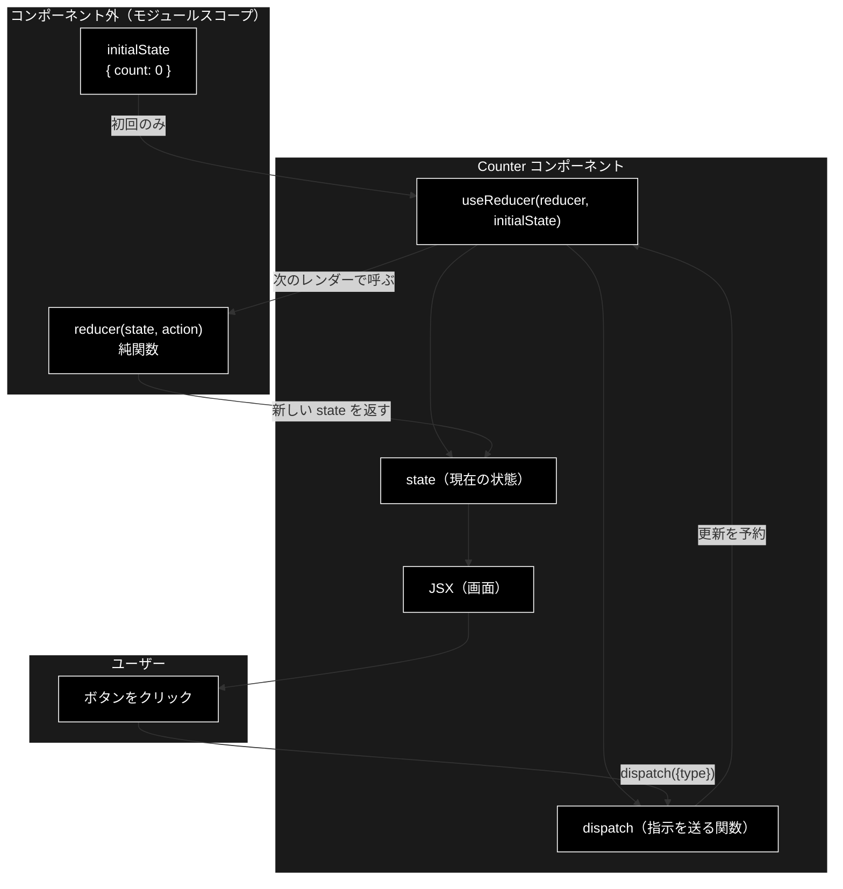
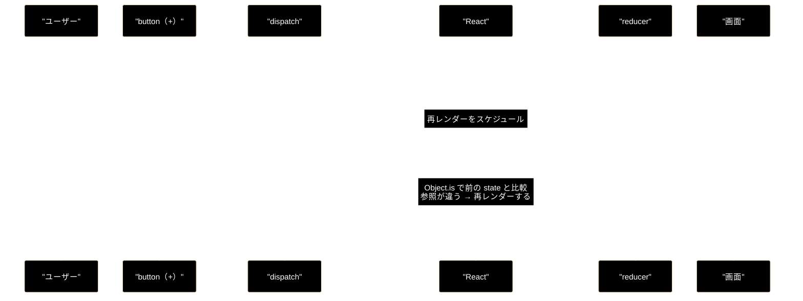

# React `useReducer` カウンタ — ブロック別・1行ずつの解説

**Version 1.0** | 最終更新: 2026-08-10

---

## 目次

1. [解説対象のコード](#1-解説対象のコード)
2. [まず このコードはそのままでは動かない](#2-まず-このコードはそのままでは動かない)
3. [ブロック1 初期状態](#3-ブロック1-初期状態)
4. [ブロック2 reducer](#4-ブロック2-reducer)
5. [ブロック3 Counter コンポーネント](#5-ブロック3-counter-コンポーネント)
6. [動作の流れ](#6-動作の流れ)
7. [useState との使い分け](#7-usestate-との使い分け)
8. [本リポジトリでの実例](#8-本リポジトリでの実例)
9. [実務向けに直すなら](#9-実務向けに直すなら)
10. [まとめ](#10-まとめ)

---

## 1. 解説対象のコード

質問で提示された原文をそのまま引用する。

```jsx
const initialState = { count: 0 };

const reducer = (state, action) => {
  switch (action.type) {
    case 'increment':
      return {count: state.count + 1};
    case 'decrement':
      return {count: state.count - 1};
    default:
      throw new Error();
  }
}

const Counter => () {
  const [state, dispatch] = useReducer(reducer, initialState);
  return (
    <>
      Count: {state.count}
      <button onClick={() => dispatch({type: 'decrement'})}>-</button>
      <button onClick={() => dispatch({type: 'increment'})}>+</button>
    </>
  );
}
```

これは React 公式ドキュメントの `useReducer` 解説に載っていたカウンタ例が元になっている。
**設計意図は正しいが、写し取る過程で構文が壊れている。**

---

## 2. まず このコードはそのままでは動かない

解説の前に、**実行以前に失敗する箇所**を確定させておく。ここを直さずに
「1行ずつの意味」だけ読んでも、動かした瞬間に詰まる。

| # | 箇所 | 種別 | 何が起きるか |
|---|---|---|---|
| **1** | `const Counter => () {` | **構文エラー**（致命的） | パース時点で `SyntaxError`。ファイル全体が読み込まれない |
| **2** | `useReducer` の import が無い | **参照エラー**（致命的） | `ReferenceError: useReducer is not defined` |
| 3 | `throw new Error()` にメッセージが無い | 設計上の難点 | 例外は飛ぶが「何の action が不正だったか」が分からない |
| 4 | 関数式の末尾に `;` が無い | スタイル | ASI が補うので動作はする。Prettier/ESLint は付ける |

### 2.1 問題1: アロー関数の記法が壊れている

```jsx
const Counter => () {        // ❌ = が無く、=> と () の順序が逆
const Counter = () => {      // ✅ 正しい
```

アロー関数は **`引数リスト => 本体`** の順である。`Counter` は変数名であって引数ではないので、
`変数名 = (引数リスト) => { 本体 }` としなければならない。

> 📝 なお `function Counter() { ... }` と書いても等価に動く。React コンポーネントは
> 「props を受け取って JSX を返す関数」であればよく、アロー関数である必然性は無い。

### 2.2 問題2: フックの import が無い

```jsx
import { useReducer } from 'react';   // ← これが必要
```

`useReducer` は React が提供するフックであり、グローバル変数ではない。

> React 17 以降、**JSX を書くだけなら `import React from 'react'` は不要**になった
> （新しい JSX Transform）。ただし**フックは別**で、使うものを個別に import する。

### 2.3 修正版（以降の解説はこれを対象とする）

```jsx
import { useReducer } from 'react';

const initialState = { count: 0 };

const reducer = (state, action) => {
  switch (action.type) {
    case 'increment':
      return { count: state.count + 1 };
    case 'decrement':
      return { count: state.count - 1 };
    default:
      throw new Error(`未知の action.type: ${action.type}`);
  }
};

const Counter = () => {
  const [state, dispatch] = useReducer(reducer, initialState);
  return (
    <>
      Count: {state.count}
      <button onClick={() => dispatch({ type: 'decrement' })}>-</button>
      <button onClick={() => dispatch({ type: 'increment' })}>+</button>
    </>
  );
};
```

---

## 3. ブロック1 初期状態

```jsx
const initialState = { count: 0 };
```

| 行 | コード | 解説 |
|---:|---|---|
| 1 | `const initialState = { count: 0 };` | 状態の**初期値**をオブジェクトで定義する。`count` というキーが 1 つだけの単純な形 |

### なぜオブジェクトなのか

`0` という数値をそのまま初期値にすることもできる。オブジェクトにしておく利点は
**後から項目を増やしても呼び出し側の形が変わらない**ことである。

```jsx
// 後から step（増減幅）や history を足しても、useReducer の使い方は変わらない
const initialState = { count: 0, step: 1, history: [] };
```

### なぜコンポーネントの外に置くのか

**再レンダーのたびに新しいオブジェクトを作らないため。** コンポーネントの内側に書くと、
レンダーごとに別のオブジェクトが生成される。`useReducer` は初回しか初期値を見ないので
動作自体は変わらないが、無駄な生成が毎回走る。

さらに実務上は「**この状態の初期形はこれ**」という定義が 1 か所にまとまり、
テストからも import できるという効き目が大きい。

---

## 4. ブロック2 reducer

```jsx
const reducer = (state, action) => {
  switch (action.type) {
    case 'increment':
      return { count: state.count + 1 };
    case 'decrement':
      return { count: state.count - 1 };
    default:
      throw new Error(`未知の action.type: ${action.type}`);
  }
};
```

### 4.1 1行ずつ

| 行 | コード | 解説 |
|---:|---|---|
| 1 | `const reducer = (state, action) => {` | **現在の状態**と**やりたいこと**の 2 つを受け取り、**次の状態**を返す関数。この 2 引数 1 戻り値がすべて |
| 2 | `switch (action.type) {` | `action` の `type` フィールドで処理を振り分ける。`type` は慣習であり React が強制するものではない |
| 3 | `case 'increment':` | 「1 増やす」指示のとき |
| 4 | `return { count: state.count + 1 };` | **新しいオブジェクト**を作って返す。`state` 自体は書き換えない（後述） |
| 5 | `case 'decrement':` | 「1 減らす」指示のとき |
| 6 | `return { count: state.count - 1 };` | 同じく新しいオブジェクトを返す |
| 7 | `default:` | 知らない `type` が来たとき |
| 8 | `throw new Error(...)` | 例外を投げて気づけるようにする |
| 9-10 | `} };` | `switch` と関数を閉じる |

### 4.2 最重要ルール: reducer は純関数でなければならない

reducer が守るべき制約は 3 つある。**React はこれを前提に最適化している。**

| 制約 | 意味 | 破るとどうなるか |
|---|---|---|
| **引数を書き換えない** | `state.count++` は禁止 | 変更が画面に反映されない。React は同一参照を「変化なし」と判断して再レンダーを省く |
| **同じ入力なら同じ出力** | 乱数・現在時刻・グローバル変数を読まない | 開発時と本番で挙動が変わる。デバッグが極めて困難になる |
| **副作用を持たない** | API 呼び出し・DOM 操作・`console.log` 以外の外部への働きかけをしない | 呼ばれる回数・タイミングは React の裁量なので、副作用の回数が保証されない |

#### 「書き換えない」が特に重要な理由

```jsx
// ❌ 動かない — 同じオブジェクトを返しているので React は「変化なし」と判断する
case 'increment':
  state.count = state.count + 1;
  return state;

// ✅ 正しい — 新しいオブジェクトなので参照が変わり、再レンダーされる
case 'increment':
  return { count: state.count + 1 };
```

React は状態が変わったかどうかを **`Object.is` による参照比較**で判定する。
中身を書き換えても参照は同じままなので、変化に気づいてもらえない。

#### StrictMode では reducer が 2 回呼ばれる

開発時に `<StrictMode>` で囲むと、React は **reducer をわざと 2 回呼ぶ**。
純粋でない reducer（乱数を使う、外部変数を書き換える等）をその場で炙り出すためである。
2 回呼ばれても結果が同じなら純粋、変わるなら不純、という検査になっている。

**本番ビルドでは 1 回しか呼ばれない**ので、性能上の心配は不要。

### 4.3 状態の引き継ぎ漏れという落とし穴

このコードは `count` しか持たないので問題にならないが、**状態が増えた瞬間にバグになる**。

```jsx
const initialState = { count: 0, step: 1 };

// ❌ step が消える（返したオブジェクトに step が無い）
return { count: state.count + 1 };

// ✅ 残りをすべて引き継ぐ
return { ...state, count: state.count + state.step };
```

本リポジトリの reducer が例外なく `{ ...state, ... }` の形で書かれているのはこのためである。

### 4.4 default で throw するのは妥当か

**気づけるという点では正しいが、副作用が大きい。** 判断材料を挙げる。

| 観点 | `throw new Error()` | `return state`（何もしない） |
|---|---|---|
| 実装ミスへの気づきやすさ | ✅ 即座にクラッシュするので必ず気づく | ❌ 静かに無視され、原因追跡が難しい |
| 本番での影響 | ❌ **画面全体が落ちる**（後述） | ✅ 動き続ける |
| TypeScript との相性 | ✅ 網羅性チェックと組み合わせやすい | ⚠️ 別途 `never` チェックが要る |

#### 例外がどこで飛ぶかに注意

**`dispatch()` を呼んだその場では例外は飛ばない。** React はカスタム reducer の場合、
更新を予約するだけで、**reducer を実際に実行するのは次のレンダーのとき**である。

```jsx
try {
  dispatch({ type: 'typo' });   // ここでは何も起きない
} catch (e) {
  // ❌ ここには来ない
}
```

結果として例外は**レンダー中**に発生する。Error Boundary で捕まえなければ、
React はそのツリーごとアンマウントする＝**画面が真っ白になる**。

そのため本リポジトリの reducer は `default: return state` を採っている
（`frontend/src/state/jobReducer.ts`・`dataReducer.ts`）。
**SSE で届くイベント種別はバックエンドの都合で増えうるため、
知らない種別 1 つで実行中のジョブ画面ごと落とすのは割に合わない**、という判断である。

> ⚠️ どちらが正解ということはない。**「知らない入力が来たら止めるべきか、無視して進むべきか」**
> という、アプリの性格に依存する設計判断である。学習用のカウンタなら `throw` でよい。

---

## 5. ブロック3 Counter コンポーネント

```jsx
const Counter = () => {
  const [state, dispatch] = useReducer(reducer, initialState);
  return (
    <>
      Count: {state.count}
      <button onClick={() => dispatch({ type: 'decrement' })}>-</button>
      <button onClick={() => dispatch({ type: 'increment' })}>+</button>
    </>
  );
};
```

### 5.1 1行ずつ

| 行 | コード | 解説 |
|---:|---|---|
| 1 | `const Counter = () => {` | コンポーネントの定義。**先頭が大文字**であることが必須（後述） |
| 2 | `const [state, dispatch] = useReducer(reducer, initialState);` | フック本体。**配列の分割代入**で 2 つを受け取る |
| 3 | `return (` | JSX を返す。`(` は改行して書くための括弧 |
| 4 | `<>` | **Fragment** の短縮記法。余計な `<div>` を作らずに複数要素を並べる |
| 5 | `Count: {state.count}` | `Count: ` はそのままの文字列。`{}` の中は JavaScript 式として評価される |
| 6 | `<button onClick={() => dispatch({ type: 'decrement' })}>-</button>` | クリックで「1 減らす」を dispatch する |
| 7 | `<button onClick={() => dispatch({ type: 'increment' })}>+</button>` | クリックで「1 増やす」を dispatch する |
| 8 | `</>` | Fragment を閉じる |
| 9-10 | `); };` | `return` とコンポーネントを閉じる |

### 5.2 なぜ先頭が大文字なのか（1行目）

**JSX の変換規則がそう決まっているため。** 小文字で始まる名前は HTML タグ、
大文字で始まる名前はコンポーネントとして扱われる。

```jsx
<counter />   // → React.createElement('counter', ...)  文字列 = HTMLタグ扱い
<Counter />   // → React.createElement(Counter, ...)    変数参照 = コンポーネント扱い
```

小文字にすると「`counter` という未知の HTML タグ」として扱われ、**エラーも出ずに何も描画されない**。

### 5.3 `useReducer` の戻り値（2行目）

```jsx
const [state, dispatch] = useReducer(reducer, initialState);
//     ^^^^^  ^^^^^^^^              ^^^^^^^  ^^^^^^^^^^^^
//     現在の  指示を送る関数         reducer  初期値
//     状態
```

| 要素 | 何か | 性質 |
|---|---|---|
| `state` | 現在の状態。初回は `initialState` そのもの | レンダーごとに新しい値 |
| `dispatch` | reducer に指示を送る関数 | **同一性が保証される**（毎回同じ関数） |

#### `dispatch` の同一性が保証される意味

React は `dispatch` が再レンダーをまたいで**同じ関数オブジェクトである**ことを保証している。
そのため `useEffect` / `useCallback` の依存配列に入れても**無限ループにならない**。

```jsx
useEffect(() => {
  const timer = setInterval(() => dispatch({ type: 'increment' }), 1000);
  return () => clearInterval(timer);
}, [dispatch]);   // ✅ dispatch は変わらないので安全。省略もできるが明示してよい
```

これは `useState` の `setState` も同じ。**逆に `state` は毎回変わる**ので、依存配列に入れれば
毎回再実行される。

### 5.4 Fragment `<>...</>`（4行目・8行目）

コンポーネントは**単一のルート要素**を返さなければならない。しかしここでは
「テキスト + ボタン + ボタン」の 3 つを並べたい。

```jsx
// ❌ 構文エラー — 兄弟が 3 つ並んでいる
return (
  Count: {state.count}
  <button>-</button>
  <button>+</button>
);

// △ 動くが、意味のない <div> が DOM に増える
return (
  <div>
    Count: {state.count}
    ...
  </div>
);

// ✅ Fragment — DOM には何も出力されない
return (
  <>
    Count: {state.count}
    ...
  </>
);
```

`<>` は `<React.Fragment>` の短縮記法である。CSS の Flexbox / Grid を使うとき、
**不要な `<div>` が 1 枚挟まるだけでレイアウトが崩れる**ため、Fragment は実務上よく使う。

> 📝 `key` を付けたいとき（配列を map する場合）だけは短縮記法が使えず、
> `<React.Fragment key={id}>` と書く必要がある。

### 5.5 `{state.count}` の波括弧（5行目）

JSX の `{}` は「**ここから JavaScript の式**」という切り替え記号である。

```jsx
Count: {state.count}
//     ^^^^^^^^^^^^^ 式 → 評価結果が描画される
//^^^^^ ただの文字列 → そのまま描画される
```

**式**であって文ではないので、`if` 文や `for` 文は書けない（三項演算子や `&&` を使う）。

なお `null` / `undefined` / `false` は**何も描画されない**という規則があり、
条件付きレンダーの `{condition && <X />}` はこれを利用している。

### 5.6 `onClick={() => dispatch(...)}`（6-7行目）

```jsx
onClick={() => dispatch({ type: 'decrement' })}
//      ^^^^^^                                  アロー関数で包む
```

**包む理由**: 包まないとレンダー時に即座に実行されてしまう。

```jsx
// ❌ レンダーのたびに dispatch が実行される → 無限ループ
onClick={dispatch({ type: 'decrement' })}

// ✅ クリックされたときに実行される関数を渡している
onClick={() => dispatch({ type: 'decrement' })}
```

`onClick` に渡すべきは「**関数そのもの**」であって「関数の実行結果」ではない。

#### 毎回新しい関数が作られることについて

このアロー関数はレンダーのたびに新しく生成される。
「`useCallback` でメモ化すべきか」という論点があるが、**この規模では不要**である。

| 状況 | 判断 |
|---|---|
| 素の `<button>` に渡す | メモ化不要。関数生成のコストは無視できる |
| `React.memo` した子に渡す | メモ化を検討（新しい関数が毎回渡ると memo が無効化される） |

### 5.7 action オブジェクトの形

```jsx
dispatch({ type: 'decrement' })
```

`{ type: ... }` という形は **Redux 由来の慣習**であり、React の強制ではない。
`dispatch(1)` でも `dispatch('inc')` でも動く。ただし慣習に従う利点は大きい。

追加の情報を載せるときは `payload` を足すのが一般的である。

```jsx
dispatch({ type: 'increment', payload: 5 });
// reducer 側
case 'increment':
  return { count: state.count + action.payload };
```

---

## 6. 動作の流れ

### 6.1 全体像



### 6.2 「+」を 1 回押したときの順序



**押さえるべき点は 2 つ。**

1. **`dispatch` した時点では reducer は動かない。** 更新が予約されるだけで、
   実際の計算は次のレンダーのときに行われる
2. **比較は参照で行われる。** `reducer` が新しいオブジェクトを返すからこそ
   React は「変わった」と判断できる

---

## 7. useState との使い分け

このカウンタは `useState` でも書ける。**むしろ短い。**

```jsx
const Counter = () => {
  const [count, setCount] = useState(0);
  return (
    <>
      Count: {count}
      <button onClick={() => setCount(count - 1)}>-</button>
      <button onClick={() => setCount(count + 1)}>+</button>
    </>
  );
};
```

**では `useReducer` は何のためにあるのか。** 判断基準は次のとおり。

| 観点 | `useState` | `useReducer` |
|---|---|---|
| 状態の個数 | 1〜2 個の独立した値 | 複数の値が**連動して**変わる |
| 更新ロジックの置き場所 | 各 `onClick` に散らばる | reducer に**集約**される |
| テスト | コンポーネントを描画しないと試せない | **reducer 単体でテストできる**（ただの純関数） |
| 更新の種類 | 少ない | 多い（`switch` の分岐が増える） |
| 前の状態への依存 | `setCount(c => c + 1)` で対応 | もともと `state` を受け取るので自然 |

> 📌 **実務での最大の利点は「テストできること」。** reducer は
> 「入力（state, action）→ 出力（新しい state）」の純関数なので、React も DOM も
> ブラウザも要らずに `expect(reducer(before, action)).toEqual(after)` で検証できる。

このカウンタ程度なら `useState` で十分である。**`useReducer` の学習例として書かれているだけ**で、
「カウンタには useReducer を使うべき」という主張ではない点に注意。

---

## 8. 本リポジトリでの実例

grace_v2 のフロントエンドは、この `useReducer` パターンを**4 か所**で使っている。

| 呼び出し箇所 | reducer | 何を畳み込むか |
|---|---|---|
| `components/SupportPanel.tsx:38` | `state/jobReducer.ts` | GRACE-Support の SSE イベント列 |
| `components/ReviewPanel.tsx:24` | `state/reviewReducer.ts` | GRACE-Review の SSE イベント列 |
| `components/DataJobPanel.tsx:76` | `state/dataReducer.ts` | データ処理ジョブの SSE イベント列 |
| `components/CollectionPanel.tsx:42` | `state/dataReducer.ts` | コレクション削除ジョブ |

### 8.1 解説例との違い

```tsx
// SupportPanel.tsx:38 — 解説例と同じ 2 引数の形
const [state, dispatch] = useReducer(jobReducer, initialJobState);

// DataJobPanel.tsx:76 — 3 引数の「遅延初期化」の形
const [state, dispatch] = useReducer(dataReducer, kind, initialDataState);
//                                                ^^^^  ^^^^^^^^^^^^^^^^
//                                                引数   初期値を作る関数
```

**3 引数の形**は `initialDataState(kind)` を呼んで初期値を作る。
`kind`（`'chunking'` / `'register'` / `'delete'`）によって初期のステップ構成が変わるため、
**固定のオブジェクトでは表せない**からである。

```ts
// dataReducer.ts:106
export function initialDataState(kind: DataJobKind = 'chunking'): DataJobState {
  return { jobId: null, kind, phase: 'idle', steps: emptySteps(kind), /* … */ };
}
```

この形は「**初期値の計算が重いとき**」にも使う。第 2 引数の形だと毎レンダーで
計算式が評価されてしまうが、3 引数の形なら初回にしか呼ばれない。

### 8.2 default の扱いが違う理由

| | 解説例 | 本リポジトリ |
|---|---|---|
| 未知の action | `throw new Error()` | `return state` |

[§4.4](#44-default-で-throw-するのは妥当か) のとおり、本リポジトリでは
**バックエンドが送る SSE イベント種別が今後増えうる**ため、知らない 1 種別で
実行中のジョブ画面ごと落とす選択を取っていない。

### 8.3 状態の引き継ぎ方

本リポジトリの reducer は例外なく `{ ...state, ... }` の形を取る。

```ts
// jobReducer.ts
case 'confirm_sent':
  return { ...state, intervention: null };
case 'failed':
  return { ...state, phase: 'failed', error: action.message };
```

`JobState` は 7 フィールドあるため、[§4.3](#43-状態の引き継ぎ漏れという落とし穴) の落とし穴を
踏まないようにこの形が必須になる。

---

## 9. 実務向けに直すなら

学習例としては元のコードで十分だが、本リポジトリの規約（TypeScript・アクセシビリティ）に
沿って書くとこうなる。

```tsx
import { useReducer } from 'react';

interface CounterState {
  count: number;
}

// action を「起こりうるものの合併」として定義する。
// これにより switch の網羅性を TypeScript が検査してくれる。
type CounterAction =
  | { type: 'increment' }
  | { type: 'decrement' }
  | { type: 'reset' };

const initialState: CounterState = { count: 0 };

function reducer(state: CounterState, action: CounterAction): CounterState {
  switch (action.type) {
    case 'increment':
      return { ...state, count: state.count + 1 };
    case 'decrement':
      return { ...state, count: state.count - 1 };
    case 'reset':
      return initialState;
    default: {
      // 網羅性チェック: case の追加漏れがあると、ここで型エラーになる。
      // 実行時ではなくコンパイル時に気づけるのが利点。
      const exhaustive: never = action;
      throw new Error(`未知の action: ${JSON.stringify(exhaustive)}`);
    }
  }
}

export function Counter() {
  const [state, dispatch] = useReducer(reducer, initialState);

  return (
    <>
      <span>Count: {state.count}</span>
      <button
        type="button"
        aria-label="1 減らす"
        onClick={() => dispatch({ type: 'decrement' })}
      >
        -
      </button>
      <button
        type="button"
        aria-label="1 増やす"
        onClick={() => dispatch({ type: 'increment' })}
      >
        +
      </button>
    </>
  );
}
```

### 変更点と理由

| 変更 | 理由 |
|---|---|
| `CounterAction` を合併型で定義 | `dispatch({ type: 'incremnt' })` のような**打ち間違いをコンパイル時に検出**できる |
| `default` で `const exhaustive: never = action` | `case` の追加漏れを**型エラーとして**検出する。実行時の `throw` より早く気づける |
| `{ ...state, ... }` | 状態が増えたときの取りこぼしを防ぐ（[§4.3](#43-状態の引き継ぎ漏れという落とし穴)） |
| `type="button"` | `<button>` の既定は `type="submit"`。`<form>` 内に置くと**意図せず送信される** |
| `aria-label` | `-` / `+` だけではスクリーンリーダーが何のボタンか読み上げられない |
| `<span>` で囲む | テキストとボタンの区切りを明示する（元のコードは詰まって描画される） |

### 網羅性チェックの効き方

```tsx
type CounterAction =
  | { type: 'increment' }
  | { type: 'decrement' }
  | { type: 'reset' }
  | { type: 'setStep'; payload: number };   // ← 追加したが case を書き忘れた

// → default 節で以下の型エラーになる
//   Type '{ type: "setStep"; payload: number; }' is not assignable to type 'never'
```

`never` 型には**どんな値も代入できない**という性質を利用している。
すべての `case` を書き切っていれば `default` に到達する型は `never` になるので代入が通り、
書き漏れがあればその型が残って代入が失敗する。

---

## 10. まとめ

| # | 要点 |
|---|---|
| 1 | 提示されたコードは **`const Counter => () {` が構文エラー**。正しくは `const Counter = () => {` |
| 2 | **`useReducer` の import が無い**。`import { useReducer } from 'react';` が必要 |
| 3 | reducer は **`(現在の状態, やりたいこと) → 次の状態`** の純関数。これがすべて |
| 4 | **状態を書き換えず、必ず新しいオブジェクトを返す。** React は参照比較で変化を検出するため |
| 5 | `dispatch` は**同一性が保証される**ので依存配列に入れても安全。`state` は毎回変わる |
| 6 | `dispatch` した時点では reducer は動かない。**実行は次のレンダー**。`throw` は render フェーズで飛ぶ |
| 7 | `<>...</>` は Fragment。余計な `<div>` を作らずに複数要素を並べる |
| 8 | `onClick={() => dispatch(...)}` の**アロー関数は必須**。外すとレンダー時に即実行される |
| 9 | このカウンタは `useState` で十分。`useReducer` の利点は**更新ロジックの集約とテスト容易性** |
| 10 | 本リポジトリでは 4 か所で使用。`default` は `throw` ではなく `return state`（[§8.2](#82-default-の扱いが違う理由)） |

---

## 参考

| 対象 | 場所 |
|---|---|
| 同じコードの別解説（全行インライン注釈版） | [`react_opus5.md`](./react_opus5.md) |
| 本リポジトリの reducer 実装 | `frontend/src/state/jobReducer.ts`, `reviewReducer.ts`, `dataReducer.ts` |
| reducer の単体テスト | `frontend/src/state/jobReducer.test.ts` ほか（純関数なので描画不要） |
| コンポーネント側の使用例 | `frontend/src/components/SupportPanel.tsx`, `DataJobPanel.tsx` |
| フロントエンド全体の設計 | `frontend/docs/App.md`, `frontend/docs/review_ui.md` |

---

## 変更履歴

| 版 | 日付 | 変更内容 |
|---|---|---|
| 1.0 | 2026-08-10 | 初版作成。提示コードの構文エラー 2 件の指摘、ブロック別・1行ずつの解説、本リポジトリの実装（4 か所）との対応、TypeScript での網羅性チェック版を記載 |
