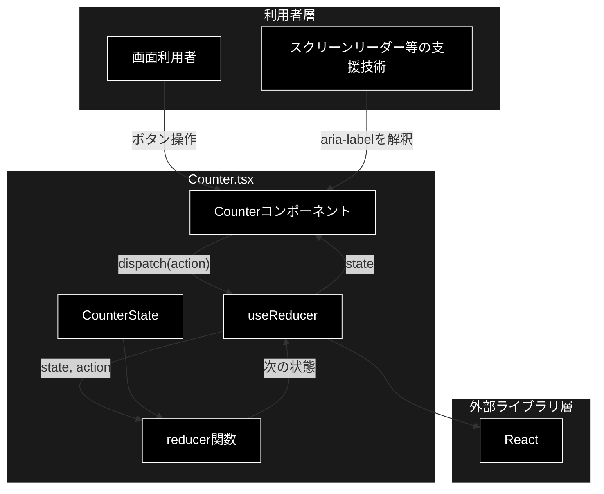
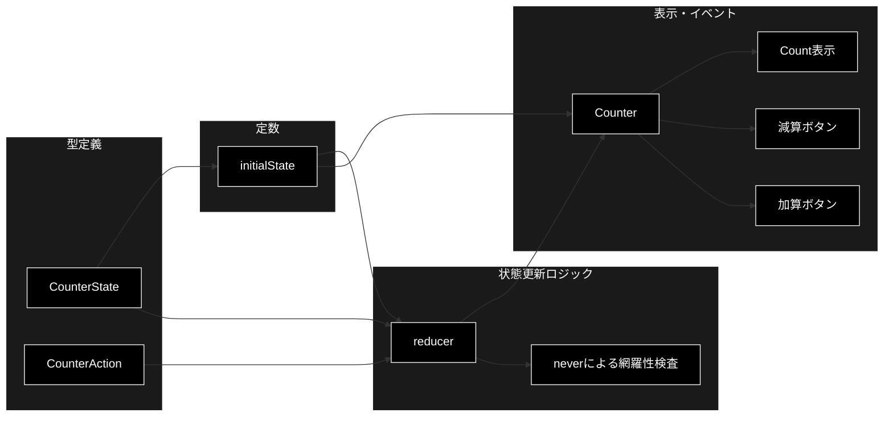
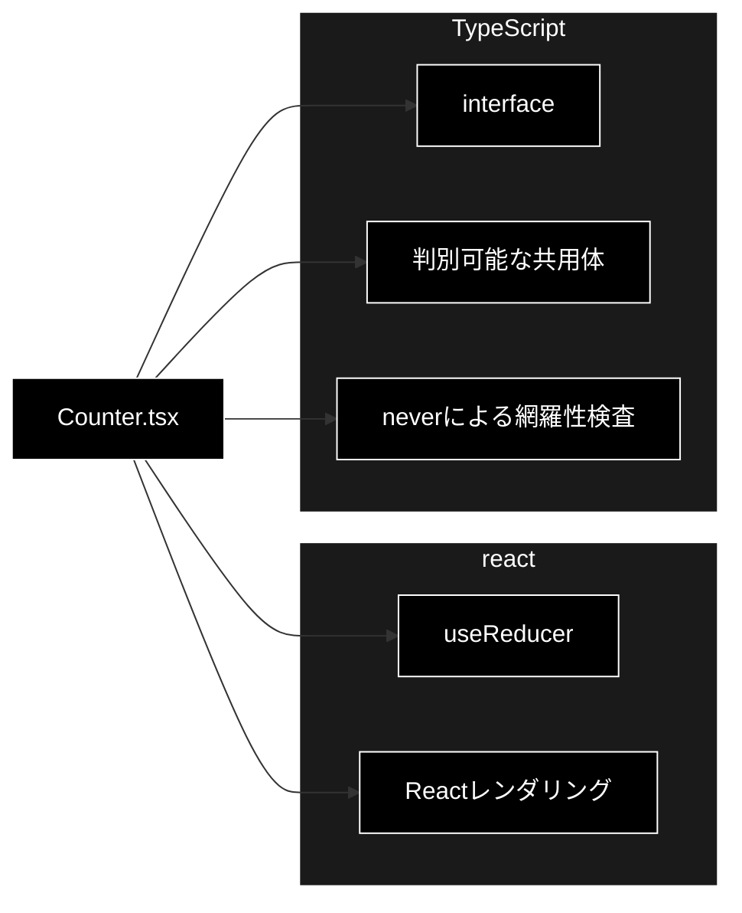

# Counter.tsx - `useReducer` カウンターコンポーネント 詳細設計書

**Version 1.0** | 最終更新: 2026-08-11

---

## 目次

1. [概要](#概要)
2. [アーキテクチャ構成図](#1-アーキテクチャ構成図)
3. [モジュール構成図](#2-モジュール構成図)
4. [型・定数・関数・コンポーネント一覧](#3-型定数関数コンポーネント一覧)
5. [型・関数・コンポーネント IPO詳細](#4-型関数コンポーネント-ipo詳細)
6. [設定・定数](#5-設定定数)
7. [画面・イベント詳細](#6-画面イベント詳細)
8. [使用例](#7-使用例)
9. [エクスポート](#8-エクスポート)
10. [テスト設計](#9-テスト設計)
11. [変更履歴](#10-変更履歴)
12. [付録: 依存関係図](#付録-依存関係図)

---

## 概要

`Counter.tsx` は、Reactの `useReducer` フックを使用して数値カウンターを管理・表示する関数コンポーネントである。利用者は画面上のボタンからカウント値を1ずつ増減できる。状態管理層には初期化用の `reset` アクションも用意するが、提示された画面にはリセット操作用ボタンを配置しない。

> 📝 **前提**: 提示コードにはファイル名がないため、本書では実装ファイルを `Counter.tsx` と仮定する。CSS、親コンポーネント、ビルド設定およびReactのバージョンは提示範囲外である。

### 主な責務

- カウント値を `CounterState` として保持する
- 判別可能な共用体型 `CounterAction` で操作種別を制限する
- `reducer()` で加算、減算および初期化を処理する
- `Counter()` で現在値と増減ボタンを表示する
- `aria-label` により増減ボタンの目的を支援技術へ伝える
- 未知のアクションを型検査と実行時例外で検出する

### 各責務対応の要素

| # | 責務 | 対応要素 | 説明 |
|---:|------|----------|------|
| 1 | カウント状態の定義 | `CounterState` | `count` を数値として定義する |
| 2 | 操作種別の定義 | `CounterAction` | `increment`、`decrement`、`reset` のみを許可する |
| 3 | 初期値の提供 | `initialState` | `count = 0` の初期状態を提供する |
| 4 | 状態遷移の実行 | `reducer()` | アクションに対応した新しい状態を返す |
| 5 | 表示とイベント受付 | `Counter()` | 現在値を表示し、ボタン操作を `dispatch()` へ渡す |
| 6 | アクセシビリティ対応 | `Counter()` 内のボタン | 操作内容を日本語の `aria-label` で提供する |

### 主要機能一覧

| 機能 | 説明 |
|------|------|
| `CounterState` | カウンター状態の型定義 |
| `CounterAction` | reducerが受け付けるアクションの共用体型 |
| `initialState` | カウンターの初期状態 |
| `reducer()` | アクションに応じて次の状態を算出する純粋関数 |
| `Counter()` | カウント表示と増減操作を提供するReact関数コンポーネント |

### 対象範囲

| 区分 | 内容 |
|------|------|
| 対象 | 状態型、アクション型、初期状態、reducer、JSX、クリックイベント、アクセシビリティ属性 |
| 対象外 | CSS、永続化、サーバー通信、カウント範囲制限、リセットボタン、国際化、親画面への組み込み |

---

## 1. アーキテクチャ構成図

### 1.1 システム全体構成



### 1.2 データフロー

1. Reactが `Counter()` をレンダリングする。
2. `useReducer(reducer, initialState)` が現在の `state` と `dispatch` を返す。
3. `state.count` が `<span>` 内に表示される。
4. 利用者が `-` または `+` ボタンを選択する。
5. クリックハンドラーが `decrement` または `increment` アクションを `dispatch()` へ渡す。
6. Reactが現在の `state` と受信した `action` を `reducer()` へ渡す。
7. `reducer()` が新しい `CounterState` を返す。
8. Reactが状態変更を反映して `Counter()` を再レンダリングする。

---

## 2. モジュール構成図

### 2.1 内部モジュール構成



### 2.2 外部依存関係

| ライブラリ | バージョン | 用途 |
|------------|------------|------|
| `react` | プロジェクト定義に従う | `useReducer` の提供、コンポーネントのレンダリング |
| `typescript` | プロジェクト定義に従う | 状態・アクション・関数シグネチャの静的型検査 |

### 2.3 内部依存関係

| 要素 | 依存先 | 用途 |
|------|--------|------|
| `initialState` | `CounterState` | 初期状態の型保証 |
| `reducer()` | `CounterState` | 入力状態および戻り値の型保証 |
| `reducer()` | `CounterAction` | 受け付けるアクションの制限と網羅性検査 |
| `reducer()` | `initialState` | `reset` 時の初期状態返却 |
| `Counter()` | `reducer()` | 状態遷移処理 |
| `Counter()` | `initialState` | `useReducer` の初期値 |
| `Counter()` | `useReducer` | 状態保持と `dispatch` の取得 |

---

## 3. 型・定数・関数・コンポーネント一覧

### 3.1 型一覧

| 型名 | 種別 | 概要 |
|------|------|------|
| `CounterState` | インターフェース | カウンターの状態を表す |
| `CounterAction` | 判別可能な共用体型 | reducerが処理可能な3種類のアクションを表す |

### 3.2 定数一覧

| 定数名 | 型 | 値 | 概要 |
|--------|----|----|------|
| `initialState` | `CounterState` | `{ count: 0 }` | カウンターの初期状態 |

### 3.3 関数一覧

| 関数名 | 概要 |
|--------|------|
| `reducer(state, action)` | 現在の状態とアクションから次の状態を算出する |

### 3.4 コンポーネント一覧

| コンポーネント | Props | 概要 |
|----------------|-------|------|
| `Counter()` | なし | 現在値と増減ボタンを表示する |

### 3.5 アクション一覧

| `action.type` | 意味 | 状態遷移 | 画面からの実行 |
|---------------|------|----------|:--------------:|
| `increment` | 1加算する | `count = count + 1` | ✅ |
| `decrement` | 1減算する | `count = count - 1` | ✅ |
| `reset` | 初期状態へ戻す | `count = 0` | ❌ |

---

## 4. 型・関数・コンポーネント IPO詳細

### 4.1 `CounterState` インターフェース

**概要**: カウンターコンポーネントが保持する状態の構造を定義する。

```typescript
interface CounterState {
  count: number;
}
```

| プロパティ | 型 | 必須 | 説明 |
|------------|----|:----:|------|
| `count` | `number` | ✅ | 現在のカウント値 |

**制約事項**:

- `count` の最小値および最大値は定義しない。
- 小数、`NaN`、`Infinity` を防ぐ実行時検証は持たない。ただし、提供されるreducer操作だけを使用する限り、初期値0から整数単位で遷移する。
- 状態は直接変更せず、新しいオブジェクトを返して更新する。

### 4.2 `CounterAction` 型

**概要**: `reducer()` が受け付けるアクションを、`type` プロパティで判別できる共用体として定義する。

```typescript
type CounterAction =
  | { type: 'increment' }
  | { type: 'decrement' }
  | { type: 'reset' };
```

| バリアント | ペイロード | 説明 |
|------------|------------|------|
| `{ type: 'increment' }` | なし | 現在値を1増やす |
| `{ type: 'decrement' }` | なし | 現在値を1減らす |
| `{ type: 'reset' }` | なし | 初期値0へ戻す |

**特徴**:

- 文字列リテラル型により、タイプミスをコンパイル時に検出できる。
- 新しいアクションを共用体へ追加した際、`reducer()` に対応する `case` がなければ `never` への代入で型エラーになる。

### 4.3 `reducer()` 関数

**概要**: 現在の状態とアクションを受け取り、アクションの種類に対応した次の状態を返す。

```typescript
function reducer(
  state: CounterState,
  action: CounterAction
): CounterState
```

| パラメータ | 型 | デフォルト | 説明 |
|------------|----|------------|------|
| `state` | `CounterState` | - | 更新前の現在状態 |
| `action` | `CounterAction` | - | 実行する操作を示すアクション |

| 項目 | 内容 |
|------|------|
| **Input** | `state: CounterState`, `action: CounterAction` |
| **Process** | 1. `action.type` を評価する<br>2. `increment` の場合は `count` を1加算する<br>3. `decrement` の場合は `count` を1減算する<br>4. `reset` の場合は `initialState` を返す<br>5. 未知のアクションの場合は例外を送出する |
| **Output** | `CounterState`: アクション適用後の状態 |

#### 処理仕様

| 条件 | 処理 | 戻り値例 |
|------|------|----------|
| `action.type === 'increment'` | `state` を展開し、`count` に1を加える | `{ count: 1 }` |
| `action.type === 'decrement'` | `state` を展開し、`count` から1を引く | `{ count: -1 }` |
| `action.type === 'reset'` | 初期状態を返す | `{ count: 0 }` |
| 上記以外 | 未知のアクションとして例外を送出する | 戻り値なし |

#### 戻り値例

```typescript
// state = { count: 0 }, action = { type: 'increment' }
{ count: 1 }

// state = { count: 0 }, action = { type: 'decrement' }
{ count: -1 }

// state = { count: 10 }, action = { type: 'reset' }
{ count: 0 }
```

#### 例外

| 例外 | 発生条件 | メッセージ |
|------|----------|------------|
| `Error` | 型検査を迂回した不正なアクションが実行時に渡された場合 | `未知の action: {アクションのJSON表現}` |

> 📝 **補足**: 正常なTypeScriptコードでは `CounterAction` が3種類に制限されるため、`default` には到達しない。`const exhaustive: never = action` は、新しいアクションの追加時に `case` の書き漏れをコンパイル時に検出するための網羅性検査である。

> 📝 **注意**: `reset` は `initialState` と同じオブジェクト参照を返す。すでに同じ参照が現在状態である場合、Reactは状態に変化がないものとして再レンダリングを省略できる。

```typescript
// 使用例
const nextState = reducer(
  { count: 5 },
  { type: 'increment' },
);

console.log(nextState);
// 出力: { count: 6 }
```

### 4.4 `Counter()` コンポーネント

**概要**: reducerで管理する現在のカウント値を表示し、値を1ずつ増減する操作を提供するReact関数コンポーネント。

```tsx
export function Counter(): JSX.Element
```

> 📝 **型表記**: 実装コードでは戻り値型を明示していないため、実際の型はTypeScriptと利用中のReact型定義によって推論される。本書の `JSX.Element` は設計上の概念表記である。

| パラメータ | 型 | デフォルト | 説明 |
|------------|----|------------|------|
| なし | - | - | Propsは受け取らない |

| 項目 | 内容 |
|------|------|
| **Input** | 利用者による増減ボタンのクリック |
| **Process** | 1. `useReducer()` を初期化する<br>2. `state.count` を表示する<br>3. 減算ボタンのクリック時に `decrement` をdispatchする<br>4. 加算ボタンのクリック時に `increment` をdispatchする<br>5. 状態変更後の値で再レンダリングする |
| **Output** | React要素: カウント表示、減算ボタン、加算ボタン |

#### 使用するフック

```typescript
const [state, dispatch] = useReducer(reducer, initialState);
```

| 要素 | 型・役割 | 説明 |
|------|----------|------|
| `state` | `CounterState` | 現在のカウンター状態 |
| `dispatch` | `Dispatch<CounterAction>` 相当 | reducerへアクションを通知する関数 |
| `reducer` | reducer関数 | 次の状態を算出する |
| `initialState` | `CounterState` | 初回レンダリング時の状態 |

#### レンダリング結果

```tsx
<>
  <span>Count: {state.count}</span>
  <button
    type="button"
    aria-label="1 減らす"
    onClick={() => dispatch({ type: 'decrement' })}
  >
    -
  </button>
  <button
    type="button"
    aria-label="1 増やす"
    onClick={() => dispatch({ type: 'increment' })}
  >
    +
  </button>
</>
```

---

## 5. 設定・定数

### 5.1 `initialState`

カウンターの初回レンダリング時および `reset` アクション実行時に使用する初期状態である。

```typescript
const initialState: CounterState = { count: 0 };
```

| プロパティ | デフォルト値 | 説明 |
|------------|--------------|------|
| `count` | `0` | カウンターの開始値 |

**制約事項**:

- モジュール内部定数であり、外部へはエクスポートしない。
- 実行時の設定やPropsによる初期値変更には対応しない。
- `const` は変数への再代入を防ぐが、オブジェクト自体を凍結しない。実装では `initialState` を変更しないこと。

---

## 6. 画面・イベント詳細

### 6.1 表示項目

| # | 要素 | HTML要素 | 表示内容 | 初期表示 | 備考 |
|---:|------|----------|----------|----------|------|
| 1 | カウント表示 | `span` | `Count: {state.count}` | `Count: 0` | 英語の固定ラベルを使用 |
| 2 | 減算ボタン | `button` | `-` | 常時有効 | 下限値なし |
| 3 | 加算ボタン | `button` | `+` | 常時有効 | 上限値なし |

### 6.2 イベント仕様

| # | 発生元 | イベント | 条件 | dispatchするアクション | 結果 |
|---:|--------|----------|------|-------------------------|------|
| 1 | 減算ボタン | `click` | ボタンが操作されたとき | `{ type: 'decrement' }` | `count` が1減る |
| 2 | 加算ボタン | `click` | ボタンが操作されたとき | `{ type: 'increment' }` | `count` が1増える |

### 6.3 状態遷移表

| 現在値 | アクション | 遷移後の値 | 備考 |
|-------:|------------|-------------:|------|
| `n` | `increment` | `n + 1` | 上限チェックなし |
| `n` | `decrement` | `n - 1` | 負数を許容する |
| `n` | `reset` | `0` | 画面からは実行不可 |

### 6.4 アクセシビリティ仕様

| 対象 | 属性 | 値 | 目的 |
|------|------|----|------|
| 減算ボタン | `type` | `button` | 親がフォームの場合の意図しない送信を防ぐ |
| 減算ボタン | `aria-label` | `1 減らす` | 記号 `-` の操作目的を支援技術へ伝える |
| 加算ボタン | `type` | `button` | 親がフォームの場合の意図しない送信を防ぐ |
| 加算ボタン | `aria-label` | `1 増やす` | 記号 `+` の操作目的を支援技術へ伝える |

### 6.5 UI上の制約

- リセットボタンは表示しない。
- ボタンの無効化条件は設けない。
- 連続クリックの抑止やデバウンスは行わない。
- 表示レイアウトと要素間の余白はCSSに委ねる。
- `span` と各ボタンを関連付けるコンテナ要素は生成せず、React Fragmentでまとめる。
- Props、コールバックおよび外部状態との同期は提供しない。

---

## 7. 使用例

### 7.1 基本的なワークフロー

```tsx
// 使用例
import { Counter } from './Counter';

export function App() {
  return (
    <main>
      <h1>カウンター</h1>
      <Counter />
    </main>
  );
}
```

### 7.2 操作例

1. 初期表示では `Count: 0` と表示される。
2. `+` ボタンを1回押すと `Count: 1` になる。
3. `+` ボタンをもう1回押すと `Count: 2` になる。
4. `-` ボタンを1回押すと `Count: 1` になる。
5. `-` ボタンは0以下でも使用できるため、必要に応じて負数へ遷移する。

---

## 8. エクスポート

### 8.1 公開要素

| 要素 | 種別 | 公開状態 | 説明 |
|------|------|:--------:|------|
| `Counter` | React関数コンポーネント | 公開 | 他モジュールからインポートして使用できる |

### 8.2 非公開要素

| 要素 | 種別 | 説明 |
|------|------|------|
| `CounterState` | インターフェース | モジュール内部の状態型 |
| `CounterAction` | 型エイリアス | モジュール内部のアクション型 |
| `initialState` | 定数 | モジュール内部の初期状態 |
| `reducer` | 関数 | モジュール内部の状態更新関数 |

---

## 9. テスト設計

### 9.1 reducer単体テスト

| ID | テスト条件 | 入力 | 期待結果 |
|----|------------|------|----------|
| R-01 | 加算できる | `state = { count: 0 }`, `increment` | `{ count: 1 }` |
| R-02 | 正数から加算できる | `state = { count: 10 }`, `increment` | `{ count: 11 }` |
| R-03 | 減算できる | `state = { count: 0 }`, `decrement` | `{ count: -1 }` |
| R-04 | 負数から減算できる | `state = { count: -5 }`, `decrement` | `{ count: -6 }` |
| R-05 | 初期状態へ戻せる | `state = { count: 10 }`, `reset` | `{ count: 0 }` |
| R-06 | 元の状態を変更しない | `state = { count: 1 }`, `increment` | 入力は `{ count: 1 }` のまま、戻り値は別オブジェクト |
| R-07 | 未知のアクションを拒否する | 型検査を迂回した `{ type: 'unknown' }` | `Error` を送出する |
| R-08 | アクションの網羅性を検査する | 共用体へ新種を追加し `case` を追加しない | TypeScriptコンパイルエラーになる |

### 9.2 コンポーネントテスト

| ID | テスト条件 | 操作 | 期待結果 |
|----|------------|------|----------|
| C-01 | 初期表示 | `<Counter />` をレンダリング | `Count: 0` が表示される |
| C-02 | 加算操作 | `1 増やす` ボタンを1回押す | `Count: 1` が表示される |
| C-03 | 減算操作 | `1 減らす` ボタンを1回押す | `Count: -1` が表示される |
| C-04 | 連続操作 | 加算2回、減算1回 | `Count: 1` が表示される |
| C-05 | ボタン種別 | 両ボタンを取得 | `type="button"` である |
| C-06 | アクセシブルネーム | ボタンをロールで取得 | `1 減らす`、`1 増やす` で取得できる |
| C-07 | リセットUI非表示 | 初期表示を確認 | リセットボタンが存在しない |

### 9.3 静的検査

| ID | 検査内容 | 合格条件 |
|----|----------|----------|
| S-01 | TypeScript型検査 | エラーが0件である |
| S-02 | ESLint | プロジェクトの規則に違反しない |
| S-03 | 未使用要素 | 未使用のimport、変数、型がない |

---

## 10. 変更履歴

| バージョン | 日付 | 変更内容 |
|------------|------|----------|
| 1.0 | 2026-08-11 | 提示されたTypeScript／Reactコードを基に初版作成 |

---

## 付録: 依存関係図



### 付録A. 設計対象コード

```tsx
import { useReducer } from 'react';

interface CounterState {
  count: number;
}

type CounterAction =
  | { type: 'increment' }
  | { type: 'decrement' }
  | { type: 'reset' };

const initialState: CounterState = { count: 0 };

function reducer(state: CounterState, action: CounterAction): CounterState {
  switch (action.type) {
    case 'increment':
      return { ...state, count: state.count + 1 };
    case 'decrement':
      return { ...state, count: state.count - 1 };
    case 'reset':
      return initialState;
    default: {
      // case の書き漏れがあると、ここで型エラーになる（実行時より早く気づける）
      const exhaustive: never = action;
      throw new Error(`未知の action: ${JSON.stringify(exhaustive)}`);
    }
  }
}

export function Counter() {
  const [state, dispatch] = useReducer(reducer, initialState);

  return (
    <>
      <span>Count: {state.count}</span>
      <button type="button" aria-label="1 減らす" onClick={() => dispatch({ type: 'decrement' })}>
        -
      </button>
      <button type="button" aria-label="1 増やす" onClick={() => dispatch({ type: 'increment' })}>
        +
      </button>
    </>
  );
}
```
