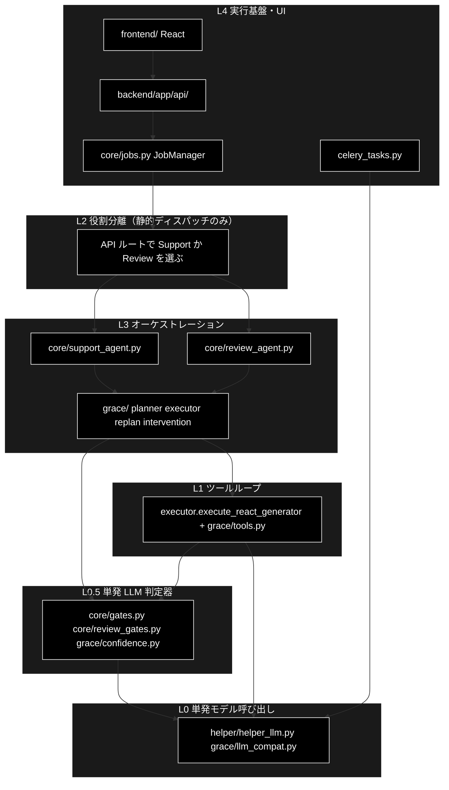

# エージェント階層（L0〜L4）— 一般用語と grace_v2 実装の対応

**Version 1.0** | 最終更新: 2026-09-17

一般的な LLM エージェント用語（ReAct / Planner-Executor / LLM-as-a-Judge / HITL 等）が
**grace_v2 のどのモジュールに対応するか**を、粒度 L0〜L4 で対応づける。
「Agent が何本走っているのか」を実装から把握するための索引である。

> ⚠️ **本書は対応表であり、仕様書ではない。** ステップの実行順は
> [`pipelines.md`](pipelines.md) §2、判定機構の詳細は [`guardrails.md`](guardrails.md) §2、
> 関数の IPO は各領域の `docs/` が正本（[`README.md`](README.md) §4）。

---

## 目次

- [1. 前提 — 「Agent が複数走る」の実態](#1-前提--agent-が複数走るの実態)
- [2. 階層の定義](#2-階層の定義)
- [3. L0 — 単発のモデル呼び出し](#3-l0--単発のモデル呼び出し)
- [4. L0.5 — 単発 LLM 判定器](#4-l05--単発-llm-判定器)
- [5. L1 — ツールループ（ReAct）](#5-l1--ツールループreact)
- [6. L2 — 役割分離（本リポジトリには弱い形のみ）](#6-l2--役割分離本リポジトリには弱い形のみ)
- [7. L3 — オーケストレーション](#7-l3--オーケストレーション)
- [8. L4 — 実行基盤と UI](#8-l4--実行基盤と-ui)
- [9. 階層に属さないもの](#9-階層に属さないもの)
- [10. 逆引き表（一般用語 → 実装）](#10-逆引き表一般用語--実装)
- [11. 関連ドキュメント](#11-関連ドキュメント)
- [12. 変更履歴](#12-変更履歴)

---

## 1. 前提 — 「Agent が複数走る」の実態

モデル本体（1 回の推論）の中に Agent は存在しない。**Agent はモデルの外側で
アプリが組む構造**であり、同じモデルに違うプロンプト・違うツール・違う文脈を
与えて何度も呼ぶ、その「役割を持った呼び出し」の単位を指す。

grace_v2 の実態は次のとおり。

| 問い | 答え |
|---|---|
| 独立文脈のサブエージェントを起動するか | **しない**（§6） |
| 何本のループが走るか | **1 本**（`Executor` の静的パスまたは ReAct パス） |
| 役割分離はどこにあるか | クラス分離（Planner / Executor / Verifier …）。文脈は共有 |
| 厚みがある層はどこか | **L0.5 と L3** |

---

## 2. 階層の定義

| 層 | 単位 | 終了条件を決めるのは |
|---|---|---|
| **L0** | API 1 回 | なし（1 往復） |
| **L0.5** | 1 回の LLM 判定 | なし（1 往復・出力は判定値） |
| **L1** | ツールループ | **LLM** |
| **L2** | 独立文脈のサブエージェント | LLM |
| **L3** | 固定パイプライン | **アプリのコード** |
| **L4** | 常駐プロセス・UI | 外部イベント |

---

## 3. L0 — 単発のモデル呼び出し

入力 → 出力の 1 往復。状態も終了判定も持たない。

| 実装 | 中身 | 一般用語 |
|---|---|---|
| `helper/helper_llm.py` — `LLMClient` / `AnthropicClient` / `create_llm_client` | プロバイダ抽象 | Provider abstraction |
| 〃 `generate_content` / `generate_structured` | テキスト生成 / Pydantic スキーマ付き生成 | Completion / Structured Output |
| 〃 `generate_with_tools` → `ToolUseResponse` | ツール定義を渡し「次に呼ぶツール」を返させる | Function calling / Tool use |
| `grace/llm_compat.py` — `AnthropicGenaiClient` / `create_chat_client` | genai 形の呼び出しを Anthropic へ差し替える互換層 | Compatibility shim |
| 〃 `_strip_to_json` / `_schema_hint` | JSON 強制・スキーマヒント注入 | Output parsing / repair |
| `helper/helper_embedding.py` | Gemini Embedding（3072 次元） | Embedding model |
| `grace/config.py` — `GraceConfig` / `ConfigLoader` | yml → 環境変数 → pydantic の 3 段検証 | Config resolution |
| `grace/schemas.py` — `PlanStep` / `ExecutionPlan` / `StepResult` / `AgentThought` | 層間で受け渡す型 | Typed contracts |

---

## 4. L0.5 — 単発 LLM 判定器

ループを持たず、1 回呼んで 1 つの判定を返す。**本リポジトリで最も厚い層のひとつ。**
実装形式が統一されており、ファクトリがクロージャを返す（`create_*(config) -> Callable`）ため
テストでスタブに差し替えられる。

| 実装 | 判定器 | 判定内容 | 一般用語 |
|---|---|---|---|
| `backend/app/core/gates.py` | `create_intent_classifier` | 問い合わせの意図分類 | Intent classifier |
| 〃 | `create_no_info_judge` | 「情報が無い」系の回答か（④'） | Refusal detector |
| 〃 | `create_question_analyzer` | 複数質問の検知・主従分離（0-(A)） | Query decomposition |
| 〃 | `create_scope_classifier` | 各質問が業界プロファイルの範囲内か | Scope guard |
| 〃 | `create_cluster_analyzer` | 質問クラスタの抽出 | Clustering |
| `backend/app/core/review_gates.py` | `create_violation_detector` | 規程違反か（二段判定） | LLM-as-a-Judge |
| 〃 | `create_mention_classifier` | 言及の性質分類 | Classifier |
| 〃 | `create_vacuous_judge` | 指摘が空虚（無内容）でないか | Self-critique filter |
| `grace/confidence.py` | `GroundednessVerifier.verify` | claim 単位の supported / contradicted / neutral | Faithfulness / Entailment |
| 〃 | `LLMSelfEvaluator.evaluate` | 出力の自己評価 | Self-evaluation |
| 〃 | `QueryCoverageCalculator` | 質問を回答がカバーしているか | Answer relevance |
| `grace/planner.py` | `estimate_complexity_with_llm` | クエリ複雑度 | Difficulty routing |

> ⚠️ **この層は軽量モデルで回す。** `gates.py::judge_model()` と
> `review_gates.py::detect_model()` が `light_model` を解決する。UI のモデルセレクタ
> （CLAUDE.md §3.1 の経路 4）は `llm.model` だけを上書きし、`light_model` は上書きしない。

---

## 5. L1 — ツールループ（ReAct）

LLM が次の 1 手を決め、ツールを呼び、結果を見てまた決める。
**終了条件を LLM が決める**ため、ここからが Agent。

| 実装 | 役割 | 一般用語 |
|---|---|---|
| `grace/tools.py` — `BaseTool` / `ToolResult` / `ToolRegistry` | ツールの抽象と登録簿 | Tool interface / Registry |
| 〃 `RAGSearchTool` | Qdrant 検索（内部で `agent_tools.py` を遅延 import） | Retrieval tool |
| 〃 `ReasoningTool` | 検索結果から回答を生成 | Synthesis tool |
| 〃 `WebSearchTool` | DDG / Google / SerpAPI を backend 切替 | Web search tool |
| 〃 `AskUserTool` | 人間に問う | HITL tool |
| 〃 `CodeExecuteTool` | `_static_check` ＋ CPU / メモリ制限 | Sandboxed execution |
| `grace/executor.py::execute_react_generator` | ReAct ループ本体 | ReAct loop |
| 〃 `_decide_next_action` → `AgentThought` | Reason（次の 1 手を LLM が決める） | Reasoning step |
| `grace/schemas.py::Scratchpad` | 行動と観測の履歴をプロンプトへ戻す | Scratchpad |
| `config.executor.react_max_iterations` | ループ上限 | Iteration budget |

ループ 1 周は `Reason → Act → Observe → Confidence → Controller`。

> **同じ `Executor` が L1 と L3 を兼ねる。** `_decide_next_action` は LLM が使えないとき
> 初期 Plan のステップ列を順に辿るフォールバックへ degrade する。`execute_plan_generator`
> （静的パス）と `execute_react_generator`（動的パス）は `_execute_step` /
> `_calculate_overall_confidence` / `_create_execution_result` を共有しており、
> API キー無しの CI 環境でも同じコードが通る。

---

## 6. L2 — 役割分離（本リポジトリには弱い形のみ）

**grace_v2 に、独立した文脈を持つサブエージェントを起動する機構は無い。**

| 一般用語の L2 | grace_v2 の実態 |
|---|---|
| Sub-agent spawning | なし |
| Multi-agent debate | なし |
| Role separation | `Planner` / `Executor` / `ConfidenceCalculator` / `ReplanManager` / `InterventionHandler` — **クラス分離であって文脈分離ではない**。同一プロセス・同一 config |
| Router によるエージェント選択 | Support と Review の 2 エージェント。ただし **API ルート（`/api/query` と `/api/review/submit`）が選ぶ静的ディスパッチ**であり、ルータ LLM は介在しない |
| Parallel fan-out | `executor._prefetch_parallel_searches` — エージェント並列ではなく**検索の先読み並列** |

これは欠落ではなく設計判断である。L2 を持たないことでパイプラインが決定的になり、
`backend/tests` でテストできる。代償として、共用部品
（`GroundednessVerifier` / `InterventionBridge` / `support_actions.py::ActionBackend`）は
L2 で隔離されず L3 で共有されるため、**Support の変更が Review を壊しうる**
（CLAUDE.md §1・R5 のチェックリスト）。

---

## 7. L3 — オーケストレーション

固定順序の状態機械。順序を決めるのは LLM ではなくアプリのコード。
**本リポジトリの主戦場。**

### 7.1 中核の 2 エージェント

| 実装 | 関数 |
|---|---|
| `backend/app/core/support_agent.py` | `run_support_agent_core` |
| `backend/app/core/review_agent.py` | `run_review_agent_core` |

両者とも `log` / `step_started` / `step_finished` / `step_skipped` のクロージャを定義し、
ステップごとにイベントを emit しながら進む。ステップの一覧と実行順は
[`pipelines.md`](pipelines.md) §2 を参照（本書では再掲しない）。

### 7.2 役割別コンポーネント

| 一般用語 | 実装 | 補足 |
|---|---|---|
| Planner | `grace/planner.py::Planner.create_plan` | LLM / ルールベース / clarification / fallback の 4 系統を `_should_use_llm_plan` で分岐 |
| Executor | `grace/executor.py::Executor` ＋ `ExecutionState` | 依存解決・タイムアウト・フォールバック |
| Critic / Verifier | `grace/confidence.py::GroundednessVerifier` | `support_rate = supported / (supported + contradicted)`。neutral は分母から除外 |
| Score aggregation | `ConfidenceCalculator` / `ConfidenceAggregator` / `SourceAgreementCalculator` | 重み付き合算＋ペナルティ。`_validate_weights` が重み和を検証 |
| Calibration | `grace/calibration.py::Calibrator` | 温度スケーリング（`fit_temperature` / `expected_calibration_error`） |
| Guardrail | `backend/app/core/gates.py` / `review_gates.py` の**非 LLM 部分** | 機構一覧は [`guardrails.md`](guardrails.md) §2 が正本 |
| Replanning | `grace/replan.py::ReplanManager` / `ReplanOrchestrator` | `ReplanTrigger`（なぜ）× `ReplanStrategy`（どう）の 2 軸 |
| HITL | `grace/intervention.py::InterventionHandler` | `silent` / `notify` / `confirm` / `escalate` の 4 レベル |
| Adaptive thresholds | `grace/intervention.py::DynamicThresholdAdjuster` | フィードバックから閾値を調整 |
| Episodic memory | `grace/memory.py::ExecutionMemory` | 過去実行からコレクションの事前分布を学習。JSONL 永続 |
| Policy injection | `backend/app/core/verticals.py::VerticalProfile.build_prompt_addendum` | 業界ごとの許可コレクション・閾値・プロンプト追記 |
| Ruleset | `backend/app/core/rulesets.py::RuleSet` / `RuleItem` | `always_check_rules` / `keyword_rules` の二層 |
| Action / Effector | `support_actions.py::ActionBackend` | `DryRun` / `Pseudo` / `Webhook`。**Support / Review 共用** |
| Identity verification | `support_actions.py::IdentityVerifier` | ⑥ の前段 |

> LangGraph の `StateGraph` に相当するものを、本リポジトリは**素の Python の逐次実行**で
> 書いている。動的なグラフ変更ができない代わりにテストしやすく、その制約を補うのが
> `ReplanManager` である。

---

## 8. L4 — 実行基盤と UI

LLM は登場しない。L3 を走らせ、人に見せる層。

**UI は `backend/` ＋ `frontend/` の 2 つだけ**である（Vite + React 18 + TypeScript、
dev: `:5173` / FastAPI dev: `:8000`）。

| 実装 | 役割 | 一般用語 |
|---|---|---|
| `frontend/` | 4 タブ（基本版 / GRACE-Support / GRACE-Review / データ管理） | SPA |
| `backend/app/main.py` ＋ `api/*.py` | HTTP 境界 | API layer |
| `api/support.py` / `api/review.py` | `POST` で 202 Accepted → `GET /stream/{job_id}` で SSE → `POST /confirm/{job_id}` | Async job + streaming + callback |
| `api/data.py` / `api/qdrant.py` / `api/meta.py` | データ準備ジョブ / コレクション管理 / モデル・業界・ルールセットの一覧 | — |
| `backend/app/core/jobs.py::JobManager` | `threading.Thread(daemon=True)` で runner を起動、`_gc_finished_locked` で古いジョブを破棄 | Job queue / Worker pool |
| 〃 `Job.emit` / `stream_events` / `finish` | イベントキュー → SSE | Event stream |
| `backend/app/core/intervention_bridge.py::InterventionBridge` | L3 の同期的な `resolver(request)` を HTTP の往復へ橋渡し | HITL bridge |
| `backend/app/core/job_logs.py::JobLogHandler` | `logging.Handler` を継承しログを SSE イベント化 | Log forwarding |
| `backend/app/core/data_jobs.py` | チャンク化 / Q&A 生成 / Qdrant 登録 / 削除の 4 ランナー | ETL jobs |
| `celery_config.py` / `celery_tasks.py` | `generate_qa_for_chunk_task` をチャンク単位で fan-out | Distributed task queue |
| `agent_cache.py` | コレクション選択キャッシュ（⚠️ Legacy ReAct 経路専用。Web 経路のコレクション優先度は `grace/memory.py::ExecutionMemory` が担う） | Cache layer |
| `qdrant_client_wrapper.py` ＋ `docker-compose/` | ベクトル DB | Vector store |

> **`InterventionBridge` が L3 と L4 の境界そのもの。** `grace/intervention.py` は
> 「`resolver` を呼べば人間の答えが返る」同期関数として書かれており、実際には
> SSE → ユーザ操作 → `POST /confirm` の往復で実現される。この分離により、
> L3 のコードは HTTP から独立したままとなり、テストやスクリプトから
> 同じコアを直接呼べる（CLAUDE.md §1）。

### 8.1 Streamlit は存在しない

本リポジトリに Streamlit は**コード・依存ともに 1 件も無い**（2026-09-12 に除去、
`doc_modernization_todo.md` §5・§10.1）。`.claude/skills/grace-agent-docs/` 配下の
`a_pages_md_format.md` 等に Streamlit の記述があるが、これは**他リポジトリ用に同梱された
スキル資材**であり本リポジトリの実装ではない（CLAUDE.md §9.2）。UI を論じるときの
参照先は常に `backend/` と `frontend/` である。

---

## 9. 階層に属さないもの

**`grace/step_trace/`（`s0_arg.py`〜`s9_render.py`・`benchmark.py`）は
コード確認用のプログラムであり、プロジェクトの仕組みを構成しない。**
各ファイルはパイプラインの 1 ステップだけを切り出して IN / Process / OUT を
標準出力に出す。L0〜L4 のいずれにも配置しない。

同様に `backend/tests/` も仕組みの構成要素ではなく検証手段である。

---

## 10. 逆引き表（一般用語 → 実装）

| 一般用語 | 実装 | 層 |
|---|---|:--:|
| Function calling / Tool use | `helper/helper_llm.py::AnthropicClient.generate_with_tools` | L0 |
| Structured Output | 〃 `generate_structured` | L0 |
| LLM-as-a-Judge | `core/gates.py::create_*` / `core/review_gates.py::create_violation_detector` | L0.5 |
| Faithfulness / Groundedness | `grace/confidence.py::GroundednessVerifier` | L0.5 |
| Answer relevance | 〃 `QueryCoverageCalculator` | L0.5 |
| Self-consistency | 〃 `SourceAgreementCalculator` | L0.5 |
| ReAct | `grace/executor.py::execute_react_generator` | L1 |
| Scratchpad | `grace/schemas.py::Scratchpad` | L1 |
| Tool registry | `grace/tools.py::ToolRegistry` | L1 |
| Planner-Executor | `grace/planner.py` ＋ `grace/executor.py` | L3 |
| Confidence calibration | `grace/calibration.py::Calibrator` | L3 |
| Guardrail | `core/gates.py::_answer_gate` / `_should_force_escalate` | L3 |
| Replanning | `grace/replan.py::ReplanManager` | L3 |
| HITL | `grace/intervention.py::InterventionHandler` | L3 |
| Episodic memory | `grace/memory.py::ExecutionMemory` | L3 |
| System prompt injection | `core/verticals.py::VerticalProfile.build_prompt_addendum` | L3 |
| Streaming | `api/support.py::stream_events` ＋ `core/jobs.py::Job.emit` | L4 |
| Job orchestration | `core/jobs.py::JobManager` | L4 |
| HITL bridge | `core/intervention_bridge.py::InterventionBridge` | L4 |
| Distributed fan-out | `celery_tasks.py::generate_qa_for_chunk_task` | L4 |

---

## 11. 関連ドキュメント

| 文書 | 内容 |
|---|---|
| [`pipelines.md`](pipelines.md) | 3 モードのステップ対照表・実行順（**本書はステップ表を持たない**） |
| [`guardrails.md`](guardrails.md) | ガードレール GA〜G9 の機構・実装・失敗時の既定（**本書は機構表を持たない**） |
| [`reasoning_flow.md`](reasoning_flow.md) | 生成の 2 ステップ（reasoning / detect）のプロンプト構造 |
| [`performance_levers.md`](performance_levers.md) | 品質・レイテンシ・コストを決める箇所 |
| [`../backend/docs/README.md`](../backend/docs/README.md) | `backend/app/**` の IPO 索引 |
| [`../grace/docs/README.md`](../grace/docs/README.md) | `grace/**` の IPO 索引 |
| [`../frontend/docs/README.md`](../frontend/docs/README.md) | React コンポーネント索引 |

---

## 12. 変更履歴

| バージョン | 変更内容 |
|-----------|---------|
| 1.0 | 初版作成（2026-09-17）。一般的なエージェント用語と実装の対応表が存在せず、実装を読む前の見取り図が無かったため作成。ステップ表・ガードレール表は `pipelines.md` / `guardrails.md` が正本のため本書では持たずリンクとした（`README.md` §4）。あわせて 2 点を明記した — (1) **UI は `backend/` ＋ `frontend/` のみで Streamlit は存在しない**（コード・依存ともに 0 件、2026-09-12 に除去済み）、(2) **`grace/step_trace/` はコード確認用でありプロジェクトの仕組みを構成しない**ため L0〜L4 のいずれにも配置しない |
