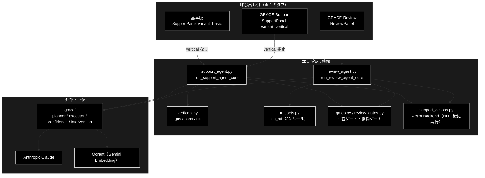

# app_tabs_overview.md - 処理 3 タブ（基本版 / GRACE-Support / GRACE-Review）の概要

**Version 1.1** | 最終更新: 2026-10-06

---

## 目次

- [概要](#概要)
  - [主な責務](#主な責務)
  - [各責務対応のモジュール](#各責務対応のモジュール)
  - [アーキテクチャ構成図](#アーキテクチャ構成図)
- [1. 3 タブをひと目で](#1-3-タブをひと目で)
- [2. 基本版 — 問い合わせ ＋ RAG](#2-基本版--問い合わせ--rag)
- [3. GRACE-Support — 問い合わせ ＋ RAG ＋ 業界プロファイル](#3-grace-support--問い合わせ--rag--業界プロファイル)
- [4. GRACE-Review — 規程 RAG ＋ 根拠検証で広告表示を点検](#4-grace-review--規程-rag--根拠検証で広告表示を点検)
- [5. 3 タブを支える grace のコアモジュール](#5-3-タブを支える-grace-のコアモジュール)
- [6. 読み違えやすい点](#6-読み違えやすい点)
- [7. 関連ドキュメント](#7-関連ドキュメント)
- [8. 変更履歴](#8-変更履歴)

---

## 概要

画面（`./run_dev.sh` → http://localhost:5173）の**処理を行う 3 タブ**を、
タブごとに「**業界特化**」「**処理フロー**」「**回答（出力）**」の 3 点でまとめる。
4 つ目の「データ管理」タブ（チャンク化 → Q/A 作成 → Qdrant 登録 → コレクション管理）は、
3 タブが検索するコレクションを用意する側なので本書では扱わない（[`backend/docs/data_pipeline.md`](../backend/docs/data_pipeline.md)）。

本書は**読み始めの入口**である。ステップ ID の対照表・基本版と Support の差（9 項目）・
モード別ガードレールの有効表の**正本は [`pipelines.md`](pipelines.md)** にあり、本書では繰り返さない。

技術スタック: LLM = Anthropic Claude（既定 `claude-sonnet-5-5`）／
Embedding = Gemini（`gemini-embedding-001`・3072 次元）／ベクトル DB = Qdrant。

### 主な責務

- 問い合わせに、全コレクションを対象とした社内ナレッジで根拠つきに回答する（基本版）
- 問い合わせに、業界プロファイルで絞った社内ナレッジと業界の方針で回答する（GRACE-Support）
- 広告文書を EC 広告表示ルールと規程 RAG で点検し、条文つきの指摘を出す（GRACE-Review）
- 回答・指摘が出典で裏付けられるかを検証し、支持率で確定・要確認・有人対応に振り分ける
- 副作用のあるアクション（起票・返信）を、人間の承認（HITL CONFIRM）を得るまで実行しない

### 各責務対応のモジュール

| # | 責務 | 対応モジュール | 説明 |
|---|------|--------------|------|
| 1 | 全コレクション対象の根拠つき回答（基本版） | `backend/app/core/support_agent.py` | `run_support_agent_core` を `vertical=None` で実行。画面は `frontend/src/components/SupportPanel.tsx`（`variant="basic"`） |
| 2 | 業界プロファイル適用の回答（GRACE-Support） | `backend/app/core/verticals.py` | `PROFILES`（`gov` / `saas` / `ec`）。コアは 1 と同じ関数（`variant="vertical"`） |
| 3 | 広告文書の点検と条文つき指摘（GRACE-Review） | `backend/app/core/review_agent.py` | `run_review_agent_core`。ルールは `backend/app/core/rulesets.py::EC_AD`（23 ルール） |
| 4 | 根拠検証と確定・要確認・有人対応の振り分け | `grace/confidence.py` | `GroundednessVerifier`（両エージェント共用）。判定は `backend/app/core/gates.py::_answer_gate` / `backend/app/core/review_gates.py::decide_finding_status` |
| 5 | アクションの HITL 承認 | `support_actions.py` | `ActionBackend`（両エージェント共用）。承認待ちは `grace/intervention.py` と画面の `ConfirmModal` |

### アーキテクチャ構成図



**データフロー**:

1. 基本版と GRACE-Support は**同じコア関数**へ入る。違いは `vertical` を渡すかどうかだけ
2. GRACE-Support はそこで業界プロファイル（検索スコープ・しきい値・方針）を、GRACE-Review はルールセットを適用する
3. コアは `grace/` の部品で Qdrant を検索し、Claude で回答・指摘を生成し、`GroundednessVerifier` で根拠を検証する
4. ゲートが支持率で結果を振り分け、副作用のあるアクションは HITL 承認後に `ActionBackend` が実行する

---

## 1. 3 タブをひと目で

| | 基本版 | GRACE-Support | GRACE-Review |
|---|---|---|---|
| 画面の説明文 | 問い合わせ → 回答（業界特化なし） | 問い合わせ → 回答（業界特化） | 文書 → 指摘（業界特化） |
| 入力 | 短い質問 | 短い質問 ＋ 業界（gov / saas / ec） | 広告文書（LP など）＋ ルールセット |
| 業界特化 | **なし** | **業界の How-to**（`VerticalProfile`） | **業界の法令遵守**（`RuleSet`） |
| 検索する知識 | **全コレクション** | 業界の専用コレクション | 規程・条文のコレクション |
| 出力 | 回答 1 件 ＋ 出典 | 回答 1 件 ＋ 出典 | 指摘 N 件（条文・重大度つき） |
| 確からしさの指標 | groundedness（支持率）・全体信頼度 | 同左 | 指摘ごとの支持率 → 確定 / 要確認 / 抑止 |
| コア関数 | `run_support_agent_core` | 同左（`vertical` 指定） | `run_review_agent_core` |
| ステップ数 | 9（0-(B) はスキップ） | 9 | 9 |

タブの並びは「**業界特化を足していく順**」である。基本版が素のパイプラインで、
Support は `VerticalProfile`、Review は `RuleSet` を差し替えたものにあたる。

---

## 2. 基本版 — 問い合わせ ＋ RAG

**概要**: 業界プロファイルを使わない**素のパイプライン**。画面のリード文は
「業界特化なしの素のパイプライン: 内部RAG＋出典 / Web裏取り・相互検証 / アクション＋HITL 承認」。
業界由来のガードレールが効かないので、パイプライン本体の挙動を確かめる用途に向く。

### 2.1 業界特化

**なし。** 業界プロファイルを適用しないため、次のようになる。

- 検索スコープを絞らない（`allowed_collections = []` → **登録済みの全コレクション**が対象）
- しきい値はグローバル既定（`config/grace_config.yml` の `confidence.thresholds`：notify 0.7 / confirm 0.4）
- 担当範囲の判定・強制エスカレのキーワード・本人確認・業務方針の注入は**行わない**

### 2.2 処理フロー

実行順に並べる。右列は画面例文「領収書は発行できますか？」の実行例である。

| 実行順 | ステップ（画面の表示名） | 実行例 |
|:--:|---|---|
| 1 | 0-(A) 入力・質問分析（複数質問の検知） | 単一の質問として通過 |
| 2 | 0-(B) 業界プロファイル適用 | **スキップ**（基本版はプロファイルなし） |
| 3 | ① Plan（planner） | 実行計画を生成 |
| 4 | ② Execute（内部RAG → reasoning） | 全コレクションを検索し、回答を生成 |
| 5 | ③ Groundedness（根拠検証） | 支持率 1.00 |
| 6 | ④ 回答ゲート＋強制エスカレ＋救済 | 判定: answer |
| 7 | ⑤ Web フォールバック | スキップ: 内部回答で確定 |
| 8 | ④' 情報なし回答検知 | 実質的な回答あり |
| 9 | ⑥ Action（本人確認 → HITL CONFIRM → 実行） | アクション対象なし（本人確認は行わない） |

### 2.3 回答

```
answer（回答）
はい、領収書は発行できます。

groundedness（支持率）   1.00（判定可能 3 主張）
全体信頼度               0.96
```

- **groundedness（支持率）** = supported ÷（supported ＋ contradicted）。neutral（出典から判定できない主張）は分母から除く
- 回答ゲートは、支持率 ≥ notify かつ出典 1 件以上で answer、confirm 以上なら注意つきの answer、それ未満・未検証・出典 0 件なら escalate（有人対応）にする

> 実行例の数値は画面で得た一例である（2026-10 時点）。モデル・登録データ・LLM の揺れで変わる。

---

## 3. GRACE-Support — 問い合わせ ＋ RAG ＋ 業界プロファイル

**概要**: 基本版と**同じパイプライン**に、業界プロファイルを適用したもの。画面のリード文は
「内部RAG＋出典 / Web裏取り・相互検証 / アクション＋HITL 承認（業界プロファイル適用）」。

### 3.1 業界特化

**業界の How-to 情報**で答える。`backend/app/core/verticals.py::PROFILES` に 3 業界がある。

| 業界 | 検索スコープ | 強制エスカレ語（例） | 本人確認 | しきい値 | 業界の方針（プロンプトへ注入） |
|---|---|---|:--:|---|---|
| `gov` 自治体 | `gov_faq_anthropic` / `gov_laws_anthropic` | 法的・訴訟・減免・不服 | — | notify 0.8 / confirm 0.5（厳しめ） | 条例・公式案内に基づき、該当ページ・担当課を明示。Web は `go.jp` / `lg.jp` を優先 |
| `saas` SaaS | `saas_docs_anthropic` / `saas_api_anthropic` | 障害・ダウン・課金・セキュリティ | — | 既定 | 製品バージョン・再現手順・公式ドキュメント URL を添える |
| `ec` EC | `ec_policy_anthropic` / `ec_faq_anthropic` | 決済・返金・破損・クレーム | ✅ | 既定 | 注文情報の照会・変更は本人確認必須。返品・交換は規定の版に基づく |

このほか、各業界は**担当範囲**（`scope_description`）を持ち、範囲外の質問（天気・ニュースなど）は
回答せずに窓口を案内する。基本版との差の全項目は [`pipelines.md`](pipelines.md) §3 を参照。

### 3.2 処理フロー

ステップは基本版と同じ 9 つ。違いは **0-(B) が実行される**ことと、③〜⑥ が業界プロファイルの値で動くこと。
右列は例文「住民票の写しの取り方は？」（`gov`）の実行例である。

| 実行順 | ステップ（画面の表示名） | 実行例 / 業界プロファイルが効く点 |
|:--:|---|---|
| 1 | 0-(A) 入力・質問分析（複数質問の検知） | 単一の質問として通過 |
| 2 | 0-(B) 業界プロファイル適用 | `gov`：検索スコープ・しきい値（0.8 / 0.5）・方針を適用 |
| 3 | ① Plan（planner） | 実行計画を生成 |
| 4 | ② Execute（内部RAG → reasoning） | `gov` のコレクションだけを検索し、方針つきで回答を生成 |
| 5 | ③ Groundedness（根拠検証） | 支持率 1.00 |
| 6 | ④ 回答ゲート＋強制エスカレ＋救済 | 判定: answer（強制エスカレ語なし） |
| 7 | ⑤ Web フォールバック | スキップ: 内部回答で確定 |
| 8 | ④' 情報なし回答検知 | 実質的な回答あり |
| 9 | ⑥ Action（本人確認 → HITL CONFIRM → 実行） | `gov` の「申請・手続・様式」なら返信アクションを承認待ちにする。`ec` は先に本人確認 |

### 3.3 回答

```
answer（回答）  vertical: gov
住民票の写しは、次の3つの方法で取得できます。
・社内ナレッジ（gov_faq.csv）によると、次のとおりです。
・出典: gov_faq.csv
・ご案内

groundedness（支持率）   1.00（判定可能 6 主張）
全体信頼度               0.95
```

基本版との見え方の違いは、**出典が業界のナレッジ（ここでは `gov_faq.csv`）に限られる**ことと、
業界の方針（担当課の明示など）に沿った文面になることである。

---

## 4. GRACE-Review — 規程 RAG ＋ 根拠検証で広告表示を点検

**概要**: 「規程 RAG ＋ 根拠検証（groundedness）で広告表示を点検し、条文つきの指摘を出す」タブ。
入出力の向きが Support と逆で、**文書 → 指摘**である。コア関数は別だが、
Retrieve・Ground・誤検知抑止・Action は Support と同じ機構を再利用している
（新規実装は Segment / Detect / Severity の 3 つ）。

### 4.1 業界特化

**業界の法令遵守**を点検する。`backend/app/core/rulesets.py::EC_AD`（EC 広告表示）を使う。

| 項目 | 内容 |
|---|---|
| 対象法令 | 景品表示法（12）/ 医薬品医療機器等法（4）/ 特定商取引法（6）/ 社内規程（1）＝ **23 ルール** |
| 常時チェック | **7 件**（特定商取引法 6 ＋ 社内規程 1）。キーワードに関係なく必ず判定する＝**表記漏れの検出** |
| 指摘の自動確定 | 支持率 **0.85 以上**（要確認は 0.60 以上）。誤指摘のコストが高いので Support（gov 0.8）より厳しい |
| 重大リスク語 | 「No.1」「日本一」「最安」「完治」「治る」「副作用がない」「絶対」「100%」など。一致すると重大度を high に引き上げる |
| 検索スコープ | `ec_ad_rules_anthropic`（規程・条文）/ `ec_policy_anthropic`（社内規程） |

画面のオプション:

| オプション | 既定 | 意味 |
|---|:--:|---|
| Web で法改正を裏取り | OFF | ⑥ を実行する。結果は信頼度を**下げる方向にだけ**使う |
| dry-run | OFF | 起票せずログのみ |
| 詳細ログ | OFF | `-v` 相当のログを出す |

画面の例文は 3 つ：**NG 例（優良誤認・薬機法）**／**NG 例（表記漏れ・規程不一致）**／**OK 例（指摘 0 件を期待）**。

### 4.2 処理フロー

`REVIEW_STEP_IDS` の順に実行する。番号は Support との**対応を示す呼称**なので、
⑥ が ⑤ より先に来る。右列は「OK 例」の実行例である。

| 実行順 | ステップ（画面の表示名） | 実行例（OK 例） |
|:--:|---|---|
| 1 | S1 ルールセット適用 | EC広告表示ルール 23 件 |
| 2 | ① Segment（文書を検査単位へ分割） | 11 セグメント（原文の位置を保持） |
| 3 | ② Retrieve（規程を RAG 検索） | セグメントごとに規程を検索 |
| 4 | ③ Detect（二段判定で違反候補を検出） | 判定 9 回・検出 0 件 |
| 5 | ④ Ground（指摘の根拠を検証） | 検証対象なし |
| 6 | ④' Suppress（誤検知抑止 + 救済） | 抑止 0 件・採用 0 件 |
| 7 | ⑥ Web 裏取り（法改正・ガイドライン更新） | スキップ: 無効 |
| 8 | ⑤ Severity（重大度の確定＋強制 high） | 対象なし |
| 9 | ⑦ Action（レポート → HITL CONFIRM → 実行） | スキップ: 指摘なし |

③ Detect の「二段判定」は、第 1 段でルールのキーワードに当たるセグメントを絞り、
第 2 段で LLM が違反かどうかを判定する（常時チェックの 7 件はキーワード不問で第 2 段へ進む）。

### 4.3 回答（指摘）

```
指摘 0 件   重大 0  中 0  軽微 0 | 確定 0  要確認 0  抑止 0

原文（指摘なし）
当社の美容液は、うるおいを与えて肌をなめらかに整えます。

■ 特定商取引法に基づく表記
  …（販売業者・所在地・送料・お支払い方法・発送時期・返品 など）
```

- 指摘がある場合は、原文の該当箇所がハイライトされ、指摘カードに**条文・重大度（重大 / 中 / 軽微）・状態**が付く
- 状態は支持率で決まる：0.85 以上 = **確定**、0.60 以上 = **要確認**、それ未満 = **抑止**（誤検知として除外）。
  未検証・根拠 0 件の指摘は消さずに**要確認**にする（Support が escalate に倒すのとは逆）
- 指摘があれば ⑦ でレポートを作る。重大（high）の指摘があれば承認なしで有人対応へ引き継ぎ（`escalate_to_human`）、なければ HITL 承認のあとに起票する（`create_ticket`）

---

## 5. 3 タブを支える grace のコアモジュール

3 タブはいずれも `grace/`（自律エージェント基盤）の部品で動く。コアモジュールは **8 つ**
（`planner` / `executor` / `confidence` / `calibration` / `memory` / `intervention` / `replan` / `tools`）。

使い方は 2 つのエージェントで大きく違う。

- **基本版・GRACE-Support** は grace の計画→実行ループ（`planner` → `executor`）をまるごと使い、
  `tools` / `replan` / `memory` / `calibration` は `executor` の内側で動く
- **GRACE-Review** は `planner` / `executor` を通らず、`tools`（検索）・`confidence`（根拠検証）・
  `intervention`（承認）・`llm_compat`（LLM 判定）を**直接**呼ぶ

**ステップごとにどのモジュール（シンボル）が効くかの表と、Support / Review の比較表の正本は
[`grace/docs/README.md`「概要」](../grace/docs/README.md#概要) にある**（本書には同じ表を置かない）。

基盤モジュールは `config.py`（設定）/ `schemas.py`（データ契約）/ `llm_compat.py`（Anthropic 呼び出しの薄いアダプタ）。

grace 全体を読むときの入口は次の 4 本（索引は [`grace/docs/README.md`](../grace/docs/README.md)）。

| 文書 | 何が書いてあるか |
|---|---|
| [`grace/docs/README.md`](../grace/docs/README.md) | grace/docs の索引。冒頭の「概要」に **Support / Review が使う grace モジュールの対応表と比較**、§2.3 に「横断・アーキテクチャ文書」の一覧 |
| [`grace/docs/grace.md`](../grace/docs/grace.md) | **WHY** — 設計思想と 5 段階設計（Plan / Execute / Confidence / Intervention / Replan） |
| [`grace/docs/grace_core.md`](../grace/docs/grace_core.md) | **WHAT** — 構成図・依存関係・モジュール役割サマリー |
| [`grace/docs/grace_runtime.md`](../grace/docs/grace_runtime.md) | **HOW** — 実行時に発行される API とプロンプト全文（旧 `grace_core_flow.md`） |

---

## 6. 読み違えやすい点

| 誤解しやすい点 | 実際 |
|---|---|
| 基本版は「RAG のコレクションを絞っている」 | 逆で、**絞らない**（全コレクションが対象）。絞るのは GRACE-Support の業界プロファイル |
| 基本版でも 0-(B) 業界プロファイル適用が走る | **スキップ**される（タイムラインには表示されるが状態はスキップ） |
| 基本版と GRACE-Support は別実装 | **同じ関数**（`run_support_agent_core`）。画面も同じ `SupportPanel` を `variant` で切り替えている |
| Review の番号順 ＝ 実行順 | 違う。⑥ Web 裏取りは ⑤ Severity より**先**に実行される（番号は Support との対応を示す呼称） |
| `tools.py` は共通モジュール | grace のコアモジュール **8 つ目**（ツール実行）として数える。共通（基盤）は `config.py` / `schemas.py` / `llm_compat.py` |
| `grace/docs/grace_core_flow.md` を読む | 2026-09-14 に **`grace_runtime.md` へ改称**済み。旧名のファイルは無い |

---

## 7. 関連ドキュメント

| 文書 | 何の正本か |
|---|---|
| [`pipelines.md`](pipelines.md) | 3 モードのステップ対照表（§2）・実行順の図（§2.1）・基本版と Support の差 9 項目（§3）・モード別ガードレール（§4） |
| [`guardrails.md`](guardrails.md) | ゲート・しきい値・失敗時にどちらへ倒すか（GA〜G9） |
| [`reasoning_flow.md`](reasoning_flow.md) | Support の回答生成（reasoning）と Review の指摘生成（detect）のプロンプト構造 |
| [`../README.md`](../README.md) | 画面・操作とプログラムの対応、スクリーンショット |
| [`../backend/docs/review_flow.md`](../backend/docs/review_flow.md) | GRACE-Review の設計 |
| [`../backend/docs/data_pipeline.md`](../backend/docs/data_pipeline.md) | データ管理タブ（チャンク化 → 登録） |
| [`../grace/docs/grace_core.md`](../grace/docs/grace_core.md) | grace コアモジュールの構成と役割 |

---

## 8. 変更履歴

| バージョン | 変更内容 |
|---|---|
| 1.0 | 初版作成（2026-10-06）。処理 3 タブ（基本版 / GRACE-Support / GRACE-Review）を「業界特化・処理フロー・回答」の 3 点で、画面の実行例つきでまとめた。ステップ対照表などの正本は `pipelines.md` に残し、本書は入口として各タブの見え方とそれを支える grace コアモジュールの対応を持つ |
| 1.1 | §5 のステップ × モジュール表を `grace/docs/README.md`「概要」へ移して正本をそちらに一本化し、本書はリンクと要点だけにした（2026-10-06。同じ表を 2 箇所に置かないため）。§4.3 の ⑦ Action の説明を実装に合わせて是正（high の指摘は承認なしで `escalate_to_human`、それ以外は承認後に `create_ticket`） |
