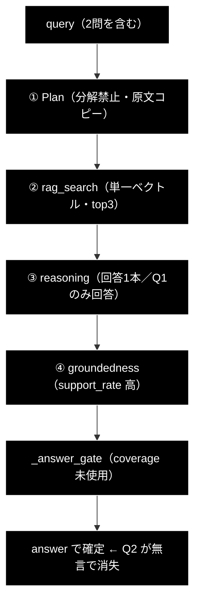
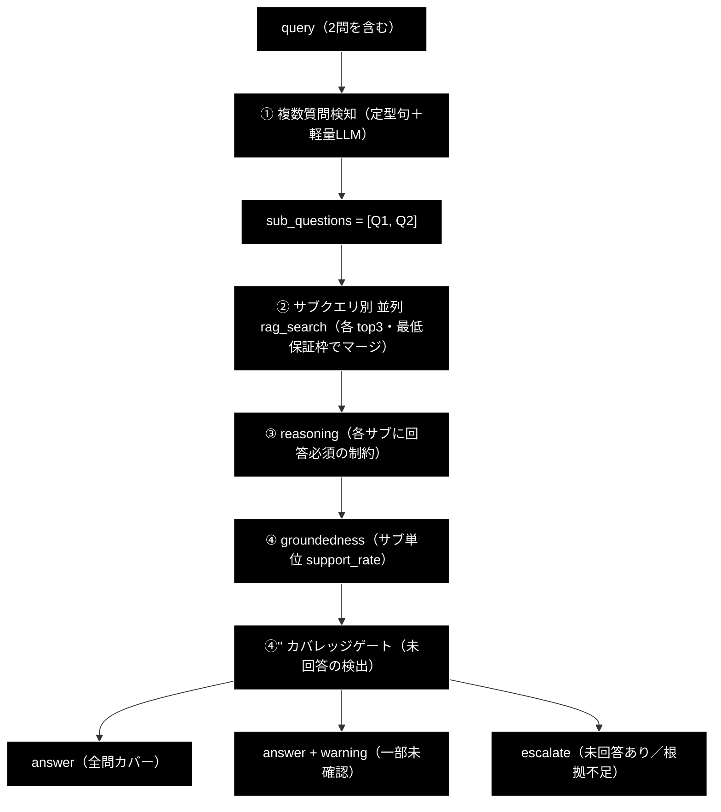
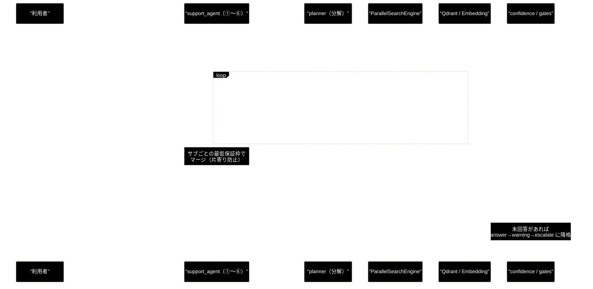
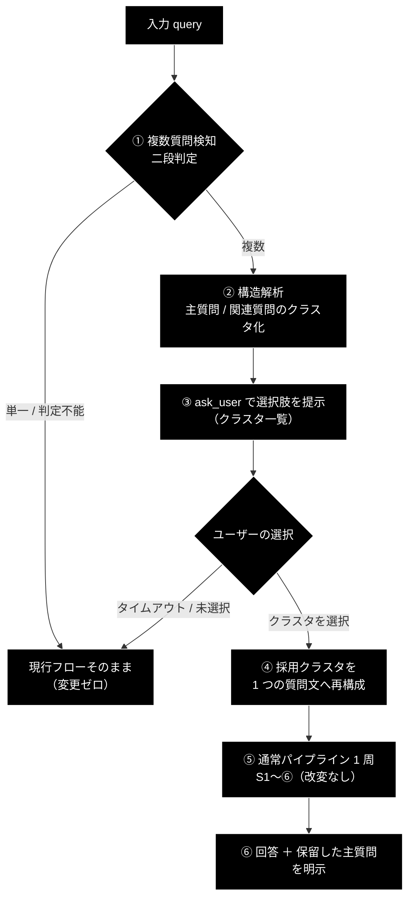

# 複数質問クエリへの対応 — 改善設計提案書

**Version 2.0** | 最終更新: 2026-08-25 | ステータス: **方式決定済み・実装未着手**

> 🎯 **v2.0 で方式が決定した。** §2 の 3 案（A/B/C＝N 問すべてに答える系）ではなく、
> **§13 の絞り込み方式**を採用する。確定した仕様は次の 2 点である。
>
> 1. **選定は対話（`ask_user` 相当）でユーザーが行う** — 自動選定はしない
> 2. **採用したクラスタ（主質問＋関連質問）は、1 つの質問文へ「再構成」してからパイプラインへ渡す**
>
> 確定仕様は **§13** を正とする。§2〜§9（v1.1 由来の fan-out 系ロードマップ）は
> **採用しなかった案の記録**として残す。

> 📌 本書は**設計提案**であり、記載の改修（#1 以降）はまだ実装されていない。実装着手時は §8 の
> 段階導入プランに従い、フェーズごとに受け入れ基準（§9）を満たすこと。
>
> ✅ **v1.2 での重要な変更**: v1.1 が最優先の前提条件としていた **#0（グローバル可変 config の
> 除去）は、本書とは独立に既に実装済み**である（`support_agent.py:242`
> `config = copy.deepcopy(get_config())`）。§1.2 の「現時点で存在する潜在バグ」は**解消済み**で、
> #0 は不要になった。これに伴いサブ質問の並列化の前提条件も外れている（§3.0・§8）。
>
> あわせて、v1.1 執筆（2026-07-25）以降のコード変更に伴う**行番号・定数値のドリフトを全数照合して
> 訂正**した（照合結果は §12）。

---

## 目次

1. [概要](#概要)
2. [問題の所在（コード事実）](#1-問題の所在コード事実)
   - [なぜ support_rate では検知できないか](#11-なぜ-support_rate-では検知できないか)
   - [構造的ブロッカー: グローバル可変 config](#12-構造的ブロッカー-グローバル可変-config現時点で存在する潜在バグ)
   - [ケース分類とパイプライン分割の粒度](#13-ケース分類とパイプライン分割の粒度)
   - [回答を分離すべき理由](#14-回答を分離すべき理由)
3. [改善方針（3案と推奨）](#2-改善方針3案と推奨)
4. [改善モジュール・改善内容 一覧](#3-改善モジュール改善内容-一覧)
5. [処理フロー Before / After](#4-処理フロー-before--after)
6. [データフロー（分解検索）](#5-データフロー分解検索)
7. [リスク・留意点](#6-リスク留意点)
8. [設定項目案](#7-設定項目案)
9. [段階導入プラン](#8-段階導入プラン)
10. [受け入れ基準](#9-受け入れ基準)
11. [関連ドキュメント](#10-関連ドキュメント)
12. [変更履歴](#11-変更履歴)
13. [コード照合結果（v1.2）](#12-コード照合結果v12)
14. [**採用方式: 対話選定 ＋ 質問の再構成（確定仕様）**](#13-採用方式-対話選定--質問の再構成確定仕様)

---

## 概要

GRACE-Support に**複数の質問を1つの入力に含むクエリ**が来たときの、検索・回答・判定の
改善方針をまとめる。

**対象例（自治体 vertical）**:

```
住民票の写しの取り方は？ また、他の市町村に住民票を移動する方法は？
```

- **Q1**: 住民票の写しの**交付申請**（窓口・郵送・コンビニ交付／手数料）
- **Q2**: 他市町村への**転出・転入届**（転出証明書／期限／窓口）

この2問は**別手続き・別担当課・別出典**であり、1つの検索・1つの回答で両立させるのが難しい。

### 結論（先に要点）

検索精度の劣化よりも、**部分回答が「高信頼」として通過してしまう評価の穴**のほうが本質的に
危険である。Q1 だけ答えた回答は、述べた主張がすべて出典に支持されるため **groundedness の
支持率はむしろ高くなり**、`_answer_gate` を `answer` で通過する。結果として **Q2 が無言で
落ちたまま、ユーザーには高信頼の回答として提示される**。

そのため本提案は、**P0（カバレッジによる安全弁）を最優先**とし、その後に検索品質（P1）・
UX（P2）を積み上げる構成をとる。

---

## 1. 問題の所在（コード事実）

現行実装を追った結果、以下の7点が複数質問クエリで問題になる。

| # | 箇所 | 現状 | 複数質問での問題 |
|---|---|---|---|
| 1 | `grace/planner.py:109-111` | **「質問を分解して複数の検索ステップを作らないでください」** と明示的に禁止。計画は `rag_search → reasoning` 固定、`query` は**原文完全コピー**必須（`planner.py:110-111`「要約、キーワード化、分割は一切禁止」） | 2問が1つの検索ステップに潰れる。設計上、分解の逃げ道がない |
| 2 | `agent_tools.py:379`（他 496 / 616） | クエリ全文を `embed_query(query)` で**単一の Dense ベクトル**に変換 | 2トピックの**意味の重心**がボケ、どちらのトピックにも中途半端にしか当たらない |
| 3 | `config.py:492` | `RAG_SEARCH_LIMIT: int = 5`（v1.1 時点は 3。**増えたが解消はしていない**） | 上位5件を**片方のトピックが占有**しやすく、もう一方の根拠が0件になり得る |
| 4 | `grace/executor.py`（reasoning ステップ） | 収集済み観測から**回答を1本**生成 | 出典が偏れば、LLM は根拠のある Q1 だけ答えて Q2 を黙って落とす |
| 5 | `backend/app/core/gates.py:304` | `_answer_gate(support_rate, verified, citation_count, notify_th, confirm_th)` — **coverage を引数に取らない** | ⚠ **最大の危険**。部分回答は support_rate が高くなり `answer` で確定。**未回答が検知されない** |
| 6 | `backend/app/core/verticals.py:21` | `Intent = Literal["question", "request", "incident"]` を**クエリ全体に1つ**割当 | Q1=question / Q2=request のような**意図の混在**を表現できず、強制エスカレ・アクション判定を取りこぼす |
| 7 | `grace/confidence.py:723`（`QueryCoverageCalculator`） | 網羅度を測る仕組みは**存在する**が、`coverage_weight = 0.15`（`grace/config.py:118`）で grace 側の `overall_confidence` にしか効かず、**backend の回答ゲートは未使用** | 「質問のすべての要素をカバーしたか」を測る資産があるのに、**回答/エスカレ判定に反映されていない** |

### 1.1 なぜ support_rate では検知できないか

`GroundednessVerifier` の支持率は次式で、**言及しなかった内容は分母に入らない**。

```
support_rate = supported / (supported + contradicted)     # neutral は分母外
```

Q1 のみを正確に答えた回答は「述べた主張がすべて supported」となり **support_rate ≒ 1.0**。
つまり **「答えなかったこと」は原理的に減点されない**。カバレッジは support_rate とは
**別軸で測る必要がある**（これが §3 の #4・#14 の根拠）。

### 1.2 ~~構造的ブロッカー: グローバル可変 config~~ → **解消済み（v1.2）**

> ✅ **本節が v1.1 で「現時点で存在する潜在バグ」としていた問題は、既に修正されている。**
> 以下は経緯の記録として残す。**前提条件 #0 は不要**である。

**v1.1 当時の問題**: `support_agent.py` がプロファイル適用時にグローバル可変シングルトンを
破壊的に書き換えており、`jobs.py` がジョブごとに `threading.Thread` で並行実行するため、
利用者 A が `gov`、B が `ec` で同時にリクエストすると**後勝ち**で検索スコープと
プロンプト方針が互いに汚染される、というものだった。

**現行コード**（`backend/app/core/support_agent.py:235-242`）:

```python
# ⚠️ get_config() はプロセス共有のシングルトンを返す。この関数は後段で
# config.qdrant.allowed_collections / config.llm.prompt_addendum を
# 業界プロファイルに合わせて書き換えるため、シングルトンをそのまま使うと
# jobs.py がジョブごとに立てるワーカースレッド同士で値を奪い合う
# （gov のリクエストが ec の検索スコープで走る等）。
# リクエスト単位のディープコピーを作り、以降の生成物（planner/executor/
# tools/verifier …）はすべてこのコピーを参照させる。
config = copy.deepcopy(get_config())
```

**リクエスト単位のディープコピー**により、`config.qdrant.allowed_collections`
（`support_agent.py:319`）と `config.llm.prompt_addendum`（同 `:320`）への代入は
**そのリクエストのコピーにしか影響しない**。並行リクエスト間の汚染は起こらない。

なお `contextvars` や引数引き回しではなく **deepcopy** で解決されている点に注意。
サブ質問ごとに異なるプロファイルを持たせたい場合（§1.3 場合2）も、
**サブ質問ごとに config をコピーすれば成立する**ため、並列化の原理的ブロッカーは無い。

**この変更が本提案に与える影響**:

| v1.1 の記述 | v1.2 での扱い |
|---|---|
| #0 を全改修の前提条件とする | **不要**（§3.0 から削除） |
| `sub_question_parallel` は #0 完了まで有効化禁止 | **制約解除**（§7） |
| 段階導入プランの「前提」フェーズ | **削除**（§8） |
| P1 の #10 は「#0 完了が前提」 | **前提なし** |

### 1.3 ケース分類とパイプライン分割の粒度

「質問の数だけパイプラインを走らせる」方針は妥当だが、**どこから分割するかで結論が変わる**。

#### 場合1: 同一業界・同一プロファイル

例: `「住民票の写しの取り方は？ また、他の市町村に住民票を移動する方法は？」`（両方 gov）

**S1 profile はクエリ本文に依存しない**。参照するのは `vertical`（リクエスト単位の
パラメータ、`backend/app/schemas.py:19`）のみであり、同一 vertical なら S1 を N 回実行しても
**毎回まったく同じ結果**となり無駄である。→ **分割点は S1 ではなく ①Plan から**。

| ステップ | 質問ごとに必要か | 理由 |
|---|:--:|---|
| **S1 profile** | ❌ 1回で十分 | `vertical` のみに依存。同一業界なら結果は同一 |
| **① Plan** | ✅ 必要 | 質問ごとに計画が異なる（**分割の起点**） |
| **② Execute（RAG→reasoning）** | ✅ 必要 | 分割の本丸 |
| **③ Groundedness** | ✅ 必要 | サブ回答ごとに支持率を測る |
| **④ Gate / ⑤ Web / ④' no_info** | ✅ 必要 | 「片方だけエスカレ」を可能にする |
| **⑥ Action** | ⚠ **N回は危険** | 副作用の**二重発火**（下記） |

> ⚠ **⑥ Action を素直に N 回実行してはならない。** `send_reply` / `create_ticket` は副作用を
> 伴い（`support_agent.py:186` `backend.execute(...)`）、gov プロファイルは
> `action_map={"申請": "send_reply", "手続": "send_reply", "様式": "send_reply"}`
> （`backend/app/core/verticals.py:103`）である。**例示クエリは Q1「取り方」・Q2「移動する方法」の
> 双方が「手続」に該当し得るため、返信が2通・チケットが2件**という事故になる。
> → **⑥ はサブ質問横断で1回に集約**する（アクション種別で重複排除、本人確認も1回）。

#### 場合2: 異業種・スコープ外が混在

例: `「住民票の写しの取り方は？ ところで、明日の東京の天気は？」`（gov ＋ 業界外）

`vertical` は**リクエストに1つ**しか持てない（`schemas.py:19`
`Optional[Literal["gov","saas","ec"]]`）ため、**「Q1=gov / Q2=業界外」を表現する手段が存在しない**。

`gov` 指定時は `allowed_collections` が
`["gov_faq_anthropic", "gov_laws_anthropic"]`（`verticals.py:100`）に固定されるため、
天気の質問は**自治体コレクションを検索して 0 件 → escalate** となる。

> 📝 **v1.2 訂正**: v1.1 は許可リストに `wikipedia_ja` を含めて記載していたが、
> **2026-08-17 に gov から外されている**（`verticals.py:93-99` のコメント参照。汎用コーパスが
> 自治体の回答の「社内ナレッジ」として提示されるのを避けるため）。
> 汎用コーパスが無くなったぶん、**スコープ外質問が 0 件になる確度はむしろ上がっている**。
**答えられないだけでなく、有人対応へ無駄に流れる**。

→ **この場合は S1（プロファイル選択）自体をサブ質問単位で行う必要がある**。
すなわち分割粒度は次の条件依存となる:

| 条件 | S1 profile | ①Plan 以降 |
|---|:--:|:--:|
| サブ質問の vertical が**同一** | **共有（1回）** | サブ質問ごと |
| サブ質問の vertical が**異なる／業界外を含む** | **サブ質問ごと** | サブ質問ごと |

#### スコープ外質問の扱い（**業務判断が必要**）

「明日の東京の天気」はサポートエージェントの**業務範囲外**である。方針は技術ではなく業務判断で、
3 択がある。

| 方針 | 挙動 | 向くケース |
|---|---|---|
| **A. スコープ外として丁重に断る（推奨）** | 「本件はお答えできません」と明示し、Q1 のみ回答 | 自治体窓口。**無関係な回答をしない**のが誠実 |
| B. `web_search` で答える | 天気にも回答する | 汎用アシスタント寄りの製品 |
| C. 汎用プロファイルへルーティング | 業界外用 profile を新設 | 将来の多業種展開 |

**A を推奨**する。B は「自治体の公式窓口が天気を語る」ことになり、gov の `prompt_addendum`
（"条例・公式案内に基づき、断定を避け…"）とも矛盾する。いずれの方針でも重要なのは
**黙って落とさず「答えられない」と明示すること**である。

#### 質問間の依存関係

例: `「住民票の写しの取り方は？ その手数料は？」` — Q2 は Q1 の文脈に依存する。
独立並列実行では文脈が失われるため、**分解時に「独立／従属」を判定**し、従属なら
**逐次実行＋文脈引き継ぎ**とする。

### 1.4 回答を分離すべき理由

「回答をごっちゃにせず、サブ質問ごとに答える」ことは**必須要件**である。根拠は 3 点。

1. **出典の帰属が壊れる** — 統合回答では、どの出典が Q1 用でどれが Q2 用か判別できず、
   利用者が検証できない。
2. **判定粒度を上げられない** — 現状 `decision` は回答全体で 1 つ（`schemas.py:58`
   `Literal["answer","escalate"]`）。片方が escalate だと**答えられる Q1 まで巻き添え**になる。
   分離すれば「Q1 は自動回答／Q2 のみ有人」が成立する。
3. **カバレッジ検知が確実になる** — サブ回答が構造として存在すれば `unanswered` は
   空欄チェックで判定でき、LLM 評価に頼らず**確実に**未回答を検出できる。

---

## 2. 改善方針（3案と推奨）

> 📌 **v2.0 注記**: 本節以降 §9 までは、**採用しなかった案の記録**である。
> 確定仕様は **§13** を参照。以下の 3 案はいずれも「N 問すべてに答える」前提であり、
> 採用した絞り込み方式（1 クラスタのみに答える）とは方針が異なる。


| 案 | 内容 | 長所 | 短所 |
|---|---|---|---|
| **A. 検知＋カバレッジゲート**（安全弁） | 複数質問を検知し、**未回答があれば warning / escalate** に倒す | 実装が小さく即効。**誤答を防ぐ**。既存フロー不変 | 回答品質そのものは向上しない |
| **B. クエリ分解＋サブ検索**（本命） | サブクエリに分解し**各々で検索**（fan-out）、根拠を統合して1回答 | 両方の質問に根拠が付く。既存の並列基盤を再利用可 | LLM 1回追加＋検索 N 倍のコスト。分解ミスのリスク |
| **C. 構造化回答**（UX） | サブ質問ごとに節立てして回答＋出典を対応付け | 表示が明確。**片方だけエスカレ**が可能になる | スキーマ・フロント双方の変更が必要 |

### 推奨: **A → B → C の段階導入**

まず **A** で「黙って落とす」事故を止め、次に **B** で品質を上げ、最後に **C** で見せ方を整える。

> 💡 **追い風**: `agent_parallel_search.py` の `ParallelSearchEngine` が**そのまま使える**。
> サブクエリ × コレクションの fan-out を、既存の `ThreadPoolExecutor` 並列基盤で捌ける
> （詳細は `docs/agent_parallel_search.md`）。

---

## 3. 改善モジュール・改善内容 一覧

### 3.0 ~~前提条件~~ → **解消済み（v1.2）**

| # | モジュール | 種別 | 状態 |
|---|---|:--:|---|
| ~~**0**~~ | `backend/app/core/support_agent.py` | ~~改修（最優先）~~ | ✅ **実装済み**。`config = copy.deepcopy(get_config())`（`support_agent.py:242`）により、リクエスト単位で config が独立している。並行リクエストの汚染は起こらない（§1.2） |

> ✅ v1.1 が「複数質問対応の前提であると同時に現行の同時実行バグの修正でもある」としていた #0 は、
> **本提案とは独立に対応済み**である。以降の改修に前提条件は無く、**P0 から直接着手できる**。

### 3.1 P0: 安全弁（案A）— 誤答を止める

| # | モジュール | 種別 | 改善内容 |
|---|---|:--:|---|
| 1 | `backend/app/core/gates.py` | 新規関数 | `_detect_multi_question(query)`: 「また/さらに/加えて/併せて」「？」複数、箇条書き等の**定型句判定＋軽量LLM**の二段判定（既存 `_detect_no_info_answer` と同じ設計に揃える） |
| 2 | `backend/app/core/gates.py` | 新規関数 | `_coverage_gate(coverage, decision, warning, th)`: **未回答サブ質問があれば** `answer → answer(warning)`、さらに低ければ `escalate` へ降格 |
| 3 | `backend/app/core/gates.py` | 改修 | coverage の合流。**`_answer_gate` の純関数シグネチャは温存**し、合成は呼び出し側またはラッパ関数で行う（既存テスト・ドキュメントとの整合を保つ） |
| 4 | `backend/app/core/support_agent.py` | 改修 | ③〜④の間に **`④'' サブ質問カバレッジ判定`** を追加。既存の `QueryCoverageCalculator` を backend でも利用。`step="coverage"` の SSE イベントを発行 |
| 5 | `backend/app/schemas.py` | 改修 | `SupportResult` に `sub_questions: List[str]` / `coverage: float` / `unanswered: List[str]` を追加（**すべて optional**） |
| 6 | `grace/config.py` | 改修 | `multi_question_enabled` / `coverage_gate_threshold`（例 0.7）/ `max_sub_questions`（例 4）を追加 |
| 7 | `backend/tests/` | 新規 | 例示クエリで「Q2 未回答なら `answer` にならない」回帰テスト＋**単一質問の挙動不変**テスト |

### 3.2 P1: 分解検索（案B）— 品質を上げる

| # | モジュール | 種別 | 改善内容 |
|---|---|:--:|---|
| 8 | `grace/planner.py` | **改修（要注意）** | `PLAN_GENERATION_PROMPT` の「分解禁止」を**条件付き緩和**。単一意図は現状維持（原文コピー）、**複数意図のときのみ**サブクエリを許可。あわせて**独立／従属**を判定（§1.3。従属は逐次＋文脈引き継ぎ） |
| 9 | `grace/schemas.py` | 改修 | `Plan` / `PlanStep` に `sub_queries: List[str]` / `sub_query_id` / `depends_on_sub` を追加 |
| 10 | `grace/tools.py`・`agent_tools.py` | 改修 | `rag_search` を**サブクエリ × コレクションで fan-out**。`agent_parallel_search.ParallelSearchEngine` を再利用 |
| 11 | `config.py` | 改修 | `RAG_SEARCH_LIMIT`(**=5**) を**サブクエリ単位の予算**へ（例: `per_sub_query_limit=3`、全体上限 `8`）。**片方の枠占有を防ぐ核心** |
| 12 | `agent_tools.py` | 改修 | 統合時に**サブクエリごとの最低保証枠**（round-robin マージ）を導入。単純な score 降順だと再び片寄る |
| 13 | `grace/executor.py` | 改修 | reasoning プロンプトに「**各サブ質問に漏れなく答える**」制約を追加し、サブクエリ別に整理した観測を注入 |
| 14 | `grace/confidence.py` | 改修 | `GroundednessVerifier` の支持率を**サブ質問単位でも算出**（§1.1 の穴を塞ぐ） |
| **15** | `backend/app/core/support_agent.py` | **改修（重要）** | **①Plan〜④' をサブ質問単位でループ**（§1.3 の分割粒度表）。S1 は vertical 同一なら共有、異なれば サブ質問ごと。SSE は `sub_id` 付きでイベント発行 |
| **16** | `backend/app/schemas.py` | **改修（P2 から前倒し）** | `SubAnswer{question, answer, citations, decision, unanswered_reason}` を導入し `SupportResult.sub_answers` に格納。**出典帰属と判定粒度に必須**のため P1 で実施（§1.4） |
| **17** | `backend/app/core/support_agent.py` | **新規（安全上重要）** | **⑥ Action をサブ質問横断で 1 回に集約**。アクション種別で重複排除し、本人確認も 1 回に統合。**`send_reply` / `create_ticket` の二重発火を防止**（§1.3） |

### 3.3 P2: スコープ制御・UI（案C）

| # | モジュール | 種別 | 改善内容 |
|---|---|:--:|---|
| 18 | `backend/app/core/gates.py` | 新規関数 | `_classify_scope(sub_question, profile)`: サブ質問が**業界スコープ内か**を判定。スコープ外は検索せず「お答えできません」を明示（**方針A**・§1.3） |
| 19 | `backend/app/core/verticals.py`<br>`backend/app/schemas.py` | 改修 | **サブ質問ごとの vertical 解決**に対応（リクエストの単一 `vertical` を既定値とし、サブ質問側で上書き可能に）。`Intent` もサブ質問単位（`List[Intent]`）へ |
| 20 | `backend/app/core/gates.py` | 改修 | `_should_force_escalate` / `_decide_action` を**サブ質問ごとに評価**（Q1 は自動回答・Q2 のみ有人） |
| 21 | `frontend/src/components/AnswerCard.tsx` | 改修 | サブ質問ごとの節・出典・「この件は有人対応」「対応範囲外」バッジを表示 |
| 22 | `grace/planner.py` | 改修 | 分解が曖昧なときは `ask_user`（聞き返し）へフォールバック |
| 23 | `docs/multi_question_handling.md`（本書） | 改修 | 実装完了時にステータスを更新し、確定したしきい値・運用を反映 |

---

## 4. 処理フロー Before / After

### 4.1 Before（現行）— 事故が起きる経路



### 4.2 After（P0 + P1）— 安全弁と分解検索



---

## 5. データフロー（分解検索）



### 5.1 データ変換の段階

| 段階 | データ形 | 説明 |
|:--:|------|------|
| 入力 | `query: str` | 複数質問を含む原文 |
| 分解 | `sub_questions: List[str]` | 意図単位に分割（原文も検索に併用） |
| 検索 | `Dict[sub_query, List[Dict]]` | サブクエリごとのヒット（`score` 付き） |
| マージ | `List[Dict]` | サブごと最低保証枠を確保しつつ統合 |
| 回答 | `answer: str`（P2 では `List[SubAnswer]`） | 各サブ質問に対応する回答 |
| 判定 | `decision` / `warning` / `unanswered` | カバレッジを加味した最終判定 |

---

## 6. リスク・留意点

- **「原文コピー」設計には理由がある**。`grace/planner.py:102-110` は、単語羅列化するとベクトル
  検索の精度が落ちるため原文維持を求めている。よって分解は**原文検索を残したまま追加**する
  （原文＋サブクエリの併用）方式が安全。**単一質問時の挙動は1ミリも変えない**こと。
- **コスト**: 分解 LLM 1回＋検索 N 倍。ただし P0 の検知だけなら定型句判定で**ほぼ無料**
  （軽量 LLM は疑わしいときのみ呼ぶ二段判定）。
- **support_rate の分母問題**（§1.1）: 「言及しなかった Q2」は分母に入らない。
  **カバレッジは別軸で測る**必要がある。
- **過剰分解の防止**: 「A と B の違いは？」は**1問**であり分解してはいけない。
  `max_sub_questions` の上限に加え、分解後に**意味が保存されているか**の検証を入れる。
- **副作用の二重発火**（§1.3）: ⑥ Action をサブ質問ごとに実行すると `send_reply` /
  `create_ticket` が重複する。**必ず横断で 1 回に集約**すること。本人確認も 1 回に統合する。
- ~~**並行実行の前提**~~ → **解消済み（v1.2）**: `copy.deepcopy(get_config())` によりリクエスト単位で
  config が独立したため、サブ質問どうしが検索スコープを奪い合う問題は無い（§1.2）。
  サブ質問ごとに異なるプロファイルを持たせる場合も、**サブ質問ごとに config をコピーすれば成立する**。
- **レイテンシの N 倍化**: パイプライン 1 周は Plan・reasoning・groundedness・no_info 等で
  **LLM を複数回**呼ぶ。N 質問を素直に N 周すると N 倍になる。緩和策は「複数意図と判定された
  ときのみ発火（単一質問は現状のまま＝性能劣化ゼロ）」＋「サブ質問の並列化」。
- **既存互換**: 新規スキーマフィールドはすべて optional にし、旧フロントエンド・既存 API
  クライアントが壊れないようにする。SSE も新規 `step` / `sub_id` の追加のみに留める。
- **しきい値の二重管理を避ける**: `coverage_gate_threshold` は vertical プロファイル
  （`notify_th`/`confirm_th`）と整合させ、業界別に上書き可能な形にする。

---

## 7. 設定項目案

| キー | 既定案 | 配置 | 用途 |
|-----|-------|------|------|
| `multi_question_enabled` | `True` | `grace/config.py` | 複数質問検知・カバレッジゲートの有効化 |
| `coverage_gate_threshold` | `0.7` | `grace/config.py` | この値未満なら `warning`／大幅未満なら `escalate` |
| `max_sub_questions` | `4` | `grace/config.py` | 過剰分解の上限 |
| `per_sub_query_limit` | `3` | `config.py` | サブクエリ単位の検索件数予算（現 `RAG_SEARCH_LIMIT` 相当） |
| `total_search_limit` | `8` | `config.py` | マージ後の全体上限 |
| `decompose_model` | `claude-haiku-4-5-20251001` | `grace/config.py` | 分解・検知に使う軽量モデル |
| `sub_question_parallel` | `False` | `grace/config.py` | サブ質問の並列実行。**#0 解消により原理的な禁止は無くなった**（§1.2）。既定 `False` はレイテンシとコストの都合 |
| `out_of_scope_policy` | `"decline"` | `grace/config.py` | スコープ外の扱い。`decline`（方針A・推奨）/ `web` / `general_profile` |
| `action_dedup_enabled` | `True` | `grace/config.py` | ⑥ Action のサブ横断重複排除（二重発火防止） |

> 📝 **注意**: LLM は Anthropic Claude（既定 `claude-sonnet-4-6`／軽量
> `claude-haiku-4-5-20251001`）、Embedding は Gemini（`gemini-embedding-001`）というプロバイダ
> 方針は本提案でも維持する。分解・検知は**軽量モデル**で十分。

---

## 8. 段階導入プラン

| フェーズ | 対象 # | 概要 | 想定規模 |
|:--:|---|---|---|
| ~~前提~~ | ~~#0~~ | ✅ **解消済み**（§1.2・§3.0） | — |
| **P0** | #1–#7 | 複数質問の検知とカバレッジゲート（安全弁） | 小（backend 中心・既存資産の再利用） |
| **P1** | #8–#17 | サブクエリ分解・fan-out 検索・**サブ質問単位のパイプライン**・**構造化回答**・**Action 集約** | 中〜大（planner/executor/tools/schemas に波及） |
| **P2** | #18–#23 | スコープ外制御・サブ質問ごとの vertical/Intent・UI | 中（backend＋フロント） |

**前提条件が無くなったため、P0 から直接着手できる。**

**P0 が入れば、P1 以降が遅れても最も見つけにくい失敗**（片方の質問が黙って消え、
しかも高信頼と表示される）を止められる。P0 は単独でリリース可能にすること。

> ⚠️ **P1 の要否は再検討の余地がある。** P1（全サブ質問に fan-out して全部答える）は
> レイテンシ N 倍・⑥ Action の二重発火（#17）・サブ質問ごとの vertical 解決（#19）という
> 重い課題を伴う。「**主質問を 1 つに絞り、採用しなかった質問を明示する**」という
> 絞り込み方式なら、これらを原理的に回避できる。§13 に検討中の代替案として記載する。

> 📝 **v1.0 からの変更**: 構造化回答（`SubAnswer`）は「出典の帰属」「判定粒度」に必須のため
> **P2 → P1 へ前倒し**した。また ⑥ Action の集約（#17）を安全上の必須項目として P1 に追加した。

---

## 9. 受け入れ基準

| フェーズ | 受け入れ基準 |
|---|---|
| ~~**#0**~~ | ✅ **達成済み**。`copy.deepcopy(get_config())` によりリクエスト単位で config が独立（§1.2）。<br>※ ただし**並行リクエストの回帰テストは未整備**。P0 着手時に併せて追加することを推奨 |
| **P0** | ① 例示クエリで Q2 未回答なら **`answer` にならない**（`warning` または `escalate`）<br>② **単一質問クエリの判定結果が完全に不変**（回帰テストで担保）<br>③ `coverage` / `unanswered` が `SupportResult` に格納され SSE で観測できる |
| **P1** | ① 例示クエリ（場合1）で **Q1・Q2 の両方に出典が付き、`sub_answers` として分離**される<br>② 単一質問クエリのレイテンシが悪化しない（分解は複数意図時のみ発火）<br>③ マージ後に片方のサブクエリの根拠が 0 件にならない<br>④ **`send_reply` / `create_ticket` が 2 回発火しない**（Action 集約・#17）<br>⑤ 従属質問（「その手数料は？」）で文脈が失われない |
| **P2** | ① 例示クエリ（場合2）で **Q1 は gov で回答・Q2 は「対応範囲外」と明示**され、有人対応に無駄に流れない<br>② サブ質問ごとに回答・出典・エスカレ粒度が UI に表示される<br>③ Q1 は自動回答・Q2 のみ有人、という混在ケースが成立する |

---

## 10. 関連ドキュメント

| ドキュメント | 内容 |
|---|---|
| `docs/agent_parallel_search.md` | `ParallelSearchEngine`（P1 の fan-out で再利用する並列基盤） |
| `backend/docs/core_gates.md` | `_answer_gate` 等の純関数群 IPO 詳細（P0 の改修対象） |
| `backend/docs/core_support_agent.md` | ①〜⑥ パイプライン（`④''` を挿入する箇所） |
| `backend/docs/confidence_flow_grace_vs_backend.md` | grace/ と backend/app/ の判定フロー比較（coverage 未使用の背景） |
| `grace/docs/confidence_calibration.md` | 信頼度測定・較正の処理順（support_rate / coverage の定義） |

---

## 11. 変更履歴

| バージョン | 変更内容 |
|-----------|---------|
| 1.0 | 初版作成（複数質問クエリの問題分析・3案比較・改善モジュール20項目・段階導入プランP0〜P2。**提案段階／未実装**） |
| **2.0** | **方式決定。** §2 の 3 案（N 問すべてに答える系）ではなく **絞り込み方式**を採用し、§13 を**確定仕様**として全面改稿した。決定事項は ①**選定は対話（`ask_user` 相当）でユーザーが行う**（自動選定はしない）、②**採用クラスタ（主質問＋関連質問）を 1 つの質問文へ再構成**してからパイプラインへ渡す、の 2 点。あわせて ③再構成が `planner.py` の「完全一致コピー」規則と衝突しないこと（再構成は**前処理**であり、planner から見れば再構成後の文が「元の質問文」）を明記、④既存 HITL 機構の適合を調査し、`InterventionRequest.options` と `InterventionResponse.selected_option` は**既に存在**するが `resolve(intervention_id, approve: bool)` と `POST /api/support/confirm` が **boolean のみ**で要拡張であることを特定、⑤`QuestionCluster` / `deferred_questions` / `reconstructed_query` のスキーマ追加を必須項目として定義、⑥**クラスタが 1 つなら選択を出さない**分岐を追加（不要な往復を避ける）。§2〜§9（#8〜#23 の fan-out 系）は**採用しなかった案の記録**として残す |
| 1.2 | **コード照合による最新化（§12）。** ①**#0（グローバル可変 config の除去）が既に実装済み**であることを確認し、§1.2 を「解消済み」へ全面改稿。前提条件フェーズを廃止し、**P0 から直接着手可能**にした（§3.0・§8・§9）。`sub_question_parallel` の禁止制約も解除（§7）。②`RAG_SEARCH_LIMIT` が **3 → 5** に変更されていた（問題は残るが深刻度は低下）。③gov プロファイルから **`wikipedia_ja` が削除済み**（2026-08-17）であることを反映。④引用行番号 8 箇所を実測値へ訂正。⑤P1 の要否に再検討余地がある旨と、**絞り込み方式の代替案（§13）**を追記 |
| 1.1 | レビュー反映。①**§1.2 構造的ブロッカー**（グローバル可変 config による並行実行汚染＝現行の潜在バグ）を追加し、前提条件 **#0** として最優先化。②**§1.3 ケース分類**を追加（場合1: 同一業界／場合2: 異業種・スコープ外）。**分割点は S1 ではなく ①Plan** であること、vertical が異なる場合のみ S1 も分割することを明確化。③**⑥ Action の二重発火リスク**と横断集約（#17）を追加。④**スコープ外質問の方針**（A: 丁重に断る＝推奨）と**質問間の依存**（独立／従属）を追加。⑤**§1.4 回答分離の根拠**を明文化し、構造化回答（`SubAnswer`）を **P2 → P1 へ前倒し**。⑥設定・リスク・受け入れ基準を上記に合わせて更新（改善項目 20 → 23） |

---

## 12. コード照合結果（v1.2）

2026-08-25 時点の `master`（`de38e81`）に対し、本書の引用箇所を**全数照合**した結果。

### 訂正した箇所

| # | v1.1 の記述 | 実測 | 影響 |
|---|---|---|---|
| 1 | `support_agent.py` がシングルトンを破壊的に書き換え＝**潜在バグ** | `copy.deepcopy(get_config())`（`:242`） | 🔴 **#0 が不要に**。ロードマップの前提が消えた |
| 2 | `config.py:486` `RAG_SEARCH_LIMIT = 3` | `config.py:492` **`= 5`** | 🟠 「上位3件を片方が占有」の深刻度が低下（解消はせず） |
| 3 | gov の許可コレクションに `wikipedia_ja` を含む | `["gov_faq_anthropic", "gov_laws_anthropic"]`（`verticals.py:100`） | 🟠 スコープ外質問が 0 件になる確度は**上がった** |
| 4 | `gates.py:208` `_answer_gate` | `gates.py:304` | 🟡 行番号のみ |
| 5 | `confidence.py:659` `QueryCoverageCalculator` | `confidence.py:723` | 🟡 行番号のみ |
| 6 | `grace/config.py:103` `coverage_weight` | `grace/config.py:118` | 🟡 行番号のみ |
| 7 | `planner.py:108` / `:109-110` | `planner.py:109` / `:110-111` | 🟡 行番号のみ |
| 8 | `agent_tools.py:330` `embed_query` | `agent_tools.py:379`（他 496 / 616） | 🟡 行番号のみ |
| 9 | `support_agent.py:152-153`（Action 副作用） | `support_agent.py:186` `backend.execute(...)` | 🟡 行番号のみ |
| 10 | `verticals.py:62` `action_map` | `verticals.py:103` | 🟡 行番号のみ |
| 11 | `jobs.py:110` `threading.Thread` | `jobs.py:189` | 🟡 行番号のみ |

### 変更が無かった（引用が有効な）箇所

| 項目 | 実測 |
|---|---|
| `planner.py` の分解禁止（「質問を分解して複数の検索ステップを作らないでください」「分割は一切禁止」） | ✅ 現存 |
| `verticals.py:21` `Intent = Literal["question", "request", "incident"]` | ✅ 一致 |
| `schemas.py:19` `vertical: Optional[Literal["gov","saas","ec"]]` | ✅ 一致 |
| `schemas.py:67` `decision: Literal["answer","escalate"]` | ✅ 一致（v1.1 は `:58` と記載。行番号のみ差） |
| `_answer_gate` が coverage を引数に取らない | ✅ 現存（**§1 の最大の問題は未解決**） |
| `SupportResultModel` にサブ質問を保持するフィールドが無い | ✅ 現存（20 フィールドを確認） |
| §10 の関連ドキュメント 5 件 | ✅ すべて実在 |

### 照合コマンド

```bash
grep -n '質問を分解して複数の検索ステップ' grace/planner.py
grep -n 'RAG_SEARCH_LIMIT: int' config.py
grep -n '^def _answer_gate' backend/app/core/gates.py
grep -n '^class QueryCoverageCalculator' grace/confidence.py
grep -n -A22 'class SupportResult' backend/app/schemas.py
```

---

## 13. 採用方式: 対話選定 ＋ 質問の再構成（**確定仕様**）

> ✅ **本節が確定仕様である。** §2〜§9 の fan-out 系ロードマップ（#8〜#23）は
> 採用しなかった案の記録として残す。

### 13.1 決定事項

| 論点 | 決定 |
|---|---|
| 全問に答えるか / 絞るか | **絞る**。1 リクエストで 1 クラスタに回答する |
| 選定主体 | **A. ユーザーが対話で選ぶ**（`ask_user` 相当・1 往復増）。自動選定はしない |
| 採用単位 | **クラスタ ＝ 主質問 ＋ その配下の関連質問** |
| パイプラインへ渡す質問 | クラスタを **1 つの質問文へ再構成**したもの |
| 採用しなかった主質問 | **成果物として明示的に返す**（必須） |
| 検知失敗時 | **「単一質問」とみなす**（＝現行動作を維持） |

### 13.2 処理フロー



### 13.3 クラスタと再構成

**採用単位は「主質問」ではなく「主質問 ＋ その配下の関連質問」のクラスタ**とする。
関連質問は主質問に**従属**しており、切り離すと主質問の回答自体が不完全になるためである。

| 入力 | 構造 | 挙動 |
|---|---|---|
| 「住民票の取り方は？ **その手数料は？**」 | クラスタ 1 つ（主 1 ＋ 関連 1） | **複数質問だが選択不要**。再構成して 1 周 |
| 「住民票の取り方は？ **他市町村への移動は？**」 | クラスタ 2 つ（主 2） | **選択が必要**。`ask_user` で提示 |
| 「住民票の取り方は？ その手数料は？ 他市町村への移動は？」 | クラスタ 2 つ（主 1＋関連 1 / 主 1） | 選択が必要。選んだ側の関連質問も一緒に答える |

> 📝 **クラスタが 1 つしかない場合は `ask_user` を出さない。** 「複数質問だがクラスタは 1 つ」
> （＝主質問 1 ＋ 関連質問 N）は選択の余地が無いため、再構成してそのまま実行する。
> 不要な往復を増やさないための分岐である。

#### 再構成（reconstruct）

採用クラスタを、**自然言語の 1 文へ組み直してから**パイプラインへ渡す。

```
主質問  : 住民票の写しの取り方は？
関連質問: その手数料は？
   ↓ 再構成
「住民票の写しの取り方と、その手数料を教えてください」
```

**再構成する理由**は 2 つある。

1. **指示語を解決するため。** 「**その**手数料」は単体では何の手数料か不明で、
   ベクトル検索がまったく効かない。主質問の文脈を埋め込む必要がある。
2. **原文をそのまま連結すると別トピックのノイズが混じるため。** 採用しなかった主質問の
   文字列が残ると、検索の意味の重心がボケる（§1 の #2 と同じ問題）。

> ⚠️ **`planner.py` の「完全一致でコピー」規則とは衝突しない。**
> `grace/planner.py:110-111` が禁じているのは**要約・キーワード化・分割**であり、
> `:103-105` はむしろ「単語の羅列に変換せず、**自然言語の文脈を維持**せよ」と求めている。
> 再構成は**自然言語の 1 文を保つ**変換であり、この意図に沿う。
>
> かつ、**再構成はパイプラインの外側（前処理）で行う**。
> `run_support_agent_core(query=<再構成後の質問>)`（`support_agent.py:194-195`）として渡すため、
> planner から見れば再構成後の文が「ユーザーの元の質問文」であり、それを完全一致でコピーする。
> **planner・executor・gates は一切改変しない。**

### 13.4 既存機構との適合（調査済み）

`ask_user` 相当の対話は、**既存の HITL 機構をほぼそのまま使える**。

| 要素 | 現状 | 本方式で必要か |
|---|---|---|
| `InterventionRequest.options: Optional[List[str]]` | ✅ **既に存在**（`grace/intervention.py:34`） | そのまま使える |
| `InterventionResponse.selected_option: Optional[str]` | ✅ **既に存在**（`grace/intervention.py:64`） | そのまま使える |
| `InterventionBridge.resolver()` | ✅ 存在（`intervention_bridge.py:62`）。承認が来るまでブロックする同期リゾルバ | そのまま使える |
| SSE の `type="intervention"` イベント | ✅ 存在（`intervention_bridge.py:71`） | そのまま使える |
| **`InterventionBridge.resolve(intervention_id, approve: bool)`** | ⚠️ **boolean のみ**（`intervention_bridge.py:114`） | 🔴 **要拡張** |
| **`POST /api/support/confirm` の `approve: bool`** | ⚠️ **boolean のみ**（`schemas.py:47`・`api/support.py:72`） | 🔴 **要拡張** |
| `grace/tools.py:924` の `ask_user` ツール | エージェントが**実行中に**呼ぶツール | ❌ 本方式では使わない（前処理で行うため） |

> 💡 **データモデルは既に N 択に対応している。** 足りないのは
> **bridge と API が `selected_option` を運べないこと**だけで、
> `resolve(intervention_id, approve)` に `selected_option: Optional[str]` を足す
> 後方互換の拡張で足りる（既存の承認/拒否は `approve` のみで従来どおり動く）。

### 13.5 スキーマ追加（**必須**）

> 🔴 **採用しなかった主質問を成果物として返せないと、本書 §概要が「最も危険」とした事故**
> （片方が無言で落ち、しかも `support_rate` が高いため高信頼として提示される）
> **と区別がつかなくなる。**

現行 `SupportResultModel`（`backend/app/schemas.py:60-80`）の 20 フィールドを確認したが、
質問の構造を保持するフィールドは 1 つも無い。以下を **すべて optional** で追加する。

| フィールド | 型 | 内容 |
|---|---|---|
| `is_multi_question` | `bool` | 複数質問と判定されたか（既定 `False`） |
| `question_clusters` | `List[QuestionCluster]` | 解析した全クラスタ |
| `adopted_cluster_index` | `Optional[int]` | 採用したクラスタの位置 |
| `reconstructed_query` | `Optional[str]` | 再構成後の質問文（**原文と別に保持**） |
| `deferred_questions` | `List[str]` | 採用しなかった主質問 |

```python
class QuestionCluster(BaseModel):
    main: str                              # 主質問
    related: List[str] = Field(default_factory=list)   # 従属する関連質問
```

`reconstructed_query` を原文と別に持つのは、**利用者が「何を質問として解釈されたか」を
検証できるようにする**ためである。再構成は LLM が行うため、誤りうる。

### 13.6 検知の二段判定

既存の `_detect_no_info_answer` / `_should_force_escalate` と同じ二段構えにする。

| 段 | 内容 |
|---|---|
| 第 1 段 | キーワード部分一致（LLM 呼び出しゼロ）。「また」「さらに」「加えて」「併せて」「ところで」「？」の複数出現 |
| 第 2 段 | 第 1 段が一致したときだけ軽量 LLM で構造解析（主質問 / 関連質問のクラスタ化） |

> ⚠️ **「安全側」の向きが既存機構と逆である。**
>
> | 機構 | 安全側 |
> |---|---|
> | `_detect_no_info_answer` 等 | **escalate**（答えない方が安全） |
> | **複数質問検知** | **「単一とみなす」**（＝現行動作維持。誤って分解する方が害が大きい） |
>
> §6 の「単一質問時の挙動は 1 ミリも変えない」と整合する。

#### 過剰分解の防止

| 入力 | 正しい判定 |
|---|---|
| 「A と B の違いは？」 | **単一**（1 つの比較質問） |
| 「住民票と戸籍謄本、どちらが必要ですか？」 | **単一**（選択を求める 1 問） |
| 「手続きと持ち物を教えて」 | **単一**（1 つの手続きの 2 側面）と扱う |
| 「A の取り方は？ また、B の方法は？」 | 複数（クラスタ 2） |

「？」の数で数えてはならない。`max_sub_questions` の上限に加え、
**クラスタ化後に意味が保存されているか**の検証を入れる。

### 13.7 実装順序

| 順 | 内容 | 対象 | 規模 |
|:--:|---|---|:--:|
| **1** | `QuestionCluster` / `SupportResult` のスキーマ追加 | `backend/app/schemas.py`<br>`backend/app/core/support_agent.py` | 小 |
| **2** | `_detect_multi_question` ＋ クラスタ化（二段判定） | `backend/app/core/gates.py` | 小 |
| **3** | 再構成関数 `reconstruct_query(cluster)` | `backend/app/core/gates.py` | 小 |
| **4** | `resolve` / `POST /api/support/confirm` に `selected_option` を後方互換で追加 | `intervention_bridge.py`<br>`schemas.py` / `api/support.py` / `jobs.py` | 小 |
| **5** | 前処理としてパイプラインの手前に組み込み（クラスタ 1 個なら `ask_user` を出さない分岐を含む） | `backend/app/core/support_agent.py` | 中 |
| **6** | フロント: クラスタ選択 UI ＋ 保留質問・再構成後クエリの表示 | `frontend/src/components/` | 中 |
| **7** | 回帰テスト（**単一質問の挙動が不変**であること／並行リクエスト） | `backend/tests/` | 小 |

**§2〜§9 の #8〜#23（fan-out 系）は実施しない。**
本方式では ⑥ Action の二重発火（#17）・サブ質問ごとの vertical 解決（#19）・
fan-out 検索（#10〜#12）・サブ質問単位のパイプライン（#15）が**すべて不要**になる。
カバレッジゲート（#2〜#4）も、「1 つ採用」を明示する以上は測定対象ではないため不要。

### 13.8 受け入れ基準

| # | 基準 |
|---|---|
| 1 | **単一質問クエリの判定結果・レイテンシが完全に不変**（回帰テストで担保） |
| 2 | 主質問が複数のとき `ask_user` 相当の選択が提示され、選択するまでパイプラインが進まない |
| 3 | **クラスタが 1 つのとき（主 1 ＋ 関連 N）は選択を出さず**、再構成して 1 周する |
| 4 | 「その手数料は？」型の指示語が**再構成で解決**され、検索が 0 件にならない |
| 5 | 採用しなかった主質問が `deferred_questions` に入り、UI に表示される |
| 6 | `reconstructed_query` が原文と別に保持され、利用者が解釈を検証できる |
| 7 | 選択がタイムアウトした場合、**現行どおり単一質問として処理**される（ハングしない） |
| 8 | `send_reply` / `create_ticket` が 2 回発火しない（1 周しか回らないため原理的に担保） |

### 13.9 残るリスク

- **1 往復増える。** 自治体窓口のような用途では負担になり得る。運用で問題が出た場合は、
  §13.1 の「選定主体」だけを B（自動選定＋事後表示）へ変える余地を残す
  （スキーマ・再構成・保留質問の明示はそのまま流用できる）。
- **再構成の誤り。** LLM が主質問の意図を取り違えると、誤った質問に答えることになる。
  `reconstructed_query` を UI に表示し、利用者が気付けるようにすることで緩和する。
- **クラスタ化の誤り。** 独立した質問を「関連質問」と誤判定すると、選択肢に現れず
  黙って一緒に答えられてしまう。過剰分解の逆方向の失敗であり、§13.6 の検証で抑える。
