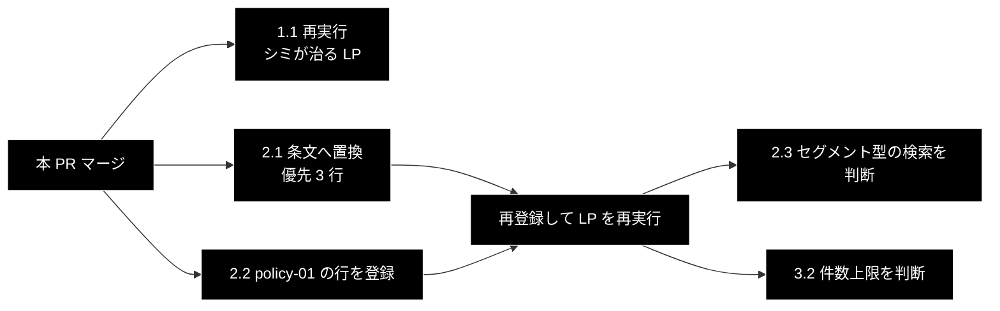

# GRACE-Review 規程 RAG の整備 TODO

**Version 2.0** | 作成日: 2026-09-30 | 最終更新: 2026-09-30 | 対象コミット: `608482c`（master）＋本 PR

---

## 目次

- [0. 現在地](#0-現在地)
- [1. P0 — 次にやること（利用者）](#1-p0--次にやること利用者)
- [2. P1 — 根拠の質を上げる](#2-p1--根拠の質を上げる)
- [3. P2 — 設計の見直し・評価が要るもの](#3-p2--設計の見直し評価が要るもの)
- [4. 見送りと理由](#4-見送りと理由)
- [5. 実行順序](#5-実行順序)
- [6. 変更履歴](#6-変更履歴)

---

## 0. 現在地

GRACE-Review の実行結果（2026-09-29 / 2026-09-30）から見つかった問題への対応と、規程コレクション
`ec_ad_rules_anthropic` の登録・登録後の実測までが済んだ状態からの、**残タスクの一覧**である。
設計は [`backend/docs/review_flow.md`](../backend/docs/review_flow.md)、登録手順は
[`backend/docs/data_pipeline.md`](../backend/docs/data_pipeline.md) 付録 A。

### 0.1 済んだこと

| # | 内容 | 反映先 |
|---|---|---|
| 1 | 規程未登録時の根拠・条文引用へ、LLM 向けの指示文が漏れていたのを止めた（`RuleItem.public_description()`）。③④ を並列化 | PR #229 |
| 2 | ② Retrieve の並列化 / 確信度に判定率の減衰（`damp_support_rate`）/ 規程 CSV と検索クエリを要旨へ | PR #230 |
| 3 | `qa_output/ec_ad_rules.csv` の差し替えと鮮度テスト / 案内文と付録 A に `--no-create-ui-csv` | PR #231・#232 |
| 4 | 条文置換用の雛形 `qa_output/ec_ad_rules_statutes_template.csv` | PR #233 |
| 5 | `ec_ad_rules_anthropic` の登録（23 件・3072 次元・payload に `topic` あり） | 利用者 2026-09-30 |
| 6 | ⑥ Web 裏取りを並列化し全体の待ちを 10 秒（`GRACE_REVIEW_WEB_TIMEOUT`）で打ち切る。`web_checked` は検索が結果を返したルールにだけ付ける。遅延生成クライアント（Qdrant / Embedding / Sparse）の重複作成をロックで防止 | 本 PR |

### 0.2 実測（2026-09-30・登録後）

| 項目 | 結果 |
|---|---|
| 登録内容 | 23 件・`size: 3072`・Cosine・payload に `topic` が入っている |
| OK 例（指摘 0 件を期待） | 0 件（期待どおり）。返品「未開封」と規程「未使用・未開封」の粒度差は指摘されない |
| NG 例（表記漏れ LP・同じ文書） | **14 秒から 8 秒**。指摘は同じ 4 件。表記漏れ系の根拠は RAG の 1 件（自ルールの行）に。② Retrieve は約 5 秒から約 1.4 秒 |
| 「シミが治る」LP | **69 秒から 44 秒**。指摘 11 件で前回と同じ（高 7・中 4・強制 high 3・確定 8・要確認 3）。44 秒のうち約 23 秒は 2 回目の Web 検索（SerpAPI）の遅延で、それを除くと約 21 秒（**推定**。遅延の有無を分けた再実行はしていない）。429 は出ていない |
| 確信度 | 減衰が効いた。yakki-02 は 0.82（3 主張中 判定できたのは 1）、yakki-04 は 0.89、tokusho-05 は 0.98。neutral が無い指摘は 1.00 |
| 未確認 | 本 PR の Web 打ち切り・クライアント重複作成の修正を実 API で走らせた結果（スタブでの検証のみ） |

---

## 1. P0 — 次にやること（利用者）

### 1.1 本 PR のマージ後、「シミが治る」LP をもう一度実行する

- 所要時間が、Web 検索の遅延に左右されなくなったかを見る（Web が遅くても、全体は約 21 秒 + 最大 10 秒程度に収まるはず）。
- 画面の「Web 裏取り済み」バッジが、実際に検索が返った指摘にだけ付くか（遅延・失敗した指摘には付かない）。
- サーバー起動直後の**最初の**リクエストで、`GeminiEmbedding initialized` / `Initializing SparseEmbedding` / `Sparse EmbeddingClient キャッシュ作成` が **1 回ずつ**になるか（以前は 4 回ずつ）。

---

## 2. P1 — 根拠の質を上げる

### 2.1 `answer` を実際の条文・ガイドラインへ置き換える（利用者・法務監修）

**登録内容は要旨のままなので、根拠の中身は条文フォールバックと同じ**である。RAG が意味を持つのは置換後。

- 雛形: [`qa_output/ec_ad_rules_statutes_template.csv`](../qa_output/ec_ad_rules_statutes_template.csv)。`answer` の要旨は残し、後ろへ `【条文】…` を書き足す。登録は `--recreate --no-create-ui-csv`。
- **優先順は、実測で neutral が出た行**（要旨に決め手が無く、判定できなかった主張がある行）:
  1. `yakki-02`（化粧品の効能範囲逸脱）— 3 主張中 2 が neutral（確信度 0.82）
  2. `yakki-04`（安全性の保証表現）— 2 主張中 1 が neutral（0.89）
  3. `tokusho-05`（事業者名・住所・連絡先）— 4 主張中 1 が neutral（0.98）
- 最初は 3〜4 行だけで試し、再登録後に「シミが治る」LP で確信度が上がるかを見る。
- 誤った条文は指摘そのものを誤らせる。監修を通してから本番運用する。e-Gov の URL は雛形に入れたが、開いて確認していない。

### 2.2 `policy-01` 用に取引条件の行を `ec_policy_anthropic` へ足す（利用者）

登録後の実行でも policy-01 の根拠は無関係な FAQ 5 件のまま（スコア 0.7543 / 0.7398 / 0.7281 / 0.7261 / 0.7222 で絞れない）。
取引条件を 1 行にまとめた行を足すと当たりやすくなる（付録 A の 3-3）。中身は**実際の自社規程**。
⚠️ `--recreate` は付けない（既存 FAQ が消える）。`--no-create-ui-csv` は付ける。

### 2.3 セグメント型ルールでも「そのルール自身の文」で検索する（提案・要判断）

キーワード型（keihyo-03/04/07/08・yakki-02/04 など）は、**広告本文**を検索クエリにするため、スコアが 0.66〜0.69 止まりで採用の下限 0.70 を割り、
RAG が使われず条文フォールバックのままになる（実測）。ルール文をクエリにする表記漏れ系は 0.85〜0.87 で RAG が効いている。

- 案: セグメント型でも、候補ルールごとに `rule.retrieval_query()` で検索する。検索数は増えるが並列なので時間はほぼ増えない。
- 判断が要る理由: 「広告本文に近い規程を引く」という現在の設計意図を変える。**2.1 で条文を置換すると、本文クエリでも当たる可能性がある**ので、先に 2.1 を試してから決めてもよい。

---

## 3. P2 — 設計の見直し・評価が要るもの

| # | 項目 | 内容 | 状態 |
|---|---|---|---|
| 3.1 | 登録スクリプトの入力上書き | 入力と UI 用 CSV の出力先が同じパスのとき、書き込まないか警告する。今は利用者が `--no-create-ui-csv` を覚えている前提 | 未着手（提案） |
| 3.2 | policy-01 の根拠件数 | 2.2 の登録後に再測定して判断する。根拠のない上限は入れない | 保留 |
| 3.3 | Sonnet 5.5 向けプロンプト P1 / P2 / P5 | P1: 呼び出しごとの effort。P2: JSON 推論プロンプトへ「答える前に問題を考え抜く」旨の 1 行。P5: 旧 `Thought:` 形式のプロンプト。評価データが無いまま入れない。評価は実 API と Qdrant のある環境が要る | 保留（評価待ち） |
| 3.4 | 並列度（`DEFAULT_JUDGE_WORKERS` = 4） | 429 は出ていないので現状維持。大きい文書（判定 50 回超）で出たら 2 へ | 現状維持 |
| 3.5 | Web 裏取りの検索クエリ | `{法令名} {条} 改正 ガイドライン` の 1 種類で、結果は一般的な解説記事が多い。裏取りの価値は限定的。クエリの改善か、Review では既定 OFF にするかの判断 | 未着手（提案） |

---

## 4. 見送りと理由

| 項目 | 見送った理由 |
|---|---|
| Review の「記載なし」型主張の除外（Support の機構） | Review の主張は「広告に〜がない」の形で、情報源についての主張ではないため、Support 用の除外規則がほとんど当たらない。除外すると記載漏れの指摘が根拠なしになる |
| 確信度の全件 1.00 の是正（全般） | 全主張が supported なら 1.00 は不自然ではない。neutral が混ざる指摘は減衰で対応済み（0.2 の実測） |

---

## 5. 実行順序

1. 1.1 は本 PR のマージ後すぐ。1 回の実行で済む。
2. 2.1 と 2.2 は独立。どちらも再登録後に LP を再実行して効果を見る。
3. 2.3 と 3.2 は、2.1・2.2 の結果を見てから決める。

---

## 6. 変更履歴

| バージョン | 変更内容 |
|-----------|---------|
| 2.0 | 登録後の実測（OK 例 / NG 例 / 「シミが治る」LP）を §0.2 へ反映。§1 を「本 PR 後の再実行」へ、§2 に優先 3 行とセグメント型ルールの検索案（2.3）を追加。§3 に Web クエリ（3.5）を追加。Web 裏取りの並列化・打ち切りとクライアントの重複作成防止を §0.1 へ（2026-09-30） |
| 1.1 | 2.1 に条文置換用の雛形 `qa_output/ec_ad_rules_statutes_template.csv` を追記（2026-09-30） |
| 1.0 | 初版作成（2026-09-30）。PR #229〜#231 と本 PR までの対応と、登録後の残タスクを整理した |
