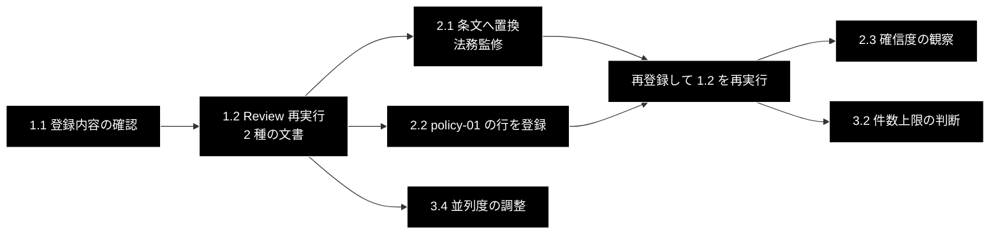

# GRACE-Review 規程 RAG の整備 TODO

**Version 1.0** | 作成日: 2026-09-30 | 最終更新: 2026-09-30 | 対象コミット: `213e8b3`（master）＋本 PR

---

## 目次

- [0. 現在地](#0-現在地)
- [1. P0 — 登録直後に必ず確認する](#1-p0--登録直後に必ず確認する)
- [2. P1 — 根拠の質を上げる](#2-p1--根拠の質を上げる)
- [3. P2 — 設計の見直し・評価が要るもの](#3-p2--設計の見直し評価が要るもの)
- [4. 見送りと理由](#4-見送りと理由)
- [5. 実行順序](#5-実行順序)
- [6. 変更履歴](#6-変更履歴)

---

## 0. 現在地

GRACE-Review の実行結果（2026-09-29 / 2026-09-30）から見つかった問題への対応と、
規程コレクション `ec_ad_rules_anthropic` の登録までが済んだ状態からの、**残タスクの一覧**である。
設計は [`backend/docs/review_flow.md`](../backend/docs/review_flow.md)、登録手順は
[`backend/docs/data_pipeline.md`](../backend/docs/data_pipeline.md) 付録 A。

### 0.1 済んだこと

| # | 内容 | 反映先 |
|---|---|---|
| 1 | 規程未登録時の根拠・条文引用に、LLM 向けの指示文（`violates=true とすること` 等）が漏れていたのを止めた。`RuleItem.public_description()`（第 1 段落）を使う | PR #229 |
| 2 | ③ Detect + ④ Ground を並列化（既定 4・`GRACE_REVIEW_WORKERS`）。結果の並び・ID は不変 | PR #229 |
| 3 | ② Retrieve の並列化 / 確信度に判定率の減衰（`damp_support_rate`）/ 規程 CSV と検索クエリを要旨へ | PR #230 |
| 4 | `qa_output/ec_ad_rules.csv` の差し替え（指示文 0 件）と、CSV が最新の書き出しと一致することを検査するテスト | PR #231 |
| 5 | 書き出しスクリプトの案内文と付録 A の登録コマンドに `--no-create-ui-csv` を追加（入力 CSV の上書き防止） | 本 PR |
| 6 | `ec_ad_rules_anthropic` を登録（利用者環境・23 件・登録スクリプトの検証ログで Qdrant 側 23 件を確認） | 利用者 2026-09-30 |

### 0.2 分かっていること・まだ分かっていないこと

| 項目 | 状態 |
|---|---|
| 表記漏れ LP の所要時間 | 14 秒（4 セグメント・判定 8 回・指摘 4 件）。**前回の LP 文（11 指摘・69 秒）との比較は未実施** |
| 登録後に `規程 N 件` へ変わったか | **未確認**（登録後の Review 実行ログを受け取っていない） |
| 登録データの payload に `topic` が入っているか | **未確認**。コード上は入る（`build_points_for_qdrant` が `topic` を保持）が、実データは見ていない |
| 登録スクリプトの入力上書き | 確認済み。既定で UI 用 CSV（2 列）が入力と同じパスへ書かれ、`topic` 列が消える |

---

## 1. P0 — 登録直後に必ず確認する

### 1.1 登録内容の確認（利用者）

```bash
curl -s http://localhost:6333/collections/ec_ad_rules_anthropic | jq '.result.points_count'          # 23
curl -s http://localhost:6333/collections/ec_ad_rules_anthropic | jq '.result.config.params.vectors' # size 3072
curl -s -X POST http://localhost:6333/collections/ec_ad_rules_anthropic/points/scroll \
  -H 'Content-Type: application/json' \
  -d '{"limit":2,"with_payload":true,"with_vector":false}' | jq '.result.points[].payload'          # topic が入っているか
```

### 1.2 Review を再実行して効果を測る（利用者）

**同じ 2 種の文書で**実行する。比較できなければ短縮も改善も言えない。

| 文書 | 前回 | 見るもの |
|---|---|---|
| 「業界No.1…シミが治る…」の LP | 69 秒・指摘 11 件（並列化前） | 所要時間。429（レート制限）が出ないか。出るなら `GRACE_REVIEW_WORKERS=2` |
| 表記漏れ LP | 14 秒・指摘 4 件（登録前） | `doc/tokusho-01: … / 規程 N 件` が 0 件でなくなるか。根拠が `[規程] 特定商取引法 第11条（…）` の形で出るか |

`規程 0 件` のままなら、`[retrieve] 関連度が低い規程を根拠にしません（< 0.70）` のログにスコアが出る。
`question` の文言とルールのタイトルが噛み合っているかを見直す（付録 A の 3-2）。

---

## 2. P1 — 根拠の質を上げる

### 2.1 `answer` を実際の条文・ガイドラインへ置き換える（利用者・法務監修）

**登録しただけでは根拠の中身は条文フォールバックと同じ**（要旨を登録しているため）。RAG が意味を持つのは置換後である。

- 出典: e-Gov の条文、消費者庁の特定商取引法ガイド、景品表示法の各ガイドライン、医薬品等適正広告基準。
- **要旨を捨てず先頭に残し、条文を足す**（検索スコア 0.70 を割りにくくするため）。
- 置換後に再登録して、1.2 と同じ確認を行う。**スコアが 0.70 を割るルールが出たら `question` を見直す。**
- 誤った条文は指摘そのものを誤らせる。監修を通してから本番運用する。

### 2.2 `policy-01` 用に取引条件の行を `ec_policy_anthropic` へ足す（利用者）

前回の実行で policy-01 の根拠は無関係な FAQ 5 件だった。取引条件を 1 行にまとめた行を足すと当たりやすくなる（付録 A の 3-3）。

- 中身は**実際の自社規程**に置き換える。
- ⚠️ **`--recreate` を付けない**（既存の返品・返金 FAQ が消える）。`--no-create-ui-csv` は付ける。

### 2.3 neutral が混ざる指摘の確信度を実データで観察する（利用者）

減衰（PR #230）の効果は、neutral を含む指摘でしか出ない。前回の yakki-04（「副作用がない」）のような文で、
確信度が 1.00 でなくなるか、`confirmed` / `review_required` の境目が妥当かを見る。**妥当でなければ強さ（`groundedness_coverage_strength`）を調整する。**

---

## 3. P2 — 設計の見直し・評価が要るもの

| # | 項目 | 内容 | 状態 |
|---|---|---|---|
| 3.1 | 登録スクリプトの入力上書き | 入力と UI 用 CSV の出力先が同じパスのとき、書き込まないか警告する。今は利用者が `--no-create-ui-csv` を覚えている前提 | 未着手（提案） |
| 3.2 | policy-01 の根拠件数 | 実測スコアが 0.7543 / 0.7398 / 0.7281 / 0.7261 / 0.7222 と平坦で、相対比でも件数上限でも本命だけを選べない。**2.2 の登録後に再測定して判断する**。根拠のない上限は入れない | 保留 |
| 3.3 | Sonnet 5.5 向けプロンプト P1 / P2 / P5 | P1: 呼び出しごとの effort。P2: JSON 推論プロンプトへ「答える前に問題を考え抜く」旨の 1 行。P5: 旧 `Thought:` 形式のプロンプト。**評価データが無いまま入れない**。評価は実 API と Qdrant のある環境が要る | 保留（評価待ち） |
| 3.4 | 並列度の調整 | 既定 4。429 が出る／出ないの実測で `DEFAULT_JUDGE_WORKERS` を見直す | 1.2 の結果待ち |

---

## 4. 見送りと理由

| 項目 | 見送った理由 |
|---|---|
| Review の「記載なし」型主張の除外（Support の機構） | Review の主張は「検査対象／広告に〜がない」の形で、情報源についての主張ではないため、Support 用の除外規則がほとんど当たらない。**除外すると「記載漏れ」の指摘が根拠なしになる**ので、設計判断が要る。1.2 の実測で必要性を確認してから |
| 確信度の全件 1.00 の是正（全般） | 「本文に記載がない」は本文で直接確かめられるので、全主張が supported なら 1.00 は不自然ではない。問題は neutral が混ざる指摘で、それは 2.3 で観察する |

---

## 5. 実行順序



1. **1.1 → 1.2 を先にやる。** 以降の判断（条文置換の要否・並列度・件数上限）はすべて、この実行ログが根拠になる。
2. 2.1 と 2.2 は独立。どちらも再登録後に 1.2 をやり直す。
3. 3.1 は誰かが `--no-create-ui-csv` を忘れたら再発する。運用が増えるなら先に直す。

---

## 6. 変更履歴

| バージョン | 変更内容 |
|-----------|---------|
| 1.0 | 初版作成（2026-09-30）。PR #229〜#231 と本 PR までの対応と、登録後の残タスクを整理した |
