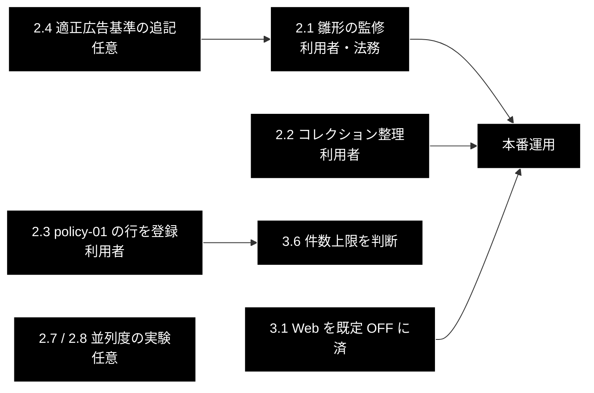

# GRACE-Review 規程 RAG の整備 TODO

**Version 3.6** | 作成日: 2026-09-30 | 最終更新: 2026-10-03 | 対象コミット: `056a83e`（master）＋本 PR

---

## 目次

- [0. 現在地](#0-現在地)
- [1. 方針（両リポジトリ共通）](#1-方針両リポジトリ共通)
- [2. 残作業](#2-残作業)
- [3. 課題（既知の問題・観察）](#3-課題既知の問題観察)
- [4. 見送りと理由](#4-見送りと理由)
- [5. 実行順序](#5-実行順序)
- [6. 変更履歴](#6-変更履歴)

---

## 0. 現在地

「化粧品LP案」（シミが治る）で**登録した条文が根拠に届かない**問題は、grace_v2 と grace_v2_local の
**両方で解消した**（2026-10-01）。原因は登録ではなく検索で、セグメント型ルールが広告の文をクエリにして
スコアが下限 0.70 を割っていた。ルール自身の文で検索するよう改め（PR #238）、grace_v2_local へも移植した。
設計は [`backend/docs/review_flow.md`](../backend/docs/review_flow.md)、登録手順は
[`backend/docs/data_pipeline.md`](../backend/docs/data_pipeline.md) 付録 A。

### 0.1 済んだこと

| # | 内容 | 反映先 |
|---|---|---|
| 1 | 規程未登録時の根拠・条文引用へ LLM 向け指示文が漏れていたのを止めた（`public_description()`）。③④ を並列化 | PR #229 |
| 2 | ② Retrieve の並列化 / 確信度に判定率の減衰（`damp_support_rate`）/ 規程 CSV と検索クエリを要旨へ | PR #230 |
| 3 | 規程 CSV の差し替えと鮮度テスト / `--no-create-ui-csv` の案内 | PR #231・#232 |
| 4 | 条文置換用の雛形 `qa_output/ec_ad_rules_statutes_template.csv` | PR #233 |
| 5 | ⑥ Web 裏取りの並列化と打ち切り / `web_checked` を検索が返ったルールだけに / クライアント重複作成の防止 | PR #234 |
| 6 | 雛形の yakki-02 / yakki-04 に薬機法第 66 条の原文（利用者が貼付） | PR #236・#237 |
| 7 | ② Retrieve をセグメントスコープでも**ルール自身**で検索・ルールごとに 1 回・別ルールの行を根拠にしない | PR #238 |
| 8 | 雛形の yakki-02 に化粧品の効能の範囲の通知（56 項目） | PR #239 |
| 9 | ⑥ Web の待ちの既定を 10 秒 → 5 秒 | PR #240 |
| 10 | 上記 #229 / #230 / #234 / #238 / #240 を grace_v2_local へ移植（③④ の並列数は Ollama に合わせ既定 1） | grace_v2_local #161・#162 |
| 11 | `ec_ad_rules_anthropic` の登録（23 件・3072 次元）と、条文・通知追記後の再登録 | 利用者 2026-09-30・10-01 |
| 12 | 原文ペインの見出しを「指摘 N 件のうち M 件が原文の箇所」に（表記漏れは原文に場所が無い） | PR #243・grace_v2_local #165 |
| 13 | 3 サンプル × 2 モデル（Sonnet 5.5 / Opus 5.5）の比較（§0.3）。結果を受けて keihyo-07 を確定にしない（`confirm_needs_human`）・keihyo-08 は条件の付かない「送料無料」を指摘しない・修正案に架空の値や厳しい条件を足さない・文面の言葉づかい。化粧品LP案の確実な 5 件をテストに固定 | PR #244・grace_v2_local #166 |
| 14 | 段落単位の ③ Detect に文書の文脈（題名＋冒頭）を添える（2.12）／tokusho-01 で税込表記の有無も確認する（2.13） | PR #245・grace_v2_local #167 |
| 15 | 第1段の候補検出に除外語（`keyword_excludes`）。keihyo-09 が「期間限定」に反応しない（2.14） | PR #246・grace_v2_local #168 |
| 16 | 文字列で決まる事実で LLM を補う（tokusho-01 の購入時の送料・policy-01 の返品条件の比較）（2.17）／結果が入力欄の文書のものでないと画面に出す（2.18） | PR #247・grace_v2_local #170 |

### 0.2 実測の記録（2026-09-30〜10-01・「シミが治る」LP ほか）

| 項目 | 結果 |
|---|---|
| 登録内容 | 23 件・`size: 3072`・Cosine・payload に `topic` が入っている |
| OK 例（指摘 0 件を期待） | 0 件（期待どおり）。返品「未開封」と規程「未使用・未開封」の粒度差は指摘されない |
| NG 例（表記漏れ LP・同じ文書） | **14 秒から 8 秒**。指摘は同じ 4 件。表記漏れ系の根拠は RAG の 1 件（自ルールの行）に。② Retrieve は約 5 秒から約 1.4 秒 |
| 「シミが治る」LP（PR #230 後） | **69 秒から 44 秒**。指摘 11 件（高 7・中 4・強制 high 3・確定 8・要確認 3）。44 秒のうち約 23 秒は 2 回目の Web 検索（SerpAPI）の遅延 |
| 「シミが治る」LP（PR #234 後） | **44 秒から 20 秒**（69 秒からは約 3.4 倍）。指摘は 11 件で**完全に同じ**（高 7・中 4・強制 high 3・確定 8・要確認 3）。内訳: ② Retrieve 約 2.5 秒 / ③④ 約 15.5 秒（並列 4・約 75%）/ ⑥ Web 約 0.2 秒（2 件が同時に開始し 0.16 秒で返った）。429 は出ていない |
| クライアントの重複作成 | 解消。サーバー起動直後の最初のリクエストで、`GeminiEmbedding initialized` などが 1 回ずつ（以前は 4 回ずつ） |
| 「Web 裏取り済み」 | keihyo-03・keihyo-04 に付いた（どちらも検索が返った指摘） |
| 確信度 | 減衰が効いている。yakki-02 は **2 回連続で 0.82**、yakki-04 は **2 回連続で 0.89**（同じ neutral が再現）。tokusho-05 は 0.98 から 1.00（LLM の揺らぎで、今回は全主張が supported） |
| 打ち切り経路（第 66 条登録後の再実行） | **動いた**。keihyo-04（`景品表示法 第5条第2号`）の検索が 2 回連続で ReadTimeout になり、10 秒で見送られた（Review は 31 秒で完了）。遅れて返った結果は画面に反映されない（設計どおり）。このクエリだけが遅いのか並列だから遅いのかは未切り分け |
| 条文登録後（yakki-02 / yakki-04 に第 66 条） | **条文は効いていなかった**。登録は正しい（answer に【条文】あり）が、セグメント型ルールは広告の文で検索しており、s001 0.6690・s002 0.6784 で下限 0.70 を割って要旨のフォールバックになった。yakki-02 0.82 のまま、yakki-04 0.89→1.00 は主張分解の揺れで条文の効果ではない → 2.3 を実装 |
| 2.3 実装後（2026-10-01・PR #238） | **条文が根拠に採用された**。yakki-02 / yakki-04 とも自分の行（条文つき）が最上位（0.8640 / 0.8437）で、相手の行は相対比で落ちた。フォールバックは 0 件。yakki-04 1.00（supported 2/2）、yakki-02 0.82 のまま。23 秒（Web は 0.2 秒で返った） |
| 通知追記後（2026-10-01・PR #239） | **yakki-02 0.82 → 0.95**。自分の行 0.8684（通知を足しても下がらない）。「56 項目の範囲を超えている」が neutral → supported、修正案が通知の (37)「日やけによるシミ、ソバカスを防ぐ」を引用。残る neutral は「治療を訴求する表現である」。yakki-04 は 2 回連続 1.00。tokusho-04 0.89・keihyo-04 0.95 は主張分解の揺れ（行は不変）。指摘 11 件・内訳不変。**33 秒のうち 10 秒が Web の打ち切り待ち**（第 5 条第 1 号 14.8 秒・第 2 号は ReadTimeout 後 34 秒。両方遅いので SerpAPI 側の遅延） |
| grace_v2_local（2026-10-01・移植後 #161 / #162） | **移植したコードで動作を確認**。ルール自身の文で検索（15 件を並列・約 4 秒）、yakki-02 0.8684 / yakki-04 0.8437 で自分の行を採用、フォールバック 0 件、根拠に指示文が出ない、Embedding / SPLADE の初期化は 1 回ずつ、⑥ Web は 5 秒で打ち切り（keihyo-04 は 4.3 秒で返り裏取り済み）。指摘 10 件（grace_v2 は 11 件。keihyo-08 を取りこぼし keihyo-09 を誤検知＝gemma4 の判定の質）。**9 分 6 秒**のうち ③④ が約 9 分（Ollama 約 26 回を直列。yakki-02 の ④ Ground は条文＋56 項目の長い根拠で 57 秒・63 秒） |

### 0.3 モデル比較（2026-10-02・3 サンプル × 2 モデル・各 1 回）

| サンプル | Sonnet 5.5 | Opus 5.5 |
|---|---|---|
| 化粧品LP案（NG 例・優良誤認・薬機法） | 11 件（重大 7・中 4／確定 8・要確認 3）・**23 秒** | 同じ 11 件（ルールも一致）・40 秒 |
| 表記漏れLP案（NG 例・表記漏れ・規程不一致） | 4 件（重大 1・中 3／確定 4）・**14 秒** | 同じ 4 件・16 秒 |
| OK 例 | 0 件・**5 秒** | 0 件・7 秒 |

- **指摘はすべてのサンプルで完全に一致**（件数・ルール・重大度・確定／要確認）。② Retrieve のスコアもモデルに依らず同じ（検索は Embedding だけで決まる）。
- 差は速度（Opus は 1.1〜1.7 倍）・単価（Opus は入出力とも 2 倍・`config.py::MODEL_PRICING`）・文章の細部だけ。
  - Sonnet: 該当箇所が狭い（良い）／修正案に架空の値「5,000円以上」・「該当しうります」・内部用語「対象テキスト」（悪い）
  - Opus: 該当箇所が文や行全体に広がる・返品の修正案に「未使用」を足して今より厳しくした（悪い）／穴埋めの「〇〇」を使う（良い）
- **結論: 既定モデルは Sonnet 5.5 のまま**。残る問題は両モデル共通で、ルールの記述と指示文の側にある（本 PR で対応）。
- 化粧品LP案の 11 件の監修結果: 確実 5 件（keihyo-03 / yakki-02 / yakki-04 / keihyo-04 / tokusho-01）、要確認が妥当 1 件（keihyo-07）、過剰 1 件（keihyo-08・条件の付かない送料無料）、抜粋だから出る 4 件（tokusho-02〜05 → 2.9）。


#### 0.3.1 修正後の実測（2026-10-02 12:24〜12:45・化粧品LP案）

| 実行 | 指摘 | 所要 | 結果 |
|---|---|---|---|
| grace_v2・Sonnet 5.5（2 回） | 10 件 | 20 秒 | keihyo-08 が消え、keihyo-07 が要確認（確信度 0.67 / 0.89 で重大度は 軽微 / 中）。文面は「広告文」「〇〇」になった |
| grace_v2_local・gemma4:12b-mlx | 9 件 | 8 分 28 秒 | keihyo-08・keihyo-09 の誤りは解消。**tokusho-01（税込表記）を取りこぼし** → 2.13 |
| grace_v2_local・gemma4:26b-a4b-it-qat | 10 件 | **3 分 40 秒** | 12b の約 2.3 倍速い。tokusho-01 を取りこぼし、**yakki-01（食品のルール）で美容液を誤検知** → 2.12 |


#### 0.3.2 2.12 / 2.13 の後の実測（2026-10-03・化粧品LP案ほか）

| 実行 | 指摘 | 所要 | 結果 |
|---|---|---|---|
| grace_v2・Sonnet 5.5・表記漏れLP案 | 4 件 | 12 秒 | 返品の修正案が期限だけを直す（「未使用」を足さない）→ 2.11 完了 |
| grace_v2・Sonnet 5.5・化粧品LP案 | 10 件 | 21 秒 | tokusho-01 が両方の価格の税込表記の無さを指摘。yakki-02 が「化粧品である美容液」と文脈を使う。tokusho-04 は確信度 0.67 で要確認（揺れ・3.8） |
| grace_v2_local・gemma4:12b-mlx | 10 件 | 8 分 15 秒 | tokusho-01 は検出したが自分の ④ Ground が 1 矛盾として抑止（→ 2.15）。keihyo-09 が「期間限定」で再発（→ 2.14） |
| grace_v2_local・gemma4:26b-a4b-it-qat | 10 件 | 4 分 32 秒 | **Sonnet 5.5 と同じ 10 ルール**。tokusho-01 あり・yakki-01 / keihyo-09 なし |


#### 0.3.3 grace_v2_local の既定を 26b にした後の実測（2026-10-03・gemma4:26b-a4b-it-qat）

| 実行 | 指摘 | 所要 | 結果 |
|---|---|---|---|
| 表記漏れLP案（2 回） | 3 件 | 1 分 51 秒 / 1 分 20 秒 | **2 回とも tokusho-01（購入時の送料が無い）を取りこぼし** → 2.17 |
| OK 例（2 回） | 1 件 | 57 秒 / 1 分 22 秒 | **2 回とも policy-01 を誤検知**（広告「未開封」を規程「未使用・未開封」より不利と逆に判定。修正案も「未使用」を足す）→ 2.17 |
| （取り違え） | — | — | 例文ボタンで「OK 例」へ切り替えただけで実行せず、前回の結果を「OK 例が NG」と読み違えた → 2.18 |

どちらも判定基準に例まで書いてある所で、指示文を足しても効く見込みが低い。文字列で決まる部分は LLM に頼らず決める（`review_facts.py`）。

---

## 1. 方針（両リポジトリ共通）

### 1.1 規程の雛形は grace_v2 にだけ置く

- 規程コレクション `ec_ad_rules_anthropic` は grace_v2 と grace_v2_local が**同じ Qdrant を共用**している（1 個のコレクション）。
- その元データ `qa_output/ec_ad_rules_statutes_template.csv` は **grace_v2 にだけ置き、grace_v2_local へはコピーしない**。
  2 か所にあると片方だけに条文を足す食い違いが起き、そのまま登録すると**もう片方の Review も黙って変わる**。
- grace_v2_local から登録し直すときも grace_v2 のファイルを直接指定する:

  ```bash
  python qa_qdrant/register_to_qdrant.py \
    --input-file ../grace_v2/qa_output/ec_ad_rules_statutes_template.csv \
    --collection ec_ad_rules_anthropic --recreate --no-create-ui-csv
  ```

- grace_v2_local の Review / Support は Qdrant を読むだけで `qa_output/` を使わない（テストも依存しない。2026-10-01 確認）。

### 1.2 条文・通知の本文は利用者が一次情報から貼る

Claude の実行環境からは e-Gov などへ到達できない。記憶から条文を書くと誤記の危険があるので、
**本文は利用者が貼り、Claude は雛形へ追記するだけ**にする（原文との照合はしていない旨を `status` / `source_note` に残す）。

---

## 2. 残作業

担当: **利用者** = 手元の Qdrant・一次情報・法務判断が要るもの、**Claude** = コード・文書の変更。

| # | 優先 | 項目 | 担当 | 内容・完了条件 |
|---|:--:|---|---|---|
| 2.1 | 高 | **雛形の監修**（原文照合は済） | 利用者（法務） | ✅ **原文との照合は 2026-10-03 に済**: 利用者が貼った第 66 条（令和 8 年 5 月 21 日施行版）と化粧品の効能の範囲の通知を、yakki-02 / yakki-04 の `answer` と突き合わせ、本文は一致した（通知 (34) は貼付文が「ひがそり」、雛形は「ひげそり」で、雛形を正とした）。`answer` は変えていないので**再登録は不要**。**残り**: どのルールの根拠として妥当かの確認（`status` は「根拠としての妥当性は監修待ち」）と `reviewer` の記入。**誤った条文は指摘そのものを誤らせる**ので、本番運用の前提 |
| 2.2 | 高 | **Qdrant コレクションの整理** | 利用者 | 削除してよい: `cc_news_2per_openai`（0 件）、`cc_news_2per_ollama`・`cc_news_100_ollama`（768 次元で両リポジトリとも検索不可）。中身を数件見てから: `cc_news_2per`・`cc_news_2per_gemini`・`cc_news_2per_768`（3072 次元の小さな重複・コード参照なし）。**残す**: `*_anthropic` の 7 個（業務用）、`cc_news_2per_anthropic`（ベンチマーク）、`fineweb_edu_ja_5per`、`wikipedia_ja_5per`。手段はデータ管理タブ ④ か `python qdrant_delete_collection.py <名前>`（元に戻せない） |
| 2.3 | 中 | **policy-01 の取引条件の行を `ec_policy_anthropic` へ足す** | 利用者 | 根拠が無関係な FAQ 5 件のまま（0.7543〜0.7222 で絞れない）。取引条件を 1 行にまとめた行を足す（付録 A の 3-3）。中身は**実際の自社規程**。`--recreate` は付けない（既存 FAQ が消える） |
| 2.4 | 低 | yakki-02 に医薬品等適正広告基準の効能効果の項を追記 | 利用者（原文）→ Claude | 残る neutral「治療を訴求する表現である」を支持させるため。ただし yakki-02 は重大リスク語「治る」で強制 high・要確認なので、**確信度が上がっても画面の状態は変わらない** |
| 2.5 | 低 | `config.py::AgentConfig` の古い一覧の整理（両リポジトリ） | Claude | `RAG_AVAILABLE_COLLECTIONS` に実在しない `cc_news_5per`（参照ゼロ）。`RAG_DEFAULT_COLLECTION = "wikipedia_ja_5per"`（10 件しかない）は Legacy ReAct 経路のみで、Web 画面に影響しない |
| 2.6 | 低 | 登録スクリプトの入力上書きガード | Claude | 入力と UI 用 CSV の出力先が同じパスのとき書き込まないか警告する。今は `--no-create-ui-csv` を覚えている前提 |
| 2.7 | 任意 | grace_v2: 並列度 8 の実験 | 利用者 | `GRACE_REVIEW_WORKERS=8 ./run_dev.sh`。③④ が全体の約 75%。429 が出たら 4 に戻す |
| 2.8 | 任意 | grace_v2_local: ③④ の並列化の実験 | 利用者 | `OLLAMA_NUM_PARALLEL=2 ollama serve` ＋ `GRACE_REVIEW_WORKERS=2`。現状 9 分のうち約 9 分が直列の Ollama 待ち。`ollama ps` でメモリを見る。速くならなければ 1 に戻す |
| 2.9 | 中 | **特商法の表記が別ページにある LP の扱い** | 利用者（方針）→ Claude | LP の抜粋を点検すると tokusho-02〜05（支払方法・引渡時期・返品特約・事業者名）が必ず出る（両モデル共通）。案: 画面に「特商法表記は別ページ」のチェックを足し、ON なら tokusho-02〜05 を判定しない。方針が決まれば実装する |
| 2.10 | 低 | 該当箇所を問題の語句に絞る | Claude | Opus 5.5 で文・行全体を該当箇所にしがち（§0.3）。既定の Sonnet 5.5 では問題が小さい |
| 2.11 | — | PR #244 の修正後の実測 | 利用者 | ✅ 2026-10-03 完了（§0.3.2）。化粧品LP案で keihyo-08 が出ない・keihyo-07 が「要確認」、表記漏れLP案で修正案が期限だけを直すことを確認した |
| 2.12 | — | 段落単位の判定に文書の文脈を渡す | Claude | ✅ PR #245・grace_v2_local #167。実機で yakki-01 の誤検知が消えるかは gemma4 26b で再測定 |
| 2.13 | — | tokusho-01 で税込表記の有無を確認する | Claude | ✅ PR #245・grace_v2_local #167。実機で gemma4 が取りこぼさないかを再測定 |
| 2.14 | — | keihyo-09 が「期間限定」の「限定」に反応しない | Claude | ✅ PR #246・grace_v2_local #168。第1段で除外するので LLM に依らない |
| 2.15 | — | gemma4 12b が tokusho-01 のどの主張を「矛盾」としたか | — | 打ち切り（grace_v2_local の既定を 26b にしたため） |
| 2.16 | — | 26b の取りこぼし・誤検知の再現確認 | 利用者 | ✅ 2026-10-03。どちらも 2 回とも再現（§0.3.3） |
| 2.17 | — | 文字列で決まる事実で補う（tokusho-01 の購入時の送料・policy-01 の返品条件） | Claude | ✅ PR #247・grace_v2_local #170。`review_facts.py`。実機（26b）で OK 例が指摘 0・抑止 1、表記漏れLP案で tokusho-01 の送料漏れを確認（2026-10-03） |
| 2.18 | — | 結果が入力欄の文書のものでないと画面に出す | Claude | ✅ PR #247・grace_v2_local #170。`state/staleResult.ts`。実機で警告を確認（2026-10-03） |

---

## 3. 課題（既知の問題・観察）

| # | 課題 | 観察 | 扱い |
|---|---|---|---|
| 3.1 | ⑥ Web 裏取りの価値 | クエリが `{法令名} {条} 改正 ガイドライン` の 1 種類で、結果は一般的な解説記事や無関係な PDF が多い（第 5 条第 2 号では自治体の計画書なども返った）。SerpAPI は 0.2〜1.7 秒で返るか 15 秒以上かかるかの二極 | ✅ **Review の既定を OFF にした**（2026-10-01・利用者判断。画面の既定 `DEFAULT_REVIEW_FORM.useWeb` を API の既定 `ReviewRequest.use_web=False` に揃えた。grace_v2_local も同じ）。必要なときだけチェックを入れる。クエリ改善は未着手 |
| 3.2 | 見送った Web 検索がバックグラウンドで走り続ける | `WebSearchTool` は timeout=30 秒・retries=3。5 秒で見送った後も最長 1 分超走る（結果は捨てる）。実害は SerpAPI の利用回数のみ | 様子見 |
| 3.3 | grace_v2_local（gemma4）の判定の質 | keihyo-08（送料無料の条件不記載）を 2 回連続で取りこぼし、keihyo-09（数量限定）を「期間限定」の「限定」で誤検知。grace_v2（Sonnet）では出ない | モデル差。ルールの記述（keihyo-09 の【判定基準】に「期間限定は対象外」）で抑えられるかは要検討 |
| 3.4 | grace_v2_local の所要時間 | 9 分 6 秒（移植前 6 分 55 秒）。条文・通知が根拠として LLM に届くようになり、yakki-02 の判定が 1 回 60 秒前後に | 狙いどおりのコスト。短縮は 2.8 |
| 3.5 | ② の並列化でコレクション一覧の取得が重複 | 最初の検索で 4 スレッドが `GET /collections` 等をそれぞれ実行（計 0.1 秒程度） | 実害なし。直さない |
| 3.6 | policy-01 の根拠件数 | 2.3 の登録後に再測定して判断。根拠のない上限は入れない | 保留 |
| 3.7 | Sonnet 5.5 向けプロンプト（effort・考え抜く 1 行・旧 `Thought:` 形式） | 評価データが無いまま入れない | 保留（評価待ち） |
| 3.8 | 確信度が 1.00 に寄る | 主張の分け方が LLM で揺れ、neutral が出ないと 1.00 になる（tokusho-04 が 1.00 ↔ 0.89 など）。減衰は効いている | 仕様どおり。監視のみ |
| 3.9 | モデルを変えても結果が変わらない | 3 サンプルで Sonnet 5.5 / Opus 5.5 の指摘が完全一致（§0.3）。判定の質はモデルより**ルールの記述と指示文**で決まっている | 改善はルール側で行う。同じモデルで繰り返したときの揺れは未測定（低優先） |

---

## 4. 見送りと理由

| 項目 | 見送った理由 |
|---|---|
| Review の「記載なし」型主張の除外（Support の機構） | Review の主張は「広告に〜がない」の形で、情報源についての主張ではないため、Support 用の除外規則がほとんど当たらない。除外すると記載漏れの指摘が根拠なしになる |
| 確信度の全件 1.00 の是正（全般） | 全主張が supported なら 1.00 は不自然ではない。neutral が混ざる指摘は減衰で対応済み |
| grace_v2_local への `qa_output/` のコピー | §1.1。雛形は grace_v2 の 1 か所に置く |

---

## 5. 実行順序



1. **2.1（監修）と 2.2（コレクション整理）が先。** どちらも利用者の作業で、互いに独立。
2. 2.3 は 2.1 と独立。登録後に LP を再実行し、3.6 を判断する。
3. 3.1（Web の既定）は OFF にした（v3.1）。
4. 2.11（本 PR 後の実測）→ 2.9（特商法表記が別ページの LP）の順。
5. 2.4〜2.8・2.10 は任意・低優先。

---

## 6. 変更履歴

| バージョン | 変更内容 |
|-----------|---------|
| 3.6 | 2.1 の原文照合を済に（第 66 条・化粧品の効能の範囲の通知が雛形の本文と一致。`status` / `source_note` のみ更新し `answer` は不変）。2.17 / 2.18 と §0.1 #16 を PR 番号と実機確認に更新（2026-10-03） |
| 3.5 | §0.3.3 に 26b の実測（取りこぼし・誤検知が各 2 回再現）を追加。2.15 を打ち切り、2.16〜2.18 を追加して 2.17 / 2.18 を対応 |
| 3.4 | §0.3.2 に 2.12 / 2.13 の後の実測を追加。2.11 を完了に。2.14（keihyo-09 の除外語）・2.15 を追加 |
| 3.3 | §0.3.1 に PR #244 後の実測（Sonnet 5.5・gemma4 12b / 26b）を追加。2.12（段落に文書の文脈）・2.13（tokusho-01 の税込表記）を追加して対応 |
| 3.2 | §0.3 にモデル比較（3 サンプル × 2 モデル・2026-10-02）を追加し、結論（既定は Sonnet 5.5 のまま）と化粧品LP案の監修結果を記録。§0.1 に #243 と本 PR、§2 に 2.9〜2.11、§3 に 3.9 を追加 |
| 3.1 | 3.1 を対応: GRACE-Review の Web 裏取りの既定を画面でも OFF に（API は元から OFF。両リポジトリ）（2026-10-01） |
| 3.0 | 全面整理（2026-10-01）。条文が根拠に届かない問題が両リポジトリで解消したので、§0 に結論と済んだこと（#229〜#240・grace_v2_local #161 / #162）をまとめ、grace_v2_local の実測を §0.2 へ。§1 に両リポジトリ共通の方針（**規程の雛形は grace_v2 にだけ置く**・条文は利用者が貼る）を新設。旧 §1〜§3 を「残作業（担当・優先つき）」と「課題」に組み直し、Qdrant コレクションの整理・`AgentConfig` の古い一覧・grace_v2_local の並列化実験・gemma4 の判定の質を追加 |
| 2.6 | 通知追記後の実測（yakki-02 0.95・yakki-04 安定・Web 打ち切りで 10 秒待ち）を §0.2 / 2.1 へ。⑥ Web の待ちの既定を 5 秒に下げたことを §0.1 / 3.5 へ（2026-10-01） |
| 2.5 | `yakki-02` に化粧品の効能の範囲の通知（56 項目）を追記。PR #238 後の実測（条文が根拠に採用された・yakki-02 0.82 のまま）を 2.1 へ（2026-10-01） |
| 2.4 | 2.3 を実装（② Retrieve をルール自身のクエリへ）。第 66 条登録後の実測（条文が効かなかった・Web 打ち切り経路が動いた）を §0.2 へ（2026-09-30） |
| 2.3 | 2.1 の進捗に `yakki-04` への第 66 条の追記を反映（2026-09-30） |
| 2.2 | 2.1 に進捗を追記: `yakki-02` へ薬機法第 66 条の原文（利用者が貼付）を雛形に反映。第 66 条だけでは neutral が全部は埋まらない見込み（「治療」「56 項目」は通知側）。原文との照合は未（2026-09-30） |
| 2.1 | 「シミが治る」LP の再実行結果（20 秒・指摘は前回と同じ・重複作成の解消・確信度の再現）を §0.2 へ反映。1.1 を完了に、1.2（並列度 8 の実験）を追加。2.1 の優先順を 2 回の実測で更新し、条文の転記は利用者が行う理由（実行環境から e-Gov へ到達できない）を明記（2026-09-30） |
| 2.0 | 登録後の実測（OK 例 / NG 例 / 「シミが治る」LP）を §0.2 へ反映。§1 を「本 PR 後の再実行」へ、§2 に優先 3 行とセグメント型ルールの検索案（2.3）を追加。§3 に Web クエリ（3.5）を追加。Web 裏取りの並列化・打ち切りとクライアントの重複作成防止を §0.1 へ（2026-09-30） |
| 1.1 | 2.1 に条文置換用の雛形 `qa_output/ec_ad_rules_statutes_template.csv` を追記（2026-09-30） |
| 1.0 | 初版作成（2026-09-30）。PR #229〜#231 と本 PR までの対応と、登録後の残タスクを整理した |
