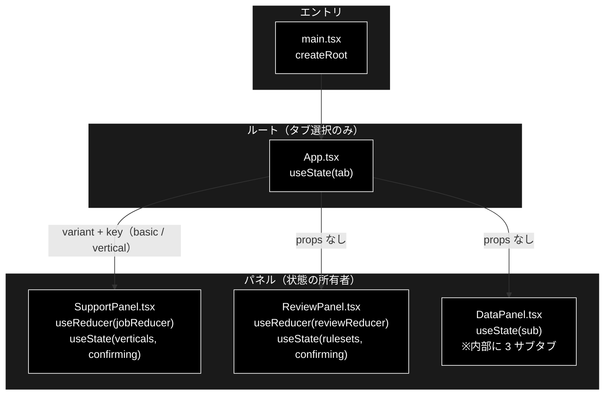
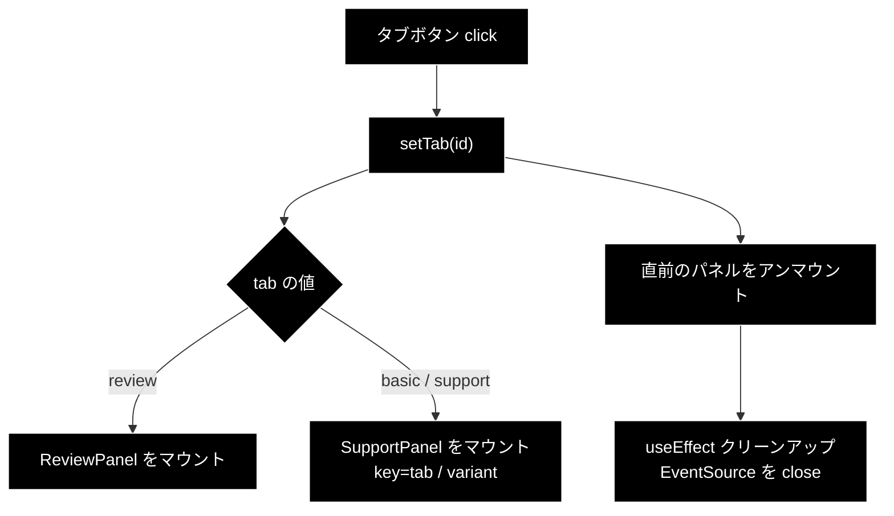
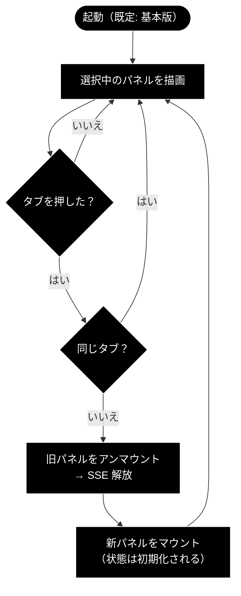

# App.tsx - 4 タブのルートコンテナ ドキュメント

**Version 1.2** | 最終更新: 2026-08-05

---

## 目次

1. [概要](#概要)
2. [コンポーネントツリー図](#1-コンポーネントツリー図)
3. [Props インターフェース](#2-props-インターフェース)
4. [状態管理](#3-状態管理)
5. [データフロー・副作用](#4-データフロー副作用)
6. [ユーザー操作フロー](#5-ユーザー操作フロー)
7. [型定義とバックエンド対応](#6-型定義とバックエンド対応)
8. [スタイル・アクセシビリティ](#7-スタイルアクセシビリティ)
9. [テスト](#8-テスト)
10. [変更履歴](#9-変更履歴)

---

## 概要

| 項目 | 内容 |
|---|---|
| ファイル | `frontend/src/App.tsx` |
| 種別 | **コンテナコンポーネント**（`useState` によるタブ選択のみ） |
| 親 | `main.tsx`（`createRoot`） |
| 子 | `SupportPanel`（基本版 / Support の 2 用途）・`ReviewPanel`・`DataPanel` |
| 主な依存 | `./components/SupportPanel` / `./components/ReviewPanel` / `./components/DataPanel` |
| 対応バックエンド | なし（API を直接呼ばない。子パネルが呼ぶ） |

`App.tsx` は**タブの選択だけ**を持つ薄いルート。ジョブ状態・SSE 購読・承認状態は
**各パネルが自分で持つ**ため、`App` は reducer も `useEffect` も持たない。

タブは 4 つ。前 3 つは**「エージェントを使う」**側で、並びは
「**業界特化を足していく順**」である。最後の 1 つだけが**「データを準備する」**側で、
モードが異なる。

| タブ | 区分 | 業界特化 | 描画されるもの |
|---|---|---|---|
| **基本版** | 使う | なし | `<SupportPanel variant="basic" />` |
| **GRACE-Support** | 使う | `VerticalProfile`（gov / saas / ec） | `<SupportPanel variant="vertical" />` |
| **GRACE-Review** | 使う | `RuleSet`（ec_ad） | `<ReviewPanel />` |
| **データ管理** | 準備 | — | `<DataPanel />`（内部に 3 サブタブ） |

### 主な責務

- 4 つのタブを提示し、選択されたパネルだけを描画する
- 非アクティブなパネルを**アンマウント**して、離れた側の `EventSource` を確実に閉じる
- 基本版 / Support で `SupportPanel` を**複製せず** `variant` で振り分ける
- `key={tab}` を与えて、基本版 ⇄ Support の切替時にパネルを作り直させる
- `h1` にアクティブなタブ名を出す

### 主要機能一覧

| 機能 | 実装 | 説明 |
|---|---|---|
| タブ定義 | `TABS` 定数 | `id` / `label` / `description` の 3 つ組 |
| タブ選択 | `useState<Tab>('basic')` | **既定は基本版** |
| パネル振り分け | 条件レンダリング | `data` なら `DataPanel`、`review` なら `ReviewPanel`、他は `SupportPanel` |
| 業界特化の有無 | `variant` prop | `tab === 'basic' ? 'basic' : 'vertical'` |
| 再マウント強制 | `key={tab}` | 基本版 ⇄ Support の状態持ち越しを防ぐ |

---

## 1. コンポーネントツリー図



> 📝 **状態は `App` に無い。** ジョブ・SSE・承認の状態はすべてパネル側にある。
> `App` が持つのは `tab`（どれを描くか）だけである。

---

## 2. Props インターフェース

**Props なし**（`export default function App()`）。ルートコンポーネントのため
外部から渡される値はない。

### 子へ渡す props

| 子 | 渡す props | 内容 |
|---|---|---|
| `SupportPanel` | `variant` / `key` | `variant` は `'basic'` or `'vertical'`。`key` は `tab` の値 |
| `ReviewPanel` | なし | — |
| `DataPanel` | なし | サブタブの選択は `DataPanel` 自身が持つ |

---

## 3. 状態管理

### 3.1 ローカル state（`useState`）

| 変数 | 型 | 初期値 | 更新契機 | 説明 |
|---|---|---|---|---|
| `tab` | `'basic' \| 'support' \| 'review'` | `'basic'` | タブボタンの `click` | 表示するパネル。**既定は基本版** |

### 3.2 reducer state（`useReducer`）

**なし。** ジョブ状態は各パネルが自分の reducer（`jobReducer` / `reviewReducer`）で持つ。

### 3.3 親から渡る状態（props 由来）

**なし。** ルートコンポーネントのため親が存在しない。

### 3.4 派生値

| 値 | 導出 | 用途 |
|---|---|---|
| `active` | `TABS.find((t) => t.id === tab) ?? TABS[0]` | `h1` に出すタブ名。見つからない場合は先頭（基本版）へフォールバック |
| `variant` | `tab === 'basic' ? 'basic' : 'vertical'` | `SupportPanel` へ渡す業界特化の有無 |

---

## 4. データフロー・副作用

### 4.1 副作用一覧（`useEffect`）

**なし。** `App` は `useEffect` を持たない。API 取得も SSE 購読も各パネルの責務である。

### 4.2 アンマウントによる SSE 解放

```tsx
{tab === 'data' ? (
  <DataPanel />
) : tab === 'review' ? (
  <ReviewPanel />
) : (
  <SupportPanel key={tab} variant={tab === 'basic' ? 'basic' : 'vertical'} />
)}
```

> `DataPanel` と `ReviewPanel` に `key` が無いのは、**それぞれ 1 つのタブにしか
> 対応しないため**。同じコンポーネント型が複数タブで使い回される
> `SupportPanel`（基本版 / Support）だけが `key` を必要とする。
> なお `DataPanel` は内部のサブタブ切替で同じ理由の `key={sub}` を持つ
> （[`DataPanel.md`](./DataPanel.md) §4.2）。

| 仕組み | 効果 |
|---|---|
| **条件レンダリング**（CSS の hide ではない） | 非アクティブなパネルが**アンマウント**され、`useEffect` のクリーンアップで `EventSource` が閉じる |
| **`key={tab}`** | 基本版 ⇄ Support は同じ `SupportPanel` 型なので、`key` が無いと React がインスタンスを**再利用**する。`key` を変えることで別コンポーネント扱いになり確実に作り直される |

> ⚠️ **`key={tab}` は必須。** これが無いと基本版 → Support と切り替えたときに、
> 前のタブの reducer 状態（実行中のジョブ・タイムライン・結果）と SSE 購読が
> **そのまま残る**。`variant` だけが変わって中身が引き継がれるため、
> 「基本版で実行した結果が Support タブに出ている」という状態になる。

> 📝 **サーバ側のジョブは走り続ける。** タブを離れるとブラウザは購読をやめるが、
> バックエンドのワーカースレッドは最後まで実行される。戻っても購読は復元されない。

### 4.3 データフロー図



---

## 5. ユーザー操作フロー

### 5.1 イベントハンドラ一覧

| 要素 | イベント | ハンドラ | 効果 | 無効化条件 |
|---|---|---|---|---|
| タブボタン ×4 | `click` | `() => setTab(t.id)` | パネルを切り替える | **なし**（実行中でも切替可能） |
| タブボタン ×4 | `keydown` | `onKeyDown(event, index)` | 左右/上下矢印で移動、Home/End で端へ。フォーカスも運ぶ | **なし** |

> 📝 **実行中でもタブを切り替えられる。** `disabled` は付けていない。切り替えると
> 購読は切れるがサーバ側の処理は継続するため、UI が固まることはない。

### 5.2 操作フロー図



---

## 6. 型定義とバックエンド対応

| TS 型 | 定義場所 | 対応する Python | 備考 |
|---|---|---|---|
| `Tab` | 本ファイル（ローカル） | — | UI 内部のみ。バックエンドに対応物なし |
| `SupportVariant` | `components/SupportPanel.tsx` | — | 同上 |

`App.tsx` は API を直接呼ばないため、バックエンド由来の型を持たない。

---

## 7. スタイル・アクセシビリティ

| 項目 | 内容 |
|---|---|
| スタイル方式 | プレーン CSS（`src/styles.css`）。CSS-in-JS・Tailwind は不使用 |
| 主要クラス | `.app`, `.tabs`, `.tab`, `.tab.active`, `.tab-sub` |
| ダークモード | 未対応 |

### アクセシビリティ・チェック

| 観点 | 状態 | 補足 |
|---|:--:|---|
| タブに `role="tablist"` / `role="tab"` があるか | ✅ | `nav.tabs` に `role="tablist"`、各ボタンに `role="tab"` |
| 選択状態が支援技術へ伝わるか | ✅ | `aria-selected={t.id === tab}` |
| キーボードで切り替えられるか | ✅ | `<button>` 要素なので Enter / Space で操作可能。加えて左右/上下矢印で移動、Home/End で端へ（WAI-ARIA の tablist パターン）。移動先計算は `state/tabKeys.ts` の純関数 |
| 選択中タブだけが Tab キーの到達点か | ✅ | roving tabindex（選択中 `0` / それ以外 `-1`）。タブ群を素通りして本文へ行ける |
| `tabpanel` が関連付けられているか | ✅ | `aria-controls` / `role="tabpanel"` / `aria-labelledby` |
| 矢印キーでのタブ移動（WAI-ARIA 準拠） | ❌ | 未実装。左右キーでの移動には対応していない |
| `role="tabpanel"` と `aria-controls` の対応付け | ❌ | パネル側に `tabpanel` を付けていない |
| 状態表示が色のみに依存していないか | ✅ | アクティブタブは `.active` の枠線＋説明文で区別 |

---

## 8. テスト

| テストファイル | 対象 | 実行 |
|---|---|---|
| （なし） | — | — |

**`App.tsx` の単体テストは未整備。** `@testing-library/react` を導入していないため、
JSX のレンダリングテストは持たない。ガードは以下 2 つ。

| 手段 | 何を守るか |
|---|---|
| `tsc --noEmit`（`npm run lint`） | `variant` / `Tab` の型不整合 |
| 目視確認 | タブ切替時の SSE 解放・状態の作り直し |

> ⚠️ **`key={tab}` の欠落は型検査で捕まらない。** 消しても `tsc` は通り、
> vitest も落ちない。変更する場合は実際にタブを往復して、前のタブの
> タイムラインが残らないことを確認すること。

---

## 9. 変更履歴

| 版 | 日付 | 変更内容 |
|---|---|---|
| 1.0 | 2026-08-01 | 初版作成。3 タブ化（基本版 / GRACE-Support / GRACE-Review）後の実装に基づく。`key={tab}` が必要な理由と、それが型検査では守られない点を明記 |
| 1.1 | 2026-08-05 | 4 タブ目「データ管理」（`DataPanel`）を追加。前 3 つ（使う）と最後（準備する）の区分を明記 |
| 1.2 | 2026-08-05 | タブの矢印キー移動・roving tabindex・`role="tabpanel"` を追加 |
