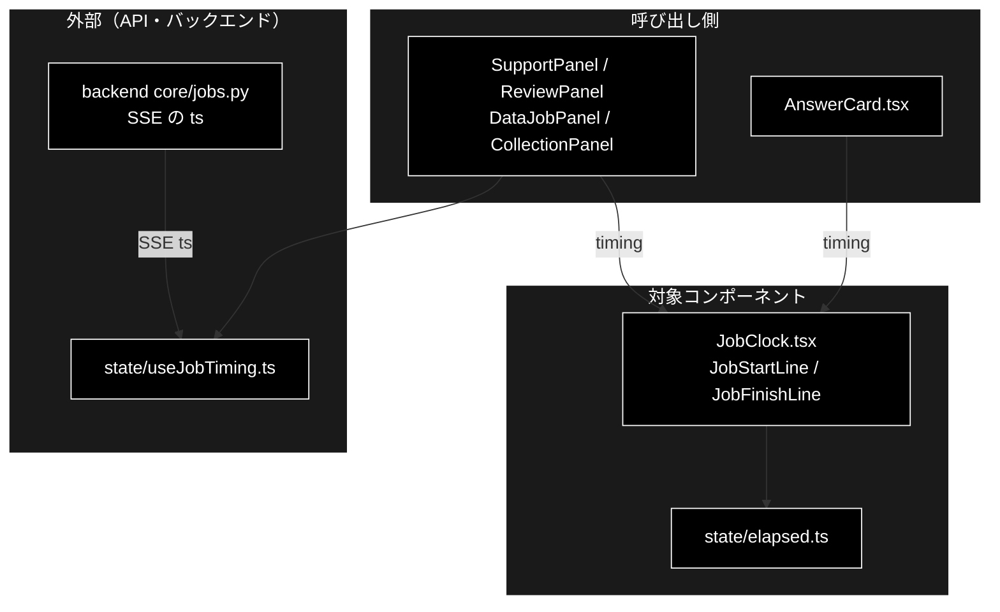
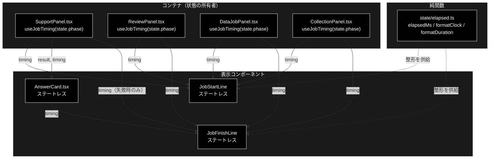
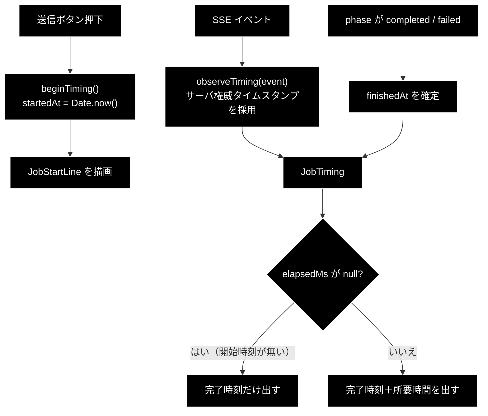

# JobClock.tsx - 開始行・完了行（所要時間） ドキュメント

**Version 1.1** | 最終更新: 2026-09-24

---

## 目次

1. [概要](#概要)
2. [コンポーネントツリー図](#12-コンポーネントツリー図)
3. [Props インターフェース](#2-props-インターフェース)
4. [状態管理](#3-状態管理)
5. [データフロー・副作用](#4-データフロー副作用)
6. [ユーザー操作フロー](#5-ユーザー操作フロー)
7. [型定義とバックエンド対応](#6-型定義とバックエンド対応)
8. [スタイル・アクセシビリティ](#7-スタイルアクセシビリティ)
9. [テスト](#8-テスト)
10. [変更履歴](#9-変更履歴)

---

## 概要

| 項目 | 内容 |
|---|---|
| ファイル | `frontend/src/components/JobClock.tsx`（47 行） |
| 種別 | **表示コンポーネント（ステートレス）**。`JobStartLine` / `JobFinishLine` の 2 つを export |
| 親 | `SupportPanel.tsx` / `ReviewPanel.tsx` / `DataJobPanel.tsx` / `CollectionPanel.tsx` / `AnswerCard.tsx`（`JobFinishLine` のみ） |
| 子 | なし |
| 主な依存 | `../state/elapsed`（`elapsedMs` / `formatClock` / `formatDuration` / `JobTiming`） |
| 対応バックエンド | SSE イベントのサーバ権威タイムスタンプ（`backend/app/core/jobs.py`） |

実行の**開始時刻・完了時刻・所要時間**を出す 2 行。**4 つのタブすべてで共用する**
（基本版 / GRACE-Support → `SupportPanel`、GRACE-Review → `ReviewPanel`、
データ管理 → `DataJobPanel` と `CollectionPanel`）。

| export | 出るタイミング | 内容 |
|---|---|---|
| `JobStartLine` | 送信直後から（実行中も完了後も出したまま） | 「開始 2026-09-12 17:45:51」 |
| `JobFinishLine` | 決着後（`completed` / `failed`） | 「完了 … ／ 所要 00:01:23」 |

### 主な責務

- `timing` が持つ時刻を人が読める形に整形して出す
- **出せない情報は黙って省く**（推測値を出さない）
- `<time dateTime>` を付けて machine-readable にする

> ⚠️ **所要時間を出せない経路がある。** タブを離れて戻ったあとの再購読のように
> **開始時刻を知らない**状態がありうる。そのとき `elapsedMs()` は `null` を返し、
> **完了時刻だけ**を出す。ここで `Date.now() - 何か` のような推測をしないこと。

### 各責務対応のモジュール

| # | 責務 | 対応モジュール | 説明 |
|---|---|---|---|
| 1 | 時刻の整形 | `JobClock.tsx` / `state/elapsed.ts` | `formatClock` / `formatDuration` |
| 2 | 出せない情報を省く | `state/elapsed.ts` | `elapsedMs` が開始時刻不明なら `null` を返す |
| 3 | `<time dateTime>` | `JobClock.tsx` | 機械可読な時刻を併記 |

### 主要機能一覧

| 機能 | 実装 | 説明 |
|---|---|---|
| 開始時刻 | `JobStartLine` | `timing.startedAt === null` なら**何も描画しない**（`return null`） |
| 完了時刻 | `JobFinishLine` | `timing.finishedAt === null` なら描画しない |
| 所要時間 | `elapsedMs(timing)` | `null` のときは所要の組だけを省く |
| machine-readable | `isoOf(ms)` → `dateTime` | `new Date(ms).toISOString()` |

---

## 1. アーキテクチャ構成図

### 1.1 システム全体での位置づけ



**データフロー**:

1. 各パネルが `useJobTiming` で開始・完了時刻（サーバの `ts` を優先）を保持する
2. `timing` を prop で受け取り、`state/elapsed.ts` の純関数で表示用に整形する
3. 開始時刻が分からない経路では所要時間を出さず、完了時刻だけを出す

### 1.2 コンポーネントツリー図



> 📝 **完了行の置き場所が 2 通りあるのは失敗時のため。** 通常は `AnswerCard` の末尾に
> 出すが、**失敗するとカード自体が無い**ので、そのときだけパネル直下へ出す
> （決着したのに時刻が消える、を防ぐ）。

---

## 2. Props インターフェース

両方とも同じ 1 つの prop を取る。

```typescript
export function JobStartLine({ timing }: { timing: JobTiming })
export function JobFinishLine({ timing }: { timing: JobTiming })
```

`JobTiming` は `state/elapsed.ts` の定義:

```typescript
export interface JobTiming {
  startedAt: number | null;
  finishedAt: number | null;
}
```

| Prop | 型 | 必須 | 既定値 | 説明 |
|---|---|:---:|---|---|
| `timing` | `JobTiming` | ✅ | — | 開始・完了の epoch ミリ秒。`useJobTiming()` が返す |

> 📝 **`AnswerCard` 経由だけ省略可能。** `AnswerCard` は `timing?: JobTiming`
> （省略可）で受け取り、`{timing && <JobFinishLine timing={timing} />}` と
> 存在するときだけ描画する。`JobFinishLine` 自体の prop は必須である。

### コールバックの契約

**コールバック props は無い。** 表示専用。

---

## 3. 状態管理

**ステートレス。** 時刻の保持は親が `state/useJobTiming.ts`（フック）で行う。

| 層 | 持ち主 | 中身 |
|---|---|---|
| ローカル state | `useJobTiming` の内部 `useState` | `JobTiming` |
| 判断・整形 | `state/elapsed.ts`（純関数） | 経過時間の算出、サーバ時刻の採否、書式 |
| 描画 | 本コンポーネント | それだけ |

> ⚠️ **ここに分岐を足さない。** `useJobTiming` も判断を持たない約束になっており
> （CLAUDE.md §6）、判断は `elapsed.ts` に集約する。

---

## 4. データフロー・副作用

**副作用なし。**



> 📝 **開始時刻は API の応答を待たずに打つ。** ユーザーが押した瞬間が「開始」で、
> `startQuery()` の往復を待つと体感とズレる（`SupportPanel.submit()` 冒頭）。

---

## 5. ユーザー操作フロー

操作を受け付けない（クリック可能な要素が無い）。表示だけを担う。

### 表示の出し分け

| 表示 | 条件 |
|---|---|
| `JobStartLine` の中身 | `timing.startedAt !== null` |
| `JobFinishLine` の中身 | `timing.finishedAt !== null` |
| 「所要 …」の組 | 上に加えて `elapsedMs(timing) !== null` |

いずれも条件を満たさないときは `return null`（**空の行や「—」を出さない**）。

---

## 6. 型定義とバックエンド対応

| TS 型 | 対応する Python | 定義元 |
|---|---|---|
| `JobTiming` | — | `frontend/src/state/elapsed.ts`（UI 内部） |
| SSE の `data.started_at` / `data.finished_at` | ジョブのサーバ時刻 | `backend/app/core/jobs.py` |

> ⚠️ **サーバ時計を優先する。** クライアント時計はタブの休止やマシンの時刻ずれで
> 狂う。`elapsed.ts` の `preferServerTiming()` がサーバ由来の値を優先し、
> `serverTiming.test.ts`（16 件）がその採否を検証している。

---

## 7. スタイル・アクセシビリティ

| 項目 | 内容 |
|---|---|
| スタイル方式 | プレーン CSS（`src/styles.css`） |
| 主要クラス | `.job-clock`, `.job-clock-start`, `.job-clock-finish`, `.job-clock-label`, `.job-clock-value`, `.job-clock-elapsed` |
| ダークモード | 未対応 |

### アクセシビリティ・チェック

| 観点 | 状態 | 補足 |
|---|:--:|---|
| 時刻が machine-readable か | ✅ | `<time dateTime={ISO8601}>` |
| ラベルと値が区別できるか | ✅ | `.job-clock-label` / `.job-clock-value` |
| 更新が支援技術へ通知されるか | ❌ | `aria-live` は付けていない（**意図的**。実行中に毎秒読み上げると実用にならない） |

---

## 8. テスト

| テストファイル | 対象 | 件数 |
|---|---|---:|
| `src/state/elapsed.test.ts` | 経過時間の算出・書式（`formatClock` / `formatDuration`） | 22 |
| `src/state/serverTiming.test.ts` | サーバ権威タイムスタンプの採否（**対象は `elapsed.ts`**） | 16 |

**2026-09-12 に `npm test` を実行した実測値。**

> ⚠️ `serverTiming.test.ts` が検証するのは `elapsed.ts` である。
> **`serverTiming.ts` というファイルは存在しない。** ファイル名から実装を推測しないこと。

このコンポーネント自体のレンダリングテストは持たない（CLAUDE.md §6）。

---

## 9. 変更履歴

| 版 | 日付 | 変更内容 |
|---|---|---|
| 1.0 | 2026-09-12 | 初版作成。実装は 2026-08-18 からあり、ルート `README.md` の対応表に 1 行あるだけで単体の文書が無かった |
| 1.1 | 2026-09-24 | `a_react_page_md_format.md` v1.1 に追随（2026-09-24）。概要に「各責務対応のモジュール」（主な責務と 1:1）を追加し、`## 1.` を「アーキテクチャ構成図」として **1.1 システム全体での位置づけ（3 層）** と 1.2 コンポーネントツリー図の 2 枚構成にした。Mermaid の `classDef subgraphStyle` の欠落を補った |
