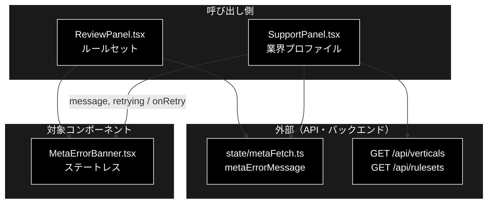
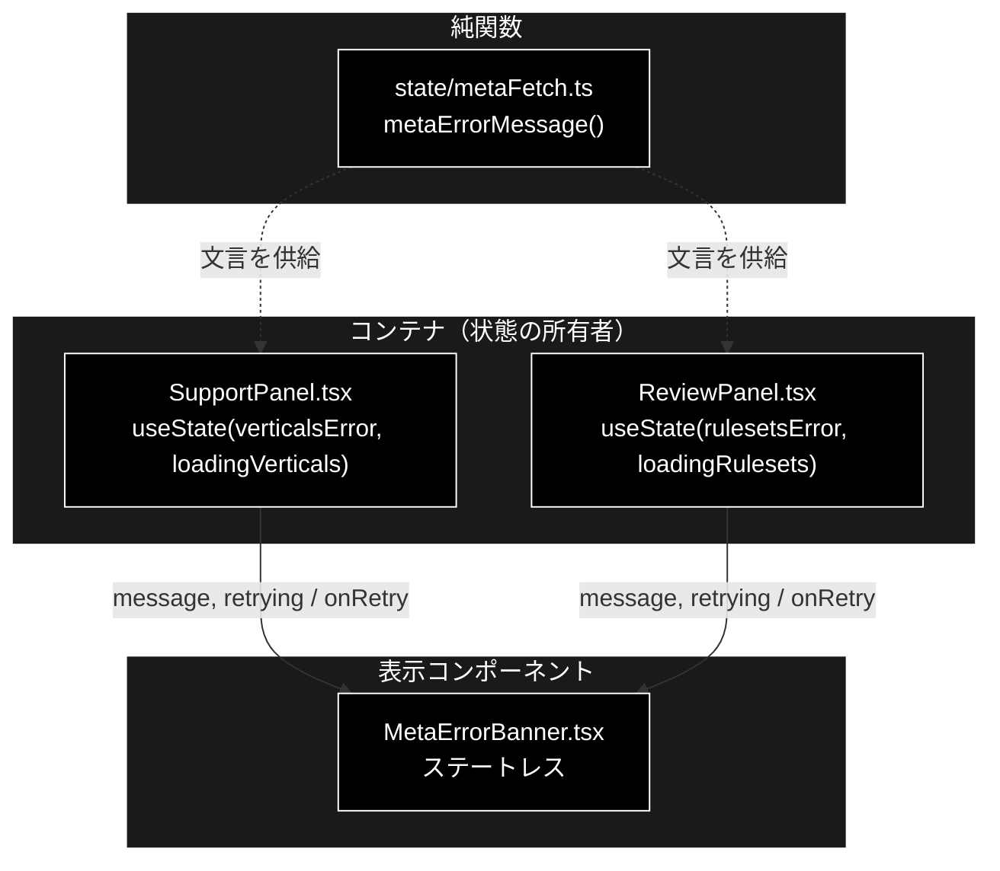
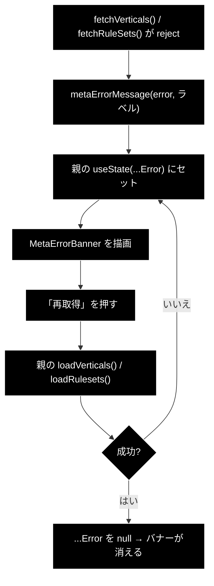

# MetaErrorBanner.tsx - メタ取得エラーのバナー ドキュメント

**Version 1.1** | 最終更新: 2026-09-24

---

## 目次

1. [概要](#概要)
2. [コンポーネントツリー図](#12-コンポーネントツリー図)
3. [Props インターフェース](#2-props-インターフェース)
4. [状態管理](#3-状態管理)
5. [データフロー・副作用](#4-データフロー副作用)
6. [ユーザー操作フロー](#5-ユーザー操作フロー)
7. [型定義とバックエンド対応](#6-型定義とバックエンド対応)
8. [スタイル・アクセシビリティ](#7-スタイルアクセシビリティ)
9. [テスト](#8-テスト)
10. [変更履歴](#9-変更履歴)

---

## 概要

| 項目 | 内容 |
|---|---|
| ファイル | `frontend/src/components/MetaErrorBanner.tsx`（24 行） |
| 種別 | **表示コンポーネント（ステートレス）** |
| 親 | `SupportPanel.tsx` / `ReviewPanel.tsx` |
| 子 | なし |
| 主な依存 | なし（文言の組み立ては親が `state/metaFetch.ts` で行う） |
| 対応バックエンド | `GET /api/verticals`（`api/meta.py`）/ `GET /api/rulesets`（同） |

メタ情報（業界プロファイル / ルールセット）の**取得に失敗したことを伝える**バナー。

> ⚠️ **このコンポーネントが在る理由＝silent failure の解消。** 以前は
> `.catch(() => setState([]))` で取得失敗を**完全に握りつぶして**いた。バックエンド
> （:8000）が起動していないと画面には「業界プロファイル: （なし）」としか出ず、
> **なぜ選べないのかがユーザーに一切伝わらなかった**。
> 空配列に倒すこと自体は正しい（古い選択肢を残すより安全）が、**理由を必ず添える**。

### 主な責務

- 受け取った `message` を警告バナーとして表示する
- 「再取得」ボタンを出し、**ページをリロードせずに**復帰できるようにする
- 再取得中はボタンを無効化して二重送信を防ぐ

### 各責務対応のモジュール

| # | 責務 | 対応モジュール | 説明 |
|---|---|---|---|
| 1 | 失敗理由の表示 | `MetaErrorBanner.tsx` / `state/metaFetch.ts` | 文言は親が `metaErrorMessage` で作って渡す |
| 2 | 再取得ボタン | `MetaErrorBanner.tsx` | `onRetry` を親へ返す |
| 3 | 再取得中の無効化 | `MetaErrorBanner.tsx` | `retrying` で `disabled` |

### 主要機能一覧

| 機能 | 実装 | 説明 |
|---|---|---|
| 理由の表示 | `<span>⚠️ {message}</span>` | 文言は親が `metaErrorMessage()` で組み立てたもの |
| 再取得 | `onClick={onRetry}` | 親の `loadVerticals()` / `loadRulesets()` を呼ぶ |
| 二重送信の防止 | `disabled={retrying}` | ラベルも「再取得中…」へ変わる |
| 支援技術への通知 | `role="alert"` | 出現した瞬間に読み上げられる |

---

## 1. アーキテクチャ構成図

### 1.1 システム全体での位置づけ



**データフロー**:

1. 親パネルがメタ情報（業界プロファイル / ルールセット）を取得し、失敗時に `metaErrorMessage` で文言を作る
2. 本コンポーネントが文言と再取得ボタンを表示する
3. 再取得ボタンで親の `onRetry` が呼ばれ、同じ API を取り直す

### 1.2 コンポーネントツリー図



---

## 2. Props インターフェース

```typescript
interface Props {
  message: string;
  onRetry: () => void;
  /** 再取得中はボタンを無効化して二重送信を防ぐ。 */
  retrying?: boolean;
}
```

| Prop | 型 | 必須 | 既定値 | 説明 |
|---|---|:---:|---|---|
| `message` | `string` | ✅ | — | 表示する理由。`state/metaFetch.ts` の `metaErrorMessage()` が作る |
| `onRetry` | `() => void` | ✅ | — | 「再取得」押下時に呼ぶ |
| `retrying` | `boolean` | | `false` | 再取得中。ボタンを `disabled` にしラベルを変える |

### コールバックの契約

| コールバック | 呼ばれる条件 | 親側の責務 |
|---|---|---|
| `onRetry` | 「再取得」ボタンの `click`（`retrying === false` のとき） | メタ取得を再実行し、成功なら `message` を `null` にしてバナーを消す |

> ⚠️ **`message` の文言をこのコンポーネントで組み立てない。** 判断（どのエラーに
> どの復旧手順を添えるか）は `state/metaFetch.ts` の純関数が持つ。vitest は
> `.test.tsx` を収集しないため、ここに分岐を書くとテストできなくなる（CLAUDE.md §6）。

---

## 3. 状態管理

**ステートレス。** `useState` / `useReducer` / `useEffect` を一切持たない。
表示に必要な値はすべて props で受け取る。

「エラーが起きているか」「再取得中か」の状態は**親（`SupportPanel` / `ReviewPanel`）が持つ**。

---

## 4. データフロー・副作用

**副作用なし。** `fetch` も `EventSource` も呼ばない。再取得の実処理は親の責務。



---

## 5. ユーザー操作フロー

### 5.1 イベントハンドラ一覧

| 要素 | イベント | ハンドラ | 効果 | 無効化条件 |
|---|---|---|---|---|
| 「再取得」ボタン | `click` | `onRetry`（親から） | メタ情報の再取得 | `retrying === true` |

### 5.2 表示の出し分け

| 表示 | 条件 |
|---|---|
| バナー全体 | 親が `message`（非 null）を渡したときだけ描画する（**このコンポーネント自身は条件を持たない**） |
| ボタンのラベル | `retrying ? '再取得中…' : '再取得'` |

### 5.3 再現手順（テスト・撮影用）

backend（:8000）を**落としたまま**画面を開くと出る。README のスロット **[E-02]**
がこの状態のスクリーンショットで、次の 3 つが読めることを条件にしている。

1. 「業界プロファイルを取得できませんでした」
2. `./run_dev.sh` の案内
3. 「再取得」ボタン

---

## 6. 型定義とバックエンド対応

バックエンド由来の型は扱わない（`message` は `string`）。ただし**文言はバックエンドの
エラー応答に依存する**ため、`state/metaFetch.ts` 側が対応関係を持つ。

| 状況 | 文言の骨子 |
|---|---|
| backend 停止 / 接続不可 | 「〜を取得できませんでした。バックエンド（http://localhost:8000）が起動しているか確認してください。リポジトリルートで ./run_dev.sh を実行すると backend と frontend が同時に起動します。」 |

---

## 7. スタイル・アクセシビリティ

| 項目 | 内容 |
|---|---|
| スタイル方式 | プレーン CSS（`src/styles.css`） |
| 主要クラス | `.warn-banner.meta-error` |
| ダークモード | 未対応 |

### アクセシビリティ・チェック

| 観点 | 状態 | 補足 |
|---|:--:|---|
| 出現が支援技術へ通知されるか | ✅ | `role="alert"` |
| 二重送信が防げるか | ✅ | `retrying` でボタンを `disabled` |
| 操作中であることが伝わるか | ✅ | ラベルが「再取得中…」に変わる |
| キーボードのみで再取得できるか | ✅ | `<button type="button">` |

---

## 8. テスト

| テストファイル | 対象 | 件数 |
|---|---|---:|
| `src/state/metaFetch.test.ts` | 文言の組み立て（`metaErrorMessage()`） | 10 |

**2026-09-12 に `npm test` を実行した実測値。**

このコンポーネント自体のレンダリングテストは**持たない**。`@testing-library/react`
が未導入で、vitest の `include` が `src/**/*.test.ts` のため `.test.tsx` は収集されない
（CLAUDE.md §6）。判断は `metaFetch.ts` 側にあり、そちらでテストしている。

---

## 9. 変更履歴

| 版 | 日付 | 変更内容 |
|---|---|---|
| 1.0 | 2026-09-12 | 初版作成。実装は 2026-08-18 からあったが文書が無かった（`frontend/docs/README.md` の索引が無く欠落を検知できていなかった） |
| 1.1 | 2026-09-24 | `a_react_page_md_format.md` v1.1 に追随（2026-09-24）。概要に「各責務対応のモジュール」（主な責務と 1:1）を追加し、`## 1.` を「アーキテクチャ構成図」として **1.1 システム全体での位置づけ（3 層）** と 1.2 コンポーネントツリー図の 2 枚構成にした。Mermaid の `classDef subgraphStyle` の欠落を補った |
