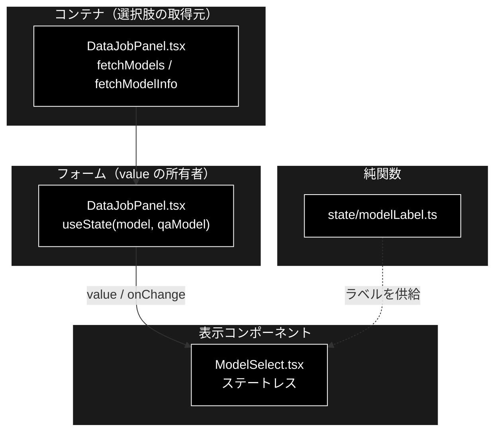
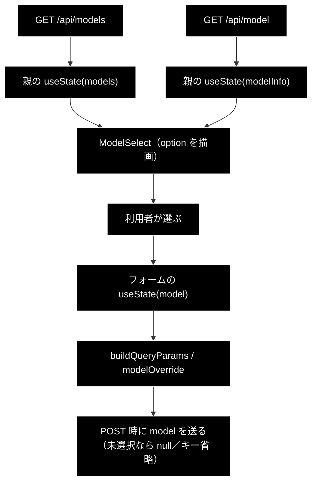

# ModelSelect.tsx - モデルセレクタ ドキュメント

**Version 1.3** | 最終更新: 2026-09-23

---

## 目次

1. [概要](#概要)
2. [コンポーネントツリー図](#1-コンポーネントツリー図)
3. [Props インターフェース](#2-props-インターフェース)
4. [状態管理](#3-状態管理)
5. [データフロー・副作用](#4-データフロー副作用)
6. [ユーザー操作フロー](#5-ユーザー操作フロー)
7. [型定義とバックエンド対応](#6-型定義とバックエンド対応)
8. [スタイル・アクセシビリティ](#7-スタイルアクセシビリティ)
9. [テスト](#8-テスト)
10. [変更履歴](#9-変更履歴)

---

## 概要

| 項目 | 内容 |
|---|---|
| ファイル | `frontend/src/components/ModelSelect.tsx`（54 行） |
| 種別 | **表示コンポーネント（ステートレス）** |
| 親 | **なし（未使用）**。全タブのモデル選択はヘッダー（`App.tsx`）へ移した |
| 子 | なし |
| 主な依存 | `../state/modelLabel`（`defaultOptionLabel` / `modelOptionLabel`） |
| 対応バックエンド | `GET /api/models`（`api/meta.py`）／ `GET /api/model`（同） |

> ⚠️ **現在どこからも使われていない**（2026-09-23）。全タブのモデル選択を
> ヘッダー（`App.tsx` のタイトル横・`state/headerModel.ts`）へ移したため。
> 削除するかどうかは未決（削除は確認を取ってから行う方針のため残してある）。
> 以下は使われていた当時の仕様である。

**データ管理タブ（`DataJobPanel`）のモデルセレクタだった**。選択肢は `GET /api/models` が返す
4 件（`claude-fable-5-1` / `claude-opus-5-5` / `claude-sonnet-5` / `claude-haiku-4-5`・上位 → 軽量の順）で、
**未選択（空文字）は「サーバーの既定値を使う」**を意味する。


> ⚠️ **既定のモデル名をフロントに持たせない。** 「（既定値: …）」に出す実名は
> `GET /api/model` から受け取る（`defaultModel` prop）。フロントに焼き付けると、
> `config/grace_config.yml` を変えたときに**画面と実挙動がずれる**。
>
> ⚠️ **Embedding はここに出てこない。** Embedding は Gemini
> `gemini-embedding-001`（3072 次元）固定で、変えると既存 Qdrant コレクションと
> 次元が合わず全件再登録になる（`backend/docs/config_and_providers.md` §3.1）。

### 主な責務

- `models` を `<option>` として並べ、選択結果を `onChange` で親へ返す
- 先頭に「未選択＝サーバーの既定値」の `<option value="">` を置く
- 実行中（`disabled`）は操作を受け付けない

### 主要機能一覧

| 機能 | 実装 | 説明 |
|---|---|---|
| 未選択の表示 | `defaultOptionLabel(defaultModel ?? '')` | 既定値が分かれば「（既定値: <名前>）」、不明なら「（既定値）」 |
| 選択肢の表示 | `modelOptionLabel(m)` | モデル名に入力・出力単価を添える（4 つで 10 倍の開きがある） |
| 二重操作の防止 | `disabled` | 実行中は `<select>` ごと無効 |

---

## 1. コンポーネントツリー図



---

## 2. Props インターフェース

```typescript
interface Props {
  models: ModelChoice[];
  value: string;
  onChange: (value: string) => void;
  disabled?: boolean;
  /**
   * サーバーが既定として使うモデル名（`GET /api/model` の `model`）。
   * 渡すと未選択の項目が「（既定値: <名前>）」になり、**何で走るかが見える**。
   * 未取得なら空文字（「（既定値）」と出る）。
   */
  defaultModel?: string;
}
```

| Prop | 型 | 必須 | 既定値 | 説明 |
|---|---|:---:|---|---|
| `models` | `ModelChoice[]` | ✅ | — | `/api/models` の取得結果。空でもフォームは動く（「（既定値）」のみ） |
| `value` | `string` | ✅ | — | 選択中のモデル ID。**空文字＝未選択** |
| `onChange` | `(value: string) => void` | ✅ | — | 選択変更時に親の state を更新する |
| `disabled` | `boolean` | | `false` | 実行中は `true` |
| `defaultModel` | `string` | | `''` | 未選択項目に出す既定モデル名 |

> ⚠️ **`defaultModel` に渡す値はタブで違う。** Support / Review は
> `ModelInfo.model`、データ管理タブは `ModelInfo.chunking_model` /
> `ModelInfo.qa_model` である。チャンク化の既定は軽量モデルなので、`model` を
> 渡すと**実際に走るモデルと違う名前**を表示してしまう。

---

## 3. 状態管理

**ステートレス。** `useState` / `useEffect` を持たない。選択値は親が持つ
（制御コンポーネント）。

| 誰が | 何を持つ |
|---|---|
| `DataJobPanel` | `models`（選択肢）・`modelInfo`（既定値）・`model` / `qaModel`（選択値） |
| `ModelSelect` | 何も持たない |

---

## 4. データフロー・副作用

**副作用なし。** `fetch` は親が行う。



### 取得に失敗したとき

`models` が空配列になり、「（既定値）」だけが残る。**バナーは出さない。**
業界プロファイル（`MetaErrorBanner`）と違い、空でも**サーバーの既定モデルで
正しく実行できる**ためである（選べないだけで機能は失われない）。

---

## 5. ユーザー操作フロー

### 5.1 イベントハンドラ一覧

| 要素 | イベント | ハンドラ | 効果 | 無効化条件 |
|---|---|---|---|---|
| `<select>` | `change` | `onChange(e.target.value)` | 親の `model` state を更新 | `disabled === true` |

### 5.2 表示の出し分け

| 表示 | 条件 |
|---|---|
| `（既定値: claude-sonnet-5）` | `defaultModel` が非空 |
| `（既定値）` | `defaultModel` が空文字・未取得 |
| モデル 1 件 | `models` の各要素（単価つき） |

---

## 6. 型定義とバックエンド対応

| frontend（`types.ts`） | backend（`schemas.py`） | 供給元 |
|---|---|---|
| `ModelChoice` | `ModelChoice` | `GET /api/models` |
| `ModelInfo` | `ModelInfo` | `GET /api/model` |

送信側の対応:

| 画面 | 未選択のときの送り方 | 根拠 |
|---|---|---|
| Support / Review | `model: null` | `QueryRequest.model` / `ReviewRequest.model` は `Optional` |
| データ管理 | **`model` キーごと省略** | `ChunkingRequest.model` / `QaGenerationRequest.model` は既定値つき必須。空文字は 422 |

---

## 7. スタイル・アクセシビリティ

| 項目 | 内容 |
|---|---|
| スタイル方式 | プレーン CSS（`src/styles.css`）。`.query-options label` の既存スタイルに乗る |
| ダークモード | 未対応（他のフォーム要素と同じ） |

### アクセシビリティ・チェック

| 観点 | 状態 | 補足 |
|---|:--:|---|
| ラベルと関連づいているか | ✅ | `<label>` が `<select>` を内包している |
| キーボードだけで選べるか | ✅ | ネイティブの `<select>` |
| 実行中であることが伝わるか | ✅ | `disabled` |
| 何で走るかが分かるか | ✅ | 未選択項目に既定モデル名を出す |

---

## 8. テスト

| テストファイル | 対象 | 件数 |
|---|---|---:|
| `src/state/modelLabel.test.ts` | `formatModelLabel` / `defaultOptionLabel` / `modelOptionLabel` | 9 |

**2026-09-16 に `npm test` を実行した実測値**（フロント全体は 20 ファイル / 288 件）。

このコンポーネント自体のレンダリングテストは**持たない**。`@testing-library/react`
が未導入で、vitest の `include` が `src/**/*.test.ts` のため `.test.tsx` は収集されない
（CLAUDE.md §6）。判断（何を出し、何を出さないか）は `modelLabel.ts` 側にあり、
そちらでテストしている。

バックエンド側の対応は `backend/tests/test_model_selection.py`（26 件）。

---

## 9. 変更履歴

| 版 | 日付 | 変更内容 |
|---|---|---|
| 1.3 | 2026-09-23 | **未使用になった。** データ管理タブもヘッダーの 2 つのセレクタ（① チャンキング / ② Q/A 作成）で選ぶようにしたため、`DataJobPanel` からも外した |
| 1.2 | 2026-09-23 | **基本版 / Support / Review での利用をやめた**（モデル選択をヘッダーへ移したため）。利用箇所はデータ管理タブ（`DataJobPanel`）のみ。ツリー図・状態の所有者を追随 |
| 1.1 | 2026-09-23 | 選択肢を 4 件へ変更（`claude-fable-5-1` / `claude-opus-5-5` を追加、旧上位 `claude-opus-5` を外した）。コンポーネントの実装は無変更（選択肢はサーバーが返す） |
| 1.0 | 2026-09-16 | 初版作成。既定を `claude-sonnet-5` とし、`claude-opus-5` / `claude-haiku-4-5` を選べるようにする改修に合わせて新設した |
