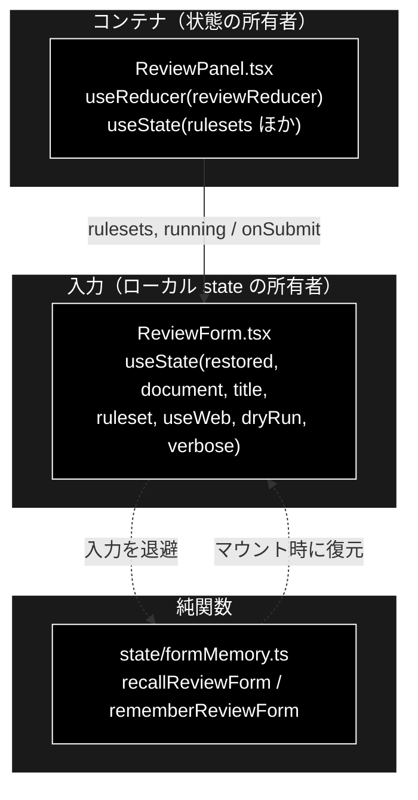
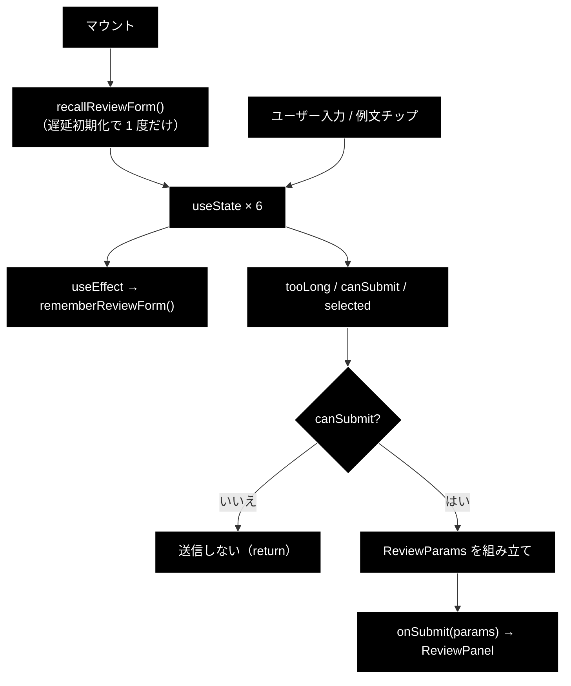

# ReviewForm.tsx - 文書レビュー入力フォーム ドキュメント

**Version 1.0** | 最終更新: 2026-09-12

---

## 目次

1. [概要](#概要)
2. [コンポーネントツリー図](#1-コンポーネントツリー図)
3. [Props インターフェース](#2-props-インターフェース)
4. [状態管理](#3-状態管理)
5. [データフロー・副作用](#4-データフロー副作用)
6. [ユーザー操作フロー](#5-ユーザー操作フロー)
7. [型定義とバックエンド対応](#6-型定義とバックエンド対応)
8. [スタイル・アクセシビリティ](#7-スタイルアクセシビリティ)
9. [テスト](#8-テスト)
10. [変更履歴](#9-変更履歴)

---

## 概要

| 項目 | 内容 |
|---|---|
| ファイル | `frontend/src/components/ReviewForm.tsx`（210 行） |
| 種別 | **状態保持コンポーネント**（`useState` × 7） |
| 親 | `ReviewPanel.tsx` |
| 子 | なし |
| 主な依存 | `../state/formMemory`（`recallReviewForm` / `rememberReviewForm`） |
| 対応バックエンド | `POST /api/review/submit`（`api/review.py`）/ `ReviewRequest`（`schemas.py`） |

GRACE-Review の入力フォーム。**文書 textarea・ルールセットセレクタ・実行オプション・
例文チップ**を持つ。Support 側の `QueryForm` と対になる。

### 主な責務

- 点検対象の文書とタイトルを受け取り、`ReviewParams` を組み立てて親へ渡す
- 文字数上限（50,000 字）を**送信前に**判定して弾く
- タブ切替で入力が消えないよう `formMemory` へ退避・復元する
- 例文チップで「押せば期待どおりの結果が出る」サンプルを流し込む

### 主要機能一覧

| 機能 | 実装 | 説明 |
|---|---|---|
| 入力の退避・復元 | `recallReviewForm()` / `rememberReviewForm()` | **タブ切替はアンマウント**なので退避しないと全部消える |
| 文字数の上限判定 | `tooLong = document.length > MAX_DOCUMENT_CHARS` | 50,000 字。`schemas.py` の `MAX_DOCUMENT_CHARS` と一致させる |
| 送信可否 | `canSubmit` | 空白のみ不可・上限超過不可・実行中不可 |
| ルールセット注記 | `selected` から対象法令・常時チェック件数・支持率を表示 | 選択中のルールセットの中身を見せる |
| 例文チップ | `EXAMPLES.map(...)` | 3 件。**テストから参照するため `export` している** |

> ⚠️ **`MAX_DOCUMENT_CHARS`（50,000）は `backend/app/schemas.py` と一致させること。**
> ズレると、フロントは通すのに API が 422 を返す（またはその逆）。

---

## 1. コンポーネントツリー図



---

## 2. Props インターフェース

```typescript
interface Props {
  rulesets: RuleSetInfo[];
  running: boolean;
  onSubmit: (params: ReviewParams) => void;
}
```

| Prop | 型 | 必須 | 既定値 | 説明 |
|---|---|:---:|---|---|
| `rulesets` | `RuleSetInfo[]` | ✅ | — | `/api/rulesets` の取得結果。セレクタの選択肢 |
| `running` | `boolean` | ✅ | — | 実行中フラグ。`true` の間は全入力を `disabled` |
| `onSubmit` | `(params: ReviewParams) => void` | ✅ | — | 送信時に `ReviewParams` を親へ返す |

### コールバックの契約

| コールバック | 呼ばれる条件 | 親側の責務 |
|---|---|---|
| `onSubmit` | form submit かつ `canSubmit`（文書が空白でなく、50,000 字以下、`running === false`） | 前回購読の解除 → ジョブ起動 → SSE 購読開始 |

> 📝 **取得に失敗して `rulesets` が空でもフォームは動く。** セレクタが空になるだけで、
> `ruleset` は `null` として送られる。失敗の理由は親が `MetaErrorBanner` で出す。

---

## 3. 状態管理

### 3.1 ローカル state（`useState` × 7）

| 変数 | 型 | 初期値 | 更新契機 | 説明 |
|---|---|---|---|---|
| `restored` | `ReviewFormMemory` | `recallReviewForm()` | **初回のみ**（遅延初期化） | 退避から復元した値。以降は読まない |
| `document` | `string` | `restored.document` | textarea の `onChange` / 例文チップ | 点検対象の本文 |
| `title` | `string` | `restored.title` | テキスト入力 / 例文チップ | 文書タイトル。空なら送信時に `'無題'` |
| `ruleset` | `string` | `restored.ruleset` | セレクタ変更 | 空文字は `null` として送る |
| `useWeb` | `boolean` | `restored.useWeb` | チェックボックス | **既定 OFF**（条文が一次情報のため） |
| `dryRun` | `boolean` | `restored.dryRun` | チェックボックス | **既定 ON**（起票せずログのみ） |
| `verbose` | `boolean` | `restored.verbose` | チェックボックス | 詳細ログ |

> ⚠️ **`restored` は `useState(() => recallReviewForm())` の遅延初期化で 1 度だけ引く。**
> 毎レンダーで読み直すと**入力中に上書きされる**。

### 3.2 reducer state

**持たない。** ジョブの状態は親（`ReviewPanel`）の `reviewReducer` にある。

### 3.3 親から渡る状態（props 由来）

| 値 | 供給元 | 本コンポーネントでの扱い |
|---|---|---|
| `rulesets` | `ReviewPanel` の `useState` | 読み取りのみ。セレクタと注記に使う |
| `running` | `ReviewPanel` の `state.phase === 'running'` | 全入力の `disabled` と `canSubmit` に使う |

### 3.4 派生値

| 値 | 導出 | 用途 |
|---|---|---|
| `tooLong` | `document.length > MAX_DOCUMENT_CHARS` | カウンタの警告表示・送信の抑止 |
| `canSubmit` | `!!document.trim() && !tooLong && !running` | 送信ボタンの `disabled` |
| `selected` | `rulesets.find((r) => r.id === ruleset)` | 対象法令・常時チェック件数・支持率の注記 |

---

## 4. データフロー・副作用

### 4.1 副作用一覧（`useEffect`）

| # | 目的 | 依存配列 | クリーンアップ | 備考 |
|---|---|---|---|---|
| 1 | 入力内容の退避 | `[document, title, ruleset, useWeb, dryRun, verbose]` | なし | 変更のたびに `rememberReviewForm()` を呼ぶ |

```tsx
useEffect(() => {
  rememberReviewForm({ document, title, ruleset, useWeb, dryRun, verbose });
}, [document, title, ruleset, useWeb, dryRun, verbose]);
```

> ⚠️ **退避は「あれば便利」ではなく不具合の修正である。** `App.tsx` はタブを
> **アンマウントで切り替える**（SSE を確実に閉じるため）。退避しないと、貼り付けた
> 文書も外した dry-run も**既定値へ勝手に戻る**。同じ問題が Support 側の
> `QueryForm` にもあり、`formMemory.ts` が両方を受け持っている。

### 4.2 データフロー図



---

## 5. ユーザー操作フロー

### 5.1 イベントハンドラ一覧

| 要素 | イベント | ハンドラ | 効果 | 無効化条件 |
|---|---|---|---|---|
| フォーム | `submit` | `submit(e)` | `preventDefault()` → `onSubmit(params)` | `!canSubmit` なら `return` |
| タイトル入力 | `change` | `setTitle` | — | `running` |
| 文書 textarea | `change` | `setDocument` | — | `running` |
| ルールセット | `change` | `setRuleset` | — | `running` |
| Web 裏取り / dry-run / 詳細ログ | `change` | 各 setter | — | `running` |
| 例文チップ（3 件） | `click` | `setDocument` + `setTitle` | 例文を流し込む | `running` |
| 送信ボタン | `click`（submit） | 同上 | ラベルは `running ? '点検中…' : '表示チェックを実行'` | `!canSubmit` |

### 5.2 送信時の変換

```tsx
onSubmit({
  document,
  document_title: title.trim() || '無題',
  ruleset: ruleset || null,
  use_web: useWeb,
  do_action: true,
  dry_run: dryRun,
  verbose,
});
```

| 変換 | 理由 |
|---|---|
| `title.trim() || '無題'` | 空タイトルを送らない |
| `ruleset || null` | 空文字ではなく `null`（＝未指定）で送る |
| `do_action: true` 固定 | **UI にトグルが無い。** 実行の可否は `dry_run` 側で制御する |

### 5.3 例文チップ（`EXAMPLES`）

**テストから参照するため `export` している**（`ReviewForm.examples.test.ts`）。
サンプルは「押せば期待どおりの結果が出る」ことに意味があるので、
中身を手で書き換えたときに気付けるようにしてある。

| ラベル | 期待する結果 | 壊してはいけない点 |
|---|---|---|
| `NG 例（優良誤認・薬機法）` | 指摘あり | 「業界No.1」「シミが治る」「副作用がない」 |
| `NG 例（表記漏れ・規程不一致）` | 指摘 4 件 | 特商法 第11条 の 3 項目（送料 / 支払時期方法 / 引渡時期）を**欠いた**まま、返品 8日 |
| `OK 例（指摘 0 件を期待）` | **指摘 0 件** | 第11条 の全項目を満たし、返品 **14日**（社内規程と一致） |

> ⚠️ **`OK 例` を変えるときは「指摘 0 件」を壊していないか確認すること。**
> 1 項目でも削ると該当ルールが発火する（送料→`tokusho-01` / 支払方法→`tokusho-02` /
> 発送時期→`tokusho-03` / 返品 14日→`policy-01`）。
>
> 📌 **2 番目のラベルは実態に合わせて改名された経緯がある。** 以前は
> 「OK 例（特商法表記あり）」という名前だったが、中身は 3 項目を欠き返品も 8日 で、
> **押すと必ず 4 件の指摘が出た**（実測 2026-08-20 15:00）。「OK 例」なのに指摘が出ると
> **製品の不具合と区別がつかない**ため、`NG 例（表記漏れ・規程不一致）` へ改めた。

---

## 6. 型定義とバックエンド対応

| TS 型（`src/types.ts`） | 対応する Python | 定義元 |
|---|---|---|
| `ReviewParams` | `ReviewRequest` | `backend/app/schemas.py` |
| `RuleSetInfo` | `RuleSetInfo` | `backend/app/schemas.py` |
| `MAX_DOCUMENT_CHARS`（本ファイルの定数 50000） | `MAX_DOCUMENT_CHARS` | `backend/app/schemas.py` |

> ⚠️ **バックエンドのスキーマを変えたら `src/types.ts` も必ず追随させる。**
> `frontend` は blocking な CI ゲート（`tsc --noEmit`）なので、型がズレると
> **PR がマージできなくなる**。

---

## 7. スタイル・アクセシビリティ

| 項目 | 内容 |
|---|---|
| スタイル方式 | プレーン CSS（`src/styles.css`） |
| 主要クラス | `.review-form`, `.review-row`, `.review-document`, `.review-counter`（超過時 `.over`）, `.query-options`, `.review-ruleset-note`, `.query-examples`, `.example-chip` |
| ダークモード | 未対応 |

### アクセシビリティ・チェック

| 観点 | 状態 | 補足 |
|---|:--:|---|
| 各入力にラベルがあるか | ⚠️ 一部 | チェックボックスは `<label>` で囲んでいるが、**タイトル入力と文書 textarea は `placeholder` のみ**（`<label>` なし） |
| 文字数超過が伝わるか | ⚠️ | `.review-counter.over` は**視覚のみ**。`aria-live` / `aria-invalid` は未設定 |
| 二重送信が防げるか | ✅ | `canSubmit` で送信ボタンを `disabled` |
| 実行中の入力が防げるか | ✅ | 全入力に `disabled={running}` |
| キーボードのみで操作できるか | ✅ | すべて `<input>` / `<select>` / `<textarea>` / `<button>` |

> 📌 **改善候補**: タイトル・文書に `<label>` を付ける、超過時に `aria-invalid` と
> `aria-live` を足す。いずれも未対応（本書作成時点の事実）。

---

## 8. テスト

| テストファイル | 対象 | 件数 |
|---|---|---:|
| `src/components/ReviewForm.examples.test.ts` | **`EXAMPLES` の中身**（各例文が満たすべき条件） | 17 |
| `src/state/formMemory.test.ts` | 入力の退避と復元 | 13 |

**2026-09-12 に `npm test` を実行した実測値。**

### テスト方針

- `ReviewForm.examples.test.ts` は**コンポーネントではなく `EXAMPLES` 定数**を検証する。
  `.test.ts`（`.tsx` ではない）なので vitest に収集される。
- コンポーネント自体のレンダリングテストは持たない（`@testing-library/react` 未導入・
  vitest の `include` が `src/**/*.test.ts`。CLAUDE.md §6）。
- **判断ロジックをこのファイルに増やさないこと。** `canSubmit` のような小さな派生は
  許容しているが、分岐が増えるなら `state/` の純関数へ出す。

---

## 9. 変更履歴

| 版 | 日付 | 変更内容 |
|---|---|---|
| 1.0 | 2026-09-12 | 初版作成。実装は 2026-08-20 からあったが文書が無かった（`frontend/docs/README.md` の索引が無く欠落を検知できていなかった） |
