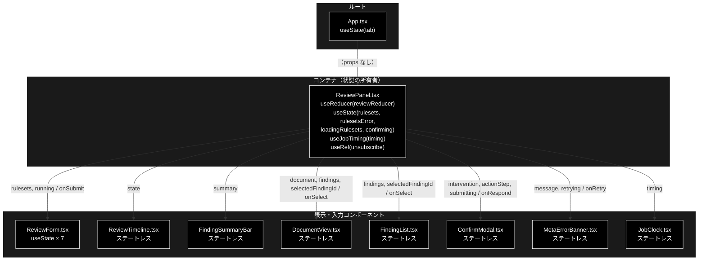
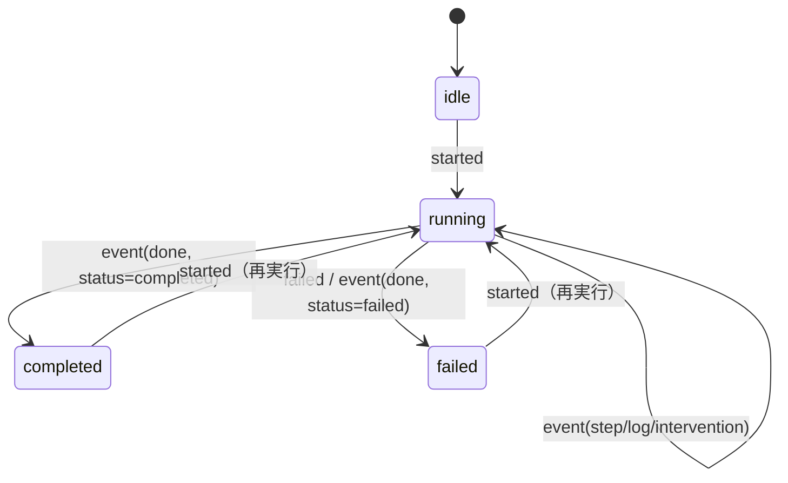
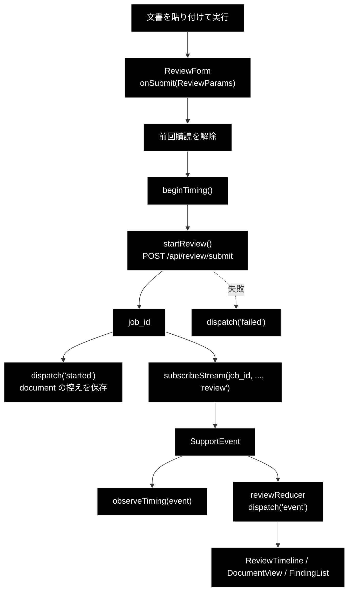
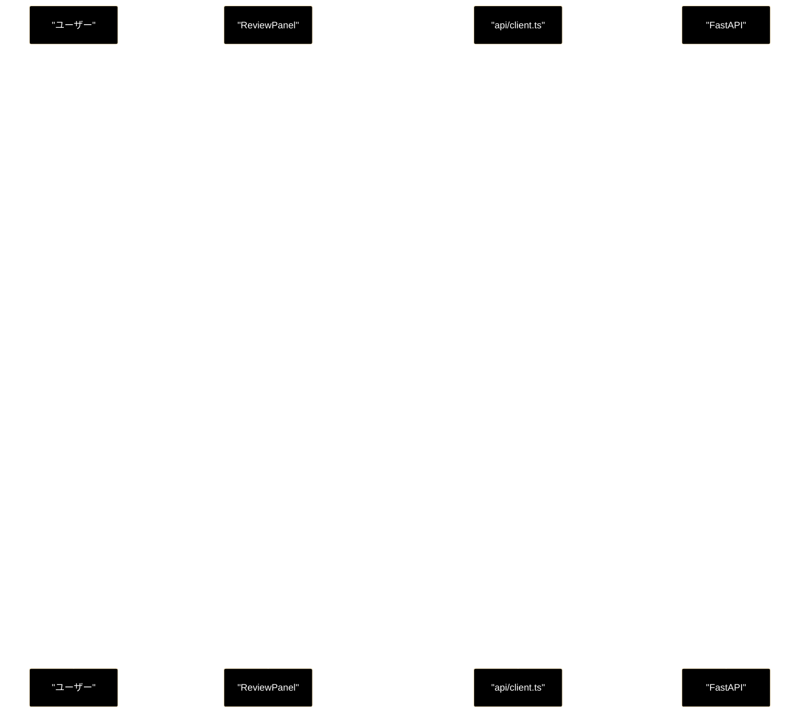
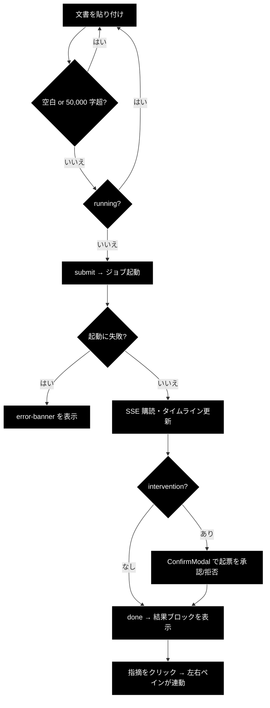

# ReviewPanel.tsx - 文書 → 指摘 パネル ドキュメント

**Version 1.1** | 最終更新: 2026-09-12

---

## 目次

1. [概要](#概要)
2. [コンポーネントツリー図](#1-コンポーネントツリー図)
3. [Props インターフェース](#2-props-インターフェース)
4. [状態管理](#3-状態管理)
5. [データフロー・副作用](#4-データフロー副作用)
6. [API 通信・SSE イベント](#5-api-通信sse-イベント)
7. [ユーザー操作フロー](#6-ユーザー操作フロー)
8. [型定義とバックエンド対応](#7-型定義とバックエンド対応)
9. [スタイル・アクセシビリティ](#8-スタイルアクセシビリティ)
10. [テスト](#9-テスト)
11. [変更履歴](#10-変更履歴)

---

## 概要

| 項目 | 内容 |
|---|---|
| ファイル | `frontend/src/components/ReviewPanel.tsx`（200 行） |
| 種別 | **コンテナコンポーネント**（reducer・副作用・API 呼び出しを束ねる） |
| 親 | `App.tsx`（`tab === 'review'` のとき） |
| 子 | `ReviewForm` / `ReviewTimeline` / `DocumentView` / `FindingList`（`FindingSummaryBar`）/ `ConfirmModal` / `MetaErrorBanner` / `JobClock` |
| 主な依存 | `../api/client` / `../state/reviewReducer` / `../state/metaFetch` / `../state/useJobTiming` |
| 対応バックエンド | `backend/app/core/review_agent.py`（`REVIEW_STEP_IDS`）/ `api/review.py` |

GRACE-Review（**文書 → 指摘**）のタブ本体。

> **Support との関係**: **通信の形は同じ**（POST でジョブ起動 → SSE で進捗 →
> HITL 応答）。違うのは**結果の見せ方**で、原文ハイライト（`DocumentView`）と
> 指摘カード（`FindingList`）を左右に並べ、選択状態で相互にジャンプできる。
>
> ⚠️ **Support と Review は別コアである。** `SupportPanel` は
> `run_support_agent_core`、こちらは `review_agent.py` を通る。ステップ ID も
> 別系統（`REVIEW_STEP_IDS`）なので、`jobReducer` ではなく `reviewReducer` を使う。

### 主な責務

- フォームから受けたパラメータでレビュージョブを起動する（`POST /api/review/submit`）
- SSE を購読し、届いたイベントを `reviewReducer` へ流す
- HITL CONFIRM の承認 / 拒否をバックエンドへ送る
- ルールセット一覧を取得し、**失敗理由を `MetaErrorBanner` で伝える**
- 指摘の選択状態（`selectedFindingId`）を持ち、左右ペインで共有する
- 打ち切り（`truncated`）と KPI を表示する

### 主要機能一覧

| 機能 | 実装 | 説明 |
|---|---|---|
| ジョブ起動 | `submit(params)` | `startReview()` → `dispatch('started')` → `subscribeStream(..., 'review')` |
| 多重購読の防止 | `unsubscribeRef.current?.()` | **新しい送信の直前**に前回の購読を切る |
| HITL 応答 | `respond(approve)` | `confirmReviewIntervention()` → `dispatch('confirm_sent')` |
| 指摘の選択 | `select(findingId)` | `dispatch('select_finding')`。左右ペインで共有 |
| メタ取得失敗の可視化 | `metaErrorMessage()` + `MetaErrorBanner` | **握りつぶさない**。`onRetry` で再取得 |
| 所要時間の表示 | `useJobTiming(state.phase)` | 開始は押下時、完了は phase の決着で自動記録 |
| 打ち切りの警告 | `result.truncated` | 「分割して再実行してください」 |

---

## 1. コンポーネントツリー図



---

## 2. Props インターフェース

**Props なし**（`export function ReviewPanel()`）。

`SupportPanel` と違い `variant` を取らない。Review タブは 1 つしかないため。

### 子へ渡す props

| 子 | 渡す props |
|---|---|
| `ReviewForm` | `rulesets` / `running`（`phase === 'running'`）/ `onSubmit` |
| `ReviewTimeline` | `state`（`ReviewJobState` 全体） |
| `FindingSummaryBar` | `summary`（`result.summary`） |
| `DocumentView` | `document`（`state.document`）/ `findings` / `selectedFindingId` / `onSelect` |
| `FindingList` | `findings` / `selectedFindingId` / `onSelect` |
| `ConfirmModal` | `intervention` / `actionStep`（`state.steps.action`）/ `submitting` / `onRespond` |
| `MetaErrorBanner` | `message`（`rulesetsError`）/ `retrying`（`loadingRulesets`）/ `onRetry` |
| `JobStartLine` / `JobFinishLine` | `timing` |

### コールバックの契約

| コールバック | 呼ばれる条件 | 本コンポーネントの責務 |
|---|---|---|
| `onSubmit`（← `ReviewForm`） | form submit かつ `canSubmit` | 前回購読の解除 → ジョブ起動 → SSE 購読開始 |
| `onRespond`（← `ConfirmModal`） | 承認 / 拒否ボタンの `click` | `confirmReviewIntervention()` を送り、モーダルを閉じる |
| `onSelect`（← `DocumentView` / `FindingList`） | 指摘のクリック | `dispatch('select_finding')`。**左右ペインが同じ state を見る** |
| `onRetry`（← `MetaErrorBanner`） | 「再取得」の `click` | `loadRulesets()` を再実行 |

> ⚠️ **`onRespond` の引数は `approve` の 1 つだけ。** Support 側は
> `(approve, selectedOption)` の 2 引数（0-(A) の主質問選択があるため）だが、
> **Review に主質問の選択は無い**ので `QuestionSelectModal` も使わない。

---

## 3. 状態管理

### 3.1 ローカル state（`useState` / `useRef`）

| 変数 | 型 | 初期値 | 更新契機 | 説明 |
|---|---|---|---|---|
| `rulesets` | `RuleSetInfo[]` | `[]` | `loadRulesets()` | セレクタの選択肢 |
| `rulesetsError` | `string \| null` | `null` | `loadRulesets()` の成否 | 取得失敗の理由。非 null で `MetaErrorBanner` |
| `loadingRulesets` | `boolean` | `false` | `loadRulesets()` の前後 | 再取得中。バナーのボタンを `disabled` |
| `confirming` | `boolean` | `false` | `respond()` の前後 | 承認送信中 |
| `timing` | `JobTiming` | `EMPTY_TIMING` | `beginTiming()` / `observeTiming()` | `useJobTiming(state.phase)` が返す |
| `unsubscribeRef` | `useRef<(() => void) \| null>` | `null` | 購読開始時 | SSE 解除関数（**再レンダリングで消えないよう ref**） |

### 3.2 reducer state（`useReducer(reviewReducer, initialReviewState)`）

`state/reviewReducer.ts` が SSE イベント列を畳み込む。**純関数・副作用ゼロ**（vitest 13 件）。

| フィールド | 型 | 初期値 | 説明 |
|---|---|---|---|
| `jobId` | `string \| null` | `null` | 起動中ジョブの ID |
| `phase` | `ReviewPhase` | `'idle'` | ジョブ全体の進行状態 |
| `document` | `string` | `''` | **送信した文書の控え**。`DocumentView` のハイライト元 |
| `documentTitle` | `string` | `''` | 文書タイトル |
| `steps` | `Record[ReviewStepId, ReviewStepState]` | 全 `pending` | 9 ステップの個別状態 |
| `intervention` | `InterventionInfo \| null` | `null` | HITL CONFIRM の承認待ち |
| `result` | `ReviewResult \| null` | `null` | 最終結果（指摘・KPI） |
| `error` | `string \| null` | `null` | エラーメッセージ |
| `logs` | `string[]` | `[]` | ステップに紐づかないログ |
| `selectedFindingId` | `string \| null` | `null` | 選択中の指摘。**左右ペインの連動に使う** |

> 📝 **`document` を reducer が持つ理由。** 結果が返ったときにハイライトする対象は
> **送信した本文**である。フォームの `useState` は入力中に変わりうるので、
> 送信時点の控えを `dispatch('started')` で reducer 側へ渡している。

#### ステップ一覧（`REVIEW_STEP_IDS` / `REVIEW_STEP_LABELS`）

| # | ID | ラベル |
|---|---|---|
| 1 | `ruleset` | S1 ルールセット適用 |
| 2 | `segment` | ① Segment（文書を検査単位へ分割） |
| 3 | `retrieve` | ② Retrieve（規程を RAG 検索） |
| 4 | `detect` | ③ Detect（二段判定で違反候補を検出） |
| 5 | `ground` | ④ Ground（指摘の根拠を検証） |
| 6 | `suppress` | ④' Suppress（誤検知抑止 + 救済） |
| 7 | `web` | ⑥ Web 裏取り（法改正・ガイドライン更新） |
| 8 | `severity` | ⑤ Severity（重大度の確定＋強制 high） |
| 9 | `action` | ⑦ Action（レポート → HITL CONFIRM → 実行） |

> ⚠️ **配列の順序と丸数字は一致しない。** `web`（⑥）が `severity`（⑤）より前に
> 並んでいる。**表示順は配列順**なので、ラベルの数字だけ見て並べ替えないこと。

#### アクション一覧

| アクション | ペイロード | 効果 |
|---|---|---|
| `started` | `jobId`, `document`, `documentTitle` | 状態を初期化し `phase='running'`、文書の控えを保存 |
| `event` | `SupportEvent` | 種別に応じて `steps` / `intervention` / `result` / `error` / `phase` を更新 |
| `confirm_sent` | — | `intervention` をクリア |
| `select_finding` | `findingId` | `selectedFindingId` を更新（`null` で選択解除） |
| `failed` | `message` | `phase='failed'`、`error` を設定 |
| `reset` | — | 初期状態へ戻す |

#### 状態遷移図



### 3.3 親から渡る状態（props 由来）

**なし**（props を取らない）。

### 3.4 派生値

| 値 | 導出 | 用途 |
|---|---|---|
| `running` | `state.phase === 'running'` | `ReviewForm` の入力無効化 |
| `result` | `state.result` | 結果ブロック全体の描画可否 |

---

## 4. データフロー・副作用

### 4.1 副作用一覧（`useEffect`）

| # | 目的 | 依存配列 | クリーンアップ | 備考 |
|---|---|---|---|---|
| 1 | ルールセット一覧の取得 | `[loadRulesets]` | `() => unsubscribeRef.current?.()` | **Support と違い常に取得する**（Review にタブの変種が無いため） |

```tsx
const loadRulesets = useCallback(() => {
  setLoadingRulesets(true);
  setRulesetsError(null);
  return fetchRuleSets()
    .then((list) => {
      setRulesets(list);
      setRulesetsError(null);
    })
    .catch((error: unknown) => {
      // 空配列に倒すのは正しいが、**理由を伝えないと「選べない」だけに見える**。
      setRulesets([]);
      setRulesetsError(metaErrorMessage(error, 'ルールセット'));
    })
    .finally(() => setLoadingRulesets(false));
}, []);

useEffect(() => {
  void loadRulesets();
  return () => unsubscribeRef.current?.();
}, [loadRulesets]);
```

| # | 目的 | 依存配列 | 備考 |
|---|---|---|---|
| 2 | ジョブ決着の検知 | `useJobTiming` 内部（`[phase]`） | `phase` が決着した瞬間に完了時刻を確定する |

### 4.2 多重購読の防止（2 段構え）

| 段 | 場所 | 効果 |
|---|---|---|
| 1 | `submit()` 冒頭の `unsubscribeRef.current?.()` | **新しい送信の直前**に前回の購読を切る |
| 2 | `useEffect` のクリーンアップ | **アンマウント時**（タブ切替）に切る |

`App.tsx` はタブをアンマウントで切り替えるため、離れた瞬間に `EventSource` が閉じる。
**サーバ側のジョブは走り続ける**が、ブラウザは購読をやめる（戻っても復元されない）。

### 4.3 データフロー図



---

## 5. API 通信・SSE イベント

### 5.1 呼び出す API

| 関数 | メソッド | パス | 用途 | 呼ぶ条件 |
|---|---|---|---|---|
| `fetchRuleSets` | GET | `/api/rulesets` | ルールセット一覧 | マウント時・再取得時。失敗は `MetaErrorBanner` へ |
| `startReview` | POST | `/api/review/submit` | ジョブ起動（202） | フォーム送信時 |
| `subscribeStream` | GET(SSE) | `/api/review/stream/{job_id}` | ステップ進捗の購読 | 起動成功後 |
| `confirmReviewIntervention` | POST | `/api/review/confirm/{job_id}` | HITL CONFIRM への承認/拒否 | モーダルのボタン押下 |

`subscribeStream` の第 4 引数 `kind` に **`'review'`** を渡す（Support は `'support'`）。
**イベント形式は両者同一**なので購読関数自体は共用である。

### 5.2 SSE イベント種別（`SupportEvent.type`）

Support と同じ型を使う。`step` の値だけが `REVIEW_STEP_IDS` 系になる。

| type | 意味 | reducer の扱い |
|---|---|---|
| `step` | ステップの開始・終了・スキップ | 該当 `ReviewStepState.status` と `data` を更新（`isReviewStepId()` で弾く） |
| `log` | 進捗ログ 1 行 | ステップ付きならそこへ、無ければ `state.logs` へ |
| `intervention` | HITL CONFIRM 要求 | `waiting` で設定、それ以外で `null` |
| `result` | 最終結果 | `result`（`ReviewResult`）を設定 |
| `error` | エラー | `error` を設定 |
| `done` | 配信終了 | `phase` を `completed` / `failed` に |

> ⚠️ **未知の `step` は握りつぶす。** `isReviewStepId()` が偽なら state を変えずに
> 返す。バックエンドがステップを増やしてもフロントが壊れないための保険だが、
> **裏返すと「ID を変えると黙って表示されなくなる」**。`review_agent.py` の
> `REVIEW_STEP_IDS` を変えたら `reviewReducer.ts` も必ず追随させること。

### 5.3 シーケンス図



---

## 6. ユーザー操作フロー

### 6.1 イベントハンドラ一覧

| 要素 | イベント | ハンドラ | 効果 | 無効化条件 |
|---|---|---|---|---|
| 実行（`ReviewForm` 内） | `submit` | `submit(params)` | ジョブ起動 → SSE 購読 | `!canSubmit` |
| 承認 / 拒否（`ConfirmModal` 内） | `click` | `respond(approve)` | `confirmReviewIntervention()` | `confirming` |
| 指摘カード / 原文ハイライト | `click` | `select(findingId)` | `selectedFindingId` を更新 | なし |
| 「再取得」（`MetaErrorBanner` 内） | `click` | `loadRulesets()` | ルールセットの再取得 | `loadingRulesets` |

`respond()` は `state.jobId` か `state.intervention` が無ければ**何もせず return** する
（モーダルが閉じた後の遅延クリック対策）。

### 6.2 表示の出し分け

| 表示 | 条件 |
|---|---|
| `MetaErrorBanner` | `rulesetsError` が非 null |
| `div.error-banner` | `state.error` が非 null |
| `div.running-banner`「点検中…」 | `phase === 'running'` **かつ** `intervention` が無い |
| `JobStartLine` | 常時（`timing` に開始時刻が入ってから中身が出る） |
| `ReviewTimeline` | 常時 |
| 結果ブロック（`FindingSummaryBar` / `review-panes` / KPI / `JobFinishLine`） | `result` が非 null |
| `div.warn-banner`（打ち切り） | `result.truncated` |
| `p.review-action-result` | `result.action_result` が非 null |
| `JobFinishLine`（単独） | `result` が **null**（＝失敗時） |
| `ConfirmModal` | `state.intervention` が非 null |

> 📝 **承認待ちの間は「点検中…」を出さない。** モーダルが最前面に出ているため、
> 背後で実行中バナーが重なると「動いているのか待っているのか」が分からなくなる。

> 📝 **失敗時も完了行は出す。** 結果ブロックが無いので、そのときだけパネル直下へ
> `JobFinishLine` を置く（決着したのに時刻が消える、を防ぐ）。

### 6.3 KPI 行の読み方

```
{segments_total} セグメント / 判定 {rules_evaluated} 回 / 検出 {detected_raw} 件
→ 採用 {findings.length} 件（抑止 {summary.suppressed} / 救済 {rescued} / 強制 high {forced_high}）
```

| 項目 | 意味 |
|---|---|
| `detected_raw` | ③ Detect が出した**生の**違反候補 |
| `findings.length` | ④ Ground と ④' Suppress を通って**採用された**指摘 |
| `suppressed` | 誤検知として抑止された数 |
| `rescued` | いったん抑止されたが救済された数 |
| `forced_high` | 重大度を強制的に high へ上げた数 |

### 6.4 操作フロー図



---

## 7. 型定義とバックエンド対応

| TS 型（`src/types.ts` ほか） | 対応する Python | 定義元 |
|---|---|---|
| `ReviewParams` | `ReviewRequest` | `backend/app/schemas.py` |
| `ReviewResult` | `ReviewResult` | `backend/app/core/review_agent.py` |
| `RuleSetInfo` | `RuleSetInfo` | `backend/app/schemas.py` |
| `SupportEvent` | SSE ペイロード | `backend/app/core/jobs.py`（`Job.emit`） |
| `InterventionInfo` | intervention イベントの `data` | `backend/app/core/intervention_bridge.py` |
| `ReviewStepId` / `REVIEW_STEP_IDS` | `REVIEW_STEP_IDS` | `backend/app/core/review_agent.py` |
| `ReviewJobState` / `ReviewPhase` | — | `frontend/src/state/reviewReducer.ts`（UI 内部） |

> ⚠️ **バックエンドのスキーマを変えたら `src/types.ts` も必ず追随させる。**
> `frontend` は blocking な CI ゲート（`tsc --noEmit`）なので、型がズレると
> **PR がマージできなくなる**。

---

## 8. スタイル・アクセシビリティ

| 項目 | 内容 |
|---|---|
| スタイル方式 | プレーン CSS（`src/styles.css`） |
| 主要クラス | `.panel-lead`, `.error-banner`, `.warn-banner`, `.running-banner`, `.review-panes`, `.review-action-result`, `.review-kpi` |
| ダークモード | 未対応 |

### アクセシビリティ・チェック

| 観点 | 状態 | 補足 |
|---|:--:|---|
| エラーが支援技術へ通知されるか | ✅ | `.error-banner` に `role="alert"` |
| 打ち切り警告が通知されるか | ✅ | `.warn-banner`（打ち切り）に `role="alert"` を付けた（v1.1）。**結果が不完全であるという重要な事実**なので出現を通知する |
| 点検中であることが伝わるか | ❌ | `.running-banner` は視覚のみ。`aria-busy` 等は未設定 |
| 二重送信が防げるか | ✅ | `running` で送信ボタンを `disabled` |
| 承認の二重送信が防げるか | ✅ | `confirming` でモーダルのボタンを `disabled` |
| 左右ペインの連動が伝わるか | ⚠️ | 選択は視覚的なハイライトのみ。`aria-selected` 等は `FindingList` 側の実装に依存 |

---

## 9. テスト

本パネルが依存する純関数のテスト（**2026-09-12 に `npm test` を実行した実測値**）。

| テストファイル | 対象 | 件数 |
|---|---|---:|
| `src/state/reviewReducer.test.ts` | reducer の畳み込み・指摘の選択 | 13 |
| `src/components/ReviewForm.examples.test.ts` | 例文チップの中身 | 17 |
| `src/state/metaFetch.test.ts` | メタ取得失敗の文言 | 10 |
| `src/state/highlight.test.ts` | 原文ハイライトの算出 | 13 |
| `src/state/citations.test.ts` | 出典の派生値 | 13 |
| `src/state/elapsed.test.ts` / `serverTiming.test.ts` | 所要時間・サーバ時刻 | 22 / 16 |

`backend/tests/test_review_api.py` ほか Review 系の pytest が呼び先の API を押さえる
（`uv run pytest backend/tests`）。

### テスト方針

- **純ロジックを優先してテストする。** `@testing-library/react` は未導入のため、
  `ReviewPanel` 自体のレンダリングテストは持たない（CLAUDE.md §6）。
- reducer（`reviewReducer`）とハイライト（`highlight`）を切り出してテストすることで、
  コンポーネントに残るのは**配線だけ**にしている。

> ⚠️ **購読解除の漏れはテストで捕まらない。** `useEffect` のクリーンアップや
> `submit()` 冒頭の `unsubscribeRef.current?.()` を消しても、型検査も vitest も通る。
> 変更時は実際に連続実行・タブ往復をして、イベントが二重に流れないことを確認すること。

---

## 10. 変更履歴

| 版 | 日付 | 変更内容 |
|---|---|---|
| 1.1 | 2026-09-12 | **打ち切り警告 `.warn-banner` に `role="alert"` を追加**（`MetaErrorBanner` / `CollectionPanel` と同じ扱い）。結果が不完全であることは利用者が気付くべき事実なので、視覚のみの表示では足りなかった |
| 1.0 | 2026-09-12 | 初版作成。実装は 2026-08 からあり `review_ui.md` が部分的に触れるだけで、props・reducer・SSE を記した単体の文書が無かった |
