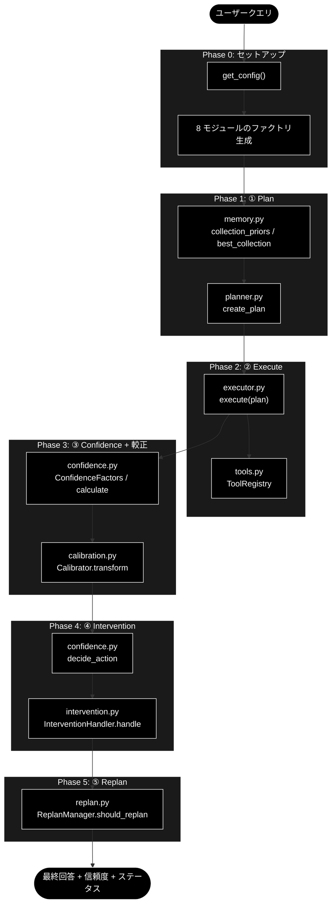
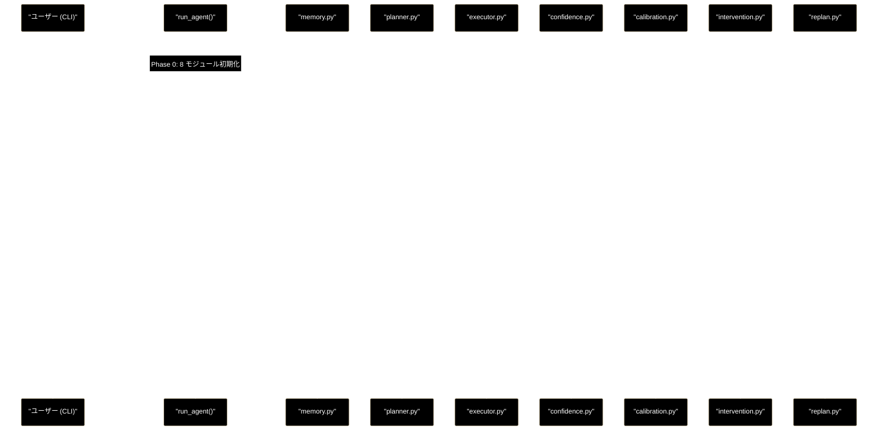

# agent_example_core8.py - コア 8 モジュール明示利用サンプル 設計書

**Version 1.0** | 最終更新: 2026-06-28

> **参考ドキュメント**
> - [`grace/doc/grace_core_flow.md`](./grace_core_flow.md) — 5 段階設計・8 コアモジュール・プロンプト/API 発行部・`agent_example.py` 解説
> - [`grace/doc/grace_core.md`](./grace_core.md) — コアモジュール群の横断アーキテクチャ（IPO リンク集）
> - `agent_example.py` — 最小実行サンプル（planner + executor の 2 API のみ。本サンプルの簡易版）

---

## 目次

- [概要](#概要)
- [1. アーキテクチャ構成図](#1-アーキテクチャ構成図)
  - [1.1 8 モジュール × 5 段階の対応図](#11-8-モジュール--5-段階の対応図)
  - [1.2 実行シーケンス](#12-実行シーケンス)
- [2. 関数一覧表](#2-関数一覧表)
- [3. 関数 IPO 詳細](#3-関数-ipo-詳細)
  - [3.1 run_agent()](#31-run_agent)
  - [3.2 main()](#32-main)
  - [3.3 _banner()](#33-_banner)
- [4. CLI 仕様](#4-cli-仕様)
- [5. 参照する設定・定数](#5-参照する設定定数)
- [6. 出力例](#6-出力例)
- [7. agent_example.py との違い](#7-agent_examplepy-との違い)
- [8. 依存関係](#8-依存関係)
- [9. 変更履歴](#9-変更履歴)

---

## 概要

`agent_example_core8.py` は、GRACE コアの **8 モジュール（`grace/*.py`）をそれぞれ最低 1 回ずつ明示的に呼び出す**教材用 CLI サンプルである。`agent_example.py` が `planner` と `executor` の 2 API だけで動き、残り 6 モジュール（confidence / calibration / memory / intervention / replan / tools）を executor の内部に隠していたのに対し、本サンプルは **5 段階設計（Plan → Execute → Confidence → Intervention → Replan）に沿って各モジュールの公開 API を画面に可視化する**。

> ⚠️ 本サンプルは**学習用の簡略オーケストレータ**である。Phase 3〜5 は executor が内部で行う処理を各モジュールの公開 API で「再現・可視化」したものを含む。本番コードは `executor.execute()` を使うこと（動的フォールバック・ReAct 等は executor 内にある）。

### 主な責務

- コア 8 モジュールのファクトリ初期化を 1 か所に集約して見せる
- ① Plan：実行メモリの事前分布を表示し、実行計画を生成する
- ② Execute：計画を executor で実行し、ステップ結果を表示する
- ③ Confidence + 較正：信頼度を再計算し、温度スケーリングで較正する
- ④ Intervention：信頼度から介入レベルを決定し HITL 処理を回す
- ⑤ Replan：最終ステップに対してリプラン要否を判定する
- CLI（`main()`）として実行できる（`agent_example.py` と同じ作法）

### 使用する 8 モジュールの対応

| # | モジュール | 呼び出す API（本サンプル） | フェーズ |
|---|-----------|---------------------------|---------|
| 3.1 | `planner.py` | `create_planner` / `Planner.create_plan` | ① Plan |
| 3.2 | `executor.py` | `create_executor` / `Executor.execute` | ② Execute |
| 3.3 | `confidence.py` | `create_confidence_calculator` / `ConfidenceFactors` / `calculate` / `decide_action` | ③④ |
| 3.4 | `calibration.py` | `Calibrator.load` / `transform` / `is_identity` | ③ Confidence |
| 3.5 | `memory.py` | `create_execution_memory` / `collection_priors` / `best_collection` | ① Plan |
| 3.6 | `intervention.py` | `create_intervention_handler` / `InterventionHandler.handle` | ④ Intervention |
| 3.7 | `replan.py` | `create_replan_manager` / `ReplanManager.should_replan` | ⑤ Replan |
| 3.8 | `tools.py` | `create_tool_registry`（`ToolRegistry` を executor が駆動） | ② Execute |

### 主要機能一覧

| 機能 | 説明 |
|------|------|
| `run_agent(query, verbose)` | 5 段階を順に実行し 8 モジュールを呼び分けるメイン処理 |
| `main()` | argparse による CLI エントリーポイント |
| `_banner(title)` | フェーズ見出しを罫線付きで出力するヘルパー |
| `DEFAULT_QUERY` | 既定の質問文（CLI 引数省略時に使用） |

---

## 1. アーキテクチャ構成図

### 1.1 8 モジュール × 5 段階の対応図

各モジュールがどのフェーズで呼ばれるかを示す。`memory` は ① の前段（事前分布）として、`calibration` は ③ の後段として機能する。



### 1.2 実行シーケンス



---

## 2. 関数一覧表

| 関数 | 概要 |
|------|------|
| `run_agent(query, verbose)` | 5 段階を実行し 8 モジュールを呼び分けるメイン処理。`ExecutionResult` または `None` を返す |
| `main()` | argparse で CLI 引数を解析し `run_agent` を実行。例外を整形表示 |
| `_banner(title)` | フェーズ見出しを罫線で囲んで標準出力に表示 |

---

## 3. 関数 IPO 詳細

### 3.1 run_agent()

**概要**: コア 8 モジュールを 5 段階設計に沿って順に呼び出し、最終回答・信頼度・ステータスを表示する。

```python
def run_agent(query: str = DEFAULT_QUERY, verbose: bool = False) -> Optional[ExecutionResult]
```

| パラメータ | 型 | デフォルト | 説明 |
|-----------|----|-----------|------|
| `query` | str | `DEFAULT_QUERY` | エージェントに尋ねる質問 |
| `verbose` | bool | `False` | ConfidenceFactors・スコア内訳などの詳細を表示 |

| 項目 | 内容 |
|------|------|
| **Input** | `query: str`, `verbose: bool` |
| **Process** | 0. `ANTHROPIC_API_KEY` 存在チェック（未設定なら警告して `None` 返却）<br>1. **Phase 0**: `get_config()` と 8 モジュールのファクトリ生成<br>2. **Phase 1（① Plan）**: `memory.collection_priors/best_collection` で事前分布表示 → `planner.create_plan(query)`<br>3. **Phase 2（② Execute）**: `executor.execute(plan)`（`tools.ToolRegistry` を駆動）<br>4. **Phase 3（③ Confidence+較正）**: `ConfidenceFactors` 構築 → `calculator.calculate()` → `Calibrator.transform()`<br>5. **Phase 4（④ Intervention）**: `calculator.decide_action()` → `handler.handle()`<br>6. **Phase 5（⑤ Replan）**: `replan_manager.should_replan(last_step, 0)`<br>7. 最終回答・信頼度・ステータスを表示 |
| **Output** | `Optional[ExecutionResult]`: 実行結果（鍵未設定時は `None`） |

**戻り値例**:
```python
ExecutionResult(
    final_answer="日本の再生可能エネルギー政策は……",
    overall_confidence=0.83,
    overall_status="success",
    step_results=[StepResult(...), StepResult(...)],
)
```

```python
# 使用例
from agent_example_core8 import run_agent

result = run_agent("日本の祝日について教えて", verbose=True)
print(result.overall_status)  # success
```

### 3.2 main()

**概要**: CLI 引数（`query` 位置引数・`-v/--verbose`）を解析し、`run_agent` を例外保護付きで実行する。

```python
def main() -> None
```

| 項目 | 内容 |
|------|------|
| **Input** | `sys.argv`（argparse 経由）: `query`（任意）, `-v/--verbose` |
| **Process** | 1. argparse で引数解析<br>2. `run_agent(args.query, verbose=args.verbose)` を try で実行<br>3. 例外時は `❌ 実行に失敗しました: <型>: <内容>` とヒントを stderr に表示し `sys.exit(1)` |
| **Output** | なし（標準出力へ実行ログ、失敗時は終了コード 1） |

```python
# 使用例（コマンドライン）
# python agent_example_core8.py
# python agent_example_core8.py -v "東京タワーの高さは？"
```

### 3.3 _banner()

**概要**: フェーズ見出しを `=` の罫線で囲んで表示する整形ヘルパー。

```python
def _banner(title: str) -> None
```

| 項目 | 内容 |
|------|------|
| **Input** | `title: str`: 見出し文字列 |
| **Process** | `=` × 60 の罫線で `title` を上下に挟んで `print` |
| **Output** | なし（標準出力） |

---

## 4. CLI 仕様

`agent_example.py` と同じ作法（`.env` 読込＋`ANTHROPIC_API_KEY` ガード＋`argparse` の `main()`＋`try/except`＋`if __name__ == "__main__"`）。

| 引数 | 型 | 既定 | 説明 |
|------|----|------|------|
| `query` | 位置引数（任意） | `DEFAULT_QUERY` | エージェントに尋ねる質問 |
| `-v`, `--verbose` | フラグ | `False` | ConfidenceFactors・スコア内訳などの詳細を表示 |

```bash
python agent_example_core8.py
python agent_example_core8.py "東京タワーの高さは？"
python agent_example_core8.py -v "日本の祝日について教えて"
```

**前提**: `.env` に `ANTHROPIC_API_KEY`（LLM）と `GOOGLE_API_KEY`（Embedding）、Qdrant 起動済み（既定 `http://localhost:6333`）かつ RAG コレクション登録済み。

---

## 5. 参照する設定・定数

| 参照 | 用途 |
|------|------|
| `config.confidence.calibration_path` | `Calibrator.load()` の読込先（既定 `config/calibration.json`） |
| `config.memory.path` | `create_execution_memory()` の JSONL（既定 `logs/grace_memory.jsonl`） |
| `DEFAULT_QUERY` | 既定の質問文 |

> 較正ファイルが無い場合、`Calibrator.load()` は恒等較正（T=1.0、`is_identity()==True`）を返すため、本サンプルは較正ファイル未整備でも動作する。

---

## 6. 出力例

```
============================================================
Phase 0: セットアップ（config + 8 モジュール初期化）
============================================================
  planner / executor / tools / confidence / calibration / memory / intervention / replan を初期化しました ✓

============================================================
Phase 1: ① Plan（planner + memory）
============================================================
❓ 質問: 日本の再生可能エネルギー政策の最新動向を教えて
  [memory] 事前分布: 実績なし（全コレクション検索）
  [memory] 推奨コレクション: （なし＝全コレクション検索）
  [plan] 2 ステップ (complexity=0.65)
    - step1: rag_search … 関連情報を検索
    - step2: reasoning … 回答を生成

============================================================
Phase 2: ② Execute（executor + tools）
============================================================
  step1: success (conf=0.82) ...
  step2: success (conf=0.80) 日本の再生可能エネルギー政策は...

============================================================
Phase 3: ③ Confidence + 較正（confidence + calibration）
============================================================
  [confidence] 再計算スコア(raw)=0.810 (level=high)
  [calibration] 較正後=0.830 (temperature=恒等(T=1.0))
  [executor] 公式の全体信頼度（executor が較正済み）=0.830

============================================================
Phase 4: ④ Intervention（intervention）
============================================================
  [confidence] decide_action → level=InterventionLevel.NOTIFY, suggested=...
  [intervention] action=InterventionAction.PROCEED, 続行=True

============================================================
Phase 5: ⑤ Replan（replan）
============================================================
  [replan] リプラン不要（全ステップ成功・十分な信頼度）

============================================================
結果
============================================================
最終回答: 日本の再生可能エネルギー政策は……
全体信頼度（較正済み）: 0.83
ステータス: success
```

> ⚠️ Qdrant 未起動や API キー未設定の場合は、生のスタックトレースではなく `❌ 実行に失敗しました: ...` とヒントが表示される（`main()` の例外ハンドリング）。

---

## 7. agent_example.py との違い

| 観点 | `agent_example.py` | `agent_example_core8.py` |
|------|--------------------|--------------------------|
| 呼ぶ公開 API | planner + executor の 2 つ | 8 モジュールのファクトリ＋各 API |
| 6 モジュールの扱い | executor 内部に隠蔽 | 各フェーズで明示的に呼び分け・表示 |
| 目的 | 最小で動かす | 5 段階と 8 モジュールの可視化（教材） |
| Confidence/Calibration | executor 内部のみ | `ConfidenceFactors`→`calculate`→`transform` を再現表示 |
| Intervention/Replan | executor 内部のみ | `handle` / `should_replan` を明示実行 |

> 本サンプルで未使用：`tools.py` の `CodeExecuteTool` / `WebSearchTool` / `AskUserTool` は既定フロー（`rag_search → reasoning`）では到達しないため呼ばれない（方式 A）。これらを明示デモするには別途「ツール網羅デモ」を追加する（方式 B）。

---

## 8. 依存関係

### 8.1 内部モジュール（grace）

| import 元 | 取得する要素 |
|-----------|-------------|
| `grace`（パッケージ） | `ConfidenceFactors`, `InterventionAction`, `InterventionResponse`, `create_confidence_calculator`, `create_executor`, `create_intervention_handler`, `create_planner`, `create_replan_manager`, `create_tool_registry`, `get_config` |
| `grace.calibration` | `Calibrator`（パッケージ未エクスポートのため submodule 直 import） |
| `grace.memory` | `create_execution_memory`（同上） |

### 8.2 標準ライブラリ・外部

| ライブラリ | 用途 |
|-----------|------|
| `argparse` / `os` / `sys` | CLI・環境変数・終了コード |
| `python-dotenv`（任意） | `.env` 読込（未導入でも `try/except` で続行） |

### 8.3 実行時サービス

| サービス | 用途 |
|---------|------|
| Anthropic Claude（`ANTHROPIC_API_KEY`） | 計画・推論・信頼度評価 |
| Gemini Embedding（`GOOGLE_API_KEY`） | RAG 検索クエリのベクトル化 |
| Qdrant | ベクトル類似検索 |

---

## 9. 変更履歴

| バージョン | 変更内容 |
|-----------|---------|
| 1.0 | 初版作成（`agent_example_core8.py` の設計書。8 モジュール×5 段階の対応図、実行シーケンス図、関数 IPO、CLI 仕様、出力例、`agent_example.py` との差分を整備） |
