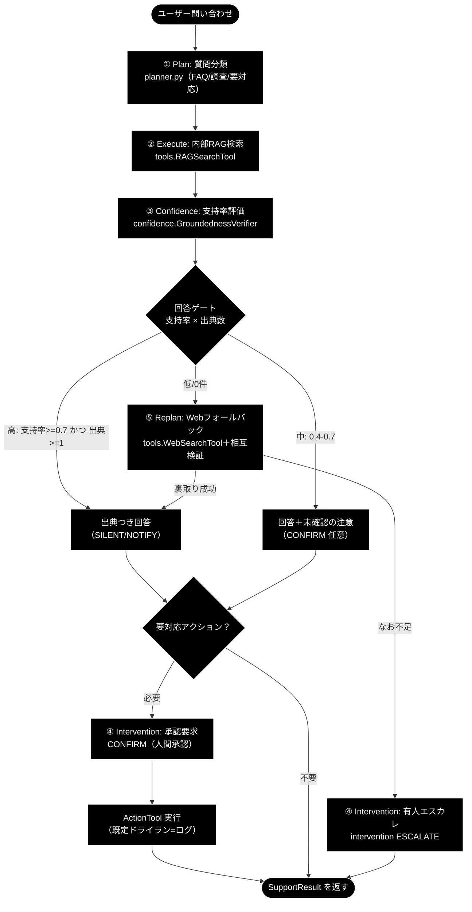
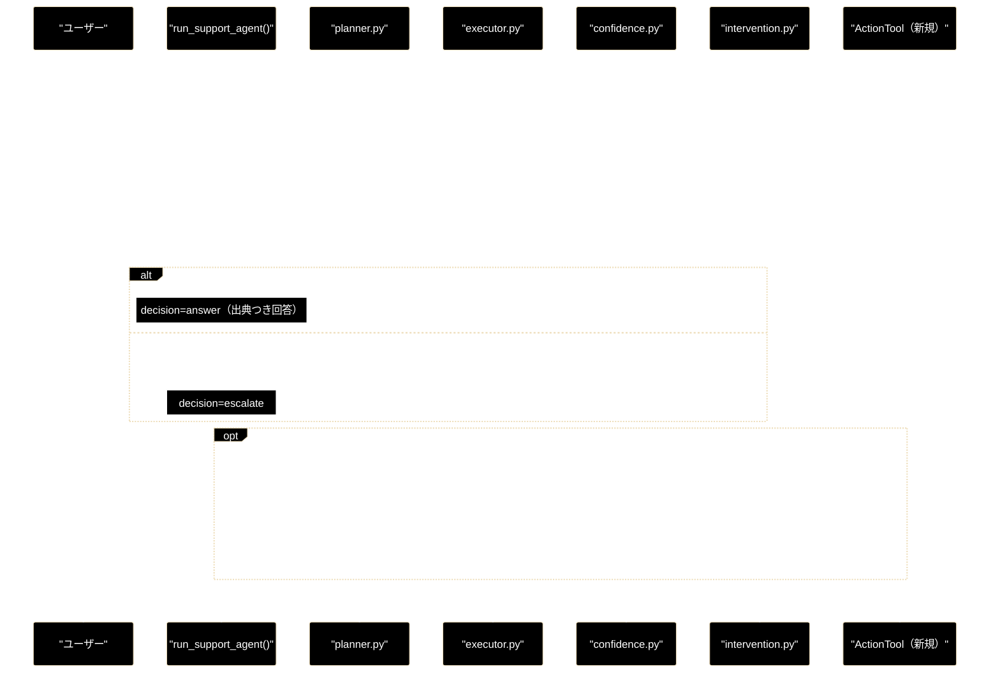

# agent_support_example.py - 日本語ナレッジ駆動サポート・コパイロット（GRACE-Support）設計書

**Version 1.2（v1〜v3 ＋ 業界特化 実装済み・IPO 詳細追加）** | 最終更新: 2026-07-08

> **参考ドキュメント**
> - [`grace/doc/agent_support_example_flow.md`](./agent_support_example_flow.md) — **1 コマンドの実行トレース**（`--vertical gov` の IN/OUT データフロー。本書 §1 のフロー図に対応）
> - [`docs/migration_and_update.md`](../../docs/migration_and_update.md) — 需要分析と GRACE-Support 採用方針（本設計の上位資料）
> - [`grace/doc/agent_support_verticals.md`](./agent_support_verticals.md) — 業界特化（自治体/SaaS/EC）設計
> - [`grace/doc/grace_core_flow.md`](./grace_core_flow.md) — 5 段階設計・8 コアモジュール・プロンプト/API 発行部
> - [`grace/doc/agent_example_core8.md`](./agent_example_core8.md) — コア 8 モジュール明示利用サンプルの設計書
> - [`grace/doc/grace_core.md`](./grace_core.md) — コアモジュール群の横断アーキテクチャ

> ✅ **実装状況**: `agent_support_example.py` は **v1〜v3 ＋ 業界特化（`--vertical {gov|saas|ec}`）を実装済み**（内部RAG＋出典／Webフォールバック＋相互検証／アクション＋HITL・既定ドライラン／二段判定・④' 情報なし回答検知）。本書は実装に合わせて更新済み。
>
> 💡 **実行環境**: 本リポジトリは `uv` 管理。以下のコマンド例はすべて `uv run python …` 形式で示す（従来の `python …` でも動くが、依存解決を含む `uv run` を推奨）。

---

## 目次

- [概要](#概要)
- [1. アーキテクチャ構成図（回答判定フロー）](#1-アーキテクチャ構成図回答判定フロー)
- [2. 回答ポリシー（groundedness ゲート）](#2-回答ポリシーgroundedness-ゲート)
- [3. データ契約（schemas 追加案）](#3-データ契約schemas-追加案)
- [4. 新規ツール ActionTool 仕様](#4-新規ツール-actiontool-仕様)
- [5. HITL ポリシー](#5-hitl-ポリシー)
- [6. 処理シーケンス](#6-処理シーケンス)
- [7. プログラム構成（実装済み関数 ＋ IPO 詳細）](#7-プログラム構成実装済み関数--ipo-詳細)
  - [7.6 クラス・関数 IPO 詳細](#76-クラス関数-ipo-詳細)
- [8. CLI 仕様](#8-cli-仕様)
- [9. 評価指標（KPI）](#9-評価指標kpi)
- [10. 実装ロードマップ](#10-実装ロードマップ)
- [11. 変更履歴](#11-変更履歴)

> 📎 **1 コマンドの実行トレースを見たい場合**は、本書の姉妹編
> [`agent_support_example_flow.md`](./agent_support_example_flow.md) を参照。
> `uv run python agent_support_example.py --vertical gov "住民票の写しの取り方は？"` が
> §1 のフロー図（① Plan →②Execute →③Confidence →④ゲート →⑤Web →⑥Action）を
> どう流れるかを、**モジュール・コード・データ（IN/OUT）**で追跡している。

---

## 概要

`agent_support_example.py`（仮称 **GRACE-Support**）は、既存の日本語 RAG 自律エージェント（GRACE）を土台に、**カスタマーサポート／社内ナレッジ・コパイロット**へ拡張する応用サンプルの設計書である。

一言でいうと——**「社内ナレッジで答え、足りなければ Web で裏取りし、出典を必ず示し、“わからない/行動が要る”ときは人間に渡す、日本語サポート AI」**。

> 📝 本書は当初**設計フェーズ**の仕様書として作成し、**v1〜v3 の実装完了に合わせて更新した**。既存モジュール（planner/executor/confidence/calibration/memory/intervention/replan/tools）を流用し、**新規追加は「回答ゲート」「Web フォールバックの明示化」「アクション＋HITL」の 3 点**に限定した。ActionTool は本サンプル内の**擬似実装（既定ドライラン）**として実現している（コア `grace/tools.py` への正式追加は将来）。

### 主な責務

- 質問を 3 分類（FAQ 即答／要調査／要対応アクション）して計画を立てる
- 内部 RAG で回答し、**出典（citation）を必ず提示**する
- 根拠不足なら**「わかりません」と誠実に答える**（ハルシネーション抑制）
- 内部知識が不足するときのみ **Web 調査へフォールバック**し、複数ソースを相互検証する
- 副作用のある操作（チケット起票・返信・エスカレーション）は **HITL 承認（CONFIRM）を必須**とする
- 解決履歴・エスカレーション履歴を memory に蓄積し、次回の計画へ反映する

### 使用するモジュール対応

| 分類 | モジュール | この用途での役割 |
|------|-----------|----------------|
| 既存 | `planner.py` | 質問 3 分類 → 計画生成 |
| 既存 | `executor.py` | ステップ実行・動的フォールバック統括 |
| 既存 | `tools.py` | `RAGSearchTool` / `WebSearchTool` / `ReasoningTool` / `AskUserTool` |
| 既存 | `confidence.py` | `GroundednessVerifier`（支持率）/ `SourceAgreementCalculator`（ソース一致） |
| 既存 | `calibration.py` | 信頼度の温度較正 |
| 既存 | `intervention.py` | 出典不足→ESCALATE、行動前→CONFIRM |
| 既存 | `replan.py` | 内部 0 件→Web、矛盾→再検索 |
| 既存 | `memory.py` | 解決/エスカレ履歴の学習 |
| **新規** | `ActionTool`（tools へ追加） | チケット起票・返信・エスカレの**擬似アクション**（既定ドライラン） |
| **新規** | `SupportResult`（schemas へ追加） | 回答・出典・判定・アクションの薄いラッパー |

---

## 1. アーキテクチャ構成図（回答判定フロー）

RAG 回答を **groundedness（支持率）でゲート**し、状態に応じて「回答／Web 調査／確認／エスカレ／アクション」へ分岐する。



---

## 2. 回答ポリシー（groundedness ゲート）

`GroundednessVerifier` の**支持率(support_rate)**と**出典数**で分岐する。しきい値は既存 `config.confidence.thresholds`（`silent=0.9 / notify=0.7 / confirm=0.4`）を流用する。

| 状態 | 条件（例） | decision | 振る舞い |
|------|-----------|----------|---------|
| **自信あり** | 支持率 ≥ 0.7 かつ 出典 ≥ 1 | `answer` | 出典つきで自動回答（SILENT/NOTIFY） |
| **要注意** | 0.4 ≤ 支持率 < 0.7 | `answer`（注意付） | 回答＋「未確認の注意書き」、必要なら CONFIRM |
| **わからない** | 支持率 < 0.4 または 出典 0 | `escalate` 前に Web | 「社内ナレッジには見当たりません」→ Web 調査 → なお不足なら ESCALATE |

> **設計意図**: 「根拠のない断定を構造的に出さない」ことを最優先にする。既存の `GroundednessVerifier`（回答を主張に分解し supported/contradicted/neutral を判定）をそのまま利用し、支持率が低い＝出典で裏付けられない回答は**自動的に“わからない”へ倒す**。

---

## 3. データ契約（実装済み・dataclass）

v1〜v3 ＋業界特化では `agent_support_example.py` 内の **dataclass** として実装している（コア `schemas.py` への追加は将来。出典は当面 `list[str]`）。

```python
@dataclass
class ActionRequest:
    """副作用のある操作の要求（v3・擬似）。"""
    action_type: Literal["create_ticket", "send_reply", "escalate_to_human"]
    args: dict = field(default_factory=dict)      # 起票内容・宛先など
    requires_confirmation: bool = True            # 副作用は原則 True

@dataclass
class SupportResult:
    """サポート回答の結果（回答ゲート／Web／アクション／業界特化を集約）。"""
    answer: Optional[str]                         # 最終回答（出典つき）
    citations: List[str] = field(default_factory=list)   # "[社内] …" / "[Web] …"
    groundedness: float = 0.0                     # 支持率 (0.0-1.0)
    groundedness_decided: int = 0                 # 判定できた主張数(supported+contradicted)。0=判定不能
    decision: Literal["answer", "escalate"] = "escalate"
    warning: bool = False                         # 中信頼（未確認）の注意書きを付けるか
    used_web: bool = False                        # Web（動的検索 or ⑤ フォールバック）を使ったか
    source_agreement: Optional[float] = None      # 内部×Web の意味的一致度（相互検証）
    contradiction: bool = False                   # 矛盾の可能性
    action: Optional[ActionRequest] = None        # 実施（予定）のアクション
    action_result: Optional[str] = None           # アクションの結果メッセージ
    vertical: Optional[str] = None                # 適用した業界プロファイル（gov/saas/ec）
    overall_confidence: float = 0.0               # executor 由来の較正済み全体信頼度
    intent: Optional[Literal["question","request","incident"]] = None  # 二段判定の意図分類結果
    forced_escalate: bool = False                 # エスカレ語による強制エスカレか（KPI 用）
    identity_checked: bool = False                # 本人確認ステップが起動したか（KPI 用）
    no_info_detected: bool = False                # ④' 情報なし回答検知で escalate に倒したか
    web_reused: bool = False                      # ⑤ で executor の Web 結果を再利用したか
```

> 📝 `decision` は `answer` / `escalate` の 2 値（設計当初の `ask`/`action` は `warning` フラグ・`action` フィールドに整理）。
> `groundedness_decided` / `intent` / `forced_escalate` / `identity_checked` / `no_info_detected` / `web_reused` /
> `vertical` は **業界特化・二段判定・④' ゲート・KPI 計測**のために追加したフィールド（`eval/vertical/` が参照）。
> `Citation` の構造化（kind/collection/score）はコア schemas 化時に導入予定。

---

## 4. 新規ツール ActionTool 仕様

副作用のある操作を担う。**既定はドライラン（実行せずログ出力）**で、学習・検証を安全に行う。

| 項目 | 内容 |
|------|------|
| クラス | `ActionTool(BaseTool)`（`grace/tools.py` へ追加、`ToolRegistry` に opt-in 登録） |
| `name` | `action`（`PlanStep.action` に `"action"` を追加、または `create_ticket` 等の細分） |
| メソッド | `execute(action_type: str, args: dict, dry_run: bool = True) -> ToolResult` |
| 対応アクション | `create_ticket` / `send_reply` / `escalate_to_human` |
| 安全策 | ① 実行前に **CONFIRM 必須**（intervention 経由）② `dry_run=True` ならログのみ ③ 対象・引数を `confidence_factors` に残す |
| 既定 | `config.tools.enabled` には**含めない**（`code_execute` と同様の opt-in） |

> セキュリティ方針は既存 `CodeExecuteTool`（静的チェック＋資源制限＋opt-in）に倣う。実 API 連携（Zendesk / メール等）は将来拡張とし、MVP では擬似実装。

---

## 5. HITL ポリシー

| トリガー | 介入レベル | 挙動 |
|---------|-----------|------|
| 副作用のあるアクション実行前 | **CONFIRM** | 人間承認を得るまで実行しない |
| 出典不足・低信頼（支持率 < 0.4） | **ESCALATE** | 有人対応へ引き継ぎ、AI は回答を断定しない |
| 中信頼（0.4–0.7） | NOTIFY | 回答するが「未確認」を明示 |
| 高信頼（≥ 0.7・出典あり） | SILENT/NOTIFY | 自動回答 |

- 非対話 CLI では、CONFIRM/ESCALATE のコールバックを**自動承認＋ログ**（`--dry-run` 既定）にして安全に検証する。
- UI 連携時は実際の確認ダイアログ（`intervention.ConfirmationFlow`）に差し替える。

---

## 6. 処理シーケンス



---

## 7. プログラム構成（実装済み関数 ＋ IPO 詳細）

`agent_example.py` / `agent_example_core8.py` と同じ CLI 作法（`.env`＋鍵ガード＋`argparse main()`＋`try/except`＋`if __name__`）。
7.1〜7.5 は**一覧表（クイックリファレンス）**、[7.6](#76-クラス関数-ipo-詳細) は
`a_class_method_md_format.md`（IPO 形式）に沿った**各要素の詳細仕様**（概要 / シグネチャ / パラメータ表 / IPO テーブル / 戻り値例 / 使用例）。

### 7.1 オーケストレーション・回答ゲート

| 関数 | 概要（実装） |
|------|-------------|
| `run_support_agent(query, verbose, use_web, do_action, dry_run, vertical, identity)` | ①計画 →②実行 →③根拠評価 →④回答ゲート＋強制エスカレ →⑤（不足時）Web＋相互検証 →④'情報なし検知 →⑥（必要なら）本人確認＋アクション →⑦整形 → `SupportResult` を返す。中核オーケストレータ |
| `_answer_gate(support_rate, verified, citation_count, notify_th, confirm_th)` | 支持率・出典数から `(decision, warning)` を決める純関数（answer/escalate。しきい値はプロファイルで上書き） |
| `_pick_groundedness(*results)` | 複数の `GroundednessResult` から `(支持率, 判定できた主張数)` を選ぶ純関数（同率なら decided 多を優先） |
| `_should_rescue_unaffirmed(...)` | 出典付き・非「情報なし」・矛盾なしの内部回答を、支持率が弱いだけで escalate に落とさず救済すべきか判定（無駄な⑤・誤エスカレを回避） |

### 7.2 二段判定（業界特化・誤検知抑止）

| 関数 | 概要（実装） |
|------|-------------|
| `create_intent_classifier(config)` | 軽量 LLM（`claude-haiku-4-5-20251001`）で意図を `question/request/incident` に分類する関数を返す（第 2 段） |
| `_match_keyword(query, keywords)` | キーワード候補の部分一致（第 1 段）。最初に一致した語を返す純関数 |
| `_should_force_escalate(query, profile, classify)` | エスカレ語×意図分類の二段判定で強制エスカレ要否を決める（`question` は誤検知抑止） |
| `_decide_action(query, decision, profile, classify)` | `action_map`（またはデモ既定）×意図分類でアクションを選ぶ（`question` は起票せず回答のみ） |

### 7.3 ④' 情報なし回答検知

| 関数 | 概要（実装） |
|------|-------------|
| `create_no_info_judge(config)` | 軽量 LLM で「実質回答(answered)／情報なし(no_info)」を判定する関数を返す（第 2 段） |
| `_detect_no_info_answer(query, answer, judge, force_judge)` | 定型句（`NO_INFO_MARKERS`）候補検出＋LLM 判定の二段判定。Web のみ出典は `force_judge=True` で必須判定 |

### 7.4 アクション・出典・表示

| 関数 | 概要（実装） |
|------|-------------|
| `_perform_action(action, handler, backend, identity_verifier, identity)` | **本人確認 → intervention CONFIRM → バックエンド実行** の順で擬似実行（既定ドライラン。`support_actions.py` に委譲） |
| `_collect_citations(step_results)` | 各ステップの sources を重複排除し `[社内]`/`[Web]` ラベルを付与 |
| `_citation_text` / `_merge_citations` / `_web_citations` / `_web_source_texts` | 出典ラベルの除去・内部×Web 出典の結合（URL 包含で重複排除）・Web 結果からの出典/検証本文抽出 |
| `_render(support_result)` | 出典つき回答・判定・注意書き・アクション結果・根拠メタ（vertical/intent 等）を整形表示 |
| `main()` | argparse（`query`・`-v`・`--vertical`・`--no-web`・`--no-action`・`--dry-run`・`--identity`）→ `run_support_agent` を例外保護実行 |

### 7.5 定数・プロファイル

| 定義 | 概要 |
|------|------|
| `PROFILES: Dict[str, VerticalProfile]` | 組み込み業界プロファイル（`gov`/`saas`/`ec`）。検索スコープ・エスカレ語・アクション語彙・本人確認・しきい値・方針を保持 |
| `VerticalProfile`（dataclass） | 業界プロファイルの共通枠（設計: `agent_support_verticals.md` §1/§6） |
| `NO_INFO_MARKERS` | 「見当たりません」等の情報なし候補検出パターン（④' 第 1 段） |
| `INTENT_MODEL = "claude-haiku-4-5-20251001"` | 二段判定・④' 判定に使う軽量モデル |

---

### 7.6 クラス・関数 IPO 詳細

`a_class_method_md_format.md` §6 に準拠し、主要なクラス・関数を **概要 / シグネチャ / パラメータ表 / IPO テーブル / 戻り値例 / 使用例** で示す。実コード（`agent_support_example.py`）と突合済み。

#### 7.6.1 データクラス

##### `ActionRequest`

副作用のある操作（起票／返信／エスカレ）の要求を表す薄いレコード（v3・擬似）。

**概要**: 実行するアクション種別と引数、承認要否を保持する。

```python
@dataclass
class ActionRequest:
    action_type: Literal["create_ticket", "send_reply", "escalate_to_human"]
    args: dict = field(default_factory=dict)
    requires_confirmation: bool = True
```

| パラメータ | 型 | デフォルト | 説明 |
|------------|------|-----------|------|
| `action_type` | `ActionType` | - | 起票／返信／有人エスカレの種別 |
| `args` | `dict` | `{}` | 起票内容・宛先・照合キーなど |
| `requires_confirmation` | `bool` | `True` | 副作用操作は原則 CONFIRM 必須 |

| 項目 | 内容 |
|------|------|
| **Input** | `action_type: ActionType`, `args: dict = {}`, `requires_confirmation: bool = True` |
| **Process** | `_decide_action()` が意図に応じて生成し、`_perform_action()` が消費する |
| **Output** | `ActionRequest` インスタンス |

**戻り値例**:
```python
ActionRequest(action_type="send_reply", args={"query": "保育園の申請様式がほしい", "matched": "申請"}, requires_confirmation=True)
```

```python
# 使用例
action = ActionRequest("create_ticket", {"subject": "解約希望", "query": "解約したい"})
```

##### `VerticalProfile`

業界プロファイルの共通枠（`gov`/`saas`/`ec` を差し替える単位）。設計: `agent_support_verticals.md` §1/§6。

**概要**: 検索スコープ・強制エスカレ語・アクション語彙・本人確認要否・しきい値・方針を 1 つにまとめる。

```python
@dataclass
class VerticalProfile:
    name: str
    collections: List[str] = field(default_factory=list)
    escalate_keywords: List[str] = field(default_factory=list)
    action_map: Dict[str, ActionType] = field(default_factory=dict)
    require_identity: bool = False
    notify_th: Optional[float] = None
    confirm_th: Optional[float] = None
    prompt_addendum: str = ""
```

| パラメータ | 型 | デフォルト | 説明 |
|------------|------|-----------|------|
| `name` | `str` | - | 表示名（例: `"自治体"`） |
| `collections` | `List[str]` | `[]` | 検索スコープ（実 Qdrant コレクション名。`allowed_collections` へ配線） |
| `escalate_keywords` | `List[str]` | `[]` | 強制エスカレ語（二段判定の第 1 段候補） |
| `action_map` | `Dict[str, ActionType]` | `{}` | 意図キーワード → `action_type` |
| `require_identity` | `bool` | `False` | アクション前に本人確認を必須化するか |
| `notify_th` / `confirm_th` | `Optional[float]` | `None` | しきい値上書き（None なら config 既定） |
| `prompt_addendum` | `str` | `""` | reasoning へ注入する業務方針 |

| 項目 | 内容 |
|------|------|
| **Input** | 上記フィールド |
| **Process** | `PROFILES[vertical]` として定義。`run_support_agent()` が `notify_th`/`confirm_th` の解決、`config.qdrant.allowed_collections` / `config.llm.prompt_addendum` への配線に使う |
| **Output** | `VerticalProfile` インスタンス |

**戻り値例**:
```python
VerticalProfile(name="自治体",
                collections=["gov_faq_anthropic", "gov_laws_anthropic", "wikipedia_ja"],
                escalate_keywords=["法的", "訴訟", "減免", "個別", "例外", "不服"],
                action_map={"申請": "send_reply", "手続": "send_reply", "様式": "send_reply"},
                require_identity=False, notify_th=0.8, confirm_th=0.5,
                prompt_addendum="条例・公式案内に基づき、断定を避け、該当ページ・担当課を明示。個人情報は尋ねない。")
```

```python
# 使用例
profile = PROFILES.get("gov")     # --vertical gov で選択
```

##### `SupportResult`

サポート回答の結果（回答ゲート／Web／アクション／業界特化を集約）。フィールド定義は [§3](#3-データ契約実装済みdataclass) を参照。

**概要**: 各ステップが同一インスタンスを少しずつ埋め、最後に `_render()` が整形表示し、`run_support_agent()` が返す。

```python
@dataclass
class SupportResult:
    answer: Optional[str]
    citations: List[str] = field(default_factory=list)
    groundedness: float = 0.0
    groundedness_decided: int = 0
    decision: Literal["answer", "escalate"] = "escalate"
    warning: bool = False
    used_web: bool = False
    # …（全フィールドは §3 参照）
```

| 項目 | 内容 |
|------|------|
| **Input** | 主要: `answer`, `citations`, `groundedness`, `decision`, `warning`（他は §3） |
| **Process** | S3（answer/citations）→ S4（groundedness）→ S5（decision/warning）→ S6（used_web ほか）→ S7（no_info_detected）→ S8（action/identity_checked）で充填 |
| **Output** | `SupportResult` インスタンス |

**戻り値例**: [`agent_support_example_flow.md` §3](./agent_support_example_flow.md)（フィールドの積み上がり表）を参照。

#### 7.6.2 オーケストレーション

##### `run_support_agent`

**概要**: ①計画 →②実行 →③根拠評価 →④回答ゲート＋強制エスカレ →⑤（不足時）Web＋相互検証 →④'情報なし検知 →⑥（必要なら）本人確認＋アクション →⑦整形 まで、GRACE-Support の全処理を統括する中核オーケストレータ。

```python
def run_support_agent(
    query: str = DEFAULT_QUERY,
    verbose: bool = False,
    use_web: bool = True,
    do_action: bool = True,
    dry_run: bool = True,
    vertical: Optional[str] = None,
    identity: Optional[Dict[str, str]] = None,
) -> Optional[SupportResult]
```

| パラメータ | 型 | デフォルト | 説明 |
|------------|------|-----------|------|
| `query` | `str` | `"パスワードを忘れました"` | 問い合わせ内容 |
| `verbose` | `bool` | `False` | 支持率の内訳など詳細を表示 |
| `use_web` | `bool` | `True` | ⑤ Web フォールバックを許可 |
| `do_action` | `bool` | `True` | ⑥ アクションを許可 |
| `dry_run` | `bool` | `True` | アクションを実行せずログのみ |
| `vertical` | `Optional[str]` | `None` | 業界プロファイル（`gov`/`saas`/`ec`） |
| `identity` | `Optional[Dict[str, str]]` | `None` | 本人確認の識別子 |

| 項目 | 内容 |
|------|------|
| **Input** | `query`, `verbose`, `use_web`, `do_action`, `dry_run`, `vertical`, `identity` |
| **Process** | 1. `ANTHROPIC_API_KEY` ガード<br>2. config・planner・executor・verifier・intervention・分類器/判定器を生成<br>3. プロファイル解決 → `allowed_collections`/`prompt_addendum` を config へ配線<br>4. ① `planner.create_plan` →② `executor.execute` →③ `verifier.verify`<br>5. ④ `_answer_gate` ＋ `_should_force_escalate` ＋ `_should_rescue_unaffirmed`<br>6. ⑤ escalate かつ 非強制なら Web フォールバック（`_pick_groundedness`/`_merge_citations`）<br>7. ④' `_detect_no_info_answer`<br>8. ⑥ `_decide_action` → `_perform_action`<br>9. ⑦ `_render` |
| **Output** | `Optional[SupportResult]`（鍵未設定時は `None`） |

**戻り値例**:
```python
SupportResult(answer="住民票の写しは…", citations=["[社内] gov_faq_anthropic/住民票.md"],
              groundedness=0.86, decision="answer", warning=False, vertical="gov")
```

```python
# 使用例
result = run_support_agent("住民票の写しの取り方は？", vertical="gov")
print(result.decision)   # -> "answer"
```

> 📎 1 実行の各ステップの IN/Process/OUT は [`agent_support_example_flow.md`](./agent_support_example_flow.md) を参照。

#### 7.6.3 回答ゲート・純関数

##### `_answer_gate`

**概要**: 支持率・出典数・しきい値から `(decision, warning)` を決める副作用のない純関数。

```python
def _answer_gate(
    support_rate: float, verified: bool, citation_count: int,
    notify_th: float, confirm_th: float,
) -> tuple[Decision, bool]
```

| パラメータ | 型 | デフォルト | 説明 |
|------------|------|-----------|------|
| `support_rate` | `float` | - | groundedness 支持率（0.0–1.0） |
| `verified` | `bool` | - | 検証を実施できたか |
| `citation_count` | `int` | - | 出典数 |
| `notify_th` / `confirm_th` | `float` | - | 高信頼／中信頼のしきい値 |

| 項目 | 内容 |
|------|------|
| **Input** | `support_rate`, `verified`, `citation_count`, `notify_th`, `confirm_th` |
| **Process** | 1. 未検証 or 出典0 → `("escalate", False)`<br>2. 支持率≥notify → `("answer", False)`<br>3. 支持率≥confirm → `("answer", True)`（未確認注記）<br>4. それ未満 → `("escalate", False)` |
| **Output** | `tuple[Decision, bool]`（decision, warning） |

**戻り値例**:
```python
("answer", False)   # 支持率0.86 / notify0.8
```

```python
# 使用例
decision, warning = _answer_gate(0.86, True, 3, notify_th=0.8, confirm_th=0.5)
```

##### `_pick_groundedness`

**概要**: 複数の `GroundednessResult` から `(支持率, 判定できた主張数)` を選ぶ純関数（内部×Web の良い方を採用）。

```python
def _pick_groundedness(*results) -> tuple[float, int]
```

| パラメータ | 型 | デフォルト | 説明 |
|------------|------|-----------|------|
| `*results` | `GroundednessResult` | - | 内部・Web の検証結果（1 個以上） |

| 項目 | 内容 |
|------|------|
| **Input** | `*results: GroundednessResult` |
| **Process** | `(support_rate, supported+contradicted)` の最大を選ぶ（同率なら decided 多） |
| **Output** | `tuple[float, int]`（支持率, 判定できた主張数） |

**戻り値例**:
```python
(0.86, 3)
```

```python
# 使用例
g_rate, g_decided = _pick_groundedness(gres, gres_web)
```

##### `_should_rescue_unaffirmed`

**概要**: 出典付き・非「情報なし」・矛盾なしの内部回答を、支持率が弱いだけで escalate に落とさず救済すべきかを判定する（無駄な⑤・誤エスカレを回避）。

```python
def _should_rescue_unaffirmed(
    decision: Decision, forced_escalate: bool, has_contradiction: bool,
    citation_count: int, answer: str, query: str,
    no_info_judge: Optional[Callable[[str, str], Optional[bool]]] = None,
) -> bool
```

| パラメータ | 型 | デフォルト | 説明 |
|------------|------|-----------|------|
| `decision` | `Decision` | - | `_answer_gate` の判定 |
| `forced_escalate` | `bool` | - | 強制エスカレか（True なら救済しない） |
| `has_contradiction` | `bool` | - | 矛盾が検出されたか |
| `citation_count` | `int` | - | 出典数 |
| `answer` | `str` | - | 内部回答本文 |
| `query` | `str` | - | 問い合わせ |
| `no_info_judge` | `Optional[Callable]` | `None` | ④' の LLM 判定器 |

| 項目 | 内容 |
|------|------|
| **Input** | 上記 |
| **Process** | escalate かつ 非強制 かつ 矛盾なし かつ 出典≥1 かつ 回答あり かつ `_detect_no_info_answer` が実質回答 → `True` |
| **Output** | `bool`: 救済（answer 継続）してよいか |

**戻り値例**:
```python
True   # 出典付き・矛盾なし・実質回答 → answer（未確認注記）で維持
```

```python
# 使用例
if _should_rescue_unaffirmed(decision, forced_escalate, gres.has_contradiction,
                             len(internal_citations), internal_answer, query, no_info_judge):
    decision, warning = "answer", True
```

#### 7.6.4 二段判定（業界特化・誤検知抑止）

##### `create_intent_classifier`

**概要**: 軽量 LLM（`INTENT_MODEL`）で問い合わせ意図を `question`/`request`/`incident` に分類する関数を返すファクトリ（二段判定の第 2 段）。

```python
def create_intent_classifier(config) -> Callable[[str], Optional[Intent]]
```

| パラメータ | 型 | デフォルト | 説明 |
|------------|------|-----------|------|
| `config` | `Config` | - | LLM クライアント生成用の設定 |

| 項目 | 内容 |
|------|------|
| **Input** | `config` |
| **Process** | `create_chat_client(config)` を束縛したクロージャ `classify(query)` を返す。呼び出し時に軽量モデルで 1 語分類。失敗時は `None` |
| **Output** | `Callable[[str], Optional[Intent]]` |

**戻り値例**:
```python
classify = create_intent_classifier(config)
classify("返品したい")   # -> "request"
```

```python
# 使用例
classify = create_intent_classifier(config)
intent = classify("課金プランの違いを教えて")   # -> "question"
```

##### `_match_keyword`

**概要**: キーワード候補の部分一致（二段判定の第 1 段）。最初に一致した語を返す純関数。

```python
def _match_keyword(query: str, keywords) -> Optional[str]
```

| パラメータ | 型 | デフォルト | 説明 |
|------------|------|-----------|------|
| `query` | `str` | - | 判定対象文字列 |
| `keywords` | `Iterable[str]` | - | 候補語（`escalate_keywords`/`action_map`/`NO_INFO_MARKERS` 等） |

| 項目 | 内容 |
|------|------|
| **Input** | `query`, `keywords` |
| **Process** | `keywords` を順に走査し、`query` に含まれる最初の語を返す。無ければ `None` |
| **Output** | `Optional[str]`: 一致した語 |

**戻り値例**:
```python
"減免"   # _match_keyword("固定資産税の減免を…", ["法的","減免",...])
```

```python
# 使用例
matched = _match_keyword(query, profile.escalate_keywords)
```

##### `_should_force_escalate`

**概要**: エスカレ語（第 1 段）×意図分類（第 2 段）で強制エスカレ要否を決める。`question` は誤検知とみなし通常フロー継続。

```python
def _should_force_escalate(
    query: str, profile: Optional[VerticalProfile],
    classify: Optional[Callable[[str], Optional[Intent]]] = None,
) -> tuple[bool, Optional[str], Optional[Intent]]
```

| パラメータ | 型 | デフォルト | 説明 |
|------------|------|-----------|------|
| `query` | `str` | - | 問い合わせ |
| `profile` | `Optional[VerticalProfile]` | - | 業界プロファイル（None なら常に False） |
| `classify` | `Optional[Callable]` | `None` | 意図分類器（候補一致時のみ呼ばれる） |

| 項目 | 内容 |
|------|------|
| **Input** | `query`, `profile`, `classify` |
| **Process** | 1. `profile` なし → `(False, None, None)`<br>2. `_match_keyword` 不一致 → `(False, None, None)`<br>3. 一致 → `classify`。`question` なら `(False, matched, "question")`、それ以外/失敗は `(True, matched, intent)` |
| **Output** | `tuple[bool, Optional[str], Optional[Intent]]`（forced, matched_keyword, intent） |

**戻り値例**:
```python
(True, "減免", "request")   # 「減免を個別に判断してほしい」
(False, "減免", "question") # 「減免制度の概要を教えて」（誤検知抑止）
```

```python
# 使用例
forced, kw, intent = _should_force_escalate(query, profile, classify)
```

##### `_decide_action`

**概要**: `action_map`（またはデモ既定マッピング）×意図分類で必要なアクションを決める。`question` は起票せず回答のみ。escalate 時は常に有人エスカレ。

```python
def _decide_action(
    query: str, decision: Decision,
    profile: Optional[VerticalProfile] = None,
    classify: Optional[Callable[[str], Optional[Intent]]] = None,
) -> Optional[ActionRequest]
```

| パラメータ | 型 | デフォルト | 説明 |
|------------|------|-----------|------|
| `query` | `str` | - | 問い合わせ |
| `decision` | `Decision` | - | 回答ゲートの判定 |
| `profile` | `Optional[VerticalProfile]` | `None` | 業界プロファイル |
| `classify` | `Optional[Callable]` | `None` | 意図分類器 |

| 項目 | 内容 |
|------|------|
| **Input** | `query`, `decision`, `profile`, `classify` |
| **Process** | 1. `escalate` → `escalate_to_human`<br>2. 第 1 段 `_match_keyword`（profile=`action_map` / 既定=解約・パスワード系）<br>3. 候補あり かつ 意図=`question` → `None`（回答のみ）、それ以外 → `ActionRequest` |
| **Output** | `Optional[ActionRequest]` |

**戻り値例**:
```python
ActionRequest("send_reply", {"query": "保育園の申請様式がほしい", "matched": "申請"})
None   # 「解約方法を教えて」（FAQ質問 → 起票しない）
```

```python
# 使用例
action = _decide_action(query, support.decision, profile, classify)
```

#### 7.6.5 ④' 情報なし回答検知

##### `create_no_info_judge`

**概要**: 軽量 LLM で「実質回答(answered)＝False／情報なし(no_info)＝True」を判定する関数を返すファクトリ（④' 第 2 段）。判定不能は `None`。

```python
def create_no_info_judge(config) -> Callable[[str, str], Optional[bool]]
```

| パラメータ | 型 | デフォルト | 説明 |
|------------|------|-----------|------|
| `config` | `Config` | - | LLM クライアント生成用の設定 |

| 項目 | 内容 |
|------|------|
| **Input** | `config` |
| **Process** | `judge(query, answer)` クロージャを返す。few-shot 付きプロンプトで answered/no_info を 1 語判定。失敗時 `None` |
| **Output** | `Callable[[str, str], Optional[bool]]` |

**戻り値例**:
```python
judge = create_no_info_judge(config)
judge("入荷予定日は？", "商品ページでご確認ください")   # -> True（no_info）
```

```python
# 使用例
no_info_judge = create_no_info_judge(config)
```

##### `_detect_no_info_answer`

**概要**: 定型句候補検出（第 1 段）＋LLM 判定（第 2 段）の二段判定。Web のみ出典は `force_judge=True` で候補句がなくても必須判定。

```python
def _detect_no_info_answer(
    query: str, answer: str,
    judge: Optional[Callable[[str, str], Optional[bool]]] = None,
    force_judge: bool = False,
) -> tuple[bool, Optional[str]]
```

| パラメータ | 型 | デフォルト | 説明 |
|------------|------|-----------|------|
| `query` | `str` | - | 問い合わせ |
| `answer` | `str` | - | 回答本文 |
| `judge` | `Optional[Callable]` | `None` | ④' の LLM 判定器 |
| `force_judge` | `bool` | `False` | 候補句が無くても LLM 判定を強制（Web のみ出典） |

| 項目 | 内容 |
|------|------|
| **Input** | `query`, `answer`, `judge`, `force_judge` |
| **Process** | 1. `NO_INFO_MARKERS` 候補検出<br>2. 候補なし かつ `force_judge` でない → `(False, None)`<br>3. `judge` なし → `(False, marker)`<br>4. `judge` が answered → `(False, marker)`、no_info/失敗 → `(True, marker)` |
| **Output** | `tuple[bool, Optional[str]]`（no_info, matched_marker） |

**戻り値例**:
```python
(False, None)         # 実質回答（gov 住民票）
(True, "見当たりません") # 情報なし → escalate へ
```

```python
# 使用例
no_info, marker = _detect_no_info_answer(query, support.answer, no_info_judge, force_judge=web_only)
```

#### 7.6.6 アクション・出典・表示

##### `_perform_action`

**概要**: **本人確認 → HITL（CONFIRM 承認）→ バックエンド実行** の順でアクションを行い、結果メッセージを返す（既定ドライラン。`support_actions.py` に委譲）。

```python
def _perform_action(
    action: ActionRequest, handler, backend,
    identity_verifier=None, identity: Optional[Dict[str, str]] = None,
) -> str
```

| パラメータ | 型 | デフォルト | 説明 |
|------------|------|-----------|------|
| `action` | `ActionRequest` | - | 実行するアクション |
| `handler` | `InterventionHandler` | - | CONFIRM を扱う介入ハンドラ |
| `backend` | `ActionBackend` | - | dry-run / webhook / pseudo の実行先 |
| `identity_verifier` | 任意 | `None` | 本人確認器（EC 等で指定） |
| `identity` | `Optional[Dict[str, str]]` | `None` | 提示された識別子 |

| 項目 | 内容 |
|------|------|
| **Input** | `action`, `handler`, `backend`, `identity_verifier`, `identity` |
| **Process** | 1. 本人確認（未確認なら実行せず有人へ）<br>2. `handler.handle(CONFIRM)`（否認ならキャンセル）<br>3. `backend.execute(action_type, args)` |
| **Output** | `str`: 結果メッセージ |

**戻り値例**:
```python
"[dry-run] create_ticket を受け付けました（実行はしていません）"
```

```python
# 使用例
msg = _perform_action(action, handler, backend, identity_verifier=verifier, identity={"order_id": "1001"})
```

##### `_collect_citations`

**概要**: 各ステップの sources を重複排除し、URL は `[Web]`・それ以外は `[社内]` とラベル付けする。

```python
def _collect_citations(step_results) -> List[str]
```

| パラメータ | 型 | デフォルト | 説明 |
|------------|------|-----------|------|
| `step_results` | `Iterable[StepResult]` | - | executor の各ステップ結果 |

| 項目 | 内容 |
|------|------|
| **Input** | `step_results` |
| **Process** | 各 `sr.sources` を走査し、`http(s)://` 始まりは `[Web]`・他は `[社内]` を前置。重複除去 |
| **Output** | `List[str]`: ラベル付き出典 |

**戻り値例**:
```python
["[社内] gov_faq_anthropic/住民票.md", "[Web] https://example.go.jp/…"]
```

```python
# 使用例
internal_citations = _collect_citations(result.step_results)
```

##### `_citation_text` / `_merge_citations` / `_web_citations` / `_web_source_texts`

**概要**: 出典表示のユーティリティ群。

```python
def _citation_text(citation: str) -> str                       # ラベルを外して中身を返す
def _merge_citations(internal: List[str], web: List[str]) -> List[str]   # URL 包含で重複排除して結合
def _web_citations(web_output: list) -> List[str]              # Web 結果 → "[Web] タイトル（URL）"
def _web_source_texts(web_output: list) -> List[str]           # Web 結果 → 検証用本文（answer/snippet）
```

| 関数 | Input | Process | Output |
|------|-------|---------|--------|
| `_citation_text` | `citation: str` | `"] "` で分割し後半を返す | `str`: ラベルなし本文 |
| `_merge_citations` | `internal`, `web` | 内部本文を含む Web 出典を除外して結合 | `List[str]` |
| `_web_citations` | `web_output: list` | `payload.title`/`source` から表示文字列を生成 | `List[str]` |
| `_web_source_texts` | `web_output: list` | `payload.answer` を抽出（空は除外） | `List[str]` |

**戻り値例**:
```python
_citation_text("[社内] gov_faq_anthropic/住民票.md")   # -> "gov_faq_anthropic/住民票.md"
_web_citations([{"payload": {"title": "住民票", "source": "https://…"}}])  # -> ["[Web] 住民票（https://…）"]
```

```python
# 使用例
citations = _merge_citations(internal_citations, _web_citations(web_output))
```

##### `_render`

**概要**: 回答ゲートの判定に応じて、回答本文・注意書き・出典一覧・アクション結果・根拠メタ行を標準出力へ整形表示する（副作用のみ）。

```python
def _render(result: SupportResult) -> None
```

| パラメータ | 型 | デフォルト | 説明 |
|------------|------|-----------|------|
| `result` | `SupportResult` | - | 表示する結果 |

| 項目 | 内容 |
|------|------|
| **Input** | `result: SupportResult` |
| **Process** | `answer` なら本文＋（warning/矛盾の注意）＋出典一覧、`escalate` なら定型文。アクション結果と根拠メタ（vertical/intent/forced/no_info/reused）を出力 |
| **Output** | `None`（標準出力へ表示） |

**戻り値例**:
```text
[根拠] 支持率(groundedness)=0.86 / 全体信頼度=0.78 / decision=answer / web=不使用 / vertical=gov
```

```python
# 使用例
_render(support)
```

##### `main`

**概要**: argparse で CLI 引数を解釈し、`--identity KEY=VALUE` を dict 化して `run_support_agent` を例外保護で実行するエントリポイント。

```python
def main() -> None
```

| 項目 | 内容 |
|------|------|
| **Input** | コマンドライン引数（`query`・`-v`・`--vertical`・`--no-web`・`--no-action`・`--dry-run`・`--identity`） |
| **Process** | 1. `argparse.parse_args()`<br>2. `--identity` を `dict` へ変換<br>3. `run_support_agent(...)` を `try/except` で実行（失敗時はヒント表示＋`exit(1)`） |
| **Output** | `None`（内部で `run_support_agent` を実行） |

```python
# 使用例（CLI）
# uv run python agent_support_example.py --vertical gov "住民票の写しの取り方は？"
```

---

## 8. CLI 仕様

| 引数 | 既定 | 説明 |
|------|------|------|
| `query`（位置・任意） | `"パスワードを忘れました"` | 問い合わせ内容 |
| `-v`, `--verbose` | off | 支持率の内訳（supported/total/矛盾）など詳細を表示 |
| `--vertical {gov\|saas\|ec}` | なし（共通挙動） | 業界プロファイルを適用（検索スコープ・エスカレ語・しきい値・アクション対応・本人確認・方針を一括切替） |
| `--no-web` | off（Web 有効） | Web フォールバックを無効化（内部RAGのみ） |
| `--no-action` | off（アクション有効） | アクション（v3）を無効化 |
| `--dry-run / --no-dry-run` | `dry-run`（安全） | アクションを実行せずログのみ（既定 ON。`--no-dry-run` で実連携/擬似実行） |
| `--identity KEY=VALUE`（複数可） | なし | 本人確認の識別子（例: `--identity order_id=1001`）。`--no-dry-run` 時に台帳と照合（EC 等） |

### 8.1 基本（共通・プロファイル未適用）

```bash
# FAQ 即答 → 出典つき回答
uv run python agent_support_example.py "パスワードを忘れました"

# アクション（CONFIRM ＋ 既定ドライラン）
uv run python agent_support_example.py "解約したい"

# 擬似実行（--no-dry-run で実連携/擬似実行に切替）
uv run python agent_support_example.py --no-dry-run "解約したい"

# 内部不足 → Web フォールバック ＋ 相互検証（-v で支持率の内訳も表示）
uv run python agent_support_example.py -v "最新の料金改定は？"
```

### 8.2 業界特化（`--vertical`）

`--vertical` を付けると、その業界の**検索スコープ・エスカレ語・しきい値・アクション語彙・本人確認・方針**が一括で適用される。

```bash
# 自治体: 正確性最優先（notify=0.8/confirm=0.5）・断定回避・迷ったら窓口へ
uv run python agent_support_example.py --vertical gov "住民票の写しの取り方は？"

# SaaS: 速く・正確・再現手順（障害/課金は escalate）
uv run python agent_support_example.py --vertical saas -v "Webhook の設定方法は？"
uv run python agent_support_example.py --vertical saas "サービスが落ちています"        # 障害 → escalate

# EC: 副作用操作は 本人確認 → CONFIRM → ドライラン
uv run python agent_support_example.py --vertical ec "返品したい"
uv run python agent_support_example.py --vertical ec --no-dry-run \
    --identity order_id=1001 --identity email=a@example.com "返品したい"
```

> 📎 上記 `--vertical gov "住民票の写しの取り方は？"` の 1 実行が、§1 のフロー図をどう流れるか
> （各ステップの IN/OUT データ）は [`agent_support_example_flow.md`](./agent_support_example_flow.md) を参照。
> 業界特化の全体設計・KPI・テストデータは [`agent_support_verticals.md`](./agent_support_verticals.md)。

---

## 9. 評価指標（KPI）

需要（サポート業務）に直結する指標をそのまま評価に使う。

| 指標 | 定義 | 目標 |
|------|------|------|
| 自己解決率（deflection） | 有人に回さず解決した割合 | 高いほど良い |
| 出典付与率 | 回答に出典が付いた割合 | ≈ 100% |
| 根拠なし回答率 | 出典/根拠なしで断定した割合 | **0 に近いほど良い** |
| エスカレーション適合率 | ESCALATE が妥当だった割合 | 高いほど良い |
| 平均応答時間 | 問い合わせ→回答 | 低いほど良い |

---

## 10. 実装ロードマップ

| 版 | 機能 | 追加実装 | 状態 |
|----|------|---------|------|
| **v1 (MVP)** | 内部 RAG → 出典つき回答／根拠不足なら「わかりません」 | 回答ゲート（`_answer_gate`）＋ `SupportResult` | ✅ 実装済み（PR #99） |
| **v2** | 内部不足時に Web フォールバック＋相互検証（矛盾提示） | web_search 起動条件・引用統合・`SourceAgreementCalculator` | ✅ 実装済み（PR #100） |
| **v3** | アクション（起票/返信/エスカレ）＋ HITL（ドライラン） | 擬似 ActionTool ＋ CONFIRM 配線（`_decide_action`/`_perform_action`） | ✅ 実装済み（PR #101） |
| **業界特化** | `--vertical {gov\|saas\|ec}`（検索スコープ・エスカレ語・しきい値・アクション・本人確認・方針） | `VerticalProfile`／`PROFILES`／二段判定（`_should_force_escalate`）／`allowed_collections`／`prompt_addendum` | ✅ 実装済み（PR #106 ほか。[`agent_support_verticals.md`](./agent_support_verticals.md)） |
| **④' 情報なし検知ほか** | 「見つかりません」型回答の escalate 化・Web 重複実行の排除・KPI 是正・本人確認フロー | `_detect_no_info_answer`／`create_no_info_judge`／`_should_rescue_unaffirmed`／`support_actions.py` | ✅ 実装済み（PR #116〜#129。[`agent_support_verticals.md` §10](./agent_support_verticals.md)） |

---

## 11. 変更履歴

| バージョン | 変更内容 |
|-----------|---------|
| 0.1 | 初版作成（設計フェーズ）。GRACE-Support の回答判定フロー・groundedness ゲート・データ契約・ActionTool 仕様・HITL ポリシー・処理シーケンス・想定関数構成・CLI 仕様・KPI・実装ロードマップ v1〜v3 を定義 |
| 1.0 | v1〜v3 実装完了に合わせて更新。データ契約を実装済み dataclass（SupportResult/ActionRequest・decision は answer/escalate の 2 値）に、関数構成・CLI 仕様（`--no-web`/`--no-action`/`--dry-run`）を実コードに整合。ロードマップを実装済みに更新し、業界特化設計（`agent_support_verticals.md`）へのリンクを追加 |
| 1.1 | **業界特化の実装反映＋コマンド表記統一**。コマンド例を `uv run python …` 形式に統一。§8 CLI に `--vertical {gov\|saas\|ec}` / `--identity` を追加し、業界別の実行例（8.1 共通／8.2 業界特化）を新設。§3 データ契約を実コードの dataclass（`groundedness_decided`/`vertical`/`intent`/`forced_escalate`/`identity_checked`/`no_info_detected`/`web_reused` を追記）に更新。§7 関数構成を二段判定・④' 情報なし検知・本人確認フローを含む実装済み関数（`_should_force_escalate`/`_decide_action`/`create_intent_classifier`/`create_no_info_judge`/`_detect_no_info_answer`/`_should_rescue_unaffirmed`/`_perform_action`）＋定数（`PROFILES`/`NO_INFO_MARKERS`/`INTENT_MODEL`）に刷新。ロードマップに業界特化・④' 行を追加。姉妹編 `agent_support_example_flow.md`（1 コマンド実行トレース）へのリンクを各所に追加 |
| 1.2 | **IPO 詳細を追加**（`a_class_method_md_format.md` §6 準拠）。§7.6「クラス・関数 IPO 詳細」を新設し、データクラス（`ActionRequest`/`VerticalProfile`/`SupportResult`）と主要関数（`run_support_agent`/`_answer_gate`/`_pick_groundedness`/`_should_rescue_unaffirmed`/`create_intent_classifier`/`_match_keyword`/`_should_force_escalate`/`_decide_action`/`create_no_info_judge`/`_detect_no_info_answer`/`_perform_action`/`_collect_citations`/出典ユーティリティ/`_render`/`main`）を **概要・シグネチャ・パラメータ表・IPO テーブル・戻り値例・使用例**で記述。目次に 7.6 を追加 |
