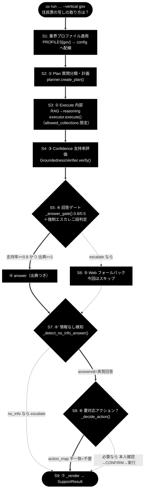

# agent_support_example.py - 1 コマンド実行トレース（`--vertical gov`）

**Version 1.2** | 最終更新: 2026-07-08

> 本書は [`agent_support_example.md`](./agent_support_example.md) の姉妹編。
> 設計書 §1「アーキテクチャ構成図（回答判定フロー）」の流れに沿って、
> **1 本のコマンドが実際にどのモジュール・コードを通り、どんなデータ（IN/OUT）が
> 受け渡されるか**を追跡する。設計の全体像は [`agent_support_example.md`](./agent_support_example.md)、
> 業界特化の全体設計は [`agent_support_verticals.md`](./agent_support_verticals.md)、
> 自治体プロファイルの詳細は [`../../docs/vertical_gov.md`](../../docs/vertical_gov.md) を参照。

---

## 目次

- [0. 対象コマンドと前提](#0-対象コマンドと前提)
- [1. 全体フロー図（トレース経路）](#1-全体フロー図トレース経路)
- [2. ステップ別トレース（モジュール・コード・データ IN/OUT）](#2-ステップ別トレースモジュールコードデータ-inout)
  - [S0. 起動・引数解釈](#s0-起動引数解釈mainrun_support_agent)
  - [S1. 業界プロファイル適用（gov）](#s1-業界プロファイル適用gov)
  - [S2. ① Plan（質問分類・計画）](#s2--plan質問分類計画)
  - [S3. ② Execute（内部 RAG → reasoning）](#s3--execute内部-rag--reasoning)
  - [S4. ③ Confidence（支持率評価）](#s4--confidence支持率評価)
  - [S5. ④ 回答ゲート＋強制エスカレ（二段判定）](#s5--回答ゲート強制エスカレ二段判定)
  - [S6. ⑤ Web フォールバック（今回はスキップ）](#s6--web-フォールバック今回はスキップ)
  - [S7. ④' 情報なし回答検知](#s7--情報なし回答検知)
  - [S8. ⑥ Action（今回は起票なし）](#s8--action今回は起票なし)
  - [S9. ⑦ 応答整形（SupportResult）](#s9--応答整形supportresult)
- [3. データの積み上がり（SupportResult 最終形）](#3-データの積み上がりsupportresult-最終形)
- [4. 分岐の読み替え（別入力ならどこが変わるか）](#4-分岐の読み替え別入力ならどこが変わるか)
- [5. 変更履歴](#5-変更履歴)

---

## 0. 対象コマンドと前提

```bash
uv run python agent_support_example.py --vertical gov "住民票の写しの取り方は？"
```

| 項目 | 値 |
|------|----|
| クエリ | `"住民票の写しの取り方は？"`（自治体 in-scope の代表質問） |
| プロファイル | `gov`（`PROFILES["gov"]` = 自治体） |
| しきい値 | `notify_th=0.8` / `confirm_th=0.5`（3 業種で最も厳格） |
| 検索スコープ | `gov_faq_anthropic` / `gov_laws_anthropic` / `wikipedia_ja`（暫定代替） |
| Web フォールバック | 有効（`--no-web` 未指定） |
| アクション | 有効（`--no-action` 未指定）・既定ドライラン |
| 本人確認 | 不要（gov は `require_identity=False`） |

**前提**: `.env` に `ANTHROPIC_API_KEY`（LLM）／`GOOGLE_API_KEY`（Embedding）、Qdrant 起動済み。
本トレースは gov の代表質問が**内部 RAG で回答できた（answer）** 場合を主線とし、
別入力での分岐は §4 に整理する。

---

## 1. 全体フロー図（トレース経路）

設計書 §1 のフロー図のうち、本コマンドが**実際に通る経路を太線**で示す（`gov` in-scope → answer）。



> 太線（`==>`）が本コマンドの実経路。点線（`-.->`）は今回は通らない分岐（§4 で読み替え）。

---

## 2. ステップ別トレース（モジュール・コード・データ IN/OUT）

各ステップを **モジュール / コード（関数・行） / データ（IN・OUT）** の 3 点で示す。
各ステップはまず **使用例**（`# 使用例` の Python ブロック＝そのステップの実際の呼び出し）を挙げ、
続く `text` ブロックを **IN（入力）→ Process（呼び出すクラス・関数と処理）→ OUT（出力＝Process の生成物）** の
3 段で読む。行番号は `agent_support_example.py` の実装（本書作成時点）に対応。

### S0. 起動・引数解釈（`main()`→`run_support_agent`）

| 観点 | 内容 |
|------|------|
| **モジュール** | `agent_support_example.py` |
| **コード** | `main()`（argparse）→ `run_support_agent(query, ..., vertical="gov", identity=None)` |
| **処理** | 1. `argparse` が `--vertical gov` と位置引数 `query` を解釈<br>2. `--identity` 未指定なので `identity=None`<br>3. `ANTHROPIC_API_KEY` の存在をガード（未設定なら警告して `None` 返却） |

```python
# 使用例
# uv run python agent_support_example.py --vertical gov "住民票の写しの取り方は？"
```

```text
IN     : argv = ["--vertical", "gov", "住民票の写しの取り方は？"]
Process: main() … argparse.parse_args() で argv を解釈し、--identity 未指定→None、
         ANTHROPIC_API_KEY をガードしてから run_support_agent(...) を呼ぶ
OUT    : run_support_agent(
             query="住民票の写しの取り方は？",
             verbose=False, use_web=True, do_action=True, dry_run=True,
             vertical="gov", identity=None)
```

### S1. 業界プロファイル適用（gov）

| 観点 | 内容 |
|------|------|
| **モジュール** | `agent_support_example.py`（`PROFILES`）＋ `grace.config`（`get_config`） |
| **コード** | `profile = PROFILES.get("gov")` → `config.qdrant.allowed_collections` / `config.llm.prompt_addendum` へ配線 |
| **処理** | 1. `get_config()` で共通設定を取得し、planner/executor/verifier/tool_registry/intervention を生成<br>2. `create_intent_classifier(config)` / `create_no_info_judge(config)`（軽量 `claude-haiku-4-5-20251001`）を用意（**この時点では呼ばない**。候補一致時のみ発火）<br>3. gov プロファイルで `notify_th=0.8 / confirm_th=0.5` に上書き<br>4. **検索スコープと方針をコア config へ書き込む**（tools は config 参照を保持するため実行時に効く） |

```python
# 使用例
config = get_config()
profile = PROFILES.get("gov")
config.qdrant.allowed_collections = list(profile.collections)
config.llm.prompt_addendum = profile.prompt_addendum
notify_th = profile.notify_th   # -> 0.8
```

```text
IN     : vertical="gov"
Process: run_support_agent() 内 … get_config() で config 取得、
         planner/executor/verifier/tool_registry/intervention を生成、
         PROFILES.get("gov") で profile を取得し、
         config.qdrant.allowed_collections / config.llm.prompt_addendum へ配線
OUT    : profile = VerticalProfile(name="自治体",
             collections=["gov_faq_anthropic","gov_laws_anthropic","wikipedia_ja"],
             escalate_keywords=["法的","訴訟","減免","個別","例外","不服"],
             action_map={"申請":"send_reply","手続":"send_reply","様式":"send_reply"},
             require_identity=False, notify_th=0.8, confirm_th=0.5,
             prompt_addendum="条例・公式案内に基づき、断定を避け、該当ページ・担当課を明示。個人情報は尋ねない。")
         config.qdrant.allowed_collections = [...gov 3 コレクション...]   # RAG 検索を限定
         config.llm.prompt_addendum        = "条例・公式案内に基づき…"      # reasoning へ注入
         notify_th=0.8 / confirm_th=0.5
```

**端末出力（抜粋）**:
```text
============================================================
業界プロファイル: 自治体（--vertical gov）
============================================================
  検索スコープ: gov_faq_anthropic, gov_laws_anthropic, wikipedia_ja（未登録コレクションは自動的に無視）
  しきい値: notify=0.8 / confirm=0.5 / 本人確認=False
  方針(reasoningへ注入): 条例・公式案内に基づき、断定を避け、該当ページ・担当課を明示。個人情報は尋ねない。
```

### S2. ① Plan（質問分類・計画）

| 観点 | 内容 |
|------|------|
| **モジュール** | `grace/planner.py`（`Planner.create_plan`） |
| **コード** | `plan = planner.create_plan(query)` |
| **処理** | LLM がクエリの複雑度を推定し、`rag_search`（必要なら `reasoning`）ステップからなる `ExecutionPlan` を生成 |

```python
# 使用例
plan = planner.create_plan("住民票の写しの取り方は？")
print(len(plan.steps), plan.complexity)   # -> 2 0.35
```

```text
IN     : query="住民票の写しの取り方は？"
Process: Planner.create_plan(query) … LLM がクエリの複雑度を推定し、
         rag_search（必要なら reasoning）ステップからなる ExecutionPlan を生成
OUT    : plan = ExecutionPlan(
             steps=[ PlanStep(step_id=1, action="rag_search", ...),
                     PlanStep(step_id=2, action="reasoning", ...) ],
             complexity=<0.0-1.0>)
```

**端末出力**: `[plan] 2 ステップ (complexity=0.35)` のような 1 行。

### S3. ② Execute（内部 RAG → reasoning）

| 観点 | 内容 |
|------|------|
| **モジュール** | `grace/executor.py`＋`grace/tools.py`（`RAGSearchTool` / `ReasoningTool`） |
| **コード** | `result = executor.execute(plan)` → `internal_answer` / `internal_citations = _collect_citations(result.step_results)` |
| **処理** | 1. `RAGSearchTool` が Qdrant を検索。**S1 で設定した `allowed_collections` により gov 3 コレクションへ限定**（`_apply_allowed_collections`。未登録は無視、1 つも無ければ制限なし）<br>2. スコア不足時は executor が `web_search` を**動的挿入**（その出典は `[Web]` ラベルになる）<br>3. `ReasoningTool._build_prompt()` が **S1 の `prompt_addendum` を「業務方針（遵守）」としてシステム指示直後に注入**し、根拠から日本語回答を生成 |

```python
# 使用例
result = executor.execute(plan)
internal_answer = result.final_answer or ""
internal_citations = _collect_citations(result.step_results)
```

```text
IN     : plan（②の計画）, config.qdrant.allowed_collections（gov 3 件）, config.llm.prompt_addendum（gov 方針）
Process: executor.execute(plan) … RAGSearchTool が Qdrant を allowed_collections で限定検索
         → （スコア不足なら web_search を動的挿入）→ ReasoningTool._build_prompt() が
         prompt_addendum を注入して回答生成。_collect_citations() で出典にラベル付与
OUT    : result = ExecutionResult(
             final_answer="住民票の写しは、お住まいの市区町村の窓口（市民課等）または"
                          "コンビニ交付・郵送で請求できます。本人確認書類が必要です。"
                          "詳しくは担当課の案内ページをご確認ください。",
             step_results=[StepResult(step_id=1, status="success", sources=["gov_faq_anthropic/住民票.md"]), ...],
             overall_confidence=<0.0-1.0>)
         internal_answer   = result.final_answer
         internal_citations = ["[社内] gov_faq_anthropic/住民票.md", ...]
         used_dynamic_web  = False   # [Web] ラベルが無い＝内部だけで回答
```

**端末出力（抜粋）**: `step1: success (sources=3)` / `step2: success (sources=0)`。

### S4. ③ Confidence（支持率評価）

| 観点 | 内容 |
|------|------|
| **モジュール** | `grace/confidence.py`（`GroundednessVerifier.verify`） |
| **コード** | `gres = verifier.verify(query, internal_answer, [_citation_text(c) for c in internal_citations])` |
| **処理** | 回答を主張に分解し、各主張が出典に **supported / contradicted / neutral** のどれかを判定。支持率 = supported / (supported+contradicted)。出典が無い／LLM 失敗時は `verified=False` |

```python
# 使用例
gres = verifier.verify(query, internal_answer,
                       [_citation_text(c) for c in internal_citations])
print(gres.support_rate)   # -> 0.86
```

```text
IN     : query, internal_answer, sources=["gov_faq_anthropic/住民票.md", ...]（ラベル除去済み本文/識別子）
Process: GroundednessVerifier.verify(query, answer, sources) … 回答を主張に分解し、
         各主張を supported/contradicted/neutral に判定。支持率=supported/(supported+contradicted)
OUT    : gres = GroundednessResult(
             support_rate=0.86, supported=3, contradicted=0, total=4,
             has_contradiction=False, verified=True)
```

**端末出力**: `[groundedness] 支持率=0.86（判定可能 3/4 主張） / 出典数=3`。

### S5. ④ 回答ゲート＋強制エスカレ（二段判定）

| 観点 | 内容 |
|------|------|
| **モジュール** | `agent_support_example.py`（`_answer_gate` / `_should_force_escalate` / `_should_rescue_unaffirmed`） |
| **コード** | `decision, warning = _answer_gate(support_rate, verified, citation_count, notify_th=0.8, confirm_th=0.5)` → `_should_force_escalate(query, profile, classify)` |
| **処理** | 1. **回答ゲート**: `verified=True` かつ 出典≥1 かつ 支持率0.86≥notify0.8 → `("answer", warning=False)`<br>2. **強制エスカレ（第 1 段）**: `_match_keyword(query, escalate_keywords)` — クエリに `法的/訴訟/減免/個別/例外/不服` は**含まれない** → 候補なし → **意図分類 LLM は呼ばれない（追加コスト 0）**<br>3. `_should_rescue_unaffirmed` は `decision != "escalate"` なので発火せず（救済不要） |

```python
# 使用例
decision, warning = _answer_gate(0.86, True, 3, notify_th=0.8, confirm_th=0.5)
forced, kw, intent = _should_force_escalate(query, profile, classify)
# -> decision="answer", warning=False, forced=False, kw=None, intent=None
```

```text
IN     : support_rate=0.86, verified=True, citation_count=3, notify_th=0.8, confirm_th=0.5
         query="住民票の写しの取り方は？", profile=gov
Process: _answer_gate(...) が 支持率0.86≥notify0.8 かつ 出典3≥1 → ("answer", False)。
         _should_force_escalate(query, gov, classify) が _match_keyword で候補なし→強制エスカレせず
         （classify=意図分類LLMは未実行）。_should_rescue_unaffirmed は escalate でないため不発。
         結果を SupportResult に集約
OUT    : (decision, warning) = ("answer", False)
         forced_escalate=False, matched_kw=None, intent=None   # エスカレ語なし → classify 未実行
         support = SupportResult(answer=..., citations=[3件], groundedness=0.86,
                                 groundedness_decided=3, decision="answer",
                                 warning=False, used_web=False, vertical="gov",
                                 overall_confidence=...)
```

> 別入力例: 「固定資産税の**減免**を**個別**に判断してほしい」なら第 1 段が `減免` に一致 →
> 第 2 段の意図分類が `request` → **強制エスカレ**（Web もスキップ）。詳細は §4。

### S6. ⑤ Web フォールバック（今回はスキップ）

| 観点 | 内容 |
|------|------|
| **モジュール** | `grace/tools.py`（`web_search` / `reasoning`）＋ `SourceAgreementCalculator` |
| **コード** | `if decision == "escalate" and use_web and not forced_escalate:` |
| **処理** | 条件は `decision == "escalate"`。今回は **`decision == "answer"` のため丸ごとスキップ**（Web 検索・相互検証は走らない） |

```python
# 使用例
if decision == "escalate" and use_web and not forced_escalate:
    web_res = tool_registry.execute("web_search", query=query)
    # …（今回は decision="answer" のため未実行）
```

```text
IN     : decision="answer", use_web=True, forced_escalate=False
Process: `if decision == "escalate" and use_web and not forced_escalate:` の条件評価。
         decision="answer" のため条件不成立 → ⑤ ブロック全体をスキップ
OUT    : （分岐に入らない。support は S5 のまま）
```

> `decision` が escalate だった場合のみ、内部が Web を使い済みなら**再検証のみ**（重複推論を省略、`web_reused=True`）、
> 未使用なら `web_search → reasoning → 相互検証` を実行する。

### S7. ④' 情報なし回答検知

| 観点 | 内容 |
|------|------|
| **モジュール** | `agent_support_example.py`（`_detect_no_info_answer` / `create_no_info_judge`） |
| **コード** | `if support.decision == "answer" and support.answer:` → `_detect_no_info_answer(query, answer, no_info_judge, force_judge=web_only)` |
| **処理** | 1. `web_only = 出典がすべて [Web]?` → 今回は `[社内]` 出典があるので **False**<br>2. 第 1 段: `NO_INFO_MARKERS`（「見当たりません」等）が回答に含まれるか → 含まれない → **候補なし**<br>3. `force_judge=False` かつ候補なし → **LLM 判定は呼ばれず** `no_info=False`（実質回答として維持） |

```python
# 使用例
web_only = bool(support.citations) and all(c.startswith("[Web]") for c in support.citations)
no_info, marker = _detect_no_info_answer(query, support.answer, no_info_judge, force_judge=web_only)
# -> no_info=False, marker=None（実質回答 → answer 維持）
```

```text
IN     : query, answer（住民票の取り方の実質回答）, force_judge=False, citations に [社内] を含む
Process: web_only = all(c.startswith("[Web]")) → False。
         _detect_no_info_answer() 第1段: _match_keyword(answer, NO_INFO_MARKERS) 不一致 →
         force_judge=False かつ候補なしのため no_info_judge（LLM）は未実行 → False
OUT    : (no_info, marker) = (False, None)   # 実質回答 → decision="answer" を維持
```

> 出典が Web のみ（社内根拠ゼロ）の回答は `force_judge=True` になり、候補句が無くても
> 軽量 LLM が「実質回答か／確認方法の案内だけか」を判定する（out-of-scope×動的 Web の answer 化対策）。

### S8. ⑥ Action（今回は起票なし）

| 観点 | 内容 |
|------|------|
| **モジュール** | `agent_support_example.py`（`_decide_action`）＋ `support_actions.py`（`_perform_action` 経由・今回未使用） |
| **コード** | `action = _decide_action(query, support.decision, profile, classify)` |
| **処理** | 1. `decision="answer"` なので有人エスカレは選ばれない<br>2. 第 1 段: `_match_keyword(query, profile.action_map=申請/手続/様式)` → 「住民票の写しの取り方」に**該当語なし** → 候補なし<br>3. `action = None` → **⑥ ブロックに入らない**（CONFIRM も本人確認も走らない） |

```python
# 使用例
action = _decide_action(query, support.decision, profile, classify)
# -> None（action_map に「取り方」の候補なし → 起票せず）
```

```text
IN     : query="住民票の写しの取り方は？", decision="answer", profile.action_map={申請,手続,様式→send_reply}
Process: _decide_action() … decision="answer" で有人エスカレは非選択、
         _match_keyword(query, action_map) が「取り方」に候補なし → classify 未実行 → None。
         action が None なので ⑥（本人確認→CONFIRM→backend.execute）には入らない
OUT    : action = None   # アクションなし
```

> 別入力例: 「保育園の**申請**様式がほしい」なら第 1 段が `申請` に一致 → 第 2 段 `request` →
> `send_reply` を **本人確認（gov は不要）→ CONFIRM 承認 → backend.execute(dry-run)** で擬似実行。§4 参照。

### S9. ⑦ 応答整形（SupportResult）

| 観点 | 内容 |
|------|------|
| **モジュール** | `agent_support_example.py`（`_render`） |
| **コード** | `support.forced_escalate=False` / `support.intent=None` を確定 → `_render(support)` → `return support` |
| **処理** | `decision="answer"` なので回答本文＋出典一覧＋根拠メタ行を表示。KPI 計測用メタ（vertical/intent/forced/no_info/web_reused）も付与 |

```python
# 使用例
support.forced_escalate = forced_escalate
support.intent = _intent_cache.get(query)
_render(support)
return support
```

```text
IN     : support（S5〜S7 で確定した SupportResult）
Process: support.forced_escalate / support.intent を確定した後、
         _render(support) が回答本文＋出典一覧＋根拠メタ行を整形表示し、
         run_support_agent() が support を return
OUT    : 端末表示 ＋ 呼び出し元へ SupportResult を返却
```

**端末出力（抜粋）**:
```text
============================================================
応答
============================================================
住民票の写しは、お住まいの市区町村の窓口（市民課等）または…（本文）

【出典】
  [1] [社内] gov_faq_anthropic/住民票.md
  [2] [社内] gov_faq_anthropic/窓口案内.md

[根拠] 支持率(groundedness)=0.86 / 全体信頼度=0.78 / decision=answer / web=不使用 / vertical=gov
```

---

## 3. データの積み上がり（SupportResult 最終形）

同じ `SupportResult` インスタンスが各ステップで少しずつ埋まっていく。本コマンドの最終形:

| フィールド | 値 | 埋めたステップ |
|---|---|---|
| `answer` | 住民票の取り方の回答本文 | S3（② Execute） |
| `citations` | `["[社内] gov_faq_anthropic/…", …]` | S3（`_collect_citations`） |
| `groundedness` | `0.86` | S4（③ Confidence） |
| `groundedness_decided` | `3` | S4 |
| `decision` | `"answer"` | S5（④ ゲート） |
| `warning` | `False` | S5 |
| `used_web` | `False` | S3/S6 |
| `web_reused` | `False` | S6（未発火） |
| `action` / `action_result` | `None` / `None` | S8（未発火） |
| `vertical` | `"gov"` | S1 |
| `intent` | `None`（分類器未発火） | S5 |
| `forced_escalate` | `False` | S5 |
| `identity_checked` | `False` | S8 |
| `no_info_detected` | `False` | S7 |
| `overall_confidence` | executor 由来 | S3 |

> ポイント: gov の in-scope 質問では**軽量 LLM（意図分類・情報なし判定）が一度も呼ばれない**。
> 二段判定はいずれも「第 1 段の候補検出で不一致 → 第 2 段スキップ」で終わり、追加コストは 0。
> LLM 呼び出しは ① Plan・② reasoning・③ groundedness の主要 3 系統に限られる。

---

## 4. 分岐の読み替え（別入力ならどこが変わるか）

同じ gov プロファイルでも入力次第で経路が変わる。主な分岐を S 番号で対応づける。

| 入力例 | 変わるステップ | 挙動 |
|---|---|---|
| 「固定資産税の**減免**を**個別**に判断してほしい」 | **S5** | 第 1 段が `減免` に一致 → 第 2 段の意図分類が `request` → **強制エスカレ**（`decision="escalate"`・Web もスキップ・`forced_escalate=True`） |
| 「住民税の**減免**制度の概要を教えて」（keyword-trap） | **S5** | 第 1 段は `減免` に一致するが第 2 段が `question` → **誤検知抑止**して通常フロー継続 → answer |
| 「来年の税制改正の予測は？」（out-of-scope） | **S6→S7** | 内部根拠なし→ escalate→⑤ Web→ 実質回答風になっても **④' が将来予測×非確定情報を no_info と判定 → escalate**（`no_info_detected=True`） |
| 「保育園の**申請**様式がほしい」 | **S8** | `_decide_action` 第 1 段が `申請` に一致 → 第 2 段 `request` → `send_reply` を **CONFIRM 承認 → backend(dry-run) で擬似実行**（gov は本人確認なし） |
| 内部支持率が 0.5〜0.8 のとき | **S5** | `_answer_gate` が `("answer", warning=True)` → 「未確認の注意書き」つきで回答 |
| 内部が出典 0／verified=False | **S5→S6** | ゲートが escalate → **⑤ Web フォールバック**で裏取り（成功なら answer、なお不足なら escalate） |

> EC（`--vertical ec`）の「返品したい」では S8 で `require_identity=True` により
> **本人確認 → CONFIRM → 実行** の順になる（`identity_checked=True`）。詳細は
> [`agent_support_verticals.md` §5](./agent_support_verticals.md)。

---

## 5. 変更履歴

| バージョン | 変更内容 |
|-----------|---------|
| 1.0 | 初版。`uv run python agent_support_example.py --vertical gov "住民票の写しの取り方は？"` の 1 実行を、設計書 §1 の回答判定フローに沿って S0〜S9 でトレース。各ステップをモジュール・コード・データ（IN/OUT）で記述し、SupportResult の積み上がり・別入力の分岐（強制エスカレ・keyword-trap・④' 情報なし・アクション・本人確認）を整理 |
| 1.1 | 各 `text` ブロックの IN と OUT の間に **Process 行**（呼び出すクラス・関数と処理内容。OUT はその生成物）を追加し、IN → Process → OUT の 3 段構成に統一（S0〜S9 の全 10 ブロック） |
| 1.2 | 各ステップの IN/Process/OUT ブロックの前に **使用例**（`# 使用例` の Python ブロック＝そのステップの実際の呼び出し）を追加（S0〜S9）。§2 冒頭に読み方（使用例 → IN → Process → OUT）を明記 |
